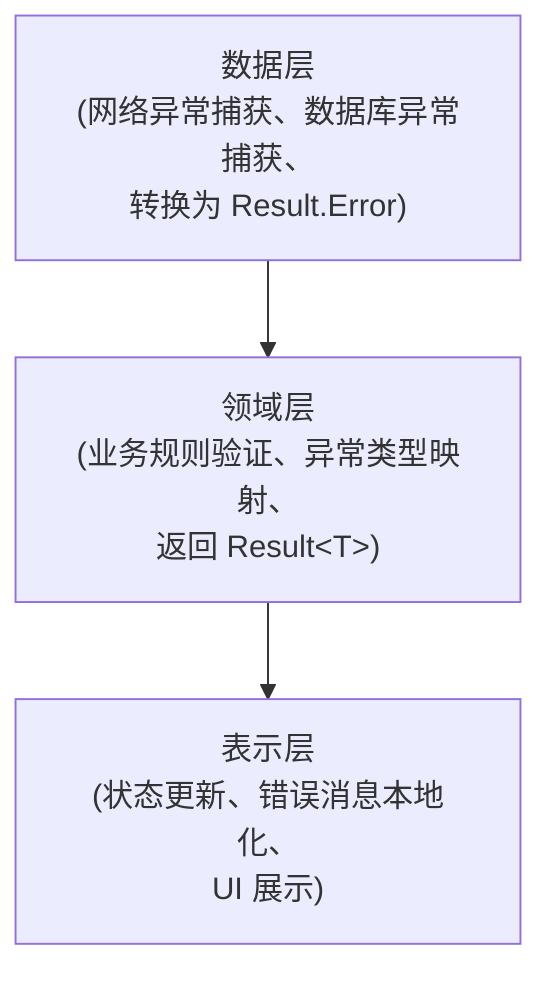

# Android 错误处理

> Result 封装 + 异常分类 + 用户反馈

---

## 1. 错误处理概览



---

## 2. Result 封装

### 2.1 Result 类型

```
┌─────────────────────────────────────────────────────────────────┐
│                    Result 类型定义                               │
├─────────────────────────────────────────────────────────────────┤
│                                                                  │
│  sealed class Result<out T>                                    │
│  │                                                              │
│  ├── Success<T>                                                │
│  │   └── data: T                                               │
│  │                                                              │
│  ├── Error                                                     │
│  │   ├── exception: AppException                               │
│  │   └── data: T? (可选缓存数据)                               │
│  │                                                              │
│  └── Loading                                                   │
│      └── data: T? (可选旧数据)                                 │
│                                                                  │
└─────────────────────────────────────────────────────────────────┘
```

### 2.2 扩展函数

| 函数 | 说明 |
|------|------|
| onSuccess { } | 成功回调 |
| onError { } | 错误回调 |
| onLoading { } | 加载回调 |
| getOrNull() | 获取数据或 null |
| getOrDefault(default) | 获取数据或默认值 |
| map { } | 数据转换 |

---

## 3. 异常分类

### 3.1 异常层级

```
┌─────────────────────────────────────────────────────────────────┐
│                    异常类型层级                                   │
├─────────────────────────────────────────────────────────────────┤
│                                                                  │
│  AppException (基类)                                            │
│  ├── message: String                                           │
│  ├── cause: Throwable?                                         │
│  └── errorCode: ErrorCode                                      │
│                                                                  │
│  NetworkException                                               │
│  ├── NoConnectionException                                     │
│  ├── TimeoutException                                          │
│  └── ServerException(httpCode, serverMessage)                  │
│                                                                  │
│  ApiException                                                   │
│  ├── UnauthorizedException                                     │
│  ├── ForbiddenException                                        │
│  ├── NotFoundException                                         │
│  └── ValidationException(errors)                               │
│                                                                  │
│  DatabaseException                                              │
│  ├── ReadException                                             │
│  ├── WriteException                                            │
│  └── MigrationException                                        │
│                                                                  │
│  BusinessException                                              │
│  ├── BookNotFoundException                                     │
│  ├── InvalidFormatException                                    │
│  └── QuotaExceededException                                    │
│                                                                  │
└─────────────────────────────────────────────────────────────────┘
```

### 3.2 错误码映射

| HTTP 状态码 | 异常类型 |
|-------------|----------|
| 401 | UnauthorizedException |
| 403 | ForbiddenException |
| 404 | NotFoundException |
| 422 | ValidationException |
| 429 | RateLimitException |
| 500+ | ServerException |

---

## 4. 数据层错误处理

### 4.1 Repository 模式

```
┌─────────────────────────────────────────────────────────────────┐
│                    Repository 错误处理                           │
├─────────────────────────────────────────────────────────────────┤
│                                                                  │
│  safeApiCall { }                                                │
│  ├── 捕获 IOException → NetworkException                        │
│  ├── 捕获 HttpException → ApiException                          │
│  └── 捕获 其他 → UnknownException                               │
│                                                                  │
│  safeDatabaseCall { }                                           │
│  ├── 捕获 SQLiteException → DatabaseException                   │
│  └── 捕获 其他 → DatabaseException                              │
│                                                                  │
│  组合策略                                                        │
│  ├── 网络失败 → 尝试缓存                                        │
│  ├── 缓存命中 → 返回 Success + 标记过期                         │
│  └── 都失败 → 返回 Error                                        │
│                                                                  │
└─────────────────────────────────────────────────────────────────┘
```

### 4.2 网络拦截器

| 拦截器 | 职责 |
|--------|------|
| ErrorInterceptor | 统一错误格式转换 |
| RetryInterceptor | 自动重试策略 |
| AuthInterceptor | 401 自动刷新 Token |

---

## 5. 领域层错误处理

### 5.1 UseCase 模式

```
┌─────────────────────────────────────────────────────────────────┐
│                    UseCase 错误处理                              │
├─────────────────────────────────────────────────────────────────┤
│                                                                  │
│  invoke() 方法                                                   │
│  │                                                              │
│  ├── 1. 参数验证                                                │
│  │   └── 无效 → ValidationException                            │
│  │                                                              │
│  ├── 2. 业务规则检查                                            │
│  │   └── 违反 → BusinessException                              │
│  │                                                              │
│  ├── 3. 调用 Repository                                         │
│  │   └── 异常传播                                               │
│  │                                                              │
│  └── 4. 结果转换                                                │
│      └── 映射为业务友好类型                                      │
│                                                                  │
└─────────────────────────────────────────────────────────────────┘
```

### 5.2 验证错误

| 验证类型 | 说明 |
|----------|------|
| 必填验证 | 字段不能为空 |
| 格式验证 | 邮箱、手机号格式 |
| 范围验证 | 数值范围、长度限制 |
| 业务验证 | 自定义业务规则 |

---

## 6. 表示层错误处理

### 6.1 ViewModel 处理

```
┌─────────────────────────────────────────────────────────────────┐
│                    ViewModel 错误处理                            │
├─────────────────────────────────────────────────────────────────┤
│                                                                  │
│  收集 Result                                                    │
│  │                                                              │
│  ├── Success                                                   │
│  │   └── 更新 UiState.data                                     │
│  │                                                              │
│  ├── Loading                                                   │
│  │   └── 更新 UiState.isLoading = true                        │
│  │                                                              │
│  └── Error                                                     │
│      ├── 更新 UiState.error                                    │
│      ├── 发送 SideEffect (Toast/Snackbar)                      │
│      └── 特殊处理 (401 → 登出)                                  │
│                                                                  │
└─────────────────────────────────────────────────────────────────┘
```

### 6.2 错误消息本地化

| 异常类型 | 用户消息 |
|----------|----------|
| NoConnectionException | 网络连接失败，请检查网络设置 |
| TimeoutException | 请求超时，请稍后重试 |
| UnauthorizedException | 登录已过期，请重新登录 |
| ServerException | 服务器繁忙，请稍后重试 |

---

## 7. UI 错误展示

### 7.1 展示方式

```
┌─────────────────────────────────────────────────────────────────┐
│                    错误展示策略                                   │
├─────────────────────────────────────────────────────────────────┤
│                                                                  │
│  全屏错误                                                        │
│  ├── 场景: 页面加载失败                                          │
│  ├── 组件: ErrorScreen                                          │
│  └── 操作: 重试按钮                                              │
│                                                                  │
│  内联错误                                                        │
│  ├── 场景: 部分内容加载失败                                      │
│  ├── 组件: ErrorCard                                            │
│  └── 操作: 重试/忽略                                            │
│                                                                  │
│  Snackbar                                                       │
│  ├── 场景: 操作失败                                              │
│  ├── 组件: SnackbarHost                                         │
│  └── 操作: 重试/关闭                                            │
│                                                                  │
│  Dialog                                                         │
│  ├── 场景: 严重错误/确认操作                                     │
│  ├── 组件: AlertDialog                                          │
│  └── 操作: 确认/取消                                            │
│                                                                  │
└─────────────────────────────────────────────────────────────────┘
```

### 7.2 重试机制

| 策略 | 说明 |
|------|------|
| 手动重试 | 用户点击重试按钮 |
| 自动重试 | 网络恢复后自动 |
| 指数退避 | 逐渐增加重试间隔 |

---

## 8. 全局错误处理

### 8.1 未捕获异常

```
┌─────────────────────────────────────────────────────────────────┐
│                    全局异常处理                                   │
├─────────────────────────────────────────────────────────────────┤
│                                                                  │
│  Thread.setDefaultUncaughtExceptionHandler                     │
│  ├── 记录崩溃日志                                                │
│  ├── 上报 Crashlytics                                           │
│  └── 显示友好错误页面                                            │
│                                                                  │
│  CoroutineExceptionHandler                                      │
│  ├── viewModelScope 默认处理                                     │
│  └── 日志记录 + UI 反馈                                          │
│                                                                  │
│  Compose ErrorBoundary                                          │
│  ├── 捕获 Composable 异常                                       │
│  └── 显示降级 UI                                                │
│                                                                  │
└─────────────────────────────────────────────────────────────────┘
```

### 8.2 错误上报

| 工具 | 用途 |
|------|------|
| Firebase Crashlytics | 崩溃上报 |
| Sentry | 错误追踪 |
| 自定义日志 | 调试分析 |

---

## 9. 阅读器错误处理

### 9.1 阅读器特定错误

```
┌─────────────────────────────────────────────────────────────────┐
│                    阅读器错误处理                                 │
├─────────────────────────────────────────────────────────────────┤
│                                                                  │
│  书籍加载错误                                                    │
│  ├── 文件损坏 → 提示重新下载                                     │
│  ├── 格式不支持 → 提示支持格式                                   │
│  └── 权限不足 → 引导授权                                         │
│                                                                  │
│  渲染错误                                                        │
│  ├── 章节解析失败 → 跳过显示原始文本                             │
│  ├── 图片加载失败 → 显示占位图                                   │
│  └── 字体加载失败 → 使用系统字体                                 │
│                                                                  │
│  同步错误                                                        │
│  ├── 进度同步失败 → 本地保存稍后重试                             │
│  └── 笔记同步失败 → 标记待同步                                   │
│                                                                  │
└─────────────────────────────────────────────────────────────────┘
```

### 9.2 降级策略

| 场景 | 降级方案 |
|------|----------|
| 网络不可用 | 使用缓存数据 |
| 渲染失败 | 简化渲染模式 |
| AI 不可用 | 显示离线词典 |

---

## 10. 相关文档

| 文档 | 说明 |
|------|------|
| [architecture.md](./architecture.md) | 架构设计 |
| [testing.md](./testing.md) | 错误测试 |
| [monitoring.md](./monitoring.md) | 错误监控 |

---

*最后更新: 2025-12-31*
