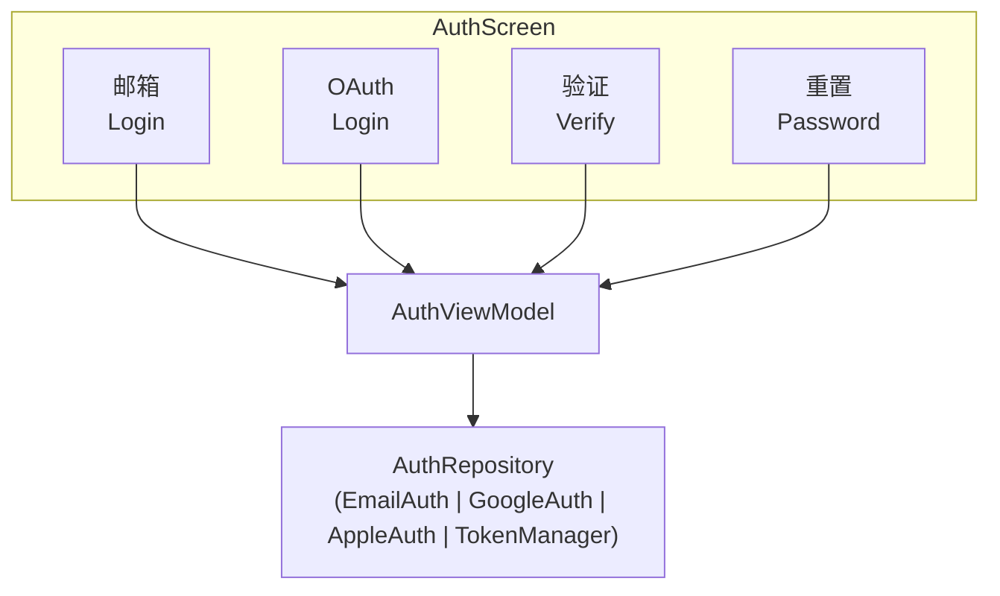
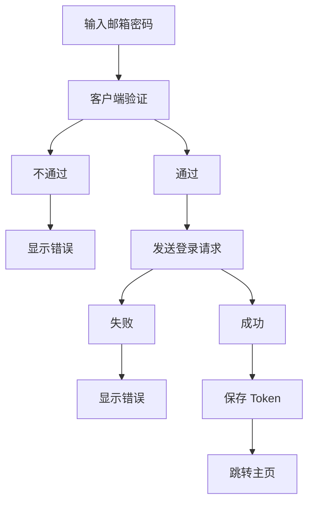
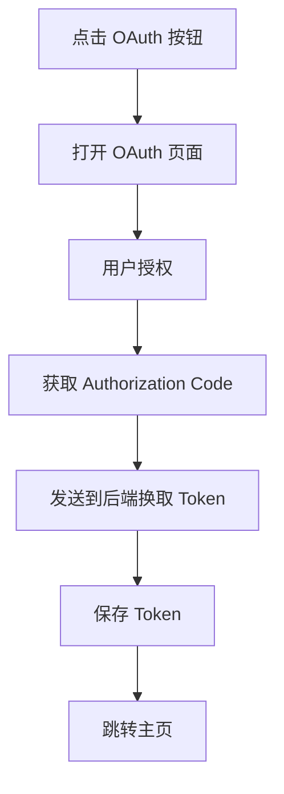
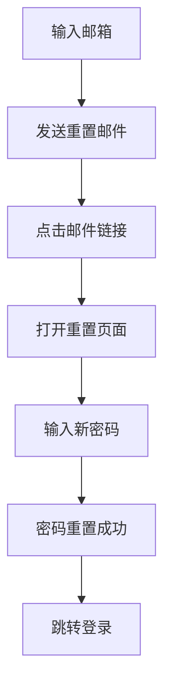

# Android 认证模块

> 登录注册 + OAuth + 会话管理

---

## 1. 模块概览



---

## 2. 登录方式

| 方式 | 说明 |
|------|------|
| 邮箱密码 | 传统登录 |
| Google | OAuth 登录 |
| Apple | Sign in with Apple |
| 手机验证码 | 短信验证 |

---

## 3. 登录流程

### 3.1 邮箱登录



### 3.2 OAuth 登录



---

## 4. 注册流程

### 4.1 邮箱注册

| 步骤 | 说明 |
|------|------|
| 1. 输入邮箱 | 验证格式 |
| 2. 输入密码 | 强度验证 |
| 3. 发送验证码 | 邮箱验证 |
| 4. 输入验证码 | 完成注册 |

### 4.2 验证要求

```
┌─────────────────────────────────────────────────────────────────┐
│                    输入验证                                      │
├─────────────────────────────────────────────────────────────────┤
│                                                                  │
│  邮箱验证                                                        │
│  ├── 格式正确                                                    │
│  └── 未被注册                                                    │
│                                                                  │
│  密码要求                                                        │
│  ├── 最少 8 位                                                  │
│  ├── 包含字母                                                    │
│  ├── 包含数字                                                    │
│  └── 可选特殊字符                                                │
│                                                                  │
│  验证码                                                          │
│  ├── 6 位数字                                                   │
│  ├── 5 分钟有效                                                 │
│  └── 最多 3 次尝试                                              │
│                                                                  │
└─────────────────────────────────────────────────────────────────┘
```

---

## 5. 会话管理

### 5.1 Token 管理

```
┌─────────────────────────────────────────────────────────────────┐
│                    Token 管理                                    │
├─────────────────────────────────────────────────────────────────┤
│                                                                  │
│  Token 类型                                                      │
│  ├── Access Token: 短期有效 (15 分钟)                           │
│  └── Refresh Token: 长期有效 (7 天)                             │
│                                                                  │
│  存储方式                                                        │
│  ├── 使用 EncryptedSharedPreferences                           │
│  └── Keystore 加密                                              │
│                                                                  │
│  刷新策略                                                        │
│  ├── Access Token 过期前自动刷新                                │
│  ├── 401 响应时尝试刷新                                          │
│  └── Refresh Token 过期则登出                                    │
│                                                                  │
└─────────────────────────────────────────────────────────────────┘
```

### 5.2 自动登录

| 场景 | 行为 |
|------|------|
| 有有效 Token | 自动进入主页 |
| Token 过期 | 尝试刷新 |
| 刷新失败 | 显示登录页 |

---

## 6. 密码管理

### 6.1 忘记密码



### 6.2 修改密码

| 要求 | 说明 |
|------|------|
| 验证当前密码 | 安全确认 |
| 新密码要求 | 同注册要求 |
| 确认新密码 | 二次确认 |

---

## 7. 安全措施

### 7.1 安全策略

```
┌─────────────────────────────────────────────────────────────────┐
│                    安全措施                                      │
├─────────────────────────────────────────────────────────────────┤
│                                                                  │
│  传输安全                                                        │
│  ├── HTTPS 加密                                                 │
│  ├── Certificate Pinning                                       │
│  └── 敏感数据不明文传输                                          │
│                                                                  │
│  存储安全                                                        │
│  ├── EncryptedSharedPreferences                                │
│  ├── Keystore 密钥存储                                          │
│  └── 不存储明文密码                                              │
│                                                                  │
│  防护措施                                                        │
│  ├── 登录失败限制                                                │
│  ├── 异常登录检测                                                │
│  └── 会话过期自动登出                                            │
│                                                                  │
└─────────────────────────────────────────────────────────────────┘
```

### 7.2 登录限制

| 限制 | 说明 |
|------|------|
| 失败次数 | 5 次后锁定 |
| 锁定时长 | 15 分钟 |
| 验证码 | 3 次失败后触发 |

---

## 8. 用户状态

### 8.1 状态管理

```
┌─────────────────────────────────────────────────────────────────┐
│                    用户状态                                      │
├─────────────────────────────────────────────────────────────────┤
│                                                                  │
│  UserSessionManager (@Singleton)                                │
│  │                                                              │
│  ├── currentUser: StateFlow<User?>                             │
│  ├── isLoggedIn: StateFlow<Boolean>                            │
│  ├── authState: StateFlow<AuthState>                           │
│  │                                                              │
│  └── AuthState                                                  │
│      ├── AUTHENTICATED   已认证                                 │
│      ├── GUEST           游客模式                               │
│      └── UNAUTHENTICATED 未认证                                 │
│                                                                  │
└─────────────────────────────────────────────────────────────────┘
```

### 8.2 游客模式

| 功能 | 可用性 |
|------|--------|
| 阅读 | 受限 |
| 书架 | 本地 |
| AI 功能 | 不可用 |
| 同步 | 不可用 |

---

## 9. UI 组件

### 9.1 登录界面

```
┌─────────────────────────────────────────────────────────────────┐
│                    登录界面组件                                   │
├─────────────────────────────────────────────────────────────────┤
│                                                                  │
│  LoginScreen                                                    │
│  ├── Logo                                                       │
│  ├── EmailTextField                                             │
│  ├── PasswordTextField                                          │
│  ├── LoginButton                                                │
│  ├── ForgotPasswordLink                                         │
│  ├── Divider ("或")                                             │
│  ├── GoogleSignInButton                                         │
│  ├── AppleSignInButton                                          │
│  └── RegisterLink                                               │
│                                                                  │
└─────────────────────────────────────────────────────────────────┘
```

### 9.2 输入验证

| 组件 | 验证 |
|------|------|
| 邮箱输入 | 实时格式验证 |
| 密码输入 | 强度指示 |
| 验证码 | 自动焦点切换 |

---

## 10. 相关文档

| 文档 | 说明 |
|------|------|
| [../architecture.md](../architecture.md) | 架构设计 |
| [../error-handling.md](../error-handling.md) | 错误处理 |
| [settings.md](./settings.md) | 账户设置 |

---

*最后更新: 2025-12-31*
