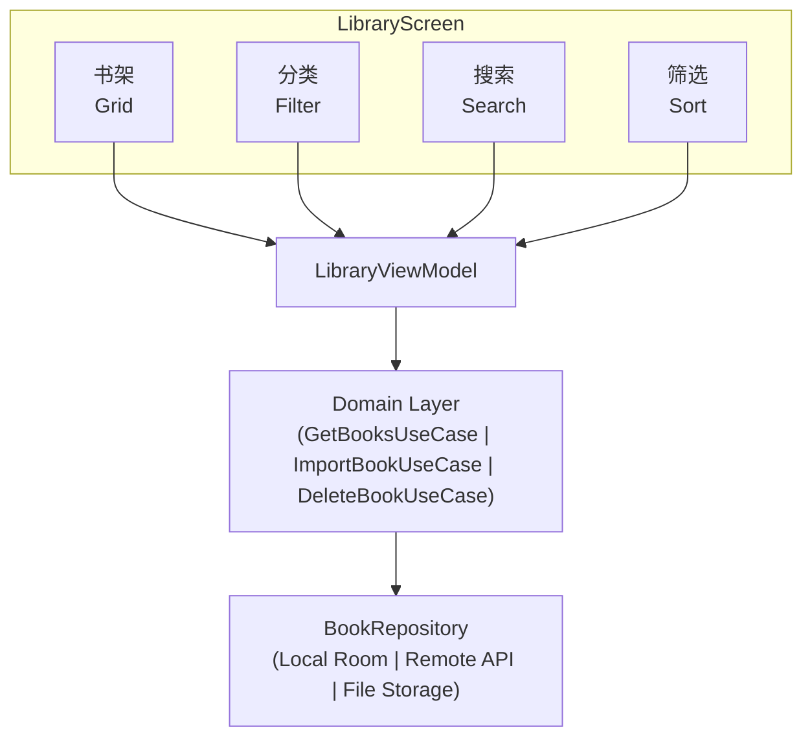
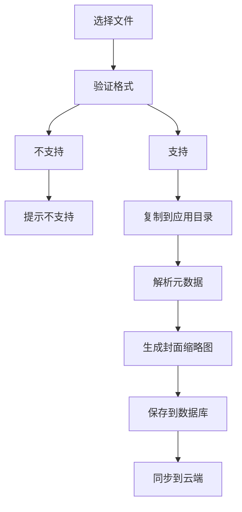

# Android 书架模块

> 书籍管理 + 导入 + 分类

---

## 1. 模块概览



---

## 2. 核心功能

| 功能 | 说明 |
|------|------|
| 书籍展示 | 网格/列表视图 |
| 书籍导入 | 本地文件导入 |
| 分类管理 | 书架分类 |
| 阅读统计 | 阅读进度、时长 |
| 批量操作 | 多选、删除 |

---

## 3. 书籍展示

### 3.1 展示模式

```
┌─────────────────────────────────────────────────────────────────┐
│                    展示模式                                      │
├─────────────────────────────────────────────────────────────────┤
│                                                                  │
│  网格模式 (默认)                                                 │
│  ├── 3 列布局                                                   │
│  ├── 封面 + 标题 + 进度                                         │
│  └── 适合浏览                                                    │
│                                                                  │
│  列表模式                                                        │
│  ├── 单列布局                                                    │
│  ├── 封面 + 标题 + 作者 + 详情                                  │
│  └── 适合查看详情                                                │
│                                                                  │
│  紧凑模式                                                        │
│  ├── 4 列布局                                                   │
│  ├── 仅封面                                                      │
│  └── 适合大量书籍                                                │
│                                                                  │
└─────────────────────────────────────────────────────────────────┘
```

### 3.2 排序方式

| 排序 | 说明 |
|------|------|
| 最近阅读 | 按阅读时间降序 |
| 添加时间 | 按导入时间降序 |
| 书名 | 字母顺序 |
| 作者 | 作者名排序 |
| 阅读进度 | 进度百分比 |

---

## 4. 书籍导入

### 4.1 导入方式

```
┌─────────────────────────────────────────────────────────────────┐
│                    导入方式                                      │
├─────────────────────────────────────────────────────────────────┤
│                                                                  │
│  本地文件                                                        │
│  ├── SAF 文件选择器                                             │
│  ├── 支持多选                                                    │
│  └── 后台处理                                                    │
│                                                                  │
│  分享导入                                                        │
│  ├── 其他应用分享                                                │
│  ├── Intent Filter 接收                                         │
│  └── 自动解析格式                                                │
│                                                                  │
│  云端导入                                                        │
│  ├── Google Drive                                               │
│  ├── Dropbox                                                    │
│  └── WebDAV                                                     │
│                                                                  │
│  URL 导入                                                        │
│  ├── 输入下载链接                                                │
│  └── 后台下载                                                    │
│                                                                  │
└─────────────────────────────────────────────────────────────────┘
```

### 4.2 导入流程



---

## 5. 分类管理

### 5.1 分类类型

| 类型 | 说明 |
|------|------|
| 系统分类 | 全部、正在阅读、已完成 |
| 用户分类 | 自定义书架 |
| 智能分类 | 按格式、语言自动分类 |

### 5.2 分类操作

```
┌─────────────────────────────────────────────────────────────────┐
│                    分类管理                                      │
├─────────────────────────────────────────────────────────────────┤
│                                                                  │
│  创建分类                                                        │
│  ├── 输入分类名称                                                │
│  ├── 选择图标/颜色                                               │
│  └── 设置排序位置                                                │
│                                                                  │
│  编辑分类                                                        │
│  ├── 修改名称                                                    │
│  ├── 更换图标                                                    │
│  └── 调整顺序                                                    │
│                                                                  │
│  删除分类                                                        │
│  ├── 确认删除                                                    │
│  └── 书籍移至"全部"                                              │
│                                                                  │
│  书籍分类                                                        │
│  ├── 拖拽移动                                                    │
│  ├── 长按选择                                                    │
│  └── 批量移动                                                    │
│                                                                  │
└─────────────────────────────────────────────────────────────────┘
```

---

## 6. 书籍详情

### 6.1 详情页面

```
┌─────────────────────────────────────────────────────────────────┐
│                    书籍详情                                      │
├─────────────────────────────────────────────────────────────────┤
│                                                                  │
│  基本信息                                                        │
│  ├── 封面                                                        │
│  ├── 书名                                                        │
│  ├── 作者                                                        │
│  ├── 出版社                                                      │
│  └── 描述                                                        │
│                                                                  │
│  阅读信息                                                        │
│  ├── 阅读进度                                                    │
│  ├── 阅读时长                                                    │
│  ├── 最后阅读时间                                                │
│  └── 添加时间                                                    │
│                                                                  │
│  文件信息                                                        │
│  ├── 格式                                                        │
│  ├── 大小                                                        │
│  └── 章节数                                                      │
│                                                                  │
│  操作按钮                                                        │
│  ├── 继续阅读                                                    │
│  ├── 编辑信息                                                    │
│  ├── 分享                                                        │
│  └── 删除                                                        │
│                                                                  │
└─────────────────────────────────────────────────────────────────┘
```

### 6.2 元数据编辑

| 字段 | 可编辑 |
|------|--------|
| 书名 | 是 |
| 作者 | 是 |
| 封面 | 是 |
| 描述 | 是 |
| 分类 | 是 |

---

## 7. 搜索与筛选

### 7.1 搜索功能

```
┌─────────────────────────────────────────────────────────────────┐
│                    搜索功能                                      │
├─────────────────────────────────────────────────────────────────┤
│                                                                  │
│  搜索范围                                                        │
│  ├── 书名                                                        │
│  ├── 作者                                                        │
│  └── 描述                                                        │
│                                                                  │
│  搜索特性                                                        │
│  ├── 实时搜索                                                    │
│  ├── 拼音支持                                                    │
│  ├── 模糊匹配                                                    │
│  └── 历史记录                                                    │
│                                                                  │
└─────────────────────────────────────────────────────────────────┘
```

### 7.2 筛选条件

| 筛选项 | 选项 |
|--------|------|
| 格式 | EPUB/PDF/TXT/MOBI |
| 阅读状态 | 未读/在读/已读 |
| 来源 | 本地/云端 |
| 语言 | 中文/英文/其他 |

---

## 8. 批量操作

### 8.1 多选模式

```
┌─────────────────────────────────────────────────────────────────┐
│                    批量操作                                      │
├─────────────────────────────────────────────────────────────────┤
│                                                                  │
│  进入多选                                                        │
│  ├── 长按书籍进入                                                │
│  ├── 点击其他书籍添加                                            │
│  └── 全选/取消全选                                               │
│                                                                  │
│  批量操作                                                        │
│  ├── 移动到分类                                                  │
│  ├── 删除                                                        │
│  ├── 导出                                                        │
│  └── 标记已读/未读                                               │
│                                                                  │
│  退出多选                                                        │
│  ├── 点击取消                                                    │
│  └── 返回键                                                      │
│                                                                  │
└─────────────────────────────────────────────────────────────────┘
```

### 8.2 操作确认

| 操作 | 需确认 |
|------|--------|
| 删除 | 是 |
| 移动 | 否 |
| 标记 | 否 |

---

## 9. 数据同步

### 9.1 同步内容

| 内容 | 同步方式 |
|------|----------|
| 书籍元数据 | 自动同步 |
| 阅读进度 | 实时同步 |
| 书籍文件 | 按需同步 |
| 分类信息 | 自动同步 |

### 9.2 同步策略

```
┌─────────────────────────────────────────────────────────────────┐
│                    同步策略                                      │
├─────────────────────────────────────────────────────────────────┤
│                                                                  │
│  自动同步                                                        │
│  ├── 元数据变更时                                                │
│  ├── 阅读进度变更时                                              │
│  └── 应用启动时                                                  │
│                                                                  │
│  手动同步                                                        │
│  ├── 下拉刷新                                                    │
│  └── 设置页触发                                                  │
│                                                                  │
│  冲突解决                                                        │
│  ├── 元数据: 服务器优先                                          │
│  └── 进度: 最后更新优先                                          │
│                                                                  │
└─────────────────────────────────────────────────────────────────┘
```

---

## 10. 相关文档

| 文档 | 说明 |
|------|------|
| [reader.md](./reader.md) | 阅读器 |
| [../offline.md](../offline.md) | 离线功能 |
| [../architecture.md](../architecture.md) | 架构设计 |

---

*最后更新: 2025-12-31*
