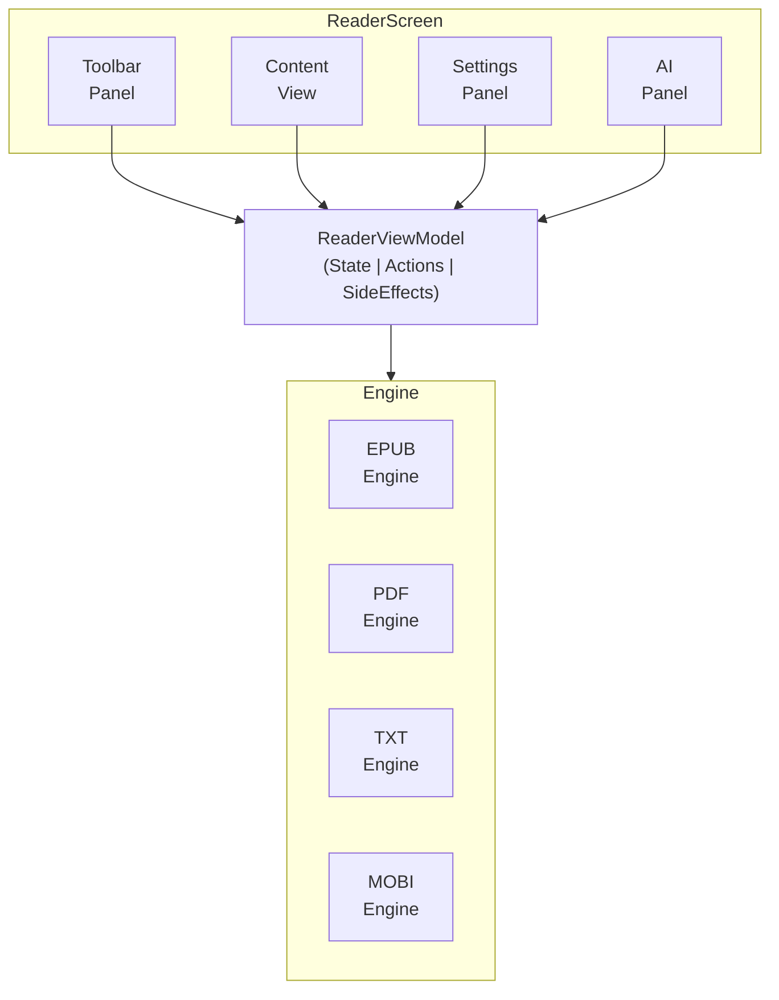
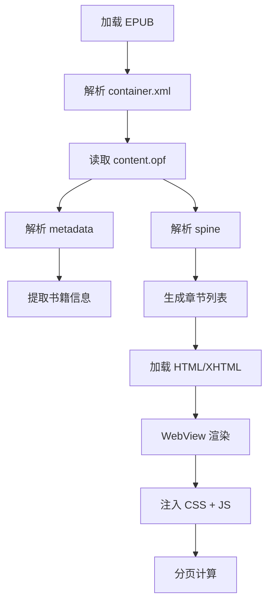

# Android 阅读器模块

> EPUB/PDF/TXT/MOBI 多格式阅读

---

## 1. 模块概览



---

## 2. 支持格式

| 格式 | 引擎 | 功能支持 |
|------|------|----------|
| EPUB | Foliate-based | 完整渲染、目录、高亮 |
| PDF | PdfRenderer | 页面渲染、缩放 |
| TXT | 自研解析 | 智能分章、排版 |
| MOBI | 自研转换 | 转 EPUB 后渲染 |

---

## 3. 核心功能

### 3.1 阅读功能

```
┌─────────────────────────────────────────────────────────────────┐
│                    阅读功能列表                                   │
├─────────────────────────────────────────────────────────────────┤
│                                                                  │
│  翻页模式                                                        │
│  ├── 横滑翻页                                                    │
│  ├── 竖滑滚动                                                    │
│  └── 点击翻页                                                    │
│                                                                  │
│  阅读设置                                                        │
│  ├── 字体大小 (12-32sp)                                         │
│  ├── 字体选择                                                    │
│  ├── 行间距                                                      │
│  ├── 页边距                                                      │
│  └── 主题配色                                                    │
│                                                                  │
│  导航功能                                                        │
│  ├── 目录跳转                                                    │
│  ├── 进度条拖动                                                  │
│  ├── 书签跳转                                                    │
│  └── 搜索定位                                                    │
│                                                                  │
│  标注功能                                                        │
│  ├── 文本高亮                                                    │
│  ├── 划线标注                                                    │
│  ├── 添加笔记                                                    │
│  └── 书签管理                                                    │
│                                                                  │
└─────────────────────────────────────────────────────────────────┘
```

### 3.2 AI 功能

| 功能 | 说明 |
|------|------|
| 查词释义 | 选中文本查询词义 |
| 句子翻译 | 整句翻译 |
| 段落解读 | AI 解读段落内容 |
| 智能问答 | 基于上下文问答 |

---

## 4. 状态管理

### 4.1 ReaderState

```
┌─────────────────────────────────────────────────────────────────┐
│                    ReaderUiState                                 │
├─────────────────────────────────────────────────────────────────┤
│                                                                  │
│  书籍信息                                                        │
│  ├── bookId: String                                             │
│  ├── title: String                                              │
│  ├── author: String                                             │
│  └── format: BookFormat                                         │
│                                                                  │
│  阅读进度                                                        │
│  ├── currentChapter: Chapter                                    │
│  ├── currentPage: Int                                           │
│  ├── totalPages: Int                                            │
│  └── progress: Float (0-1)                                      │
│                                                                  │
│  UI 状态                                                         │
│  ├── isLoading: Boolean                                         │
│  ├── showToolbar: Boolean                                       │
│  ├── showSettings: Boolean                                      │
│  └── showAIPanel: Boolean                                       │
│                                                                  │
│  选中状态                                                        │
│  ├── selectedText: String?                                      │
│  └── selectionBounds: Rect?                                     │
│                                                                  │
└─────────────────────────────────────────────────────────────────┘
```

### 4.2 ReaderSettings

| 设置项 | 类型 | 默认值 |
|--------|------|--------|
| fontSize | Int | 18 |
| fontFamily | FontFamily | System |
| lineSpacing | Float | 1.5 |
| marginHorizontal | Dp | 16 |
| theme | ReaderTheme | Light |
| scrollMode | Boolean | false |

---

## 5. 渲染引擎

### 5.1 EPUB 渲染



### 5.2 PDF 渲染

| 组件 | 说明 |
|------|------|
| PdfRenderer | 系统 PDF 渲染 |
| Bitmap 缓存 | 页面位图缓存 |
| 手势处理 | 缩放、滑动 |

---

## 6. 文本选择

### 6.1 选择菜单

```
┌─────────────────────────────────────────────────────────────────┐
│                    文本选择菜单                                   │
├─────────────────────────────────────────────────────────────────┤
│                                                                  │
│  菜单项                                                          │
│  ├── 复制                                                        │
│  ├── 高亮                                                        │
│  ├── 划线                                                        │
│  ├── 笔记                                                        │
│  ├── 查词                                                        │
│  ├── 翻译                                                        │
│  └── 朗读                                                        │
│                                                                  │
│  颜色选择 (高亮/划线)                                            │
│  ├── 黄色                                                        │
│  ├── 绿色                                                        │
│  ├── 蓝色                                                        │
│  ├── 粉色                                                        │
│  └── 紫色                                                        │
│                                                                  │
└─────────────────────────────────────────────────────────────────┘
```

### 6.2 选择回调

| 事件 | 处理 |
|------|------|
| onTextSelected | 显示菜单 |
| onHighlight | 保存高亮 |
| onNote | 打开笔记编辑器 |
| onLookup | 触发 AI 查词 |

---

## 7. 进度同步

### 7.1 同步策略

```
┌─────────────────────────────────────────────────────────────────┐
│                    进度同步                                      │
├─────────────────────────────────────────────────────────────────┤
│                                                                  │
│  本地保存                                                        │
│  ├── 翻页时自动保存                                              │
│  ├── 退出时保存                                                  │
│  └── 保存到 Room 数据库                                         │
│                                                                  │
│  云端同步                                                        │
│  ├── 定时同步 (30s 间隔)                                        │
│  ├── 手动同步                                                    │
│  └── 后台 WorkManager                                           │
│                                                                  │
│  冲突解决                                                        │
│  └── 最后阅读时间优先                                            │
│                                                                  │
└─────────────────────────────────────────────────────────────────┘
```

### 7.2 进度数据

| 字段 | 说明 |
|------|------|
| chapterId | 章节 ID |
| position | 章节内位置 |
| percentage | 总进度百分比 |
| updatedAt | 更新时间 |

---

## 8. TTS 朗读

### 8.1 TTS 功能

```
┌─────────────────────────────────────────────────────────────────┐
│                    TTS 系统                                      │
├─────────────────────────────────────────────────────────────────┤
│                                                                  │
│  引擎选择                                                        │
│  ├── 系统 TTS (Android TextToSpeech)                           │
│  └── 云端 TTS (高质量)                                          │
│                                                                  │
│  播放控制                                                        │
│  ├── 播放/暂停                                                   │
│  ├── 上一句/下一句                                               │
│  ├── 语速调节 (0.5x - 2.0x)                                    │
│  └── 音调调节                                                    │
│                                                                  │
│  朗读模式                                                        │
│  ├── 从选中位置开始                                              │
│  ├── 从当前页开始                                                │
│  └── 从当前章节开始                                              │
│                                                                  │
│  后台播放                                                        │
│  ├── Foreground Service                                        │
│  ├── 通知栏控制                                                  │
│  └── 媒体按钮支持                                                │
│                                                                  │
└─────────────────────────────────────────────────────────────────┘
```

### 8.2 语音设置

| 设置 | 范围 |
|------|------|
| 语速 | 0.5x - 2.0x |
| 音调 | 0.5 - 2.0 |
| 语言 | 跟随书籍/手动选择 |

---

## 9. 性能优化

### 9.1 优化策略

```
┌─────────────────────────────────────────────────────────────────┐
│                    阅读器优化                                    │
├─────────────────────────────────────────────────────────────────┤
│                                                                  │
│  内存优化                                                        │
│  ├── 只保留当前页 + 前后各 1 页                                 │
│  ├── 及时释放远离页面资源                                        │
│  └── 图片按需加载                                                │
│                                                                  │
│  渲染优化                                                        │
│  ├── 预渲染下一页                                                │
│  ├── 使用硬件加速                                                │
│  └── 复用 WebView 实例                                          │
│                                                                  │
│  加载优化                                                        │
│  ├── 章节懒加载                                                  │
│  ├── 增量解析                                                    │
│  └── 后台预加载                                                  │
│                                                                  │
└─────────────────────────────────────────────────────────────────┘
```

### 9.2 性能目标

| 指标 | 目标 |
|------|------|
| 书籍打开 | < 1s |
| 翻页延迟 | < 100ms |
| 章节加载 | < 500ms |
| 内存占用 | < 100MB |

---

## 10. 相关文档

| 文档 | 说明 |
|------|------|
| [ai.md](./ai.md) | AI 功能 |
| [../architecture.md](../architecture.md) | 架构设计 |
| [../performance.md](../performance.md) | 性能优化 |

---

*最后更新: 2025-12-31*
