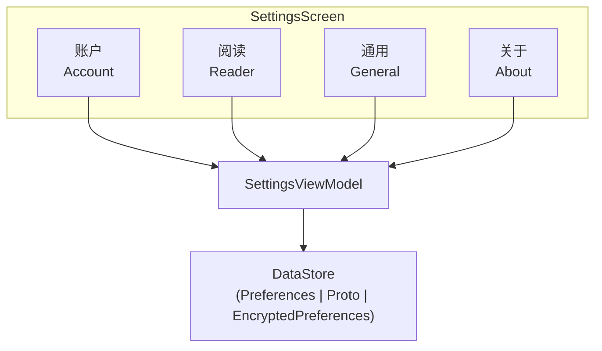

# Android 设置模块

> 应用设置 + 账户管理 + 偏好配置

---

## 1. 模块概览



---

## 2. 设置分类

| 分类 | 内容 |
|------|------|
| 账户 | 登录、订阅、数据 |
| 阅读 | 字体、主题、翻页 |
| 通用 | 语言、通知、存储 |
| 关于 | 版本、反馈、协议 |

---

## 3. 账户设置

### 3.1 账户管理

```
┌─────────────────────────────────────────────────────────────────┐
│                    账户设置                                      │
├─────────────────────────────────────────────────────────────────┤
│                                                                  │
│  个人信息                                                        │
│  ├── 头像                                                        │
│  ├── 昵称                                                        │
│  └── 邮箱                                                        │
│                                                                  │
│  账户安全                                                        │
│  ├── 修改密码                                                    │
│  ├── 绑定手机                                                    │
│  └── 第三方账号绑定                                              │
│                                                                  │
│  订阅管理                                                        │
│  ├── 当前订阅                                                    │
│  ├── 订阅历史                                                    │
│  └── 恢复购买                                                    │
│                                                                  │
│  数据管理                                                        │
│  ├── 数据备份                                                    │
│  ├── 数据恢复                                                    │
│  └── 删除账户                                                    │
│                                                                  │
└─────────────────────────────────────────────────────────────────┘
```

### 3.2 订阅状态

| 状态 | 显示 |
|------|------|
| 免费用户 | 升级提示 |
| 月度订阅 | 到期日期 |
| 年度订阅 | 到期日期 |
| 已过期 | 续订提示 |

---

## 4. 阅读设置

### 4.1 显示设置

```
┌─────────────────────────────────────────────────────────────────┐
│                    阅读显示设置                                   │
├─────────────────────────────────────────────────────────────────┤
│                                                                  │
│  字体设置                                                        │
│  ├── 字体大小: 12-32sp 滑块                                     │
│  ├── 字体选择: 系统/衬线/无衬线                                  │
│  └── 字体粗细: 正常/加粗                                         │
│                                                                  │
│  排版设置                                                        │
│  ├── 行间距: 1.0-2.5 滑块                                       │
│  ├── 段间距: 0-24dp                                             │
│  └── 页边距: 8-48dp                                             │
│                                                                  │
│  主题设置                                                        │
│  ├── 日间主题                                                    │
│  ├── 护眼主题                                                    │
│  ├── 夜间主题                                                    │
│  └── 自定义主题                                                  │
│                                                                  │
│  翻页设置                                                        │
│  ├── 翻页模式: 横滑/竖滑/点击                                    │
│  ├── 翻页动画: 仿真/滑动/淡入                                    │
│  └── 翻页方向: 左右/右左                                         │
│                                                                  │
└─────────────────────────────────────────────────────────────────┘
```

### 4.2 实时预览

| 设置 | 预览 |
|------|------|
| 字体 | 即时生效 |
| 主题 | 即时生效 |
| 排版 | 即时生效 |

---

## 5. 通用设置

### 5.1 应用设置

```
┌─────────────────────────────────────────────────────────────────┐
│                    通用设置                                      │
├─────────────────────────────────────────────────────────────────┤
│                                                                  │
│  语言设置                                                        │
│  ├── 应用语言: 跟随系统/中文/英文                                │
│  └── AI 翻译目标语言                                            │
│                                                                  │
│  外观设置                                                        │
│  ├── 深色模式: 跟随系统/始终浅色/始终深色                        │
│  └── Dynamic Color (Android 12+)                               │
│                                                                  │
│  通知设置                                                        │
│  ├── 复习提醒                                                    │
│  ├── 更新通知                                                    │
│  └── 推送通知                                                    │
│                                                                  │
│  网络设置                                                        │
│  ├── 仅 WiFi 下载                                               │
│  ├── 仅 WiFi 同步                                               │
│  └── TTS 引擎选择                                               │
│                                                                  │
└─────────────────────────────────────────────────────────────────┘
```

### 5.2 存储管理

| 操作 | 说明 |
|------|------|
| 查看用量 | 各类数据占用 |
| 清除缓存 | 临时文件 |
| 清除数据 | 全部本地数据 |
| 导出数据 | 备份到文件 |

---

## 6. 关于页面

### 6.1 关于内容

```
┌─────────────────────────────────────────────────────────────────┐
│                    关于页面                                      │
├─────────────────────────────────────────────────────────────────┤
│                                                                  │
│  应用信息                                                        │
│  ├── 版本号                                                      │
│  ├── 构建号                                                      │
│  └── 更新日志                                                    │
│                                                                  │
│  帮助与支持                                                      │
│  ├── 使用帮助                                                    │
│  ├── 常见问题                                                    │
│  ├── 意见反馈                                                    │
│  └── 联系我们                                                    │
│                                                                  │
│  法律信息                                                        │
│  ├── 用户协议                                                    │
│  ├── 隐私政策                                                    │
│  └── 开源许可                                                    │
│                                                                  │
│  社交媒体                                                        │
│  ├── 官方网站                                                    │
│  ├── Twitter                                                    │
│  └── GitHub                                                     │
│                                                                  │
└─────────────────────────────────────────────────────────────────┘
```

### 6.2 版本检查

| 场景 | 行为 |
|------|------|
| 有更新 | 显示更新提示 |
| 强制更新 | 阻止使用 |
| 已最新 | 显示最新 |

---

## 7. 数据存储

### 7.1 DataStore

```
┌─────────────────────────────────────────────────────────────────┐
│                    设置存储                                      │
├─────────────────────────────────────────────────────────────────┤
│                                                                  │
│  Preferences DataStore                                          │
│  ├── 阅读设置                                                    │
│  ├── 通用设置                                                    │
│  └── UI 偏好                                                    │
│                                                                  │
│  Proto DataStore                                                │
│  └── 用户配置 (复杂结构)                                         │
│                                                                  │
│  EncryptedSharedPreferences                                     │
│  ├── Token                                                      │
│  └── 敏感数据                                                    │
│                                                                  │
└─────────────────────────────────────────────────────────────────┘
```

### 7.2 设置同步

| 设置类型 | 同步 |
|----------|------|
| 阅读设置 | 云端同步 |
| 账户设置 | 云端同步 |
| 本地设置 | 不同步 |

---

## 8. UI 组件

### 8.1 设置项组件

```
┌─────────────────────────────────────────────────────────────────┐
│                    设置项组件                                    │
├─────────────────────────────────────────────────────────────────┤
│                                                                  │
│  SettingsGroup                                                  │
│  └── 分组容器                                                    │
│                                                                  │
│  SettingsItem                                                   │
│  ├── 标题 + 副标题                                              │
│  └── 点击跳转                                                    │
│                                                                  │
│  SettingsSwitch                                                 │
│  ├── 标题 + 开关                                                │
│  └── 即时生效                                                    │
│                                                                  │
│  SettingsSlider                                                 │
│  ├── 标题 + 滑块                                                │
│  └── 实时预览                                                    │
│                                                                  │
│  SettingsRadio                                                  │
│  ├── 标题 + 选项列表                                            │
│  └── 单选                                                        │
│                                                                  │
└─────────────────────────────────────────────────────────────────┘
```

### 8.2 交互设计

| 组件 | 交互 |
|------|------|
| 开关 | 点击切换 |
| 滑块 | 拖动调节 |
| 选择器 | 弹出对话框 |
| 导航 | 点击跳转 |

---

## 9. 隐私与安全

### 9.1 隐私设置

```
┌─────────────────────────────────────────────────────────────────┐
│                    隐私设置                                      │
├─────────────────────────────────────────────────────────────────┤
│                                                                  │
│  数据收集                                                        │
│  ├── 使用统计: 可关闭                                            │
│  ├── 崩溃报告: 可关闭                                            │
│  └── 个性化推荐: 可关闭                                          │
│                                                                  │
│  数据导出                                                        │
│  ├── 导出个人数据                                                │
│  └── 格式: JSON/CSV                                             │
│                                                                  │
│  账户删除                                                        │
│  ├── 软删除: 30 天可恢复                                        │
│  └── 硬删除: 永久删除                                            │
│                                                                  │
└─────────────────────────────────────────────────────────────────┘
```

### 9.2 安全设置

| 设置 | 说明 |
|------|------|
| 应用锁 | 生物识别/PIN |
| 自动锁定 | 后台锁定时间 |
| 隐私模式 | 隐藏敏感内容 |

---

## 10. 相关文档

| 文档 | 说明 |
|------|------|
| [auth.md](./auth.md) | 认证模块 |
| [../architecture.md](../architecture.md) | 架构设计 |
| [../design-system.md](../design-system.md) | 设计系统 |

---

*最后更新: 2025-12-31*
