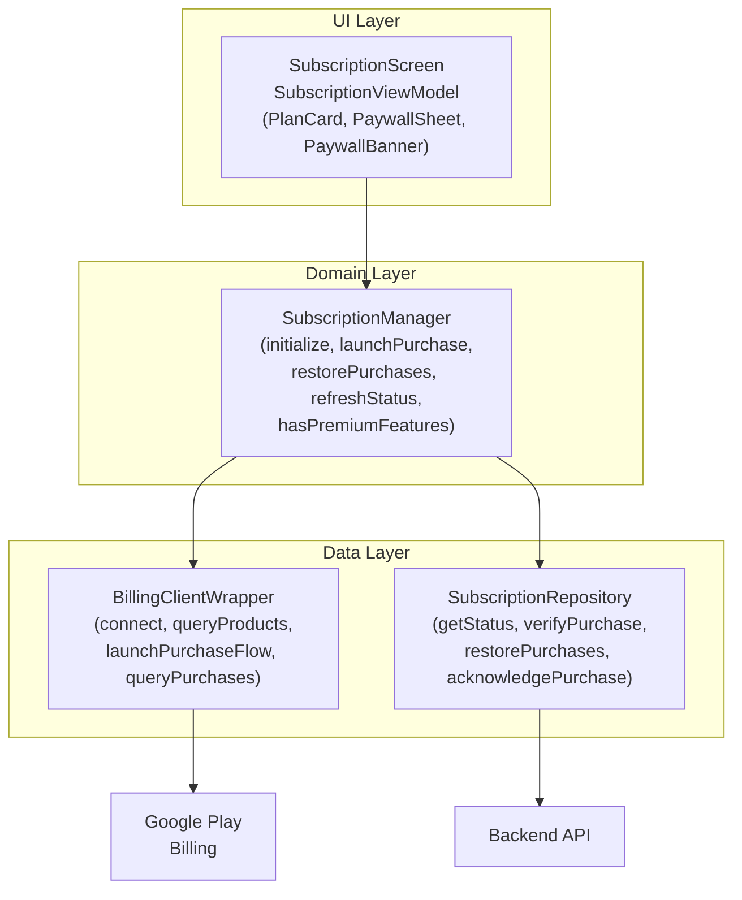
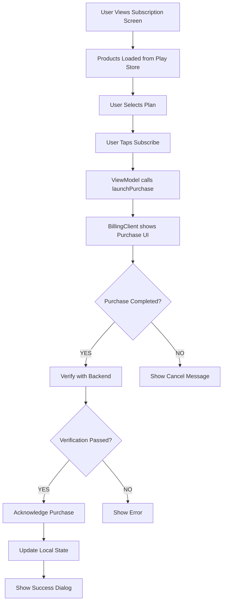
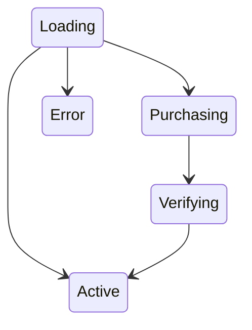
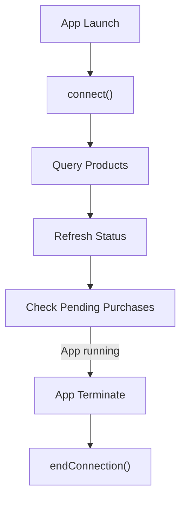

# Android Subscription Feature

## Overview

The Android subscription module integrates Google Play Billing Library to handle in-app purchases and subscriptions.

## Architecture



## Component Responsibilities

| Component | Responsibility |
|-----------|----------------|
| SubscriptionScreen | Main subscription UI |
| SubscriptionViewModel | UI state management |
| SubscriptionManager | Orchestrates billing and backend |
| BillingClientWrapper | Google Play Billing Library wrapper |
| SubscriptionRepository | Backend API communication |

## Purchase Flow



## State Management

### SubscriptionState



### State Descriptions

| State | Description |
|-------|-------------|
| Loading | Initializing billing client, loading products |
| Active | Subscription loaded, showing current status |
| Purchasing | Purchase flow in progress |
| Verifying | Verifying purchase with backend |
| Error | An error occurred |

## UI Components

### SubscriptionScreen

Main screen for subscription management.

| Section | Content |
|---------|---------|
| Current Plan Card | Shows active subscription status |
| Features List | Premium features description |
| Plan Selection | Available subscription plans |
| Subscribe Button | Purchase action |
| Terms | Subscription terms and conditions |

### PaywallSheet

Bottom sheet shown when accessing premium features.

| Element | Purpose |
|---------|---------|
| Lock Icon | Visual indicator |
| Feature Name | What feature was accessed |
| Feature List | Benefits of subscribing |
| View Plans Button | Navigate to subscription |
| Maybe Later | Dismiss sheet |

### PaywallBanner

Inline banner for promoting subscription.

| Element | Purpose |
|---------|---------|
| Star Icon | Visual appeal |
| Title | "Upgrade to Premium" |
| Subtitle | Brief benefit description |
| Upgrade Button | Navigate to subscription |

### PlanCard

Card component for plan selection.

| Element | Description |
|---------|-------------|
| Plan Name | PRO or PREMIUM |
| Price | Formatted price from Play Store |
| Period | Monthly or Yearly |
| Badge | "Best Value", "Current", "Save 40%" |
| Free Trial | Shows if trial available |

## Product Configuration

### Product IDs

| Product ID | Plan | Period |
|------------|------|--------|
| `readmigo_pro_monthly` | PRO | Monthly |
| `readmigo_pro_yearly` | PRO | Yearly |
| `readmigo_premium_monthly` | PREMIUM | Monthly |
| `readmigo_premium_yearly` | PREMIUM | Yearly |

### Product Mapping

```
Product ID                    →    PlanType    →    BillingPeriod
─────────────────────────────────────────────────────────────────
readmigo_pro_monthly          →    PRO         →    MONTHLY
readmigo_pro_yearly           →    PRO         →    YEARLY
readmigo_premium_monthly      →    PREMIUM     →    MONTHLY
readmigo_premium_yearly       →    PREMIUM     →    YEARLY
```

## Dependency Injection

### SubscriptionModule

| Provider | Scope | Dependencies |
|----------|-------|--------------|
| BillingClientWrapper | Singleton | ApplicationContext |
| SubscriptionRepository | Singleton | ApiService |
| SubscriptionManager | Singleton | BillingClientWrapper, SubscriptionRepository |

## Error Handling

### Billing Errors

| Error Code | Message | Resolution |
|------------|---------|------------|
| BILLING_UNAVAILABLE | "Play Store unavailable" | Check device |
| SERVICE_DISCONNECTED | "Connection lost" | Retry connection |
| USER_CANCELED | "Purchase cancelled" | No action |
| ITEM_ALREADY_OWNED | "Already subscribed" | Restore |
| DEVELOPER_ERROR | "Configuration error" | Check setup |

### Network Errors

| Error | Message | Resolution |
|-------|---------|------------|
| Timeout | "Request timed out" | Retry |
| No Connection | "No internet" | Check connection |
| Server Error | "Server error" | Retry later |

## Feature Gating

### Check Premium Access

```
SubscriptionManager.hasPremiumFeatures() → Boolean
```

| Plan Type | Status | Returns |
|-----------|--------|---------|
| PRO | ACTIVE | true |
| PREMIUM | ACTIVE | true |
| PRO | EXPIRED | false |
| FREE | - | false |

### Usage Locations

| Feature | Gate Check |
|---------|------------|
| Unlimited Books | hasPremiumFeatures() |
| AI Translation | hasPremiumFeatures() |
| Offline Download | hasPremiumFeatures() |
| Advanced Stats | hasPremiumFeatures() |

## Testing

### Test Accounts

| Account Type | Setup |
|--------------|-------|
| License Tester | Play Console > Setup > License testing |
| Subscription Tester | Test accounts with fast renewal |

### Test Product IDs

Same as production - use test accounts for testing.

### Test Scenarios

| Scenario | How to Test |
|----------|-------------|
| Successful Purchase | Complete purchase with test account |
| Cancelled Purchase | Cancel during purchase flow |
| Restore Purchase | Call restorePurchases() |
| Expired Subscription | Wait for test subscription to expire |
| Grace Period | Disable payment method |

## Lifecycle Management

### Application Lifecycle

| Event | Action |
|-------|--------|
| App Start | Initialize SubscriptionManager |
| User Login | Refresh subscription status |
| Resume | Check pending purchases |
| Destroy | End billing connection |

### Connection Management


