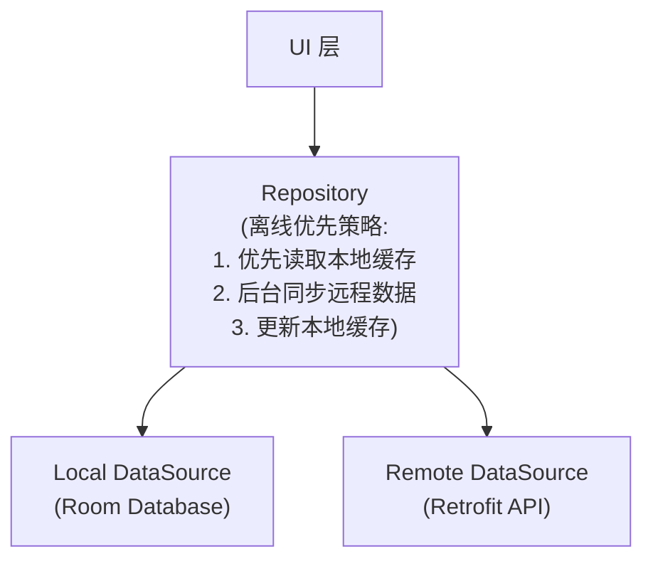
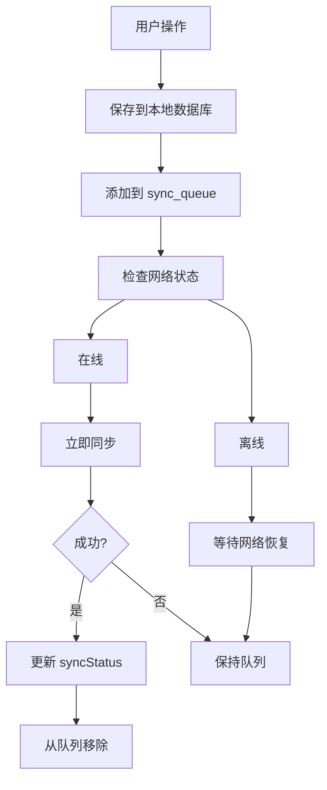
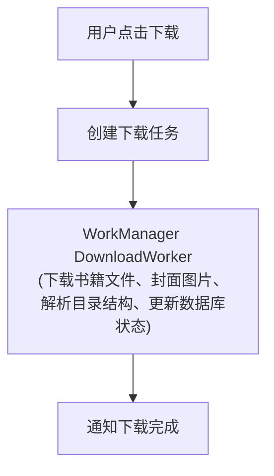

# Android 离线功能

> Room 数据库 + 离线优先 + 同步策略

---

## 1. 离线架构概览



---

## 2. 本地存储

### 2.1 存储方案选择

| 存储类型 | 用途 | 工具 |
|----------|------|------|
| 结构化数据 | 书籍信息、阅读进度 | Room |
| 键值对 | 用户设置、Token | DataStore |
| 文件 | 书籍文件、图片 | 文件系统 |
| 临时缓存 | 网络响应 | OkHttp Cache |

### 2.2 Room 数据库设计

```
┌─────────────────────────────────────────────────────────────────┐
│                    数据库表结构                                   │
├─────────────────────────────────────────────────────────────────┤
│                                                                  │
│  books                                                          │
│  ├── id: String (PK)                                           │
│  ├── title: String                                             │
│  ├── author: String                                            │
│  ├── coverUrl: String?                                         │
│  ├── filePath: String?                                         │
│  ├── format: BookFormat                                        │
│  ├── syncStatus: SyncStatus                                    │
│  ├── createdAt: Long                                           │
│  └── updatedAt: Long                                           │
│                                                                  │
│  reading_progress                                               │
│  ├── bookId: String (FK → books)                               │
│  ├── chapterId: String                                         │
│  ├── position: Int                                             │
│  ├── percentage: Float                                         │
│  ├── syncStatus: SyncStatus                                    │
│  └── updatedAt: Long                                           │
│                                                                  │
│  vocabulary                                                     │
│  ├── id: String (PK)                                           │
│  ├── word: String                                              │
│  ├── meaning: String                                           │
│  ├── context: String?                                          │
│  ├── bookId: String?                                           │
│  ├── syncStatus: SyncStatus                                    │
│  └── createdAt: Long                                           │
│                                                                  │
│  sync_queue                                                     │
│  ├── id: Long (PK, auto)                                       │
│  ├── entityType: String                                        │
│  ├── entityId: String                                          │
│  ├── operation: SyncOperation                                  │
│  ├── payload: String (JSON)                                    │
│  ├── retryCount: Int                                           │
│  └── createdAt: Long                                           │
│                                                                  │
└─────────────────────────────────────────────────────────────────┘
```

---

## 3. 同步状态管理

### 3.1 同步状态枚举

```
┌─────────────────────────────────────────────────────────────────┐
│                    SyncStatus 状态                               │
├─────────────────────────────────────────────────────────────────┤
│                                                                  │
│  SYNCED                                                         │
│  └── 已与服务器同步                                              │
│                                                                  │
│  PENDING_UPLOAD                                                 │
│  └── 等待上传到服务器                                            │
│                                                                  │
│  PENDING_DOWNLOAD                                               │
│  └── 等待从服务器下载                                            │
│                                                                  │
│  CONFLICT                                                       │
│  └── 存在冲突需要解决                                            │
│                                                                  │
│  ERROR                                                          │
│  └── 同步失败                                                    │
│                                                                  │
└─────────────────────────────────────────────────────────────────┘
```

### 3.2 同步操作类型

| 操作 | 说明 |
|------|------|
| CREATE | 新建数据 |
| UPDATE | 更新数据 |
| DELETE | 删除数据 |

---

## 4. 离线队列

### 4.1 队列处理流程



### 4.2 WorkManager 同步任务

| 任务类型 | 触发条件 |
|----------|----------|
| 立即同步 | 网络可用时 |
| 定期同步 | 每 15 分钟 |
| 恢复同步 | 网络恢复时 |

---

## 5. 冲突解决

### 5.1 冲突检测

```
┌─────────────────────────────────────────────────────────────────┐
│                    冲突检测策略                                   │
├─────────────────────────────────────────────────────────────────┤
│                                                                  │
│  上传时检测                                                      │
│  │                                                              │
│  ├── 比较 updatedAt 时间戳                                      │
│  │                                                              │
│  ├── 服务器版本更新?                                             │
│  │   │                                                          │
│  │   ├── 是 → 标记为 CONFLICT                                   │
│  │   │                                                          │
│  │   └── 否 → 正常上传                                          │
│  │                                                              │
│  └── 使用乐观锁版本号                                            │
│                                                                  │
└─────────────────────────────────────────────────────────────────┘
```

### 5.2 冲突解决策略

| 策略 | 说明 | 适用场景 |
|------|------|----------|
| 服务器优先 | 服务器数据覆盖本地 | 非关键数据 |
| 本地优先 | 本地数据覆盖服务器 | 用户主动操作 |
| 最后写入优先 | 时间戳新者胜出 | 阅读进度 |
| 手动解决 | 用户选择 | 笔记、高亮 |
| 合并 | 智能合并两边修改 | 词汇列表 |

---

## 6. 书籍离线下载

### 6.1 下载管理



| 下载状态 | 说明 |
|----------|------|
| PENDING | 等待下载 |
| DOWNLOADING | 下载中 (显示进度) |
| COMPLETED | 下载完成 |
| FAILED | 下载失败 |

### 6.2 存储位置

| 类型 | 位置 | 说明 |
|------|------|------|
| 书籍文件 | Internal Storage | 应用私有目录 |
| 封面缓存 | Cache Directory | 可被系统清理 |
| 导出备份 | Documents | 用户可访问 |

---

## 7. 网络状态监控

### 7.1 ConnectivityManager

```
┌─────────────────────────────────────────────────────────────────┐
│                    网络监控                                      │
├─────────────────────────────────────────────────────────────────┤
│                                                                  │
│  NetworkMonitor (@Singleton)                                    │
│  │                                                              │
│  ├── isOnline: StateFlow<Boolean>                              │
│  │                                                              │
│  ├── networkType: StateFlow<NetworkType>                       │
│  │   ├── WIFI                                                  │
│  │   ├── CELLULAR                                              │
│  │   └── NONE                                                  │
│  │                                                              │
│  └── networkCallback                                           │
│      ├── onAvailable → 触发同步                                 │
│      ├── onLost → 切换离线模式                                  │
│      └── onCapabilitiesChanged → 更新类型                      │
│                                                                  │
└─────────────────────────────────────────────────────────────────┘
```

### 7.2 网络策略

| 网络类型 | 策略 |
|----------|------|
| WiFi | 自动同步、自动下载 |
| 移动数据 | 仅同步，下载需确认 |
| 无网络 | 纯离线模式 |

---

## 8. 缓存策略

### 8.1 缓存层级

```
┌─────────────────────────────────────────────────────────────────┐
│                    缓存层级                                      │
├─────────────────────────────────────────────────────────────────┤
│                                                                  │
│  L1: 内存缓存                                                    │
│  ├── 当前阅读书籍                                                │
│  ├── 最近访问数据                                                │
│  └── 生命周期: App 运行期间                                      │
│                                                                  │
│  L2: 数据库缓存 (Room)                                           │
│  ├── 所有业务数据                                                │
│  ├── 同步状态追踪                                                │
│  └── 生命周期: 持久化                                            │
│                                                                  │
│  L3: 文件缓存                                                    │
│  ├── 书籍文件                                                    │
│  ├── 图片缓存                                                    │
│  └── 生命周期: 用户管理                                          │
│                                                                  │
│  L4: HTTP 缓存                                                   │
│  ├── API 响应                                                   │
│  └── 生命周期: Cache-Control                                    │
│                                                                  │
└─────────────────────────────────────────────────────────────────┘
```

### 8.2 缓存清理

| 清理类型 | 触发条件 |
|----------|----------|
| 自动清理 | 存储空间不足 |
| 定期清理 | 过期数据 |
| 手动清理 | 用户操作 |

---

## 9. 数据迁移

### 9.1 Room 迁移

```
┌─────────────────────────────────────────────────────────────────┐
│                    数据库迁移                                    │
├─────────────────────────────────────────────────────────────────┤
│                                                                  │
│  Migration 策略                                                  │
│  │                                                              │
│  ├── 自动迁移                                                    │
│  │   └── 简单的表结构变更                                        │
│  │                                                              │
│  └── 手动迁移                                                    │
│      └── 复杂的数据转换                                          │
│                                                                  │
│  版本管理                                                        │
│  ├── version 1: 初始结构                                        │
│  ├── version 2: 添加 syncStatus                                 │
│  └── version 3: 添加 sync_queue                                 │
│                                                                  │
│  回滚策略                                                        │
│  └── fallbackToDestructiveMigration (仅开发)                    │
│                                                                  │
└─────────────────────────────────────────────────────────────────┘
```

### 9.2 迁移测试

| 测试类型 | 工具 |
|----------|------|
| 迁移测试 | MigrationTestHelper |
| 数据完整性 | 真实数据库 |

---

## 10. 相关文档

| 文档 | 说明 |
|------|------|
| [architecture.md](./architecture.md) | 架构设计 |
| [performance.md](./performance.md) | 性能优化 |
| [../shared/offline-sync.md](../shared/offline-sync.md) | 跨平台同步 |

---

*最后更新: 2025-12-31*
