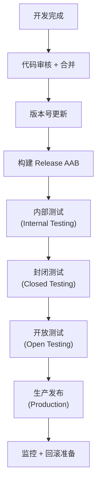
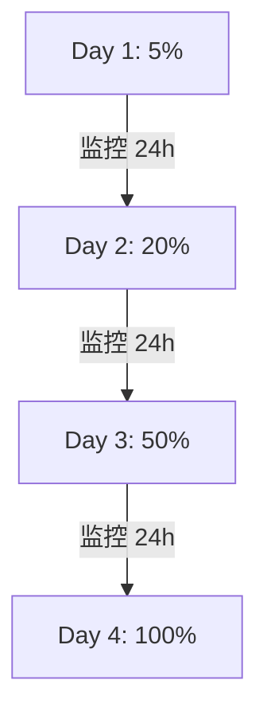
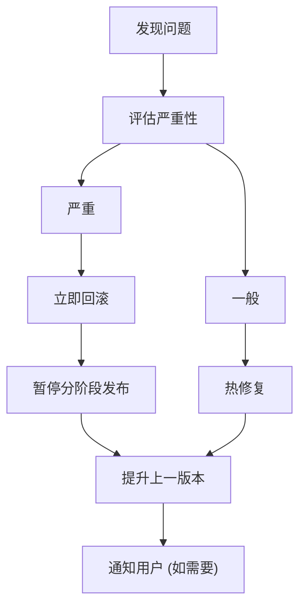
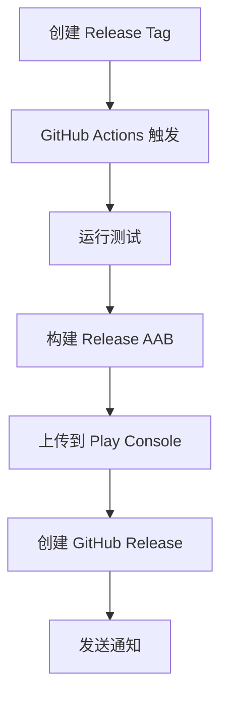

# Android 发布流程

> Fastlane + Play Console + 版本管理

---

## 1. 发布概览



---

## 2. 版本管理

### 2.1 版本号规范

| 字段 | 格式 | 示例 |
|------|------|------|
| versionName | MAJOR.MINOR.PATCH | 1.2.3 |
| versionCode | 递增整数 | 10203 |

### 2.2 版本号规则

```
┌─────────────────────────────────────────────────────────────────┐
│                    版本号规则                                    │
├─────────────────────────────────────────────────────────────────┤
│                                                                  │
│  versionName                                                    │
│  ├── MAJOR: 重大更新/不兼容变更                                  │
│  ├── MINOR: 新功能                                              │
│  └── PATCH: Bug 修复                                            │
│                                                                  │
│  versionCode 计算                                               │
│  └── MAJOR * 10000 + MINOR * 100 + PATCH                       │
│      例: 1.2.3 → 10203                                         │
│                                                                  │
│  预发布版本                                                      │
│  ├── 1.2.3-alpha.1                                             │
│  ├── 1.2.3-beta.1                                              │
│  └── 1.2.3-rc.1                                                │
│                                                                  │
└─────────────────────────────────────────────────────────────────┘
```

---

## 3. 构建配置

### 3.1 Build Variants

| Variant | 用途 |
|---------|------|
| debug | 开发调试 |
| staging | 测试环境 |
| release | 生产环境 |

### 3.2 签名配置

```
┌─────────────────────────────────────────────────────────────────┐
│                    签名配置                                      │
├─────────────────────────────────────────────────────────────────┤
│                                                                  │
│  Release 签名                                                   │
│  ├── 密钥库: release.keystore                                   │
│  ├── 存储位置: CI/CD 安全存储                                    │
│  └── 有效期: 25 年以上                                          │
│                                                                  │
│  Play App Signing                                               │
│  ├── Google 托管签名密钥                                         │
│  ├── 上传密钥 (Upload Key)                                      │
│  └── 密钥轮换支持                                                │
│                                                                  │
│  环境变量                                                        │
│  ├── KEYSTORE_FILE                                              │
│  ├── KEYSTORE_PASSWORD                                          │
│  ├── KEY_ALIAS                                                  │
│  └── KEY_PASSWORD                                               │
│                                                                  │
└─────────────────────────────────────────────────────────────────┘
```

---

## 4. Fastlane 配置

### 4.1 Lane 定义

| Lane | 功能 |
|------|------|
| test | 运行测试 |
| build | 构建 AAB |
| deploy_internal | 发布到内部测试 |
| deploy_beta | 发布到封闭测试 |
| deploy_production | 发布到生产 |

### 4.2 发布流程

```
┌─────────────────────────────────────────────────────────────────┐
│                    Fastlane 发布流程                             │
├─────────────────────────────────────────────────────────────────┤
│                                                                  │
│  fastlane deploy_internal                                       │
│  ├── 增加版本号                                                  │
│  ├── 构建 Release AAB                                           │
│  ├── 上传到 Play Console                                        │
│  ├── 提交到内部测试轨道                                          │
│  └── 发送通知                                                    │
│                                                                  │
│  fastlane deploy_beta                                           │
│  ├── 从内部测试提升                                              │
│  ├── 更新发布说明                                                │
│  └── 提交到封闭测试                                              │
│                                                                  │
│  fastlane deploy_production                                     │
│  ├── 从测试轨道提升                                              │
│  ├── 设置分阶段发布比例                                          │
│  └── 提交审核                                                    │
│                                                                  │
└─────────────────────────────────────────────────────────────────┘
```

---

## 5. Play Console 配置

### 5.1 测试轨道

| 轨道 | 用途 | 审核 |
|------|------|------|
| 内部测试 | 开发团队 | 无 |
| 封闭测试 | 内测用户 | 可选 |
| 开放测试 | 公开测试 | 可选 |
| 生产 | 正式用户 | 必须 |

### 5.2 分阶段发布



| 监控指标 | 阈值 |
|----------|------|
| 崩溃率 | < 0.1% |
| ANR 率 | < 0.05% |
| 用户反馈 | 无严重问题 |

---

## 6. 发布检查清单

### 6.1 发布前检查

| 检查项 | 说明 |
|--------|------|
| 测试通过 | 单元测试 + UI 测试 |
| Lint 无错误 | 代码质量检查 |
| 版本号更新 | versionCode 递增 |
| 更新日志 | 准备发布说明 |
| 签名验证 | 签名配置正确 |
| 功能验证 | 核心功能测试 |

### 6.2 发布后检查

```
┌─────────────────────────────────────────────────────────────────┐
│                    发布后监控                                    │
├─────────────────────────────────────────────────────────────────┤
│                                                                  │
│  监控项目                                                        │
│  ├── 崩溃报告                                                    │
│  ├── ANR 报告                                                   │
│  ├── 用户评价                                                    │
│  ├── 性能指标                                                    │
│  └── 功能使用数据                                                │
│                                                                  │
│  监控周期                                                        │
│  ├── 发布后 1 小时: 每 15 分钟检查                               │
│  ├── 发布后 24 小时: 每小时检查                                  │
│  └── 发布后 7 天: 每天检查                                       │
│                                                                  │
│  回滚阈值                                                        │
│  ├── 崩溃率 > 1%                                                │
│  └── 严重功能故障                                                │
│                                                                  │
└─────────────────────────────────────────────────────────────────┘
```

---

## 7. 回滚策略

### 7.1 回滚方式

| 方式 | 场景 |
|------|------|
| 暂停发布 | 分阶段发布期间 |
| 降级版本 | 发布上一个稳定版 |
| 热修复 | 紧急 Bug 修复 |

### 7.2 回滚流程



---

## 8. CI/CD 集成

### 8.1 GitHub Actions

| 触发器 | 动作 |
|--------|------|
| PR | 运行测试 + Lint |
| develop 合并 | 发布内部测试 |
| Tag 创建 | 发布生产 |

### 8.2 发布工作流



---

## 9. 相关文档

| 文档 | 说明 |
|------|------|
| [play-console.md](./play-console.md) | Play Console 配置 |
| [monitoring.md](./monitoring.md) | 发布监控 |
| [testing.md](./testing.md) | 发布前测试 |

---

*最后更新: 2025-12-31*
