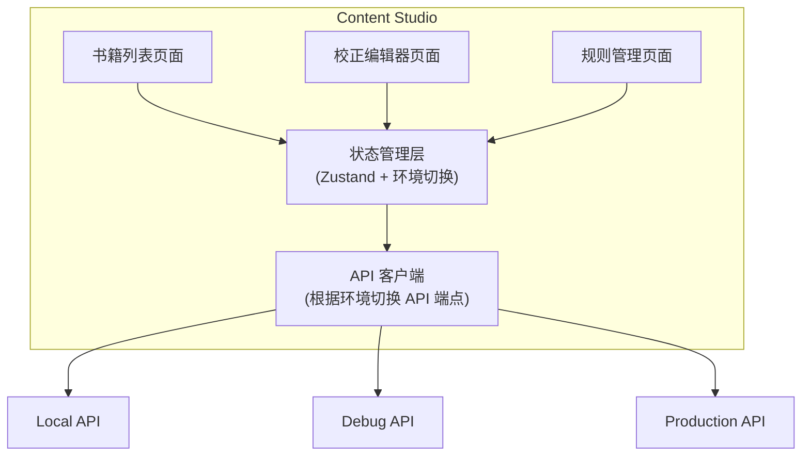

# Content Studio 架构设计

## 系统概述

Content Studio 是一个独立的内容校正工具，用于运营人员对书籍内容进行人工校正和质量控制。

## 架构图



## 核心模块

| 模块 | 功能 | 位置 |
|------|------|------|
| 书籍管理 | 浏览、筛选、搜索书籍 | `/app/page.tsx` |
| 校正编辑器 | HTML 编辑、修复确认、预览 | `/app/book/[id]/page.tsx` |
| 规则管理 | 查看、编辑、启用/禁用规则 | `/app/rules/page.tsx` |
| 规则迁移 | 跨环境导入/导出规则 | `/app/rules/migration/page.tsx` |
| 学习报告 | 查看学习到的模式并审批 | `/app/learning/page.tsx` |
| 手机预览 | 模拟 iOS 阅读器显示效果 | `/components/preview/` |

## 技术栈

| 类别 | 技术 |
|------|------|
| 框架 | Next.js 15 (App Router) |
| UI 库 | React 19 |
| 样式 | Tailwind CSS 4 |
| 组件 | Radix UI |
| 编辑器 | Monaco Editor |
| 状态管理 | Zustand |
| 语言 | TypeScript |

## 目录结构

```
tools/content-studio/
├── docs/                    # 文档
├── src/
│   ├── app/                 # 页面路由
│   │   ├── book/[id]/       # 书籍编辑器
│   │   ├── rules/           # 规则管理
│   │   │   └── migration/   # 规则迁移
│   │   └── learning/        # 学习报告
│   ├── components/
│   │   ├── editor/          # 编辑器组件
│   │   ├── layout/          # 布局组件
│   │   └── preview/         # 预览组件
│   ├── config/              # 环境配置
│   ├── lib/                 # 工具库和类型
│   ├── stores/              # Zustand 状态
│   └── styles/              # 阅读器主题样式
└── package.json
```
