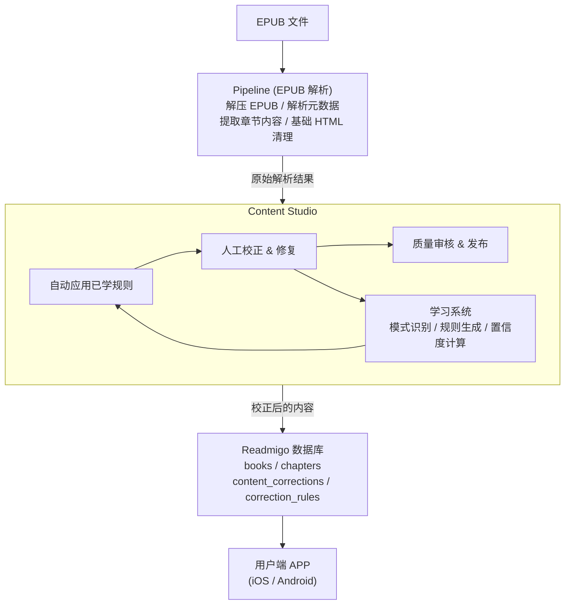
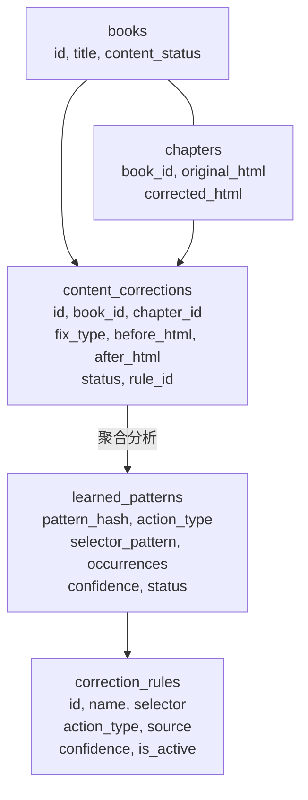
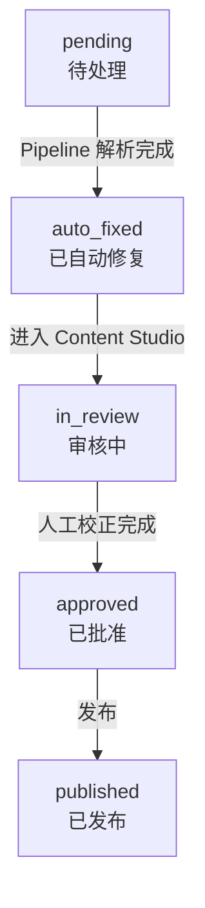
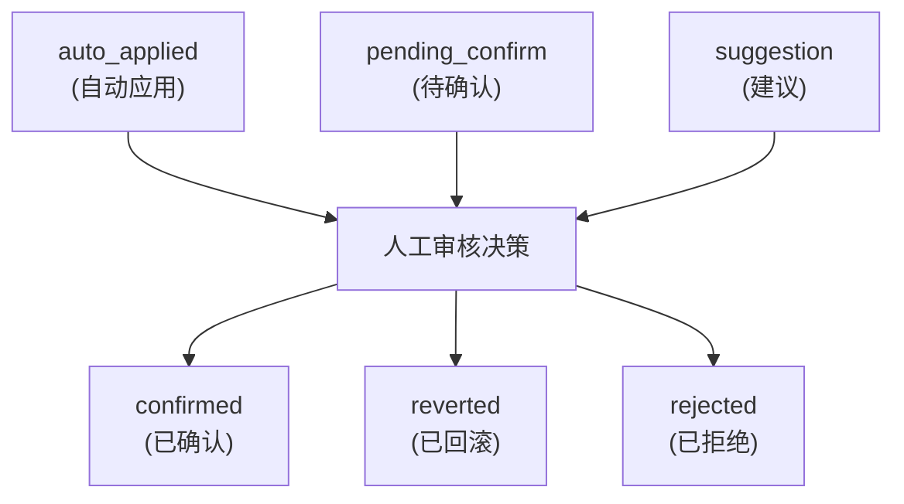

# 数据流与系统集成

## Content Studio 在整体流程中的位置

## 数据流详解

### 输入数据

| 来源 | 数据类型 | 说明 |
|------|----------|------|
| Pipeline | 原始 HTML | 经过初步解析的章节内容 |
| Pipeline | 书籍元数据 | 标题、作者、封面等 |
| 数据库 | 校正规则 | 已积累的自动校正规则 |
| 数据库 | 学习模式 | 从历史校正中学习到的模式 |

### 输出数据

| 目标 | 数据类型 | 说明 |
|------|----------|------|
| 数据库 | 校正后 HTML | 经过人工校正的章节内容 |
| 数据库 | 校正日志 | 每次校正操作的详细记录 |
| 数据库 | 新规则 | 从学习模式转化的规则 |

## 数据库表关系

## 状态流转

### 书籍内容状态

### 修复项状态

