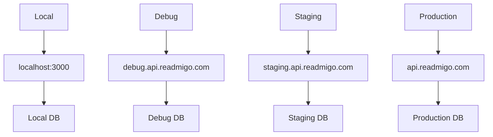

# 环境配置

## 四环境架构

Content Studio 支持四个完全独立且隔离的环境：



## 环境对比

| 特性 | Local | Debug | Staging | Production |
|------|-------|-------|---------|------------|
| API 地址 | localhost:3000 | debug.api.readmigo.com | staging.api.readmigo.com | api.readmigo.com |
| 数据隔离 | ✅ 完全独立 | ✅ 完全独立 | ✅ 完全独立 | ✅ 完全独立 |
| 危险操作确认 | ❌ | ❌ | ❌ | ✅ 需要确认 |
| 规则迁移来源 | ✅ | ✅ | ✅ | ❌ 禁止 |
| 规则迁移目标 | ✅ | ✅ | ✅ | ✅ 需审批 |
| 用途 | 开发测试 | 调试问题 | 预发布验证 | 真实用户 |

## 环境切换

### UI 切换器

环境切换器位于页面顶部导航栏：

```
┌──────────────────────────────────────────────────────────┐
│  Content Studio           │ 🖥️ Local ▼│  用户名      │
└──────────────────────────────────────────────────────────┘
                             │
                             ▼
                     ┌───────────────┐
                     │ 🖥️  Local     │
                     │ 🔧  Debug     │
                     │ 🧪  Staging   │
                     │ 🚀  Production│
                     └───────────────┘
```

### 启动命令

| 环境 | 启动命令 |
|------|----------|
| Local | `pnpm dev` |
| Debug | `pnpm dev:debug` |
| Staging | `pnpm dev:staging` |
| Production | `pnpm dev:production` |

## Production 环境保护

### 危险操作确认

在 Production 环境执行以下操作时需要输入 "CONFIRM"：

- 批准发布书籍
- 删除规则
- 批量操作

```
┌────────────────────────────────────────┐
│  ⚠️ 确认发布到生产环境                  │
├────────────────────────────────────────┤
│                                        │
│  你即将批准发布以下书籍:                │
│                                        │
│  ┌──────────────────────────────────┐  │
│  │ Pride and Prejudice              │  │
│  │ 12 章节 · 15 处修复              │  │
│  └──────────────────────────────────┘  │
│                                        │
│  此操作将影响真实用户数据，             │
│  请输入 "CONFIRM" 确认操作:            │
│                                        │
│  ┌──────────────────────────────────┐  │
│  │                                  │  │
│  └──────────────────────────────────┘  │
│                                        │
│            [取消]      [确认发布]      │
└────────────────────────────────────────┘
```

### 视觉提示

Production 环境有明显的视觉警告：

- 环境指示器显示红色
- 重要操作按钮显示红色
- 页面顶部显示警告横幅

## 数据隔离保证

```
┌─────────────────────────────────────────────────────────┐
│                     数据隔离保证                         │
├─────────────────────────────────────────────────────────┤
│                                                          │
│  Local ──────────────────────────────▶ 独立数据库       │
│         ✗ 不影响其他环境                                │
│                                                          │
│  Debug ──────────────────────────────▶ 独立数据库       │
│         ✗ 不影响其他环境                                │
│                                                          │
│  Staging ────────────────────────────▶ 独立数据库       │
│         ✗ 不影响其他环境                                │
│                                                          │
│  Production ─────────────────────────▶ 独立数据库       │
│         ⚠️  影响真实用户                                 │
│                                                          │
└─────────────────────────────────────────────────────────┘
```

## 环境间规则迁移

详见 [规则迁移文档](./rule-migration.md)
