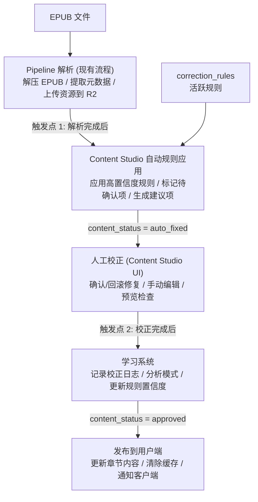

# Content Studio 实现计划 V2

## 一、任务概述

| 任务 | 优先级 | 复杂度 |
|------|--------|--------|
| 后端 API 接口 | P0 | 高 |
| 数据库表迁移 | P0 | 中 |
| Pipeline 集成 | P1 | 中 |
| i18n 国际化支持 | P1 | 中 |
| 公版书协议文本删除 | P1 | 中 |
| 合规风险评估 | P0 | 低 |
| epub-reader-mobile-issues 手动编辑评估 | P2 | 低 |

---

## 二、后端 API 接口设计

### 2.1 API 路由结构

```
/api/v1/content-studio/
├── /books                      # 书籍管理
│   ├── GET /                   # 获取书籍列表
│   ├── GET /:id                # 获取书籍详情
│   ├── GET /:id/chapters       # 获取章节列表
│   └── PUT /:id/status         # 更新书籍状态
│
├── /chapters                   # 章节管理
│   ├── GET /:id                # 获取章节详情(含HTML)
│   ├── PUT /:id                # 更新章节内容
│   └── GET /:id/fixes          # 获取章节修复项
│
├── /corrections                # 校正管理
│   ├── POST /                  # 创建校正记录
│   ├── PUT /:id                # 更新校正状态
│   └── POST /batch             # 批量校正
│
├── /rules                      # 规则管理
│   ├── GET /                   # 获取规则列表
│   ├── POST /                  # 创建规则
│   ├── PUT /:id                # 更新规则
│   ├── DELETE /:id             # 删除规则
│   └── POST /migrate           # 规则迁移
│
└── /learning                   # 学习系统
    ├── GET /patterns           # 获取学习模式
    ├── PUT /patterns/:id       # 审批模式
    └── GET /stats              # 学习统计
```

### 2.2 核心接口详情

| 接口 | 方法 | 功能 | 请求参数 | 响应 |
|------|------|------|----------|------|
| `/books` | GET | 书籍列表 | page, limit, status, search | 分页书籍列表 |
| `/chapters/:id` | GET | 章节详情 | - | HTML 内容 + 修复项 |
| `/chapters/:id` | PUT | 保存章节 | html, corrections[] | 更新结果 |
| `/rules` | GET | 规则列表 | source, category, active | 规则数组 |
| `/rules/migrate` | POST | 迁移规则 | ruleIds[], targetEnv | 迁移结果 |
| `/learning/patterns` | GET | 学习模式 | status | 模式列表 |

---

## 三、数据库表设计

### 3.1 新增表结构

```
┌─────────────────────────────────────────────────────────────────────┐
│                       新增数据库表                                   │
├─────────────────────────────────────────────────────────────────────┤
│                                                                      │
│  ┌─────────────────────┐                                            │
│  │ content_corrections │  校正记录表                                 │
│  ├─────────────────────┤                                            │
│  │ id                  │                                            │
│  │ book_id             │──────┐                                     │
│  │ chapter_id          │──────┼───▶ 关联现有表                      │
│  │ fix_type            │      │                                     │
│  │ selector            │                                            │
│  │ before_html         │                                            │
│  │ after_html          │                                            │
│  │ status              │                                            │
│  │ rule_id             │──────┐                                     │
│  │ created_by          │      │                                     │
│  │ created_at          │      │                                     │
│  └─────────────────────┘      │                                     │
│                               │                                     │
│  ┌─────────────────────┐      │                                     │
│  │  correction_rules   │◀─────┘  校正规则表                         │
│  ├─────────────────────┤                                            │
│  │ id                  │                                            │
│  │ name                │                                            │
│  │ description         │                                            │
│  │ category            │                                            │
│  │ action_type         │                                            │
│  │ selector            │                                            │
│  │ pattern             │                                            │
│  │ source              │  builtin / learned / custom                │
│  │ confidence          │                                            │
│  │ occurrences         │                                            │
│  │ success_rate        │                                            │
│  │ is_active           │                                            │
│  │ environment         │  local / debug / staging / production      │
│  │ created_at          │                                            │
│  └─────────────────────┘                                            │
│                                                                      │
│  ┌─────────────────────┐                                            │
│  │  correction_logs    │  校正日志表 (学习系统)                      │
│  ├─────────────────────┤                                            │
│  │ id                  │                                            │
│  │ correction_id       │──────▶ content_corrections                 │
│  │ action              │  confirmed / reverted / edited             │
│  │ operator            │                                            │
│  │ metadata            │  JSON                                      │
│  │ created_at          │                                            │
│  └─────────────────────┘                                            │
│                                                                      │
│  ┌─────────────────────┐                                            │
│  │  learned_patterns   │  学习模式表                                 │
│  ├─────────────────────┤                                            │
│  │ id                  │                                            │
│  │ pattern_hash        │  SHA256(action+selector+pattern)           │
│  │ action_type         │                                            │
│  │ selector_pattern    │                                            │
│  │ content_pattern     │  正则表达式                                 │
│  │ occurrences         │                                            │
│  │ distinct_books      │                                            │
│  │ confidence          │                                            │
│  │ status              │  pending / approved / rejected             │
│  │ converted_rule_id   │──────▶ correction_rules                    │
│  │ samples             │  JSON[]                                    │
│  │ created_at          │                                            │
│  └─────────────────────┘                                            │
│                                                                      │
└─────────────────────────────────────────────────────────────────────┘
```

### 3.2 现有表修改

| 表 | 修改 | 说明 |
|-----|------|------|
| books | 新增 `content_status` 字段 | pending / auto_fixed / in_review / approved / published |
| chapters | 新增 `correction_count` 字段 | 校正次数统计 |
| chapters | 新增 `last_corrected_at` 字段 | 最后校正时间 |

---

## 四、Pipeline 集成

### 4.1 集成点



### 4.2 Pipeline Service 修改

| 修改位置 | 修改内容 |
|----------|----------|
| `pipeline.service.ts` | 解析完成后调用 Content Studio 自动应用规则 |
| `pipeline.service.ts` | 新增 `applyContentRules()` 方法 |
| `BookStatus` enum | 新增 `PENDING_REVIEW` 状态 |

---

## 五、i18n 国际化支持

### 5.1 前端 i18n 方案

| 方案 | 优点 | 缺点 |
|------|------|------|
| next-intl | Next.js 官方推荐，支持 App Router | 需要配置 middleware |
| react-i18next | 生态成熟，灵活 | 需要手动处理 SSR |

**推荐方案**: `next-intl`

### 5.2 支持语言

| 语言 | 代码 | 优先级 |
|------|------|--------|
| 中文 | zh | P0 (默认) |
| English | en | P1 |

### 5.3 翻译文件结构

```
tools/content-studio/
├── messages/
│   ├── zh.json           # 中文翻译
│   └── en.json           # 英文翻译
└── src/
    └── i18n/
        ├── config.ts     # i18n 配置
        └── request.ts    # 服务端请求
```

---

## 六、公版书协议文本删除

### 6.1 目标

删除 Project Gutenberg、Standard Ebooks 等来源的公版书中重复出现的协议/声明文本。

### 6.2 识别模式

| 来源 | 识别特征 |
|------|----------|
| Project Gutenberg | `"The Project Gutenberg"`, `"www.gutenberg.org"`, `"This eBook is for the use of anyone"` |
| Standard Ebooks | `"Standard Ebooks"`, `"standardebooks.org"` |

### 6.3 处理策略

```
┌─────────────────────────────────────────────────────────────────────┐
│                    公版书协议文本处理策略                            │
└─────────────────────────────────────────────────────────────────────┘

方案 A: 完全删除 (推荐)
├─ 在 Pipeline 解析阶段识别并删除
├─ 书籍开头/结尾的声明章节完全移除
├─ 每章重复的协议文本删除
└─ 优点: 阅读体验最佳

方案 B: 折叠显示
├─ 保留协议文本但默认折叠
├─ 用户可点击展开查看
└─ 缺点: 仍占用空间，实现复杂

方案 C: 单独章节
├─ 协议文本统一移至书籍末尾
├─ 作为 "版权声明" 单独章节
└─ 缺点: 用户可能误以为是书籍内容
```

### 6.4 实现位置

| 组件 | 修改 |
|------|------|
| Pipeline 解析 | 新增 `removePublicDomainNotices()` 方法 |
| Content Studio | 添加 "协议文本" 检测规则 |
| 数据库 | 记录原始协议文本位置（可选，用于审计） |

---

## 七、合规风险评估

### 7.1 法律分析

| 问题 | 分析 | 风险等级 |
|------|------|----------|
| 删除协议文本是否违法? | **否** - 公版书本身不受版权保护，协议文本是发布方添加的使用条款，不是书籍内容的一部分 | ✅ 低风险 |
| 是否需要保留署名? | 需要保留**原作者**署名，但不需要保留发布方（如 Gutenberg）的署名 | ✅ 低风险 |
| 是否需要显示来源? | 建议在书籍详情页显示来源（如 "来自 Project Gutenberg"），但不需要在阅读内容中显示 | ✅ 低风险 |

### 7.2 Project Gutenberg License 分析

```
Project Gutenberg License 关键条款:

1. "You may copy it, give it away or re-use it"
   → 允许复制、分发、再利用

2. "The Project Gutenberg License included with this eBook or online
   at www.gutenberg.org"
   → 要求包含许可证或提供链接

3. "If you remove the Project Gutenberg License from this work..."
   → 如果移除许可证，则不能使用 "Project Gutenberg" 商标
```

### 7.3 合规建议

| 建议 | 说明 |
|------|------|
| ✅ 删除阅读内容中的协议文本 | 提升用户体验 |
| ✅ 在书籍详情页显示来源 | 已有 `source` 字段 |
| ✅ 保留原作者信息 | 已有 `author` 字段 |
| ⚠️ 不使用 "Project Gutenberg" 商标 | 来源显示为 "Standard Ebooks" 等通用名称 |
| ℹ️ 可选: 在设置页添加来源说明链接 | 低优先级 |

### 7.4 结论

**删除公版书协议文本是安全的**，只需:
1. 保留原作者署名 ✅ (已有)
2. 在书籍详情中显示来源 ✅ (已有)
3. 不在移除许可证后使用发布方商标 ✅ (无需使用)

---

## 八、epub-reader-mobile-issues 手动编辑评估

### 8.1 问题分类

| 问题 | 分类 | Content Studio 可解决? |
|------|------|------------------------|
| 图片高度溢出 | 样式问题 | ✅ 可添加规则自动处理 |
| Drop Cap 失效 | CSS 问题 | ✅ 保留 CSS 即可 |
| 跨章节链接失效 | 链接转换 | ✅ 可添加规则处理 |
| CSS 样式类丢失 | CSS 问题 | ✅ 保留 CSS 即可 |
| 表格高度溢出 | 样式问题 | ✅ 可添加规则 |
| 边距百分比不适配 | 样式问题 | ⚠️ 需谨慎处理 |
| 字体样式丢失 | CSS 问题 | ✅ 保留 CSS 即可 |
| **分页文字被削** | 阅读器 Bug | ❌ 需阅读器修复 |
| **章节未新页起始** | 阅读器 Bug | ❌ 需阅读器修复 |
| 封面页留白过多 | 样式+阅读器 | ⚠️ 部分可处理 |
| **封面图片未独占一页** | BE 解析 Bug | ✅ 可在 Pipeline 修复 |
| **Project Gutenberg 协议重复** | BE 解析 Bug | ✅ 上述方案已覆盖 |

### 8.2 推荐策略

```
┌─────────────────────────────────────────────────────────────────────┐
│                    问题处理策略                                      │
└─────────────────────────────────────────────────────────────────────┘

Content Studio 应处理的问题:
├─ 样式问题 (图片/表格溢出、边距等)
│   └─ 添加自动规则 + 人工校正
├─ CSS 问题 (样式丢失)
│   └─ V2 已保留 CSS，无需额外处理
├─ 链接转换
│   └─ 在 Pipeline 中处理
└─ 协议文本
    └─ 在 Pipeline 中删除

阅读器应修复的问题:
├─ 分页文字被削
├─ 章节未新页起始
└─ 封面页留白过多 (部分)

Pipeline 应修复的问题:
├─ 封面图片未独占一页
└─ 协议文本重复
```

### 8.3 Content Studio 内置规则建议

| 规则名称 | 类型 | 选择器/模式 | 置信度 |
|----------|------|-------------|--------|
| 图片最大宽度 | modify | `img` | 99% |
| 图片最大高度 | modify | `img` | 95% |
| 表格自适应 | modify | `table` | 95% |
| 移除空段落 | remove | `p:empty` | 98% |
| 协议文本识别 | remove | 特定文本模式 | 90% |
| 封面图片样式 | modify | `.x-ebookmaker-cover, img[class*="cover"]` | 95% |

---

## 九、实施计划

### 阶段 1: 基础设施 (优先)

| 任务 | 输出 |
|------|------|
| 数据库迁移 | 新增 4 张表 |
| 后端 API 模块骨架 | `/api/v1/content-studio/` 路由 |
| i18n 集成 | next-intl 配置 |

### 阶段 2: 核心功能

| 任务 | 输出 |
|------|------|
| 书籍/章节 API | CRUD 接口 |
| 校正记录 API | 创建/更新/批量接口 |
| 规则管理 API | CRUD + 迁移接口 |
| Pipeline 集成 | 自动规则应用 |

### 阶段 3: 学习系统

| 任务 | 输出 |
|------|------|
| 日志记录 | 校正操作日志 |
| 模式分析 | 自动识别模式 |
| 规则生成 | 从模式生成规则 |
| 审批流程 | 模式审批接口 |

### 阶段 4: 优化

| 任务 | 输出 |
|------|------|
| 公版书协议删除 | Pipeline 修改 |
| 内置规则 | 预设规则集 |
| 前端完善 | API 对接 |

---

## 十、确认事项

请确认以下决策:

1. **公版书协议处理**: 采用方案 A (完全删除) ✅ / 其他方案?

2. **i18n 语言**: 先支持 zh + en，后续扩展?

3. **数据库**: 直接修改生产库 schema，还是先在 staging 测试?

4. **阅读器 Bug**: 是否需要在此任务中一并修复?

---

请输入 **1** 确认方案，或输入 **2** 提出修改意见。
