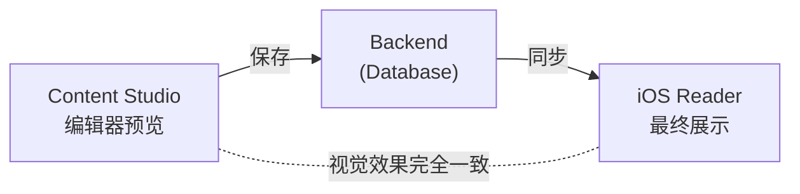
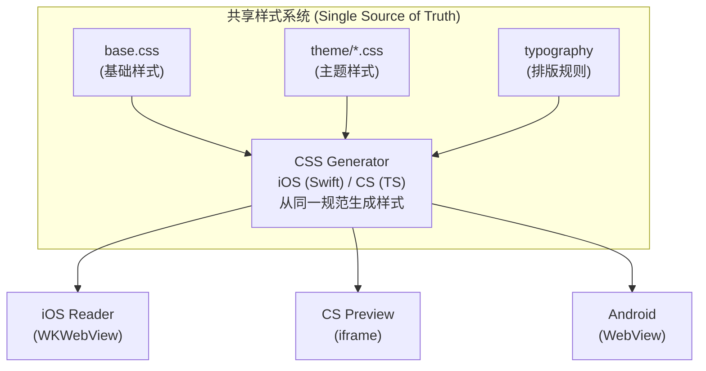
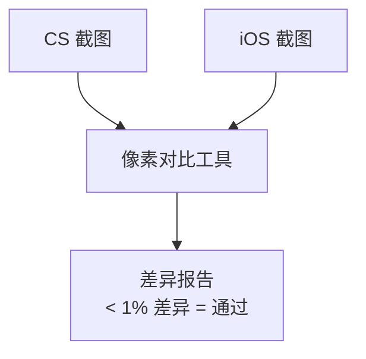

# iOS 阅读器模拟技术方案

## 背景与目标

### 问题描述

Content Studio (CS) 作为内容编辑工具，需要实现"所见即所得"(WYSIWYG) 的编辑体验。运营人员在 CS 中编辑排版后，期望 iOS 阅读器能完全一致地展示内容。

### 目标



## 现状分析

### iOS 阅读器渲染架构

```
┌──────────────────────────────────────────────────────────────────┐
│                      iOS ReaderContentView                        │
├──────────────────────────────────────────────────────────────────┤
│                                                                   │
│  ┌─────────────┐    ┌─────────────────────────────────────────┐  │
│  │ 用户设置    │    │         WKWebView                       │  │
│  │ • 字体大小  │───→│  ┌─────────────────────────────────┐    │  │
│  │ • 主题颜色  │    │  │     动态生成的 HTML + CSS       │    │  │
│  │ • 行高     │    │  │  • CSS Custom Properties        │    │  │
│  │ • 字间距   │    │  │  • 专业排版规则                  │    │  │
│  └─────────────┘    │  │  • 分页模式支持                  │    │  │
│                      │  │  • 高亮/批注层                   │    │  │
│                      │  └─────────────────────────────────┘    │  │
│                      └─────────────────────────────────────────┘  │
│                                                                   │
│  ┌─────────────────────────────────────────────────────────────┐  │
│  │                    JS Bridge 通信                            │  │
│  │  iOS Native ←──→ JavaScript (高亮、选中、手势等)            │  │
│  └─────────────────────────────────────────────────────────────┘  │
│                                                                   │
└──────────────────────────────────────────────────────────────────┘
```

### Content Studio 预览架构

```
┌──────────────────────────────────────────────────────────────────┐
│                    Content Studio Preview                         │
├──────────────────────────────────────────────────────────────────┤
│                                                                   │
│  ┌─────────────┐    ┌─────────────────────────────────────────┐  │
│  │ 主题切换    │    │         React 组件                      │  │
│  │ • 浅色     │───→│  ┌─────────────────────────────────┐    │  │
│  │ • 深色     │    │  │     静态 HTML 渲染               │    │  │
│  │ • 棕褐     │    │  │  • 简化的 CSS 类                 │    │  │
│  └─────────────┘    │  │  • 固定排版参数                  │    │  │
│                      │  │  • 无分页支持                    │    │  │
│                      │  └─────────────────────────────────┘    │  │
│                      └─────────────────────────────────────────┘  │
│                                                                   │
└──────────────────────────────────────────────────────────────────┘
```

## 差异对比

### CSS 功能对比

| 功能类别 | iOS 阅读器 | Content Studio | 差异程度 |
|---------|-----------|----------------|---------|
| CSS Custom Properties | ✅ 完整支持 | ❌ 不支持 | 高 |
| 动态字体大小 | ✅ 5档调节 | ❌ 固定值 | 高 |
| 动态行高 | ✅ 基于字体计算 | ❌ 固定值 | 中 |
| 字间距调节 | ✅ 支持 | ❌ 不支持 | 中 |
| 分页模式 | ✅ 支持 | ❌ 不支持 | 中 |
| 专业排版 | ✅ 完整 | ⚠️ 部分 | 中 |

### 排版特性对比

| 排版特性 | iOS 阅读器 | Content Studio |
|---------|-----------|----------------|
| 字距调整 (Kerning) | ✅ | ⚠️ 部分 |
| 连字 (Ligatures) | ✅ | ⚠️ 部分 |
| 孤字控制 (Orphans) | ✅ | ❌ |
| 寡行控制 (Widows) | ✅ | ❌ |
| 悬挂标点 | ✅ | ❌ |
| 首字下沉 | ✅ | ❌ |
| 文本渲染优化 | ✅ | ⚠️ 部分 |

### 主题变量对比

| 变量类别 | iOS 定义数量 | CS 定义数量 |
|---------|-------------|-------------|
| 颜色变量 | ~15 | ~8 |
| 字体变量 | ~10 | ~4 |
| 间距变量 | ~8 | ~3 |
| 总 CSS 行数 | ~700 行 | ~106 行 |

## 技术方案

### 方案概述



### 核心改造点

#### 1. 样式规范统一

建立统一的样式规范文件，作为 iOS 和 CS 的唯一样式来源。

```
shared/
└── reader-styles/
    ├── spec.json           # 样式规范定义
    ├── themes/
    │   ├── light.json      # 浅色主题参数
    │   ├── dark.json       # 深色主题参数
    │   └── sepia.json      # 棕褐主题参数
    └── typography.json     # 排版参数
```

#### 2. CSS 生成器

| 平台 | 生成器 | 输入 | 输出 |
|------|--------|------|------|
| iOS | Swift 函数 | spec.json | CSS 字符串 |
| CS | TypeScript 函数 | spec.json | CSS 字符串 |
| Android | Kotlin 函数 | spec.json | CSS 字符串 |

#### 3. Content Studio 预览升级

```
当前架构:
┌─────────────────────────────────────────┐
│ PhonePreview (React 组件)               │
│   └── ReaderContent (React 渲染)        │
│         └── dangerouslySetInnerHTML     │
└─────────────────────────────────────────┘

目标架构:
┌─────────────────────────────────────────┐
│ PhonePreview (React 组件)               │
│   └── iframe (隔离渲染环境)              │
│         └── 完整 iOS 等效 HTML + CSS     │
│               ├── CSS Custom Properties │
│               ├── 专业排版规则           │
│               └── 响应式适配            │
└─────────────────────────────────────────┘
```

### 实施步骤

```
阶段 1: 样式规范提取
├── 从 iOS ReaderContentView.swift 提取所有样式参数
├── 创建统一的 spec.json 规范文件
└── 验证规范完整性

阶段 2: CSS 生成器开发
├── 开发 TypeScript CSS 生成器
├── 生成器单元测试
└── 与 iOS 输出对比验证

阶段 3: CS 预览重构
├── 将 React 渲染改为 iframe 渲染
├── 集成 CSS 生成器
├── 实现主题切换
└── 实现设置面板 (字体大小、行高等)

阶段 4: iOS 侧改造
├── 重构 CSS 生成逻辑使用共享规范
├── 兼容性测试
└── 回归测试

阶段 5: 验证与优化
├── 视觉对比测试
├── 边界情况处理
└── 性能优化
```

## 预览组件交互设计

### 设置面板功能

```
┌─────────────────────────────────────────┐
│           Preview Settings              │
├─────────────────────────────────────────┤
│                                         │
│  主题:  ○ 浅色  ○ 棕褐  ○ 深色         │
│                                         │
│  字体大小:                              │
│  ┌─────────────────────────────────┐   │
│  │ A-  ●────────────────○  A+     │   │
│  └─────────────────────────────────┘   │
│                                         │
│  行高:                                  │
│  ┌─────────────────────────────────┐   │
│  │ 紧凑 ●────────────────○ 宽松   │   │
│  └─────────────────────────────────┘   │
│                                         │
│  字间距:                                │
│  ┌─────────────────────────────────┐   │
│  │ 紧凑 ●────────────────○ 宽松   │   │
│  └─────────────────────────────────┘   │
│                                         │
│  [ ] 显示分页模式                       │
│                                         │
└─────────────────────────────────────────┘
```

### 预览窗口布局

```
┌─────────────────────────────────────────────────────────────────────────┐
│                           Book Editor                                    │
├─────────────────────────────────────────────────────────────────────────┤
│                                                                          │
│  ┌──────────────────────────────┐  ┌──────────────────────────────────┐ │
│  │                              │  │     ┌──────────────────────┐    │ │
│  │                              │  │     │    ○ ○ ○             │    │ │
│  │      Monaco Editor           │  │     ├──────────────────────┤    │ │
│  │      (HTML 编辑)             │  │     │                      │    │ │
│  │                              │  │     │   iPhone Preview     │    │ │
│  │                              │  │     │   (iframe 渲染)      │    │ │
│  │                              │  │     │                      │    │ │
│  │                              │  │     │   与 iOS 阅读器      │    │ │
│  │                              │  │     │   完全一致的效果     │    │ │
│  │                              │  │     │                      │    │ │
│  │                              │  │     └──────────────────────┘    │ │
│  │                              │  │                                  │ │
│  │                              │  │     [设置] [浅色|深色|棕褐]     │ │
│  └──────────────────────────────┘  └──────────────────────────────────┘ │
│                                                                          │
└─────────────────────────────────────────────────────────────────────────┘
```

## 验证方法

### 视觉对比测试流程



### 测试用例矩阵

| 测试维度 | 测试项 |
|---------|--------|
| 主题 | 浅色、深色、棕褐 |
| 字体大小 | 5档全覆盖 |
| 内容类型 | 纯文本、标题、列表、引用、图片 |
| 特殊排版 | 首字下沉、长段落、短段落 |
| 屏幕尺寸 | iPhone SE、iPhone 15、iPhone 15 Pro Max |

## 风险与对策

| 风险 | 影响 | 对策 |
|------|------|------|
| 浏览器渲染差异 | CSS 表现不一致 | 使用 webkit 前缀，针对性测试 |
| 字体缺失 | 排版差异 | 使用系统字体栈，提供 fallback |
| iOS 版本差异 | 样式兼容性 | 维护最低版本兼容矩阵 |
| 性能问题 | 编辑卡顿 | 防抖更新，虚拟滚动 |

## 附录

### 相关文件

| 文件 | 说明 |
|------|------|
| `ios/Readmigo/Features/Reader/ReaderContentView.swift` | iOS 阅读器实现 |
| `tools/content-studio/src/components/preview/phone-preview.tsx` | CS 手机预览组件 |
| `tools/content-studio/src/components/preview/reader-content.tsx` | CS 阅读内容组件 |
| `tools/content-studio/src/styles/reader-theme/` | CS 阅读器主题样式 |
