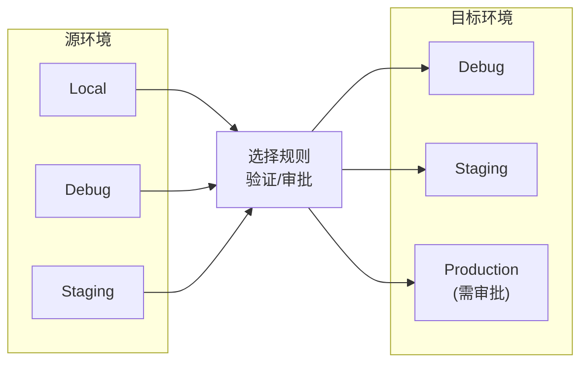
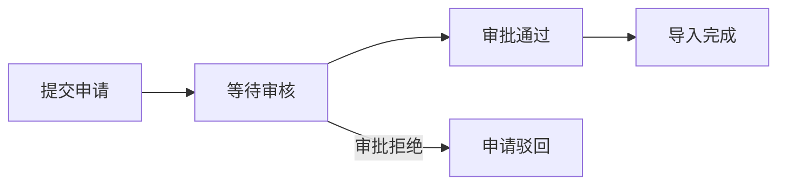

# 规则迁移

## 概述

规则迁移功能允许在不同环境之间导入和导出校正规则，实现规则的共享和推广。

## 迁移流程



## 迁移权限矩阵

### 导出来源

| 环境 | 可作为导出来源 | 说明 |
|------|----------------|------|
| Local | ✅ | 开发测试的规则 |
| Debug | ✅ | 调试验证的规则 |
| Staging | ✅ | 预发布验证的规则 |
| Production | ❌ | 禁止从生产导出 |

### 导入目标

| 目标环境 | 权限要求 | 说明 |
|----------|----------|------|
| Local | 无需审批 | 自由测试 |
| Debug | 无需审批 | 调试用途 |
| Staging | 无需审批 | 预发布验证 |
| Production | 需管理员审批 | 影响真实用户 |

## 导出流程

```
┌──────────────────────────────────────────────────────────────────┐
│  导出规则                                                         │
├──────────────────────────────────────────────────────────────────┤
│                                                                   │
│  选择要导出的规则:                            [取消全选] [全选]   │
│                                                                   │
│  ┌────────────────────────────────────────────────────────────┐ │
│  │ ☑ 清理空段落                                         98%  │ │
│  │ ☑ 修复嵌套标签                                       95%  │ │
│  │ ☐ 合并分散段落                                  ⚠️  76%  │ │
│  │ ☑ 标准化标题格式                                     92%  │ │
│  └────────────────────────────────────────────────────────────┘ │
│                                                                   │
│  目标环境: [选择目标环境 ▼]                                      │
│                                                                   │
│  已选择 3 条规则                              [导出规则]          │
│                                                                   │
└──────────────────────────────────────────────────────────────────┘
```

### 低置信度警告

当选择置信度低于 80% 的规则时，显示警告：

```
┌────────────────────────────────────────────────┐
│  ⚠️ 警告                                        │
├────────────────────────────────────────────────┤
│                                                 │
│  以下规则置信度较低，可能需要更多验证:         │
│                                                 │
│  • 合并分散段落 (76%)                          │
│                                                 │
│  是否继续导出?                                 │
│                                                 │
│                    [取消]  [继续导出]          │
└────────────────────────────────────────────────┘
```

## 导入流程

```
┌──────────────────────────────────────────────────────────────────┐
│  导入规则                                                         │
├──────────────────────────────────────────────────────────────────┤
│                                                                   │
│  源环境: [选择源环境 ▼]                                          │
│                                                                   │
│  可导入的规则 (来自 Debug):                                      │
│                                                                   │
│  ┌────────────────────────────────────────────────────────────┐ │
│  │ ☑ 新规则A                                    ✓ 验证通过   │ │
│  │ ☑ 新规则B                                    ✓ 验证通过   │ │
│  │ ☐ 实验规则C                                  ⚠️ 仍在测试  │ │
│  └────────────────────────────────────────────────────────────┘ │
│                                                                   │
│                                               [导入选中规则]      │
│                                                                   │
└──────────────────────────────────────────────────────────────────┘
```

## Production 导入审批

### 审批流程



### 审批界面

```
┌──────────────────────────────────────────────────────────────────┐
│  Production 导入审批                                              │
├──────────────────────────────────────────────────────────────────┤
│                                                                   │
│  待审批申请 (2)                                                   │
│                                                                   │
│  ┌────────────────────────────────────────────────────────────┐ │
│  │ 申请人: 运营A                                               │ │
│  │ 申请时间: 2024-01-15 14:30                                 │ │
│  │ 来源环境: Staging                                          │ │
│  │ 规则数量: 5 条                                             │ │
│  │                                                             │ │
│  │ 规则列表:                                                  │ │
│  │ • 清理空段落 (98%)                                         │ │
│  │ • 修复嵌套标签 (95%)                                       │ │
│  │ • 标准化标题格式 (92%)                                     │ │
│  │ • 清理冗余样式 (89%)                                       │ │
│  │ • 修复断句问题 (85%)                                       │ │
│  │                                                             │ │
│  │                            [拒绝]  [批准导入]              │ │
│  └────────────────────────────────────────────────────────────┘ │
│                                                                   │
└──────────────────────────────────────────────────────────────────┘
```

## 迁移记录

### 迁移历史

| 时间 | 操作 | 来源 | 目标 | 规则数 | 状态 | 操作人 |
|------|------|------|------|--------|------|--------|
| 2024-01-15 | 导出 | Debug | Staging | 3 | 完成 | 运营A |
| 2024-01-14 | 导入 | Staging | Production | 5 | 待审批 | 运营B |
| 2024-01-13 | 导出 | Local | Debug | 2 | 完成 | 运营A |

### 规则版本追踪

```
规则: 清理空段落

版本历史:
┌──────────┬────────────┬──────────┬─────────────┐
│  版本    │   环境     │   状态   │    时间      │
├──────────┼────────────┼──────────┼─────────────┤
│  v1.0    │  Local     │  创建    │ 2024-01-10  │
│  v1.0    │  Debug     │  迁移    │ 2024-01-11  │
│  v1.1    │  Debug     │  修改    │ 2024-01-12  │
│  v1.1    │  Staging   │  迁移    │ 2024-01-13  │
│  v1.1    │  Production│  待审批  │ 2024-01-14  │
└──────────┴────────────┴──────────┴─────────────┘
```

## 冲突处理

### 冲突类型

| 冲突类型 | 描述 | 处理方式 |
|----------|------|----------|
| 同名规则 | 目标环境已存在同名规则 | 提示用户选择覆盖或重命名 |
| 选择器冲突 | 选择器与现有规则重叠 | 显示警告，让用户决定 |
| 依赖缺失 | 规则依赖的其他规则不存在 | 自动包含依赖规则 |

### 冲突解决界面

```
┌────────────────────────────────────────────────┐
│  ⚠️ 发现冲突                                    │
├────────────────────────────────────────────────┤
│                                                 │
│  规则 "清理空段落" 在目标环境已存在            │
│                                                 │
│  现有版本:                                     │
│  • 置信度: 95%                                 │
│  • 应用次数: 1234                              │
│                                                 │
│  导入版本:                                     │
│  • 置信度: 98%                                 │
│  • 应用次数: 567                               │
│                                                 │
│  [保留现有]  [覆盖]  [创建新规则]              │
└────────────────────────────────────────────────┘
```
