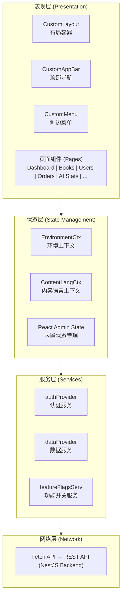
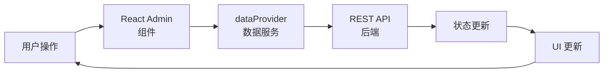
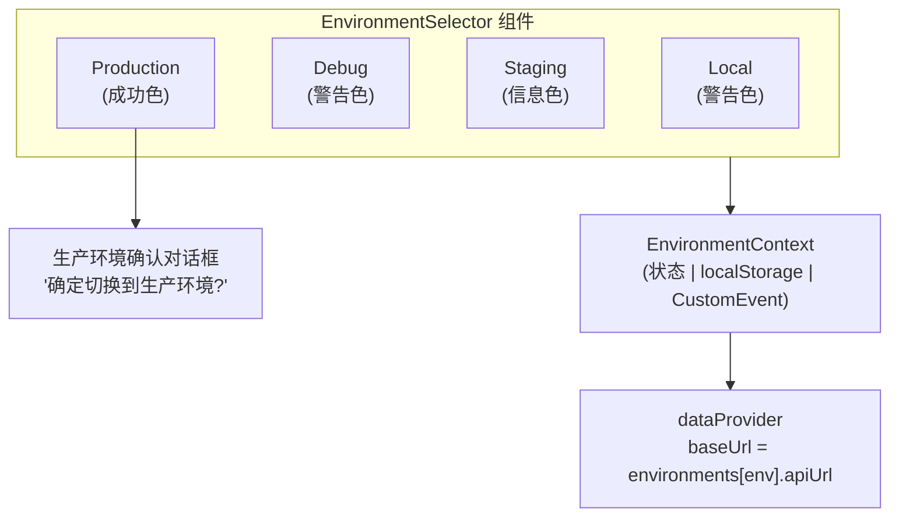
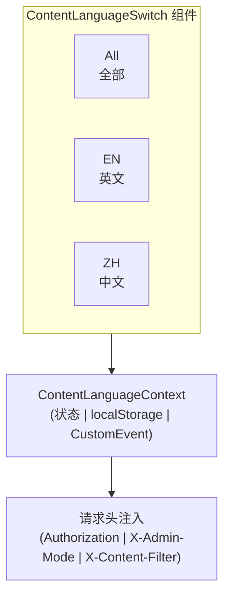
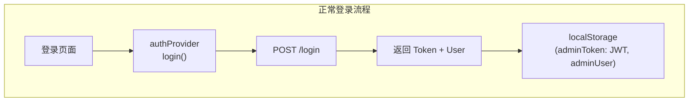
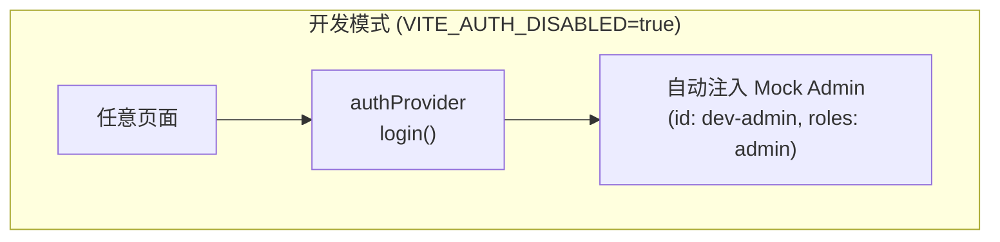
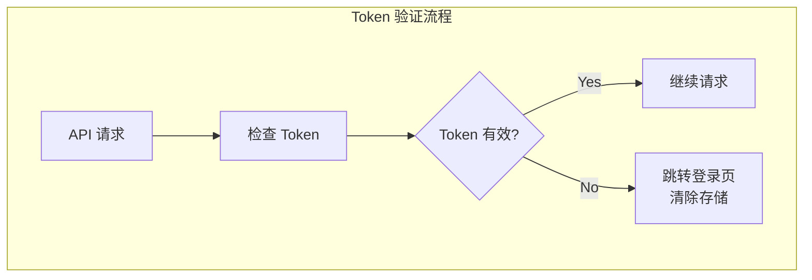
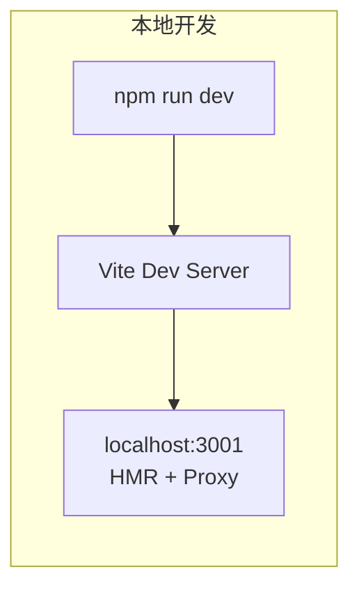
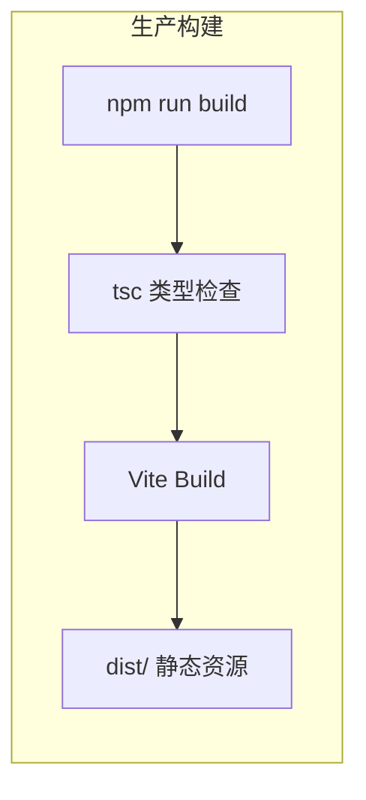
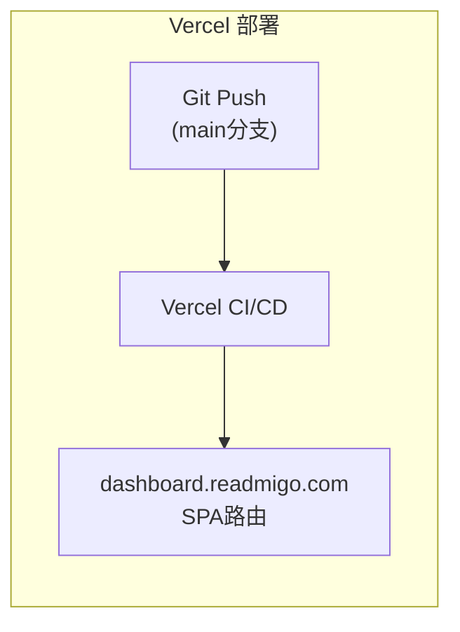

# Dashboard 架构设计

## 整体架构



## 技术栈详情

```
┌─────────────────────────────────────────────────────────────────────────────┐
│                           技术栈版本                                         │
├─────────────────────────────────────────────────────────────────────────────┤
│                                                                             │
│  核心框架                                                                    │
│  ─────────────────────────────────────────────────────────────────          │
│  react                    18.3.1       前端框架                              │
│  typescript               5.6.x        类型系统                              │
│  react-router-dom         7.11.0       路由管理                              │
│                                                                             │
│  Admin 框架                                                                  │
│  ─────────────────────────────────────────────────────────────────          │
│  react-admin              5.3.0        Admin框架核心                         │
│  ra-data-simple-rest      5.3.0        REST数据提供者                        │
│  ra-i18n-polyglot         5.3.0        国际化支持                            │
│                                                                             │
│  UI 组件                                                                     │
│  ─────────────────────────────────────────────────────────────────          │
│  @mui/material            6.1.0        Material UI组件库                     │
│  @mui/icons-material      6.1.0        Material图标库                        │
│  @emotion/react           11.13.0      CSS-in-JS样式                         │
│  @emotion/styled          11.13.0      样式组件                              │
│                                                                             │
│  数据可视化                                                                  │
│  ─────────────────────────────────────────────────────────────────          │
│  recharts                 2.13.0       图表库                                │
│                                                                             │
│  国际化                                                                      │
│  ─────────────────────────────────────────────────────────────────          │
│  ra-language-chinese      2.0.10       中文语言包                            │
│  ra-language-english      5.0.0        英文语言包                            │
│                                                                             │
│  构建工具                                                                    │
│  ─────────────────────────────────────────────────────────────────          │
│  vite                     5.4.0        构建工具                              │
│                                                                             │
└─────────────────────────────────────────────────────────────────────────────┘
```

## 数据流架构



| 步骤 | 说明 |
|------|------|
| 1 | 用户在页面组件中触发操作 (列表加载/创建/编辑/删除) |
| 2 | React Admin 调用 dataProvider 对应方法 |
| 3 | dataProvider 构建请求 (添加认证头、环境URL、内容语言) |
| 4 | Fetch API 发送 REST 请求到后端 |
| 5 | 后端返回响应数据 |
| 6 | dataProvider 转换响应格式 |
| 7 | React Admin 更新内部状态缓存 |
| 8 | 组件根据新状态重新渲染 |

## 环境切换架构



| 环境 | API URL |
|------|---------|
| local | http://localhost:3000/api/v1/admin |
| debug | https://readmigo-debug.fly.dev/api/v1/admin |
| staging | https://staging-api.readmigo.com/api/v1/admin |
| production | https://api.readmigo.com/api/v1/admin |

## 内容语言过滤架构



| 设计原则 | 说明 |
|----------|------|
| 一次选择 | 用户在全局设置中选择语言，无需每页选择 |
| 无混合内容 | 选择后所有页面只显示该语言内容 |
| 无单项选择 | 创建/编辑内容时无需选择语言 |
| 上下文感知 | 所有操作继承全局语言上下文 |

## React Admin 资源注册

```
┌─────────────────────────────────────────────────────────────────────────────┐
│                       资源注册架构 (App.tsx)                                 │
├─────────────────────────────────────────────────────────────────────────────┤
│                                                                             │
│  <Admin                                                                     │
│    dataProvider={dataProvider}                                              │
│    authProvider={authProvider}                                              │
│    i18nProvider={i18nProvider}                                              │
│    layout={CustomLayout}                                                    │
│    theme={theme}                                                            │
│  >                                                                          │
│                                                                             │
│    ┌─────────────────────────────────────────────────────────────────────┐  │
│    │                        标准资源                                      │  │
│    │                                                                      │  │
│    │  Resource: books                                                     │  │
│    │    └── list, create, edit, show                                     │  │
│    │                                                                      │  │
│    │  Resource: authors                                                   │  │
│    │    └── list, edit, show                                             │  │
│    │                                                                      │  │
│    │  Resource: categories                                                │  │
│    │    └── list, create, edit                                           │  │
│    │                                                                      │  │
│    │  Resource: booklists                                                 │  │
│    │    └── list, create, edit, show                                     │  │
│    │                                                                      │  │
│    │  Resource: users                                                     │  │
│    │    └── list, show                                                   │  │
│    │                                                                      │  │
│    │  Resource: quotes                                                    │  │
│    │    └── list, create, edit, show                                     │  │
│    │                                                                      │  │
│    │  Resource: postcards                                                 │  │
│    │    └── list, show                                                   │  │
│    │                                                                      │  │
│    │  Resource: postcard-templates                                        │  │
│    │    └── list, create, edit                                           │  │
│    │                                                                      │  │
│    │  Resource: messages                                                  │  │
│    │    └── list, show                                                   │  │
│    │                                                                      │  │
│    │  Resource: feedback                                                  │  │
│    │    └── list, show                                                   │  │
│    │                                                                      │  │
│    │  Resource: admin/tickets                                             │  │
│    │    └── list, show                                                   │  │
│    │                                                                      │  │
│    │  Resource: admin/orders                                              │  │
│    │    └── list, show                                                   │  │
│    │                                                                      │  │
│    │  Resource: import/batches                                            │  │
│    │    └── list                                                         │  │
│    │                                                                      │  │
│    └─────────────────────────────────────────────────────────────────────┘  │
│                                                                             │
│    ┌─────────────────────────────────────────────────────────────────────┐  │
│    │                       自定义路由                                     │  │
│    │                                                                      │  │
│    │  Route: /                     → Dashboard                           │  │
│    │  Route: /ai-stats             → AIStats                             │  │
│    │  Route: /feature-flags        → FeatureFlagsList                    │  │
│    │  Route: /support-dashboard    → SupportDashboard                    │  │
│    │                                                                      │  │
│    └─────────────────────────────────────────────────────────────────────┘  │
│                                                                             │
│  </Admin>                                                                   │
│                                                                             │
└─────────────────────────────────────────────────────────────────────────────┘
```

## 认证流程







## 构建与部署架构






