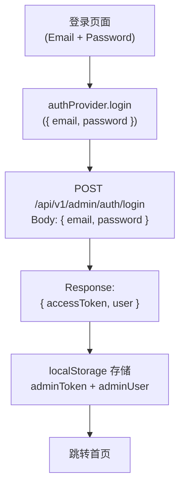

# Dashboard 认证授权

## 认证机制

```
┌─────────────────────────────────────────────────────────────────────────────┐
│                         认证流程                                             │
├─────────────────────────────────────────────────────────────────────────────┤
│                                                                             │
│  登录方式:                                                                   │
│  ─────────────────────────────────────────────────────────────────          │
│  • 邮箱密码登录 (管理员账号)                                                 │
│  • 开发模式自动登录 (VITE_AUTH_DISABLED=true)                               │
│                                                                             │
│  Token 机制:                                                                 │
│  ─────────────────────────────────────────────────────────────────          │
│  • 类型: JWT (JSON Web Token)                                               │
│  • 存储: localStorage.adminToken                                            │
│  • 传输: Authorization: Bearer {token}                                      │
│                                                                             │
└─────────────────────────────────────────────────────────────────────────────┘
```

## 登录流程



## 开发模式

```
┌─────────────────────────────────────────────────────────────────────────────┐
│                         开发模式登录                                         │
├─────────────────────────────────────────────────────────────────────────────┤
│                                                                             │
│  环境变量: VITE_AUTH_DISABLED=true                                          │
│                                                                             │
│  ┌───────────────────────────────────────────────────────────────────────┐  │
│  │  自动注入 Mock Admin 用户                                              │  │
│  │                                                                        │  │
│  │  {                                                                     │  │
│  │    id: 'dev-admin',                                                    │  │
│  │    email: 'admin@readmigo.com',                                        │  │
│  │    displayName: 'Dev Admin',                                           │  │
│  │    roles: ['admin']                                                    │  │
│  │  }                                                                     │  │
│  │                                                                        │  │
│  └───────────────────────────────────────────────────────────────────────┘  │
│                                                                             │
│  特点:                                                                       │
│  ─────────────────────────────────────────────────────────────────          │
│  • 无需输入凭据                                                              │
│  • 自动获得 admin 角色                                                       │
│  • 跳过后端认证验证                                                          │
│  • 仅限开发环境使用                                                          │
│                                                                             │
└─────────────────────────────────────────────────────────────────────────────┘
```

## authProvider 接口

```
┌─────────────────────────────────────────────────────────────────────────────┐
│                       authProvider 方法                                      │
├─────────────────────────────────────────────────────────────────────────────┤
│                                                                             │
│  login(params: { email, password })                                         │
│  ─────────────────────────────────────────────────────────────────          │
│  • 发送登录请求到后端                                                        │
│  • 存储返回的 Token 和用户信息                                               │
│  • 返回 Promise<void>                                                       │
│                                                                             │
│  logout()                                                                   │
│  ─────────────────────────────────────────────────────────────────          │
│  • 清除 localStorage 中的 adminToken                                        │
│  • 清除 localStorage 中的 adminUser                                         │
│  • 重定向到登录页                                                            │
│                                                                             │
│  checkAuth()                                                                │
│  ─────────────────────────────────────────────────────────────────          │
│  • 检查 localStorage 中是否存在有效 Token                                   │
│  • Token 存在: resolve()                                                    │
│  • Token 不存在: reject() → 触发 logout                                     │
│                                                                             │
│  checkError(error: { status })                                              │
│  ─────────────────────────────────────────────────────────────────          │
│  • 处理 API 请求错误                                                         │
│  • 401/403: reject() → 触发 logout                                          │
│  • 其他错误: resolve()                                                      │
│                                                                             │
│  getIdentity()                                                              │
│  ─────────────────────────────────────────────────────────────────          │
│  • 从 localStorage 读取 adminUser                                           │
│  • 返回 { id, fullName, avatar }                                            │
│                                                                             │
│  getPermissions()                                                           │
│  ─────────────────────────────────────────────────────────────────          │
│  • 从 adminUser 中提取 roles                                                │
│  • 返回角色数组用于权限判断                                                  │
│                                                                             │
└─────────────────────────────────────────────────────────────────────────────┘
```

## 权限角色 (RBAC)

```
┌─────────────────────────────────────────────────────────────────────────────┐
│                         角色定义                                             │
├─────────────────────────────────────────────────────────────────────────────┤
│                                                                             │
│  Super Admin                                                                │
│  ─────────────────────────────────────────────────────────────────          │
│  • 所有功能的完整访问权限                                                    │
│  • 系统设置和配置                                                            │
│  • 管理员账户管理                                                            │
│  • 数据删除权限                                                              │
│                                                                             │
│  Content Manager                                                            │
│  ─────────────────────────────────────────────────────────────────          │
│  • 书籍内容 CRUD                                                             │
│  • 作者、分类、榜单管理                                                      │
│  • 词汇管理                                                                  │
│  • 内容审核                                                                  │
│                                                                             │
│  Operations                                                                 │
│  ─────────────────────────────────────────────────────────────────          │
│  • 用户管理 (只读/有限编辑)                                                  │
│  • 订阅管理                                                                  │
│  • 数据分析报表                                                              │
│  • 反馈和工单处理                                                            │
│                                                                             │
│  Viewer                                                                     │
│  ─────────────────────────────────────────────────────────────────          │
│  • 所有数据的只读权限                                                        │
│  • 无编辑、创建、删除权限                                                    │
│                                                                             │
└─────────────────────────────────────────────────────────────────────────────┘
```

## 权限矩阵

```
┌─────────────────────────────────────────────────────────────────────────────┐
│                         权限矩阵                                             │
├─────────────────────────────────────────────────────────────────────────────┤
│                                                                             │
│  模块              Super Admin  Content Mgr  Operations  Viewer             │
│  ─────────────────────────────────────────────────────────────────          │
│  首页仪表盘              ✅          ✅           ✅         ✅              │
│                                                                             │
│  书籍管理 - 查看         ✅          ✅           ✅         ✅              │
│  书籍管理 - 创建         ✅          ✅           ❌         ❌              │
│  书籍管理 - 编辑         ✅          ✅           ❌         ❌              │
│  书籍管理 - 删除         ✅          ❌           ❌         ❌              │
│                                                                             │
│  作者管理 - 查看         ✅          ✅           ✅         ✅              │
│  作者管理 - 编辑         ✅          ✅           ❌         ❌              │
│                                                                             │
│  分类管理                ✅          ✅           ❌         ❌              │
│  榜单管理                ✅          ✅           ❌         ❌              │
│                                                                             │
│  用户管理 - 查看         ✅          ❌           ✅         ✅              │
│  用户管理 - 操作         ✅          ❌           ✅         ❌              │
│                                                                             │
│  AI服务监控              ✅          ✅           ✅         ✅              │
│                                                                             │
│  订单管理 - 查看         ✅          ❌           ✅         ✅              │
│  订单管理 - 操作         ✅          ❌           ✅         ❌              │
│                                                                             │
│  反馈/工单               ✅          ❌           ✅         ✅              │
│                                                                             │
│  功能开关                ✅          ❌           ❌         ❌              │
│                                                                             │
│  系统设置                ✅          ❌           ❌         ❌              │
│                                                                             │
└─────────────────────────────────────────────────────────────────────────────┘
```

## 会话存储

```
┌─────────────────────────────────────────────────────────────────────────────┐
│                       localStorage 存储项                                    │
├─────────────────────────────────────────────────────────────────────────────┤
│                                                                             │
│  Key                         Value                     说明                 │
│  ─────────────────────────────────────────────────────────────────          │
│  adminToken                  JWT字符串                 认证令牌              │
│  adminUser                   JSON字符串               用户信息               │
│  locale                      'en' | 'zh-Hans' | ...   UI语言偏好            │
│  dashboard_environment       环境名称                 当前环境              │
│  contentLanguage             'all' | 'en' | 'zh'     内容语言过滤           │
│                                                                             │
│  adminUser 结构:                                                            │
│  ─────────────────────────────────────────────────────────────────          │
│  {                                                                          │
│    "id": "user-uuid",                                                       │
│    "email": "admin@readmigo.com",                                           │
│    "displayName": "Admin Name",                                             │
│    "roles": ["admin", "content_manager"]                                    │
│  }                                                                          │
│                                                                             │
└─────────────────────────────────────────────────────────────────────────────┘
```

## 安全考虑

```
┌─────────────────────────────────────────────────────────────────────────────┐
│                         安全措施                                             │
├─────────────────────────────────────────────────────────────────────────────┤
│                                                                             │
│  前端安全:                                                                   │
│  ─────────────────────────────────────────────────────────────────          │
│  • Token 存储在 localStorage (注意 XSS 风险)                                │
│  • 敏感操作需要后端二次验证                                                  │
│  • 生产环境禁用 AUTH_DISABLED                                               │
│  • 切换生产环境需要确认对话框                                                │
│                                                                             │
│  后端安全:                                                                   │
│  ─────────────────────────────────────────────────────────────────          │
│  • 所有 /admin/* 端点需要有效 Token                                         │
│  • 基于角色的权限检查                                                        │
│  • 操作审计日志                                                              │
│  • 速率限制防止暴力破解                                                      │
│                                                                             │
│  建议改进:                                                                   │
│  ─────────────────────────────────────────────────────────────────          │
│  • 考虑使用 httpOnly Cookie 存储 Token                                      │
│  • 实现 Token 刷新机制                                                      │
│  • 添加登录设备管理                                                          │
│  • 实现登录异常检测                                                          │
│                                                                             │
└─────────────────────────────────────────────────────────────────────────────┘
```
