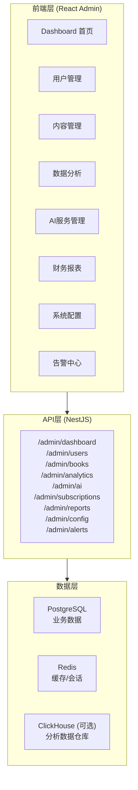

# Dashboard运营管理平台

### 21.1 平台架构



### 21.2 功能模块设计

```
┌─────────────────────────────────────────────────────────────────────────┐
│                      Dashboard 首页概览                                  │
├─────────────────────────────────────────────────────────────────────────┤
│                                                                         │
│  今日关键指标                                                            │
│  ┌───────────┐ ┌───────────┐ ┌───────────┐ ┌───────────┐ ┌───────────┐ │
│  │ DAU       │ │ 新用户    │ │ 阅读时长  │ │ AI调用    │ │ 收入      │ │
│  │  8,432    │ │   234     │ │  3.2h/人  │ │   45.6K   │ │  $1,234   │ │
│  │  ↑12%     │ │  ↑8%      │ │  ↑0.3h    │ │  ↓5%      │ │  ↑15%     │ │
│  └───────────┘ └───────────┘ └───────────┘ └───────────┘ └───────────┘ │
│                                                                         │
│  ┌─────────────────────────────────┐ ┌─────────────────────────────────┐│
│  │ 用户增长趋势 (30天)              │ │ 收入趋势 (30天)                  ││
│  │                                 │ │                                 ││
│  │      ╱──────────────            │ │           ╱──────              ││
│  │     ╱                           │ │          ╱                     ││
│  │    ╱                            │ │      ╱──╱                      ││
│  │   ╱                             │ │     ╱                          ││
│  │  ╱                              │ │ ───╱                           ││
│  │ ╱                               │ │                                ││
│  └─────────────────────────────────┘ └─────────────────────────────────┘│
│                                                                         │
│  ┌─────────────────────────────────────────────────────────────────────┐│
│  │ 待处理事项                                                          ││
│  │ ───────────                                                         ││
│  │ ⚠️ 3 个告警需要处理           [查看]                                ││
│  │ 📚 12 本新书待审核           [审核]                                 ││
│  │ 💬 5 条用户反馈待回复        [处理]                                 ││
│  │ 📊 周报待生成                [生成]                                 ││
│  └─────────────────────────────────────────────────────────────────────┘│
│                                                                         │
└─────────────────────────────────────────────────────────────────────────┘

┌─────────────────────────────────────────────────────────────────────────┐
│                      用户管理模块                                        │
├─────────────────────────────────────────────────────────────────────────┤
│                                                                         │
│  筛选条件: [注册时间 ▼] [订阅状态 ▼] [平台 ▼] [🔍 搜索用户...]          │
│                                                                         │
│  ┌─────────────────────────────────────────────────────────────────────┐│
│  │ ID     │ 昵称      │ 邮箱            │ 订阅    │ 阅读时长│ 操作    ││
│  │────────┼───────────┼─────────────────┼─────────┼─────────┼─────────││
│  │ 10001  │ Alice     │ alice@test.com  │ Premium │ 45.2h   │ [详情]  ││
│  │ 10002  │ Bob       │ bob@test.com    │ Free    │ 12.3h   │ [详情]  ││
│  │ 10003  │ Charlie   │ charlie@test... │ Pro     │ 89.1h   │ [详情]  ││
│  │ ...    │           │                 │         │         │         ││
│  └─────────────────────────────────────────────────────────────────────┘│
│                                                                         │
│  [< 上一页]  第 1 页，共 234 页  [下一页 >]     [导出CSV]                │
│                                                                         │
│  用户详情弹窗                                                            │
│  ┌─────────────────────────────────────────────────────────────────────┐│
│  │ 👤 Alice Chen                                           [关闭] [X] ││
│  │ ─────────────────────────────────────────────────────────────────  ││
│  │                                                                     ││
│  │ 基本信息                          订阅信息                          ││
│  │ ────────                          ────────                          ││
│  │ 邮箱: alice@test.com              计划: Premium                     ││
│  │ 注册: 2024-06-15                  到期: 2025-06-15                  ││
│  │ 最后活跃: 2小时前                 续费状态: 自动续费                ││
│  │ 平台: iOS (iPhone 15)                                               ││
│  │                                                                     ││
│  │ 学习统计                          AI使用情况                        ││
│  │ ────────                          ────────────                       ││
│  │ 阅读书籍: 12本                    本月AI调用: 1,234次               ││
│  │ 总阅读时长: 45.2小时              查词: 890次                       ││
│  │ 掌握单词: 456个                   翻译: 234次                       ││
│  │ 连续学习: 23天                    语法分析: 110次                   ││
│  │                                                                     ││
│  │ [发送消息] [延长订阅] [重置密码] [禁用账户]                         ││
│  └─────────────────────────────────────────────────────────────────────┘│
│                                                                         │
└─────────────────────────────────────────────────────────────────────────┘

┌─────────────────────────────────────────────────────────────────────────┐
│                      内容管理模块                                        │
├─────────────────────────────────────────────────────────────────────────┤
│                                                                         │
│  [书籍列表] [待审核] [分类管理] [推荐设置] [批量导入]                    │
│                                                                         │
│  书籍列表                                                                │
│  ┌─────────────────────────────────────────────────────────────────────┐│
│  │ 封面 │ 书名              │ 作者     │ 阅读量  │ 状态    │ 操作     ││
│  │──────┼───────────────────┼──────────┼─────────┼─────────┼──────────││
│  │ [📕] │ Pride & Prejudice │ Austen   │ 12,345  │ ✅ 上架 │ [编辑]   ││
│  │ [📗] │ Great Expectations│ Dickens  │ 8,901   │ ✅ 上架 │ [编辑]   ││
│  │ [📘] │ 1984              │ Orwell   │ 15,678  │ ⚠️ 版权 │ [审核]   ││
│  └─────────────────────────────────────────────────────────────────────┘│
│                                                                         │
│  书籍编辑                                                                │
│  ┌─────────────────────────────────────────────────────────────────────┐│
│  │                                                                     ││
│  │  基本信息                                                           ││
│  │  ────────                                                           ││
│  │  书名: [Pride and Prejudice                ]                        ││
│  │  作者: [Jane Austen                        ]                        ││
│  │  分类: [Classic Fiction ▼]                                          ││
│  │  难度: [◉ 初级  ○ 中级  ○ 高级]                                     ││
│  │  简介: [────────────────────────────────────]                       ││
│  │        [A classic novel about love and...  ]                        ││
│  │        [────────────────────────────────────]                       ││
│  │                                                                     ││
│  │  EPUB文件                              封面图片                     ││
│  │  ──────────                            ──────────                   ││
│  │  [pride_prejudice.epub] [重新上传]     [📷] [重新上传]              ││
│  │                                                                     ││
│  │  [保存]  [预览]  [下架]                                             ││
│  │                                                                     ││
│  └─────────────────────────────────────────────────────────────────────┘│
│                                                                         │
└─────────────────────────────────────────────────────────────────────────┘

┌─────────────────────────────────────────────────────────────────────────┐
│                      AI服务管理模块                                      │
├─────────────────────────────────────────────────────────────────────────┤
│                                                                         │
│  [使用统计] [费用分析] [模型配置] [缓存管理] [Prompt模板]               │
│                                                                         │
│  模型配置                                                                │
│  ┌─────────────────────────────────────────────────────────────────────┐│
│  │                                                                     ││
│  │  模型路由配置                                                       ││
│  │  ══════════════                                                      ││
│  │                                                                     ││
│  │  查词功能                                                           ││
│  │  ┌─────────────────────────────────────────────────────────────┐   ││
│  │  │ 优先级 │ 模型           │ 启用  │ 超时  │ 费用限制          │   ││
│  │  │────────┼────────────────┼───────┼───────┼───────────────────│   ││
│  │  │ 1      │ Local Dict     │ [✓]   │ 100ms │ -                 │   ││
│  │  │ 2      │ Redis Cache    │ [✓]   │ 50ms  │ -                 │   ││
│  │  │ 3      │ DeepSeek       │ [✓]   │ 5s    │ $100/天           │   ││
│  │  │ 4      │ GPT-4o-mini    │ [✓]   │ 10s   │ $50/天            │   ││
│  │  │ 5      │ Claude         │ [ ]   │ 15s   │ $30/天            │   ││
│  │  └─────────────────────────────────────────────────────────────┘   ││
│  │                                                                     ││
│  │  全局设置                                                           ││
│  │  ┌─────────────────────────────────────────────────────────────┐   ││
│  │  │ 每日费用上限:    [$200        ]                              │   ││
│  │  │ 缓存有效期:      [24 小时     ]                              │   ││
│  │  │ 单用户限流:      [100 次/分钟 ]                              │   ││
│  │  │ 超限处理:        [○ 排队  ◉ 降级  ○ 拒绝]                   │   ││
│  │  └─────────────────────────────────────────────────────────────┘   ││
│  │                                                                     ││
│  │  [保存配置]  [重置默认]                                             ││
│  │                                                                     ││
│  └─────────────────────────────────────────────────────────────────────┘│
│                                                                         │
│  费用分析 (本月)                                                        │
│  ┌─────────────────────────────────────────────────────────────────────┐│
│  │                                                                     ││
│  │  总费用: $1,234.56                        预算: $2,000             ││
│  │  ████████████████████░░░░░░░░░░░░░░░░░░░  62% 已使用              ││
│  │                                                                     ││
│  │  按模型分布                    按功能分布                           ││
│  │  ┌───────────────────┐        ┌───────────────────┐                ││
│  │  │ DeepSeek   $789   │        │ 查词      $567    │                ││
│  │  │ GPT-4o-mini $345  │        │ 翻译      $234    │                ││
│  │  │ Claude     $100   │        │ 语法分析  $189    │                ││
│  │  │                   │        │ 摘要      $145    │                ││
│  │  │                   │        │ 其他      $99     │                ││
│  │  └───────────────────┘        └───────────────────┘                ││
│  │                                                                     ││
│  └─────────────────────────────────────────────────────────────────────┘│
│                                                                         │
└─────────────────────────────────────────────────────────────────────────┘
```

---

