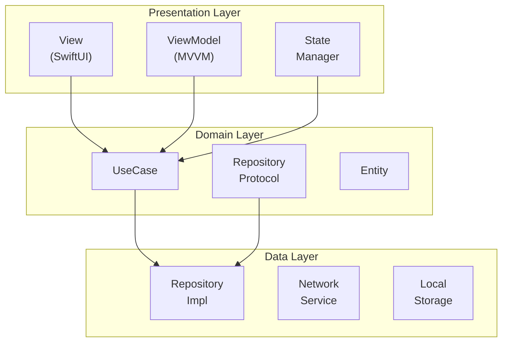
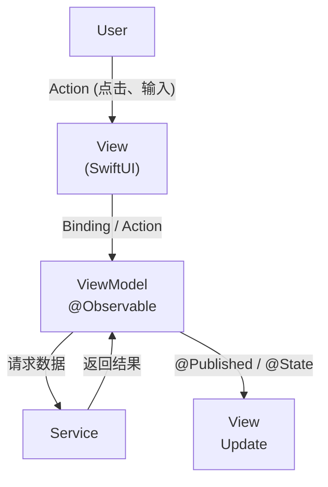
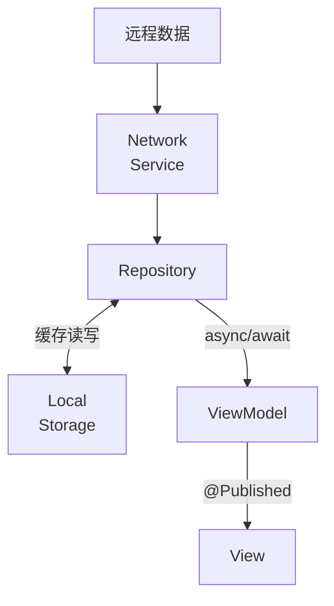

# iOS 应用架构

> MVVM + Clean Architecture + Swift Concurrency

---

## 1. 架构概览



---

## 2. 模块结构

### 2.1 Core 模块

| 模块 | 职责 |
|------|------|
| Config | 应用配置、环境管理 |
| Models | 共享数据模型 |
| Services | 核心服务 |
| Storage | 持久化存储 |
| UI | 基础 UI 组件 |
| Utils | 工具函数 |

### 2.2 Feature 模块结构

```
Feature/{Module}/
├── Views/              # SwiftUI 视图
├── ViewModels/         # ViewModel
├── Models/             # 模块特定模型
├── Services/           # 模块服务
└── Components/         # 模块组件
```

---

## 3. MVVM 模式

### 3.1 数据流



### 3.2 ViewModel 设计

| 属性类型 | 用途 |
|----------|------|
| @Published | 可观察状态 |
| @MainActor | 主线程更新 |
| private(set) | 只读状态 |

---

## 4. 依赖注入

### 4.1 依赖容器

```
┌─────────────────────────────────────────────────────────────────┐
│                    依赖注入                                      │
├─────────────────────────────────────────────────────────────────┤
│                                                                  │
│  AppContainer                                                   │
│  ├── NetworkService                                             │
│  ├── StorageService                                             │
│  ├── AuthService                                                │
│  ├── AIService                                                  │
│  └── AnalyticsService                                           │
│                                                                  │
│  注入方式                                                        │
│  ├── Environment                                                │
│  │   └── @EnvironmentObject                                    │
│  │                                                              │
│  ├── 构造器注入                                                  │
│  │   └── init(service: ServiceProtocol)                        │
│  │                                                              │
│  └── 属性注入                                                    │
│      └── @Inject var service: ServiceProtocol                 │
│                                                                  │
└─────────────────────────────────────────────────────────────────┘
```

### 4.2 依赖关系

| 层级 | 依赖 |
|------|------|
| View | ViewModel |
| ViewModel | Service, Repository |
| Service | Network, Storage |
| Repository | DataSource |

---

## 5. 导航架构

### 5.1 NavigationStack

```
┌─────────────────────────────────────────────────────────────────┐
│                    导航结构                                      │
├─────────────────────────────────────────────────────────────────┤
│                                                                  │
│  RootView                                                       │
│  ├── AuthFlow                                                   │
│  │   ├── LoginView                                              │
│  │   ├── RegisterView                                           │
│  │   └── OnboardingView                                         │
│  │                                                              │
│  ├── MainTabView                                                │
│  │   ├── LibraryTab                                             │
│  │   │   └── NavigationStack                                   │
│  │   ├── ExploreTab                                             │
│  │   │   └── NavigationStack                                   │
│  │   ├── LearningTab                                            │
│  │   │   └── NavigationStack                                   │
│  │   └── SettingsTab                                            │
│  │       └── NavigationStack                                   │
│  │                                                              │
│  └── ReaderView (FullScreenCover)                              │
│      └── ReaderNavigationStack                                  │
│                                                                  │
└─────────────────────────────────────────────────────────────────┘
```

### 5.2 导航路由

| 路由类型 | 实现 |
|----------|------|
| Tab 导航 | TabView |
| 栈导航 | NavigationStack |
| 模态 | sheet / fullScreenCover |
| 弹窗 | alert / confirmationDialog |

---

## 6. 数据流

### 6.1 单向数据流



### 6.2 状态管理

| 状态类型 | 工具 |
|----------|------|
| 视图状态 | @State |
| 共享状态 | @EnvironmentObject |
| 持久状态 | @AppStorage |
| 观察状态 | @Observable (iOS 17+) |

---

## 7. 并发模型

### 7.1 Swift Concurrency

```
┌─────────────────────────────────────────────────────────────────┐
│                    并发模型                                      │
├─────────────────────────────────────────────────────────────────┤
│                                                                  │
│  async/await                                                    │
│  ├── 异步函数调用                                                │
│  └── 结构化并发                                                  │
│                                                                  │
│  Task                                                           │
│  ├── 创建异步任务                                                │
│  ├── Task.detached                                              │
│  └── TaskGroup                                                  │
│                                                                  │
│  Actor                                                          │
│  ├── 数据隔离                                                    │
│  ├── @MainActor                                                │
│  └── GlobalActor                                                │
│                                                                  │
│  AsyncSequence                                                  │
│  ├── AsyncStream                                                │
│  └── for await 循环                                             │
│                                                                  │
└─────────────────────────────────────────────────────────────────┘
```

### 7.2 线程规则

| 场景 | 线程 |
|------|------|
| UI 更新 | @MainActor |
| 网络请求 | 后台线程 |
| 数据处理 | 后台线程 |
| 存储操作 | 后台线程 |

---

## 8. 错误处理

### 8.1 错误类型

```
┌─────────────────────────────────────────────────────────────────┐
│                    错误类型                                      │
├─────────────────────────────────────────────────────────────────┤
│                                                                  │
│  AppError (基类)                                                │
│  ├── NetworkError                                               │
│  │   ├── noConnection                                          │
│  │   ├── timeout                                               │
│  │   └── serverError(code, message)                            │
│  │                                                              │
│  ├── AuthError                                                  │
│  │   ├── unauthorized                                          │
│  │   ├── tokenExpired                                          │
│  │   └── invalidCredentials                                    │
│  │                                                              │
│  ├── StorageError                                               │
│  │   ├── readFailed                                            │
│  │   ├── writeFailed                                           │
│  │   └── notFound                                              │
│  │                                                              │
│  └── ReaderError                                                │
│      ├── invalidFormat                                         │
│      ├── parseFailed                                           │
│      └── renderFailed                                          │
│                                                                  │
└─────────────────────────────────────────────────────────────────┘
```

### 8.2 错误处理策略

| 策略 | 说明 |
|------|------|
| Result 类型 | 返回成功/失败 |
| throws | 抛出异常 |
| Optional | 可选值 |

---

## 9. 测试架构

### 9.1 测试分层

```
┌─────────────────────────────────────────────────────────────────┐
│                    测试金字塔                                    │
├─────────────────────────────────────────────────────────────────┤
│                                                                  │
│                         UI Tests                                │
│                        /         \                              │
│                       /  XCUITest  \                            │
│                      /              \                           │
│                     ─────────────────                           │
│                    /                   \                        │
│                   /  Integration Tests  \                       │
│                  /                        \                     │
│                 ───────────────────────────                     │
│                /                           \                    │
│               /        Unit Tests           \                   │
│              /   XCTest + Quick/Nimble       \                  │
│             ─────────────────────────────────────               │
│                                                                  │
└─────────────────────────────────────────────────────────────────┘
```

### 9.2 测试工具

| 工具 | 用途 |
|------|------|
| XCTest | 单元测试 |
| XCUITest | UI 测试 |
| Quick/Nimble | BDD 测试 |
| Mock | 依赖模拟 |

---

## 10. 相关文档

| 文档 | 说明 |
|------|------|
| [client-spec.md](./client-spec.md) | 客户端规范 |
| [reader-engine.md](./reader-engine.md) | 阅读器引擎 |
| [offline-support.md](./offline-support.md) | 离线支持 |

---

*最后更新: 2025-12-31*
