# iOS 双语阅读功能技术方案

## 概述

本文档描述在 iOS 客户端实现双语阅读功能的技术方案。该功能允许用户在英文和中文之间一键切换，并支持点击词组查看释义。

---

## 现有架构分析

### 阅读器核心组件

| 组件 | 文件路径 | 职责 |
| ---- | -------- | ---- |
| ReaderViewModel | Features/Reader/ReaderViewModel.swift | 状态管理、章节加载 |
| ReaderView | Features/Reader/ReaderView.swift | 主视图容器 |
| ReaderContentView | Features/Reader/ReaderContentView.swift | WebView 渲染 |
| Coordinator | ReaderContentView 内部类 | JS ↔ Swift 通信 |

### 现有通信机制

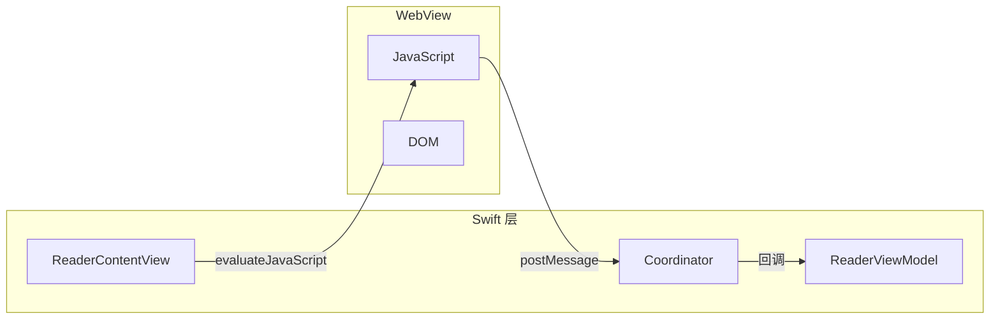

### 可复用能力

| 能力 | 现有实现 | 双语功能复用方式 |
| ---- | -------- | ---------------- |
| HTML 模板渲染 | generateHTML() | 扩展支持双语段落结构 |
| CSS 动态生成 | generateCSS() | 添加语言层样式 |
| JS 消息处理 | userContentController | 新增词组点击消息 |
| 文本选择 | textSelection handler | 复用选择逻辑 |
| 弹窗组件 | HighlightDetailPopup | 参考实现词汇弹窗 |

---

## 数据模型设计

### API 响应结构变更

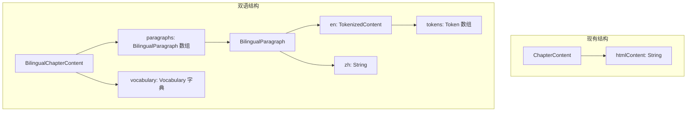

### 新增数据模型

#### BilingualChapterContent

| 字段 | 类型 | 说明 |
| ---- | ---- | ---- |
| id | String | 章节 ID |
| title | String | 章节标题 |
| order | Int | 章节序号 |
| paragraphs | [BilingualParagraph] | 双语段落数组 |
| vocabulary | [String: Vocabulary] | 词汇表（vocab_id → 释义） |
| wordCount | Int | 英文单词数 |

#### BilingualParagraph

| 字段 | 类型 | 说明 |
| ---- | ---- | ---- |
| id | String | 段落 ID |
| type | ParagraphType | 类型（text/heading/quote） |
| en | TokenizedContent | 英文内容（含分词） |
| zh | String | 中文译文 |

#### TokenizedContent

| 字段 | 类型 | 说明 |
| ---- | ---- | ---- |
| raw | String | 原始文本 |
| tokens | [Token] | 分词数组 |

#### Token

| 字段 | 类型 | 说明 |
| ---- | ---- | ---- |
| id | String | 词组 ID |
| text | String | 词组文本 |
| start | Int | 起始位置 |
| end | Int | 结束位置 |
| type | TokenType | 类型（word/phrase/punctuation） |
| vocabId | String? | 关联词汇 ID |

#### Vocabulary

| 字段 | 类型 | 说明 |
| ---- | ---- | ---- |
| id | String | 词汇 ID |
| word | String | 词汇原形 |
| phonetic | String? | 音标 |
| audioUrl | String? | 发音 URL |
| definitions | [Definition] | 释义列表 |
| examples | [Example]? | 例句列表 |

#### Definition

| 字段 | 类型 | 说明 |
| ---- | ---- | ---- |
| pos | String | 词性 |
| en | String | 英文释义 |
| zh | String | 中文释义 |

---

## 架构设计

### 整体架构

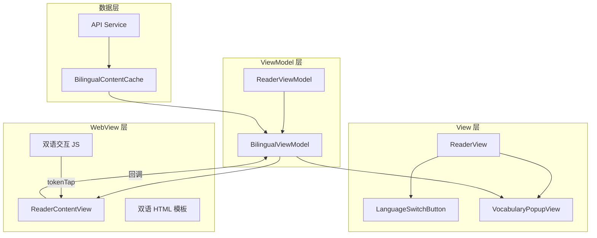

### 模块职责

| 模块 | 职责 |
| ---- | ---- |
| BilingualViewModel | 双语状态管理、语言切换、词汇查询 |
| LanguageSwitchButton | 语言切换 UI 组件 |
| VocabularyPopupView | 词汇释义弹窗 |
| BilingualContentCache | 双语内容本地缓存 |
| BilingualHTMLGenerator | 双语 HTML 模板生成 |

---

## ReaderViewModel 扩展

### 新增属性

| 属性 | 类型 | 说明 |
| ---- | ---- | ---- |
| isBilingualMode | Bool | 是否为双语模式 |
| currentLanguage | Language | 当前显示语言（en/zh） |
| bilingualContent | BilingualChapterContent? | 双语章节内容 |
| selectedVocabulary | Vocabulary? | 当前选中的词汇 |
| showVocabularyPopup | Bool | 是否显示词汇弹窗 |

### 新增方法

| 方法 | 说明 |
| ---- | ---- |
| toggleLanguage() | 切换显示语言 |
| handleTokenTap(tokenId:) | 处理词组点击 |
| lookupVocabulary(vocabId:) | 查询词汇详情 |
| playPronunciation(url:) | 播放发音 |

### 状态流转

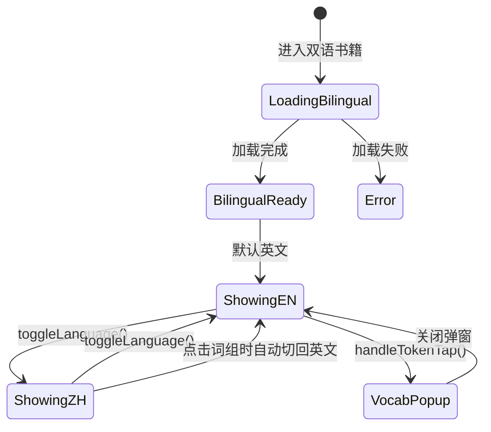

---

## HTML 渲染方案

### 双语段落结构

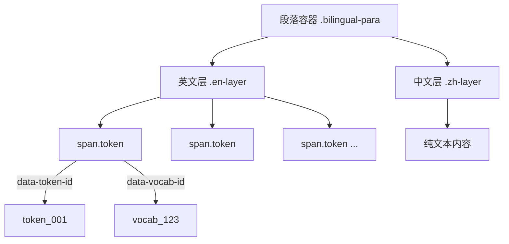

### CSS 样式控制

| 类名 | 作用 | 语言状态 |
| ---- | ---- | -------- |
| .bilingual-para | 段落容器 | - |
| .en-layer | 英文层 | 英文模式显示 |
| .zh-layer | 中文层 | 中文模式显示 |
| .token | 可点击词组 | - |
| .token.word | 单词样式 | - |
| .token.phrase | 词组样式 | - |
| .lang-en | 英文模式根类 | body 类名 |
| .lang-zh | 中文模式根类 | body 类名 |

### 语言切换机制

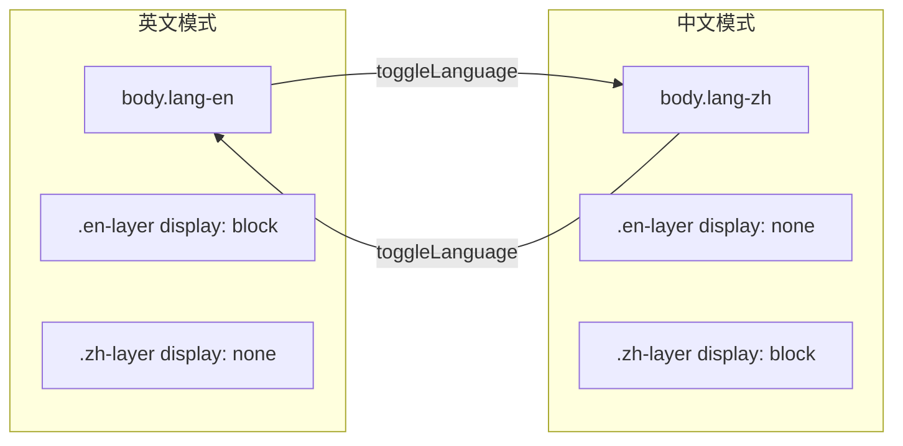

---

## JavaScript 交互

### 消息类型

| 消息名 | 方向 | 数据 | 说明 |
| ------ | ---- | ---- | ---- |
| tokenTap | JS → Swift | tokenId, vocabId, text, rect | 词组点击 |
| switchLanguage | Swift → JS | language | 切换语言 |
| scrollToPosition | Swift → JS | position | 滚动到位置 |
| getCurrentPosition | JS → Swift | scrollPercentage | 获取当前位置 |

### 词组点击流程

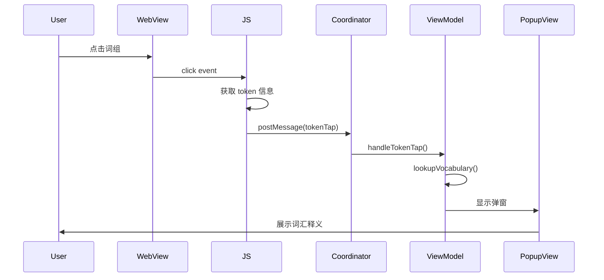

### 语言切换流程

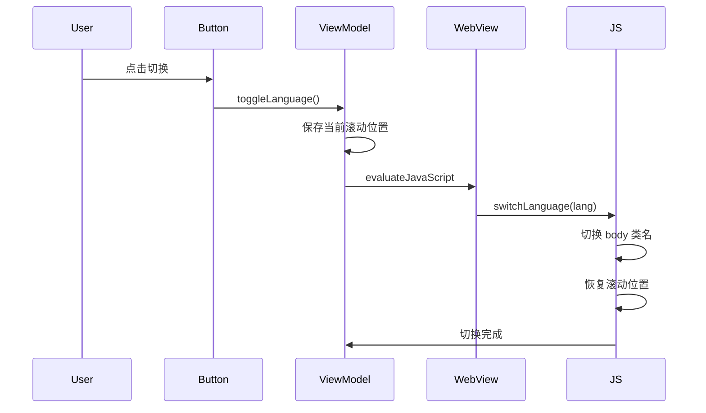

---

## UI 组件设计

### 语言切换按钮

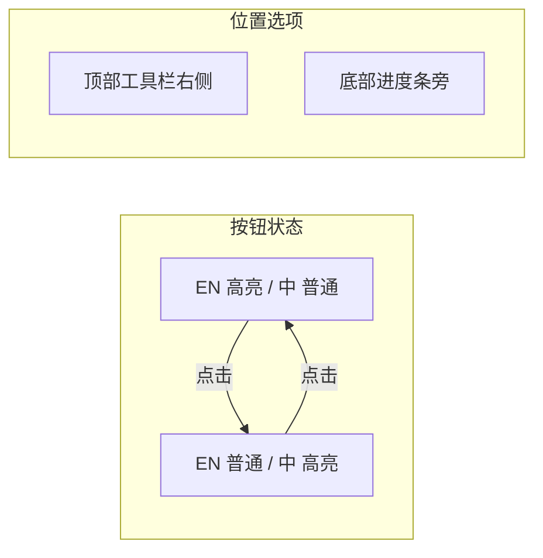

### 按钮设计规格

| 属性 | 规格 |
| ---- | ---- |
| 尺寸 | 60 x 32 pt |
| 圆角 | 16 pt |
| 字体 | SF Pro Text Medium 14pt |
| 动画 | 0.2s ease-in-out |

### 词汇弹窗组件

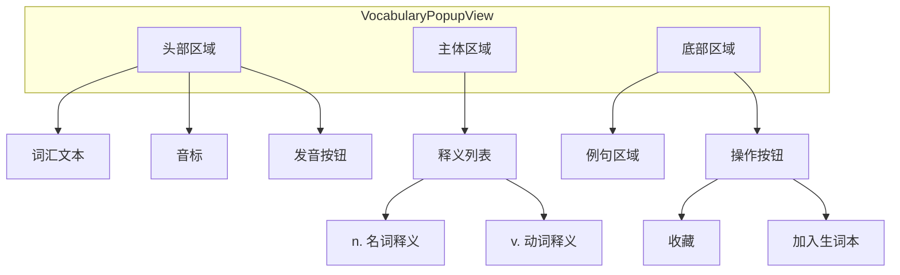

### 弹窗规格

| 属性 | 规格 |
| ---- | ---- |
| 宽度 | 屏幕宽度 - 32pt |
| 最大高度 | 屏幕高度 * 0.5 |
| 圆角 | 16 pt |
| 背景 | 系统背景色 + 毛玻璃 |
| 出现动画 | 从底部滑入 |
| 消失动画 | 向下滑出 |

---

## 缓存策略

### 缓存结构

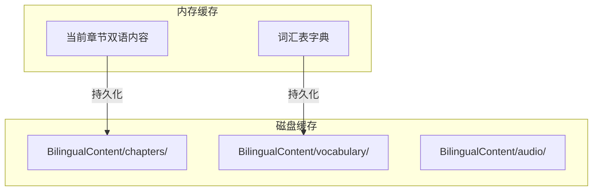

### 缓存目录

| 目录 | 内容 | 过期策略 |
| ---- | ---- | -------- |
| chapters/ | 双语章节 JSON | 永不过期 |
| vocabulary/ | 词汇表 JSON | 永不过期 |
| audio/ | 发音音频文件 | LRU, 100MB 上限 |

### 预加载策略

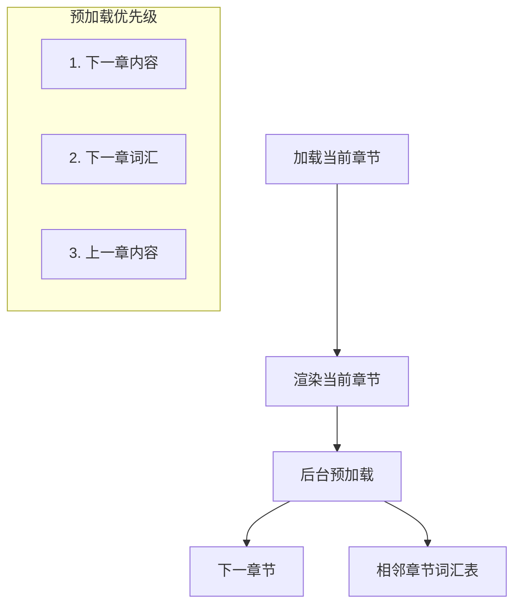

---

## API 接口

### 获取双语章节内容

| 项目 | 说明 |
| ---- | ---- |
| 端点 | GET /books/{bookId}/bilingual/{chapterId} |
| 参数 | bookId, chapterId |
| 响应 | BilingualChapterContent |

### 响应数据结构

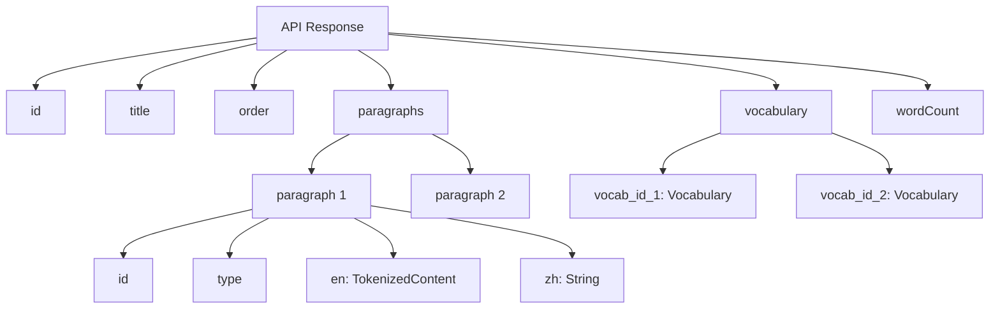

---

## 实现步骤

### 阶段一：数据层

| 步骤 | 任务 | 涉及文件 |
| ---- | ---- | -------- |
| 1.1 | 定义数据模型 | Core/Models/BilingualContent.swift |
| 1.2 | 实现 API 接口 | Core/Network/BilingualAPI.swift |
| 1.3 | 实现缓存管理 | Core/Storage/BilingualContentCache.swift |

### 阶段二：ViewModel 层

| 步骤 | 任务 | 涉及文件 |
| ---- | ---- | -------- |
| 2.1 | 扩展 ReaderViewModel | Features/Reader/ReaderViewModel.swift |
| 2.2 | 添加双语状态属性 | 同上 |
| 2.3 | 实现语言切换逻辑 | 同上 |
| 2.4 | 实现词汇查询逻辑 | 同上 |

### 阶段三：渲染层

| 步骤 | 任务 | 涉及文件 |
| ---- | ---- | -------- |
| 3.1 | 创建双语 HTML 生成器 | Features/Reader/BilingualHTMLGenerator.swift |
| 3.2 | 实现双语 CSS 样式 | 同上 |
| 3.3 | 实现词组点击 JS | 同上 |
| 3.4 | 扩展 Coordinator | Features/Reader/ReaderContentView.swift |

### 阶段四：UI 层

| 步骤 | 任务 | 涉及文件 |
| ---- | ---- | -------- |
| 4.1 | 实现语言切换按钮 | Features/Reader/Components/LanguageSwitchButton.swift |
| 4.2 | 实现词汇弹窗 | Features/Reader/Components/VocabularyPopupView.swift |
| 4.3 | 集成到 ReaderView | Features/Reader/ReaderView.swift |

### 阶段五：优化

| 步骤 | 任务 | 说明 |
| ---- | ---- | ---- |
| 5.1 | 性能优化 | 虚拟化长章节渲染 |
| 5.2 | 动画优化 | 语言切换过渡动画 |
| 5.3 | 离线支持 | 发音音频预缓存 |
| 5.4 | 无障碍支持 | VoiceOver 适配 |

---

## 文件结构

```text
ios/Readmigo/
├── Core/
│   ├── Models/
│   │   └── BilingualContent.swift          # 新增：数据模型
│   ├── Network/
│   │   └── BilingualAPI.swift              # 新增：API 接口
│   └── Storage/
│       └── BilingualContentCache.swift     # 新增：缓存管理
│
└── Features/
    └── Reader/
        ├── ReaderViewModel.swift           # 修改：添加双语状态
        ├── ReaderContentView.swift         # 修改：扩展 Coordinator
        ├── ReaderView.swift                # 修改：集成新组件
        ├── BilingualHTMLGenerator.swift    # 新增：HTML 生成器
        └── Components/
            ├── LanguageSwitchButton.swift  # 新增：语言切换按钮
            └── VocabularyPopupView.swift   # 新增：词汇弹窗
```

---

## 兼容性考虑

### 书籍类型判断

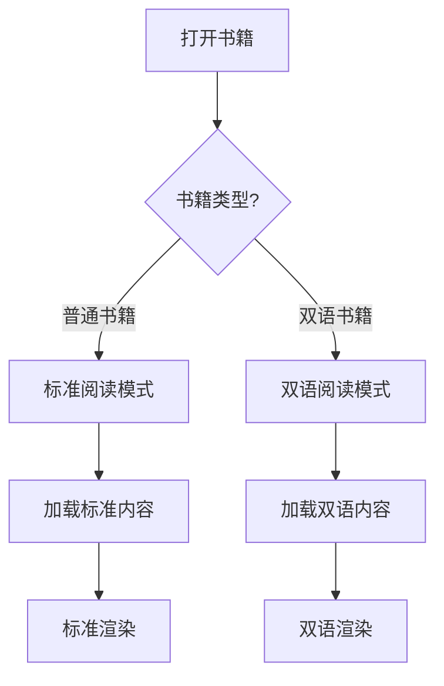

### 判断依据

| 字段 | 位置 | 说明 |
| ---- | ---- | ---- |
| isBilingual | Book 模型 | 是否为双语书籍 |
| bilingualAvailable | BookDetail | 双语内容是否可用 |

### 降级策略

| 场景 | 处理方式 |
| ---- | -------- |
| 双语内容加载失败 | 降级到标准模式显示英文 |
| 词汇表缺失 | 词组不可点击，仅显示文本 |
| 发音音频不可用 | 隐藏发音按钮 |

---

## 性能指标

| 指标 | 目标值 | 说明 |
| ---- | ------ | ---- |
| 首屏渲染时间 | < 500ms | 章节内容显示 |
| 语言切换延迟 | < 100ms | 用户感知即时切换 |
| 词汇弹窗响应 | < 50ms | 点击到弹窗出现 |
| 内存占用增量 | < 20MB | 相比标准模式 |
| 缓存命中率 | > 95% | 已下载章节 |

---

## 测试要点

| 测试类型 | 测试点 |
| -------- | ------ |
| 功能测试 | 语言切换、词组点击、弹窗显示 |
| 边界测试 | 超长段落、特殊字符、空内容 |
| 性能测试 | 大章节渲染、频繁切换 |
| 兼容测试 | iOS 15/16/17、不同屏幕尺寸 |
| 离线测试 | 无网络下的缓存读取 |
| 无障碍测试 | VoiceOver 朗读顺序 |

---

## 相关文档

- [双语阅读功能实现原理](../reader/bilingual-reading.md)
- [EPUB 格式实现原理](../reader/epub-format-specification.md)
