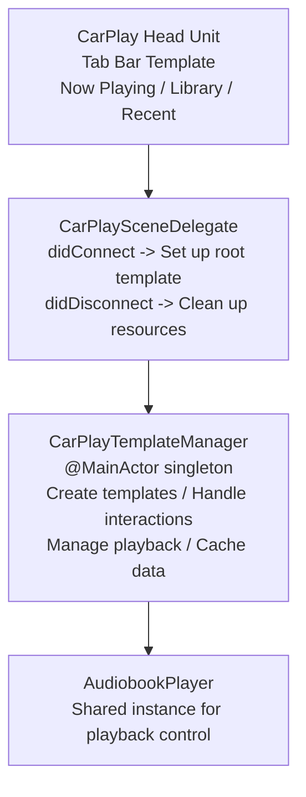
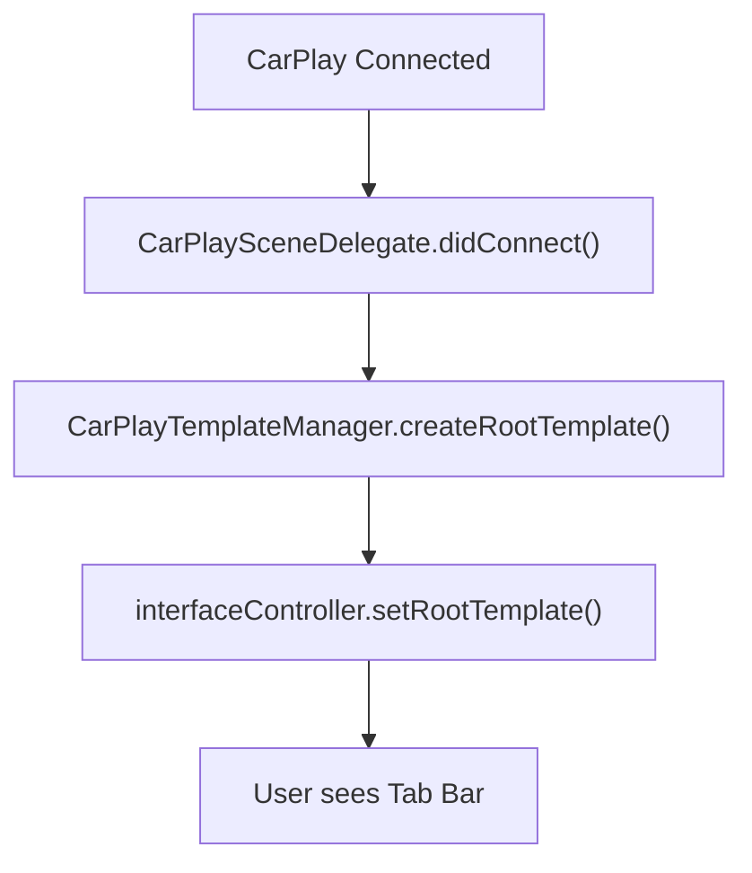
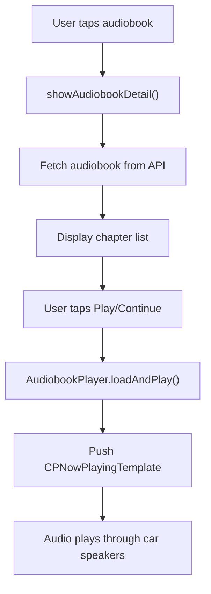

# CarPlay Integration (iOS)

Apple CarPlay support for audiobook playback while driving.

---

## Overview

| Item | Description |
|------|-------------|
| Path | `ios/Readmigo/Features/CarPlay/` |
| Entitlement | com.apple.developer.carplay-audio |
| Framework | CarPlay.framework |

---

## Architecture



---

## Template Structure

### Tab Bar (Root)

```
┌─────────────────────────────────────────────┐
│  [ 🎧 Now Playing ] [ 📚 Library ] [ 🕐 Recent ]  │
└─────────────────────────────────────────────┘
```

### Now Playing Tab

Uses `CPNowPlayingTemplate.shared` with custom buttons:

| Button | Action |
|--------|--------|
| ⏪ | Seek back 30 seconds |
| ⏩ | Seek forward 30 seconds |
| 🔄 | Cycle playback speed |

### Library Tab

```
┌─────────────────────────────────────────────┐
│  Library                                     │
├─────────────────────────────────────────────┤
│  📚 All Audiobooks                      ▶   │
│  ▶️ Continue Listening                  ▶   │
│  ⬇️ Downloaded                          ▶   │
└─────────────────────────────────────────────┘
```

### Recent Tab

```
┌─────────────────────────────────────────────┐
│  Recent                                      │
├─────────────────────────────────────────────┤
│  🎵 Pride and Prejudice                     │
│     Jane Austen                         ▶   │
│  🎵 The Great Gatsby                        │
│     F. Scott Fitzgerald                 ▶   │
└─────────────────────────────────────────────┘
```

### Audiobook Detail

```
┌─────────────────────────────────────────────┐
│  Pride and Prejudice                         │
├─────────────────────────────────────────────┤
│  ▶️ Play from Beginning                     │
│  ⏯️ Continue - Resume where you left off    │
├─────────────────────────────────────────────┤
│  Chapters                                    │
│  1. Volume 1 - Chapter 1          12:34    │
│  2. Volume 1 - Chapter 2          15:20    │
│  3. Volume 1 - Chapter 3          11:45    │
└─────────────────────────────────────────────┘
```

---

## Scene Configuration

---

## Data Flow

### Connection Flow



### Playback Flow



---

## API Integration

### Load Recent Audiobooks

```
GET /audiobooks/recently-listened?limit=10
```

### Load All Audiobooks

```
GET /audiobooks
Response: { items: AudiobookListItem[] }
```

### Load Audiobook Detail

```
GET /audiobooks/:id
Response: Audiobook (with chapters)
```

### Get Progress

```
GET /audiobooks/:id/progress
Response: { currentChapter: Int, currentPosition: Float }
```

---

## Models

---

## Best Practices

### Performance

- Cache audiobook list to minimize API calls
- Load cover images asynchronously
- Pre-fetch recently listened audiobooks

### User Experience

- Show clear "No Downloads" state for offline section
- Provide "Continue" option to resume playback
- Display chapter duration for informed selection

### Error Handling

- Fall back to beginning if progress fetch fails
- Show empty state with helpful message
- Log errors for debugging

---

## Testing

### Simulator

1. Xcode → Window → Devices and Simulators
2. Select CarPlay simulator
3. Run app and connect to CarPlay

### Real Device

1. Connect iPhone to CarPlay-enabled vehicle
2. Open Readmigo app
3. Verify audiobook appears in CarPlay

---

## Related Documentation

- [Audiobook Module](../modules/audiobook.md)
- [Offline Support](./offline-support.md)
- [Apple CarPlay Documentation](https://developer.apple.com/carplay/)
