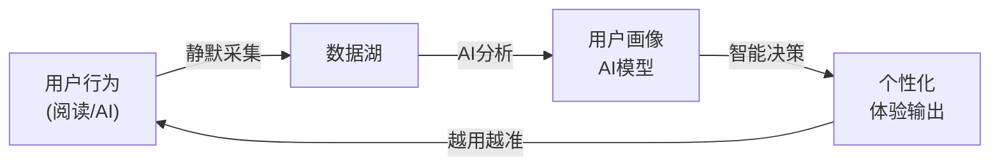

# Readmigo iOS Client 技术规格文档

## 1. 项目概述

### 1.1 产品定位
Readmigo iOS客户端是一款AI原生的英语原版书阅读学习应用，目标用户是**全球范围内**希望通过阅读原版书籍提升英语能力的用户。

### 1.2 核心特性

#### AI原生核心功能 (产品差异化核心)
- **AI即时助手**: 选词即查、句子简化、段落翻译、内容问答
- **AI智能推荐**: 基于用户画像的个性化书籍推荐
- **AI难度适配**: 根据用户水平动态调整内容难度
- **AI学习规划**: 智能生成个性化学习计划
- **AI内容分析**: 书籍难度评估、关键词提取、主题分析
- **AI复习优化**: 基于遗忘曲线的智能复习调度

#### 基础功能
- **智能阅读器**: 基于EPUB的高品质阅读体验
- **有声书**: 文字+音频同步阅读体验
- **生词本**: SM-2间隔重复算法的智能复习系统 (自动添加)
- **离线阅读**: 完整的离线阅读支持
- **书籍导入**: 支持用户导入自有EPUB书籍
- **勋章体系**: 基于阅读数据的成就系统
- **榜单系统**: 编辑精选、AI推荐榜单

### 1.3 数据驱动理念
**用户行为数据是个性化服务的核心基础**，所有用户交互都将被后台静默采集和分析：
- 阅读时长、阅读速度、阅读习惯
- AI交互记录、句子理解程度
- 生词查询、复习效果
- 所有数据采集对用户不可见，后台自动处理

### 1.4 AI驱动架构 ⭐核心差异化

> **AI不是功能，而是产品的底层驱动力。** 传统阅读App是"工具"，Readmigo是"AI阅读教练"。

#### 1.4.1 AI驱动 vs AI功能

| 维度 | 传统AI功能 (被动) | Readmigo AI驱动 (主动) |
|------|------------------|----------------------|
| 触发方式 | 用户主动点击/选择 | AI主动感知、主动干预 |
| 个性化 | 统一的功能入口 | 每个用户看到不同的内容和体验 |
| 学习能力 | 静态规则 | 越用越懂你，持续优化 |
| 存在感 | 明显的AI按钮/入口 | 无感融入，像有个隐形教练 |

#### 1.4.2 AI驱动的核心闭环



#### 1.4.3 主动AI场景 (区别于被动AI)

**场景1: 阅读困难主动检测**
```
触发条件: AI检测到用户在某段文字停留过久/频繁回翻/阅读速度骤降
主动行为: 底部轻柔弹出提示 "这段有点难？我来帮你"
用户无需: 手动选择文字、点击任何按钮
```

**场景2: 智能难度自适应**
```
触发条件: 用户连续3本书查词率>15% 或 完成率<50%
主动行为:
  - 自动调整推荐书籍难度等级
  - 首页提示 "为你找到了更适合的书"
  - 当前书籍提供"简化版"选项
用户无需: 手动设置难度偏好
```

**场景3: 最佳复习时机推送**
```
触发条件: AI根据遗忘曲线预测用户即将遗忘某批单词
主动行为:
  - 在用户习惯的阅读时间发送Push "5个单词快忘了，花2分钟巩固一下？"
  - 打开App时生词本Tab显示红点
用户无需: 记住要复习、手动设置提醒
```

**场景4: 阅读状态感知**
```
触发条件: 用户连续7天未打开App
主动行为:
  - Push: "《Pride and Prejudice》等你回来，还剩3章就读完了"
  - 回来后首页显示"欢迎回来"卡片，展示之前的进度
触发条件: 用户深夜阅读
主动行为: 自动切换为深色护眼模式，降低屏幕亮度
```

**场景5: 个性化学习建议**
```
触发条件: 每周日晚上 / 完成一本书时
主动行为:
  - 生成本周学习报告卡片
  - AI分析薄弱点: "你在虚拟语气句型上查询较多，建议..."
  - 推荐针对性练习内容
用户无需: 主动查看统计、分析自己的弱点
```

**场景6: 阅读中智能伴读**
```
触发条件: 用户阅读过程中
主动行为:
  - 预判用户可能不认识的词，轻微高亮提示
  - 章节结束时弹出"本章要点"AI总结
  - 检测到精彩段落，提示"值得收藏"
用户无需: 逐词查询、手动总结、手动标记
```

#### 1.4.4 个性化体验矩阵

| 模块 | 非AI驱动 | AI驱动后 |
|------|---------|---------|
| **首页** | 固定的推荐位 | 每个用户首页完全不同，基于画像动态生成 |
| **书籍详情** | 统一的难度标签 | "对你来说难度适中" / "可能有挑战" 个性化提示 |
| **阅读器** | 等用户选词才响应 | 主动检测困难、主动提供帮助 |
| **生词本** | 用户手动添加 | 自动添加 + 智能过滤(已掌握的不加) |
| **复习** | 固定时间提醒 | 根据遗忘曲线 + 用户习惯的最佳时机提醒 |
| **推荐** | 基于热度/分类 | 基于阅读历史+水平+偏好+目标的AI推荐 |
| **统计** | 展示原始数据 | AI解读数据 + 给出可执行建议 |

#### 1.4.5 AI教练人格化

Readmigo的AI不是冷冰冰的工具，而是一个**懂你的阅读教练**：

```
┌─────────────────────────────────────────┐
│  AI教练特征                              │
├─────────────────────────────────────────┤
│  🎯 目标导向: 帮你完成阅读目标            │
│  📊 数据驱动: 基于你的真实数据给建议       │
│  🤫 安静陪伴: 不打扰，但在你需要时出现     │
│  📈 持续进化: 越用越懂你                  │
│  💬 个性表达: 用鼓励性的语气沟通           │
└─────────────────────────────────────────┘

示例交互语气:
- "这周读了3小时，比上周多了40%，继续保持！"
- "这本书有点难，要不要试试这本？"
- "bench 这个词你查过3次了，今天复习一下？"
- "连续阅读7天了，送你一个勋章🏅"
```

---

## 2. 技术栈

### 2.1 开发环境
- **Xcode**: 15.0+
- **iOS Deployment Target**: iOS 16.0+
- **Swift**: 5.9+
- **架构模式**: MVVM + Coordinator

### 2.2 核心框架
| 功能 | 框架 | 说明 |
|-----|------|-----|
| UI | SwiftUI | 主要UI框架 |
| 阅读器 | WKWebView | EPUB渲染 |
| 音频 | AVFoundation | 有声书播放 |
| 网络 | URLSession + async/await | 原生网络层 |
| 本地存储 | SwiftData | iOS 17+ 数据持久化 |
| 认证 | AuthenticationServices | Sign in with Apple |
| 内购 | StoreKit 2 | 订阅管理 |
| 推送 | UserNotifications | 复习提醒 |
| 日志 | OSLog + 自定义 | 日志收集系统 |

---

## 3. 实施计划

> 按开发优先级排序，阅读器和AI是最核心功能

### Phase 1: 基础架构
- [ ] Xcode项目初始化
- [ ] 项目结构搭建
- [ ] 网络层 APIClient 实现
- [ ] 本地存储 SwiftData 配置
- [ ] Token管理和Keychain存储
- [ ] 日志收集系统基础
- [ ] 基础UI组件和主题系统

### Phase 2: 认证与用户
- [ ] Sign in with Apple 集成
- [ ] 登录/注册界面
- [ ] 用户Profile管理
- [ ] 英语水平评估界面
- [ ] Onboarding流程

### Phase 3: 书架与发现
- [ ] 书架界面 (Grid/List)
- [ ] 书籍详情页
- [ ] 发现/书城界面
- [ ] **榜单列表展示** (BookListGridView)
- [ ] **榜单详情页面** (BookListDetailView)
- [ ] **AI推荐展示** (AIRecommendView)
- [ ] 分类浏览 (CategoryView)
- [ ] 搜索功能
- [ ] 书籍导入功能

### Phase 4: 阅读器核心 ⭐⭐⭐关键
- [ ] EPUB解析器
- [ ] WKWebView阅读器
- [ ] 章节加载和渲染
- [ ] 翻页控制
- [ ] 阅读进度保存
- [ ] 阅读时长追踪(后台静默)
- [ ] 阅读器设置

### Phase 5: AI集成 ⭐⭐⭐关键
- [ ] 文本选择处理
- [ ] AI助手面板
- [ ] 查词功能 + 流式响应
- [ ] 句子简化
- [ ] 段落翻译
- [ ] 自动添加生词本
- [ ] 理解程度追踪

### Phase 6: 生词本与复习
- [ ] 生词列表
- [ ] 单词详情
- [ ] 复习界面
- [ ] SM-2算法复习调度
- [ ] 复习统计

### Phase 7: 有声书
- [ ] 音频播放器
- [ ] 文字音频同步
- [ ] 播放控制
- [ ] 离线缓存

### Phase 8: 勋章与订阅
- [ ] 勋章体系
- [ ] StoreKit 2 集成
- [ ] 订阅页面
- [ ] 付费墙

### Phase 9: 离线与优化
- [ ] 离线阅读完善
- [ ] 数据同步
- [ ] 性能优化
- [ ] 测试与发布

---

## 4. 项目结构

```
ios/Readmigo/
├── App/
│   ├── ReadmigoApp.swift           # App入口
│   └── ContentView.swift           # 主视图+Tab切换
│
├── Features/                        # 功能模块 (按业务划分)
│   ├── Auth/                        # 认证模块
│   │   ├── AuthView.swift          # 登录/注册页面
│   │   ├── AuthManager.swift       # 认证状态管理
│   │   └── AuthError.swift         # 认证错误类型
│   │
│   ├── Onboarding/                  # 新用户引导模块
│   │   └── OnboardingView.swift    # 新用户引导流程
│   │
│   ├── Library/                     # 书架/发现模块 (合并)
│   │   ├── LibraryView.swift       # 书架主页
│   │   ├── LibraryManager.swift    # 书架数据管理
│   │   ├── DiscoverView.swift      # 发现页 (7种显示样式)
│   │   ├── BrowseBooksView.swift   # 书籍网格浏览+筛选
│   │   ├── BookDetailView.swift    # 书籍详情页
│   │   ├── AuthorBooksView.swift   # 作者书籍列表
│   │   └── Components/             # 书籍卡片组件
│   │       ├── BookCoverView.swift
│   │       ├── FeaturedBannerCard.swift
│   │       ├── HeroBookCard.swift
│   │       ├── StandardBookCard.swift
│   │       ├── RankedBookCard.swift
│   │       └── ...
│   │
│   ├── Agora/                       # 城邦社区模块 ⭐新增
│   │   ├── AgoraView.swift         # 城邦主页
│   │   ├── AgoraManager.swift      # 城邦数据管理
│   │   ├── AgoraPostCard.swift     # 帖子卡片组件
│   │   └── AuthorAvatarView.swift  # 作者头像组件
│   │
│   ├── Authors/                     # 作者模块 ⭐新增
│   │   ├── AuthorProfileView.swift # 作者主页
│   │   ├── AuthorManager.swift     # 作者数据管理
│   │   ├── AuthorChatView.swift    # 与作者AI对话
│   │   ├── VoiceChatView.swift     # 语音对话
│   │   ├── VideoChatView.swift     # 视频对话
│   │   └── Components/
│   │       └── AuthorHeaderView.swift
│   │
│   ├── Quotes/                      # 金句模块 ⭐新增
│   │   ├── QuotesView.swift        # 金句列表
│   │   ├── QuoteCardView.swift     # 金句卡片
│   │   ├── QuoteDetailView.swift   # 金句详情
│   │   └── QuotesManager.swift     # 金句数据管理
│   │
│   ├── Postcards/                   # 明信片模块 ⭐新增
│   │   ├── PostcardEditorView.swift    # 明信片编辑器
│   │   ├── PostcardPreviewView.swift   # 明信片预览
│   │   ├── TemplatePickerView.swift    # 模板选择
│   │   └── PostcardsManager.swift      # 明信片数据管理
│   │
│   ├── Reader/                      # 阅读器模块 ⭐⭐⭐核心
│   │   ├── ReaderView.swift         # 阅读器主视图
│   │   ├── ReaderViewModel.swift    # 阅读器状态管理
│   │   ├── ReaderContentView.swift  # 内容渲染
│   │   ├── ReaderSettingsView.swift # 阅读设置
│   │   ├── EnhancedReaderView.swift # 增强阅读模式
│   │   ├── UltimateReaderView.swift # 终极阅读体验
│   │   ├── TTSControlView.swift     # TTS语音控制
│   │   ├── CharacterMapView.swift   # 人物关系图
│   │   ├── StoryTimelineView.swift  # 故事时间线
│   │   └── Components/
│   │       ├── PageTurnAnimations.swift   # 翻页动画
│   │       ├── ReadingStatsOverlay.swift  # 阅读统计覆盖层
│   │       ├── ImmersiveReaderMode.swift  # 沉浸式阅读
│   │       ├── ReadingProgressView.swift  # 阅读进度
│   │       └── FocusModeView.swift        # 专注模式
│   │
│   ├── AI/                          # AI交互模块 ⭐⭐⭐核心 (77个AI页面)
│   │   ├── Views/
│   │   │   ├── BookDetail/              # 书籍详情页AI (12个)
│   │   │   │   ├── AIAuthorView.swift
│   │   │   │   ├── AIBookSummaryView.swift
│   │   │   │   ├── AICoverAnalysisView.swift
│   │   │   │   ├── AIBookQAView.swift
│   │   │   │   ├── AISimilarBooksView.swift
│   │   │   │   ├── AIDifficultyDetailView.swift
│   │   │   │   ├── AIReadingGuideView.swift
│   │   │   │   ├── AIKeyVocabPreviewView.swift
│   │   │   │   ├── AIThemeAnalysisView.swift
│   │   │   │   ├── AIHistoricalContextView.swift
│   │   │   │   ├── AIReadingTimeEstimateView.swift
│   │   │   │   └── AIContentWarningView.swift
│   │   │   ├── Reader/                  # 阅读器AI (20个)
│   │   │   │   ├── AIWordExplainView.swift
│   │   │   │   ├── AISentenceSimplifyView.swift
│   │   │   │   ├── AIParagraphTranslateView.swift
│   │   │   │   ├── AIParagraphSummaryView.swift
│   │   │   │   ├── AIHighlightInsightView.swift
│   │   │   │   ├── AIThoughtAssistView.swift
│   │   │   │   ├── AIImageAnalysisView.swift
│   │   │   │   ├── AIGrammarExplainView.swift
│   │   │   │   ├── AIContextQAView.swift
│   │   │   │   ├── AIChapterSummaryView.swift
│   │   │   │   ├── AICharacterAnalysisView.swift
│   │   │   │   ├── AIPlotAnalysisView.swift
│   │   │   │   ├── AIRealTimeAnnotationView.swift
│   │   │   │   ├── AIVocabHighlightView.swift
│   │   │   │   ├── AIReadingCoachView.swift
│   │   │   │   ├── AIComprehensionCheckView.swift
│   │   │   │   ├── AICulturalNoteView.swift
│   │   │   │   ├── AIWritingStyleView.swift
│   │   │   │   ├── AIEmotionAnalysisView.swift
│   │   │   │   └── AISmartBookmarkView.swift
│   │   │   ├── Vocabulary/              # 词汇/生词本AI (10个)
│   │   │   │   ├── AIWordContextView.swift
│   │   │   │   ├── AIWordAssociationView.swift
│   │   │   │   ├── AIMnemonicView.swift
│   │   │   │   ├── AIWordFamilyView.swift
│   │   │   │   ├── AIUsageExamplesView.swift
│   │   │   │   ├── AIVocabReviewCoachView.swift
│   │   │   │   ├── AIWeakWordAnalysisView.swift
│   │   │   │   ├── AIVocabProgressView.swift
│   │   │   │   ├── AICollocationsView.swift
│   │   │   │   └── AIPronunciationGuideView.swift
│   │   │   ├── Profile/                 # 个人中心AI (15个)
│   │   │   │   ├── AILearningReportView.swift
│   │   │   │   ├── AIWeakPointAnalysisView.swift
│   │   │   │   ├── AILearningPlanView.swift
│   │   │   │   ├── AIProgressInsightView.swift
│   │   │   │   ├── AIGoalAssistantView.swift
│   │   │   │   ├── AIReadingHabitView.swift
│   │   │   │   ├── AIVocabMasteryView.swift
│   │   │   │   ├── AIWeeklyReportView.swift
│   │   │   │   ├── AIMonthlyReportView.swift
│   │   │   │   ├── AIYearlyReviewView.swift
│   │   │   │   ├── AICompareProgressView.swift
│   │   │   │   ├── AIPersonalizedTipsView.swift
│   │   │   │   ├── AIStreakAnalysisView.swift
│   │   │   │   ├── AIReadingSpeedView.swift
│   │   │   │   └── AISkillRadarView.swift
│   │   │   ├── Discover/                # 发现/推荐AI (8个)
│   │   │   │   ├── AIPersonalizedFeedView.swift
│   │   │   │   ├── AIBookListDetailView.swift
│   │   │   │   ├── AILevelAssessmentView.swift
│   │   │   │   ├── AIDailyRecommendView.swift
│   │   │   │   ├── AIMoodBasedView.swift
│   │   │   │   ├── AIReadingChallengeView.swift
│   │   │   │   ├── AITrendingAnalysisView.swift
│   │   │   │   └── AIGenreExplorerView.swift
│   │   │   ├── Audiobook/               # 有声书AI (5个)
│   │   │   │   ├── AITranscriptView.swift
│   │   │   │   ├── AIListeningCoachView.swift
│   │   │   │   ├── AIShadowingView.swift
│   │   │   │   ├── AIDictationView.swift
│   │   │   │   └── AIPronunciationView.swift
│   │   │   ├── Social/                  # 社交/分享AI (4个)
│   │   │   │   ├── AIShareCardView.swift
│   │   │   │   ├── AIReviewGeneratorView.swift
│   │   │   │   ├── AIQuoteExtractorView.swift
│   │   │   │   └── AIReadingSummaryShareView.swift
│   │   │   └── Settings/                # 系统/设置AI (3个)
│   │   │       ├── AIPreferenceLearningView.swift
│   │   │       ├── AIUsageInsightView.swift
│   │   │       └── AICostOptimizationView.swift
│   │   ├── ViewModels/
│   │   │   ├── AIAssistantViewModel.swift
│   │   │   ├── AIBookAnalysisViewModel.swift
│   │   │   ├── AIReaderViewModel.swift
│   │   │   ├── AIProfileViewModel.swift
│   │   │   ├── AIVocabularyViewModel.swift
│   │   │   ├── AIDiscoverViewModel.swift
│   │   │   ├── AIAudiobookViewModel.swift
│   │   │   └── AISocialViewModel.swift
│   │   ├── Components/
│   │   │   ├── AIStreamingTextView.swift    # 流式输出组件
│   │   │   ├── AILoadingView.swift
│   │   │   ├── AIErrorView.swift
│   │   │   ├── AIActionBar.swift
│   │   │   ├── AICoachAvatarView.swift
│   │   │   └── AIFeedbackView.swift
│   │   └── Services/
│   │       ├── AIService.swift
│   │       ├── AIStreamingService.swift
│   │       └── AICacheService.swift
│   │
│   ├── Learning/                    # 学习模块 (生词本+复习)
│   │   ├── LearningView.swift       # 学习主页
│   │   ├── VocabularyView.swift     # 生词本
│   │   ├── VocabularyManager.swift  # 生词数据管理
│   │   └── ReviewSessionView.swift  # 复习会话
│   │
│   ├── Badges/                      # 勋章体系模块
│   │   ├── BadgesView.swift         # 勋章列表
│   │   ├── BadgeDetailView.swift    # 勋章详情
│   │   └── BadgesManager.swift      # 勋章数据管理
│   │
│   ├── Me/                          # 个人中心模块 (原Profile)
│   │   └── MeView.swift             # 我的页面(统计/设置/订阅)
│   │
│   ├── Profile/                     # 用户资料模块
│   │   ├── ProfileView.swift        # 个人资料
│   │   └── AccountSettingsView.swift # 账户设置
│   │
│   ├── Settings/                    # 设置模块
│   │   └── LanguageSettingsView.swift # 语言设置
│   │
│   ├── Search/                      # 搜索模块
│   │   └── SearchManager.swift      # 搜索管理
│   │
│   ├── Bookmarks/                   # 书签模块
│   │   └── BookmarkManager.swift    # 书签管理
│   │
│   ├── Offline/                     # 离线模块
│   │   └── OfflineView.swift        # 离线内容管理
│   │
│   ├── Analytics/                   # 分析模块
│   │   └── AnalyticsView.swift      # 分析页面
│   │
│   └── Subscriptions/               # 订阅模块
│       ├── SubscriptionView.swift   # 订阅页面
│       └── PaywallView.swift        # 付费墙
│
├── Core/                            # 核心基础设施
│   ├── Network/
│   │   ├── APIClient.swift          # API客户端
│   │   └── APIEndpoints.swift       # API端点定义
│   │
│   ├── Storage/
│   │   ├── KeychainManager.swift    # Keychain存储
│   │   └── ContentCache.swift       # 内容缓存
│   │
│   ├── Services/
│   │   ├── TTSEngine.swift          # TTS语音引擎
│   │   ├── TimelineManager.swift    # 时间线管理
│   │   ├── LoggingService.swift     # 日志服务
│   │   ├── CacheManager.swift       # 缓存管理
│   │   ├── ResponseCacheService.swift # 响应缓存
│   │   ├── CharacterMapManager.swift  # 人物关系管理
│   │   ├── OfflineManager.swift     # 离线管理
│   │   ├── CrashTrackingService.swift # 崩溃追踪
│   │   ├── BookmarkManager.swift    # 书签管理
│   │   └── SearchManager.swift      # 搜索管理
│   │
│   ├── Localization/
│   │   └── LocalizationManager.swift # 本地化管理
│   │
│   ├── Models/                      # 数据模型
│   │   ├── User.swift
│   │   ├── Book.swift
│   │   ├── Author.swift             # ⭐新增
│   │   ├── Quote.swift              # ⭐新增
│   │   ├── Postcard.swift           # ⭐新增
│   │   ├── AgoraPost.swift          # ⭐新增
│   │   ├── AuthorChat.swift         # ⭐新增
│   │   ├── Timeline.swift           # ⭐新增
│   │   ├── Character.swift          # ⭐新增
│   │   ├── Reading.swift
│   │   ├── Vocabulary.swift
│   │   ├── Subscription.swift
│   │   ├── Badge.swift
│   │   ├── Bookmark.swift
│   │   ├── Offline.swift
│   │   ├── BookList.swift
│   │   ├── Comment.swift
│   │   ├── Log.swift
│   │   ├── Analytics.swift
│   │   ├── AI.swift
│   │   ├── TTS.swift
│   │   └── Search.swift
│   │
│   └── UI/
│       └── FlowLayout.swift         # 流式布局
│
├── UI/
│   └── Themes/
│       └── ThemeManager.swift       # 主题管理(深色/浅色)
│
├── Resources/
│   ├── Assets.xcassets
│   └── Localizable.strings
│
└── Tests/
    ├── UnitTests/
    └── UITests/
```

### 4.2 页面统计总览

#### 4.2.1 全部页面 (共120+个)

| 模块 | 页面数 | 页面列表 |
|------|--------|----------|
| Auth (认证) | 3 | AuthView, OnboardingView, LevelAssessmentView |
| Library (书架) | 5 | LibraryView, BookDetailView, BrowseBooksView, AuthorBooksView, DiscoverView |
| **Agora (城邦)** | **3** | **AgoraView, AgoraPostCard, AuthorAvatarView** ⭐新增 |
| **Authors (作者)** | **5** | **AuthorProfileView, AuthorChatView, VoiceChatView, VideoChatView** ⭐新增 |
| **Quotes (金句)** | **3** | **QuotesView, QuoteCardView, QuoteDetailView** ⭐新增 |
| **Postcards (明信片)** | **3** | **PostcardEditorView, PostcardPreviewView, TemplatePickerView** ⭐新增 |
| Reader (阅读器) | 9 | ReaderView, ReaderContentView, ReaderSettingsView, EnhancedReaderView, UltimateReaderView, TTSControlView, CharacterMapView, StoryTimelineView, + Components |
| **AI (AI交互)** | **77** | **见下方AI页面详细列表** ⭐⭐⭐ |
| Learning (学习) | 3 | LearningView, VocabularyView, ReviewSessionView |
| Badges (勋章) | 2 | BadgesView, BadgeDetailView |
| Me/Profile (个人) | 4 | MeView, ProfileView, AccountSettingsView, LanguageSettingsView |
| Subscription (订阅) | 2 | SubscriptionView, PaywallView |

**页面分布:**
```
基础功能页面:  42个  (35.0%)  ← 包含新增的城邦/作者/金句/明信片模块
AI功能页面:   77个  (65.0%)  ← AI驱动核心体现 ⭐
─────────────────────────────
总计:        119个  (100%)
```

#### 4.2.2 新增模块说明 (2024-12更新)

**A. 城邦 (Agora) 模块** - 社区互动功能
- 查看AI生成的作者动态帖子
- 每日金句展示
- 用户读书心得分享

**B. 作者 (Authors) 模块** - 作者互动功能
- 作者主页(头像/简介/作品列表)
- 与作者AI对话(文字/语音/视频)
- 作者推荐书籍

**C. 金句 (Quotes) 模块** - 名言金句功能
- 每日金句推送
- 金句收藏和分享
- 按作者/主题浏览

**D. 明信片 (Postcards) 模块** - 内容分享功能
- 将金句生成精美明信片
- 多种模板选择
- 分享到社交媒体

#### 4.2.2 AI相关页面 (共77个)

**A. 书籍详情页 → AI页面 (12个)**

| # | 页面 | 触发入口 | 功能 |
|---|------|----------|------|
| 1 | AIAuthorView | 点击作者名 | AI生成作者介绍、生平、写作风格、其他作品推荐 |
| 2 | AIBookSummaryView | 点击书名/简介 | AI生成书籍深度解读、主题分析、阅读价值 |
| 3 | AICoverAnalysisView | 长按封面 | AI解读封面设计、艺术风格、隐含寓意 |
| 4 | AIBookQAView | 点击"问问AI" | 关于这本书的任意问答(未读也可问) |
| 5 | AISimilarBooksView | 点击"相似推荐" | AI推荐相似书籍+推荐理由 |
| 6 | AIDifficultyDetailView | 点击难度标签 | AI难度详细分析: 词汇/句法/主题复杂度 |
| 7 | AIReadingGuideView | 点击"阅读指南" | AI生成阅读建议、背景知识、注意要点 |
| 8 | AIKeyVocabPreviewView | 点击"核心词汇" | AI提取的本书核心词汇预览(提前学习) |
| 9 | AIBookTimelineView | 点击"时间线" | AI生成书籍事件时间线/故事脉络 |
| 10 | AIBookThemeView | 点击"主题分析" | AI深度分析书籍主题、象征、隐喻 |
| 11 | AIBookQuotesView | 点击"精彩段落" | AI提取书中金句、名言、精彩片段 |
| 12 | AIBookCompareView | 点击"对比阅读" | AI对比相似书籍、不同译本分析 |

**B. 阅读页面 → AI页面 (20个)**

| # | 页面 | 触发入口 | 功能 |
|---|------|----------|------|
| 13 | AIWordExplainView | 选中单词 | 单词释义、发音、例句、词根词缀、记忆技巧 |
| 14 | AISentenceSimplifyView | 选中句子→简化 | AI改写为简单表达、标注难点 |
| 15 | AIParagraphTranslateView | 选中段落→翻译 | AI智能翻译、保留文学风格 |
| 16 | AIParagraphSummaryView | 选中段落→总结 | AI总结段落要点、提炼核心信息 |
| 17 | AIHighlightInsightView | 点击已划线内容 | AI分析划线内容、生成洞察、关联其他划线 |
| 18 | AIThoughtAssistView | 写想法时点击AI | AI帮助组织想法、润色表达、提供写作建议 |
| 19 | AIImageAnalysisView | 点击书中图片 | AI分析图片内容、与文本关联、背景解读 |
| 20 | AIGrammarExplainView | 选中句子→语法 | AI解析句子语法结构、时态、从句分析 |
| 21 | AIContextQAView | 阅读中点击"问AI" | 基于当前阅读上下文的问答 |
| 22 | AIChapterSummaryView | 章节结束弹出 | AI自动生成章节总结、关键情节、人物发展 |
| 23 | AICharacterAnalysisView | 点击人物名 | AI分析人物性格、关系图谱、发展轨迹 |
| 24 | AIPlotAnalysisView | 点击"情节分析" | AI分析当前情节、伏笔、与主线关联 |
| 25 | AIWordAssociationView | 查词后点击"联想" | AI生成词根词缀、同义词、反义词网络 |
| 26 | AIWordMemoryView | 查词后点击"记忆" | AI生成记忆技巧、联想记忆、图像记忆 |
| 27 | AISentencePatternView | 选中句子→句型 | AI分析句型结构、提供同类例句 |
| 28 | AIWritingStyleView | 选中段落→风格 | AI分析写作风格、修辞手法、文学技巧 |
| 29 | AIContextDictView | 选词→语境词典 | AI根据上下文给出精准释义(非通用词典) |
| 30 | AIPronunciationView | 点击发音按钮 | AI发音指导、音标分析、易错提醒 |
| 31 | AIReadingCoachView | 阅读困难时弹出 | AI主动检测困难，提供即时帮助 |
| 32 | AIBookmarkInsightView | 点击书签 | AI分析书签内容，生成阅读回顾 |

**C. 生词本 → AI页面 (10个)**

| # | 页面 | 触发入口 | 功能 |
|---|------|----------|------|
| 33 | AIVocabDashboardView | 生词本首页 | AI生成词汇掌握总览、学习建议 |
| 34 | AIReviewStrategyView | 点击"复习策略" | AI根据遗忘曲线定制复习计划 |
| 35 | AIWordGroupView | 点击"智能分组" | AI按主题/难度/词根自动分组单词 |
| 36 | AISimilarWordsView | 点击"易混词" | AI识别并对比易混淆单词 |
| 37 | AIWordUsageView | 点击单词→用法 | AI展示单词真实语境用法、搭配 |
| 38 | AIWordQuizView | 点击"AI测验" | AI生成个性化词汇测验 |
| 39 | AIWordStoryView | 点击"词汇故事" | AI用生词编故事帮助记忆 |
| 40 | AIForgettingCurveView | 点击"记忆曲线" | AI展示个人遗忘曲线、最佳复习时机 |
| 41 | AIVocabPredictView | 点击"预测" | AI预测即将遗忘的单词 |
| 42 | AIWordOriginView | 点击"词源" | AI解释单词起源、演变历史 |

**D. 我的/Profile → AI页面 (15个)**

| # | 页面 | 触发入口 | 功能 |
|---|------|----------|------|
| 43 | AILearningReportView | 点击"AI学习报告" | 周/月度AI生成的个性化学习报告 |
| 44 | AIWeakPointAnalysisView | 点击"薄弱点分析" | AI识别语法/词汇/理解薄弱点+改进建议 |
| 45 | AILearningPlanView | 点击"学习计划" | AI生成的个性化学习计划和目标 |
| 46 | AIProgressInsightView | 点击"进度洞察" | AI解读学习进度、趋势分析、预测 |
| 47 | AIGoalAssistantView | 点击"目标设定" | AI帮助设定合理目标、分解步骤 |
| 48 | AIReadingHabitView | 点击"阅读习惯" | AI分析阅读时间/频率/专注度等习惯 |
| 49 | AIVocabMasteryView | 点击"词汇分析" | AI分析词汇掌握情况、记忆曲线、建议 |
| 50 | AIGrammarReportView | 点击"语法分析" | AI分析语法薄弱点、常见错误 |
| 51 | AIReadingSpeedView | 点击"阅读速度" | AI分析阅读速度变化、提升建议 |
| 52 | AIComprehensionView | 点击"理解力分析" | AI评估阅读理解能力、改进方向 |
| 53 | AILearningPathView | 点击"学习路径" | AI规划从当前水平到目标的路径 |
| 54 | AIStreakAnalysisView | 点击"连续天数" | AI分析学习连续性、激励建议 |
| 55 | AIMilestoneView | 点击"里程碑" | AI生成学习里程碑回顾、成就 |
| 56 | AIYearReviewView | 点击"年度报告" | AI生成年度学习总结报告 |
| 57 | AICompareGrowthView | 点击"成长对比" | AI对比不同时期的学习数据 |

**E. 发现/推荐 → AI页面 (8个)**

| # | 页面 | 触发入口 | 功能 |
|---|------|----------|------|
| 58 | AIPersonalizedFeedView | 发现Tab首页 | AI个性化推荐信息流(每人不同) |
| 59 | AIBookListDetailView | 点击AI榜单 | AI生成的个性化榜单详情+推荐理由 |
| 60 | AIForYouView | 点击"为你推荐" | AI深度个性化推荐+详细理由 |
| 61 | AITrendingAnalysisView | 点击热门榜单 | AI分析热门趋势、为何流行 |
| 62 | AIGenreExploreView | 点击"探索分类" | AI引导探索新分类、扩展阅读面 |
| 63 | AIChallengeBookView | 点击"挑战推荐" | AI推荐略高于当前水平的书(进阶) |
| 64 | AIReadingMoodView | 点击"今日心情" | AI根据心情推荐合适的书籍 |
| 65 | AISerendipityView | 点击"随机发现" | AI惊喜推荐、跳出舒适区 |

**F. 有声书 → AI页面 (5个)**

| # | 页面 | 触发入口 | 功能 |
|---|------|----------|------|
| 66 | AIListeningAnalysisView | 点击"听力分析" | AI分析听力理解程度、改进建议 |
| 67 | AIPronunciationGuideView | 点击"跟读指导" | AI发音对比、纠正建议 |
| 68 | AIAudioSpeedView | 点击"语速建议" | AI根据理解度推荐合适语速 |
| 69 | AITranscriptView | 点击"智能字幕" | AI生成/优化音频文字对照 |
| 70 | AIShadowingView | 点击"影子跟读" | AI指导影子跟读练习 |

**G. 社交/分享 → AI页面 (4个)**

| # | 页面 | 触发入口 | 功能 |
|---|------|----------|------|
| 71 | AIShareCardView | 点击"分享" | AI生成精美分享卡片 |
| 72 | AIQuoteCardView | 长按精彩句子 | AI生成金句分享图 |
| 73 | AIReadingSummaryShareView | 完成书籍后 | AI生成读书总结分享 |
| 74 | AIProgressShareView | 点击"分享进度" | AI生成学习进度分享卡 |

**H. 系统/设置 → AI页面 (3个)**

| # | 页面 | 触发入口 | 功能 |
|---|------|----------|------|
| 75 | AILevelAssessmentView | 首次注册/定期评估 | AI驱动的英语水平评估测试 |
| 76 | AIPreferenceLearningView | 设置→AI偏好 | AI学习用户偏好、个性化调整 |
| 77 | AISmartNotificationView | 设置→智能提醒 | AI优化推送时机和内容 |

**AI页面分布统计:**
```
A. 书籍详情页AI:  12个  (15.6%)
B. 阅读页面AI:    20个  (26.0%)  ← 核心场景
C. 生词本AI:      10个  (13.0%)
D. 我的/ProfileAI: 15个 (19.5%)
E. 发现/推荐AI:    8个  (10.4%)
F. 有声书AI:       5个  (6.5%)
G. 社交/分享AI:    4个  (5.2%)
H. 系统/设置AI:    3个  (3.9%)
─────────────────────────────
总计:             77个  (100%)
```

#### 4.2.3 AI功能清单 (6大子系统)

| 子系统 | 核心功能 | iOS产品形态 | 触发场景 |
|--------|----------|-------------|----------|
| **AI即时助手** | 查词、简化、翻译、问答 | 阅读器内AI面板(流式输出) | 用户选中文本 |
| **AI智能推荐** | 个性化书籍推荐 | 发现页"猜你喜欢"、AI榜单 | 打开发现Tab |
| **AI学习规划** | 水平评估、目标设定、学习计划 | Profile学习计划卡片 | Onboarding/Profile |
| **AI复习优化** | 遗忘曲线、SM-2算法调度 | 生词本智能复习提醒 | 复习时间到达 |
| **AI内容分析** | 难度评估、关键词、主题分析 | 书籍难度标签、预计阅读时间 | 书籍详情页 |
| **AI用户洞察** | 阅读习惯、弱点识别、成长轨迹 | Profile统计报告、学习建议 | Profile统计页 |

**用户直接交互的AI功能:**
1. **选词查释义** - 选中单词后弹出AI解释卡片，支持流式输出
2. **句子简化** - 选中句子后AI改写为简单表达
3. **段落翻译** - 选中段落后AI智能翻译
4. **内容问答** - 针对当前阅读内容的对话式问答
5. **自动添加生词** - 查词后自动添加到生词本(无需用户确认)
6. **AI个性化推荐** - 基于用户画像的书籍推荐

---

## 5. 后端API对接

> API是开发契约，iOS客户端基于这些端点构建

### 5.1 认证 API
| 方法 | 端点 | 说明 |
|-----|------|-----|
| POST | `/auth/apple` | Sign in with Apple |
| POST | `/auth/google` | Sign in with Google |
| POST | `/auth/refresh` | 刷新Token |

### 5.2 用户 API
| 方法 | 端点 | 说明 |
|-----|------|-----|
| GET | `/users/me` | 获取用户信息 |
| PATCH | `/users/me` | 更新用户信息 |
| POST | `/users/me/assessment` | 提交英语水平评估 |
| GET | `/users/me/badges` | 获取用户勋章 |
| GET | `/users/me/stats` | 获取用户统计数据 |

### 5.3 书籍 API
| 方法 | 端点 | 说明 |
|-----|------|-----|
| GET | `/books` | 获取书籍列表 |
| GET | `/books/genres` | 获取所有分类 |
| GET | `/books/recommendations` | 获取个性化推荐 |
| GET | `/books/:id` | 获取书籍详情 |
| GET | `/books/:id/content/:chapterId` | 获取章节内容 |
| GET | `/books/:id/audio` | 获取有声书音频 |
| POST | `/books/import` | 导入用户书籍 |

### 5.4 榜单 API
| 方法 | 端点 | 说明 |
|-----|------|-----|
| GET | `/booklists` | 获取榜单列表 |
| GET | `/booklists/:id` | 获取榜单详情(含书籍) |
| GET | `/booklists/types` | 获取榜单类型 |
| GET | `/booklists/ai-personalized` | 获取AI个性化榜单 |
| GET | `/categories` | 获取书籍分类 |
| GET | `/categories/:id/books` | 获取分类下书籍 |

### 5.5 阅读 API
| 方法 | 端点 | 说明 |
|-----|------|-----|
| GET | `/reading/library` | 获取用户书架 |
| POST | `/reading/library` | 添加到书架 |
| DELETE | `/reading/library/:bookId` | 从书架移除 |
| PATCH | `/reading/progress/:bookId` | 更新阅读进度 |
| POST | `/reading/sessions` | 记录阅读会话 |
| GET | `/reading/stats` | 获取阅读统计 |
| POST | `/reading/offline/sync` | 同步离线数据 |

### 5.6 AI API
| 方法 | 端点 | 说明 |
|-----|------|-----|
| POST | `/ai/explain` | 查词解释 |
| POST | `/ai/explain/stream` | 流式查词 |
| POST | `/ai/simplify` | 句子简化 |
| POST | `/ai/translate` | 段落翻译 |
| POST | `/ai/qa` | 内容问答 |
| GET | `/ai/usage` | AI使用统计 |
| POST | `/ai/book/summary` | AI书籍摘要 |
| POST | `/ai/book/author` | AI作者介绍 |
| POST | `/ai/book/similar` | AI相似书籍推荐 |
| POST | `/ai/book/difficulty` | AI难度分析 |
| POST | `/ai/book/reading-guide` | AI阅读指南 |
| POST | `/ai/book/theme` | AI主题分析 |
| POST | `/ai/chapter/summary` | AI章节摘要 |
| POST | `/ai/character/analysis` | AI人物分析 |
| POST | `/ai/plot/analysis` | AI情节分析 |
| POST | `/ai/grammar/explain` | AI语法解释 |
| POST | `/ai/cultural/note` | AI文化注释 |
| POST | `/ai/writing-style` | AI写作风格分析 |
| POST | `/ai/comprehension/check` | AI理解力检测 |
| POST | `/ai/vocab/context` | AI词汇上下文 |
| POST | `/ai/vocab/association` | AI词汇联想 |
| POST | `/ai/vocab/mnemonic` | AI记忆技巧 |
| POST | `/ai/vocab/family` | AI词族扩展 |
| POST | `/ai/learning/report` | AI学习报告 |
| POST | `/ai/learning/plan` | AI学习计划 |
| POST | `/ai/learning/weakness` | AI弱点分析 |
| POST | `/ai/recommendation/daily` | AI每日推荐 |
| POST | `/ai/recommendation/mood` | AI心情推荐 |
| POST | `/ai/share/card` | AI分享卡片生成 |
| POST | `/ai/share/review` | AI书评生成 |
| POST | `/ai/audio/transcript` | AI音频转写 |
| POST | `/ai/audio/shadowing` | AI跟读评分 |

### 5.7 词汇 API
| 方法 | 端点 | 说明 |
|-----|------|-----|
| GET | `/vocabulary` | 获取生词列表 |
| POST | `/vocabulary` | 添加生词 |
| POST | `/vocabulary/auto-batch` | 批量自动添加 |
| GET | `/vocabulary/review` | 获取复习单词 |
| POST | `/vocabulary/:id/review` | 提交复习结果 |
| GET | `/vocabulary/stats` | 词汇统计 |

### 5.8 数据追踪 API
| 方法 | 端点 | 说明 |
|-----|------|-----|
| POST | `/tracking/reading` | 上报阅读行为数据 |
| POST | `/tracking/ai` | 上报AI交互数据 |
| POST | `/tracking/comprehension` | 上报理解程度数据 |
| POST | `/tracking/batch` | 批量上报 |

### 5.9 勋章 API
| 方法 | 端点 | 说明 |
|-----|------|-----|
| GET | `/badges` | 获取所有勋章 |
| GET | `/badges/user` | 获取用户已获得勋章 |
| GET | `/badges/progress` | 获取勋章进度 |

### 5.10 日志 API
| 方法 | 端点 | 说明 |
|-----|------|-----|
| POST | `/logs/batch` | 批量上传日志 |
| POST | `/logs/crash` | 上报崩溃日志 |

### 5.11 订阅 API
| 方法 | 端点 | 说明 |
|-----|------|-----|
| GET | `/subscriptions/status` | 获取订阅状态 |
| POST | `/subscriptions/verify` | 验证App Store收据 |
| POST | `/subscriptions/restore` | 恢复购买 |

### 5.12 作者 API ⭐新增
| 方法 | 端点 | 说明 |
|-----|------|-----|
| GET | `/authors` | 获取作者列表 |
| GET | `/authors/:id` | 获取作者详情 |
| GET | `/authors/:id/books` | 获取作者书籍 |
| GET | `/authors/:id/quotes` | 获取作者金句 |
| POST | `/authors/:id/chat` | 与作者AI对话 |
| POST | `/authors/:id/chat/stream` | 流式对话 |
| GET | `/authors/featured` | 获取推荐作者 |

### 5.13 金句 API ⭐新增
| 方法 | 端点 | 说明 |
|-----|------|-----|
| GET | `/quotes` | 获取金句列表 |
| GET | `/quotes/daily` | 获取每日金句 |
| GET | `/quotes/:id` | 获取金句详情 |
| POST | `/quotes/:id/favorite` | 收藏金句 |
| DELETE | `/quotes/:id/favorite` | 取消收藏 |
| GET | `/quotes/favorites` | 获取收藏的金句 |

### 5.14 明信片 API ⭐新增
| 方法 | 端点 | 说明 |
|-----|------|-----|
| GET | `/postcards/templates` | 获取模板列表 |
| POST | `/postcards` | 创建明信片 |
| GET | `/postcards/:id` | 获取明信片详情 |
| GET | `/postcards/my` | 获取我的明信片 |
| DELETE | `/postcards/:id` | 删除明信片 |

### 5.15 城邦 API ⭐新增
| 方法 | 端点 | 说明 |
|-----|------|-----|
| GET | `/agora/feed` | 获取城邦动态流 |
| GET | `/agora/posts` | 获取帖子列表 |
| GET | `/agora/posts/:id` | 获取帖子详情 |
| POST | `/agora/posts/:id/like` | 点赞帖子 |
| POST | `/agora/posts/:id/comment` | 评论帖子 |
| GET | `/agora/posts/:id/comments` | 获取帖子评论 |

---

## 6. 核心功能模块设计

> 阅读器和AI助手是产品核心，优先级最高

---

## 7. BE六大AI子系统与iOS客户端映射

> AI是产品差异化核心，本节详细说明BE AI子系统如何在iOS端呈现

### 7.1 AI子系统架构总览

```
┌─────────────────────────────────────────────────────────────────┐
│                    Readmigo AI-Native Architecture               │
├─────────────────────────────────────────────────────────────────┤
│                         iOS Client                               │
│  ┌─────────┐ ┌─────────┐ ┌─────────┐ ┌─────────┐ ┌─────────┐   │
│  │阅读器AI │ │发现推荐 │ │学习规划 │ │复习优化 │ │内容分析 │   │
│  │助手面板 │ │AI榜单  │ │AI面板  │ │AI调度  │ │AI洞察  │   │
│  └────┬────┘ └────┬────┘ └────┬────┘ └────┬────┘ └────┬────┘   │
│       │           │           │           │           │         │
├───────┼───────────┼───────────┼───────────┼───────────┼─────────┤
│       │           │     API Gateway       │           │         │
├───────┼───────────┼───────────┼───────────┼───────────┼─────────┤
│       ↓           ↓           ↓           ↓           ↓         │
│  ┌─────────┐ ┌─────────┐ ┌─────────┐ ┌─────────┐ ┌─────────┐   │
│  │ AI即时  │ │ AI推荐  │ │ AI规划  │ │ AI复习  │ │ AI分析  │   │
│  │ 助手    │ │ 引擎    │ │ 引擎    │ │ 引擎    │ │ 引擎    │   │
│  └─────────┘ └─────────┘ └─────────┘ └─────────┘ └─────────┘   │
│                         Backend AI Services                      │
└─────────────────────────────────────────────────────────────────┘
```

### 7.2 六大AI子系统详细映射

#### 7.2.1 AI即时助手子系统 (Real-time AI Assistant)

| BE子系统 | iOS产品形态 | 用户触发场景 |
|---------|------------|-------------|
| Word Explain | 查词解释面板 | 选中单词 → 弹出AI释义卡片 |
| Sentence Simplify | 句子简化面板 | 选中句子 → AI改写为简单表达 |
| Paragraph Translate | 段落翻译面板 | 选中段落 → AI智能翻译 |
| Content Q&A | 内容问答面板 | 点击问答按钮 → AI对话式问答 |

**产品界面:**
```
┌─────────────────────────────────────┐
│  查词 | 简化 | 翻译 | 问答          │  ← AI模式切换
├─────────────────────────────────────┤
│                                     │
│  "bench" [bentS]                    │
│                                     │
│  名词: 长椅，长凳                   │
│  在文中: 老人坐的木制长椅           │  ← AI流式输出内容
│  例句: He sat on a park bench.      │
│                                     │
│  发音  复制  笔记                   │
├─────────────────────────────────────┤
│  已自动添加到生词本                 │  ← 自动添加提示
└─────────────────────────────────────┘
```

#### 7.2.2 AI智能推荐子系统 (Personalized Recommendation Engine)

| BE子系统 | iOS产品形态 | 展示位置 |
|---------|------------|---------|
| 用户画像分析 | 个性化首页 | 发现Tab首屏 |
| 协同过滤推荐 | "猜你喜欢"榜单 | 发现页榜单区 |
| 基于内容推荐 | "同类推荐"卡片 | 书籍详情页 |
| 难度匹配推荐 | "适合你的"榜单 | 发现页AI专区 |
| 阅读历史推荐 | "继续探索"卡片 | 书架页 |

#### 7.2.3 AI学习规划子系统 (Learning Plan Engine)

| BE子系统 | iOS产品形态 | 用户触发场景 |
|---------|------------|-------------|
| 水平评估 | 入门测试+动态评估 | 新用户注册/定期 |
| 目标设定 | 学习目标面板 | Profile设置 |
| 计划生成 | AI学习计划卡片 | 首页/Profile |
| 进度追踪 | 学习进度仪表盘 | Profile统计 |

#### 7.2.4 AI复习优化子系统 (Spaced Repetition Engine)

| BE子系统 | iOS产品形态 | 用户触发场景 |
|---------|------------|-------------|
| 遗忘曲线计算 | 智能复习提醒 | Push通知 |
| SM-2算法调度 | 今日复习卡片 | 生词本Tab |
| 难度动态调整 | 复习卡片难度 | 复习过程中 |
| 掌握度评估 | 词汇掌握报告 | 生词本统计 |

#### 7.2.5 AI内容分析子系统 (Content Analysis Engine)

| BE子系统 | iOS产品形态 | 展示位置 |
|---------|------------|---------|
| 难度评估 | 书籍难度标签 | 书籍卡片/详情 |
| 关键词提取 | 核心词汇列表 | 书籍详情页 |
| 主题分析 | 主题标签 | 书籍详情/搜索 |
| 阅读时间预估 | 预计阅读时间 | 书籍详情页 |

#### 7.2.6 AI用户洞察子系统 (User Insight Engine)

| BE子系统 | iOS产品形态 | 展示位置 |
|---------|------------|---------|
| 阅读习惯分析 | 阅读习惯报告 | Profile统计 |
| 学习效果评估 | 学习效果报告 | Profile统计 |
| 弱点识别 | 学习建议卡片 | 首页/Profile |
| 成长轨迹 | 成长曲线图 | Profile统计 |

---

## 8. 榜单系统 (BookList)

### 8.1 榜单类型

| 榜单类型 | 说明 | 数据来源 |
|---------|------|---------|
| EDITORIAL | 编辑精选 | 运营手动配置 |
| TRENDING | 热门榜单 | 用户阅读数据 |
| NEW_RELEASES | 新书上架 | 上架时间 |
| TOP_RATED | 高分榜单 | 用户评分 |
| AI_PERSONALIZED | AI个性化推荐 | AI推荐引擎 |
| AI_LEVEL_MATCHED | 难度匹配 | AI难度分析 |
| CATEGORY | 分类榜单 | 书籍分类 |

### 8.5 榜单UI设计

```
发现页 - 榜单区域:
┌─────────────────────────────────────┐
│  精选榜单                           │
├─────────────────────────────────────┤
│ ┌─────────┐ ┌─────────┐ ┌─────────┐│
│ │编辑精选 │ │经典必读 │ │AI为你选 ││
│ │ 20本书  │ │ 15本书  │ │ 10本书  ││
│ └─────────┘ └─────────┘ └─────────┘│
│                                     │
│ ┌─────────┐ ┌─────────┐ ┌─────────┐│
│ │入门推荐 │ │ 热门榜  │ │ 新书榜  ││
│ │ 12本书  │ │ 25本书  │ │ 8本书   ││
│ └─────────┘ └─────────┘ └─────────┘│
└─────────────────────────────────────┘

榜单详情页:
┌─────────────────────────────────────┐
│  ← 编辑精选                         │
├─────────────────────────────────────┤
│         编辑精选                     │
│    精心挑选的经典英文读物            │
│         20本书                       │
├─────────────────────────────────────┤
│ 1  Pride and Prejudice              │
│    Jane Austen                      │
│    难度: B2                          │
├─────────────────────────────────────┤
│ 2  1984                             │
│    George Orwell                    │
│    难度: B2  AI: 适合你的阅读水平    │
├─────────────────────────────────────┤
│ 3  The Great Gatsby                 │
│    F. Scott Fitzgerald              │
│    难度: B1                          │
└─────────────────────────────────────┘
```

---

## 9. 用户数据采集与处理

> 数据采集贯穿整个产品，是AI个性化服务的基础

### 9.1 数据采集原则
- **全量采集**: 覆盖所有用户交互场景
- **静默采集**: 对用户完全不可见，无任何提示
- **细粒度**: 统计精确到秒级、字符级
- **实时上报**: 在线时实时上报，离线时本地缓存后同步

### 9.3 BE处理与输出

#### 9.3.1 BE处理逻辑
| 输入数据 | BE处理 | 输出用途 |
|---------|--------|---------|
| 阅读时长 | 聚合统计、趋势分析 | 勋章、个性化推荐 |
| 阅读速度 | 水平评估、难度匹配 | 书籍推荐、阅读计划 |
| AI交互频率 | 词汇难度分析 | 个性化词汇表 |
| 句子理解度 | 语法弱点识别 | 学习建议 |
| 查词记录 | 词频分析、遗忘曲线 | 复习推荐 |
| 完成率 | 用户偏好分析 | 书籍推荐 |

#### 9.3.2 BE输出给用户
| 输出类型 | 说明 | 展示位置 |
|---------|------|---------|
| 阅读报告 | 周/月阅读数据汇总 | Profile |
| 学习建议 | 基于数据的个性化建议 | 首页推送 |
| 书籍推荐 | 个性化书籍推荐 | 发现页 |
| 词汇分析 | 词汇掌握情况分析 | 生词本 |
| 勋章成就 | 达成条件自动发放 | 勋章页 |
| 阅读水平 | 动态评估英语水平 | Profile |

---

## 10. 日志收集系统

---

## 11. UI/UX设计规范

### 11.1 主要界面流程

```
启动 → 登录/注册 → Onboarding引导(新用户) → 主界面
                                              ↓
                ┌──────────┬──────────┬──────────┐
                ↓          ↓          ↓          ↓
           Library    Discover    Agora城邦    Me个人
           书架Tab     发现Tab    社区Tab    我的Tab
                ↓          ↓          ↓          ↓
           点击书籍    浏览/搜索  查看帖子    个人设置
                ↓          ↓          ↓          ↓
           书籍详情  分类筛选   作者互动    学习统计
                ↓
         ┌──────┴──────┐
         ↓             ↓
      开始阅读     作者主页
         ↓             ↓
      选择文本    AI对话/作品
         ↓
   ┌─────┼─────┐
   ↓     ↓     ↓
  查词 简化  翻译
   ↓     ↓     ↓
  自动添加生词本 + 自动记录理解程度 + 后台上报BE

发现Tab详细流程 (参考 docs/discover-book-display-styles.md):
┌─────────────────────────────────────────────────┐
│                    Discover Tab                  │
├─────────────────────────────────────────────────┤
│  [featuredBanner] Today's Pick  全宽Featured横幅│
│  [heroCarousel] For You         大卡片横向滚动  │
│  [standardCarousel] Editor's Pick 中卡片横滚    │
│  [rankedCarousel] Top Ranked    带排名徽章横滚  │
│  [categoryGrid] Categories      分类网格       │
├─────────────────────────────────────────────────┤
│  点击"See All" → BrowseBooksView 书籍网格+筛选  │
│  点击书籍封面 → BookDetailView → 开始阅读       │
│  点击作者名称 → AuthorProfileView → 作品列表    │
└─────────────────────────────────────────────────┘

Agora城邦Tab详细流程:
┌─────────────────────────────────────────────────┐
│                    Agora城邦 Tab                 │
├─────────────────────────────────────────────────┤
│  每日金句          (名言警句/Quote of the Day)  │
│  作者动态          (AI模拟的作者发帖)           │
│  社区讨论          (用户读书心得分享)           │
├─────────────────────────────────────────────────┤
│  点击作者头像 → AuthorProfileView 作者主页      │
│  点击"与作者对话" → AuthorChatView AI对话       │
│  长按金句 → PostcardEditor 生成明信片分享       │
└─────────────────────────────────────────────────┘
```

### 11.2 阅读器界面

```
┌─────────────────────────────────┐
│  ← Chapter 3           音频 设置│   ← 顶部栏
├─────────────────────────────────┤
│                                 │
│    In the garden, the old      │
│  man sat quietly on a wooden   │
│  [bench], watching the         │   ← 内容区
│  children play. The afternoon  │
│  sun cast long shadows across  │
│  the grass.                    │
│                                 │
│                                 │
├─────────────────────────────────┤
│  ━━━━━━━━━━━━○───────────────   │   ← 进度条
│  Chapter 3 of 12    35%        │
└─────────────────────────────────┘

选中文本后显示菜单:
┌───────────────────────────┐
│ 查词 | 简化 | 翻译 | 问答 │
└───────────────────────────┘
(点击后自动添加生词+记录行为)
```

---

## 12. 安全与隐私

- 所有API通信使用HTTPS
- Token存储在Keychain
- 用户数据采集符合GDPR/隐私法规
- App隐私政策声明
- 遵守Apple隐私政策
- 实现App Transport Security

---

## 附录: 参考资源

- [EPUB 3.3 Specification](https://www.w3.org/TR/epub-33/)
- [EPUB CFI Specification](https://idpf.org/epub/linking/cfi/)
- [Sign in with Apple](https://developer.apple.com/sign-in-with-apple/)
- [StoreKit 2](https://developer.apple.com/documentation/storekit)
- [SwiftData](https://developer.apple.com/documentation/swiftdata)
- [AVFoundation](https://developer.apple.com/documentation/avfoundation)

---

## 更新日志

| 日期 | 更新内容 |
|------|----------|
| 2025-12-21 | 更新Tab结构: Library/Discover/Agora城邦/Me (原为书架/发现/生词/我的) |
| 2025-12-21 | 新增模块: Agora城邦(社区)、Authors(作者)、Quotes(金句)、Postcards(明信片) |
| 2025-12-21 | 更新项目结构: 反映实际iOS代码结构 |
| 2025-12-21 | 新增API端点: 作者API、金句API、明信片API、城邦API |
| 2025-12-21 | 更新阅读器模块: 新增TTS、人物关系图、故事时间线等组件 |
| 2025-12-21 | 参考文档: docs/discover-book-display-styles.md (发现页7种显示样式) |
