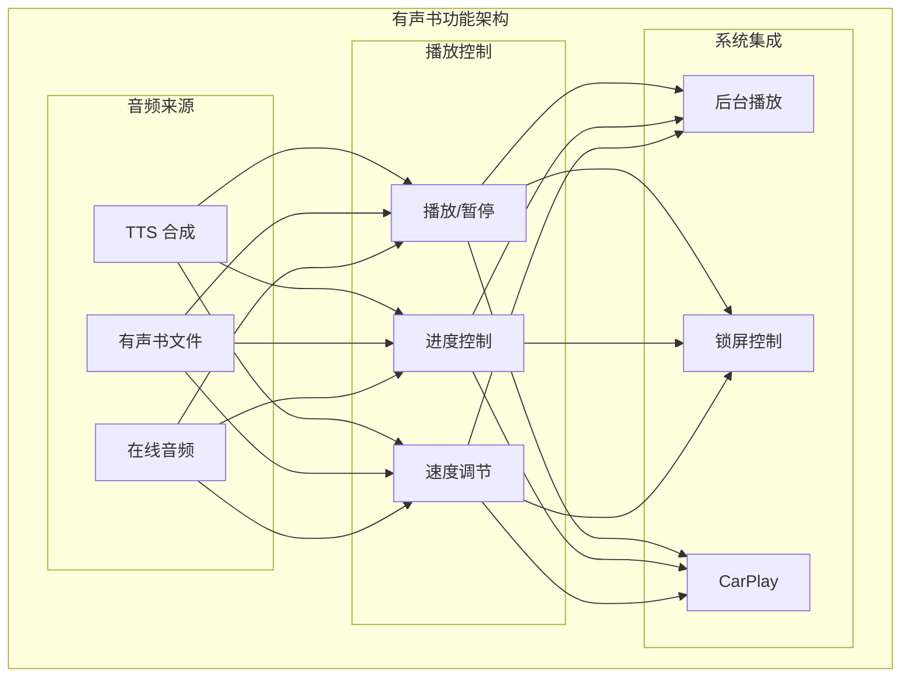

# iOS 有声书功能

> TTS 朗读 + 音频播放 + 后台控制

---

## 1. 功能概览



---

## 2. TTS 朗读

### 2.1 TTS 引擎

| 引擎 | 说明 | 质量 |
|------|------|------|
| AVSpeechSynthesizer | 系统内置 | 基础 |
| 第三方 TTS | 更自然语音 | 高质量 |
| AI 语音 | AI 合成语音 | 最佳 |

### 2.2 TTS 配置

```
┌─────────────────────────────────────────────────────────────────┐
│                    TTS 配置                                      │
├─────────────────────────────────────────────────────────────────┤
│                                                                  │
│  语音选择                                                        │
│  ├── 系统默认                                                    │
│  ├── 中文 - 女声 (Tingting)                                     │
│  ├── 中文 - 男声 (Binbin)                                       │
│  ├── 英文 - 女声 (Samantha)                                     │
│  └── 英文 - 男声 (Alex)                                         │
│                                                                  │
│  语速调节                                                        │
│  ├── 范围: 0.5x - 2.0x                                          │
│  ├── 默认: 1.0x                                                 │
│  └── 步进: 0.25x                                                │
│                                                                  │
│  音调调节                                                        │
│  ├── 范围: 0.5 - 2.0                                            │
│  └── 默认: 1.0                                                  │
│                                                                  │
│  音量调节                                                        │
│  └── 跟随系统音量                                                │
│                                                                  │
└─────────────────────────────────────────────────────────────────┘
```

---

## 3. 播放控制

### 3.1 控制功能

| 功能 | 说明 |
|------|------|
| 播放/暂停 | 控制播放状态 |
| 上一句/下一句 | 句子级跳转 |
| 上一章/下一章 | 章节级跳转 |
| 进度拖动 | 拖动进度条 |
| 定时停止 | 睡眠定时器 |

### 3.2 播放器界面

```
┌─────────────────────────────────────────────────────────────────┐
│                    播放器界面                                    │
├─────────────────────────────────────────────────────────────────┤
│                                                                  │
│  迷你播放器 (阅读器内嵌)                                         │
│  ┌─────────────────────────────────────────────────────────┐    │
│  │  ◀◀  │  ▶/⏸  │  ▶▶  │  ████░░░░░░  1.0x  │  🕐  │  ⏏  │    │
│  └─────────────────────────────────────────────────────────┘    │
│                                                                  │
│  全屏播放器                                                      │
│  ┌─────────────────────────────────────────────────────────┐    │
│  │                                                          │    │
│  │  ┌─────────────┐                                        │    │
│  │  │             │    第 3 章                              │    │
│  │  │   封面      │    童年时光                             │    │
│  │  │             │                                        │    │
│  │  └─────────────┘                                        │    │
│  │                                                          │    │
│  │  正在朗读的句子内容...                                    │    │
│  │                                                          │    │
│  │  03:25 ─────●───────────────────── 12:30               │    │
│  │                                                          │    │
│  │        ◀◀        ▶/⏸        ▶▶                          │    │
│  │                                                          │    │
│  │    [1.0x]    [定时]    [章节]    [设置]                  │    │
│  │                                                          │    │
│  └─────────────────────────────────────────────────────────┘    │
│                                                                  │
└─────────────────────────────────────────────────────────────────┘
```

---

## 4. 睡眠定时器

### 4.1 定时选项

| 选项 | 说明 |
|------|------|
| 15 分钟 | 15 分钟后停止 |
| 30 分钟 | 30 分钟后停止 |
| 45 分钟 | 45 分钟后停止 |
| 1 小时 | 1 小时后停止 |
| 本章结束 | 当前章节结束 |
| 自定义 | 自定义时间 |

### 4.2 定时器交互

```
┌─────────────────────────────────────────────────────────────────┐
│                    睡眠定时器                                    │
├─────────────────────────────────────────────────────────────────┤
│                                                                  │
│  ┌─────────────────────────────────────────────────────────┐    │
│  │                    睡眠定时                              │    │
│  │                                                          │    │
│  │  ○ 15 分钟                                               │    │
│  │  ○ 30 分钟                                               │    │
│  │  ● 45 分钟              ✓                                │    │
│  │  ○ 1 小时                                                │    │
│  │  ○ 本章结束                                               │    │
│  │  ○ 自定义...                                             │    │
│  │                                                          │    │
│  │  ─────────────────────────────────────────              │    │
│  │                                                          │    │
│  │  ☑ 倒计时结束时淡出                                      │    │
│  │  ☑ 显示倒计时提示                                        │    │
│  │                                                          │    │
│  │              [取消]    [确定]                            │    │
│  │                                                          │    │
│  └─────────────────────────────────────────────────────────┘    │
│                                                                  │
└─────────────────────────────────────────────────────────────────┘
```

---

## 5. 后台播放

### 5.1 后台支持

| 功能 | 实现 |
|------|------|
| 后台音频 | Audio Background Mode |
| 锁屏控制 | MPNowPlayingInfoCenter |
| 耳机控制 | MPRemoteCommandCenter |
| CarPlay | CarPlay 框架 |

### 5.2 锁屏信息

```
┌─────────────────────────────────────────────────────────────────┐
│                    锁屏控制中心                                   │
├─────────────────────────────────────────────────────────────────┤
│                                                                  │
│  ┌─────────────────────────────────────────────────────────┐    │
│  │                                                          │    │
│  │  ┌─────────────┐                                        │    │
│  │  │             │    书名: 追风筝的人                      │    │
│  │  │   封面      │    章节: 第三章                         │    │
│  │  │   缩略图    │    作者: 卡勒德·胡赛尼                   │    │
│  │  │             │                                        │    │
│  │  └─────────────┘                                        │    │
│  │                                                          │    │
│  │  03:25 ─────────●─────────────────── 12:30             │    │
│  │                                                          │    │
│  │         ◀◀         ▶         ▶▶                         │    │
│  │                                                          │    │
│  └─────────────────────────────────────────────────────────┘    │
│                                                                  │
│  MPNowPlayingInfoCenter 配置                                    │
│  ├── title: 章节名                                              │
│  ├── artist: 书名                                               │
│  ├── albumTitle: 作者                                           │
│  ├── artwork: 封面图                                            │
│  ├── playbackDuration: 总时长                                   │
│  └── elapsedPlaybackTime: 当前时间                              │
│                                                                  │
└─────────────────────────────────────────────────────────────────┘
```

---

## 6. 音频中断处理

### 6.1 中断类型

| 中断 | 处理 |
|------|------|
| 来电 | 暂停播放 |
| 闹钟 | 暂停播放 |
| Siri | 暂停播放 |
| 其他 App 播放 | 暂停/降低音量 |

### 6.2 中断恢复

```
┌─────────────────────────────────────────────────────────────────┐
│                    音频中断处理                                   │
├─────────────────────────────────────────────────────────────────┤
│                                                                  │
│  中断开始                                                        │
│  ├── 保存当前播放位置                                            │
│  ├── 暂停 TTS/音频播放                                          │
│  └── 更新 UI 状态                                               │
│                                                                  │
│  中断结束                                                        │
│  ├── 检查中断类型                                                │
│  │   ├── shouldResume = true                                   │
│  │   │   └── 自动恢复播放                                       │
│  │   │                                                         │
│  │   └── shouldResume = false                                  │
│  │       └── 保持暂停状态                                       │
│  │                                                              │
│  └── 更新 UI 状态                                               │
│                                                                  │
│  用户设置                                                        │
│  ├── ☑ 中断结束后自动恢复                                       │
│  └── ☑ 恢复前播放提示音                                         │
│                                                                  │
└─────────────────────────────────────────────────────────────────┘
```

---

## 7. 阅读同步

### 7.1 同步模式

| 模式 | 说明 |
|------|------|
| 语音 + 文本 | 朗读时高亮当前句子 |
| 仅语音 | 只播放语音 |
| 仅文本 | 不播放语音 |

### 7.2 文本高亮

```
┌─────────────────────────────────────────────────────────────────┐
│                    朗读同步高亮                                   │
├─────────────────────────────────────────────────────────────────┤
│                                                                  │
│  同步策略                                                        │
│  ├── 句子级同步                                                  │
│  │   └── 当前朗读句子高亮显示                                    │
│  │                                                              │
│  ├── 段落级同步                                                  │
│  │   └── 当前段落高亮                                            │
│  │                                                              │
│  └── 自动滚动                                                    │
│      └── 自动滚动到当前朗读位置                                  │
│                                                                  │
│  高亮样式                                                        │
│  ├── 背景色: 淡黄色                                              │
│  ├── 文字色: 保持不变                                            │
│  └── 动画: 平滑过渡                                              │
│                                                                  │
│  交互                                                            │
│  ├── 点击句子跳转到该位置                                        │
│  └── 拖动进度条同步文本位置                                      │
│                                                                  │
└─────────────────────────────────────────────────────────────────┘
```

---

## 8. 有声书格式

### 8.1 支持格式

| 格式 | 说明 |
|------|------|
| M4B | 有声书专用格式 |
| MP3 | 通用音频格式 |
| AAC | 高质量压缩 |
| OPUS | 现代压缩格式 |

### 8.2 章节管理

```
┌─────────────────────────────────────────────────────────────────┐
│                    有声书章节                                    │
├─────────────────────────────────────────────────────────────────┤
│                                                                  │
│  M4B 章节读取                                                    │
│  ├── 从元数据读取章节标记                                        │
│  └── 支持嵌入章节图片                                            │
│                                                                  │
│  MP3 章节处理                                                    │
│  ├── 多文件: 每个文件一章                                        │
│  └── 单文件: 按时间点分章                                        │
│                                                                  │
│  章节列表                                                        │
│  ┌─────────────────────────────────────────────────────────┐    │
│  │  ▶ 第一章: 开篇                           00:00 - 15:30 │    │
│  │    第二章: 童年                           15:30 - 32:45 │    │
│  │    第三章: 青春                           32:45 - 48:20 │    │
│  │    第四章: 离别                           48:20 - 1:05:00│    │
│  │    ...                                                   │    │
│  └─────────────────────────────────────────────────────────┘    │
│                                                                  │
└─────────────────────────────────────────────────────────────────┘
```

---

## 9. CarPlay 支持

### 9.1 CarPlay 功能

| 功能 | 说明 |
|------|------|
| 书架浏览 | 显示最近阅读 |
| 播放控制 | 播放/暂停/跳转 |
| 章节选择 | 选择章节播放 |
| 语音控制 | Siri 集成 |

### 9.2 CarPlay 界面

```
┌─────────────────────────────────────────────────────────────────┐
│                    CarPlay 界面                                  │
├─────────────────────────────────────────────────────────────────┤
│                                                                  │
│  书架列表                                                        │
│  ┌─────────────────────────────────────────────────────────┐    │
│  │  [封面] 追风筝的人              正在收听                │    │
│  │  [封面] 1984                    40% 进度                │    │
│  │  [封面] 百年孤独                未开始                  │    │
│  └─────────────────────────────────────────────────────────┘    │
│                                                                  │
│  播放中界面                                                      │
│  ┌─────────────────────────────────────────────────────────┐    │
│  │                                                          │    │
│  │  [封面]     追风筝的人                                   │    │
│  │             第三章: 风筝                                 │    │
│  │                                                          │    │
│  │       ◀◀         ▶⏸         ▶▶                          │    │
│  │                                                          │    │
│  │  03:25 ─────────────── 12:30                            │    │
│  │                                                          │    │
│  └─────────────────────────────────────────────────────────┘    │
│                                                                  │
└─────────────────────────────────────────────────────────────────┘
```

---

## 10. 性能优化

### 10.1 性能指标

| 指标 | 目标 |
|------|------|
| TTS 启动延迟 | < 500ms |
| 章节切换 | < 200ms |
| 内存占用 | < 50MB |
| 电量消耗 | < 5%/小时 |

### 10.2 优化措施

| 优化 | 说明 |
|------|------|
| 预加载 | 预加载下一句/章节 |
| 音频缓存 | 缓存常用语音 |
| 后台优化 | 降低后台 CPU 使用 |
| 电量优化 | 低功耗模式适配 |

---

## 11. 相关文档

| 文档 | 说明 |
|------|------|
| [reader.md](./reader.md) | 阅读器功能 |
| [../offline-support.md](../offline-support.md) | 离线支持 |
| [../architecture.md](../architecture.md) | 架构设计 |

---

*最后更新: 2025-12-31*
