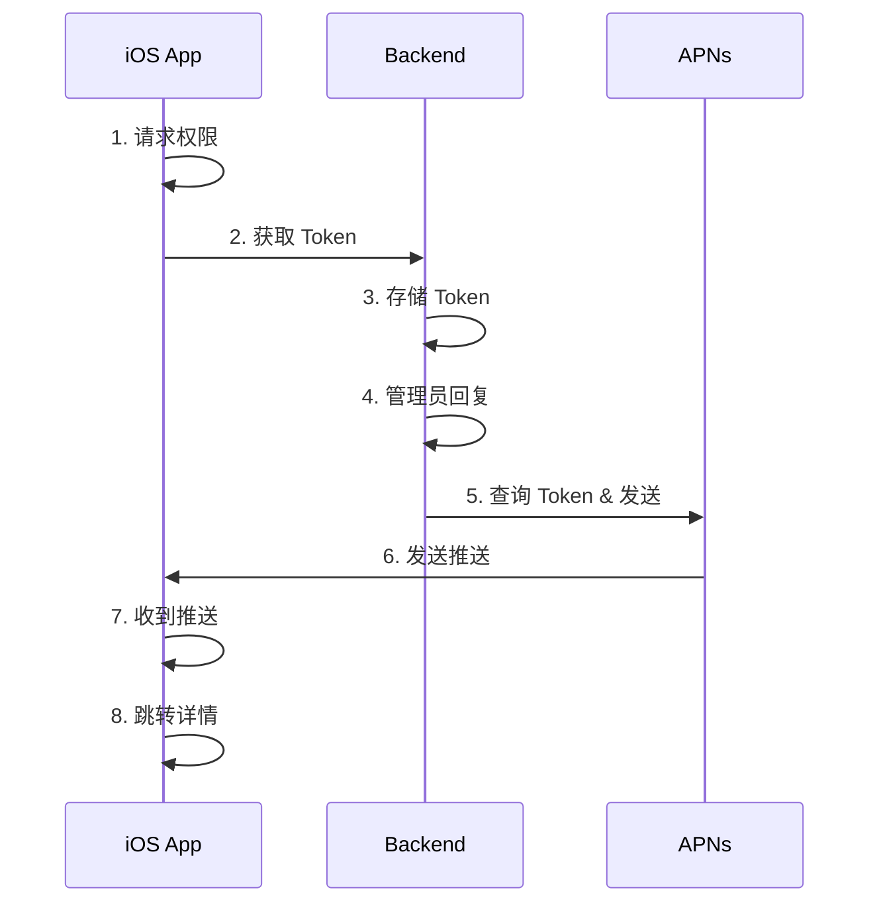

# Guest 反馈推送通知

## 概述
当管理员回复 Guest 用户的反馈时，用户能收到 APNs 推送通知。

---

## 架构



---

## 关键文件

### 数据库
| 文件 | 说明 |
|------|------|
| `packages/database/prisma/schema.prisma` | GuestFeedback.pushToken 字段 |
| `prisma/migrations/20260105100000_add_push_token_to_guest_feedback/` | 迁移文件 |

### 后端
| 文件 | 说明 |
|------|------|
| `apps/backend/src/modules/notifications/push-notification.service.ts` | APNs 推送服务 |
| `apps/backend/src/modules/notifications/push-notification.module.ts` | 推送模块 |
| `apps/backend/src/modules/messages/guest-feedback.controller.ts` | Token 注册 API |
| `apps/backend/src/modules/messages/guest-feedback.service.ts` | 回复时发送推送 |

### iOS
| 文件 | 说明 |
|------|------|
| `ios/Readmigo/App/AppDelegate.swift` | Token 回调 |
| `ios/Readmigo/Core/Services/PushNotificationService.swift` | 推送服务 |
| `ios/Readmigo/Core/Network/APIEndpoints.swift` | API 端点 |
| `ios/Readmigo/Features/Messaging/Services/MessagingService.swift` | Token 上传 |

---

## API 端点

| 端点 | 方法 | 认证 | 描述 |
|------|------|------|------|
| `/guest-feedback/push-token` | POST | 无 | 注册推送 Token |

请求体:
```json
{
  "deviceId": "xxx-xxx-xxx",
  "pushToken": "apns-token-string"
}
```

---

## 环境变量

```bash
# APNs 配置 (后端)
APNS_KEY_ID=xxxxxxxxxx
APNS_TEAM_ID=xxxxxxxxxx
APNS_KEY_PATH=/path/to/AuthKey.p8
APNS_BUNDLE_ID=com.readmigo.app
APNS_PRODUCTION=true
```

---

## 配置要求

| 项目 | 说明 |
|------|------|
| Apple Developer | 创建 APNs Key (p8 格式) |
| Xcode | 启用 Push Notifications capability |
| 后端服务器 | 配置环境变量并部署 p8 密钥文件 |

---

## 安全考虑

| 风险 | 措施 |
|------|------|
| Token 泄露 | 仅存储，不对外暴露 |
| 推送滥用 | 仅在管理员回复时发送 |
| 无效 Token | 处理 APNs 错误，自动清理失效 Token |
