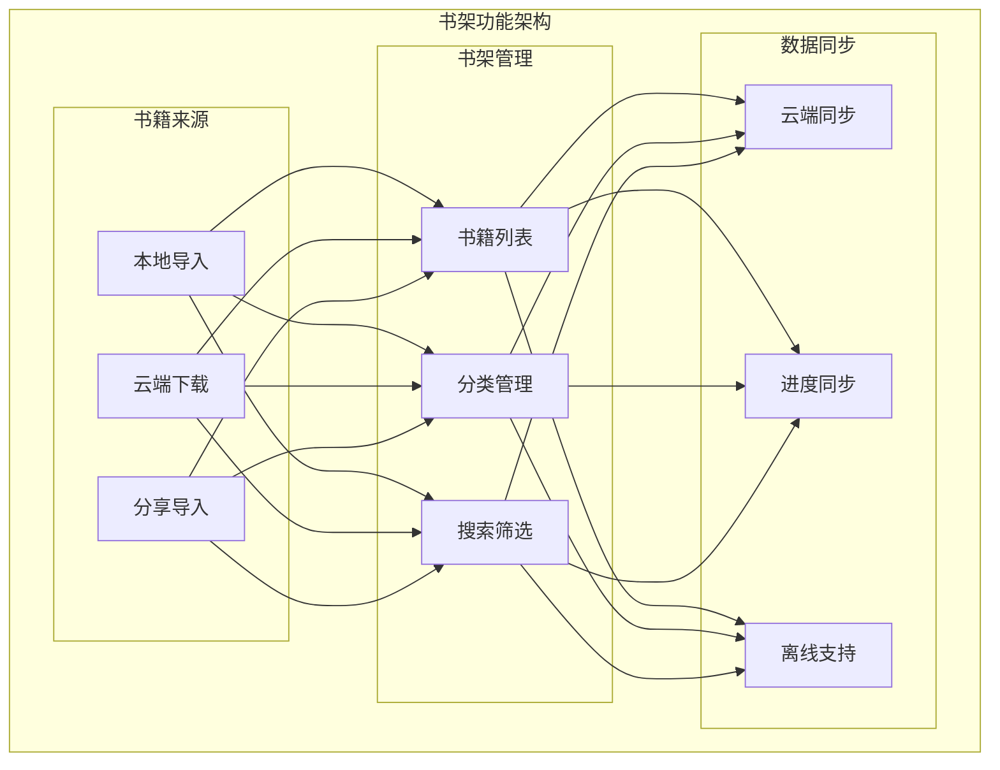
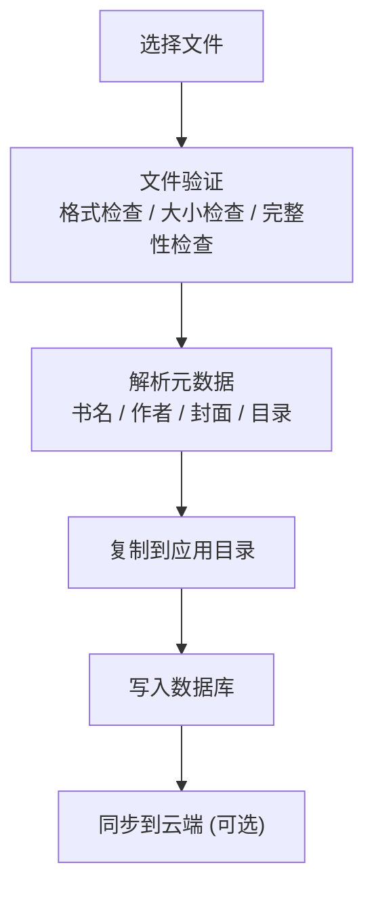

# iOS 书架功能

> 书籍管理 + 分类 + 同步

---

## 1. 功能概览



---

## 2. 书籍导入

### 2.1 导入方式

| 方式 | 说明 | 支持格式 |
|------|------|----------|
| 文件 App | 从文件 App 选择 | EPUB, PDF, TXT |
| 分享导入 | 其他 App 分享 | EPUB, PDF |
| 云端下载 | 从书城下载 | EPUB |
| iCloud | iCloud Drive 同步 | EPUB, PDF |
| AirDrop | AirDrop 接收 | EPUB, PDF |

### 2.2 导入流程



---

## 3. 书架展示

### 3.1 视图模式

| 模式 | 说明 |
|------|------|
| 网格视图 | 封面网格展示 |
| 列表视图 | 列表详情展示 |
| 书架视图 | 仿真书架展示 |

### 3.2 书架布局

```
┌─────────────────────────────────────────────────────────────────┐
│                    网格视图                                      │
├─────────────────────────────────────────────────────────────────┤
│                                                                  │
│  ┌─────────────────────────────────────────────────────────┐    │
│  │  [搜索栏]                           [筛选] [排序] [+]   │    │
│  └─────────────────────────────────────────────────────────┘    │
│                                                                  │
│  ┌─────────────────────────────────────────────────────────┐    │
│  │  [全部] [在读] [未读] [已读] [收藏]                      │    │
│  └─────────────────────────────────────────────────────────┘    │
│                                                                  │
│  ┌─────────┐  ┌─────────┐  ┌─────────┐  ┌─────────┐            │
│  │ 封面    │  │ 封面    │  │ 封面    │  │ 封面    │            │
│  │         │  │         │  │         │  │         │            │
│  ├─────────┤  ├─────────┤  ├─────────┤  ├─────────┤            │
│  │ 书名    │  │ 书名    │  │ 书名    │  │ 书名    │            │
│  │ 作者    │  │ 作者    │  │ 作者    │  │ 作者    │            │
│  │ ████░░░ │  │ ██░░░░░ │  │ ████████│  │ ░░░░░░░ │            │
│  └─────────┘  └─────────┘  └─────────┘  └─────────┘            │
│                                                                  │
└─────────────────────────────────────────────────────────────────┘
```

---

## 4. 分类管理

### 4.1 分类类型

| 分类 | 说明 |
|------|------|
| 阅读状态 | 未读/在读/已读 |
| 书单 | 用户自定义书单 |
| 标签 | 自定义标签 |
| 类别 | 书籍类别 |

### 4.2 分类操作

```
┌─────────────────────────────────────────────────────────────────┐
│                    分类管理                                      │
├─────────────────────────────────────────────────────────────────┤
│                                                                  │
│  书单管理                                                        │
│  ├── 创建书单                                                    │
│  ├── 编辑书单 (名称、描述、封面)                                 │
│  ├── 删除书单                                                    │
│  ├── 添加书籍到书单                                              │
│  └── 从书单移除书籍                                              │
│                                                                  │
│  标签管理                                                        │
│  ├── 创建标签                                                    │
│  ├── 编辑标签                                                    │
│  ├── 删除标签                                                    │
│  └── 批量添加标签                                                │
│                                                                  │
│  快速分类                                                        │
│  ├── 长按书籍                                                    │
│  ├── 选择操作菜单                                                │
│  └── 添加到书单/标签                                             │
│                                                                  │
└─────────────────────────────────────────────────────────────────┘
```

---

## 5. 搜索与筛选

### 5.1 搜索功能

| 搜索维度 | 说明 |
|----------|------|
| 书名 | 书籍名称 |
| 作者 | 作者名 |
| 内容 | 全文搜索 (EPUB) |
| 笔记 | 笔记内容 |

### 5.2 筛选与排序

```
┌─────────────────────────────────────────────────────────────────┐
│                    筛选与排序                                    │
├─────────────────────────────────────────────────────────────────┤
│                                                                  │
│  筛选选项                                                        │
│  ├── 阅读状态                                                    │
│  │   ├── 全部                                                    │
│  │   ├── 未读                                                    │
│  │   ├── 在读                                                    │
│  │   └── 已读                                                    │
│  │                                                              │
│  ├── 格式                                                        │
│  │   ├── EPUB                                                   │
│  │   ├── PDF                                                    │
│  │   └── TXT                                                    │
│  │                                                              │
│  └── 来源                                                        │
│      ├── 本地导入                                                │
│      └── 云端下载                                                │
│                                                                  │
│  排序选项                                                        │
│  ├── 最近阅读                                                    │
│  ├── 添加时间                                                    │
│  ├── 书名 A-Z                                                   │
│  ├── 作者 A-Z                                                   │
│  └── 阅读进度                                                    │
│                                                                  │
└─────────────────────────────────────────────────────────────────┘
```

---

## 6. 书籍操作

### 6.1 单本操作

| 操作 | 说明 |
|------|------|
| 打开阅读 | 进入阅读器 |
| 查看详情 | 书籍详情页 |
| 编辑信息 | 修改元数据 |
| 分享书籍 | 分享给他人 |
| 删除书籍 | 移除书籍 |

### 6.2 批量操作

```
┌─────────────────────────────────────────────────────────────────┐
│                    批量操作                                      │
├─────────────────────────────────────────────────────────────────┤
│                                                                  │
│  进入编辑模式                                                    │
│  ├── 长按书籍                                                    │
│  └── 点击"选择"按钮                                              │
│                                                                  │
│  选择书籍                                                        │
│  ├── 点击选择单本                                                │
│  ├── 全选                                                        │
│  └── 取消全选                                                    │
│                                                                  │
│  批量操作                                                        │
│  ├── 添加到书单                                                  │
│  ├── 添加标签                                                    │
│  ├── 标记已读/未读                                               │
│  ├── 导出                                                        │
│  └── 删除                                                        │
│                                                                  │
│  退出编辑模式                                                    │
│  └── 点击"完成"按钮                                              │
│                                                                  │
└─────────────────────────────────────────────────────────────────┘
```

---

## 7. 书籍详情

### 7.1 详情内容

| 信息 | 说明 |
|------|------|
| 封面 | 书籍封面图 |
| 书名 | 书籍名称 |
| 作者 | 作者信息 |
| 出版信息 | 出版社、日期 |
| 简介 | 书籍简介 |
| 阅读数据 | 进度、时长 |

### 7.2 详情页布局

```
┌─────────────────────────────────────────────────────────────────┐
│                    书籍详情页                                    │
├─────────────────────────────────────────────────────────────────┤
│                                                                  │
│  ┌─────────────────────────────────────────────────────────┐    │
│  │                                                          │    │
│  │  ┌─────────────┐                                        │    │
│  │  │             │    书籍名称                            │    │
│  │  │   封面      │    作者                                │    │
│  │  │             │    ⭐⭐⭐⭐⭐ 评分                      │    │
│  │  │             │                                        │    │
│  │  └─────────────┘    [继续阅读]  [♡收藏]                 │    │
│  │                                                          │    │
│  └─────────────────────────────────────────────────────────┘    │
│                                                                  │
│  阅读进度                                                        │
│  ████████████░░░░░░░░░░░░░░░░░░░ 40%                            │
│  已读 120 页 / 共 300 页                                        │
│                                                                  │
│  阅读统计                                                        │
│  ├── 阅读时长: 5 小时 30 分钟                                   │
│  ├── 开始日期: 2025-12-01                                       │
│  └── 最近阅读: 2025-12-31                                       │
│                                                                  │
│  书籍简介                                                        │
│  ├── 这是一本关于...                                             │
│  └── [展开]                                                      │
│                                                                  │
│  目录  |  书签  |  笔记  |  高亮                                 │
│                                                                  │
└─────────────────────────────────────────────────────────────────┘
```

---

## 8. 云端同步

### 8.1 同步内容

| 内容 | 同步策略 |
|------|----------|
| 书籍文件 | 按需下载 |
| 元数据 | 自动同步 |
| 阅读进度 | 实时同步 |
| 书签笔记 | 实时同步 |
| 书单 | 自动同步 |

### 8.2 同步状态

```
┌─────────────────────────────────────────────────────────────────┐
│                    同步状态                                      │
├─────────────────────────────────────────────────────────────────┤
│                                                                  │
│  同步指示器                                                      │
│  ├── ☁️ 已同步                                                  │
│  ├── ⬇️ 下载中                                                  │
│  ├── ⬆️ 上传中                                                  │
│  ├── ⚠️ 同步失败                                                │
│  └── 📱 仅本地                                                  │
│                                                                  │
│  冲突处理                                                        │
│  ├── 自动合并    无冲突时自动合并                               │
│  ├── 保留两者    冲突时保留两个版本                             │
│  └── 用户选择    让用户选择保留哪个                             │
│                                                                  │
│  网络状态                                                        │
│  ├── WiFi      全量同步                                         │
│  ├── 蜂窝      仅元数据同步                                     │
│  └── 离线      本地队列                                         │
│                                                                  │
└─────────────────────────────────────────────────────────────────┘
```

---

## 9. 存储管理

### 9.1 存储统计

| 统计项 | 说明 |
|--------|------|
| 总存储 | 所有书籍占用 |
| 本地书籍 | 本地文件大小 |
| 缓存 | 渲染缓存等 |
| 可清理 | 可释放空间 |

### 9.2 存储优化

```
┌─────────────────────────────────────────────────────────────────┐
│                    存储管理                                      │
├─────────────────────────────────────────────────────────────────┤
│                                                                  │
│  存储统计                                                        │
│  ├── 总占用: 2.5 GB                                             │
│  ├── 书籍文件: 2.0 GB                                           │
│  ├── 渲染缓存: 300 MB                                           │
│  └── 其他: 200 MB                                               │
│                                                                  │
│  清理选项                                                        │
│  ├── 清理渲染缓存                                                │
│  ├── 清理已读书籍本地文件                                        │
│  ├── 清理云端已有的本地文件                                      │
│  └── 清理所有缓存                                                │
│                                                                  │
│  自动管理                                                        │
│  ├── 存储不足时自动清理                                          │
│  ├── 保留最近阅读的书籍                                          │
│  └── 云端书籍按需下载                                            │
│                                                                  │
└─────────────────────────────────────────────────────────────────┘
```

---

## 10. 性能优化

### 10.1 列表优化

| 优化 | 方法 |
|------|------|
| 懒加载 | LazyVGrid/LazyVStack |
| 封面缓存 | Kingfisher 缓存 |
| 分页加载 | 无限滚动分页 |
| 预加载 | 提前加载可见范围外 |

### 10.2 性能指标

| 指标 | 目标 |
|------|------|
| 首屏加载 | < 500ms |
| 滚动帧率 | 60fps |
| 封面加载 | < 100ms |

---

## 11. 相关文档

| 文档 | 说明 |
|------|------|
| [reader.md](./reader.md) | 阅读器功能 |
| [../offline-support.md](../offline-support.md) | 离线支持 |
| [../architecture.md](../architecture.md) | 架构设计 |

---

*最后更新: 2025-12-31*
