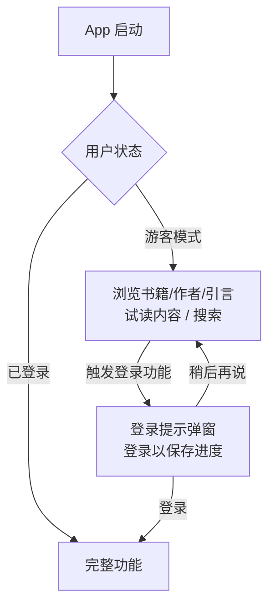

# Readmigo iOS 游客模式功能规划

## 概述

允许用户在不登录的情况下浏览内容，只在需要特定功能时才提示登录（非强制）。

---

## 一、无需登录可使用的功能（浏览型）

| 功能 | 描述 | 备注 |
|------|------|------|
| **发现/浏览书籍** | 浏览书籍列表、查看书籍详情 | 首页推荐、分类浏览 |
| **书单浏览** | 查看精选书单和书单内容 | 只读 |
| **作者浏览** | 查看作者资料、简介、作品 | 只读 |
| **引言浏览** | 查看每日引言、趋势引言 | 只读 |
| **搜索** | 搜索书籍、作者、引言 | 基础搜索 |
| **试读** | 试读书籍部分内容 | 可限制章节数 |
| **设置** | 语言设置、主题设置 | 本地存储 |

---

## 二、需要登录才能使用的功能（交互/数据型）

| 功能 | 触发场景 | 登录提示时机 |
|------|----------|--------------|
| **添加到图书馆** | 点击"加入书架"按钮 | 点击时提示 |
| **阅读进度同步** | 阅读超过试读范围 | 阅读时提示 |
| **书签/高亮/笔记** | 长按文本选择操作 | 操作时提示 |
| **词汇收藏** | 点击"添加到生词本" | 点击时提示 |
| **学习/复习** | 进入学习模块 | 进入时提示 |
| **引言点赞/收藏** | 点击喜欢按钮 | 点击时提示 |
| **创建明信片** | 点击创建明信片 | 点击时提示 |
| **与作者对话** | 点击聊天按钮 | 点击时提示 |
| **AI 交互** | 使用 AI 解释功能 | 使用时提示 |
| **成就/徽章** | 进入成就页面 | 进入时提示 |
| **个人统计** | 查看学习数据 | 进入时提示 |
| **订阅购买** | 购买会员 | 购买前提示 |
| **离线下载** | 下载书籍内容 | 下载时提示 |

---

## 三、用户流程图

---

## 四、实现方案

### 4.1 核心修改

1. **ReadmigoApp.swift** - 移除强制登录检查，允许游客进入主界面
2. **AuthManager.swift** - 添加游客模式状态和登录提示方法
3. **LoginPromptView.swift** - 新建登录提示弹窗组件
4. **各功能视图** - 在需要登录的操作前添加检查

### 4.3 登录提示弹窗设计

提示文案示例：
- 保存阅读进度：「登录后可同步阅读进度到云端」
- 添加书签：「登录后可保存书签和笔记」
- 收藏词汇：「登录后可将生词添加到词汇本」
- 点赞引言：「登录后可收藏喜欢的引言」

---

## 五、需要修改的文件清单

### 核心文件
- [x] `ReadmigoApp.swift` - 移除强制登录 (ContentView 已支持 isGuestMode)
- [x] `AuthManager.swift` - 添加游客模式支持 (enterGuestMode, requireLogin, isGuestMode)
- [x] `LoginPromptView.swift` - 新建登录提示组件 (已实现)
- [x] `LoginRequiredView.swift` - 新建登录必需页面组件 (已实现)
- [x] `View+LoginPrompt.swift` - 新建 View 扩展 (globalLoginPrompt, loginPrompt)

### 功能视图（添加登录检查）
- [x] `LibraryView.swift` - 添加到书架 (GuestLibraryPromptView 已实现)
- [x] `BookDetailView.swift` - 开始阅读、添加书架 (登录检查已添加)
- [x] `ReaderView.swift` - 书签、高亮、笔记 (登录检查已添加)
- [x] `QuotesView.swift` - 点赞、收藏 (登录检查已添加)
- [x] `VocabularyView.swift` - 词汇管理 (LoginRequiredView 已添加)
- [x] `PostcardsView.swift` - 创建明信片 (LoginRequiredView 已添加)
- [x] `AuthorChatView.swift` - 与作者对话 (LoginRequiredView 已添加)
- [x] `AIInteractionPanel.swift` - AI 交互 (登录检查已添加)
- [x] `BadgesView.swift` - 成就页面 (LoginRequiredView 已添加)
- [x] `StatsView.swift` - 学习统计 (LoginRequiredView 已添加)
- [x] `MeView.swift` - 个人页面调整 (MeProfileCard guest mode 已实现)

---

## 六、后端 API 调整

部分 API 需要支持匿名访问：

| API | 当前状态 | 目标状态 | 备注 |
|-----|---------|---------|------|
| `GET /books` | ✅ 匿名可访问 | 匿名可访问 | 已实现 |
| `GET /books/:id` | ✅ 匿名可访问 | 匿名可访问 | 已实现 |
| `GET /authors` | ✅ 匿名可访问 | 匿名可访问 | 已实现 |
| `GET /authors/:id` | ✅ 匿名可访问 | 匿名可访问 | 已实现 |
| `GET /quotes` | ✅ 匿名可访问 | 匿名可访问 | 已实现 |
| `GET /book-lists` | ✅ 匿名可访问 | 匿名可访问 | 已实现 |
| `POST /auth/guest` | ✅ 已实现 | - | Guest 账户创建 |
| `POST /auth/upgrade` | ✅ 已实现 | - | Guest 升级 |
| `POST /library/*` | 需要登录 | 保持需要登录 | - |
| `POST /bookmarks/*` | 需要登录 | 保持需要登录 | - |

---

## 七、测试用例

1. **游客浏览** - 未登录用户可以浏览书籍、作者、引言
2. **登录提示** - 点击需要登录的功能时显示友好提示
3. **稍后再说** - 用户可以关闭提示继续浏览
4. **登录跳转** - 点击登录后跳转到登录页面
5. **登录后继续** - 登录成功后可以继续之前的操作

---

Created: 2024-12-21
