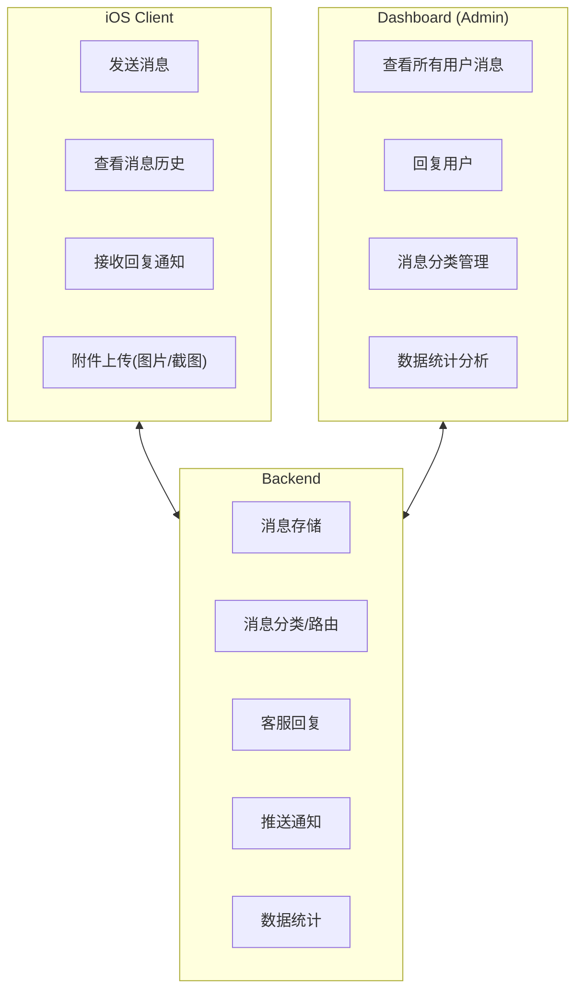

# 站内信与用户反馈系统设计文档

## 1. 概述

### 1.1 背景

站内信系统是用户与官方沟通的核心渠道，支持用户反馈、问题咨询、功能建议等场景。该系统与"联系我们"功能中的站内信入口复用，同时支持从多个入口进入（关于页面、帮助中心、设置等）。

### 1.2 目标

- 提供便捷的应用内沟通渠道，用户无需离开 App
- 支持多种消息类型（反馈、咨询、建议、投诉等）
- 支持消息历史记录查看和回复追踪
- 后台统一管理用户消息，提高客服效率
- 支持消息推送通知，确保用户及时收到回复

### 1.3 系统边界



## 2. 功能需求

### 2.1 核心功能

| 功能 | 优先级 | 描述 |
|------|--------|------|
| 发送消息 | P0 | 用户发送文字消息给官方 |
| 消息类型选择 | P0 | 选择反馈/咨询/建议/投诉等类型 |
| 消息历史 | P0 | 查看历史消息和官方回复 |
| 附件上传 | P1 | 上传图片/截图辅助说明问题 |
| 推送通知 | P1 | 官方回复时推送通知用户 |
| 未读标记 | P1 | 显示未读消息数量 |
| 消息搜索 | P2 | 搜索历史消息 |
| 满意度评价 | P2 | 对客服回复进行评价 |

### 2.2 用户故事

1. **作为用户**，我想通过站内信反馈使用问题，以便获得官方帮助
2. **作为用户**，我想上传截图说明问题，以便官方更好理解我的问题
3. **作为用户**，我想查看历史消息记录，以便追踪问题处理进度
4. **作为用户**，我想收到回复通知，以便及时查看官方回复
5. **作为用户**，我想对回复评价，以便帮助改进服务质量
6. **作为客服**，我想查看用户的设备信息，以便更好地诊断问题

### 2.3 入口位置

站内信功能有多个入口：

| 入口 | 路径 | 场景 |
|------|------|------|
| 关于页面 | Me → About → Contact Us → Send Message | 通用联系 |
| 帮助中心 | Me → Help Center → Contact Support | 获取帮助 |
| 设置页面 | Me → Settings → Feedback | 反馈入口 |
| 消息中心 | Me → Messages | 查看历史/回复 |

## 3. UI 设计

### 3.1 消息列表页（消息中心）

```
┌─────────────────────────────────┐
│         ← Messages              │  Navigation Bar
├─────────────────────────────────┤
│  [Search messages...]       🔍   │  搜索栏（P2）
├─────────────────────────────────┤
│  ┌─────────────────────────────┐│
│  │ 📝 Feature Suggestion       ││  消息卡片
│  │    希望增加深色模式下的...    ││  最近一条消息预览
│  │    2024-12-20 14:30    🔵   ││  时间 + 未读标记
│  └─────────────────────────────┘│
├─────────────────────────────────┤
│  ┌─────────────────────────────┐│
│  │ ❓ Technical Issue          ││
│  │    阅读器页面有时会卡顿...    ││
│  │    2024-12-18 09:15    ✓   ││  已读已回复
│  └─────────────────────────────┘│
├─────────────────────────────────┤
│  ┌─────────────────────────────┐│
│  │ 💬 General Inquiry          ││
│  │    请问会员有什么权益...      ││
│  │    2024-12-15 16:42    ✓   ││
│  └─────────────────────────────┘│
├─────────────────────────────────┤
│                                 │
│      No more messages           │
│                                 │
├─────────────────────────────────┤
│           [+ New Message]       │  浮动按钮
└─────────────────────────────────┘
```

### 3.2 发送新消息页

```
┌─────────────────────────────────┐
│       ← New Message      Send   │  Navigation Bar
├─────────────────────────────────┤
│  Message Type                   │  Section Header
├─────────────────────────────────┤
│  ┌─────────────────────────────┐│
│  │ ❓ Technical Issue      ●   ││  单选项
│  │ 📝 Feature Suggestion   ○   ││
│  │ 💬 General Inquiry      ○   ││
│  │ ⚠️ Report a Problem     ○   ││
│  │ 📢 Complaint            ○   ││
│  └─────────────────────────────┘│
├─────────────────────────────────┤
│  Subject                        │
├─────────────────────────────────┤
│  ┌─────────────────────────────┐│
│  │ Enter subject...            ││  标题输入框
│  └─────────────────────────────┘│
├─────────────────────────────────┤
│  Message                        │
├─────────────────────────────────┤
│  ┌─────────────────────────────┐│
│  │                             ││
│  │ Please describe your        ││  多行文本输入
│  │ issue or suggestion in      ││
│  │ detail...                   ││
│  │                             ││
│  │                             ││
│  │                    500/2000 ││  字数限制
│  └─────────────────────────────┘│
├─────────────────────────────────┤
│  Attachments (Optional)         │
├─────────────────────────────────┤
│  ┌─────┐ ┌─────┐ ┌─────┐       │
│  │ 📷  │ │ img │ │ img │       │  图片附件（最多5张）
│  │ Add │ │  ×  │ │  ×  │       │
│  └─────┘ └─────┘ └─────┘       │
├─────────────────────────────────┤
│  ┌─────────────────────────────┐│
│  │ ☑️ Include device info      ││  自动附带设备信息
│  └─────────────────────────────┘│
└─────────────────────────────────┘
```

### 3.3 消息详情/对话页

```
┌─────────────────────────────────┐
│    ← Technical Issue            │  Navigation Bar
├─────────────────────────────────┤
│  Status: Replied                │  消息状态
│  Created: 2024-12-18 09:15      │
├─────────────────────────────────┤
│  ┌─────────────────────────────┐│
│  │ 阅读器页面有时会卡顿，尤其   ││  用户发送的消息
│  │ 是在阅读长篇书籍时。         ││  （右对齐/蓝色气泡）
│  │                             ││
│  │ [截图1] [截图2]             ││  附件缩略图
│  │                             ││
│  │ Device: iPhone 15 Pro       ││  设备信息
│  │ iOS 17.0 | App 1.0.0        ││
│  │                    09:15 ✓ ││
│  └─────────────────────────────┘│
├─────────────────────────────────┤
│  ┌─────────────────────────────┐│
│  │ 感谢您的反馈！我们已经定位   ││  官方回复
│  │ 到这个问题，将在下个版本    ││  （左对齐/灰色气泡）
│  │ 修复。您可以尝试清除阅读    ││
│  │ 缓存临时解决此问题。        ││
│  │                             ││
│  │ Readmigo Team               ││
│  │                    10:30    ││
│  └─────────────────────────────┘│
├─────────────────────────────────┤
│  Was this reply helpful?        │  满意度评价
│  [👍 Yes]  [👎 No]             │
├─────────────────────────────────┤
│  ┌─────────────────────────────┐│
│  │ Type a reply...          📷 ││  继续回复输入框
│  └─────────────────────────────┘│
│              [Send]             │
└─────────────────────────────────┘
```

### 3.4 消息类型设计

| 类型 | 图标 | 英文 | 中文 | 繁中 |
|------|------|------|------|------|
| 技术问题 | ❓ | Technical Issue | 技术问题 | 技術問題 |
| 功能建议 | 📝 | Feature Suggestion | 功能建议 | 功能建議 |
| 一般咨询 | 💬 | General Inquiry | 一般咨询 | 一般諮詢 |
| 问题报告 | ⚠️ | Report a Problem | 问题报告 | 問題回報 |
| 投诉 | 📢 | Complaint | 投诉 | 投訴 |
| 商务合作 | 🤝 | Business Inquiry | 商务合作 | 商務合作 |

## 4. 数据模型

### 4.1 消息会话模型

```swift
struct MessageThread: Identifiable, Codable {
    let id: String
    let userId: String
    let type: MessageType
    let subject: String
    let status: ThreadStatus
    let createdAt: Date
    let updatedAt: Date
    let lastMessagePreview: String
    let unreadCount: Int
    let messages: [Message]?  // 详情时加载
}

enum MessageType: String, Codable, CaseIterable {
    case technicalIssue = "technical_issue"
    case featureSuggestion = "feature_suggestion"
    case generalInquiry = "general_inquiry"
    case problemReport = "problem_report"
    case complaint = "complaint"
    case businessInquiry = "business_inquiry"

    var icon: String {
        switch self {
        case .technicalIssue: return "questionmark.circle.fill"
        case .featureSuggestion: return "lightbulb.fill"
        case .generalInquiry: return "bubble.left.fill"
        case .problemReport: return "exclamationmark.triangle.fill"
        case .complaint: return "megaphone.fill"
        case .businessInquiry: return "briefcase.fill"
        }
    }

    var localizedName: String {
        // 返回本地化名称
    }
}

enum ThreadStatus: String, Codable {
    case open = "open"           // 待处理
    case replied = "replied"     // 已回复
    case closed = "closed"       // 已关闭
    case resolved = "resolved"   // 已解决
}
```

### 4.2 消息模型

```swift
struct Message: Identifiable, Codable {
    let id: String
    let threadId: String
    let senderId: String
    let senderType: SenderType
    let content: String
    let attachments: [Attachment]?
    let deviceInfo: DeviceInfo?   // 仅用户发送的首条消息
    let createdAt: Date
    let readAt: Date?

    enum SenderType: String, Codable {
        case user = "user"
        case support = "support"
        case system = "system"
    }
}

struct Attachment: Identifiable, Codable {
    let id: String
    let type: AttachmentType
    let url: String
    let thumbnailUrl: String?
    let fileName: String?
    let fileSize: Int?

    enum AttachmentType: String, Codable {
        case image = "image"
        case file = "file"
    }
}
```

### 4.3 满意度评价模型

```swift
struct FeedbackRating: Codable {
    let threadId: String
    let messageId: String        // 针对哪条回复的评价
    let rating: Rating
    let comment: String?
    let createdAt: Date

    enum Rating: String, Codable {
        case helpful = "helpful"
        case notHelpful = "not_helpful"
    }
}
```

## 5. API 接口设计

### 5.1 消息会话 API

```
# 获取消息会话列表
GET /api/v1/messages/threads
Query: page, limit, status
Response: { threads: [MessageThread], total: Int, hasMore: Bool }

# 获取单个会话详情（含消息）
GET /api/v1/messages/threads/{threadId}
Response: { thread: MessageThread }

# 创建新会话（发送新消息）
POST /api/v1/messages/threads
Body: {
    type: String,
    subject: String,
    content: String,
    attachmentIds: [String]?,
    includeDeviceInfo: Bool
}
Response: { thread: MessageThread }

# 在会话中回复
POST /api/v1/messages/threads/{threadId}/messages
Body: {
    content: String,
    attachmentIds: [String]?
}
Response: { message: Message }

# 关闭会话
POST /api/v1/messages/threads/{threadId}/close
Response: { success: Bool }
```

### 5.2 附件 API

```
# 上传附件
POST /api/v1/messages/attachments
Content-Type: multipart/form-data
Body: file (image)
Response: { attachment: Attachment }

# 删除附件（发送前）
DELETE /api/v1/messages/attachments/{attachmentId}
Response: { success: Bool }
```

### 5.3 评价 API

```
# 提交评价
POST /api/v1/messages/threads/{threadId}/rating
Body: {
    messageId: String,
    rating: "helpful" | "not_helpful",
    comment: String?
}
Response: { success: Bool }
```

### 5.4 未读消息 API

```
# 获取未读消息数
GET /api/v1/messages/unread-count
Response: { count: Int }

# 标记会话已读
POST /api/v1/messages/threads/{threadId}/read
Response: { success: Bool }
```

## 6. 本地化支持

### 6.1 本地化 Key

| Key | English | 简体中文 | 繁體中文 |
|-----|---------|----------|----------|
| `messaging.title` | Messages | 消息 | 訊息 |
| `messaging.newMessage` | New Message | 新消息 | 新訊息 |
| `messaging.send` | Send | 发送 | 傳送 |
| `messaging.messageType` | Message Type | 消息类型 | 訊息類型 |
| `messaging.subject` | Subject | 主题 | 主題 |
| `messaging.subjectPlaceholder` | Enter subject... | 请输入主题... | 請輸入主題... |
| `messaging.content` | Message | 消息内容 | 訊息內容 |
| `messaging.contentPlaceholder` | Please describe your issue or suggestion in detail... | 请详细描述您的问题或建议... | 請詳細描述您的問題或建議... |
| `messaging.attachments` | Attachments (Optional) | 附件（可选） | 附件（選填） |
| `messaging.addPhoto` | Add Photo | 添加图片 | 新增圖片 |
| `messaging.includeDeviceInfo` | Include device info | 附带设备信息 | 附帶裝置資訊 |
| `messaging.status.open` | Open | 待处理 | 待處理 |
| `messaging.status.replied` | Replied | 已回复 | 已回覆 |
| `messaging.status.closed` | Closed | 已关闭 | 已關閉 |
| `messaging.status.resolved` | Resolved | 已解决 | 已解決 |
| `messaging.helpful` | Was this reply helpful? | 此回复是否有帮助？ | 此回覆是否有幫助？ |
| `messaging.yes` | Yes | 有帮助 | 有幫助 |
| `messaging.no` | No | 没帮助 | 沒幫助 |
| `messaging.thanksFeedback` | Thanks for your feedback! | 感谢您的反馈！ | 感謝您的回饋！ |
| `messaging.noMessages` | No messages yet | 暂无消息 | 暫無訊息 |
| `messaging.sendSuccess` | Message sent successfully | 消息发送成功 | 訊息傳送成功 |
| `messaging.sendFailed` | Failed to send message | 消息发送失败 | 訊息傳送失敗 |
| `messaging.replyPlaceholder` | Type a reply... | 输入回复... | 輸入回覆... |
| `messaging.loginRequired` | Please login to send messages | 请登录后发送消息 | 請登入後傳送訊息 |
| `messaging.type.technicalIssue` | Technical Issue | 技术问题 | 技術問題 |
| `messaging.type.featureSuggestion` | Feature Suggestion | 功能建议 | 功能建議 |
| `messaging.type.generalInquiry` | General Inquiry | 一般咨询 | 一般諮詢 |
| `messaging.type.problemReport` | Report a Problem | 问题报告 | 問題回報 |
| `messaging.type.complaint` | Complaint | 投诉 | 投訴 |
| `messaging.type.businessInquiry` | Business Inquiry | 商务合作 | 商務合作 |

## 7. 实现细节

### 7.1 文件结构

```
ios/Readmigo/Features/Messaging/
├── Views/
│   ├── MessageListView.swift           # 消息列表
│   ├── MessageThreadView.swift         # 会话详情
│   ├── NewMessageView.swift            # 新建消息
│   ├── MessageBubbleView.swift         # 消息气泡组件
│   ├── MessageTypePickerView.swift     # 消息类型选择
│   ├── AttachmentPickerView.swift      # 附件选择器
│   └── FeedbackRatingView.swift        # 满意度评价
├── Models/
│   ├── MessageThread.swift
│   ├── Message.swift
│   ├── Attachment.swift
│   └── FeedbackRating.swift
├── ViewModels/
│   ├── MessageListViewModel.swift
│   ├── MessageThreadViewModel.swift
│   └── NewMessageViewModel.swift
├── Services/
│   └── MessagingService.swift          # 消息服务
└── Components/
    ├── UnreadBadge.swift               # 未读角标
    └── MessagePreviewCard.swift        # 消息预览卡片
```

### 7.2 MessagingService

```swift
import Foundation

@MainActor
class MessagingService: ObservableObject {
    static let shared = MessagingService()

    @Published var unreadCount: Int = 0
    @Published var threads: [MessageThread] = []
    @Published var isLoading = false

    private let apiClient: APIClient

    init(apiClient: APIClient = .shared) {
        self.apiClient = apiClient
    }

    // 获取消息列表
    func fetchThreads(page: Int = 1, status: ThreadStatus? = nil) async throws {
        isLoading = true
        defer { isLoading = false }

        let response = try await apiClient.request(
            endpoint: .messageThreads(page: page, status: status)
        )
        threads = response.threads
    }

    // 获取会话详情
    func fetchThread(id: String) async throws -> MessageThread {
        return try await apiClient.request(endpoint: .messageThread(id: id))
    }

    // 创建新会话
    func createThread(
        type: MessageType,
        subject: String,
        content: String,
        attachmentIds: [String]? = nil,
        includeDeviceInfo: Bool = true
    ) async throws -> MessageThread {
        let body = CreateThreadRequest(
            type: type.rawValue,
            subject: subject,
            content: content,
            attachmentIds: attachmentIds,
            includeDeviceInfo: includeDeviceInfo
        )
        return try await apiClient.request(endpoint: .createThread, body: body)
    }

    // 发送回复
    func sendReply(
        threadId: String,
        content: String,
        attachmentIds: [String]? = nil
    ) async throws -> Message {
        let body = SendReplyRequest(
            content: content,
            attachmentIds: attachmentIds
        )
        return try await apiClient.request(
            endpoint: .sendReply(threadId: threadId),
            body: body
        )
    }

    // 上传附件
    func uploadAttachment(image: UIImage) async throws -> Attachment {
        guard let data = image.jpegData(compressionQuality: 0.8) else {
            throw MessagingError.invalidImage
        }
        return try await apiClient.upload(
            endpoint: .uploadAttachment,
            data: data,
            fileName: "image.jpg",
            mimeType: "image/jpeg"
        )
    }

    // 获取未读数
    func fetchUnreadCount() async throws {
        let response = try await apiClient.request(endpoint: .unreadCount)
        unreadCount = response.count
    }

    // 标记已读
    func markAsRead(threadId: String) async throws {
        try await apiClient.request(endpoint: .markRead(threadId: threadId))
        await fetchUnreadCount()
    }

    // 提交评价
    func submitRating(
        threadId: String,
        messageId: String,
        rating: FeedbackRating.Rating,
        comment: String? = nil
    ) async throws {
        let body = RatingRequest(
            messageId: messageId,
            rating: rating.rawValue,
            comment: comment
        )
        try await apiClient.request(
            endpoint: .submitRating(threadId: threadId),
            body: body
        )
    }
}

enum MessagingError: Error {
    case invalidImage
    case uploadFailed
    case networkError
}
```

### 7.3 推送通知集成

```swift
// 处理消息回复推送
extension AppDelegate {
    func handleMessagingPushNotification(_ userInfo: [AnyHashable: Any]) {
        guard let type = userInfo["type"] as? String,
              type == "message_reply",
              let threadId = userInfo["thread_id"] as? String else {
            return
        }

        // 导航到对应的消息会话
        NotificationCenter.default.post(
            name: .navigateToMessageThread,
            object: nil,
            userInfo: ["threadId": threadId]
        )
    }
}

extension Notification.Name {
    static let navigateToMessageThread = Notification.Name("navigateToMessageThread")
}
```

## 8. 后台管理（Dashboard） ✅ 已实现

> **实现状态**: 已完成
> **实现文件**: `apps/dashboard/src/pages/messages/index.tsx`
> **提交**: `355da2e`

### 8.1 功能概述

Dashboard 需要支持以下消息管理功能：

| 功能 | 描述 | 状态 |
|------|------|------|
| 消息列表 | 查看所有用户消息，支持筛选和搜索 | ✅ 已实现 |
| 回复消息 | 客服回复用户消息 | ✅ 已实现 |
| 状态管理 | 更改消息状态（处理中/已回复/已关闭） | ✅ 已实现 |
| 分配客服 | 将消息分配给指定客服处理 | ⏳ 后端已支持，前端待完善 |
| 统计报表 | 消息量、响应时间、满意度等统计 | ✅ 已实现 |
| 回复模板 | 预设回复模板快速响应 | ✅ 已实现 |
| 导出功能 | 导出消息数据 | ✅ 已实现 |

### 8.2 Dashboard 消息列表

```
┌────────────────────────────────────────────────────────────────────┐
│  Messages                                     [Export] [Settings]  │
├────────────────────────────────────────────────────────────────────┤
│  [All] [Open: 12] [Replied: 45] [Closed: 128]     Search: [     ]  │
├────────────────────────────────────────────────────────────────────┤
│  Type    │ User       │ Subject        │ Status  │ Time    │ Act  │
├──────────┼────────────┼────────────────┼─────────┼─────────┼──────┤
│  ❓ Tech │ user@xx.com│ 阅读器卡顿问题 │ 🟡 Open │ 2h ago  │ [→]  │
│  📝 Feat │ test@yy.cn │ 希望增加笔记功能│ 🟢 Done │ 1d ago  │ [→]  │
│  📢 Comp │ abc@zz.com │ 会员权益问题   │ 🟡 Open │ 3d ago  │ [→]  │
│  ...     │            │                │         │         │      │
└────────────────────────────────────────────────────────────────────┘
```

### 8.3 回复界面

```
┌────────────────────────────────────────────────────────────────────┐
│  ← Back                  Technical Issue #12345                    │
├────────────────────────────────────────────────────────────────────┤
│  User: user@example.com                                            │
│  Device: iPhone 15 Pro, iOS 17.0, App 1.0.0                        │
│  Created: 2024-12-20 14:30                                         │
│  Status: [Open ▼]              Assigned: [Select ▼]                │
├────────────────────────────────────────────────────────────────────┤
│  Conversation                                                      │
│  ┌──────────────────────────────────────────────────────────────┐  │
│  │ [User] 2024-12-20 14:30                                      │  │
│  │ 阅读器页面有时会卡顿，尤其是在阅读长篇书籍时。               │  │
│  │ [Screenshot1.jpg] [Screenshot2.jpg]                          │  │
│  └──────────────────────────────────────────────────────────────┘  │
├────────────────────────────────────────────────────────────────────┤
│  Reply                                                             │
│  ┌──────────────────────────────────────────────────────────────┐  │
│  │                                                              │  │
│  │ Type your reply here...                                      │  │
│  │                                                              │  │
│  └──────────────────────────────────────────────────────────────┘  │
│  [Template ▼]                           [Send & Close] [Send]      │
└────────────────────────────────────────────────────────────────────┘
```

## 9. 交互流程 ✅ 已实现

> **实现状态**: 后端API和Dashboard已完成，iOS客户端待实现
> **后端实现**: `apps/backend/src/modules/messages/`
> **Dashboard实现**: `apps/dashboard/src/pages/messages/index.tsx`

### 9.1 发送新消息流程

```
[用户点击"发送站内信"]
         │
         ▼
[检查登录状态]
         │
         ├─── 未登录 ─── [显示登录提示]
         │
         └─── 已登录 ─── [进入新消息页面]
                              │
                              ▼
                      [选择消息类型]
                              │
                              ▼
                      [填写主题和内容]
                              │
                              ▼
                      [可选：添加附件]
                              │
                              ▼
                      [点击发送]
                              │
                              ├─── 成功 ─── [显示成功提示] ─── [跳转到会话详情]
                              │
                              └─── 失败 ─── [显示错误提示] ─── [保留内容允许重试]
```

### 9.2 查看回复流程

```
[收到推送通知："您的反馈已回复"]
         │
         ▼
[点击通知]
         │
         ▼
[打开 App 并跳转到对应会话]
         │
         ▼
[查看官方回复]
         │
         ▼
[可选：继续回复或评价]
         │
         ├─── 继续回复 ─── [发送新消息到会话]
         │
         └─── 评价回复 ─── [选择有帮助/无帮助]
                              │
                              ▼
                      [显示感谢提示]
```

## 10. 测试用例

### 10.1 功能测试

| 测试项 | 步骤 | 预期结果 |
|--------|------|----------|
| 发送消息 | 填写内容点击发送 | 消息发送成功，跳转详情 |
| 附件上传 | 添加图片附件 | 图片上传成功，显示缩略图 |
| 查看历史 | 进入消息列表 | 显示所有历史消息 |
| 未读标记 | 收到新回复 | 显示未读角标 |
| 消息搜索 | 搜索关键词 | 显示匹配结果 |
| 满意度评价 | 点击评价按钮 | 评价提交成功 |

### 10.2 边界测试

| 测试项 | 场景 | 预期结果 |
|--------|------|----------|
| 超长内容 | 输入超过2000字 | 显示字数限制提示 |
| 大图片 | 上传10MB图片 | 自动压缩或提示过大 |
| 多附件 | 添加超过5张图 | 提示最多5张 |
| 网络错误 | 断网发送消息 | 显示网络错误，保留内容 |
| 未登录 | 未登录访问消息 | 跳转登录页面 |

## 11. 数据分析埋点

| 事件 | 描述 | 参数 |
|------|------|------|
| `messaging_list_viewed` | 查看消息列表 | - |
| `messaging_new_opened` | 打开新消息页 | source |
| `messaging_type_selected` | 选择消息类型 | type |
| `messaging_sent` | 发送消息 | type, hasAttachment, contentLength |
| `messaging_reply_sent` | 发送回复 | threadId |
| `messaging_attachment_added` | 添加附件 | count |
| `messaging_rating_submitted` | 提交评价 | rating |
| `messaging_thread_opened` | 打开会话详情 | threadId, status |

## 12. 安全考虑

### 12.1 权限控制

- 用户只能查看和操作自己的消息
- 附件上传需要进行类型和大小校验
- API 请求需要携带有效的用户 Token

### 12.2 内容安全

- 用户发送的内容需要进行敏感词过滤
- 图片附件需要进行违规内容检测
- 后台回复内容需要审核机制

### 12.3 数据隐私

- 设备信息仅在用户同意时附带
- 消息内容加密存储
- 用户可以请求删除消息历史

---

## 附录

### A. 参考文档

- [关于模块设计](./about-module-design.md)
- [iOS Client Spec](./client-spec.md)
- [API 设计规范](../api/tech-architecture.md)

### B. 相关 API Endpoint

| Endpoint | Method | 描述 |
|----------|--------|------|
| `/api/v1/messages/threads` | GET | 获取消息列表 |
| `/api/v1/messages/threads` | POST | 创建新会话 |
| `/api/v1/messages/threads/{id}` | GET | 获取会话详情 |
| `/api/v1/messages/threads/{id}/messages` | POST | 发送回复 |
| `/api/v1/messages/threads/{id}/close` | POST | 关闭会话 |
| `/api/v1/messages/threads/{id}/read` | POST | 标记已读 |
| `/api/v1/messages/threads/{id}/rating` | POST | 提交评价 |
| `/api/v1/messages/attachments` | POST | 上传附件 |
| `/api/v1/messages/unread-count` | GET | 获取未读数 |
