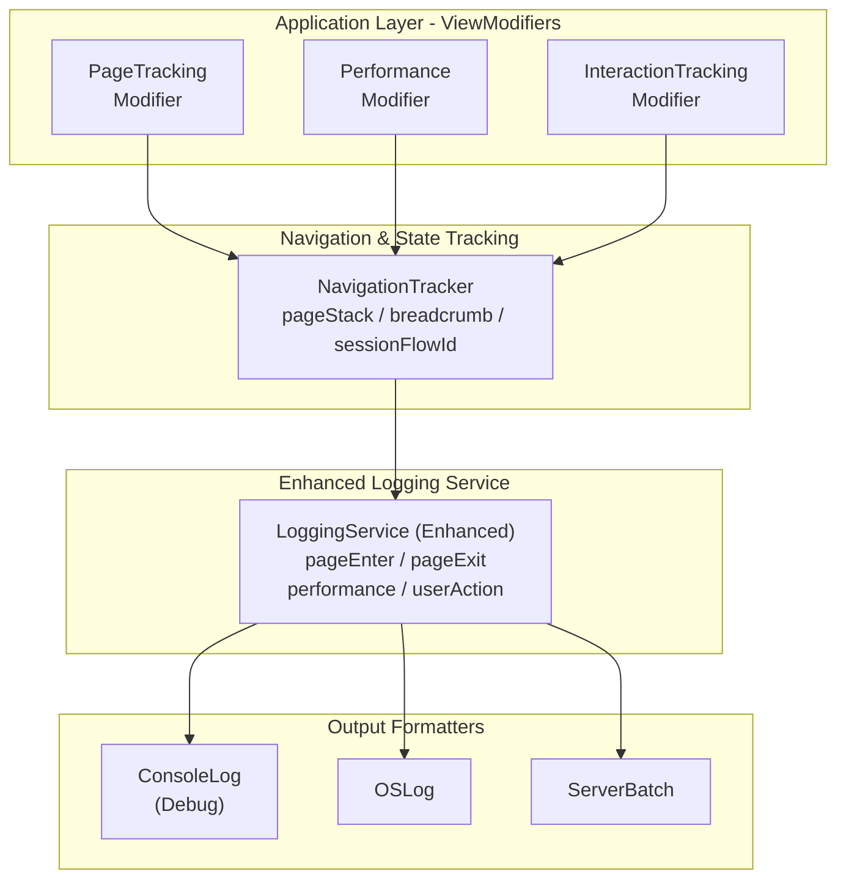

# iOS 客户端日志丰富度增强设计方案

## 1. 现状分析

### 1.1 现有日志系统

当前项目已有 `LoggingService` 日志服务，具备：
- **双层日志架构**：Legacy日志 + RuntimeLogEntry
- **日志级别**：DEBUG, INFO, WARNING, ERROR, FATAL
- **日志分类**：14个类别 (Auth, Books, Reading, AI, Vocabulary 等)
- **输出渠道**：OSLog (Xcode Console) + 服务器批量上传

### 1.2 现有问题

| 问题 | 描述 |
|------|------|
| 页面追踪缺失 | 没有统一的页面进入/退出日志 |
| 生命周期盲区 | 视图的 onAppear/onDisappear 没有自动记录 |
| 性能数据缺失 | 无页面加载耗时、渲染耗时等指标 |
| 导航链路不清晰 | 无法追踪用户的页面跳转路径 |
| 日志格式不统一 | 各模块日志格式不一致，难以检索 |

---

## 2. 设计目标

1. **页面级自动日志**：每个页面进入/退出时自动输出详细日志
2. **性能追踪**：记录页面加载耗时、首屏渲染时间
3. **导航链路追踪**：完整的用户页面跳转路径
4. **统一日志格式**：结构化、可检索的日志输出
5. **零侵入式**：通过 ViewModifier 实现，不需要大量修改现有代码
6. **开发环境优化**：DEBUG 模式输出更详细，Xcode Console 易读

---

## 3. 架构设计

### 3.1 整体架构



### 3.2 新增日志分类

在现有 `LogCategory` 基础上新增：

---

## 4. 核心组件设计

### 4.1 NavigationTracker - 导航追踪器

**职责**：维护页面栈，追踪导航路径

**日志输出示例**：
```
[Navigation] 📍 Page Stack: Library → BookDetail → ReaderView
[Navigation] Session Flow: abc-123-def
```

### 4.2 PageTrackingModifier - 页面追踪修饰符

**职责**：自动在页面 onAppear/onDisappear 时输出日志

**日志输出示例**：
```
════════════════════════════════════════════════════════════════
[Lifecycle] ▶️ PAGE ENTER: BookDetailView
├─ Timestamp: 2025-01-15 14:32:05.123
├─ Source: LibraryView
├─ Session: abc-123-def
├─ Breadcrumb: Library → BookDetail
├─ Metadata:
│   └─ bookId: "978-0-14-028329-7"
│   └─ bookTitle: "1984"
════════════════════════════════════════════════════════════════

════════════════════════════════════════════════════════════════
[Lifecycle] ⏹️ PAGE EXIT: BookDetailView
├─ Duration: 12.34s
├─ Next: ReaderView
════════════════════════════════════════════════════════════════
```

### 4.3 PerformanceTrackingModifier - 性能追踪修饰符

**职责**：追踪页面加载和渲染性能

**日志输出示例**：
```
[Performance] ⏱️ RENDER METRICS: ReaderView
├─ Init → FirstRender: 0.234s
├─ Memory: 45.2 MB
├─ Thread: main
```

### 4.4 LoggingService 扩展

在现有 LoggingService 基础上扩展：

### 4.5 Debug Console 格式化输出

为 DEBUG 模式设计的格式化输出：

---

## 5. 网络请求日志增强

### 5.1 现有网络日志问题

当前 `APIClient` 的日志：
- 仅输出简单文本：`Request started: GET /endpoint`
- 缺少请求/响应详情（Body、Headers）
- 没有结构化格式，难以扫描
- 错误信息不够详细

### 5.3 APIClient 集成改动

修改 `APIClient.swift` 中的 `request` 方法：

### 5.4 网络日志输出示例

#### 成功请求

```
────────────────────────────────────────────────────────────────
[Network] 📤 REQUEST
├─ GET /books/978-0-14-028329-7
├─ CorrelationId: a1b2c3d4...
├─ Timestamp: 14:32:05.123
├─ Headers:
│   └─ Accept-Language: zh-Hans
│   └─ X-Platform: ios
────────────────────────────────────────────────────────────────

────────────────────────────────────────────────────────────────
[Network] 📥 RESPONSE ✅
├─ GET /books/978-0-14-028329-7
├─ Status: 200 OK
├─ Duration: 234ms
├─ Size: 4.2 KB
├─ CorrelationId: a1b2c3d4...
├─ Body (preview):
│   {
│     "id": "978-0-14-028329-7",
│     "title": "1984",
│     "author": "George Orwell",
│     "coverUrl": "https://...",
│     ...
│   }
────────────────────────────────────────────────────────────────
```

#### POST 请求

```
────────────────────────────────────────────────────────────────
[Network] 📤 REQUEST
├─ POST /reading/progress
├─ CorrelationId: e5f6g7h8...
├─ Timestamp: 14:35:12.456
├─ Headers:
│   └─ Content-Type: application/json
│   └─ Accept-Language: zh-Hans
├─ Body:
│   {
│     "bookId": "978-0-14-028329-7",
│     "chapterIndex": 5,
│     "progress": 0.45,
│     "timestamp": "2025-01-15T14:35:12Z"
│   }
────────────────────────────────────────────────────────────────

────────────────────────────────────────────────────────────────
[Network] 📥 RESPONSE ✅
├─ POST /reading/progress
├─ Status: 200 OK
├─ Duration: 156ms
├─ Size: 128 B
├─ CorrelationId: e5f6g7h8...
├─ Body (preview):
│   {
│     "success": true,
│     "syncedAt": "2025-01-15T14:35:12Z"
│   }
────────────────────────────────────────────────────────────────
```

#### 错误请求

```
════════════════════════════════════════════════════════════════
[Network] ❌ ERROR
├─ GET /books/invalid-id
├─ Status: 404
├─ Duration: 89ms
├─ Error Type: APIError
├─ Message: Book not found
├─ CorrelationId: i9j0k1l2...
├─ Response Body:
│   {
│     "error": "Not Found",
│     "message": "Book with ID 'invalid-id' does not exist",
│     "statusCode": 404
│   }
════════════════════════════════════════════════════════════════
```

#### 网络超时

```
════════════════════════════════════════════════════════════════
[Network] ❌ ERROR
├─ GET /ai/generate-summary
├─ Status: N/A
├─ Duration: 30.00s
├─ Error Type: URLError
├─ Message: The request timed out.
├─ CorrelationId: m3n4o5p6...
════════════════════════════════════════════════════════════════
```

### 5.6 实现文件

| 文件 | 类型 | 描述 |
|------|------|------|
| `Core/Network/NetworkLogger.swift` | 新增 | 网络日志工具类 |
| `Core/Network/APIClient.swift` | 修改 | 集成 NetworkLogger |

---

## 6. 使用方式

### 6.2 全局应用（批量修改）

在关键页面入口统一添加：

---

## 7. 日志输出示例

### 7.1 完整的页面切换日志

当用户从 Library 进入 BookDetail 再进入 Reader 时的 Xcode Console 输出：

```
════════════════════════════════════════════════════════════════
[Lifecycle] ▶️ PAGE ENTER: LibraryView
├─ Timestamp: 2025-01-15T14:30:00Z
├─ Source: App Launch
├─ Session: abc12345...
├─ Breadcrumb: Library
════════════════════════════════════════════════════════════════
[Performance] ⏱️ LibraryView
├─ Init→Render: 0.156s
├─ Memory: 42.3 MB

[Network] 📡 GET /api/v1/books/library → 200 (234ms)

════════════════════════════════════════════════════════════════
[Lifecycle] ⏹️ PAGE EXIT: LibraryView
├─ Duration: 8.45s
════════════════════════════════════════════════════════════════

════════════════════════════════════════════════════════════════
[Lifecycle] ▶️ PAGE ENTER: BookDetailView
├─ Timestamp: 2025-01-15T14:30:08Z
├─ Source: LibraryView
├─ Session: abc12345...
├─ Breadcrumb: Library → BookDetail
├─ Metadata:
│   └─ bookId: "978-0-14-028329-7"
│   └─ bookTitle: "1984"
════════════════════════════════════════════════════════════════
[Performance] ⏱️ BookDetailView
├─ Init→Render: 0.089s
├─ Memory: 44.1 MB

[Interaction] 👆 tap → StartReadingButton @ BookDetailView

════════════════════════════════════════════════════════════════
[Lifecycle] ⏹️ PAGE EXIT: BookDetailView
├─ Duration: 3.21s
════════════════════════════════════════════════════════════════

════════════════════════════════════════════════════════════════
[Lifecycle] ▶️ PAGE ENTER: ReaderView
├─ Timestamp: 2025-01-15T14:30:11Z
├─ Source: BookDetailView
├─ Session: abc12345...
├─ Breadcrumb: Library → BookDetail → Reader
├─ Metadata:
│   └─ bookId: "978-0-14-028329-7"
│   └─ chapter: "1"
│   └─ readingMode: "enhanced"
════════════════════════════════════════════════════════════════
[Performance] ⏱️ ReaderView
├─ Init→Render: 0.312s
├─ Memory: 52.7 MB
```

### 7.2 App 启动日志

```
════════════════════════════════════════════════════════════════
[App] 🚀 APPLICATION LAUNCH
├─ Version: 1.2.3 (456)
├─ Environment: debugging
├─ Device: iPhone 15 Pro (iOS 18.0)
├─ Session: abc12345-def6-7890-ghij-klmnopqrstuv
├─ Timestamp: 2025-01-15T14:30:00Z
════════════════════════════════════════════════════════════════

[Cache] Image cache configured: 50MB memory, 200MB disk, 7-day TTL
[Auth] Checking authentication status...
[Auth] User authenticated: user@example.com
[Network] 📡 GET /api/v1/config → 200 (89ms)

════════════════════════════════════════════════════════════════
[Lifecycle] ▶️ PAGE ENTER: MainTabView
├─ Timestamp: 2025-01-15T14:30:00Z
├─ Source: App Launch
├─ Session: abc12345...
├─ Breadcrumb: MainTab
════════════════════════════════════════════════════════════════
```

---

## 8. 实现文件清单

| 文件 | 类型 | 描述 |
|------|------|------|
| `Core/Services/NavigationTracker.swift` | 新增 | 导航追踪器 |
| `Core/UI/Modifiers/PageTrackingModifier.swift` | 新增 | 页面追踪修饰符 |
| `Core/UI/Modifiers/PerformanceTrackingModifier.swift` | 新增 | 性能追踪修饰符 |
| `Core/Services/LoggingService+PageLifecycle.swift` | 新增 | 日志服务扩展 |
| `Core/Services/LoggingService+DebugFormatter.swift` | 新增 | Debug格式化输出 |
| `Core/Network/NetworkLogger.swift` | 新增 | 网络请求日志工具 |
| `Core/Network/APIClient.swift` | 修改 | 集成 NetworkLogger |
| `Core/Models/Log.swift` | 修改 | 新增 LogCategory |

---

## 9. 配置选项

---

## 10. 实施步骤

### Phase 1：基础设施（核心）
1. 创建 `NavigationTracker`
2. 扩展 `LogCategory`
3. 实现 `LoggingService` 页面生命周期扩展
4. 实现 Debug 格式化输出

### Phase 2：ViewModifier
1. 实现 `PageTrackingModifier`
2. 实现 `PerformanceTrackingModifier`
3. 添加 View extension 便捷方法

### Phase 3：集成到现有页面
1. 在 `MainTabView` 添加追踪
2. 在核心功能页面添加追踪（Reader、BookDetail、Auth 等）
3. 在二级页面逐步添加

### Phase 4：增强功能
1. 用户交互追踪
2. 网络请求日志增强
3. 错误追踪增强

---

## 11. 注意事项

1. **性能影响**：日志操作应尽量轻量，避免在主线程阻塞
2. **隐私合规**：避免记录敏感用户数据（如密码、token）
3. **日志清理**：DEBUG 日志不应发送到服务器
4. **内存控制**：NavigationTracker 的 pageStack 应有上限（建议 50）

---

## 12. 预期效果

实施后的改进：

| 指标 | 改进前 | 改进后 |
|------|--------|--------|
| 页面进入日志 | 无 | 每个页面自动记录 |
| 页面停留时间 | 无 | 自动计算并记录 |
| 导航路径 | 无 | 完整 Breadcrumb |
| 性能指标 | 无 | Init→Render 耗时 |
| 日志可读性 | 一般 | 结构化格式，易于扫描 |
| 问题定位效率 | 低 | 可快速定位用户操作路径 |

---

请 Review 这份设计文档，如有任何问题或需要调整的地方，请告诉我。确认后我将开始实现。
