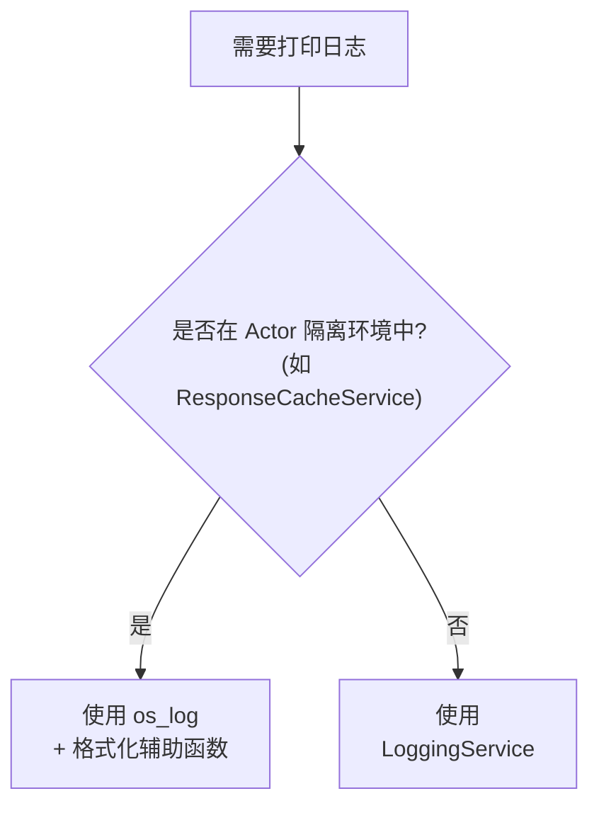

# iOS 日志规范

## 统一日志格式

```
[Readmigo][Category][LEVEL] emoji message
```

### 格式说明

| 组成部分 | 说明 | 示例 |
|---------|------|------|
| `[Readmigo]` | 固定前缀，便于在 Console.app 中过滤 | `[Readmigo]` |
| `[Category]` | 日志类别，对应功能模块 | `[Books]`, `[Cache]`, `[Auth]` |
| `[LEVEL]` | 日志级别 | `[DEBUG]`, `[INFO]`, `[WARNING]`, `[ERROR]` |
| emoji | 视觉标识符 | 🔍 ℹ️ ⚠️ ❌ 💀 |
| message | 日志内容 | 具体的日志消息 |

## 日志级别

| 级别 | Emoji | OSLogType | 使用场景 |
|------|-------|-----------|---------|
| DEBUG | 🔍 | `.debug` | 调试信息，仅开发时关注 |
| INFO | ℹ️ | `.info` | 正常操作信息，如缓存加载成功 |
| WARNING | ⚠️ | `.default` | 警告但不影响功能 |
| ERROR | ❌ | `.error` | 错误，需要关注 |
| FATAL | 💀 | `.fault` | 严重错误，应用可能崩溃 |

## 日志类别

| Category | 中文 | 使用场景 |
|----------|------|---------|
| Auth | 认证 | 登录、登出、Token 相关 |
| Books | 书籍 | 书城、书架、书籍详情 |
| Reading | 阅读 | 阅读器、进度、设置 |
| AI | AI | AI 对话、翻译、总结 |
| Agora | 城邦 | 帖子、评论、点赞 |
| Cache | 缓存 | 响应缓存、持久化缓存 |
| Network | 网络 | API 请求、响应 |
| Audio | 音频 | TTS、音频播放 |
| Payment | 支付 | IAP、订阅 |
| Sync | 同步 | 数据同步 |
| Navigation | 导航 | 页面跳转 |
| Performance | 性能 | 性能监控 |
| Lifecycle | 生命周期 | App/页面生命周期 |
| UserAction | 用户操作 | 按钮点击、手势 |
| Error | 错误 | 通用错误 |
| Debug | 调试 | 开发调试 |
| Other | 其他 | 未分类 |

## 日志打印方式选择



## Console.app 过滤技巧

### 常用过滤条件

| 过滤目标 | 搜索词 |
|---------|--------|
| 所有 Readmigo 日志 | `[Readmigo]` |
| 特定模块日志 | `[Readmigo][Books]` 或 `[Readmigo][Cache]` |
| 特定级别日志 | `[ERROR]` 或 `[WARNING]` |
| 模块+级别组合 | `[Readmigo][Cache][INFO]` |

### 过滤流程

```
┌─────────────────────────────────────────────────────────────┐
│                     Console.app                              │
├─────────────────────────────────────────────────────────────┤
│  1. 选择连接的 iOS 设备                                      │
│  2. 在搜索栏输入过滤条件                                     │
│  3. 可添加多个过滤条件组合使用                               │
└─────────────────────────────────────────────────────────────┘
```

## 日志输出示例

| 场景 | 日志输出 |
|------|---------|
| 缓存加载成功 | `[Readmigo][Cache][INFO] ✅ Loaded 5 cache entries from disk` |
| 缓存未命中 | `[Readmigo][Cache][DEBUG] 🔍 Cache miss: discover_tabs` |
| 网络请求失败 | `[Readmigo][Network][ERROR] ❌ Request failed: timeout` |
| 书籍加载 | `[Readmigo][Books][INFO] ℹ️ Loaded 20 books from cache` |

## 注意事项

1. **Actor 隔离**: `ResponseCacheService` 是 actor，不能直接调用 `@MainActor` 的 `LoggingService`，需使用 `os_log` 配合格式化辅助函数
2. **公开日志**: 使用 `%{public}@` 确保日志内容在 Console.app 中可见
3. **组件标识**: 使用 `component` 参数标识具体的 ViewModel 或 Manager
4. **避免敏感信息**: 不要在日志中打印用户隐私数据或 Token

---

## 各模块日志点规范

### 网络层 (APIClient)
```
位置: ios/Readmigo/Core/Network/APIClient.swift
```
| 操作 | 日志级别 | 日志内容 |
|------|----------|----------|
| 请求开始 | DEBUG | `[API] Request: {method} {endpoint}` |
| 请求成功 | DEBUG | `[API] Response: {method} {endpoint} status={code} time={ms}ms` |
| 请求失败 | ERROR | `[API] Failed: {method} {endpoint} error={msg}` |
| Token 刷新 | INFO | `[API] Token refreshed` |
| 401 重试 | WARNING | `[API] Retrying after 401: {endpoint}` |

### 认证流程 (AuthManager)
```
位置: ios/Readmigo/Features/Auth/
```
| 操作 | 日志级别 | 日志内容 |
|------|----------|----------|
| Apple 登录开始 | INFO | `[Auth] Apple Sign In started` |
| 登录成功 | INFO | `[Auth] Login success: userId={id}` |
| 登录失败 | ERROR | `[Auth] Login failed: method={method}, error={msg}` |
| 登出 | INFO | `[Auth] User logged out` |
| 自动登录 | INFO | `[Auth] Auto login: userId={id}` |

### 书库管理 (LibraryManager)
```
位置: ios/Readmigo/Features/Library/
```
| 操作 | 日志级别 | 日志内容 |
|------|----------|----------|
| 刷新书库 | DEBUG | `[Library] Refreshing: tab={tab}` |
| 获取书籍列表 | DEBUG | `[Library] Fetched books: count={count}` |
| 添加到书库 | INFO | `[Library] Book added: bookId={id}` |
| 从书库移除 | INFO | `[Library] Book removed: bookId={id}` |
| 缓存命中 | DEBUG | `[Library] Cache hit: key={key}` |

### 阅读器 (ReaderViewModel)
```
位置: ios/Readmigo/Features/Reader/
```
| 操作 | 日志级别 | 日志内容 |
|------|----------|----------|
| 打开书籍 | INFO | `[Reader] Open book: bookId={id}, title={title}` |
| 加载章节 | DEBUG | `[Reader] Loading chapter: {current}/{total}` |
| 章节加载完成 | DEBUG | `[Reader] Chapter loaded: chapterNum={num}, paragraphs={count}` |
| 切换阅读模式 | INFO | `[Reader] Mode changed: {mode}` |
| 保存进度 | DEBUG | `[Reader] Progress saved: {progress}%` |
| 离线内容使用 | INFO | `[Reader] Using offline content: bookId={id}` |
| TTS 播放 | DEBUG | `[Reader] TTS: action={play/pause/stop}` |

### 词汇学习 (VocabularyManager / LearningViewModel)
```
位置: ios/Readmigo/Features/Learning/
```
| 操作 | 日志级别 | 日志内容 |
|------|----------|----------|
| 查询单词 | DEBUG | `[Vocabulary] Lookup: word={word}` |
| 保存单词 | INFO | `[Vocabulary] Saved: word={word}` |
| 开始复习 | INFO | `[Learning] Review started: wordCount={count}` |
| 复习完成 | INFO | `[Learning] Review completed: correct={n}/{total}` |

### AI 功能 (AIService)
```
位置: ios/Readmigo/Core/Services/ 或 Features/Reader/
```
| 操作 | 日志级别 | 日志内容 |
|------|----------|----------|
| 单词解释请求 | INFO | `[AI] Word explain request: word={word}` |
| 句子简化请求 | INFO | `[AI] Sentence simplify request` |
| 段落翻译请求 | INFO | `[AI] Paragraph translate request` |
| AI 响应成功 | DEBUG | `[AI] Response received: type={type}, time={ms}ms` |
| AI 请求失败 | ERROR | `[AI] Request failed: type={type}, error={msg}` |

### 社区功能 (AgoraManager)
```
位置: ios/Readmigo/Features/Agora/
```
| 操作 | 日志级别 | 日志内容 |
|------|----------|----------|
| 加载帖子列表 | DEBUG | `[Agora] Loading posts: type={type}` |
| 发布帖子 | INFO | `[Agora] Post created` |
| 发表评论 | INFO | `[Agora] Comment added: postId={id}` |
| 点赞 | DEBUG | `[Agora] Like toggled: targetId={id}` |

### 订阅管理 (SubscriptionManager)
```
位置: ios/Readmigo/Features/Subscriptions/
```
| 操作 | 日志级别 | 日志内容 |
|------|----------|----------|
| 检查订阅状态 | DEBUG | `[Subscription] Checking status` |
| 发起购买 | INFO | `[Subscription] Purchase started: productId={id}` |
| 购买成功 | INFO | `[Subscription] Purchase success: productId={id}` |
| 购买失败 | ERROR | `[Subscription] Purchase failed: error={msg}` |
| 恢复购买 | INFO | `[Subscription] Restore started` |

### 离线管理 (OfflineManager)
```
位置: ios/Readmigo/Features/Offline/
```
| 操作 | 日志级别 | 日志内容 |
|------|----------|----------|
| 下载开始 | INFO | `[Offline] Download started: bookId={id}` |
| 下载进度 | DEBUG | `[Offline] Download progress: bookId={id}, {pct}%` |
| 下载完成 | INFO | `[Offline] Download completed: bookId={id}` |
| 下载失败 | ERROR | `[Offline] Download failed: bookId={id}, error={msg}` |
| 删除离线内容 | INFO | `[Offline] Content deleted: bookId={id}` |

### 缓存管理 (CacheManager)
```
位置: ios/Readmigo/Core/Services/CacheManager.swift
```
| 操作 | 日志级别 | 日志内容 |
|------|----------|----------|
| 缓存命中 | DEBUG | `[Cache] Hit: key={key}` |
| 缓存未命中 | DEBUG | `[Cache] Miss: key={key}` |
| 缓存写入 | DEBUG | `[Cache] Write: key={key}, size={bytes}` |
| 缓存清理 | INFO | `[Cache] Cleared: type={type}` |
| 预加载 | DEBUG | `[Cache] Prefetch: bookId={id}` |

---

## 云端日志上报

### 上报策略

| 配置项 | 值 | 说明 |
|--------|-----|------|
| 批量大小 | 50 条 | 达到后立即上报 |
| 上报间隔 | 30 秒 | 定时上报 |
| 本地缓存 | 500 条 | 超过后丢弃最旧的 DEBUG 日志 |
| 离线缓存 | UserDefaults | 网络恢复后上报 |
| 日志级别过滤 | DEBUG+ (所有) | 全部级别均上报 |

### 请求链路追踪

每次 API 请求生成 `X-Correlation-ID` header，用于串联前后端日志：

