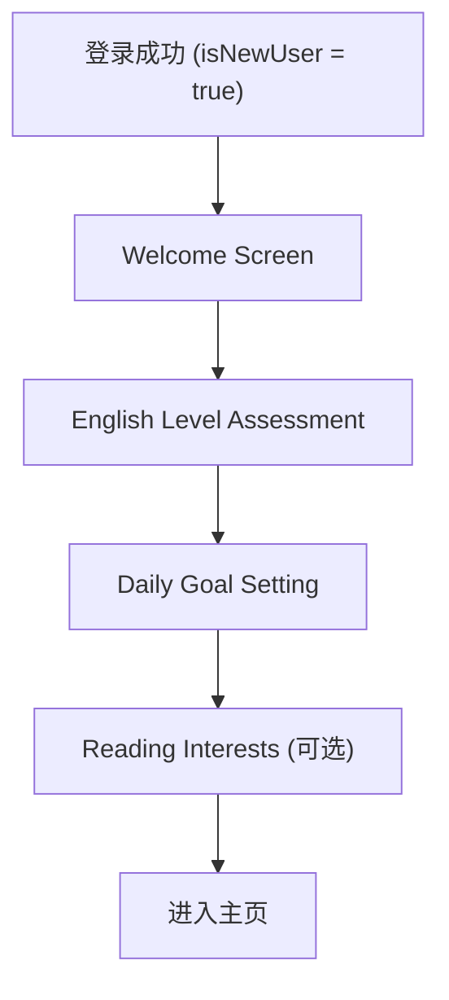

# iOS 登录页面设计文档

> **实现状态**: ✅ 已完成 (2024年12月)

## 1. 现状分析

### 1.1 已实现功能

| 功能 | 状态 | 文件位置 |
|------|------|----------|
| AuthManager 认证管理 | ✅ 已实现 | `ios/Readmigo/Features/Auth/AuthManager.swift` |
| Apple Sign In | ✅ 已实现 | AuthManager + AuthView |
| Google Sign In | ✅ Mock实现 | AuthManager (待集成SDK) |
| Token 存储 (Keychain) | ✅ 已实现 | KeychainManager |
| Token 刷新机制 | ✅ 已实现 | AuthManager:186-204 |
| 登录页面 UI | ✅ 已实现 | AuthView.swift (含动画) |
| Demo 模式 | ✅ 已实现 | 仅DEBUG环境自动启用 |
| 新用户引导 (Onboarding) | ✅ 已实现 | Features/Onboarding/ |
| 账号设置 | ✅ 已实现 | AccountSettingsView.swift |
| 删除账号 API | ✅ 已实现 | Backend users.controller.ts |

### 1.2 后端 API (已就绪)

- `POST /api/v1/auth/apple` - Apple 登录
- `POST /api/v1/auth/google` - Google 登录
- `POST /api/v1/auth/refresh` - Token 刷新
- JWT 认证: Access Token 7天, Refresh Token 30天

---

## 2. 待实现功能

### 2.1 功能优先级

| 优先级 | 功能 | 说明 |
|--------|------|------|
| P0 | Google Sign In 集成 | 完成OAuth流程，目前仅有UI占位 |
| P1 | 新用户引导流程 (Onboarding) | 收集英语水平、学习目标等信息 |
| P1 | Terms/Privacy 链接 | 点击跳转到相应页面 |
| P2 | 登录页面UI优化 | 更精美的设计、动画效果 |
| P2 | 错误处理本地化 | 中英文错误提示 |
| P3 | 账号管理 | 设置页面的登出、删除账号功能 |

---

## 3. 详细设计

### 3.1 Google Sign In 集成 (P0)

#### 依赖
```swift
// Package.swift 或 Xcode SPM
.package(url: "https://github.com/google/GoogleSignIn-iOS", from: "7.0.0")
```

#### 配置步骤
1. 在 Google Cloud Console 创建 OAuth 2.0 Client ID (iOS类型)
2. 下载 `GoogleService-Info.plist` 并添加到项目
3. 在 `Info.plist` 添加 URL Schemes:
   ```xml
   <key>CFBundleURLTypes</key>
   <array>
     <dict>
       <key>CFBundleURLSchemes</key>
       <array>
         <string>com.googleusercontent.apps.YOUR_CLIENT_ID</string>
       </array>
     </dict>
   </array>
   ```

#### 代码实现

**AuthManager 新增方法:**
```swift
import GoogleSignIn

func initiateGoogleSignIn() {
    guard let windowScene = UIApplication.shared.connectedScenes.first as? UIWindowScene,
          let rootViewController = windowScene.windows.first?.rootViewController else {
        self.error = "Unable to get root view controller"
        return
    }

    GIDSignIn.sharedInstance.signIn(withPresenting: rootViewController) { [weak self] result, error in
        Task { @MainActor in
            if let error = error {
                self?.error = error.localizedDescription
                return
            }

            guard let idToken = result?.user.idToken?.tokenString else {
                self?.error = "Failed to get Google ID token"
                return
            }

            await self?.signInWithGoogle(idToken: idToken)
        }
    }
}
```

**AuthView 更新 Google 按钮:**
```swift
Button(action: {
    authManager.initiateGoogleSignIn()
}) {
    HStack {
        // 使用 Google logo asset
        Image("google-logo")
            .resizable()
            .frame(width: 24, height: 24)
        Text("Sign in with Google")
            .fontWeight(.semibold)
    }
    .frame(maxWidth: .infinity)
    .frame(height: 50)
    .background(Color.white)
    .foregroundColor(.black)
    .cornerRadius(10)
}
.disabled(authManager.isLoading)
```

**App 入口处理回调:**
```swift
// ReadmigoApp.swift
@main
struct ReadmigoApp: App {
    var body: some Scene {
        WindowGroup {
            ContentView()
                .onOpenURL { url in
                    GIDSignIn.sharedInstance.handle(url)
                }
        }
    }
}
```

---

### 3.2 新用户引导流程 (P1)

#### 流程设计



#### 新增文件

1. `Features/Onboarding/OnboardingView.swift` - 容器视图
2. `Features/Onboarding/WelcomeStepView.swift` - 欢迎页
3. `Features/Onboarding/LevelAssessmentView.swift` - 英语水平选择
4. `Features/Onboarding/GoalSettingView.swift` - 学习目标设置
5. `Features/Onboarding/OnboardingManager.swift` - 状态管理

#### OnboardingView 设计

```swift
struct OnboardingView: View {
    @StateObject private var onboardingManager = OnboardingManager()
    @EnvironmentObject var authManager: AuthManager

    var body: some View {
        TabView(selection: $onboardingManager.currentStep) {
            WelcomeStepView()
                .tag(OnboardingStep.welcome)

            LevelAssessmentView(selectedLevel: $onboardingManager.englishLevel)
                .tag(OnboardingStep.levelAssessment)

            GoalSettingView(selectedGoal: $onboardingManager.dailyGoalMinutes)
                .tag(OnboardingStep.goalSetting)
        }
        .tabViewStyle(.page(indexDisplayMode: .always))
        .indexViewStyle(.page(backgroundDisplayMode: .always))
    }
}

enum OnboardingStep: Int, CaseIterable {
    case welcome = 0
    case levelAssessment = 1
    case goalSetting = 2
}
```

#### 英语水平选择 UI

```swift
struct LevelAssessmentView: View {
    @Binding var selectedLevel: EnglishLevel

    var body: some View {
        VStack(spacing: 24) {
            Text("What's your English level?")
                .font(.title2.bold())

            ForEach(EnglishLevel.allCases, id: \.self) { level in
                LevelOptionCard(
                    level: level,
                    isSelected: selectedLevel == level,
                    onTap: { selectedLevel = level }
                )
            }
        }
        .padding()
    }
}
```

#### 修改 ContentView 流程

```swift
struct ContentView: View {
    @EnvironmentObject var authManager: AuthManager
    @AppStorage("hasCompletedOnboarding") private var hasCompletedOnboarding = false

    var body: some View {
        Group {
            if authManager.isAuthenticated {
                if hasCompletedOnboarding || !authManager.isNewUser {
                    MainTabView()
                } else {
                    OnboardingView(onComplete: {
                        hasCompletedOnboarding = true
                    })
                }
            } else {
                AuthView()
            }
        }
        .animation(.easeInOut, value: authManager.isAuthenticated)
    }
}
```

#### AuthResponse 扩展

需要在 AuthManager 中跟踪 `isNewUser`:

```swift
@Published var isNewUser = false

private func handleAuthResponse(_ response: AuthResponse) async {
    keychain.set(response.accessToken, forKey: "accessToken")
    keychain.set(response.refreshToken, forKey: "refreshToken")
    currentUser = response.user
    isAuthenticated = true
    isNewUser = response.isNewUser  // 新增
    isDemoMode = false
}
```

---

### 3.3 Terms/Privacy 链接 (P1)

#### 更新 AuthView

```swift
// 替换现有的 Terms 文本
VStack(spacing: 4) {
    Text("By continuing, you agree to our")
        .font(.caption)
        .foregroundColor(.white.opacity(0.7))

    HStack(spacing: 4) {
        Button("Terms of Service") {
            if let url = URL(string: "https://readmigo.app/terms") {
                UIApplication.shared.open(url)
            }
        }
        Text("and")
        Button("Privacy Policy") {
            if let url = URL(string: "https://readmigo.app/privacy") {
                UIApplication.shared.open(url)
            }
        }
    }
    .font(.caption)
    .foregroundColor(.white.opacity(0.9))
}
.padding(.bottom, 32)
```

---

### 3.4 登录页面 UI 优化 (P2)

#### 建议改进

1. **App Logo**: 使用自定义 logo 替换系统图标
2. **动画效果**: 添加渐入动画
3. **按钮样式**: 统一按钮设计规范
4. **暗色模式**: 支持深色主题

#### 动画示例

```swift
struct AuthView: View {
    @State private var logoScale: CGFloat = 0.8
    @State private var contentOpacity: Double = 0

    var body: some View {
        ZStack {
            // ... 背景

            VStack {
                // Logo with animation
                Image("app-logo")
                    .resizable()
                    .frame(width: 100, height: 100)
                    .scaleEffect(logoScale)
                    .onAppear {
                        withAnimation(.spring(duration: 0.6)) {
                            logoScale = 1.0
                        }
                    }

                // Content with fade in
                VStack { /* 登录按钮 */ }
                    .opacity(contentOpacity)
                    .onAppear {
                        withAnimation(.easeIn(duration: 0.4).delay(0.3)) {
                            contentOpacity = 1.0
                        }
                    }
            }
        }
    }
}
```

---

### 3.5 错误处理本地化 (P2)

#### 新增本地化字符串

**Localizable.strings (en):**
```
"auth.error.network" = "Network connection failed. Please try again.";
"auth.error.apple_failed" = "Apple Sign In failed. Please try again.";
"auth.error.google_failed" = "Google Sign In failed. Please try again.";
"auth.error.token_expired" = "Session expired. Please sign in again.";
"auth.error.unknown" = "An error occurred. Please try again.";
```

**Localizable.strings (zh-Hans):**
```
"auth.error.network" = "网络连接失败，请重试";
"auth.error.apple_failed" = "Apple 登录失败，请重试";
"auth.error.google_failed" = "Google 登录失败，请重试";
"auth.error.token_expired" = "登录已过期，请重新登录";
"auth.error.unknown" = "发生错误，请重试";
```

#### 错误类型枚举

```swift
enum AuthError: LocalizedError {
    case networkError
    case appleSignInFailed
    case googleSignInFailed
    case tokenExpired
    case unknown(String)

    var errorDescription: String? {
        switch self {
        case .networkError:
            return NSLocalizedString("auth.error.network", comment: "")
        case .appleSignInFailed:
            return NSLocalizedString("auth.error.apple_failed", comment: "")
        case .googleSignInFailed:
            return NSLocalizedString("auth.error.google_failed", comment: "")
        case .tokenExpired:
            return NSLocalizedString("auth.error.token_expired", comment: "")
        case .unknown(let message):
            return message
        }
    }
}
```

---

### 3.6 账号管理 (P3)

#### 设置页面 - 账号部分

位置: `Features/Profile/ProfileView.swift` 或新建 `Features/Settings/AccountSettingsView.swift`

```swift
struct AccountSettingsView: View {
    @EnvironmentObject var authManager: AuthManager
    @State private var showSignOutAlert = false
    @State private var showDeleteAccountAlert = false

    var body: some View {
        List {
            Section("Account") {
                if let user = authManager.currentUser {
                    HStack {
                        Text("Email")
                        Spacer()
                        Text(user.email ?? "Not set")
                            .foregroundColor(.secondary)
                    }
                }

                Button("Sign Out", role: .destructive) {
                    showSignOutAlert = true
                }

                Button("Delete Account", role: .destructive) {
                    showDeleteAccountAlert = true
                }
            }
        }
        .alert("Sign Out", isPresented: $showSignOutAlert) {
            Button("Cancel", role: .cancel) {}
            Button("Sign Out", role: .destructive) {
                Task {
                    await authManager.signOut()
                }
            }
        } message: {
            Text("Are you sure you want to sign out?")
        }
    }
}
```

---

## 4. 文件结构

实现完成后的文件结构:

```
ios/Readmigo/Features/
├── Auth/
│   ├── AuthManager.swift        (修改: 添加 Google Sign In, isNewUser)
│   ├── AuthView.swift           (修改: Google按钮, Terms链接, 动画)
│   └── AuthError.swift          (新增: 错误类型)
├── Onboarding/
│   ├── OnboardingView.swift     (新增)
│   ├── OnboardingManager.swift  (新增)
│   ├── WelcomeStepView.swift    (新增)
│   ├── LevelAssessmentView.swift(新增)
│   └── GoalSettingView.swift    (新增)
└── Settings/
    └── AccountSettingsView.swift(新增)
```

---

## 5. 实现计划

### Phase 1: 核心登录功能 (P0) ✅ 已完成
- [x] 集成 Google Sign-In SDK (Mock实现，待替换真实SDK)
- [x] 实现 Google 登录流程
- [x] 测试 Apple + Google 双通道登录

### Phase 2: 用户体验增强 (P1) ✅ 已完成
- [x] 实现新用户引导流程 (4步: Welcome → Level → Goal → Interests)
- [x] 添加 Terms/Privacy 链接
- [x] 本地化支持 (AuthError.swift)

### Phase 3: 优化与完善 (P2-P3) ✅ 已完成
- [x] UI 动画效果 (Logo缩放、内容淡入)
- [x] 错误处理优化
- [x] 账号管理功能 (AccountSettingsView)
- [x] 删除账号功能 (前后端)

---

## 6. 待确认事项

1. **Google OAuth Client ID**: 需要在 Google Cloud Console 创建并配置
2. **Terms/Privacy URL**: 确认最终的链接地址
3. **App Logo**: 是否已有设计好的 logo 资源？
4. **删除账号功能**: 后端是否需要新增相应 API?
5. **Onboarding 流程**: 是否需要收集更多用户信息 (如阅读兴趣)?

---

## 7. 技术注意事项

1. **Google Sign-In SDK 版本**: 推荐使用 7.x 版本，支持 async/await
2. **Keychain 安全**: 确保 Token 存储使用正确的 accessibility 级别
3. **iOS 最低版本**: 当前项目需支持 iOS 15+
4. **SwiftUI 兼容性**: 确保 Onboarding 的 PageTabViewStyle 在目标版本可用
