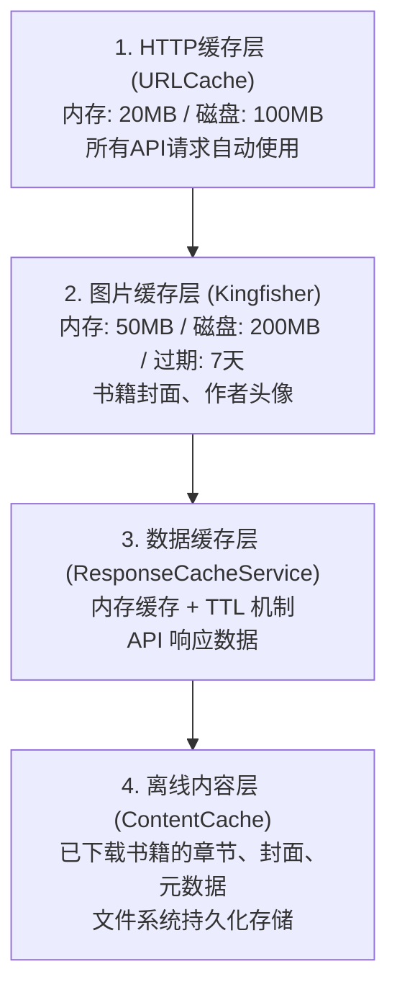
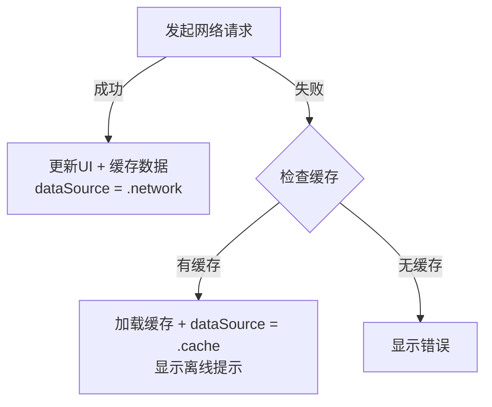
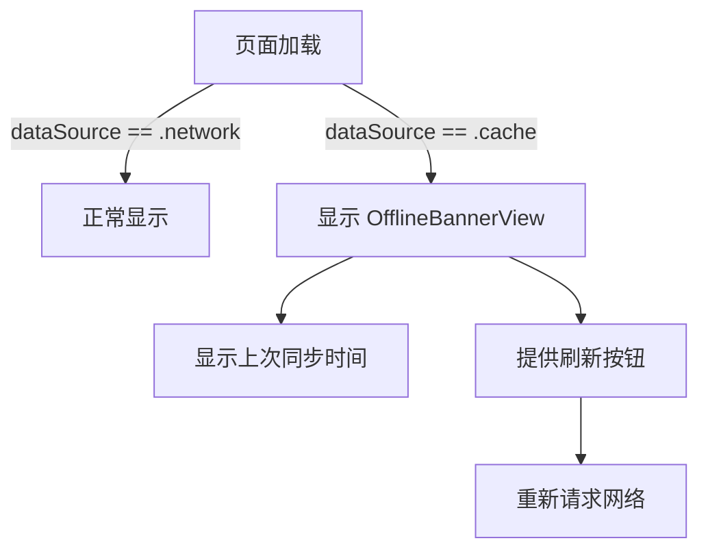

# iOS 离线功能支持文档

## 概述

本文档描述了 Readmigo iOS 客户端的离线功能实现方案，包括缓存架构、页面支持情况和实现细节。

## 缓存架构

### 四层缓存体系



### ResponseCacheService TTL 配置

| 缓存类型 | TTL | 说明 |
|---------|-----|------|
| bookList | 15分钟 | 书籍列表 |
| bookDetail | 1小时 | 书籍详情 |
| categories | 24小时 | 分类数据 |
| recommendations | 1小时 | 推荐内容 |
| userLibrary | 5分钟 | 用户书架 |
| author | 1小时 | 作者信息 |
| search | 5分钟 | 搜索结果 |

## 页面离线支持情况

### 已支持的页面

| 页面 | 缓存支持 | 离线提示 | 说明 |
|------|---------|---------|------|
| 发现页 | ✅ | - | 热门搜索、书籍列表、推荐内容 |
| 城邦 | ✅ | ✅ | 帖子列表自动缓存，离线时显示缓存数据 |
| 书籍详情页 | ✅ | ✅ | 书籍详情自动缓存 |
| 作者个人主页 | ✅ | ✅ | 作者详情和相关作者自动缓存 |

### 图片缓存

| 类型 | 缓存框架 | 配置 |
|------|---------|------|
| 书籍封面 | Kingfisher | 50MB内存 + 200MB磁盘，7天过期 |
| 作者头像 | Kingfisher | 同上（已从 AsyncImage 迁移） |

## 实现细节

### 1. OfflineBannerView - 离线提示组件

位置: `Core/UI/Components/OfflineBannerView.swift`

用于在页面顶部显示离线状态提示，包含：
- 离线状态图标和文案
- 上次同步时间
- 刷新按钮

使用示例：
```swift
if dataSource == .cache {
    OfflineBannerView(lastSyncTime: lastSyncTime) {
        Task {
            await refreshData()
        }
    }
}
```

### 2. ResponseCacheService 扩展

位置: `Core/Services/ResponseCacheService.swift`

新增功能：
- `fetchWithCache()` - 网络优先，失败时自动回退到缓存
- `getOrFetch()` - 缓存优先，过期时从网络获取
- `hasValidCache()` - 检查有效缓存
- `getCachedResponse()` - 获取缓存元数据（用于显示同步时间）

新增缓存键：
- `agoraPostsKey(page:)` - 城邦帖子
- `popularSearchesKey()` - 热门搜索
- `searchSuggestionsKey(_:)` - 搜索建议
- `unifiedSearchKey(_:)` - 统一搜索
- `relatedAuthorsKey(_:)` - 相关作者

### 3. 数据源状态跟踪

各 Manager 新增属性：
```swift
@Published var dataSource: DataSourceType = .network
@Published var lastSyncTime: Date?

enum DataSourceType {
    case network
    case cache
}
```

### 4. 国际化字符串

新增 key（支持 en/zh-Hans/zh-Hant）：
- `offline.viewingCached` - "正在查看缓存数据"
- `offline.lastSync` - "上次同步: %@"
- `offline.noConnection` - "无网络连接"
- `offline.cachedData` - "缓存数据"
- `offline.justNow` / `minutesAgo` / `hoursAgo` / `daysAgo` - 相对时间

## 缓存工作流程

### 网络请求流程



### 离线提示流程



## 修改的文件列表

### 核心服务
- `Core/Services/ResponseCacheService.swift` - 新增缓存键和便捷方法

### UI 组件
- `Core/UI/Components/OfflineBannerView.swift` - 新增离线提示组件

### 页面和 Manager
- `Features/Agora/AgoraManager.swift` - 添加帖子缓存支持
- `Features/Agora/AgoraView.swift` - 添加离线提示
- `Features/Authors/AuthorManager.swift` - 添加作者缓存支持
- `Features/Authors/AuthorProfileView.swift` - 添加离线提示
- `Features/Library/BookDetailView.swift` - 添加详情缓存和离线提示
- `Features/Library/LibraryManager.swift` - 添加书籍列表和推荐缓存
- `Features/Library/DiscoverView.swift` - 添加热门搜索缓存

### 图片缓存
- `Features/Agora/AuthorAvatarView.swift` - 从 AsyncImage 迁移到 Kingfisher

### 国际化
- `Localizable.xcstrings` - 新增离线相关字符串

## 后续优化建议

1. **持久化缓存** - ResponseCacheService 目前是内存缓存，可考虑添加磁盘持久化
2. **预加载机制** - 在网络良好时预加载常用内容
3. **缓存大小管理** - 添加缓存大小限制和清理策略
4. **同步状态指示** - 在设置页添加缓存状态和清理选项
5. **离线模式切换** - 添加手动切换离线模式的选项
