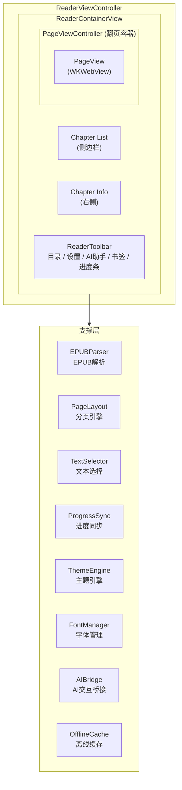

# iOS阅读器引擎

> ⭐ **核心模块** - 这是产品最重要的技术组件

### 15.1 阅读器架构总览

```mermaid
graph TD
    subgraph ReaderVC["ReaderViewController"]
        subgraph Container["ReaderContainerView"]
            ChapterList["Chapter List<br>(侧边栏)"]
            subgraph PageVC["PageViewController (翻页容器)"]
                PageView["PageView<br>(WKWebView)"]
            end
            ChapterInfo["Chapter Info<br>(右侧)"]
            Toolbar["ReaderToolbar<br>目录 / 设置 / AI助手 / 书签 / 进度条"]
        end
    end

    subgraph Support["支撑层"]
        EPUBParser["EPUBParser<br>EPUB解析"]
        PageLayout["PageLayout<br>分页引擎"]
        TextSelector["TextSelector<br>文本选择"]
        ProgressSync["ProgressSync<br>进度同步"]
        ThemeEngine["ThemeEngine<br>主题引擎"]
        FontManager["FontManager<br>字体管理"]
        AIBridge["AIBridge<br>AI交互桥接"]
        OfflineCache["OfflineCache<br>离线缓存"]
    end

    Container --> Support
```

---

