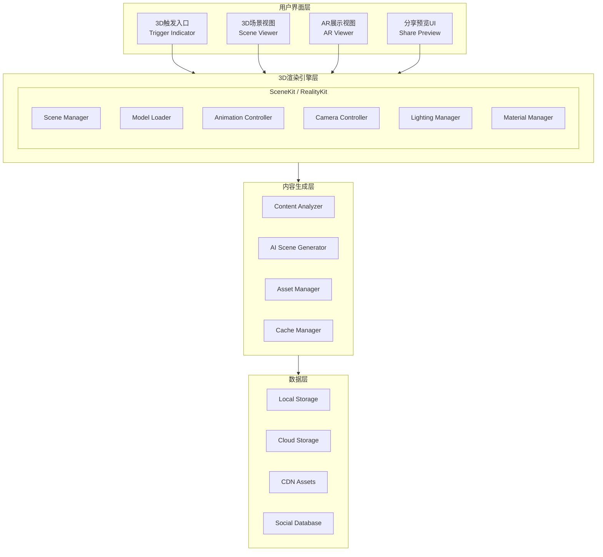

# 3D可视化系统设计文档

## 文档信息

| 项目 | 内容 |
|------|------|
| 功能模块 | 3D可视化系统 (3D Visualization System) |
| 文档版本 | 1.0 |
| 最后更新 | 2024年12月 |
| 关联文档 | advanced-reader-design.md, smart-annotation-system.md |

---

## 1. 功能概述

### 1.1 核心目标

将书籍中的文字描述转化为直观的3D可视化效果，帮助读者更好地理解复杂场景，包括战场地理、军事阵型、人物形象、环境描写等。

### 1.2 功能范围

```
┌─────────────────────────────────────────────────────────────────┐
│                      3D可视化系统                                │
├─────────────────────────────────────────────────────────────────┤
│                                                                 │
│  ┌──────────────────────────────────────────────────────────┐  │
│  │                      可视化类型                           │  │
│  │                                                          │  │
│  │  ┌─────────────┐  ┌─────────────┐  ┌─────────────┐      │  │
│  │  │  战场地形    │  │  军事阵型    │  │  人物形象    │      │  │
│  │  │             │  │             │  │             │      │  │
│  │  │ 🏔️ 3D地形  │  │ 🎖️ 战术图  │  │ 👤 角色模型 │      │  │
│  │  │ • 山川河流  │  │ • 兵力部署  │  │ • 外貌特征  │      │  │
│  │  │ • 城池要塞  │  │ • 行军路线  │  │ • 服饰装备  │      │  │
│  │  │ • 战略要地  │  │ • 战斗演示  │  │ • 动作姿态  │      │  │
│  │  └─────────────┘  └─────────────┘  └─────────────┘      │  │
│  │                                                          │  │
│  │  ┌─────────────┐  ┌─────────────┐  ┌─────────────┐      │  │
│  │  │  环境场景    │  │  建筑结构    │  │  动态演示    │      │  │
│  │  │             │  │             │  │             │      │  │
│  │  │ 🌲 场景渲染 │  │ 🏛️ 建筑模型 │  │ 🎬 动画演示 │      │  │
│  │  │ • 自然景观  │  │ • 宫殿庙宇  │  │ • 事件回放  │      │  │
│  │  │ • 天气效果  │  │ • 街道布局  │  │ • 战斗模拟  │      │  │
│  │  │ • 时间变化  │  │ • 室内场景  │  │ • 路径展示  │      │  │
│  │  └─────────────┘  └─────────────┘  └─────────────┘      │  │
│  │                                                          │  │
│  └──────────────────────────────────────────────────────────┘  │
│                                                                 │
│  ┌──────────────────────────────────────────────────────────┐  │
│  │                      交互与社交                           │  │
│  │                                                          │  │
│  │  ┌─────────────────────┐  ┌─────────────────────┐       │  │
│  │  │     用户交互          │  │     社交同步          │       │  │
│  │  │                     │  │                     │       │  │
│  │  │ • 一键触发3D展示    │  │ • 热门内容标记      │       │  │
│  │  │ • 手势控制视角      │  │ • 点击数据统计      │       │  │
│  │  │ • AR模式查看        │  │ • 社区共享推荐      │       │  │
│  │  │ • 截图分享          │  │ • 实时同步展示      │       │  │
│  │  └─────────────────────┘  └─────────────────────┘       │  │
│  │                                                          │  │
│  └──────────────────────────────────────────────────────────┘  │
│                                                                 │
└─────────────────────────────────────────────────────────────────┘
```

### 1.3 核心场景示例

| 场景类型 | 典型描述 | 3D呈现方式 |
|----------|----------|------------|
| 战场地理 | "函谷关位于崤山之间，一夫当关万夫莫开" | 3D地形图 + 关隘模型 |
| 军事阵型 | "大军分三路包抄，骑兵居中突击" | 俯视战术图 + 动态演示 |
| 人物形象 | "身高八尺，面如冠玉，头戴纶巾" | 3D角色模型 + 360°展示 |
| 环境场景 | "古道西风瘦马，夕阳西下" | 3D场景 + 氛围渲染 |
| 建筑结构 | "大殿金碧辉煌，高三丈有余" | 建筑模型 + 内部漫游 |

---

## 2. 系统架构

### 2.1 整体架构图



### 2.2 组件职责

| 组件 | 职责 | 技术栈 |
|------|------|--------|
| TriggerIndicator | 显示3D内容入口图标 | SwiftUI |
| SceneViewer | 3D场景展示视图 | SceneKit/RealityKit |
| ARViewer | AR增强现实展示 | ARKit + RealityKit |
| SceneManager | 场景生命周期管理 | SceneKit |
| ModelLoader | 3D模型加载 | ModelIO |
| AnimationController | 动画播放控制 | SceneKit Animation |
| CameraController | 视角控制 | Gesture + SceneKit |
| ContentAnalyzer | 文本内容分析 | NLP + AI |
| AISceneGenerator | AI生成场景配置 | GPT/Claude API |
| AssetManager | 资源管理 | URLSession + Cache |
| SocialDatabase | 社交数据存储 | CloudKit |

---

## 3. 3D内容触发机制

### 3.1 触发入口设计

```
┌─────────────────────────────────────────────────────────────────┐
│                      3D内容触发入口                              │
├─────────────────────────────────────────────────────────────────┤
│                                                                 │
│  入口类型:                                                       │
│                                                                 │
│  类型1: 预处理标记 (推荐)                                        │
│  ┌─────────────────────────────────────────────────────────┐   │
│  │                                                         │   │
│  │  "函谷关位于崤山之间，地势险要 [🎬] ，自古为兵家..."    │   │
│  │                                      ↑                  │   │
│  │                               3D图标入口                │   │
│  │                                                         │   │
│  └─────────────────────────────────────────────────────────┘   │
│                                                                 │
│  类型2: 段落边栏入口                                             │
│  ┌─────────────────────────────────────────────────────────┐   │
│  │                                                         │   │
│  │  ┌────┐  大军分三路进攻，左军由赵云率领，经小路         │   │
│  │  │ 🎬 │  直插敌后；右军由张飞统帅，正面佯攻吸引         │   │
│  │  │    │  敌军注意；中军则由诸葛亮亲自坐镇...            │   │
│  │  └────┘                                                 │   │
│  │    ↑                                                    │   │
│  │  边栏3D按钮                                              │   │
│  │                                                         │   │
│  └─────────────────────────────────────────────────────────┘   │
│                                                                 │
│  类型3: 浮动气泡入口                                             │
│  ┌─────────────────────────────────────────────────────────┐   │
│  │                                                         │   │
│  │  关羽身长九尺，髯长二尺，面如重枣，唇若涂脂，            │   │
│  │  丹凤眼，卧蚕眉，相貌堂堂，威风凛凛。                    │   │
│  │                                                         │   │
│  │                              ┌─────────────────────┐    │   │
│  │                              │ 🎬 查看3D人物形象   │    │   │
│  │                              │    已有1.2万人查看   │    │   │
│  │                              └─────────────────────┘    │   │
│  │                                                         │   │
│  └─────────────────────────────────────────────────────────┘   │
│                                                                 │
└─────────────────────────────────────────────────────────────────┘
```

### 3.2 触发标记数据结构

```
┌─────────────────────────────────────────────────────────────────┐
│                      触发标记数据模型                            │
├─────────────────────────────────────────────────────────────────┤
│                                                                 │
│  Visualization3DTrigger                                         │
│  ├── id: UUID                    // 唯一标识                    │
│  ├── bookId: UUID                // 关联书籍                    │
│  ├── chapterIndex: Int           // 章节索引                    │
│  ├── startCFI: String            // 起始位置                    │
│  ├── endCFI: String              // 结束位置                    │
│  ├── triggerType: TriggerType    // 触发类型                    │
│  │   ├── inline                  // 行内标记                    │
│  │   ├── sidebar                 // 边栏按钮                    │
│  │   └── floating                // 浮动气泡                    │
│  ├── visualizationType: VisType  // 可视化类型                  │
│  │   ├── terrain                 // 地形                        │
│  │   ├── formation               // 阵型                        │
│  │   ├── character               // 人物                        │
│  │   ├── scene                   // 场景                        │
│  │   └── building                // 建筑                        │
│  ├── sceneConfigId: String       // 场景配置ID                  │
│  ├── previewImageURL: URL?       // 预览图URL                   │
│  ├── clickCount: Int             // 点击次数                    │
│  ├── isPopular: Bool             // 是否热门                    │
│  └── createdAt: Date             // 创建时间                    │
│                                                                 │
└─────────────────────────────────────────────────────────────────┘
```

### 3.3 内容识别流程

```
┌──────────────────────────────────────────────────────────────────────┐
│                      3D内容识别与标记流程                             │
└──────────────────────────────────────────────────────────────────────┘

     书籍导入                    内容分析                   标记生成
        │                          │                          │
        │  EPUB文件                │                          │
        ├─────────────────────────>│                          │
        │                          │                          │
        │                          │  文本提取与分段           │
        │                          ├──────────┐               │
        │                          │          │               │
        │                          │<─────────┘               │
        │                          │                          │
        │                          │  NLP实体识别             │
        │                          │  • 地名识别              │
        │                          │  • 人物识别              │
        │                          │  • 场景描写识别          │
        │                          ├──────────┐               │
        │                          │          │               │
        │                          │<─────────┘               │
        │                          │                          │
        │                          │  AI场景分类              │
        │                          │  (GPT/Claude API)        │
        │                          ├─────────────────────────>│
        │                          │                          │
        │                          │                          │  生成触发标记
        │                          │                          ├──────────┐
        │                          │                          │          │
        │                          │                          │<─────────┘
        │                          │                          │
        │                          │  返回标记列表            │
        │                          │<─────────────────────────┤
        │                          │                          │
        │  存储到本地数据库         │                          │
        │<─────────────────────────┤                          │
        │                          │                          │

```

---

## 4. 3D渲染引擎

### 4.1 技术选型

| 需求场景 | 推荐技术 | 原因 |
|----------|----------|------|
| 基础3D展示 | SceneKit | 系统原生，轻量快速 |
| 复杂场景 | RealityKit | 支持PBR，效果更好 |
| AR展示 | ARKit + RealityKit | 原生AR支持 |
| 地形生成 | SceneKit + 程序化生成 | 灵活可控 |
| 角色动画 | SceneKit Animation | 支持骨骼动画 |

### 4.2 场景管理器架构

```
┌─────────────────────────────────────────────────────────────────┐
│                      场景管理器架构                              │
├─────────────────────────────────────────────────────────────────┤
│                                                                 │
│  ┌──────────────────────────────────────────────────────────┐  │
│  │                    Scene3DManager                         │  │
│  │                                                           │  │
│  │  ┌─────────────────────────────────────────────────────┐ │  │
│  │  │  状态管理                                            │ │  │
│  │  │  • idle          空闲状态                           │ │  │
│  │  │  • loading       加载中                             │ │  │
│  │  │  • ready         准备就绪                           │ │  │
│  │  │  • presenting    展示中                             │ │  │
│  │  │  • error         错误状态                           │ │  │
│  │  └─────────────────────────────────────────────────────┘ │  │
│  │                                                           │  │
│  │  ┌─────────────┐  ┌─────────────┐  ┌─────────────┐      │  │
│  │  │ Scene       │  │ Resource    │  │ Render      │      │  │
│  │  │ Loader      │  │ Pool        │  │ Queue       │      │  │
│  │  │             │  │             │  │             │      │  │
│  │  │ 场景加载     │  │ 资源复用池  │  │ 渲染队列    │      │  │
│  │  └─────────────┘  └─────────────┘  └─────────────┘      │  │
│  │                                                           │  │
│  └──────────────────────────────────────────────────────────┘  │
│                                                                 │
│  生命周期管理:                                                   │
│  ┌─────────────────────────────────────────────────────────┐   │
│  │                                                         │   │
│  │  init() → loadScene() → prepareRender() → present()    │   │
│  │                                           ↓             │   │
│  │  cleanup() ← dismiss() ← pause() ← interact()          │   │
│  │                                                         │   │
│  └─────────────────────────────────────────────────────────┘   │
│                                                                 │
└─────────────────────────────────────────────────────────────────┘
```

### 4.3 模型加载流程

```
┌──────────────────────────────────────────────────────────────────────┐
│                      3D模型加载流程                                   │
└──────────────────────────────────────────────────────────────────────┘

                    ┌─────────────────┐
                    │   开始加载       │
                    └────────┬────────┘
                             │
                             ▼
                    ┌─────────────────┐
                    │  检查本地缓存    │
                    └────────┬────────┘
                             │
              ┌──────────────┴──────────────┐
              │                             │
         缓存命中                       缓存未命中
              │                             │
              ▼                             ▼
     ┌─────────────────┐          ┌─────────────────┐
     │  从缓存加载模型  │          │  下载模型资源    │
     └────────┬────────┘          └────────┬────────┘
              │                             │
              │                             ▼
              │                    ┌─────────────────┐
              │                    │  解压资源包      │
              │                    └────────┬────────┘
              │                             │
              │                             ▼
              │                    ┌─────────────────┐
              │                    │  验证完整性      │
              │                    └────────┬────────┘
              │                             │
              │                             ▼
              │                    ┌─────────────────┐
              │                    │  存入本地缓存    │
              │                    └────────┬────────┘
              │                             │
              └──────────────┬──────────────┘
                             │
                             ▼
                    ┌─────────────────┐
                    │  解析场景配置    │
                    │  (JSON/SCN)      │
                    └────────┬────────┘
                             │
                             ▼
                    ┌─────────────────┐
                    │  加载3D模型      │
                    │  (USDZ/OBJ/SCN) │
                    └────────┬────────┘
                             │
                             ▼
                    ┌─────────────────┐
                    │  应用材质贴图    │
                    └────────┬────────┘
                             │
                             ▼
                    ┌─────────────────┐
                    │  设置光照环境    │
                    └────────┬────────┘
                             │
                             ▼
                    ┌─────────────────┐
                    │  配置相机位置    │
                    └────────┬────────┘
                             │
                             ▼
                    ┌─────────────────┐
                    │  准备动画数据    │
                    └────────┬────────┘
                             │
                             ▼
                    ┌─────────────────┐
                    │   加载完成       │
                    └─────────────────┘
```

---

## 5. 可视化类型详细设计

### 5.1 战场地形可视化

```
┌─────────────────────────────────────────────────────────────────┐
│                      战场地形可视化                              │
├─────────────────────────────────────────────────────────────────┤
│                                                                 │
│  场景构成:                                                       │
│  ┌─────────────────────────────────────────────────────────┐   │
│  │                                                         │   │
│  │   ┌─────────────────────────────────────────────────┐  │   │
│  │   │  天空盒 (Skybox)                                 │  │   │
│  │   │  • 昼夜变化                                      │  │   │
│  │   │  • 天气效果                                      │  │   │
│  │   └─────────────────────────────────────────────────┘  │   │
│  │                                                         │   │
│  │   ┌─────────────────────────────────────────────────┐  │   │
│  │   │  地形层 (Terrain)                                │  │   │
│  │   │  • 高度图生成                                    │  │   │
│  │   │  • 地形纹理混合                                  │  │   │
│  │   │  • LOD层级细节                                   │  │   │
│  │   └─────────────────────────────────────────────────┘  │   │
│  │                                                         │   │
│  │   ┌─────────────────────────────────────────────────┐  │   │
│  │   │  地标层 (Landmarks)                              │  │   │
│  │   │  • 城池模型                                      │  │   │
│  │   │  • 关隘要塞                                      │  │   │
│  │   │  • 河流道路                                      │  │   │
│  │   └─────────────────────────────────────────────────┘  │   │
│  │                                                         │   │
│  │   ┌─────────────────────────────────────────────────┐  │   │
│  │   │  标注层 (Labels)                                 │  │   │
│  │   │  • 地名标注                                      │  │   │
│  │   │  • 距离标尺                                      │  │   │
│  │   │  • 方位指示                                      │  │   │
│  │   └─────────────────────────────────────────────────┘  │   │
│  │                                                         │   │
│  └─────────────────────────────────────────────────────────┘   │
│                                                                 │
│  交互方式:                                                       │
│  ┌─────────────────────────────────────────────────────────┐   │
│  │  • 双指缩放: 调整地图比例                               │   │
│  │  • 单指拖动: 平移视角                                   │   │
│  │  • 双指旋转: 旋转地图方向                               │   │
│  │  • 双击地标: 显示详细信息                               │   │
│  │  • 长按: 添加自定义标记                                 │   │
│  └─────────────────────────────────────────────────────────┘   │
│                                                                 │
└─────────────────────────────────────────────────────────────────┘
```

### 5.2 军事阵型可视化

```
┌─────────────────────────────────────────────────────────────────┐
│                      军事阵型可视化                              │
├─────────────────────────────────────────────────────────────────┤
│                                                                 │
│  视图模式:                                                       │
│                                                                 │
│  ┌─────────────────────────────────────────────────────────┐   │
│  │  俯视战术图                                              │   │
│  │  ┌─────────────────────────────────────────────────┐   │   │
│  │  │                     敌军                         │   │   │
│  │  │              ████████████████                   │   │   │
│  │  │                                                 │   │   │
│  │  │         ┌────┐           ┌────┐                │   │   │
│  │  │    左军 │🔵🔵│           │🔵🔵│ 右军           │   │   │
│  │  │         │🔵🔵│    中军    │🔵🔵│                │   │   │
│  │  │         └────┘   🔵🔵🔵   └────┘                │   │   │
│  │  │                  🔵🔵🔵                         │   │   │
│  │  │                  🔵🔵🔵                         │   │   │
│  │  │                    ↑                            │   │   │
│  │  │                  主帅                           │   │   │
│  │  └─────────────────────────────────────────────────┘   │   │
│  └─────────────────────────────────────────────────────────┘   │
│                                                                 │
│  ┌─────────────────────────────────────────────────────────┐   │
│  │  3D透视图                                                │   │
│  │  ┌─────────────────────────────────────────────────┐   │   │
│  │  │                                                 │   │   │
│  │  │     🏔️          敌军营地           🏔️           │   │   │
│  │  │         ⚔️⚔️⚔️⚔️⚔️⚔️⚔️⚔️⚔️                    │   │   │
│  │  │                                                 │   │   │
│  │  │    🏇🏇        🚩🚩🚩🚩🚩        🏇🏇          │   │   │
│  │  │    骑兵          步兵           骑兵            │   │   │
│  │  │                                                 │   │   │
│  │  │              🎪 中军大帐                        │   │   │
│  │  │                                                 │   │   │
│  │  └─────────────────────────────────────────────────┘   │   │
│  └─────────────────────────────────────────────────────────┘   │
│                                                                 │
│  动画演示:                                                       │
│  ┌─────────────────────────────────────────────────────────┐   │
│  │  时间轴控制                                              │   │
│  │  ├──●────────────────────────────────────────────┤      │   │
│  │  第一阶段    第二阶段    第三阶段    战斗结果            │   │
│  │                                                         │   │
│  │  [◀️] [▶️ 播放] [⏭️]  速度: [1x ▼]                      │   │
│  └─────────────────────────────────────────────────────────┘   │
│                                                                 │
└─────────────────────────────────────────────────────────────────┘
```

### 5.3 人物形象可视化

```
┌─────────────────────────────────────────────────────────────────┐
│                      人物形象可视化                              │
├─────────────────────────────────────────────────────────────────┤
│                                                                 │
│  展示内容:                                                       │
│  ┌─────────────────────────────────────────────────────────┐   │
│  │                                                         │   │
│  │            ┌───────────────────────────┐               │   │
│  │            │                           │               │   │
│  │            │      👤 3D角色模型        │               │   │
│  │            │                           │               │   │
│  │            │    • 可360°旋转查看       │               │   │
│  │            │    • 支持缩放细节         │               │   │
│  │            │    • 展示姿态动作         │               │   │
│  │            │                           │               │   │
│  │            └───────────────────────────┘               │   │
│  │                                                         │   │
│  │  ┌─────────────────────────────────────────────────┐   │   │
│  │  │  角色信息面板                                    │   │   │
│  │  │                                                 │   │   │
│  │  │  姓名: 关羽                                     │   │   │
│  │  │  字: 云长                                       │   │   │
│  │  │  身高: 九尺 (约2.07米)                          │   │   │
│  │  │  特征: 面如重枣，丹凤眼，卧蚕眉                 │   │   │
│  │  │  武器: 青龙偃月刀                               │   │   │
│  │  │  坐骑: 赤兔马                                   │   │   │
│  │  │                                                 │   │   │
│  │  └─────────────────────────────────────────────────┘   │   │
│  │                                                         │   │
│  └─────────────────────────────────────────────────────────┘   │
│                                                                 │
│  交互功能:                                                       │
│  ┌─────────────────────────────────────────────────────────┐   │
│  │                                                         │   │
│  │  [🔄 旋转]  [🔍 细节]  [⚔️ 武器]  [🐎 坐骑]  [📸 截图] │   │
│  │                                                         │   │
│  │  部位选择:                                              │   │
│  │  ○ 全身  ○ 头部  ○ 服饰  ○ 武器  ○ 盔甲              │   │
│  │                                                         │   │
│  └─────────────────────────────────────────────────────────┘   │
│                                                                 │
└─────────────────────────────────────────────────────────────────┘
```

### 5.4 环境场景可视化

```
┌─────────────────────────────────────────────────────────────────┐
│                      环境场景可视化                              │
├─────────────────────────────────────────────────────────────────┤
│                                                                 │
│  场景类型:                                                       │
│                                                                 │
│  ┌───────────────────┬───────────────────┬──────────────────┐  │
│  │     自然场景       │     人文场景       │     天气效果      │  │
│  ├───────────────────┼───────────────────┼──────────────────┤  │
│  │ • 山林            │ • 城市街道        │ • 晴天          │  │
│  │ • 河流湖泊        │ • 宫殿庙宇        │ • 阴天          │  │
│  │ • 沙漠戈壁        │ • 村庄农舍        │ • 雨天          │  │
│  │ • 草原平原        │ • 市集码头        │ • 雪天          │  │
│  │ • 悬崖峭壁        │ • 书房茶室        │ • 雾天          │  │
│  │ • 海洋港湾        │ • 战场遗址        │ • 夜晚          │  │
│  └───────────────────┴───────────────────┴──────────────────┘  │
│                                                                 │
│  场景渲染示例:                                                   │
│  ┌─────────────────────────────────────────────────────────┐   │
│  │                                                         │   │
│  │    🌅 夕阳西下场景                                      │   │
│  │   ┌─────────────────────────────────────────────────┐  │   │
│  │   │  ☀️ ~~~~~~~~~~~~~~~~~~~~~~~~~~~~~~~~~~~~~~~~~~~~ │  │   │
│  │   │     ~~~~~~~~~~~~~~~~~~~~~~~~~~~~~~~~~~~~~~~~~~~~ │  │   │
│  │   │  🏔️    🏔️         古道                         │  │   │
│  │   │        🌾🌾🌾  ═══════════════════  🌾🌾🌾      │  │   │
│  │   │     🐎                                           │  │   │
│  │   │    (瘦马)   🌲      🌲      🌲      🏚️         │  │   │
│  │   │              古树                  断肠人        │  │   │
│  │   └─────────────────────────────────────────────────┘  │   │
│  │                                                         │   │
│  │   文字来源: "古道西风瘦马，夕阳西下，断肠人在天涯"      │   │
│  │                                                         │   │
│  └─────────────────────────────────────────────────────────┘   │
│                                                                 │
│  氛围控制:                                                       │
│  ┌─────────────────────────────────────────────────────────┐   │
│  │                                                         │   │
│  │  时间: [早晨]──[中午]──[傍晚]──●──[夜晚]              │   │
│  │                                                         │   │
│  │  天气: ☀️ 晴  ☁️ 阴  🌧️ 雨  ❄️ 雪  🌫️ 雾             │   │
│  │                                                         │   │
│  │  季节: 🌸 春  ☀️ 夏  🍂 秋  ❄️ 冬                      │   │
│  │                                                         │   │
│  └─────────────────────────────────────────────────────────┘   │
│                                                                 │
└─────────────────────────────────────────────────────────────────┘
```

---

## 6. 用户交互设计

### 6.1 手势控制

| 手势 | 功能 | 适用场景 |
|------|------|----------|
| 单指拖动 | 旋转视角/平移 | 所有3D场景 |
| 双指捏合 | 缩放场景 | 所有3D场景 |
| 双指旋转 | 旋转相机 | 地形/阵型 |
| 双击 | 聚焦/重置视角 | 所有3D场景 |
| 长按 | 显示信息/添加标记 | 地形/人物 |
| 三指轻扫 | 切换视角预设 | 阵型/战斗 |

### 6.2 视角控制系统

```
┌─────────────────────────────────────────────────────────────────┐
│                      视角控制系统                                │
├─────────────────────────────────────────────────────────────────┤
│                                                                 │
│  相机模式:                                                       │
│  ┌─────────────────────────────────────────────────────────┐   │
│  │                                                         │   │
│  │  ○ 自由视角 (Free Camera)                              │   │
│  │    用户完全控制相机位置和角度                           │   │
│  │                                                         │   │
│  │  ○ 轨道视角 (Orbit Camera)                             │   │
│  │    围绕目标物体旋转                                     │   │
│  │                                                         │   │
│  │  ○ 第一人称 (First Person)                             │   │
│  │    沉浸式漫游体验                                       │   │
│  │                                                         │   │
│  │  ○ 预设视角 (Preset Views)                             │   │
│  │    快速切换到预定义视角                                 │   │
│  │                                                         │   │
│  └─────────────────────────────────────────────────────────┘   │
│                                                                 │
│  预设视角选项:                                                   │
│  ┌─────────────────────────────────────────────────────────┐   │
│  │                                                         │   │
│  │  [🔝 俯视]  [👁️ 正面]  [↗️ 斜45°]  [🔄 环绕]          │   │
│  │                                                         │   │
│  │  [📍 焦点1]  [📍 焦点2]  [📍 焦点3]  [📍 自定义]       │   │
│  │                                                         │   │
│  └─────────────────────────────────────────────────────────┘   │
│                                                                 │
│  相机参数:                                                       │
│  ┌─────────────────────────────────────────────────────────┐   │
│  │                                                         │   │
│  │  FOV (视场角):  [────────●────────] 60°                │   │
│  │                                                         │   │
│  │  近裁剪面:      [──●────────────] 0.1                   │   │
│  │                                                         │   │
│  │  远裁剪面:      [────────────●──] 1000                  │   │
│  │                                                         │   │
│  └─────────────────────────────────────────────────────────┘   │
│                                                                 │
└─────────────────────────────────────────────────────────────────┘
```

### 6.3 3D展示界面布局

```
┌─────────────────────────────────────────────────────────────────┐
│                      3D展示界面布局                              │
├─────────────────────────────────────────────────────────────────┤
│                                                                 │
│  ┌─────────────────────────────────────────────────────────┐   │
│  │  ← 返回                    官渡之战地形图        ⋮ 更多  │   │
│  ├─────────────────────────────────────────────────────────┤   │
│  │                                                         │   │
│  │                                                         │   │
│  │                                                         │   │
│  │                    ┌───────────────┐                   │   │
│  │                    │               │                   │   │
│  │                    │   3D场景      │                   │   │
│  │                    │   渲染区域    │                   │   │
│  │                    │               │                   │   │
│  │                    │               │                   │   │
│  │                    └───────────────┘                   │   │
│  │                                                         │   │
│  │  ┌─────┐                                    ┌─────┐    │   │
│  │  │ AR │                                    │ 📸  │    │   │
│  │  └─────┘                                    └─────┘    │   │
│  │                                                         │   │
│  ├─────────────────────────────────────────────────────────┤   │
│  │                                                         │   │
│  │  📍 曹操军营    📍 袁绍军营    📍 官渡渡口             │   │
│  │                                                         │   │
│  ├─────────────────────────────────────────────────────────┤   │
│  │                                                         │   │
│  │  原文: "官渡，在中牟县北，临官渡水..."                  │   │
│  │                                                         │   │
│  │  💬 12.5k 人查看  ❤️ 3.2k 人喜欢                       │   │
│  │                                                         │   │
│  └─────────────────────────────────────────────────────────┘   │
│                                                                 │
└─────────────────────────────────────────────────────────────────┘
```

---

## 7. AR增强现实

### 7.1 AR功能设计

```
┌─────────────────────────────────────────────────────────────────┐
│                        AR功能设计                                │
├─────────────────────────────────────────────────────────────────┤
│                                                                 │
│  AR模式类型:                                                     │
│                                                                 │
│  ┌──────────────────────────────────────────────────────────┐  │
│  │  桌面AR (Table AR)                                        │  │
│  │  • 将3D模型放置在平面上                                   │  │
│  │  • 支持缩放和旋转                                         │  │
│  │  • 适合: 地形、阵型、建筑                                 │  │
│  └──────────────────────────────────────────────────────────┘  │
│                                                                 │
│  ┌──────────────────────────────────────────────────────────┐  │
│  │  空间AR (World AR)                                        │  │
│  │  • 真实尺寸放置在空间中                                   │  │
│  │  • 支持行走观察                                           │  │
│  │  • 适合: 人物、场景                                       │  │
│  └──────────────────────────────────────────────────────────┘  │
│                                                                 │
│  ┌──────────────────────────────────────────────────────────┐  │
│  │  沉浸AR (Immersive AR)                                    │  │
│  │  • 全景沉浸式体验                                         │  │
│  │  • 环境融合渲染                                           │  │
│  │  • 适合: 环境场景                                         │  │
│  └──────────────────────────────────────────────────────────┘  │
│                                                                 │
└─────────────────────────────────────────────────────────────────┘
```

### 7.2 AR操作流程

```
┌──────────────────────────────────────────────────────────────────────┐
│                          AR展示流程                                   │
└──────────────────────────────────────────────────────────────────────┘

                    ┌─────────────────┐
                    │  点击AR按钮      │
                    └────────┬────────┘
                             │
                             ▼
                    ┌─────────────────┐
                    │  请求相机权限    │
                    └────────┬────────┘
                             │
              ┌──────────────┴──────────────┐
              │                             │
          权限授予                       权限拒绝
              │                             │
              ▼                             ▼
     ┌─────────────────┐          ┌─────────────────┐
     │  启动AR会话      │          │  提示需要权限    │
     └────────┬────────┘          └─────────────────┘
              │
              ▼
     ┌─────────────────┐
     │  平面检测        │
     │  (提示移动设备)  │
     └────────┬────────┘
              │
              ▼
     ┌─────────────────┐
     │  显示放置引导    │
     │  (虚影预览)      │
     └────────┬────────┘
              │
       用户点击放置
              │
              ▼
     ┌─────────────────┐
     │  锚定3D模型      │
     └────────┬────────┘
              │
              ▼
     ┌─────────────────┐
     │  交互模式        │
     │  • 旋转查看      │
     │  • 缩放大小      │
     │  • 重新放置      │
     └─────────────────┘
```

---

## 8. 社交同步功能

### 8.1 社交功能架构

```
┌─────────────────────────────────────────────────────────────────┐
│                      社交同步架构                                │
├─────────────────────────────────────────────────────────────────┤
│                                                                 │
│        用户设备                 云端服务                        │
│           │                       │                            │
│  ┌────────┴────────┐    ┌────────┴────────┐                   │
│  │   本地数据       │    │   社交数据库     │                   │
│  │                 │    │                 │                   │
│  │ • 点击记录      │◄──►│ • 全局点击统计  │                   │
│  │ • 收藏列表      │    │ • 热门内容排行  │                   │
│  │ • 浏览历史      │    │ • 用户互动数据  │                   │
│  │                 │    │ • 推荐算法数据  │                   │
│  └─────────────────┘    └─────────────────┘                   │
│                                                                 │
│  社交功能模块:                                                   │
│  ┌─────────────────────────────────────────────────────────┐   │
│  │                                                         │   │
│  │  ┌─────────────┐  ┌─────────────┐  ┌─────────────┐    │   │
│  │  │  热门标记    │  │  互动同步    │  │  推荐系统    │    │   │
│  │  │             │  │             │  │             │    │   │
│  │  │ 显示他人    │  │ 实时同步    │  │ 个性化      │    │   │
│  │  │ 已查看标记  │  │ 点击数据    │  │ 内容推荐    │    │   │
│  │  └─────────────┘  └─────────────┘  └─────────────┘    │   │
│  │                                                         │   │
│  └─────────────────────────────────────────────────────────┘   │
│                                                                 │
└─────────────────────────────────────────────────────────────────┘
```

### 8.2 热门内容标记

```
┌─────────────────────────────────────────────────────────────────┐
│                      热门内容标记显示                            │
├─────────────────────────────────────────────────────────────────┤
│                                                                 │
│  标记等级:                                                       │
│  ┌─────────────────────────────────────────────────────────┐   │
│  │                                                         │   │
│  │  🔥🔥🔥  超热门 (>10,000 次查看)                       │   │
│  │         • 金色边框高亮                                  │   │
│  │         • 大图标显示                                    │   │
│  │         • 主动推送通知                                  │   │
│  │                                                         │   │
│  │  🔥🔥    热门 (1,000-10,000 次查看)                    │   │
│  │         • 橙色边框                                      │   │
│  │         • 中等图标                                      │   │
│  │                                                         │   │
│  │  🔥      有人查看 (100-1,000 次查看)                   │   │
│  │         • 浅色提示                                      │   │
│  │         • 小图标                                        │   │
│  │                                                         │   │
│  │  (无)    未被查看 (<100 次)                            │   │
│  │         • 仅显示3D图标                                  │   │
│  │                                                         │   │
│  └─────────────────────────────────────────────────────────┘   │
│                                                                 │
│  显示效果:                                                       │
│  ┌─────────────────────────────────────────────────────────┐   │
│  │                                                         │   │
│  │  ...曹操率军与袁绍相持于官渡 [🎬🔥🔥🔥 12.5k] ，形势紧迫...  │   │
│  │                              ↑                          │   │
│  │                        热门3D内容标记                   │   │
│  │                                                         │   │
│  └─────────────────────────────────────────────────────────┘   │
│                                                                 │
└─────────────────────────────────────────────────────────────────┘
```

### 8.3 社交数据模型

```
┌─────────────────────────────────────────────────────────────────┐
│                      社交数据模型                                │
├─────────────────────────────────────────────────────────────────┤
│                                                                 │
│  Visualization3DStats                                           │
│  ├── triggerId: UUID             // 关联触发器ID                │
│  ├── bookId: UUID                // 书籍ID                      │
│  ├── totalViews: Int             // 总查看次数                  │
│  ├── uniqueUsers: Int            // 独立用户数                  │
│  ├── likes: Int                  // 喜欢数                      │
│  ├── shares: Int                 // 分享数                      │
│  ├── avgViewDuration: Double     // 平均查看时长                │
│  ├── popularityScore: Double     // 热门分数 (算法计算)         │
│  ├── lastUpdated: Date           // 最后更新时间                │
│  └── isVerified: Bool            // 是否官方验证内容            │
│                                                                 │
│  UserInteraction                                                 │
│  ├── id: UUID                    // 交互ID                      │
│  ├── userId: UUID                // 用户ID (匿名化)             │
│  ├── triggerId: UUID             // 触发器ID                    │
│  ├── interactionType: Type       // 交互类型                    │
│  │   ├── view                    // 查看                        │
│  │   ├── like                    // 喜欢                        │
│  │   ├── share                   // 分享                        │
│  │   └── screenshot              // 截图                        │
│  ├── duration: Double            // 交互时长                    │
│  ├── timestamp: Date             // 时间戳                      │
│  └── deviceInfo: String          // 设备信息 (脱敏)             │
│                                                                 │
└─────────────────────────────────────────────────────────────────┘
```

### 8.4 热门内容推荐算法

```
┌─────────────────────────────────────────────────────────────────┐
│                     热门内容推荐算法                             │
├─────────────────────────────────────────────────────────────────┤
│                                                                 │
│  热门分数计算公式:                                               │
│                                                                 │
│  ┌─────────────────────────────────────────────────────────┐   │
│  │                                                         │   │
│  │  PopularityScore = (V × Wv + L × Wl + S × Ws) × D × Q  │   │
│  │                                                         │   │
│  │  其中:                                                  │   │
│  │  • V = 查看次数                                         │   │
│  │  • L = 喜欢次数                                         │   │
│  │  • S = 分享次数                                         │   │
│  │  • Wv, Wl, Ws = 权重系数 (0.4, 0.35, 0.25)             │   │
│  │  • D = 时间衰减因子 (越新越高)                          │   │
│  │  • Q = 内容质量因子 (官方验证加成)                      │   │
│  │                                                         │   │
│  └─────────────────────────────────────────────────────────┘   │
│                                                                 │
│  时间衰减公式:                                                   │
│  ┌─────────────────────────────────────────────────────────┐   │
│  │                                                         │   │
│  │  D = 1 / (1 + 0.1 × days_since_created)               │   │
│  │                                                         │   │
│  │  • 新内容获得更高曝光                                   │   │
│  │  • 30天后趋于稳定                                       │   │
│  │                                                         │   │
│  └─────────────────────────────────────────────────────────┘   │
│                                                                 │
└─────────────────────────────────────────────────────────────────┘
```

---

## 9. 内容生成管道

### 9.1 AI生成场景配置

```
┌─────────────────────────────────────────────────────────────────┐
│                    AI生成场景配置流程                            │
├─────────────────────────────────────────────────────────────────┤
│                                                                 │
│  输入: 文本描述                                                  │
│  ┌─────────────────────────────────────────────────────────┐   │
│  │  "函谷关位于崤山之间，南依秦岭，北濒黄河，              │   │
│  │   关城东西长约十里，有绝涧深谷，道路狭窄..."            │   │
│  └─────────────────────────────────────────────────────────┘   │
│                            │                                    │
│                            ▼                                    │
│  处理: AI场景分析                                                │
│  ┌─────────────────────────────────────────────────────────┐   │
│  │  GPT/Claude API                                         │   │
│  │  • 提取地理要素                                         │   │
│  │  • 识别空间关系                                         │   │
│  │  • 分析规模尺寸                                         │   │
│  │  • 确定环境氛围                                         │   │
│  └─────────────────────────────────────────────────────────┘   │
│                            │                                    │
│                            ▼                                    │
│  输出: 场景配置JSON                                              │
│  ┌─────────────────────────────────────────────────────────┐   │
│  │  {                                                      │   │
│  │    "sceneType": "terrain",                              │   │
│  │    "terrain": {                                         │   │
│  │      "heightMap": "mountains_valley.png",               │   │
│  │      "scale": {"x": 10000, "y": 2000, "z": 10000}      │   │
│  │    },                                                   │   │
│  │    "landmarks": [                                       │   │
│  │      {"type": "fortress", "position": {...}},          │   │
│  │      {"type": "river", "path": [...]}                  │   │
│  │    ],                                                   │   │
│  │    "environment": {                                     │   │
│  │      "weather": "clear",                                │   │
│  │      "timeOfDay": "afternoon"                           │   │
│  │    }                                                    │   │
│  │  }                                                      │   │
│  └─────────────────────────────────────────────────────────┘   │
│                                                                 │
└─────────────────────────────────────────────────────────────────┘
```

### 9.2 资源获取策略

| 资源类型 | 获取方式 | 存储位置 | 缓存策略 |
|----------|----------|----------|----------|
| 基础地形 | App内置 | Bundle | 永久 |
| 通用模型 | CDN下载 | Documents | LRU缓存 |
| 特定场景 | 按需下载 | Cache | 7天过期 |
| 高清纹理 | 延迟加载 | Cache | 3天过期 |
| 动画数据 | 随场景打包 | Documents | 随场景 |

### 9.3 离线内容包

```
┌─────────────────────────────────────────────────────────────────┐
│                      离线内容包结构                              │
├─────────────────────────────────────────────────────────────────┤
│                                                                 │
│  📦 book_3d_content_pack.zip                                    │
│  │                                                              │
│  ├── 📄 manifest.json          // 内容清单                     │
│  │                                                              │
│  ├── 📁 scenes/                // 场景配置                     │
│  │   ├── scene_001.json                                        │
│  │   ├── scene_002.json                                        │
│  │   └── ...                                                   │
│  │                                                              │
│  ├── 📁 models/                // 3D模型                       │
│  │   ├── terrain/                                              │
│  │   │   ├── heightmaps/                                       │
│  │   │   └── meshes/                                           │
│  │   ├── characters/                                           │
│  │   │   ├── char_001.usdz                                     │
│  │   │   └── char_002.usdz                                     │
│  │   └── props/                                                │
│  │                                                              │
│  ├── 📁 textures/              // 纹理贴图                     │
│  │   ├── terrain/                                              │
│  │   ├── characters/                                           │
│  │   └── environment/                                          │
│  │                                                              │
│  ├── 📁 animations/            // 动画数据                     │
│  │   ├── formation_001.scnanim                                 │
│  │   └── battle_001.scnanim                                    │
│  │                                                              │
│  └── 📁 previews/              // 预览图片                     │
│      ├── scene_001_thumb.jpg                                   │
│      └── scene_001_preview.jpg                                 │
│                                                                 │
└─────────────────────────────────────────────────────────────────┘
```

---

## 10. 性能优化

### 10.1 渲染优化策略

| 优化项 | 策略 | 实现方式 |
|--------|------|----------|
| LOD | 层级细节 | 距离远时使用低模 |
| Culling | 视锥体剔除 | 只渲染可见物体 |
| Instancing | 实例化渲染 | 相同模型批量绘制 |
| Texture | 纹理压缩 | 使用ASTC/PVRTC格式 |
| Shadow | 阴影质量 | 动态调整分辨率 |
| Occlusion | 遮挡剔除 | 跳过被遮挡物体 |

### 10.2 内存管理

```
┌─────────────────────────────────────────────────────────────────┐
│                      内存管理策略                                │
├─────────────────────────────────────────────────────────────────┤
│                                                                 │
│  内存限制 (建议值):                                              │
│  ┌─────────────────────────────────────────────────────────┐   │
│  │                                                         │   │
│  │  设备类型        3D场景内存限制    纹理缓存限制          │   │
│  │  ─────────────────────────────────────────────────────  │   │
│  │  iPhone SE/8     50 MB             30 MB               │   │
│  │  iPhone X/11     100 MB            60 MB               │   │
│  │  iPhone 12+      150 MB            100 MB              │   │
│  │  iPad            200 MB            150 MB              │   │
│  │                                                         │   │
│  └─────────────────────────────────────────────────────────┘   │
│                                                                 │
│  内存回收触发条件:                                               │
│  ┌─────────────────────────────────────────────────────────┐   │
│  │                                                         │   │
│  │  • 退出3D场景时立即释放                                 │   │
│  │  • 收到内存警告时清理缓存                               │   │
│  │  • 进入后台时释放非必要资源                             │   │
│  │  • 纹理缓存超限时LRU淘汰                                │   │
│  │                                                         │   │
│  └─────────────────────────────────────────────────────────┘   │
│                                                                 │
└─────────────────────────────────────────────────────────────────┘
```

### 10.3 加载优化

```
┌─────────────────────────────────────────────────────────────────┐
│                      加载优化策略                                │
├─────────────────────────────────────────────────────────────────┤
│                                                                 │
│  渐进式加载:                                                     │
│                                                                 │
│  阶段1: 立即显示 (0-500ms)                                      │
│  ┌─────────────────────────────────────────────────────────┐   │
│  │  • 加载低分辨率预览图                                    │   │
│  │  • 显示加载进度指示器                                    │   │
│  │  • 创建基础场景结构                                      │   │
│  └─────────────────────────────────────────────────────────┘   │
│                                                                 │
│  阶段2: 基础场景 (500ms-2s)                                     │
│  ┌─────────────────────────────────────────────────────────┐   │
│  │  • 加载低模网格                                          │   │
│  │  • 应用基础材质                                          │   │
│  │  • 设置初始相机和光照                                    │   │
│  │  • 允许用户开始交互                                      │   │
│  └─────────────────────────────────────────────────────────┘   │
│                                                                 │
│  阶段3: 高质量 (后台加载)                                       │
│  ┌─────────────────────────────────────────────────────────┐   │
│  │  • 替换为高模网格                                        │   │
│  │  • 加载高分辨率纹理                                      │   │
│  │  • 启用高级光照效果                                      │   │
│  │  • 准备动画数据                                          │   │
│  └─────────────────────────────────────────────────────────┘   │
│                                                                 │
└─────────────────────────────────────────────────────────────────┘
```

---

## 11. 错误处理

### 11.1 错误类型与处理

| 错误类型 | 触发场景 | 处理策略 | 用户提示 |
|----------|----------|----------|----------|
| 资源加载失败 | 网络错误/文件损坏 | 重试/使用占位符 | "加载失败，点击重试" |
| 内存不足 | 设备性能不足 | 降级渲染/释放资源 | "设备内存不足" |
| 渲染崩溃 | GPU错误 | 捕获异常/降级模式 | "渲染出错，已切换简化模式" |
| AR不可用 | 设备不支持/权限被拒 | 隐藏AR按钮 | "您的设备暂不支持AR功能" |
| 场景配置错误 | JSON解析失败 | 使用默认配置 | 静默处理 |

### 11.2 降级渲染策略

```
┌─────────────────────────────────────────────────────────────────┐
│                      降级渲染策略                                │
├─────────────────────────────────────────────────────────────────┤
│                                                                 │
│  Level 0: 全质量                                                 │
│  ┌─────────────────────────────────────────────────────────┐   │
│  │  • 高分辨率纹理 (2048x2048)                             │   │
│  │  • 实时阴影                                              │   │
│  │  • 环境光遮蔽                                            │   │
│  │  • 反射效果                                              │   │
│  │  • 全部后处理                                            │   │
│  └─────────────────────────────────────────────────────────┘   │
│                                                                 │
│  Level 1: 中等质量                                               │
│  ┌─────────────────────────────────────────────────────────┐   │
│  │  • 中分辨率纹理 (1024x1024)                             │   │
│  │  • 简化阴影                                              │   │
│  │  • 禁用AO                                               │   │
│  │  • 禁用反射                                              │   │
│  │  • 基础后处理                                            │   │
│  └─────────────────────────────────────────────────────────┘   │
│                                                                 │
│  Level 2: 低质量                                                 │
│  ┌─────────────────────────────────────────────────────────┐   │
│  │  • 低分辨率纹理 (512x512)                               │   │
│  │  • 禁用阴影                                              │   │
│  │  • 简化光照                                              │   │
│  │  • 禁用所有后处理                                        │   │
│  │  • 降低多边形数量                                        │   │
│  └─────────────────────────────────────────────────────────┘   │
│                                                                 │
│  Level 3: 静态图片 (最终降级)                                    │
│  ┌─────────────────────────────────────────────────────────┐   │
│  │  • 显示预渲染的静态图片                                  │   │
│  │  • 提供多角度查看                                        │   │
│  │  • 提示用户设备不支持3D                                  │   │
│  └─────────────────────────────────────────────────────────┘   │
│                                                                 │
└─────────────────────────────────────────────────────────────────┘
```

---

## 12. 分享功能

### 12.1 分享内容类型

| 类型 | 格式 | 内容 | 用途 |
|------|------|------|------|
| 静态截图 | PNG/JPEG | 当前3D视图截图 | 社交媒体分享 |
| 动态GIF | GIF | 360°旋转动画 | 即时分享 |
| 视频录制 | MP4 | 场景漫游录像 | 深度分享 |
| AR截图 | PNG | AR场景合成图 | AR体验分享 |
| 深链接 | URL | 指向特定场景 | App内打开 |

### 12.2 分享界面设计

```
┌─────────────────────────────────────────────────────────────────┐
│                      分享界面设计                                │
├─────────────────────────────────────────────────────────────────┤
│                                                                 │
│  ┌─────────────────────────────────────────────────────────┐   │
│  │  分享                                               ✕   │   │
│  ├─────────────────────────────────────────────────────────┤   │
│  │                                                         │   │
│  │  ┌─────────────────────────────────────────────────┐   │   │
│  │  │                                                 │   │   │
│  │  │           [3D场景预览图]                        │   │   │
│  │  │                                                 │   │   │
│  │  └─────────────────────────────────────────────────┘   │   │
│  │                                                         │   │
│  │  分享类型:                                              │   │
│  │  ┌────────┐ ┌────────┐ ┌────────┐ ┌────────┐          │   │
│  │  │  📸   │ │  🎬   │ │  📹   │ │  🔗   │          │   │
│  │  │ 截图  │ │ 动图  │ │ 视频  │ │ 链接  │          │   │
│  │  └────────┘ └────────┘ └────────┘ └────────┘          │   │
│  │                                                         │   │
│  │  添加说明:                                              │   │
│  │  ┌─────────────────────────────────────────────────┐   │   │
│  │  │ 官渡之战的3D地形展示，来自《三国演义》...       │   │   │
│  │  └─────────────────────────────────────────────────┘   │   │
│  │                                                         │   │
│  │  分享到:                                                │   │
│  │  [微信] [微博] [Twitter] [更多...]                     │   │
│  │                                                         │   │
│  │              [保存到相册]  [分享]                       │   │
│  │                                                         │   │
│  └─────────────────────────────────────────────────────────┘   │
│                                                                 │
└─────────────────────────────────────────────────────────────────┘
```

---

## 13. 附录

### 13.1 支持的3D格式

| 格式 | 扩展名 | 用途 | 支持情况 |
|------|--------|------|----------|
| USDZ | .usdz | 苹果AR格式 | 推荐 |
| SceneKit | .scn | 场景文件 | 原生支持 |
| OBJ | .obj | 静态模型 | 支持 |
| DAE | .dae | Collada | 支持 |
| glTF | .gltf/.glb | 通用格式 | 需转换 |

### 13.2 设备兼容性

| 设备 | 3D展示 | AR功能 | 推荐质量 |
|------|--------|--------|----------|
| iPhone 8 及更早 | ✅ | ❌ | Level 2 |
| iPhone X/XR/XS | ✅ | ✅ | Level 1 |
| iPhone 11 系列 | ✅ | ✅ | Level 0 |
| iPhone 12+ | ✅ | ✅ (LiDAR) | Level 0 |
| iPad (非Pro) | ✅ | ✅ | Level 1 |
| iPad Pro | ✅ | ✅ (LiDAR) | Level 0 |

### 13.3 网络带宽建议

| 场景类型 | 资源大小 | 最低带宽 | 推荐带宽 |
|----------|----------|----------|----------|
| 简单人物 | 5-10 MB | 1 Mbps | 3 Mbps |
| 战场地形 | 20-50 MB | 3 Mbps | 10 Mbps |
| 复杂场景 | 50-100 MB | 5 Mbps | 20 Mbps |
| 完整内容包 | 200-500 MB | WiFi | WiFi |

---

## 变更记录

| 版本 | 日期 | 变更内容 |
|------|------|----------|
| 1.0 | 2024-12 | 初始版本 |
