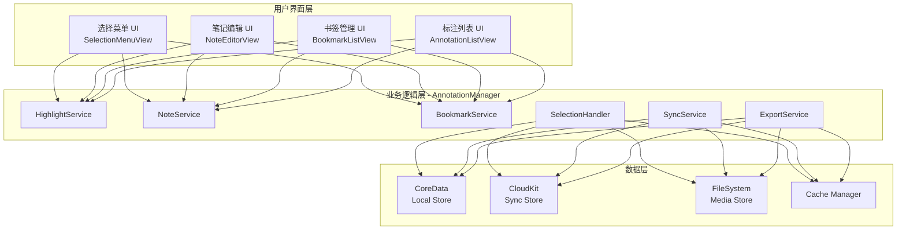

# 划线标注系统设计文档

## 文档信息

| 项目 | 内容 |
|------|------|
| 功能模块 | 划线标注系统 (Annotation & Highlighting System) |
| 文档版本 | 1.0 |
| 最后更新 | 2024年12月 |
| 关联文档 | advanced-reader-design.md, smart-reading-system.md |

---

## 1. 功能概述

### 1.1 核心目标

提供完整的文本标注功能，支持多种高亮样式、想法气泡笔记、书签管理，并与智能朗读系统深度集成。

### 1.2 功能范围

```
┌─────────────────────────────────────────────────────────────────┐
│                      划线标注系统                                │
├─────────────────────────────────────────────────────────────────┤
│                                                                 │
│  ┌──────────────┐  ┌──────────────┐  ┌──────────────┐          │
│  │   文本高亮    │  │   想法气泡    │  │   书签管理    │          │
│  │              │  │              │  │              │          │
│  │ • 5种颜色    │  │ • 文字笔记   │  │ • 快速书签   │          │
│  │ • 3种下划线  │  │ • 语音笔记   │  │ • 命名书签   │          │
│  │ • 波浪线     │  │ • 图片笔记   │  │ • 书签分类   │          │
│  │ • 删除线     │  │ • 气泡展示   │  │ • 快速导航   │          │
│  └──────────────┘  └──────────────┘  └──────────────┘          │
│                                                                 │
│  ┌──────────────┐  ┌──────────────┐  ┌──────────────┐          │
│  │   标注同步    │  │   导出分享    │  │   朗读集成    │          │
│  │              │  │              │  │              │          │
│  │ • 云端同步   │  │ • PDF导出    │  │ • 高亮朗读   │          │
│  │ • 多设备    │  │ • 笔记导出   │  │ • 笔记播放   │          │
│  │ • 冲突解决  │  │ • 社交分享   │  │ • 进度关联   │          │
│  └──────────────┘  └──────────────┘  └──────────────┘          │
│                                                                 │
└─────────────────────────────────────────────────────────────────┘
```

---

## 2. 系统架构

### 2.1 整体架构图



### 2.2 组件职责

| 组件 | 职责 | 依赖 |
|------|------|------|
| SelectionMenuView | 文本选择后的操作菜单 | HighlightService |
| NoteEditorView | 笔记编辑界面 | NoteService |
| BookmarkListView | 书签列表管理 | BookmarkService |
| AnnotationListView | 标注汇总列表 | AnnotationManager |
| HighlightService | 高亮创建/修改/删除 | CoreData |
| NoteService | 笔记管理逻辑 | CoreData, FileSystem |
| BookmarkService | 书签管理逻辑 | CoreData |
| SelectionHandler | 文本选择事件处理 | WebView Bridge |
| SyncService | 云端同步 | CloudKit |
| ExportService | 导出功能 | FileSystem |

---

## 3. 文本高亮系统

### 3.1 高亮样式定义

```
┌─────────────────────────────────────────────────────────────────┐
│                        高亮样式系统                              │
├─────────────────────────────────────────────────────────────────┤
│                                                                 │
│  背景色高亮 (5种颜色)                                            │
│  ┌─────────────────────────────────────────────────────────┐   │
│  │ ██ 黄色   ██ 绿色   ██ 蓝色   ██ 粉色   ██ 紫色        │   │
│  │ #FFF3B0  #B8F4B8  #B8E0FF  #FFB8D4  #E0B8FF           │   │
│  └─────────────────────────────────────────────────────────┘   │
│                                                                 │
│  下划线样式 (3种)                                                │
│  ┌─────────────────────────────────────────────────────────┐   │
│  │ ────────  实线下划线                                     │   │
│  │ - - - -   虚线下划线                                     │   │
│  │ ∿∿∿∿∿∿∿   波浪下划线                                     │   │
│  └─────────────────────────────────────────────────────────┘   │
│                                                                 │
│  特殊样式                                                        │
│  ┌─────────────────────────────────────────────────────────┐   │
│  │ ̶删̶除̶线̶    删除线样式                                       │   │
│  │ 【框选】   边框样式                                       │   │
│  └─────────────────────────────────────────────────────────┘   │
│                                                                 │
└─────────────────────────────────────────────────────────────────┘
```

### 3.2 高亮样式配置表

| 样式ID | 样式名称 | CSS类名 | 颜色/样式值 | 透明度 |
|--------|----------|---------|-------------|--------|
| bg_yellow | 黄色高亮 | highlight-yellow | #FFF3B0 | 0.6 |
| bg_green | 绿色高亮 | highlight-green | #B8F4B8 | 0.6 |
| bg_blue | 蓝色高亮 | highlight-blue | #B8E0FF | 0.6 |
| bg_pink | 粉色高亮 | highlight-pink | #FFB8D4 | 0.6 |
| bg_purple | 紫色高亮 | highlight-purple | #E0B8FF | 0.6 |
| ul_solid | 实线下划线 | underline-solid | 2px solid | - |
| ul_dashed | 虚线下划线 | underline-dashed | 2px dashed | - |
| ul_wavy | 波浪下划线 | underline-wavy | wavy | - |
| strikethrough | 删除线 | strikethrough | line-through | - |
| border | 边框 | border-box | 2px solid | - |

### 3.3 文本选择流程

```
┌──────────────────────────────────────────────────────────────────────┐
│                        文本选择与高亮流程                             │
└──────────────────────────────────────────────────────────────────────┘

     用户操作                    WebView                    Native
        │                          │                          │
        │  长按选择文本             │                          │
        ├─────────────────────────>│                          │
        │                          │                          │
        │                          │  触发 selectionchange    │
        │                          ├─────────────────────────>│
        │                          │                          │
        │                          │  获取选择区域信息         │
        │                          │<─────────────────────────┤
        │                          │                          │
        │                          │  返回: {                 │
        │                          │    text: "选中文本",     │
        │                          │    range: CFI,           │
        │                          │    rect: {x,y,w,h}       │
        │                          │  }                       │
        │                          ├─────────────────────────>│
        │                          │                          │
        │     显示选择菜单          │                          │
        │<─────────────────────────┼──────────────────────────┤
        │                          │                          │
        │  点击高亮颜色             │                          │
        ├─────────────────────────────────────────────────────>│
        │                          │                          │
        │                          │  创建高亮标记            │
        │                          │  applyHighlight()        │
        │                          │<─────────────────────────┤
        │                          │                          │
        │                          │  保存到数据库            │
        │                          │                          ├──┐
        │                          │                          │  │
        │                          │                          │<─┘
        │                          │                          │
        │     更新显示效果          │                          │
        │<─────────────────────────┤                          │
        │                          │                          │
```

### 3.4 CFI (EPUB Canonical Fragment Identifier) 位置标记

```
┌─────────────────────────────────────────────────────────────────┐
│                      CFI 位置标记系统                            │
├─────────────────────────────────────────────────────────────────┤
│                                                                 │
│  CFI 格式说明:                                                   │
│  epubcfi(/6/4!/4/2/14/1:0,/6/4!/4/2/14/1:28)                   │
│                                                                 │
│  ┌─────────────────────────────────────────────────────────┐   │
│  │  /6/4!         →  章节定位 (spine item)                 │   │
│  │  /4/2/14       →  DOM路径 (body > div > p:14)           │   │
│  │  /1:0          →  文本节点偏移起点                       │   │
│  │  /1:28         →  文本节点偏移终点                       │   │
│  └─────────────────────────────────────────────────────────┘   │
│                                                                 │
│  位置数据结构:                                                   │
│  ┌─────────────────────────────────────────────────────────┐   │
│  │  TextRange                                               │   │
│  │  ├── startCFI: String          // 起始CFI               │   │
│  │  ├── endCFI: String            // 结束CFI               │   │
│  │  ├── chapterIndex: Int         // 章节索引              │   │
│  │  ├── chapterTitle: String      // 章节标题              │   │
│  │  ├── pageIndex: Int            // 页面索引              │   │
│  │  └── textContent: String       // 选中文本              │   │
│  └─────────────────────────────────────────────────────────┘   │
│                                                                 │
└─────────────────────────────────────────────────────────────────┘
```

---

## 4. 想法气泡系统

### 4.1 想法气泡概念

```
┌─────────────────────────────────────────────────────────────────┐
│                        想法气泡 (Thought Bubble)                 │
├─────────────────────────────────────────────────────────────────┤
│                                                                 │
│  功能定义:                                                       │
│  在高亮文本旁边显示用户添加的笔记、想法、评论                       │
│                                                                 │
│  显示效果:                                                       │
│  ┌─────────────────────────────────────────────────────────┐   │
│  │                                                         │   │
│  │  "The quick brown fox jumps over the lazy dog."        │   │
│  │        ▲                                                │   │
│  │        │                                                │   │
│  │   ┌────┴────────────────────┐                          │   │
│  │   │  💭 这是一个经典的      │                          │   │
│  │   │  英语全字母句...        │                          │   │
│  │   │                         │                          │   │
│  │   │  🎤 [语音笔记 0:15]     │                          │   │
│  │   └─────────────────────────┘                          │   │
│  │                                                         │   │
│  └─────────────────────────────────────────────────────────┘   │
│                                                                 │
└─────────────────────────────────────────────────────────────────┘
```

### 4.2 笔记类型

| 类型 | 图标 | 描述 | 存储方式 |
|------|------|------|----------|
| 文字笔记 | 📝 | 纯文本笔记 | CoreData |
| 语音笔记 | 🎤 | 录音笔记 | 文件系统 + CoreData引用 |
| 图片笔记 | 📷 | 截图或拍照 | 文件系统 + CoreData引用 |
| 链接笔记 | 🔗 | 外部链接 | CoreData |
| 引用笔记 | 📚 | 关联其他书籍段落 | CoreData |

### 4.3 想法气泡交互流程

```
┌──────────────────────────────────────────────────────────────────────┐
│                      想法气泡交互状态机                               │
└──────────────────────────────────────────────────────────────────────┘

                    ┌─────────────────┐
                    │     隐藏状态     │
                    │   (默认状态)     │
                    └────────┬────────┘
                             │
                    点击高亮文本旁的图标
                             │
                             ▼
                    ┌─────────────────┐
                    │     预览状态     │◄──────────────┐
                    │  (显示摘要气泡)  │               │
                    └────────┬────────┘               │
                             │                        │
              ┌──────────────┼──────────────┐        │
              │              │              │        │
         点击气泡        点击编辑       点击其他区域  │
              │              │              │        │
              ▼              ▼              │        │
     ┌─────────────┐ ┌─────────────┐       │        │
     │   展开状态   │ │   编辑状态   │       │        │
     │ (完整显示)  │ │ (编辑模式)  │       │        │
     └──────┬──────┘ └──────┬──────┘       │        │
            │               │              │        │
            │          保存/取消           │        │
            │               │              │        │
            └───────────────┴──────────────┘        │
                            │                       │
                            └───────────────────────┘
```

### 4.4 气泡展示样式

```
┌─────────────────────────────────────────────────────────────────┐
│                      气泡展示样式设计                            │
├─────────────────────────────────────────────────────────────────┤
│                                                                 │
│  紧凑模式 (阅读时):                                              │
│  ┌─────────────────────────────────────────────────────────┐   │
│  │  高亮文本 [💭]                                           │   │
│  │           ↑ 小图标，悬浮在行尾                           │   │
│  └─────────────────────────────────────────────────────────┘   │
│                                                                 │
│  预览模式 (点击图标):                                            │
│  ┌─────────────────────────────────────────────────────────┐   │
│  │  高亮文本 ───┐                                           │   │
│  │              ▼                                           │   │
│  │         ┌─────────────┐                                  │   │
│  │         │ 笔记摘要... │                                  │   │
│  │         │ 查看更多 >  │                                  │   │
│  │         └─────────────┘                                  │   │
│  └─────────────────────────────────────────────────────────┘   │
│                                                                 │
│  展开模式 (点击查看更多):                                        │
│  ┌─────────────────────────────────────────────────────────┐   │
│  │                                                         │   │
│  │  ┌─────────────────────────────────────────────────┐   │   │
│  │  │  📝 笔记内容                           ✏️ 🗑️    │   │   │
│  │  │                                                 │   │   │
│  │  │  这是完整的笔记内容，可以包含多行文字...        │   │   │
│  │  │                                                 │   │   │
│  │  │  ─────────────────────────────────────────────  │   │   │
│  │  │  🎤 语音笔记                      [▶️ 0:15]     │   │   │
│  │  │  ─────────────────────────────────────────────  │   │   │
│  │  │                                                 │   │   │
│  │  │  创建于: 2024-12-01 14:30                      │   │   │
│  │  │  修改于: 2024-12-02 10:15                      │   │   │
│  │  └─────────────────────────────────────────────────┘   │   │
│  │                                                         │   │
│  └─────────────────────────────────────────────────────────┘   │
│                                                                 │
└─────────────────────────────────────────────────────────────────┘
```

### 4.5 语音笔记录制流程

```
┌──────────────────────────────────────────────────────────────────────┐
│                        语音笔记录制流程                               │
└──────────────────────────────────────────────────────────────────────┘

     用户                    录音界面                   音频处理
       │                        │                          │
       │  点击录音按钮           │                          │
       ├───────────────────────>│                          │
       │                        │                          │
       │                        │  请求麦克风权限           │
       │                        ├─────────────────────────>│
       │                        │                          │
       │                        │  权限已授予              │
       │                        │<─────────────────────────┤
       │                        │                          │
       │     显示录音中状态      │                          │
       │<───────────────────────┤                          │
       │                        │                          │
       │     ┌──────────────┐   │  开始录音               │
       │     │ 🔴 录音中    │   ├─────────────────────────>│
       │     │   00:05      │   │                          │
       │     │  [停止]      │   │  实时波形数据            │
       │     └──────────────┘   │<─────────────────────────┤
       │                        │                          │
       │  点击停止              │                          │
       ├───────────────────────>│                          │
       │                        │                          │
       │                        │  停止录音                │
       │                        ├─────────────────────────>│
       │                        │                          │
       │                        │  压缩音频文件            │
       │                        │  (AAC, 64kbps)           │
       │                        │<─────────────────────────┤
       │                        │                          │
       │     显示预览界面        │                          │
       │<───────────────────────┤                          │
       │                        │                          │
       │  ┌──────────────────┐  │                          │
       │  │ ▶️ 0:15          │  │                          │
       │  │ [重录] [保存]   │  │                          │
       │  └──────────────────┘  │                          │
       │                        │                          │
       │  点击保存              │                          │
       ├───────────────────────>│                          │
       │                        │                          │
       │                        │  保存到文件系统          │
       │                        │  创建数据库引用          │
       │                        ├──────────────────────────┤
       │                        │                          │
```

---

## 5. 书签管理系统

### 5.1 书签类型

```
┌─────────────────────────────────────────────────────────────────┐
│                        书签类型定义                              │
├─────────────────────────────────────────────────────────────────┤
│                                                                 │
│  ┌──────────────────────────────────────────────────────────┐  │
│  │  快速书签                                                 │  │
│  │  • 一键添加，无需命名                                     │  │
│  │  • 自动使用页面第一句话作为摘要                           │  │
│  │  • 默认红色标记                                           │  │
│  └──────────────────────────────────────────────────────────┘  │
│                                                                 │
│  ┌──────────────────────────────────────────────────────────┐  │
│  │  命名书签                                                 │  │
│  │  • 用户自定义名称                                         │  │
│  │  • 可选择颜色/图标                                        │  │
│  │  • 支持添加备注                                           │  │
│  └──────────────────────────────────────────────────────────┘  │
│                                                                 │
│  ┌──────────────────────────────────────────────────────────┐  │
│  │  分类书签                                                 │  │
│  │  • 归类到用户创建的文件夹                                 │  │
│  │  • 支持"想读"/"正在读"/"重要"等预设分类                   │  │
│  │  • 支持标签系统                                           │  │
│  └──────────────────────────────────────────────────────────┘  │
│                                                                 │
└─────────────────────────────────────────────────────────────────┘
```

### 5.2 书签列表界面

```
┌─────────────────────────────────────────────────────────────────┐
│                        书签列表界面                              │
├─────────────────────────────────────────────────────────────────┤
│                                                                 │
│  ┌─────────────────────────────────────────────────────────┐   │
│  │  📚 书签管理                               [编辑] [筛选] │   │
│  ├─────────────────────────────────────────────────────────┤   │
│  │                                                         │   │
│  │  📁 所有书签 (12)                                       │   │
│  │  ├── 📁 重要段落 (5)                                   │   │
│  │  ├── 📁 待复习 (3)                                     │   │
│  │  └── 📁 精彩引用 (4)                                   │   │
│  │                                                         │   │
│  │  ─────────────────────────────────────────────────────  │   │
│  │                                                         │   │
│  │  🔖 第三章 开头                              P.45       │   │
│  │     "It was the best of times..."                       │   │
│  │     📁 重要段落 · 2024-12-01                           │   │
│  │                                                         │   │
│  │  🔖 角色登场                                  P.78       │   │
│  │     "A tall figure emerged from..."                     │   │
│  │     📁 精彩引用 · 2024-12-02                           │   │
│  │                                                         │   │
│  │  🔖 快速书签                                  P.112      │   │
│  │     "The market was bustling..."                        │   │
│  │     未分类 · 2024-12-03                                │   │
│  │                                                         │   │
│  └─────────────────────────────────────────────────────────┘   │
│                                                                 │
└─────────────────────────────────────────────────────────────────┘
```

### 5.3 书签快捷操作

| 操作 | 触发方式 | 说明 |
|------|----------|------|
| 添加快速书签 | 点击顶部书签图标 | 一键添加当前位置 |
| 添加命名书签 | 长按书签图标 | 弹出编辑界面 |
| 跳转到书签 | 点击书签列表项 | 直接跳转到书签位置 |
| 编辑书签 | 左滑列表项 | 显示编辑/删除选项 |
| 分类书签 | 拖拽到文件夹 | 移动到指定分类 |
| 删除书签 | 左滑删除 | 确认后删除 |

---

## 6. 选择菜单设计

### 6.1 选择菜单布局

```
┌─────────────────────────────────────────────────────────────────┐
│                        选择菜单设计                              │
├─────────────────────────────────────────────────────────────────┤
│                                                                 │
│  选中文本后的上下文菜单:                                         │
│                                                                 │
│  ┌─────────────────────────────────────────────────────────┐   │
│  │                                                         │   │
│  │         "selected text appears here"                    │   │
│  │                      ▲                                  │   │
│  │  ┌───────────────────┴───────────────────┐             │   │
│  │  │                                        │             │   │
│  │  │  ┌────┬────┬────┬────┬────┐          │             │   │
│  │  │  │ 🟡 │ 🟢 │ 🔵 │ 🩷 │ 🟣 │ 高亮颜色  │             │   │
│  │  │  └────┴────┴────┴────┴────┘          │             │   │
│  │  │                                        │             │   │
│  │  │  ┌────────┬────────┬────────┐        │             │   │
│  │  │  │  📝   │   🔊   │   📋   │        │             │   │
│  │  │  │ 笔记  │  朗读  │  复制  │        │             │   │
│  │  │  └────────┴────────┴────────┘        │             │   │
│  │  │                                        │             │   │
│  │  │  ┌────────┬────────┬────────┐        │             │   │
│  │  │  │  🔍   │   📖   │   🔗   │        │             │   │
│  │  │  │ 查词  │  翻译  │  分享  │        │             │   │
│  │  │  └────────┴────────┴────────┘        │             │   │
│  │  │                                        │             │   │
│  │  └────────────────────────────────────────┘             │   │
│  │                                                         │   │
│  └─────────────────────────────────────────────────────────┘   │
│                                                                 │
└─────────────────────────────────────────────────────────────────┘
```

### 6.2 菜单操作功能表

| 图标 | 功能 | 描述 | 后续操作 |
|------|------|------|----------|
| 🟡🟢🔵🩷🟣 | 高亮 | 应用对应颜色高亮 | 直接应用 |
| 📝 | 笔记 | 添加想法气泡 | 打开笔记编辑器 |
| 🔊 | 朗读 | 朗读选中内容 | 触发TTS |
| 📋 | 复制 | 复制文本 | 复制到剪贴板 |
| 🔍 | 查词 | 查询词义 | 打开词典弹窗 |
| 📖 | 翻译 | 翻译选中内容 | 打开翻译弹窗 |
| 🔗 | 分享 | 分享选中内容 | 打开分享面板 |

### 6.3 扩展菜单

```
┌─────────────────────────────────────────────────────────────────┐
│                        扩展菜单 (更多操作)                       │
├─────────────────────────────────────────────────────────────────┤
│                                                                 │
│  点击 "..." 展开更多操作:                                       │
│                                                                 │
│  ┌─────────────────────────────────────────────────────────┐   │
│  │                                                         │   │
│  │  ┌────────────────────────────────────────────────┐    │   │
│  │  │  ━━━━━  实线下划线                              │    │   │
│  │  │  ┄┄┄┄┄  虚线下划线                              │    │   │
│  │  │  ∿∿∿∿∿  波浪下划线                              │    │   │
│  │  │  ̶a̶b̶c̶d̶  删除线                                  │    │   │
│  │  ├────────────────────────────────────────────────┤    │   │
│  │  │  🔎 在书中搜索                                  │    │   │
│  │  │  📚 在Wikipedia中搜索                          │    │   │
│  │  │  🌐 在Google中搜索                             │    │   │
│  │  ├────────────────────────────────────────────────┤    │   │
│  │  │  🤖 AI解释                                     │    │   │
│  │  │  📊 生成思维导图                               │    │   │
│  │  └────────────────────────────────────────────────┘    │   │
│  │                                                         │   │
│  └─────────────────────────────────────────────────────────┘   │
│                                                                 │
└─────────────────────────────────────────────────────────────────┘
```

---

## 7. 标注管理界面

### 7.1 标注汇总页面

```
┌─────────────────────────────────────────────────────────────────┐
│                        标注汇总页面                              │
├─────────────────────────────────────────────────────────────────┤
│                                                                 │
│  ┌─────────────────────────────────────────────────────────┐   │
│  │  《书名》标注汇总                          [导出] [筛选]  │   │
│  ├─────────────────────────────────────────────────────────┤   │
│  │                                                         │   │
│  │  📊 统计                                                │   │
│  │  ┌──────────┬──────────┬──────────┬──────────┐        │   │
│  │  │ 🟡 12    │ 🟢 8     │ 📝 15    │ 🔖 6     │        │   │
│  │  │ 黄色高亮  │ 绿色高亮  │ 笔记     │ 书签     │        │   │
│  │  └──────────┴──────────┴──────────┴──────────┘        │   │
│  │                                                         │   │
│  │  ─────────────────────────────────────────────────────  │   │
│  │                                                         │   │
│  │  第一章: 开端                                           │   │
│  │  ┌───────────────────────────────────────────────────┐ │   │
│  │  │ 🟡 "It was a bright cold day in April..."        │ │   │
│  │  │    💭 开篇即奠定了压抑的基调                       │ │   │
│  │  │    P.1 · 2024-12-01                               │ │   │
│  │  └───────────────────────────────────────────────────┘ │   │
│  │  ┌───────────────────────────────────────────────────┐ │   │
│  │  │ 🟢 "The clocks were striking thirteen."          │ │   │
│  │  │    P.1 · 2024-12-01                               │ │   │
│  │  └───────────────────────────────────────────────────┘ │   │
│  │                                                         │   │
│  │  第二章: 觉醒                                           │   │
│  │  ┌───────────────────────────────────────────────────┐ │   │
│  │  │ 🟡 "Freedom is the freedom to say..."            │ │   │
│  │  │    📝 核心主题句                                   │ │   │
│  │  │    P.45 · 2024-12-02                              │ │   │
│  │  └───────────────────────────────────────────────────┘ │   │
│  │                                                         │   │
│  └─────────────────────────────────────────────────────────┘   │
│                                                                 │
└─────────────────────────────────────────────────────────────────┘
```

### 7.2 筛选与排序选项

| 筛选维度 | 选项 |
|----------|------|
| 标注类型 | 全部 / 高亮 / 笔记 / 书签 |
| 高亮颜色 | 全部 / 黄色 / 绿色 / 蓝色 / 粉色 / 紫色 |
| 时间范围 | 全部 / 今天 / 本周 / 本月 / 自定义 |
| 章节 | 全部 / 特定章节 |

| 排序方式 | 描述 |
|----------|------|
| 按位置 | 按书中出现顺序 |
| 按时间 | 按创建时间倒序 |
| 按类型 | 按标注类型分组 |
| 按颜色 | 按高亮颜色分组 |

---

## 8. 数据模型

### 8.1 核心数据模型

```
┌─────────────────────────────────────────────────────────────────┐
│                        数据模型关系图                            │
├─────────────────────────────────────────────────────────────────┤
│                                                                 │
│  ┌─────────────┐     1:N     ┌─────────────┐                   │
│  │    Book     │────────────>│  Highlight  │                   │
│  │             │             │             │                   │
│  │ • id        │             │ • id        │                   │
│  │ • title     │             │ • bookId    │                   │
│  │ • author    │             │ • startCFI  │                   │
│  │ • ...       │             │ • endCFI    │                   │
│  └─────────────┘             │ • style     │                   │
│        │                     │ • color     │                   │
│        │                     │ • text      │                   │
│        │                     │ • createdAt │                   │
│        │                     └──────┬──────┘                   │
│        │                            │                          │
│        │                     0:1    │                          │
│        │                            ▼                          │
│        │                     ┌─────────────┐                   │
│        │                     │    Note     │                   │
│        │                     │             │                   │
│        │                     │ • id        │                   │
│        │                     │ • highlightId│                  │
│        │                     │ • content   │                   │
│        │                     │ • type      │                   │
│        │                     │ • mediaPath │                   │
│        │                     │ • createdAt │                   │
│        │                     │ • updatedAt │                   │
│        │                     └─────────────┘                   │
│        │                                                       │
│        │     1:N     ┌─────────────┐                          │
│        └────────────>│  Bookmark   │                          │
│                      │             │                          │
│                      │ • id        │                          │
│                      │ • bookId    │                          │
│                      │ • cfi       │                          │
│                      │ • name      │                          │
│                      │ • summary   │                          │
│                      │ • folderId  │                          │
│                      │ • color     │                          │
│                      │ • createdAt │                          │
│                      └─────────────┘                          │
│                                                                │
└─────────────────────────────────────────────────────────────────┘
```

### 8.2 数据模型字段说明

**Highlight (高亮)**

| 字段 | 类型 | 说明 |
|------|------|------|
| id | UUID | 唯一标识符 |
| bookId | UUID | 关联书籍ID |
| startCFI | String | 起始位置CFI |
| endCFI | String | 结束位置CFI |
| chapterIndex | Int | 章节索引 |
| chapterTitle | String | 章节标题 |
| pageIndex | Int | 页面索引 |
| text | String | 高亮文本内容 |
| style | String | 样式类型 (background/underline/strikethrough) |
| color | String | 颜色代码 |
| createdAt | Date | 创建时间 |
| updatedAt | Date | 更新时间 |
| syncStatus | Int | 同步状态 |

**Note (笔记)**

| 字段 | 类型 | 说明 |
|------|------|------|
| id | UUID | 唯一标识符 |
| highlightId | UUID? | 关联高亮ID (可选) |
| bookId | UUID | 关联书籍ID |
| cfi | String | 位置CFI |
| type | String | 笔记类型 (text/voice/image/link) |
| content | String | 文字内容 |
| mediaPath | String? | 媒体文件路径 |
| mediaDuration | Double? | 音频时长 |
| createdAt | Date | 创建时间 |
| updatedAt | Date | 更新时间 |
| syncStatus | Int | 同步状态 |

**Bookmark (书签)**

| 字段 | 类型 | 说明 |
|------|------|------|
| id | UUID | 唯一标识符 |
| bookId | UUID | 关联书籍ID |
| cfi | String | 位置CFI |
| name | String? | 书签名称 |
| summary | String | 位置摘要 |
| folderId | UUID? | 所属文件夹ID |
| color | String | 标记颜色 |
| tags | [String] | 标签数组 |
| createdAt | Date | 创建时间 |
| syncStatus | Int | 同步状态 |

**BookmarkFolder (书签文件夹)**

| 字段 | 类型 | 说明 |
|------|------|------|
| id | UUID | 唯一标识符 |
| name | String | 文件夹名称 |
| icon | String | 图标 |
| color | String | 颜色 |
| order | Int | 排序顺序 |
| isSystem | Bool | 是否系统预设 |
| createdAt | Date | 创建时间 |

---

## 9. WebView Bridge 通信

### 9.1 JavaScript 接口定义

```
┌─────────────────────────────────────────────────────────────────┐
│                    WebView Bridge 通信协议                       │
├─────────────────────────────────────────────────────────────────┤
│                                                                 │
│  Native → WebView (消息类型)                                    │
│  ┌─────────────────────────────────────────────────────────┐   │
│  │  applyHighlight      应用高亮样式                        │   │
│  │  removeHighlight     移除高亮                            │   │
│  │  updateHighlight     更新高亮样式                        │   │
│  │  showNoteIndicator   显示笔记图标                        │   │
│  │  scrollToCFI         滚动到指定位置                      │   │
│  │  clearSelection      清除当前选择                        │   │
│  │  getHighlightRects   获取高亮区域坐标                    │   │
│  └─────────────────────────────────────────────────────────┘   │
│                                                                 │
│  WebView → Native (消息类型)                                    │
│  ┌─────────────────────────────────────────────────────────┐   │
│  │  selectionChanged    选择内容变化                        │   │
│  │  highlightTapped     点击高亮区域                        │   │
│  │  noteIconTapped      点击笔记图标                        │   │
│  │  longPressHighlight  长按高亮区域                        │   │
│  │  pageChanged         页面变化                            │   │
│  └─────────────────────────────────────────────────────────┘   │
│                                                                 │
└─────────────────────────────────────────────────────────────────┘
```

### 9.2 消息格式

```
┌─────────────────────────────────────────────────────────────────┐
│                        消息格式定义                              │
├─────────────────────────────────────────────────────────────────┤
│                                                                 │
│  通用消息结构:                                                   │
│  ┌─────────────────────────────────────────────────────────┐   │
│  │  {                                                      │   │
│  │    "type": "消息类型",                                   │   │
│  │    "payload": { ... },                                  │   │
│  │    "timestamp": 1701234567890                           │   │
│  │  }                                                      │   │
│  └─────────────────────────────────────────────────────────┘   │
│                                                                 │
│  selectionChanged 消息:                                         │
│  ┌─────────────────────────────────────────────────────────┐   │
│  │  {                                                      │   │
│  │    "type": "selectionChanged",                          │   │
│  │    "payload": {                                         │   │
│  │      "text": "选中的文本内容",                           │   │
│  │      "startCFI": "epubcfi(/6/4!/4/2/14/1:0)",          │   │
│  │      "endCFI": "epubcfi(/6/4!/4/2/14/1:28)",           │   │
│  │      "rect": {                                          │   │
│  │        "x": 100, "y": 200,                              │   │
│  │        "width": 150, "height": 20                       │   │
│  │      },                                                 │   │
│  │      "chapterIndex": 3,                                 │   │
│  │      "chapterTitle": "Chapter 3"                        │   │
│  │    }                                                    │   │
│  │  }                                                      │   │
│  └─────────────────────────────────────────────────────────┘   │
│                                                                 │
│  applyHighlight 消息:                                           │
│  ┌─────────────────────────────────────────────────────────┐   │
│  │  {                                                      │   │
│  │    "type": "applyHighlight",                            │   │
│  │    "payload": {                                         │   │
│  │      "id": "highlight-uuid",                            │   │
│  │      "startCFI": "epubcfi(...)",                        │   │
│  │      "endCFI": "epubcfi(...)",                          │   │
│  │      "style": "background",                             │   │
│  │      "color": "#FFF3B0",                                │   │
│  │      "hasNote": true                                    │   │
│  │    }                                                    │   │
│  │  }                                                      │   │
│  └─────────────────────────────────────────────────────────┘   │
│                                                                 │
└─────────────────────────────────────────────────────────────────┘
```

---

## 10. 云端同步

### 10.1 同步架构

```
┌─────────────────────────────────────────────────────────────────┐
│                        云端同步架构                              │
├─────────────────────────────────────────────────────────────────┤
│                                                                 │
│       Device A                Cloud                Device B     │
│          │                      │                      │        │
│  ┌───────┴───────┐      ┌──────┴──────┐      ┌───────┴───────┐ │
│  │ Local Store   │      │  CloudKit   │      │ Local Store   │ │
│  │               │      │             │      │               │ │
│  │ ┌───────────┐ │      │ ┌─────────┐ │      │ ┌───────────┐ │ │
│  │ │ Highlights│ │◄────►│ │ Sync    │ │◄────►│ │ Highlights│ │ │
│  │ └───────────┘ │      │ │ Records │ │      │ └───────────┘ │ │
│  │ ┌───────────┐ │      │ └─────────┘ │      │ ┌───────────┐ │ │
│  │ │   Notes   │ │◄────►│ ┌─────────┐ │◄────►│ │   Notes   │ │ │
│  │ └───────────┘ │      │ │ Media   │ │      │ └───────────┘ │ │
│  │ ┌───────────┐ │      │ │ Assets  │ │      │ ┌───────────┐ │ │
│  │ │ Bookmarks │ │◄────►│ └─────────┘ │◄────►│ │ Bookmarks │ │ │
│  │ └───────────┘ │      │             │      │ └───────────┘ │ │
│  └───────────────┘      └─────────────┘      └───────────────┘ │
│                                                                 │
└─────────────────────────────────────────────────────────────────┘
```

### 10.2 同步状态管理

| 状态 | 值 | 描述 |
|------|-----|------|
| synced | 0 | 已同步 |
| pending | 1 | 待同步 |
| syncing | 2 | 同步中 |
| conflict | 3 | 存在冲突 |
| failed | 4 | 同步失败 |

### 10.3 冲突解决策略

```
┌─────────────────────────────────────────────────────────────────┐
│                        冲突解决流程                              │
├─────────────────────────────────────────────────────────────────┤
│                                                                 │
│                    检测到冲突                                    │
│                        │                                        │
│                        ▼                                        │
│               ┌─────────────────┐                              │
│               │  冲突类型判断    │                              │
│               └────────┬────────┘                              │
│                        │                                        │
│        ┌───────────────┼───────────────┐                       │
│        │               │               │                       │
│        ▼               ▼               ▼                       │
│  ┌──────────┐   ┌──────────┐   ┌──────────┐                   │
│  │ 内容冲突  │   │ 删除冲突  │   │ 位置冲突  │                   │
│  └────┬─────┘   └────┬─────┘   └────┬─────┘                   │
│       │              │              │                          │
│       ▼              ▼              ▼                          │
│  ┌──────────┐   ┌──────────┐   ┌──────────┐                   │
│  │ 保留最新  │   │ 优先保留  │   │ 合并保留  │                   │
│  │ 修改版本  │   │ 未删除版  │   │ 两个位置  │                   │
│  └──────────┘   └──────────┘   └──────────┘                   │
│                                                                 │
│  特殊情况: 用户手动选择                                          │
│  ┌─────────────────────────────────────────────────────────┐   │
│  │  检测到标注冲突:                                         │   │
│  │                                                         │   │
│  │  本地版本: "笔记内容A" (修改于 12:30)                    │   │
│  │  云端版本: "笔记内容B" (修改于 12:35)                    │   │
│  │                                                         │   │
│  │  [保留本地]  [保留云端]  [保留两者]                      │   │
│  └─────────────────────────────────────────────────────────┘   │
│                                                                 │
└─────────────────────────────────────────────────────────────────┘
```

---

## 11. 导出功能

### 11.1 支持的导出格式

| 格式 | 扩展名 | 包含内容 | 用途 |
|------|--------|----------|------|
| PDF | .pdf | 高亮文本 + 笔记 + 页码 | 打印/分享 |
| Markdown | .md | 结构化文本 | 笔记软件导入 |
| HTML | .html | 带样式的网页 | 浏览器查看 |
| JSON | .json | 原始数据 | 数据备份/迁移 |
| TXT | .txt | 纯文本 | 通用导出 |
| Notion | - | API同步 | Notion集成 |
| Evernote | .enex | 笔记格式 | 印象笔记导入 |

### 11.2 导出选项界面

```
┌─────────────────────────────────────────────────────────────────┐
│                        导出选项界面                              │
├─────────────────────────────────────────────────────────────────┤
│                                                                 │
│  ┌─────────────────────────────────────────────────────────┐   │
│  │  📤 导出标注                                             │   │
│  ├─────────────────────────────────────────────────────────┤   │
│  │                                                         │   │
│  │  选择导出内容:                                           │   │
│  │  ☑️ 高亮内容                                             │   │
│  │  ☑️ 笔记内容                                             │   │
│  │  ☐ 书签                                                 │   │
│  │  ☑️ 包含章节标题                                         │   │
│  │  ☑️ 包含页码                                             │   │
│  │  ☐ 包含创建时间                                         │   │
│  │                                                         │   │
│  │  ─────────────────────────────────────────────────────  │   │
│  │                                                         │   │
│  │  选择导出格式:                                           │   │
│  │  ○ PDF (推荐)                                           │   │
│  │  ○ Markdown                                             │   │
│  │  ○ HTML                                                 │   │
│  │  ○ 纯文本                                               │   │
│  │                                                         │   │
│  │  ─────────────────────────────────────────────────────  │   │
│  │                                                         │   │
│  │  导出范围:                                               │   │
│  │  ○ 全部标注                                             │   │
│  │  ○ 当前章节                                             │   │
│  │  ○ 选择章节...                                          │   │
│  │                                                         │   │
│  │                              [取消]  [导出]             │   │
│  └─────────────────────────────────────────────────────────┘   │
│                                                                 │
└─────────────────────────────────────────────────────────────────┘
```

---

## 12. 与朗读系统集成

### 12.1 高亮朗读集成

```
┌─────────────────────────────────────────────────────────────────┐
│                     高亮朗读集成流程                             │
├─────────────────────────────────────────────────────────────────┤
│                                                                 │
│  场景1: 朗读到高亮区域时的视觉反馈                               │
│                                                                 │
│         朗读引擎                  高亮系统                       │
│            │                        │                          │
│  朗读进行中 │                        │                          │
│            │  进入高亮区域           │                          │
│            ├───────────────────────>│                          │
│            │                        │  增强高亮显示            │
│            │                        │  (增加亮度/边框)          │
│            │                        ├────────┐                 │
│            │                        │        │                 │
│            │                        │<───────┘                 │
│            │  离开高亮区域           │                          │
│            ├───────────────────────>│                          │
│            │                        │  恢复正常显示            │
│            │                        ├────────┐                 │
│            │                        │        │                 │
│            │                        │<───────┘                 │
│                                                                 │
│  场景2: 只朗读高亮内容模式                                       │
│                                                                 │
│  ┌─────────────────────────────────────────────────────────┐   │
│  │  [▶️ 朗读高亮内容]                                       │   │
│  │                                                         │   │
│  │  依次朗读所有高亮段落:                                    │   │
│  │  1. 第一处高亮 → 朗读 → 短暂停顿                         │   │
│  │  2. 第二处高亮 → 朗读 → 短暂停顿                         │   │
│  │  3. ...                                                 │   │
│  │                                                         │   │
│  │  自动跳转到对应位置并高亮显示                             │   │
│  └─────────────────────────────────────────────────────────┘   │
│                                                                 │
└─────────────────────────────────────────────────────────────────┘
```

### 12.2 笔记语音播放

```
┌─────────────────────────────────────────────────────────────────┐
│                     笔记语音播放模式                             │
├─────────────────────────────────────────────────────────────────┤
│                                                                 │
│  播放顺序设置:                                                   │
│                                                                 │
│  ┌─────────────────────────────────────────────────────────┐   │
│  │  ○ 先高亮后笔记                                          │   │
│  │    朗读高亮文本 → 播放/朗读笔记内容                       │   │
│  │                                                         │   │
│  │  ○ 只播放笔记                                           │   │
│  │    跳过高亮文本，只播放笔记                              │   │
│  │                                                         │   │
│  │  ○ 交替播放                                             │   │
│  │    高亮1 → 笔记1 → 高亮2 → 笔记2...                     │   │
│  └─────────────────────────────────────────────────────────┘   │
│                                                                 │
│  笔记播放处理:                                                   │
│  ┌─────────────────────────────────────────────────────────┐   │
│  │  • 文字笔记: 使用TTS朗读                                 │   │
│  │  • 语音笔记: 直接播放录音                                │   │
│  │  • 图片笔记: 跳过或朗读图片描述                          │   │
│  └─────────────────────────────────────────────────────────┘   │
│                                                                 │
└─────────────────────────────────────────────────────────────────┘
```

---

## 13. 性能优化

### 13.1 大量标注优化策略

| 优化项 | 策略 | 实现方式 |
|--------|------|----------|
| 懒加载 | 只渲染可视区域的标注 | Intersection Observer |
| 分页加载 | 标注列表分页获取 | Cursor-based Pagination |
| 索引优化 | CFI和时间字段建立索引 | CoreData Index |
| 缓存 | 当前章节标注缓存 | Memory Cache |
| 批量操作 | 合并多个标注修改 | Batch Save Context |
| 增量同步 | 只同步变更部分 | Change Tracking |

### 13.2 WebView 渲染优化

```
┌─────────────────────────────────────────────────────────────────┐
│                    WebView 渲染优化策略                          │
├─────────────────────────────────────────────────────────────────┤
│                                                                 │
│  1. CSS 优化                                                    │
│  ┌─────────────────────────────────────────────────────────┐   │
│  │  • 使用 CSS 变量统一管理高亮颜色                         │   │
│  │  • 避免复杂选择器                                        │   │
│  │  • 使用 will-change 提示浏览器                           │   │
│  │  • 避免布局抖动 (layout thrashing)                       │   │
│  └─────────────────────────────────────────────────────────┘   │
│                                                                 │
│  2. DOM 操作优化                                                │
│  ┌─────────────────────────────────────────────────────────┐   │
│  │  • 使用 DocumentFragment 批量插入                        │   │
│  │  • 避免频繁的 DOM 查询                                   │   │
│  │  • 使用虚拟列表处理大量标注                              │   │
│  │  • 防抖处理选择事件                                      │   │
│  └─────────────────────────────────────────────────────────┘   │
│                                                                 │
│  3. 事件优化                                                    │
│  ┌─────────────────────────────────────────────────────────┐   │
│  │  • 使用事件委托                                          │   │
│  │  • 节流滚动事件处理                                      │   │
│  │  • 异步处理耗时操作                                      │   │
│  └─────────────────────────────────────────────────────────┘   │
│                                                                 │
└─────────────────────────────────────────────────────────────────┘
```

---

## 14. 错误处理

### 14.1 错误类型与处理

| 错误类型 | 触发场景 | 处理策略 | 用户提示 |
|----------|----------|----------|----------|
| 保存失败 | 数据库写入错误 | 重试3次，本地队列 | "保存失败，已加入重试队列" |
| 同步失败 | 网络错误 | 标记待同步，后台重试 | "同步失败，稍后自动重试" |
| CFI解析错误 | EPUB结构变化 | 尝试模糊匹配 | "标注位置可能不准确" |
| 媒体保存失败 | 存储空间不足 | 提示清理空间 | "存储空间不足" |
| 冲突无法解决 | 复杂冲突 | 用户手动选择 | 弹出冲突解决界面 |

### 14.2 数据恢复机制

```
┌─────────────────────────────────────────────────────────────────┐
│                      数据恢复机制                                │
├─────────────────────────────────────────────────────────────────┤
│                                                                 │
│  备份策略:                                                       │
│  ┌─────────────────────────────────────────────────────────┐   │
│  │  • 自动备份: 每次App进入后台时                           │   │
│  │  • 定期备份: 每24小时自动备份                            │   │
│  │  • 手动备份: 用户主动触发                                │   │
│  │  • 云端备份: CloudKit自动同步                            │   │
│  └─────────────────────────────────────────────────────────┘   │
│                                                                 │
│  恢复选项:                                                       │
│  ┌─────────────────────────────────────────────────────────┐   │
│  │  1. 从本地备份恢复                                       │   │
│  │  2. 从云端恢复                                           │   │
│  │  3. 从导出文件恢复 (JSON格式)                            │   │
│  │  4. 合并恢复 (保留本地 + 导入备份)                        │   │
│  └─────────────────────────────────────────────────────────┘   │
│                                                                 │
└─────────────────────────────────────────────────────────────────┘
```

---

## 15. 辅助功能支持

### 15.1 VoiceOver 支持

| 元素 | 辅助功能标签 | 辅助功能提示 |
|------|-------------|-------------|
| 高亮文本 | "已高亮: [文本内容]" | "双击编辑，三击删除" |
| 笔记图标 | "笔记" | "双击查看笔记内容" |
| 书签按钮 | "添加书签" | "当前页未添加书签" |
| 颜色选择器 | "黄色高亮" | "双击应用" |
| 选择菜单 | "选择菜单" | "包含高亮、笔记等选项" |

### 15.2 动态字体支持

```
┌─────────────────────────────────────────────────────────────────┐
│                      动态字体适配                                │
├─────────────────────────────────────────────────────────────────┤
│                                                                 │
│  支持的字体大小等级:                                             │
│  ┌─────────────────────────────────────────────────────────┐   │
│  │  • xSmall   →  选择菜单紧凑布局                          │   │
│  │  • Small    →  正常布局                                  │   │
│  │  • Medium   →  正常布局                                  │   │
│  │  • Large    →  正常布局                                  │   │
│  │  • xLarge   →  扩展菜单间距                              │   │
│  │  • xxLarge  →  使用列表菜单替代网格                      │   │
│  │  • xxxLarge →  全屏菜单模式                              │   │
│  └─────────────────────────────────────────────────────────┘   │
│                                                                 │
│  响应式布局:                                                     │
│  ┌─────────────────────────────────────────────────────────┐   │
│  │  当字体 > xLarge 时:                                     │   │
│  │  • 选择菜单从2行变为1行滚动                              │   │
│  │  • 增加触摸区域大小                                      │   │
│  │  • 笔记气泡使用全屏模式                                  │   │
│  └─────────────────────────────────────────────────────────┘   │
│                                                                 │
└─────────────────────────────────────────────────────────────────┘
```

---

## 16. 附录

### 16.1 颜色规范

| 用途 | Light Mode | Dark Mode |
|------|------------|-----------|
| 黄色高亮 | #FFF3B0 (60%) | #665C00 (60%) |
| 绿色高亮 | #B8F4B8 (60%) | #1A5C1A (60%) |
| 蓝色高亮 | #B8E0FF (60%) | #1A4A66 (60%) |
| 粉色高亮 | #FFB8D4 (60%) | #661A3D (60%) |
| 紫色高亮 | #E0B8FF (60%) | #4D1A66 (60%) |
| 下划线默认 | #333333 | #CCCCCC |
| 笔记图标 | #FF9500 | #FF9F0A |
| 书签颜色 | #FF3B30 | #FF453A |

### 16.2 动画规范

| 动画 | 时长 | 曲线 | 说明 |
|------|------|------|------|
| 菜单出现 | 200ms | easeOut | 从选择位置弹出 |
| 菜单消失 | 150ms | easeIn | 淡出消失 |
| 高亮应用 | 300ms | easeInOut | 颜色渐变出现 |
| 气泡展开 | 250ms | spring | 弹性展开效果 |
| 书签添加 | 400ms | spring | 飞入动画 |

### 16.3 手势规范

| 手势 | 目标 | 操作 |
|------|------|------|
| 长按 | 文本 | 开始选择 |
| 点击 | 高亮 | 显示选项菜单 |
| 长按 | 高亮 | 显示编辑/删除选项 |
| 左滑 | 列表项 | 显示删除按钮 |
| 右滑 | 列表项 | 显示更多操作 |
| 双指捏合 | 列表 | 折叠/展开章节 |

---

## 变更记录

| 版本 | 日期 | 变更内容 |
|------|------|----------|
| 1.0 | 2024-12 | 初始版本 |
