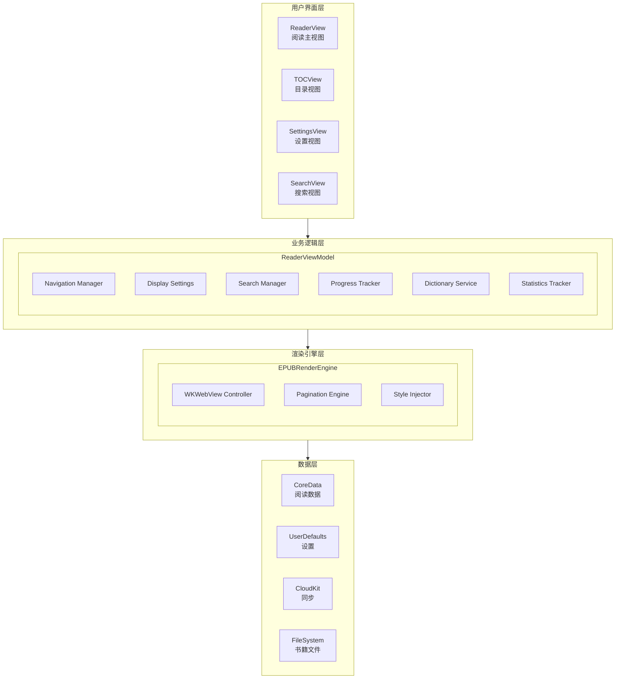
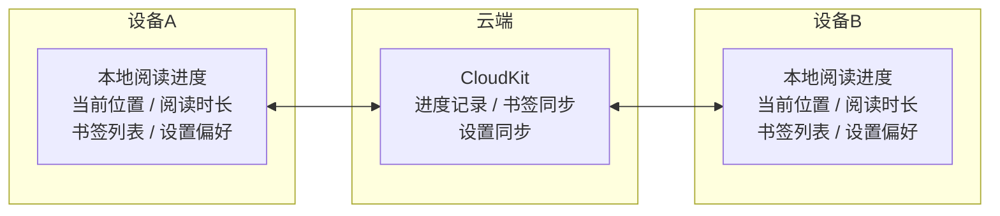

# 基础阅读器功能设计文档

## 文档信息

| 项目 | 内容 |
|------|------|
| 功能模块 | 基础阅读器功能 (Basic Reader Features) |
| 文档版本 | 1.0 |
| 最后更新 | 2024年12月 |
| 关联文档 | advanced-reader-design.md, reader-engine.md |

---

## 1. 功能概述

### 1.1 核心目标

提供完整的、符合市场成熟商业阅读器标准的基础功能，确保用户获得舒适、高效的阅读体验。

### 1.2 功能全景图

```
┌─────────────────────────────────────────────────────────────────┐
│                      基础阅读器功能                              │
├─────────────────────────────────────────────────────────────────┤
│                                                                 │
│  ┌──────────────────────────────────────────────────────────┐  │
│  │                      核心阅读功能                         │  │
│  │                                                          │  │
│  │  ┌─────────────┐  ┌─────────────┐  ┌─────────────┐      │  │
│  │  │  页面导航    │  │  目录导航    │  │  搜索功能    │      │  │
│  │  │             │  │             │  │             │      │  │
│  │  │ • 翻页手势  │  │ • 章节目录  │  │ • 全文搜索  │      │  │
│  │  │ • 页码跳转  │  │ • 书签列表  │  │ • 高亮搜索  │      │  │
│  │  │ • 进度条   │  │ • 笔记列表  │  │ • 历史记录  │      │  │
│  │  └─────────────┘  └─────────────┘  └─────────────┘      │  │
│  │                                                          │  │
│  └──────────────────────────────────────────────────────────┘  │
│                                                                 │
│  ┌──────────────────────────────────────────────────────────┐  │
│  │                      显示设置                             │  │
│  │                                                          │  │
│  │  ┌─────────────┐  ┌─────────────┐  ┌─────────────┐      │  │
│  │  │  字体设置    │  │  主题设置    │  │  版面设置    │      │  │
│  │  │             │  │             │  │             │      │  │
│  │  │ • 字体选择  │  │ • 日间模式  │  │ • 页边距   │      │  │
│  │  │ • 字号调节  │  │ • 夜间模式  │  │ • 行间距   │      │  │
│  │  │ • 字重选择  │  │ • 护眼模式  │  │ • 段间距   │      │  │
│  │  │ • 字体粗细  │  │ • 自定义色  │  │ • 文字对齐  │      │  │
│  │  └─────────────┘  └─────────────┘  └─────────────┘      │  │
│  │                                                          │  │
│  └──────────────────────────────────────────────────────────┘  │
│                                                                 │
│  ┌──────────────────────────────────────────────────────────┐  │
│  │                      阅读辅助                             │  │
│  │                                                          │  │
│  │  ┌─────────────┐  ┌─────────────┐  ┌─────────────┐      │  │
│  │  │  翻译词典    │  │  阅读统计    │  │  阅读设置    │      │  │
│  │  │             │  │             │  │             │      │  │
│  │  │ • 划词翻译  │  │ • 阅读时间  │  │ • 翻页动画  │      │  │
│  │  │ • 整句翻译  │  │ • 阅读进度  │  │ • 屏幕常亮  │      │  │
│  │  │ • 内置词典  │  │ • 阅读速度  │  │ • 音量翻页  │      │  │
│  │  │ • 生词本   │  │ • 阅读目标  │  │ • 方向锁定  │      │  │
│  │  └─────────────┘  └─────────────┘  └─────────────┘      │  │
│  │                                                          │  │
│  └──────────────────────────────────────────────────────────┘  │
│                                                                 │
│  ┌──────────────────────────────────────────────────────────┐  │
│  │                      书籍管理                             │  │
│  │                                                          │  │
│  │  ┌─────────────┐  ┌─────────────┐  ┌─────────────┐      │  │
│  │  │  书架管理    │  │  阅读进度    │  │  数据同步    │      │  │
│  │  │             │  │             │  │             │      │  │
│  │  │ • 书架分类  │  │ • 进度记录  │  │ • 云端同步  │      │  │
│  │  │ • 书籍排序  │  │ • 多设备同步│  │ • 备份恢复  │      │  │
│  │  │ • 批量管理  │  │ • 阅读历史  │  │ • 导入导出  │      │  │
│  │  └─────────────┘  └─────────────┘  └─────────────┘      │  │
│  │                                                          │  │
│  └──────────────────────────────────────────────────────────┘  │
│                                                                 │
└─────────────────────────────────────────────────────────────────┘
```

---

## 2. 系统架构

### 2.1 整体架构图



---

## 3. 页面导航系统

### 3.1 翻页方式

```
┌─────────────────────────────────────────────────────────────────┐
│                      翻页方式设计                                │
├─────────────────────────────────────────────────────────────────┤
│                                                                 │
│  支持的翻页方式:                                                 │
│                                                                 │
│  ┌──────────────────────────────────────────────────────────┐  │
│  │  1. 点击翻页                                              │  │
│  │  ┌─────────────────────────────────────────────────┐    │  │
│  │  │  ┌─────┬───────────────────────┬─────┐          │    │  │
│  │  │  │     │                       │     │          │    │  │
│  │  │  │  ◀  │      阅读区域        │  ▶  │          │    │  │
│  │  │  │上一页│                       │下一页│          │    │  │
│  │  │  │     │                       │     │          │    │  │
│  │  │  └─────┴───────────────────────┴─────┘          │    │  │
│  │  │                                                  │    │  │
│  │  │  左侧1/3区域: 上一页                             │    │  │
│  │  │  右侧1/3区域: 下一页                             │    │  │
│  │  │  中间区域: 显示/隐藏工具栏                       │    │  │
│  │  └─────────────────────────────────────────────────┘    │  │
│  └──────────────────────────────────────────────────────────┘  │
│                                                                 │
│  ┌──────────────────────────────────────────────────────────┐  │
│  │  2. 滑动翻页                                              │  │
│  │  ┌─────────────────────────────────────────────────┐    │  │
│  │  │                                                 │    │  │
│  │  │  ←── 左滑: 下一页                               │    │  │
│  │  │  ──→ 右滑: 上一页                               │    │  │
│  │  │  ↑ 上滑: 下一页 (滚动模式)                      │    │  │
│  │  │  ↓ 下滑: 上一页 (滚动模式)                      │    │  │
│  │  │                                                 │    │  │
│  │  └─────────────────────────────────────────────────┘    │  │
│  └──────────────────────────────────────────────────────────┘  │
│                                                                 │
│  ┌──────────────────────────────────────────────────────────┐  │
│  │  3. 音量键翻页 (可选)                                     │  │
│  │  ┌─────────────────────────────────────────────────┐    │  │
│  │  │                                                 │    │  │
│  │  │  音量+ : 上一页                                  │    │  │
│  │  │  音量- : 下一页                                  │    │  │
│  │  │                                                 │    │  │
│  │  └─────────────────────────────────────────────────┘    │  │
│  └──────────────────────────────────────────────────────────┘  │
│                                                                 │
└─────────────────────────────────────────────────────────────────┘
```

### 3.2 翻页动画

| 动画类型 | 描述 | 适用场景 |
|----------|------|----------|
| 滑动切换 | 页面左右滑动 | 默认翻页 |
| 仿真翻页 | 模拟真实书页翻动 | 沉浸式阅读 |
| 淡入淡出 | 页面渐变切换 | 护眼模式 |
| 无动画 | 直接切换 | 快速浏览 |
| 上下滚动 | 连续滚动 | 长文阅读 |

### 3.3 进度控制

```
┌─────────────────────────────────────────────────────────────────┐
│                      进度控制设计                                │
├─────────────────────────────────────────────────────────────────┤
│                                                                 │
│  底部进度条:                                                     │
│  ┌─────────────────────────────────────────────────────────┐   │
│  │                                                         │   │
│  │  ┌─────────────────────────────────────────────────┐   │   │
│  │  │ 第3章                                           │   │   │
│  │  │ ════════════●══════════════════════════════════ │   │   │
│  │  │ P.45                                     P.320  │   │   │
│  │  └─────────────────────────────────────────────────┘   │   │
│  │                                                         │   │
│  │  功能:                                                  │   │
│  │  • 拖动滑块快速跳转                                     │   │
│  │  • 显示当前页码/总页码                                  │   │
│  │  • 显示当前章节名                                       │   │
│  │  • 实时预览目标位置                                     │   │
│  │                                                         │   │
│  └─────────────────────────────────────────────────────────┘   │
│                                                                 │
│  页码跳转:                                                       │
│  ┌─────────────────────────────────────────────────────────┐   │
│  │                                                         │   │
│  │  ┌──────────────────────────────────┐                  │   │
│  │  │  跳转到页码                       │                  │   │
│  │  │                                   │                  │   │
│  │  │  [  45  ] / 320                  │                  │   │
│  │  │                                   │                  │   │
│  │  │          [取消]  [跳转]          │                  │   │
│  │  └──────────────────────────────────┘                  │   │
│  │                                                         │   │
│  └─────────────────────────────────────────────────────────┘   │
│                                                                 │
└─────────────────────────────────────────────────────────────────┘
```

---

## 4. 目录导航系统

### 4.1 目录视图设计

```
┌─────────────────────────────────────────────────────────────────┐
│                      目录视图设计                                │
├─────────────────────────────────────────────────────────────────┤
│                                                                 │
│  ┌─────────────────────────────────────────────────────────┐   │
│  │  ← 目录                                                  │   │
│  ├─────────────────────────────────────────────────────────┤   │
│  │                                                         │   │
│  │  [目录]  [书签]  [笔记]  [高亮]                         │   │
│  │    ●                                                    │   │
│  │                                                         │   │
│  │  ─────────────────────────────────────────────────────  │   │
│  │                                                         │   │
│  │  封面                                            P.1    │   │
│  │  序言                                            P.3    │   │
│  │  ▼ 第一部分: 起源                                       │   │
│  │     第一章: 开端                              ● P.15   │   │
│  │     第二章: 觉醒                                P.42    │   │
│  │     第三章: 冲突                                P.78    │   │
│  │  ▶ 第二部分: 发展                                       │   │
│  │  ▶ 第三部分: 高潮                                       │   │
│  │  ▶ 第四部分: 结局                                       │   │
│  │  后记                                          P.298    │   │
│  │  致谢                                          P.305    │   │
│  │                                                         │   │
│  └─────────────────────────────────────────────────────────┘   │
│                                                                 │
│  功能说明:                                                       │
│  ┌─────────────────────────────────────────────────────────┐   │
│  │  • ● 标记当前阅读位置                                   │   │
│  │  • ▶/▼ 折叠/展开子章节                                  │   │
│  │  • 点击章节名直接跳转                                   │   │
│  │  • 支持嵌套多级目录                                     │   │
│  │  • 书签/笔记/高亮分Tab显示                              │   │
│  └─────────────────────────────────────────────────────────┘   │
│                                                                 │
└─────────────────────────────────────────────────────────────────┘
```

### 4.2 目录数据模型

```
┌─────────────────────────────────────────────────────────────────┐
│                      目录数据模型                                │
├─────────────────────────────────────────────────────────────────┤
│                                                                 │
│  TOCItem (目录项)                                                │
│  ├── id: UUID                         // 唯一标识               │
│  ├── title: String                    // 章节标题               │
│  ├── href: String                     // 内容链接               │
│  ├── cfi: String                      // CFI定位                │
│  ├── level: Int                       // 层级 (0为顶级)         │
│  ├── pageNumber: Int?                 // 页码 (如有)            │
│  ├── children: [TOCItem]              // 子章节                 │
│  └── isExpanded: Bool                 // 是否展开               │
│                                                                 │
│  目录树结构示例:                                                 │
│  ┌─────────────────────────────────────────────────────────┐   │
│  │                                                         │   │
│  │  TOC                                                    │   │
│  │  ├── Cover (level: 0)                                  │   │
│  │  ├── Preface (level: 0)                                │   │
│  │  ├── Part 1 (level: 0)                                 │   │
│  │  │   ├── Chapter 1 (level: 1)                          │   │
│  │  │   │   ├── Section 1.1 (level: 2)                    │   │
│  │  │   │   └── Section 1.2 (level: 2)                    │   │
│  │  │   └── Chapter 2 (level: 1)                          │   │
│  │  └── Part 2 (level: 0)                                 │   │
│  │                                                         │   │
│  └─────────────────────────────────────────────────────────┘   │
│                                                                 │
└─────────────────────────────────────────────────────────────────┘
```

---

## 5. 搜索功能

### 5.1 搜索界面设计

```
┌─────────────────────────────────────────────────────────────────┐
│                      搜索界面设计                                │
├─────────────────────────────────────────────────────────────────┤
│                                                                 │
│  ┌─────────────────────────────────────────────────────────┐   │
│  │  ← 搜索                                                  │   │
│  ├─────────────────────────────────────────────────────────┤   │
│  │                                                         │   │
│  │  ┌─────────────────────────────────────────────────┐   │   │
│  │  │ 🔍 输入关键词搜索...                       ✕   │   │   │
│  │  └─────────────────────────────────────────────────┘   │   │
│  │                                                         │   │
│  │  搜索选项:                                              │   │
│  │  ☑️ 区分大小写  ☐ 全词匹配  ☐ 正则表达式             │   │
│  │                                                         │   │
│  │  ─────────────────────────────────────────────────────  │   │
│  │                                                         │   │
│  │  找到 15 个结果 (用时 0.3秒)                            │   │
│  │                                                         │   │
│  │  ┌─────────────────────────────────────────────────┐   │   │
│  │  │  第一章: 开端                            P.15   │   │   │
│  │  │  "...the [keyword] appeared suddenly in..."    │   │   │
│  │  └─────────────────────────────────────────────────┘   │   │
│  │                                                         │   │
│  │  ┌─────────────────────────────────────────────────┐   │   │
│  │  │  第二章: 觉醒                            P.48   │   │   │
│  │  │  "...another [keyword] was found..."           │   │   │
│  │  └─────────────────────────────────────────────────┘   │   │
│  │                                                         │   │
│  │  ┌─────────────────────────────────────────────────┐   │   │
│  │  │  第三章: 冲突                            P.89   │   │   │
│  │  │  "...the [keyword] grew stronger..."           │   │   │
│  │  └─────────────────────────────────────────────────┘   │   │
│  │                                                         │   │
│  └─────────────────────────────────────────────────────────┘   │
│                                                                 │
└─────────────────────────────────────────────────────────────────┘
```

### 5.2 搜索功能特性

| 功能 | 描述 | 实现方式 |
|------|------|----------|
| 全文搜索 | 搜索整本书籍内容 | 预建索引 + 实时搜索 |
| 高亮显示 | 搜索结果高亮 | CSS注入 |
| 上下文预览 | 显示关键词前后文 | 截取文本片段 |
| 搜索历史 | 保存最近搜索 | UserDefaults |
| 快速导航 | 点击结果跳转 | CFI定位 |
| 结果计数 | 显示匹配数量 | 实时统计 |

### 5.3 搜索结果导航

```
┌─────────────────────────────────────────────────────────────────┐
│                      搜索结果导航                                │
├─────────────────────────────────────────────────────────────────┤
│                                                                 │
│  页面内搜索导航条:                                               │
│  ┌─────────────────────────────────────────────────────────┐   │
│  │                                                         │   │
│  │  ┌─────────────────────────────────────────────────┐   │   │
│  │  │  "keyword"           3/15        [◀] [▶] [✕]   │   │   │
│  │  └─────────────────────────────────────────────────┘   │   │
│  │                                                         │   │
│  │  功能:                                                  │   │
│  │  • 显示当前结果序号 / 总数                              │   │
│  │  • ◀ ▶ 按钮跳转上/下一个结果                           │   │
│  │  • ✕ 关闭搜索导航                                      │   │
│  │  • 当前结果位置高亮标记                                 │   │
│  │                                                         │   │
│  └─────────────────────────────────────────────────────────┘   │
│                                                                 │
└─────────────────────────────────────────────────────────────────┘
```

---

## 6. 显示设置系统

### 6.1 字体设置

```
┌─────────────────────────────────────────────────────────────────┐
│                      字体设置界面                                │
├─────────────────────────────────────────────────────────────────┤
│                                                                 │
│  ┌─────────────────────────────────────────────────────────┐   │
│  │  Aa 字体设置                                             │   │
│  ├─────────────────────────────────────────────────────────┤   │
│  │                                                         │   │
│  │  字体                                                   │   │
│  │  ┌─────────────────────────────────────────────────┐   │   │
│  │  │ ○ 系统默认                                      │   │   │
│  │  │ ● Georgia                                       │   │   │
│  │  │ ○ Palatino                                      │   │   │
│  │  │ ○ Times New Roman                               │   │   │
│  │  │ ○ Helvetica                                     │   │   │
│  │  │ ○ 苹方 (PingFang)                               │   │   │
│  │  │ ○ 思源宋体                                      │   │   │
│  │  └─────────────────────────────────────────────────┘   │   │
│  │                                                         │   │
│  │  字号                                                   │   │
│  │  ┌─────────────────────────────────────────────────┐   │   │
│  │  │  A-  ────────────●──────────────  A+            │   │   │
│  │  │                  18pt                           │   │   │
│  │  └─────────────────────────────────────────────────┘   │   │
│  │                                                         │   │
│  │  字重                                                   │   │
│  │  ┌─────────────────────────────────────────────────┐   │   │
│  │  │  [常规]  [中等]  [粗体]                         │   │   │
│  │  │    ●                                            │   │   │
│  │  └─────────────────────────────────────────────────┘   │   │
│  │                                                         │   │
│  │  预览                                                   │   │
│  │  ┌─────────────────────────────────────────────────┐   │   │
│  │  │                                                 │   │   │
│  │  │  The quick brown fox jumps over the lazy dog.  │   │   │
│  │  │  敏捷的棕色狐狸跳过了懒惰的狗。                 │   │   │
│  │  │                                                 │   │   │
│  │  └─────────────────────────────────────────────────┘   │   │
│  │                                                         │   │
│  └─────────────────────────────────────────────────────────┘   │
│                                                                 │
└─────────────────────────────────────────────────────────────────┘
```

### 6.2 支持的字体列表

| 字体名称 | 类型 | 适用语言 | 特点 |
|----------|------|----------|------|
| Georgia | 衬线 | 英文 | 经典优雅 |
| Palatino | 衬线 | 英文 | 传统书籍风格 |
| Times New Roman | 衬线 | 英文 | 正式文档 |
| Helvetica | 无衬线 | 英文 | 现代简洁 |
| San Francisco | 无衬线 | 多语言 | 系统默认 |
| PingFang SC | 无衬线 | 中文 | 苹果官方中文 |
| Source Han Serif | 衬线 | 中日韩 | 开源宋体 |
| OpenDyslexic | 无衬线 | 英文 | 阅读障碍友好 |

### 6.3 主题设置

```
┌─────────────────────────────────────────────────────────────────┐
│                      主题设置界面                                │
├─────────────────────────────────────────────────────────────────┤
│                                                                 │
│  ┌─────────────────────────────────────────────────────────┐   │
│  │  🎨 主题设置                                             │   │
│  ├─────────────────────────────────────────────────────────┤   │
│  │                                                         │   │
│  │  预设主题                                               │   │
│  │  ┌─────────────────────────────────────────────────┐   │   │
│  │  │                                                 │   │   │
│  │  │  ┌─────┐  ┌─────┐  ┌─────┐  ┌─────┐  ┌─────┐ │   │   │
│  │  │  │ ☀️  │  │ 🌙  │  │ 📖  │  │ 🍃  │  │ ⚙️  │ │   │   │
│  │  │  │白色 │  │夜间 │  │泛黄 │  │护眼 │  │自定义│ │   │   │
│  │  │  │  ●  │  │     │  │     │  │     │  │     │ │   │   │
│  │  │  └─────┘  └─────┘  └─────┘  └─────┘  └─────┘ │   │   │
│  │  │                                                 │   │   │
│  │  └─────────────────────────────────────────────────┘   │   │
│  │                                                         │   │
│  │  自动切换                                               │   │
│  │  ┌─────────────────────────────────────────────────┐   │   │
│  │  │  跟随系统                                [ON 🔵] │   │   │
│  │  │  日出/日落自动切换                       [OFF⚪] │   │   │
│  │  └─────────────────────────────────────────────────┘   │   │
│  │                                                         │   │
│  │  亮度                                                   │   │
│  │  ┌─────────────────────────────────────────────────┐   │   │
│  │  │  🔅 ─────────────●────────────── 🔆             │   │   │
│  │  └─────────────────────────────────────────────────┘   │   │
│  │                                                         │   │
│  └─────────────────────────────────────────────────────────┘   │
│                                                                 │
└─────────────────────────────────────────────────────────────────┘
```

### 6.4 主题配置表

| 主题 | 背景色 | 文字色 | 适用场景 |
|------|--------|--------|----------|
| 白色 (日间) | #FFFFFF | #1A1A1A | 明亮环境 |
| 夜间 (深色) | #1C1C1E | #E5E5E5 | 夜间/暗环境 |
| 泛黄 (羊皮纸) | #F4ECD8 | #3D3D3D | 长时间阅读 |
| 护眼 (绿色) | #C7EDCC | #2D4A32 | 减少眼睛疲劳 |
| 深棕 (复古) | #2D2318 | #D4C5B0 | 复古风格 |

### 6.5 版面设置

```
┌─────────────────────────────────────────────────────────────────┐
│                      版面设置界面                                │
├─────────────────────────────────────────────────────────────────┤
│                                                                 │
│  ┌─────────────────────────────────────────────────────────┐   │
│  │  📐 版面设置                                             │   │
│  ├─────────────────────────────────────────────────────────┤   │
│  │                                                         │   │
│  │  页边距                                                 │   │
│  │  ┌─────────────────────────────────────────────────┐   │   │
│  │  │  窄  ───────●─────────────  宽                   │   │   │
│  │  └─────────────────────────────────────────────────┘   │   │
│  │                                                         │   │
│  │  行间距                                                 │   │
│  │  ┌─────────────────────────────────────────────────┐   │   │
│  │  │  紧凑 ─────────●───────────  宽松                │   │   │
│  │  │                1.5x                              │   │   │
│  │  └─────────────────────────────────────────────────┘   │   │
│  │                                                         │   │
│  │  段间距                                                 │   │
│  │  ┌─────────────────────────────────────────────────┐   │   │
│  │  │  小  ─────────────●─────────  大                 │   │   │
│  │  └─────────────────────────────────────────────────┘   │   │
│  │                                                         │   │
│  │  文字对齐                                               │   │
│  │  ┌─────────────────────────────────────────────────┐   │   │
│  │  │  [≡ 左对齐]  [≡ 两端对齐]                       │   │   │
│  │  │      ●                                          │   │   │
│  │  └─────────────────────────────────────────────────┘   │   │
│  │                                                         │   │
│  │  阅读方向                                               │   │
│  │  ┌─────────────────────────────────────────────────┐   │   │
│  │  │  ○ 横向 (从左到右)                              │   │   │
│  │  │  ○ 竖向 (从上到下) - 适用于部分中文书籍         │   │   │
│  │  └─────────────────────────────────────────────────┘   │   │
│  │                                                         │   │
│  └─────────────────────────────────────────────────────────┘   │
│                                                                 │
└─────────────────────────────────────────────────────────────────┘
```

---

## 7. 翻译与词典

### 7.1 划词功能

```
┌─────────────────────────────────────────────────────────────────┐
│                      划词功能设计                                │
├─────────────────────────────────────────────────────────────────┤
│                                                                 │
│  选中文本后的选项菜单:                                           │
│  ┌─────────────────────────────────────────────────────────┐   │
│  │                                                         │   │
│  │         "selected word"                                 │   │
│  │               ▲                                         │   │
│  │    ┌──────────┴──────────┐                             │   │
│  │    │  📖 查词  📝 翻译    │                             │   │
│  │    │  📋 复制  🔍 搜索    │                             │   │
│  │    └─────────────────────┘                             │   │
│  │                                                         │   │
│  └─────────────────────────────────────────────────────────┘   │
│                                                                 │
│  词典弹窗:                                                       │
│  ┌─────────────────────────────────────────────────────────┐   │
│  │                                                         │   │
│  │  ┌─────────────────────────────────────────────────┐   │   │
│  │  │  ephemeral                              [🔊]    │   │   │
│  │  │  /ɪˈfem(ə)rəl/                                 │   │   │
│  │  │                                                 │   │   │
│  │  │  adj. 短暂的，瞬息的                           │   │   │
│  │  │                                                 │   │   │
│  │  │  ─────────────────────────────────────────────  │   │   │
│  │  │  例句:                                          │   │   │
│  │  │  "Fame is ephemeral."                          │   │   │
│  │  │  名声是短暂的。                                │   │   │
│  │  │                                                 │   │   │
│  │  │  ─────────────────────────────────────────────  │   │   │
│  │  │  同义词: transient, fleeting, brief            │   │   │
│  │  │  反义词: permanent, eternal, lasting           │   │   │
│  │  │                                                 │   │   │
│  │  │          [➕ 加入生词本]  [🔗 更多]             │   │   │
│  │  │                                                 │   │   │
│  │  └─────────────────────────────────────────────────┘   │   │
│  │                                                         │   │
│  └─────────────────────────────────────────────────────────┘   │
│                                                                 │
└─────────────────────────────────────────────────────────────────┘
```

### 7.2 翻译功能

```
┌─────────────────────────────────────────────────────────────────┐
│                      翻译功能设计                                │
├─────────────────────────────────────────────────────────────────┤
│                                                                 │
│  整句翻译弹窗:                                                   │
│  ┌─────────────────────────────────────────────────────────┐   │
│  │                                                         │   │
│  │  ┌─────────────────────────────────────────────────┐   │   │
│  │  │  翻译                                      ✕   │   │   │
│  │  ├─────────────────────────────────────────────────┤   │   │
│  │  │                                                 │   │   │
│  │  │  原文:                                          │   │   │
│  │  │  "The ephemeral nature of fame often catches    │   │   │
│  │  │   ambitious people by surprise."               │   │   │
│  │  │                                                 │   │   │
│  │  │  ─────────────────────────────────────────────  │   │   │
│  │  │                                                 │   │   │
│  │  │  译文:                                          │   │   │
│  │  │  名声的短暂本质常常让雄心勃勃的人措手不及。     │   │   │
│  │  │                                                 │   │   │
│  │  │  ─────────────────────────────────────────────  │   │   │
│  │  │                                                 │   │   │
│  │  │  翻译引擎: [Apple翻译 ▼]                       │   │   │
│  │  │  目标语言: [简体中文 ▼]                        │   │   │
│  │  │                                                 │   │   │
│  │  │           [📋 复制译文]  [🔗 打开翻译App]       │   │   │
│  │  │                                                 │   │   │
│  │  └─────────────────────────────────────────────────┘   │   │
│  │                                                         │   │
│  └─────────────────────────────────────────────────────────┘   │
│                                                                 │
└─────────────────────────────────────────────────────────────────┘
```

### 7.3 生词本功能

```
┌─────────────────────────────────────────────────────────────────┐
│                      生词本功能                                  │
├─────────────────────────────────────────────────────────────────┤
│                                                                 │
│  ┌─────────────────────────────────────────────────────────┐   │
│  │  📚 生词本                              [导出] [复习]   │   │
│  ├─────────────────────────────────────────────────────────┤   │
│  │                                                         │   │
│  │  共 45 个生词  |  今日新增 3 个                         │   │
│  │                                                         │   │
│  │  ─────────────────────────────────────────────────────  │   │
│  │                                                         │   │
│  │  今天                                                   │   │
│  │  ┌─────────────────────────────────────────────────┐   │   │
│  │  │  ephemeral                         短暂的       │   │   │
│  │  │  来源: 《The Great Gatsby》P.45                │   │   │
│  │  └─────────────────────────────────────────────────┘   │   │
│  │  ┌─────────────────────────────────────────────────┐   │   │
│  │  │  ubiquitous                        无处不在的   │   │   │
│  │  │  来源: 《1984》P.23                            │   │   │
│  │  └─────────────────────────────────────────────────┘   │   │
│  │                                                         │   │
│  │  昨天                                                   │   │
│  │  ┌─────────────────────────────────────────────────┐   │   │
│  │  │  melancholy                        忧郁的       │   │   │
│  │  │  来源: 《Jane Eyre》P.112                      │   │   │
│  │  └─────────────────────────────────────────────────┘   │   │
│  │                                                         │   │
│  └─────────────────────────────────────────────────────────┘   │
│                                                                 │
└─────────────────────────────────────────────────────────────────┘
```

---

## 8. 阅读统计

### 8.1 统计面板设计

```
┌─────────────────────────────────────────────────────────────────┐
│                      阅读统计面板                                │
├─────────────────────────────────────────────────────────────────┤
│                                                                 │
│  ┌─────────────────────────────────────────────────────────┐   │
│  │  📊 阅读统计                                             │   │
│  ├─────────────────────────────────────────────────────────┤   │
│  │                                                         │   │
│  │  本书统计                                               │   │
│  │  ┌──────────┬──────────┬──────────┬──────────┐        │   │
│  │  │ 已阅读   │ 剩余     │ 阅读时间  │ 阅读速度  │        │   │
│  │  │  45%    │  55%    │  8h 32m  │ 35页/小时 │        │   │
│  │  └──────────┴──────────┴──────────┴──────────┘        │   │
│  │                                                         │   │
│  │  预计完成时间: 约 10 小时                               │   │
│  │                                                         │   │
│  │  ─────────────────────────────────────────────────────  │   │
│  │                                                         │   │
│  │  今日阅读                                               │   │
│  │  ┌─────────────────────────────────────────────────┐   │   │
│  │  │  ⏱️ 45 分钟                                     │   │   │
│  │  │  📖 23 页                                       │   │   │
│  │  │  🎯 目标: 60分钟 (完成 75%)                     │   │   │
│  │  │                                                 │   │   │
│  │  │  ████████████████████░░░░░░░                   │   │   │
│  │  └─────────────────────────────────────────────────┘   │   │
│  │                                                         │   │
│  │  本周趋势                                               │   │
│  │  ┌─────────────────────────────────────────────────┐   │   │
│  │  │     ▁▃▅▇█▅▃                                     │   │   │
│  │  │    一二三四五六日                                │   │   │
│  │  │                                                 │   │   │
│  │  │  本周总计: 4h 30m  |  平均: 38m/天              │   │   │
│  │  └─────────────────────────────────────────────────┘   │   │
│  │                                                         │   │
│  └─────────────────────────────────────────────────────────┘   │
│                                                                 │
└─────────────────────────────────────────────────────────────────┘
```

### 8.2 统计数据模型

```
┌─────────────────────────────────────────────────────────────────┐
│                      统计数据模型                                │
├─────────────────────────────────────────────────────────────────┤
│                                                                 │
│  ReadingSession (阅读会话)                                       │
│  ├── id: UUID                         // 唯一标识               │
│  ├── bookId: UUID                     // 书籍ID                 │
│  ├── startTime: Date                  // 开始时间               │
│  ├── endTime: Date                    // 结束时间               │
│  ├── duration: TimeInterval           // 持续时长 (秒)          │
│  ├── startPage: Int                   // 起始页码               │
│  ├── endPage: Int                     // 结束页码               │
│  ├── pagesRead: Int                   // 阅读页数               │
│  └── deviceId: String                 // 设备标识               │
│                                                                 │
│  ReadingStats (阅读统计)                                         │
│  ├── bookId: UUID                     // 书籍ID                 │
│  ├── totalReadingTime: TimeInterval   // 总阅读时长             │
│  ├── totalPagesRead: Int              // 总阅读页数             │
│  ├── averageSpeed: Double             // 平均阅读速度 (页/小时) │
│  ├── completionPercentage: Double     // 完成百分比             │
│  ├── lastReadDate: Date               // 最后阅读日期           │
│  ├── lastReadPosition: String         // 最后阅读位置 (CFI)     │
│  └── sessionCount: Int                // 阅读会话次数           │
│                                                                 │
│  DailyReadingGoal (每日阅读目标)                                 │
│  ├── targetMinutes: Int               // 目标分钟数             │
│  ├── targetPages: Int                 // 目标页数               │
│  ├── achievedMinutes: Int             // 已完成分钟数           │
│  ├── achievedPages: Int               // 已完成页数             │
│  └── date: Date                       // 日期                   │
│                                                                 │
└─────────────────────────────────────────────────────────────────┘
```

---

## 9. 阅读设置

### 9.1 设置选项

```
┌─────────────────────────────────────────────────────────────────┐
│                      阅读设置界面                                │
├─────────────────────────────────────────────────────────────────┤
│                                                                 │
│  ┌─────────────────────────────────────────────────────────┐   │
│  │  ⚙️ 阅读设置                                             │   │
│  ├─────────────────────────────────────────────────────────┤   │
│  │                                                         │   │
│  │  翻页与导航                                             │   │
│  │  ┌─────────────────────────────────────────────────┐   │   │
│  │  │  翻页动画                           [滑动切换 ▼]│   │   │
│  │  │  点击区域翻页                            [ON 🔵]│   │   │
│  │  │  音量键翻页                             [OFF⚪]│   │   │
│  │  │  显示页码                                [ON 🔵]│   │   │
│  │  └─────────────────────────────────────────────────┘   │   │
│  │                                                         │   │
│  │  屏幕与显示                                             │   │
│  │  ┌─────────────────────────────────────────────────┐   │   │
│  │  │  阅读时屏幕常亮                          [ON 🔵]│   │   │
│  │  │  锁定屏幕方向                           [OFF⚪]│   │   │
│  │  │  自动调节亮度                            [ON 🔵]│   │   │
│  │  │  隐藏状态栏                             [OFF⚪]│   │   │
│  │  └─────────────────────────────────────────────────┘   │   │
│  │                                                         │   │
│  │  手势设置                                               │   │
│  │  ┌─────────────────────────────────────────────────┐   │   │
│  │  │  双指缩放字体                            [ON 🔵]│   │   │
│  │  │  上下滑动调节亮度                       [OFF⚪]│   │   │
│  │  │  双击居中                               [OFF⚪]│   │   │
│  │  └─────────────────────────────────────────────────┘   │   │
│  │                                                         │   │
│  │  其他                                                   │   │
│  │  ┌─────────────────────────────────────────────────┐   │   │
│  │  │  阅读进度提醒                           [OFF⚪]│   │   │
│  │  │  自动记录阅读位置                        [ON 🔵]│   │   │
│  │  │  退出时确认                             [OFF⚪]│   │   │
│  │  └─────────────────────────────────────────────────┘   │   │
│  │                                                         │   │
│  └─────────────────────────────────────────────────────────┘   │
│                                                                 │
└─────────────────────────────────────────────────────────────────┘
```

### 9.2 设置数据模型

```
┌─────────────────────────────────────────────────────────────────┐
│                      设置数据模型                                │
├─────────────────────────────────────────────────────────────────┤
│                                                                 │
│  ReaderSettings                                                  │
│  │                                                              │
│  ├── 显示设置 (DisplaySettings)                                 │
│  │   ├── fontFamily: String           // 字体                  │
│  │   ├── fontSize: Int                // 字号 (12-36)          │
│  │   ├── fontWeight: FontWeight       // 字重                  │
│  │   ├── lineSpacing: Double          // 行间距 (1.0-2.5)      │
│  │   ├── paragraphSpacing: Double     // 段间距                │
│  │   ├── pageMargin: PageMargin       // 页边距                │
│  │   ├── textAlignment: Alignment     // 文字对齐              │
│  │   └── theme: ThemeSettings         // 主题设置              │
│  │                                                              │
│  ├── 导航设置 (NavigationSettings)                              │
│  │   ├── pageAnimation: AnimationType // 翻页动画              │
│  │   ├── tapToTurn: Bool              // 点击翻页              │
│  │   ├── volumeKeyTurn: Bool          // 音量键翻页            │
│  │   ├── showPageNumber: Bool         // 显示页码              │
│  │   └── showProgress: Bool           // 显示进度              │
│  │                                                              │
│  ├── 屏幕设置 (ScreenSettings)                                  │
│  │   ├── keepScreenOn: Bool           // 屏幕常亮              │
│  │   ├── lockOrientation: Bool        // 锁定方向              │
│  │   ├── autoBrightness: Bool         // 自动亮度              │
│  │   ├── hideStatusBar: Bool          // 隐藏状态栏            │
│  │   └── brightness: Double           // 亮度值                │
│  │                                                              │
│  └── 手势设置 (GestureSettings)                                 │
│      ├── pinchToZoom: Bool            // 双指缩放              │
│      ├── swipeBrightness: Bool        // 滑动亮度              │
│      └── doubleTapCenter: Bool        // 双击居中              │
│                                                                 │
└─────────────────────────────────────────────────────────────────┘
```

---

## 10. 书架管理

### 10.1 书架界面

```
┌─────────────────────────────────────────────────────────────────┐
│                      书架界面设计                                │
├─────────────────────────────────────────────────────────────────┤
│                                                                 │
│  ┌─────────────────────────────────────────────────────────┐   │
│  │  📚 我的书架                        [🔍] [➕] [⋮]        │   │
│  ├─────────────────────────────────────────────────────────┤   │
│  │                                                         │   │
│  │  [全部] [阅读中] [未读] [已完成] [收藏]                 │   │
│  │    ●                                                    │   │
│  │                                                         │   │
│  │  ─────────────────────────────────────────────────────  │   │
│  │                                                         │   │
│  │  视图: [网格 ▼]        排序: [最近阅读 ▼]              │   │
│  │                                                         │   │
│  │  ┌────────────────────────────────────────────────┐    │   │
│  │  │                                                │    │   │
│  │  │  ┌─────┐  ┌─────┐  ┌─────┐  ┌─────┐          │    │   │
│  │  │  │     │  │     │  │     │  │     │          │    │   │
│  │  │  │ 📕  │  │ 📗  │  │ 📘  │  │ 📙  │          │    │   │
│  │  │  │     │  │     │  │     │  │     │          │    │   │
│  │  │  └─────┘  └─────┘  └─────┘  └─────┘          │    │   │
│  │  │  书名1     书名2     书名3     书名4          │    │   │
│  │  │  45%      未读      100%     23%            │    │   │
│  │  │                                                │    │   │
│  │  │  ┌─────┐  ┌─────┐  ┌─────┐  ┌─────┐          │    │   │
│  │  │  │     │  │     │  │     │  │ ➕  │          │    │   │
│  │  │  │ 📕  │  │ 📗  │  │ 📘  │  │添加 │          │    │   │
│  │  │  │     │  │     │  │     │  │书籍 │          │    │   │
│  │  │  └─────┘  └─────┘  └─────┘  └─────┘          │    │   │
│  │  │  书名5     书名6     书名7                    │    │   │
│  │  │                                                │    │   │
│  │  └────────────────────────────────────────────────┘    │   │
│  │                                                         │   │
│  └─────────────────────────────────────────────────────────┘   │
│                                                                 │
└─────────────────────────────────────────────────────────────────┘
```

### 10.2 书籍管理功能

| 功能 | 操作方式 | 描述 |
|------|----------|------|
| 添加书籍 | 点击➕ / 拖拽导入 | 支持EPUB格式 |
| 删除书籍 | 长按→删除 | 可选择保留阅读数据 |
| 批量管理 | 长按→进入选择模式 | 批量删除/移动 |
| 创建分类 | 设置→书架分类 | 自定义分类文件夹 |
| 移动到分类 | 长按→移动 | 将书籍归类 |
| 搜索书籍 | 点击🔍 | 搜索书名/作者 |
| 排序 | 点击排序选项 | 按名称/日期/进度 |

### 10.3 视图模式

```
┌─────────────────────────────────────────────────────────────────┐
│                      书架视图模式                                │
├─────────────────────────────────────────────────────────────────┤
│                                                                 │
│  网格视图:                                                       │
│  ┌─────────────────────────────────────────────────────────┐   │
│  │  ┌─────┐  ┌─────┐  ┌─────┐  ┌─────┐                    │   │
│  │  │ 📕  │  │ 📗  │  │ 📘  │  │ 📙  │                    │   │
│  │  └─────┘  └─────┘  └─────┘  └─────┘                    │   │
│  │  书名      书名      书名      书名                      │   │
│  └─────────────────────────────────────────────────────────┘   │
│                                                                 │
│  列表视图:                                                       │
│  ┌─────────────────────────────────────────────────────────┐   │
│  │  ┌────┐ 书名                                           │   │
│  │  │ 📕 │ 作者名                                   45%   │   │
│  │  └────┘ 上次阅读: 2024-12-01                           │   │
│  │  ────────────────────────────────────────────────────  │   │
│  │  ┌────┐ 书名                                           │   │
│  │  │ 📗 │ 作者名                                   未读  │   │
│  │  └────┘ 添加于: 2024-11-28                             │   │
│  └─────────────────────────────────────────────────────────┘   │
│                                                                 │
└─────────────────────────────────────────────────────────────────┘
```

---

## 11. 进度同步

### 11.1 同步架构



### 11.2 冲突解决

| 冲突类型 | 解决策略 | 说明 |
|----------|----------|------|
| 进度冲突 | 取最新时间戳 | 以最近阅读位置为准 |
| 书签冲突 | 合并保留 | 两边书签都保留 |
| 设置冲突 | 取最新修改 | 以最后修改的设置为准 |
| 删除冲突 | 优先删除 | 任一设备删除则删除 |

---

## 12. 工具栏设计

### 12.1 顶部工具栏

```
┌─────────────────────────────────────────────────────────────────┐
│                      顶部工具栏设计                              │
├─────────────────────────────────────────────────────────────────┤
│                                                                 │
│  ┌─────────────────────────────────────────────────────────┐   │
│  │  ←          第三章: 冲突            🔖  🔍  ⋮           │   │
│  └─────────────────────────────────────────────────────────┘   │
│                                                                 │
│  按钮功能:                                                       │
│  ┌─────────────────────────────────────────────────────────┐   │
│  │  ←    返回书架                                          │   │
│  │  🔖   添加书签                                          │   │
│  │  🔍   搜索                                              │   │
│  │  ⋮    更多选项 (分享/设置/关于)                         │   │
│  └─────────────────────────────────────────────────────────┘   │
│                                                                 │
└─────────────────────────────────────────────────────────────────┘
```

### 12.2 底部工具栏

```
┌─────────────────────────────────────────────────────────────────┐
│                      底部工具栏设计                              │
├─────────────────────────────────────────────────────────────────┤
│                                                                 │
│  ┌─────────────────────────────────────────────────────────┐   │
│  │                                                         │   │
│  │  ═══════════════════●══════════════════════════════════ │   │
│  │  P.45                                            P.320  │   │
│  │                                                         │   │
│  │  ┌────────┬────────┬────────┬────────┬────────┐        │   │
│  │  │  📑   │   Aa   │   ☀️   │   🔊   │   📊   │        │   │
│  │  │ 目录  │  字体  │  主题  │  朗读  │  统计  │        │   │
│  │  └────────┴────────┴────────┴────────┴────────┘        │   │
│  │                                                         │   │
│  └─────────────────────────────────────────────────────────┘   │
│                                                                 │
│  按钮功能:                                                       │
│  ┌─────────────────────────────────────────────────────────┐   │
│  │  📑   打开目录/书签/笔记面板                            │   │
│  │  Aa   打开字体设置                                      │   │
│  │  ☀️   打开主题设置                                      │   │
│  │  🔊   启动朗读功能                                      │   │
│  │  📊   查看阅读统计                                      │   │
│  └─────────────────────────────────────────────────────────┘   │
│                                                                 │
└─────────────────────────────────────────────────────────────────┘
```

---

## 13. 辅助功能支持

### 13.1 VoiceOver支持

| 元素 | 辅助功能标签 | 辅助功能提示 |
|------|-------------|-------------|
| 翻页按钮 | "下一页" / "上一页" | "双击翻页" |
| 进度条 | "阅读进度，当前45%" | "上下滑动调整进度" |
| 书签按钮 | "添加书签" | "双击添加书签" |
| 目录按钮 | "目录" | "双击打开目录" |
| 字体设置 | "字体设置" | "双击调整字体" |
| 主题切换 | "当前：日间模式" | "双击切换主题" |

### 13.2 动态字体支持

```
┌─────────────────────────────────────────────────────────────────┐
│                      动态字体适配                                │
├─────────────────────────────────────────────────────────────────┤
│                                                                 │
│  系统字体大小对应:                                               │
│  ┌─────────────────────────────────────────────────────────┐   │
│  │                                                         │   │
│  │  xSmall     → 阅读字号: 12pt                           │   │
│  │  Small      → 阅读字号: 14pt                           │   │
│  │  Medium     → 阅读字号: 16pt                           │   │
│  │  Large      → 阅读字号: 18pt (默认)                    │   │
│  │  xLarge     → 阅读字号: 22pt                           │   │
│  │  xxLarge    → 阅读字号: 26pt                           │   │
│  │  xxxLarge   → 阅读字号: 32pt                           │   │
│  │                                                         │   │
│  │  用户可在此基础上进一步调整                             │   │
│  │                                                         │   │
│  └─────────────────────────────────────────────────────────┘   │
│                                                                 │
│  界面元素适配:                                                   │
│  ┌─────────────────────────────────────────────────────────┐   │
│  │                                                         │   │
│  │  当字体 > xLarge 时:                                    │   │
│  │  • 工具栏图标增大                                       │   │
│  │  • 按钮触摸区域增大                                     │   │
│  │  • 目录列表行高增加                                     │   │
│  │  • 弹窗使用全屏模式                                     │   │
│  │                                                         │   │
│  └─────────────────────────────────────────────────────────┘   │
│                                                                 │
└─────────────────────────────────────────────────────────────────┘
```

---

## 14. 数据备份与恢复

### 14.1 备份内容

| 数据类型 | 备份方式 | 恢复优先级 |
|----------|----------|------------|
| 阅读进度 | CloudKit自动同步 | 高 |
| 书签 | CloudKit自动同步 | 高 |
| 高亮笔记 | CloudKit自动同步 | 高 |
| 阅读设置 | iCloud Key-Value | 中 |
| 生词本 | CloudKit自动同步 | 中 |
| 阅读统计 | CloudKit自动同步 | 低 |
| 书籍文件 | 需用户手动导入 | - |

### 14.2 导出功能

```
┌─────────────────────────────────────────────────────────────────┐
│                      数据导出界面                                │
├─────────────────────────────────────────────────────────────────┤
│                                                                 │
│  ┌─────────────────────────────────────────────────────────┐   │
│  │  📤 导出数据                                             │   │
│  ├─────────────────────────────────────────────────────────┤   │
│  │                                                         │   │
│  │  选择导出内容:                                          │   │
│  │  ☑️ 阅读进度                                            │   │
│  │  ☑️ 书签                                                │   │
│  │  ☑️ 高亮和笔记                                          │   │
│  │  ☑️ 生词本                                              │   │
│  │  ☐ 阅读统计                                            │   │
│  │  ☐ 阅读设置                                            │   │
│  │                                                         │   │
│  │  ─────────────────────────────────────────────────────  │   │
│  │                                                         │   │
│  │  导出格式:                                              │   │
│  │  ○ JSON (完整数据，可导入)                             │   │
│  │  ○ PDF (笔记摘要，可打印)                              │   │
│  │  ○ Markdown (笔记文本)                                 │   │
│  │                                                         │   │
│  │                              [取消]  [导出]             │   │
│  │                                                         │   │
│  └─────────────────────────────────────────────────────────┘   │
│                                                                 │
└─────────────────────────────────────────────────────────────────┘
```

---

## 15. 性能优化

### 15.1 渲染优化

| 优化项 | 策略 | 效果 |
|--------|------|------|
| 分页预渲染 | 预渲染前后2页 | 翻页流畅 |
| 图片懒加载 | 可视区域才加载 | 减少内存 |
| CSS注入优化 | 合并样式更新 | 减少重绘 |
| 文本缓存 | 缓存章节文本 | 加快搜索 |

### 15.2 内存管理

```
┌─────────────────────────────────────────────────────────────────┐
│                      内存管理策略                                │
├─────────────────────────────────────────────────────────────────┤
│                                                                 │
│  页面缓存策略:                                                   │
│  ┌─────────────────────────────────────────────────────────┐   │
│  │                                                         │   │
│  │  保持在内存中:                                          │   │
│  │  • 当前页                                               │   │
│  │  • 前一页                                               │   │
│  │  • 后一页                                               │   │
│  │                                                         │   │
│  │  按需加载:                                              │   │
│  │  • 其他页面                                             │   │
│  │  • 高分辨率图片                                         │   │
│  │                                                         │   │
│  │  内存警告时释放:                                        │   │
│  │  • 非当前章节内容                                       │   │
│  │  • 搜索索引缓存                                         │   │
│  │  • 词典缓存                                             │   │
│  │                                                         │   │
│  └─────────────────────────────────────────────────────────┘   │
│                                                                 │
└─────────────────────────────────────────────────────────────────┘
```

---

## 16. 附录

### 16.1 支持的文件格式

| 格式 | 扩展名 | 支持程度 | 说明 |
|------|--------|----------|------|
| EPUB 2 | .epub | 完整支持 | 主要格式 |
| EPUB 3 | .epub | 完整支持 | 支持多媒体 |
| PDF | .pdf | 基础支持 | 后续版本 |
| MOBI | .mobi | 转换支持 | 转为EPUB |

### 16.2 系统要求

| 要求 | 最低 | 推荐 |
|------|------|------|
| iOS版本 | iOS 15.0 | iOS 17.0+ |
| 设备 | iPhone 8 | iPhone 12+ |
| 存储空间 | 100MB | 500MB+ |
| 网络 | 离线可用 | WiFi (同步) |

### 16.3 键盘快捷键 (iPad)

| 快捷键 | 功能 |
|--------|------|
| ← / → | 上/下一页 |
| ⌘ + F | 搜索 |
| ⌘ + B | 添加书签 |
| ⌘ + , | 设置 |
| Space | 下一页 |
| Shift + Space | 上一页 |

---

## 变更记录

| 版本 | 日期 | 变更内容 |
|------|------|----------|
| 1.0 | 2024-12 | 初始版本 |
