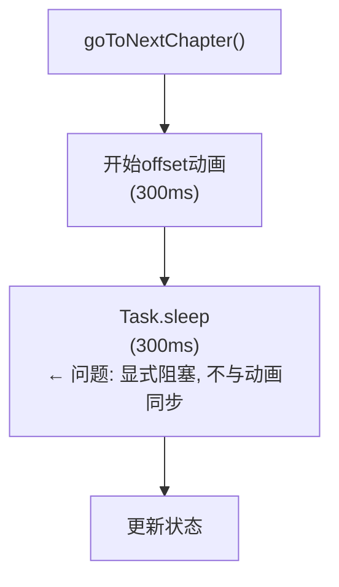
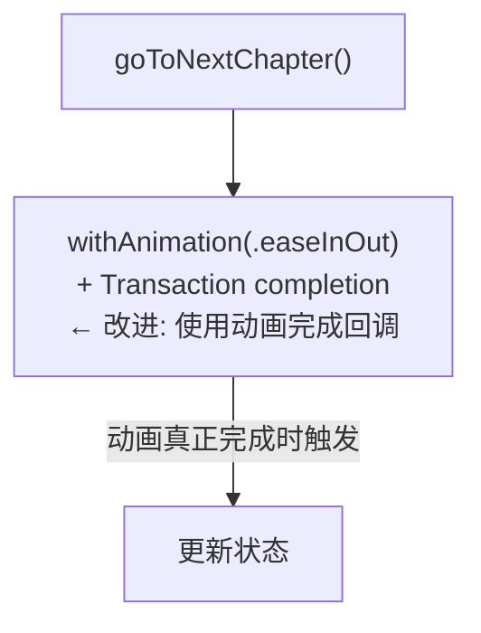
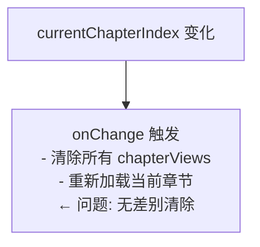
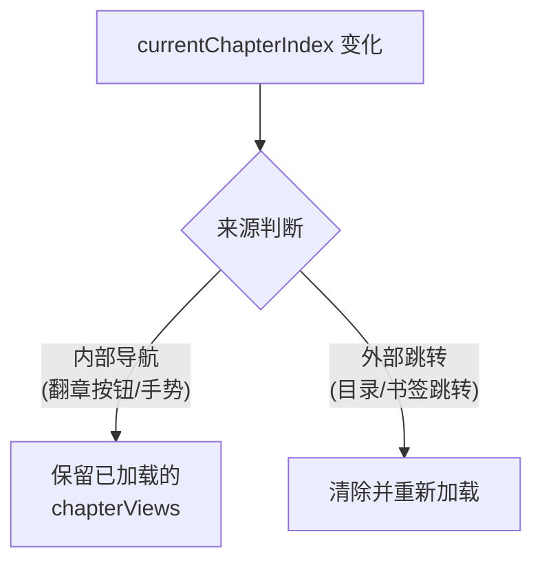
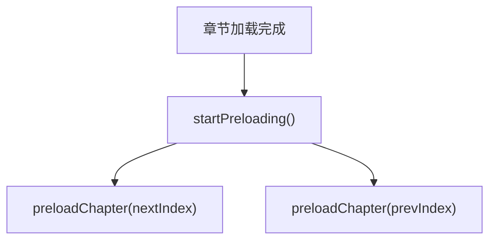

# iOS阅读器翻章流畅度优化设计方案

## 问题概述

当前翻章时存在明显的WebView切换效果（闪烁/卡顿），而章内翻页则非常流畅。

### 问题根因

```
┌─────────────────────────────────────────────────────────────┐
│                    翻章流程 (当前)                            │
├─────────────────────────────────────────────────────────────┤
│  t=0ms      │ goToNextChapter() 调用                        │
│  t=0-300ms  │ SwiftUI offset 动画 (多WebView同时移动)        │
│  t=300ms    │ Task.sleep 显式等待 ← 问题点1                  │
│  t=300ms+   │ 更新 viewModel.currentChapterIndex            │
│  t=300ms+   │ onChange 触发 ← 问题点2 (可能清除WebView)      │
│  t=300ms+   │ SwiftUI 重新渲染                              │
│  t=400ms+   │ 新WebView可见 ← 总延迟过长                     │
└─────────────────────────────────────────────────────────────┘

┌─────────────────────────────────────────────────────────────┐
│                   章内翻页流程 (流畅)                         │
├─────────────────────────────────────────────────────────────┤
│  t=0ms      │ goToNextPage() JavaScript调用                 │
│  t=0-300ms  │ CSS transform 动画 (GPU加速, 60fps)           │
│  t=300ms    │ 动画完成，页面可见                             │
│  t=300ms+   │ 异步更新Swift状态 (不影响视觉)                  │
└─────────────────────────────────────────────────────────────┘
```

### 关键差异对比

| 维度 | 翻章 (当前) | 章内翻页 |
|------|-------------|----------|
| WebView数量 | 切换2-3个实例 | 复用1个 |
| 动画引擎 | SwiftUI offset | CSS transform |
| GPU加速 | 多层合成 | 完全加速 |
| 状态同步 | Swift ↔ JS 双向 | 单向通知 |
| 显式等待 | 300ms Task.sleep | 无 |
| 感知延迟 | 400ms+ | 300ms |

---

## 方案对比

| 维度 | 方案A: 优化多WebView架构 | 方案B: 单WebView + DOM预加载 |
|------|--------------------------|------------------------------|
| 核心思路 | 改进现有架构的动画和预加载 | 重构为类似章内翻页的模式 |
| 改动范围 | PagedWebViewContainer | 阅读器核心架构 |
| 开发复杂度 | 中 | 高 |
| 效果预期 | 良好 (接近章内翻页) | 最优 (等同章内翻页) |
| 内存占用 | 较低 (按需加载WebView) | 较高 (DOM中预加载章节) |
| 风险 | 低 | 中 (需要大量测试) |
| 建议优先级 | **推荐先实施** | 后续迭代 |

---

## 方案A: 优化多WebView架构 (推荐)

### 目标

在保持现有多WebView架构的基础上，通过优化动画时序和预加载策略，使翻章体验接近章内翻页。

### 优化点总览

```
┌────────────────────────────────────────────────────────────────┐
│                      优化点分布图                               │
├────────────────────────────────────────────────────────────────┤
│                                                                │
│   PagedWebViewContainer.swift                                  │
│   ┌──────────────────────────────────────────────────────┐    │
│   │                                                      │    │
│   │  [优化1] 移除显式等待                                  │    │
│   │          Line 385: Task.sleep(300ms)                 │    │
│   │          → 改用 animation completion                  │    │
│   │                                                      │    │
│   │  [优化2] 改进onChange逻辑                              │    │
│   │          Line 196-198: 章节变化检测                   │    │
│   │          → 区分内部导航 vs 外部跳转                    │    │
│   │                                                      │    │
│   │  [优化3] 提前预加载时机                                │    │
│   │          Line 271-319: preloadChapter()              │    │
│   │          → 翻页50%时开始预加载                         │    │
│   │                                                      │    │
│   │  [优化4] WebView复用池                                 │    │
│   │          Line 40-41: chapterViews                    │    │
│   │          → 实现WebView对象池                          │    │
│   │                                                      │    │
│   └──────────────────────────────────────────────────────┘    │
│                                                                │
└────────────────────────────────────────────────────────────────┘
```

### 优化1: 移除显式等待

**当前问题**



**优化后**



### 优化2: 改进onChange逻辑

**当前问题**



**优化后**



**实现方式**

引入标志位区分导航来源：

| 场景 | 标志值 | onChange行为 |
|------|--------|--------------|
| 翻到下一章 | isInternalNavigation = true | 保留WebView，只调整offset |
| 翻到上一章 | isInternalNavigation = true | 保留WebView，只调整offset |
| 目录跳转 | isInternalNavigation = false | 清除并重新加载 |
| 书签跳转 | isInternalNavigation = false | 清除并重新加载 |

### 优化3: 提前预加载时机

**当前预加载流程**



**优化后预加载流程**

```
┌─────────────────────────────────────────────────────────────┐
│                    智能预加载触发时机                         │
├─────────────────────────────────────────────────────────────┤
│                                                             │
│  章节页面布局:                                               │
│  ┌─────┬─────┬─────┬─────┬─────┐                           │
│  │  1  │  2  │  3  │  4  │  5  │  (共5页)                   │
│  └─────┴─────┴─────┴─────┴─────┘                           │
│                                                             │
│  触发条件:                                                   │
│  ├─ 翻到第4页 (80%) → 预加载下一章                           │
│  ├─ 翻到第2页 (40%) → 预加载上一章 (如果从后往前翻)           │
│  └─ 章节加载完成 → 预加载相邻章节 (保持原有逻辑)              │
│                                                             │
└─────────────────────────────────────────────────────────────┘
```

**预加载状态管理**

| 状态 | 描述 | 内存占用 |
|------|------|----------|
| NotLoaded | 未加载 | 0 |
| Preloading | 正在预加载 | 低 (HTML获取中) |
| Preloaded | 已预加载，WebView待命 | 中 |
| Active | 当前显示 | 中 |
| Cached | 已浏览过，保留缓存 | 中 |

### 优化4: WebView复用池

**当前WebView生命周期**


**优化后: 对象池模式**

```
┌─────────────────────────────────────────────────────────────┐
│                     WebView 对象池                           │
├─────────────────────────────────────────────────────────────┤
│                                                             │
│   Pool (最多3个WebView)                                      │
│   ┌─────────┐  ┌─────────┐  ┌─────────┐                    │
│   │WebView 1│  │WebView 2│  │WebView 3│                    │
│   │ (空闲)   │  │ (使用中) │  │ (使用中) │                    │
│   └────┬────┘  └─────────┘  └─────────┘                    │
│        │                                                    │
│        ▼                                                    │
│   需要新章节时:                                               │
│   1. 从池中获取空闲WebView                                    │
│   2. 加载新章节HTML                                          │
│   3. 使用完毕后归还池中 (不销毁)                               │
│                                                             │
└─────────────────────────────────────────────────────────────┘
```

**收益**

| 指标 | 当前 | 优化后 |
|------|------|--------|
| WebView创建次数 | 每章1次 | 全书最多3次 |
| 内存分配开销 | 高 | 低 |
| 初始化延迟 | 每次50-100ms | 仅首次 |

### 优化后翻章流程

```
┌─────────────────────────────────────────────────────────────┐
│                   优化后翻章流程                              │
├─────────────────────────────────────────────────────────────┤
│                                                             │
│  t=0ms      │ goToNextChapter() 调用                        │
│             │ - 设置 isInternalNavigation = true            │
│             │ - 下一章WebView已预加载就绪                     │
│  t=0-250ms  │ offset动画 (使用completion回调)                │
│  t=250ms    │ 动画完成回调触发                               │
│             │ - 更新 currentChapterIndex                    │
│             │ - onChange检测到内部导航，保留WebView           │
│             │ - 重置 isInternalNavigation = false           │
│  t=250ms+   │ 触发下下章预加载                               │
│                                                             │
│  总延迟: ~250ms (减少约40%)                                  │
│                                                             │
└─────────────────────────────────────────────────────────────┘
```

---

## 方案B: 单WebView + DOM预加载 (后续迭代)

### 核心思路

将翻章逻辑改造成与章内翻页相同的模式：在单个WebView的DOM中预加载相邻章节内容。

### 架构对比

```
当前架构 (多WebView):

┌─────────────┐  ┌─────────────┐  ┌─────────────┐
│  WebView 1  │  │  WebView 2  │  │  WebView 3  │
│  (上一章)    │  │  (当前章)    │  │  (下一章)    │
│             │  │             │  │             │
│ ┌─────────┐ │  │ ┌─────────┐ │  │ ┌─────────┐ │
│ │  DOM    │ │  │ │  DOM    │ │  │ │  DOM    │ │
│ └─────────┘ │  │ └─────────┘ │  │ └─────────┘ │
└─────────────┘  └─────────────┘  └─────────────┘
      ↑                ↑                ↑
      └────────────────┼────────────────┘
                       │
              SwiftUI offset 动画

方案B架构 (单WebView):

┌─────────────────────────────────────────────────────────────┐
│                      单一 WebView                            │
│  ┌────────────────────────────────────────────────────────┐ │
│  │                        DOM                             │ │
│  │  ┌──────────┐  ┌──────────┐  ┌──────────┐             │ │
│  │  │ 上一章    │  │ 当前章    │  │ 下一章    │             │ │
│  │  │ (隐藏)    │  │ (显示)    │  │ (隐藏)    │             │ │
│  │  └──────────┘  └──────────┘  └──────────┘             │ │
│  │       ↑              ↑              ↑                  │ │
│  │       └──────────────┼──────────────┘                  │ │
│  │                      │                                 │ │
│  │             CSS transform 动画                          │ │
│  └────────────────────────────────────────────────────────┘ │
└─────────────────────────────────────────────────────────────┘
```

### 实现要点

| 组件 | 变更内容 |
|------|----------|
| HTML模板 | 支持多章节容器，类似pages-container |
| JavaScript | 新增章节切换函数，复用slideTo动画逻辑 |
| Swift层 | 简化为单WebView管理，通过JS Bridge预加载章节 |
| 预加载 | 通过postMessage向WebView发送章节HTML |

### 优势

- 翻章与翻页完全一致的60fps体验
- 无WebView切换开销
- 简化Swift侧状态管理

### 挑战

- 需要重构HTML模板和JavaScript
- 内存管理（多章节DOM需要及时清理）
- 章节HTML注入的时机控制
- 大量回归测试

### 建议

方案B可作为后续版本的优化方向，当前优先实施方案A。

---

## 实施计划

### 阶段1: 方案A实施

```
┌────────────────────────────────────────────────────────────┐
│  步骤1: 移除显式等待                                         │
│  - 文件: PagedWebViewContainer.swift                       │
│  - 改动: 使用Transaction completion替代Task.sleep           │
├────────────────────────────────────────────────────────────┤
│  步骤2: 改进onChange逻辑                                     │
│  - 文件: PagedWebViewContainer.swift                       │
│  - 改动: 添加isInternalNavigation标志位                     │
├────────────────────────────────────────────────────────────┤
│  步骤3: 优化预加载时机                                       │
│  - 文件: PagedWebViewContainer.swift                       │
│  - 改动: 翻页进度触发预加载                                  │
├────────────────────────────────────────────────────────────┤
│  步骤4: 实现WebView复用池                                    │
│  - 文件: 新增 WebViewPool.swift                            │
│  - 改动: PagedWebViewContainer使用对象池                    │
├────────────────────────────────────────────────────────────┤
│  步骤5: 测试验证                                            │
│  - 翻章流畅度测试                                           │
│  - 内存占用测试                                             │
│  - 边界情况测试 (首章/末章)                                  │
└────────────────────────────────────────────────────────────┘
```

### 阶段2: 方案B评估 (后续)

根据方案A的效果评估是否需要进一步实施方案B。

---

## 验收标准

| 指标 | 当前值 | 目标值 |
|------|--------|--------|
| 翻章感知延迟 | 400ms+ | <300ms |
| 翻章帧率 | 不稳定 | 稳定60fps |
| WebView创建频率 | 每章1次 | 全书最多3次 |
| 用户感知 | 明显切换感 | 接近章内翻页 |

---

## 文件变更清单

| 文件 | 变更类型 | 说明 |
|------|----------|------|
| PagedWebViewContainer.swift | 修改 | 优化1-3的主要改动位置 |
| WebViewPool.swift | 新增 | WebView对象池实现 |
| ReaderContentView.swift | 修改 | 配合预加载时机优化 |

---

## 风险与缓解

| 风险 | 影响 | 缓解措施 |
|------|------|----------|
| 动画completion回调不准确 | 状态更新时机偏差 | 添加fallback超时机制 |
| 对象池WebView状态残留 | 显示异常 | 复用前清理loadHTMLString |
| 预加载时机过早 | 内存占用增加 | 设置预加载上限 |
