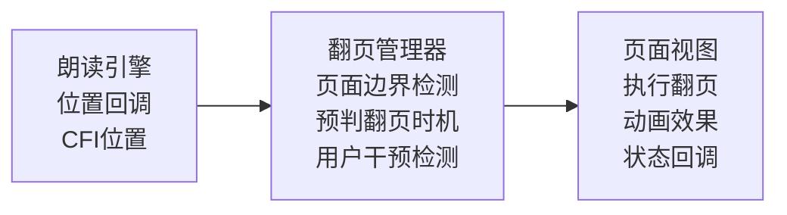
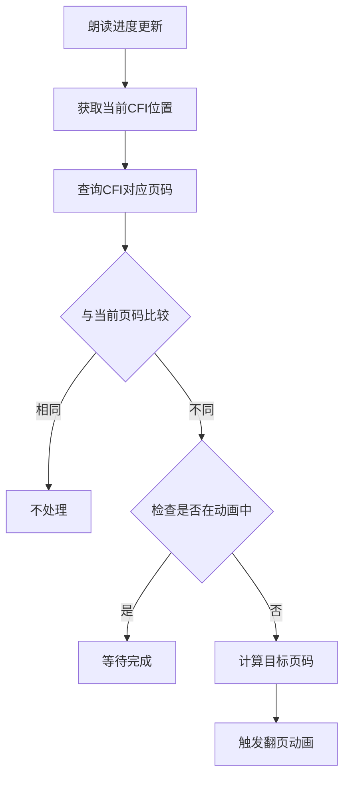
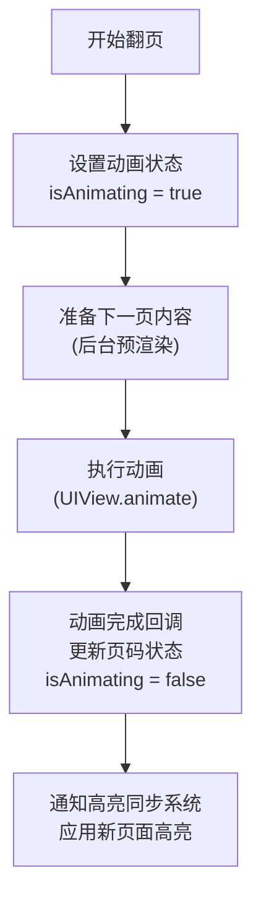

# 自动翻页系统实现文档

## 1. 功能概述

### 1.1 功能边界

| 功能项 | 包含 | 不包含 |
|--------|------|--------|
| 触发源 | TTS朗读/人声朗读 | 手动阅读模式 |
| 翻页方向 | 向前翻页 | 向后翻页 |
| 适用模式 | 分页模式 | 滚动模式(使用自动滚动) |
| 动画效果 | 多种翻页动画 | 自定义动画开发 |

### 1.2 与自动滚动的关系

```
┌─────────────────────────────────────────────────────────┐
│              阅读模式与同步方式对应                      │
├─────────────────────────────────────────────────────────┤
│                                                         │
│  分页模式 (Paginated)                                   │
│  └── 使用自动翻页系统                                   │
│      ├── 检测朗读位置跨页                              │
│      └── 触发翻页动画                                  │
│                                                         │
│  滚动模式 (Scrolling)                                   │
│  └── 使用高亮同步系统的自动滚动                        │
│      ├── 平滑滚动跟随                                  │
│      └── 无翻页概念                                    │
│                                                         │
└─────────────────────────────────────────────────────────┘
```

## 2. 系统架构

### 2.1 模块架构图

```
┌─────────────────────────────────────────────────────────────────┐
│                    AutoPageTurnManager                          │
│                        (单例模式)                                │
├─────────────────────────────────────────────────────────────────┤
│  ┌─────────────┐  ┌─────────────┐  ┌─────────────────────────┐  │
│  │PageDetector │  │AnimationMgr │  │TimingController         │  │
│  │ (页面检测)  │  │ (动画管理)  │  │ (时机控制)             │  │
│  └──────┬──────┘  └──────┬──────┘  └────────────┬────────────┘  │
│         │                │                      │                │
│  ┌──────┴──────┐  ┌──────┴──────┐  ┌───────────┴───────────┐   │
│  │BoundaryCalc │  │PageCurlAnim │  │PreemptiveDetector     │   │
│  │CFIToPageMap │  │SlideAnim    │  │BufferTimeCalc         │   │
│  │PageIndexMgr │  │FadeAnim     │  │SpeechRateAdapter      │   │
│  └─────────────┘  └─────────────┘  └───────────────────────┘   │
├─────────────────────────────────────────────────────────────────┤
│  ┌─────────────┐  ┌─────────────────────────────────────────┐   │
│  │UserInterrupt│  │StateManager                             │   │
│  │ (用户干预)  │  │ (状态管理)                              │   │
│  └─────────────┘  └─────────────────────────────────────────┘   │
└─────────────────────────────────────────────────────────────────┘
```

### 2.2 数据流向



## 3. 页面检测

### 3.1 页面边界计算

```
┌─────────────────────────────────────────────────────────┐
│              CFI位置 → 页码 映射                        │
├─────────────────────────────────────────────────────────┤
│                                                         │
│  输入: 当前朗读CFI位置                                  │
│                                                         │
│  1. 查询CFI在当前章节的位置                            │
│     └── WebView JavaScript: getPageForCFI(cfi)         │
│                                                         │
│  2. 与当前显示页码比较                                  │
│     ├── 相同 → 无需翻页                                │
│     └── 不同 → 触发翻页                                │
│                                                         │
│  3. 缓存映射关系                                        │
│     └── 避免重复查询WebView                            │
│                                                         │
└─────────────────────────────────────────────────────────┘
```

### 3.2 CFI-页码映射缓存

```
PageMapping
├── chapterId: String            // 章节ID
├── totalPages: Int              // 章节总页数
├── pageBoundaries: [CFIRange]   // 每页的CFI范围
├── fontSize: CGFloat            // 对应的字体大小
├── viewportSize: CGSize         // 对应的视口尺寸
└── isValid: Bool                // 缓存是否有效

CFIRange
├── startCFI: String             // 页面起始CFI
├── endCFI: String               // 页面结束CFI
└── pageIndex: Int               // 页码索引
```

### 3.3 缓存失效条件

| 条件 | 处理方式 |
|------|----------|
| 字体大小改变 | 清除缓存,重新计算 |
| 屏幕旋转 | 清除缓存,重新计算 |
| 章节切换 | 加载新章节映射 |
| 主题切换(行高变化) | 清除缓存,重新计算 |

## 4. 翻页时机控制

### 4.1 预判翻页策略

```
┌─────────────────────────────────────────────────────────┐
│              预判翻页时机                               │
├─────────────────────────────────────────────────────────┤
│                                                         │
│  目标: 在朗读到页面边界之前完成翻页                     │
│                                                         │
│  计算公式:                                              │
│  ┌─────────────────────────────────────────────────┐   │
│  │ 预判时间 = 翻页动画时长 + 缓冲时间               │   │
│  │                                                 │   │
│  │ 其中:                                           │   │
│  │ - 翻页动画时长: 根据动画类型 300-500ms          │   │
│  │ - 缓冲时间: 100ms (网络延迟/计算时间)           │   │
│  └─────────────────────────────────────────────────┘   │
│                                                         │
│  检测方式:                                              │
│  ├── TTS模式: 检测当前utterance是否跨页               │
│  └── 人声模式: 检测时间戳对应位置是否跨页             │
│                                                         │
└─────────────────────────────────────────────────────────┘
```

### 4.2 朗读速率适配

| 朗读速率 | 预判缓冲 | 说明 |
|----------|----------|------|
| 0.5x | 800ms | 慢速有更多缓冲时间 |
| 1.0x | 400ms | 正常速率 |
| 1.5x | 300ms | 快速需要提前预判 |
| 2.0x | 250ms | 倍速时最小缓冲 |

### 4.3 翻页触发流程



## 5. 翻页动画

### 5.1 动画类型

```
┌─────────────────────────────────────────────────────────┐
│                   翻页动画类型                          │
├─────────────────────────────────────────────────────────┤
│                                                         │
│  1. 卷页动画 (Page Curl)                               │
│     ├── 仿真书页翻动效果                               │
│     ├── 动画时长: 400ms                                │
│     └── 适用: 沉浸式阅读                               │
│                                                         │
│  2. 滑动动画 (Slide)                                   │
│     ├── 页面水平滑入滑出                               │
│     ├── 动画时长: 300ms                                │
│     └── 适用: 快速阅读                                 │
│                                                         │
│  3. 淡入淡出 (Fade)                                    │
│     ├── 当前页淡出,新页淡入                           │
│     ├── 动画时长: 250ms                                │
│     └── 适用: 减少视觉干扰                             │
│                                                         │
│  4. 无动画 (None)                                      │
│     ├── 直接切换                                       │
│     ├── 动画时长: 0ms                                  │
│     └── 适用: 最快响应                                 │
│                                                         │
└─────────────────────────────────────────────────────────┘
```

### 5.2 动画配置

```
PageTurnAnimationConfig
├── type: AnimationType          // 动画类型
├── duration: Double             // 动画时长
├── curve: AnimationCurve        // 动画曲线
├── direction: TurnDirection     // 翻页方向
└── interruptible: Bool          // 是否可中断

AnimationType
├── pageCurl                     // 卷页
├── slide                        // 滑动
├── fade                         // 淡入淡出
└── none                         // 无动画

TurnDirection
├── forward                      // 向前(下一页)
└── backward                     // 向后(上一页)
```

### 5.3 动画执行流程



## 6. 用户干预处理

### 6.1 干预类型

| 干预类型 | 检测方式 | 响应策略 |
|----------|----------|----------|
| 手动翻页 | 手势识别 | 暂停自动翻页 |
| 触摸屏幕 | 触摸事件 | 显示控制UI |
| 快速滑动 | 手势速度 | 中断当前动画 |
| 点击页面 | 点击手势 | 暂停/继续 |

### 6.2 干预处理流程

```
┌─────────────────────────────────────────────────────────┐
│              用户干预处理                               │
├─────────────────────────────────────────────────────────┤
│                                                         │
│  检测到用户手动翻页                                     │
│       │                                                 │
│       ▼                                                 │
│  ┌─────────────────────────────────────────────────┐   │
│  │ 1. 暂停自动翻页                                 │   │
│  │ 2. 中断当前翻页动画(如有)                      │   │
│  │ 3. 执行用户翻页操作                             │   │
│  └─────────────────────────────────────────────────┘   │
│       │                                                 │
│       ▼                                                 │
│  ┌─────────────────────────────────────────────────┐   │
│  │ 检查朗读状态                                    │   │
│  └─────────────────────┬───────────────────────────┘   │
│                        │                               │
│        ┌───────────────┼───────────────┐               │
│        ▼               ▼               ▼               │
│    朗读中          朗读暂停        朗读停止            │
│        │               │               │               │
│        ▼               ▼               ▼               │
│  显示"同步"按钮    不处理         不处理              │
│  "跳转到朗读位置"                                      │
│                                                         │
└─────────────────────────────────────────────────────────┘
```

### 6.3 同步恢复选项

```
用户翻离朗读页面后的选项
├── "同步到朗读位置"按钮
│   ├── 跳转到当前朗读所在页
│   ├── 恢复自动翻页
│   └── 继续朗读
│
├── "从当前页朗读"按钮
│   ├── 调整朗读位置到当前页开头
│   ├── 恢复自动翻页
│   └── 从新位置继续
│
└── 自动恢复(可配置)
    ├── 10秒无操作后自动跳回
    └── 或保持在用户选择的页面
```

## 7. 状态管理

### 7.1 状态机

```mermaid
stateDiagram-v2
    [*] --> disabled
    disabled --> idle : enable() & 分页模式
    idle --> preparing : 检测到跨页
    preparing --> animating : 预渲染完成
    animating --> completed : 动画完成
    completed --> idle

    note right of suspended : 用户干预可从任意状态进入
    state suspended
```

### 7.2 配置选项

```
AutoPageTurnConfig
├── isEnabled: Bool              // 是否启用
├── animationType: AnimationType // 动画类型
├── animationSpeed: Double       // 动画速度倍率
├── preloadEnabled: Bool         // 是否预加载下一页
├── resumeAfterInterrupt: Bool   // 干预后是否自动恢复
├── resumeDelay: Double          // 恢复延迟时间
└── showSyncButton: Bool         // 是否显示同步按钮
```

## 8. 与其他系统协调

### 8.1 与高亮同步系统

```
翻页动画开始
    │
    ├──► 通知HighlightSyncManager暂停更新
    │
    ▼
翻页动画进行中
    │
    ├──► 高亮同步暂停,不更新DOM
    │
    ▼
翻页动画完成
    │
    ├──► 通知HighlightSyncManager恢复
    ├──► 传递新页面信息
    └──► 高亮同步应用新位置高亮
```

### 8.2 与朗读引擎

```
朗读引擎                    AutoPageTurnManager
    │                              │
    │ 发送CFI位置更新             │
    ├─────────────────────────────►│
    │                              │ 检测是否需要翻页
    │                              │
    │                              │ 需要翻页时:
    │ 可选: 暂停朗读              │
    │◄─────────────────────────────┤
    │                              │
    │                              │ 执行翻页动画
    │                              │
    │ 翻页完成,继续朗读          │
    │◄─────────────────────────────┤
    │                              │
```

## 9. 回调与事件

### 9.1 委托协议

```
AutoPageTurnManagerDelegate
├── 状态回调
│   ├── didChangeState(old, new)      // 状态变化
│   └── didUpdateConfig(config)       // 配置更新
│
├── 翻页回调
│   ├── willTurnPage(from, to)        // 即将翻页
│   ├── didStartAnimation(type)       // 动画开始
│   ├── didFinishAnimation()          // 动画完成
│   └── didTurnPage(from, to)         // 翻页完成
│
├── 干预回调
│   ├── didDetectUserInterrupt()      // 检测到用户干预
│   ├── didResume()                   // 恢复自动翻页
│   └── userTappedSyncButton()        // 用户点击同步按钮
│
└── 错误回调
    └── didEncounterError(error)      // 错误发生
```

## 10. 性能优化

### 10.1 优化策略

| 策略 | 实现方式 |
|------|----------|
| 页面预渲染 | 提前渲染下一页内容到离屏buffer |
| CFI映射缓存 | 缓存当前章节的CFI-页码映射 |
| 动画优化 | 使用Core Animation,GPU加速 |
| 内存控制 | 仅保留当前页和相邻两页 |

### 10.2 预渲染策略

```
预渲染触发条件
├── 翻到新页时预渲染下一页
├── 检测到即将翻页时确认预渲染完成
├── 后台空闲时预渲染相邻页面
└── 内存紧张时释放预渲染内容
```

## 11. API接口

### 11.1 对外提供

| 接口 | 说明 |
|------|------|
| enable() | 启用自动翻页 |
| disable() | 禁用自动翻页 |
| pause() | 暂停自动翻页 |
| resume() | 恢复自动翻页 |
| updatePosition(cfi:) | 更新朗读位置 |
| setAnimationType(_:) | 设置动画类型 |
| syncToReadingPosition() | 同步到朗读位置 |
| startReadingFromCurrentPage() | 从当前页开始朗读 |
| getCurrentPage() -> Int | 获取当前页码 |
| getTotalPages() -> Int | 获取总页数 |

### 11.2 外部依赖

| 依赖项 | 用途 |
|--------|------|
| TTSManager | TTS位置回调 |
| HumanVoiceManager | 人声位置回调 |
| HighlightSyncManager | 协调高亮更新 |
| PageViewController | 执行翻页操作 |
| WebViewBridge | 查询CFI-页码映射 |
