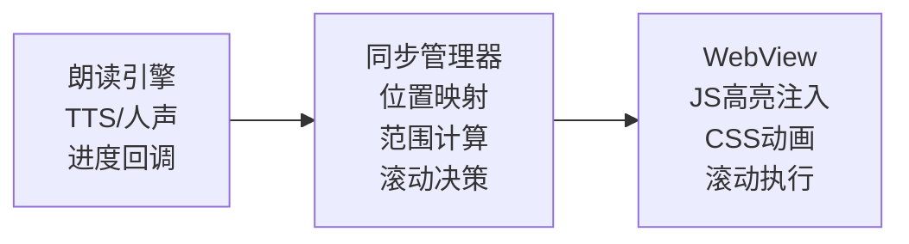
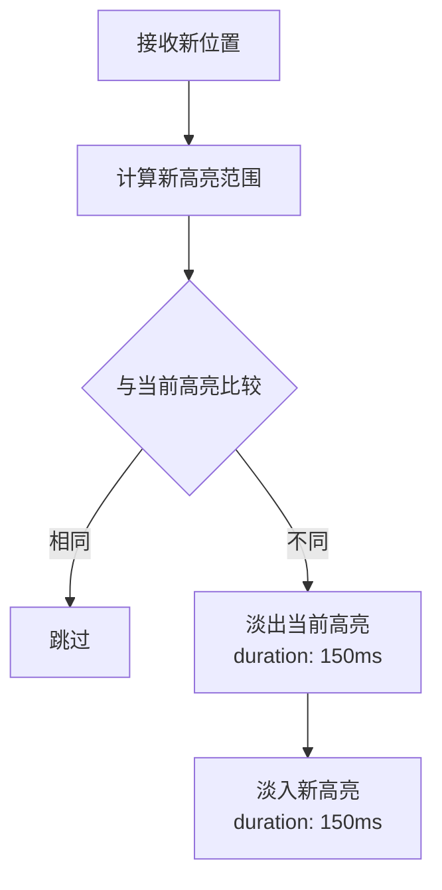
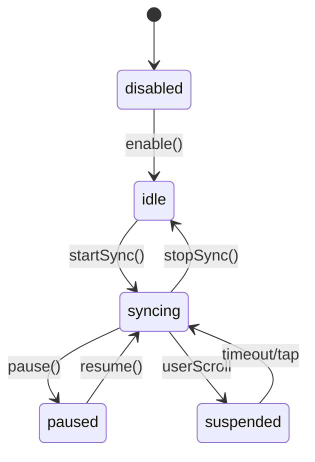

# 高亮同步系统实现文档

## 1. 功能概述

### 1.1 功能边界

| 功能项 | 包含 | 不包含 |
|--------|------|--------|
| 同步范围 | 当前朗读文本高亮显示 | 用户手动标注的高亮 |
| 同步源 | TTS朗读/人声朗读 | 视频播放 |
| 显示方式 | 句子级/段落级高亮 | 字符级高亮 |
| 滚动行为 | 自动滚动跟随朗读 | 手动滚动控制 |

### 1.2 同步模式

```
┌─────────────────────────────────────────────────────────┐
│                   高亮同步模式                          │
├─────────────────────────────────────────────────────────┤
│                                                         │
│  模式一: 句子高亮                                       │
│  ┌───────────────────────────────────────────────────┐ │
│  │ 普通文本 [当前朗读句子高亮] 普通文本               │ │
│  └───────────────────────────────────────────────────┘ │
│                                                         │
│  模式二: 段落高亮                                       │
│  ┌───────────────────────────────────────────────────┐ │
│  │ ▌整段文字都高亮显示，左侧有竖线标记               │ │
│  └───────────────────────────────────────────────────┘ │
│                                                         │
│  模式三: 卡拉OK模式 (逐字)                             │
│  ┌───────────────────────────────────────────────────┐ │
│  │ 已读过 [正在读] 未读                               │ │
│  └───────────────────────────────────────────────────┘ │
│                                                         │
└─────────────────────────────────────────────────────────┘
```

## 2. 系统架构

### 2.1 模块架构图

```
┌─────────────────────────────────────────────────────────────────┐
│                    HighlightSyncManager                         │
│                        (单例模式)                                │
├─────────────────────────────────────────────────────────────────┤
│  ┌─────────────┐  ┌─────────────┐  ┌─────────────────────────┐  │
│  │PositionTracker│ │HighlightRenderer│ │ScrollController      │  │
│  │ (位置跟踪)  │  │ (高亮渲染)  │  │ (滚动控制)            │  │
│  └──────┬──────┘  └──────┬──────┘  └────────────┬────────────┘  │
│         │                │                      │                │
│  ┌──────┴──────┐  ┌──────┴──────┐  ┌───────────┴───────────┐   │
│  │CFIParser    │  │CSSInjector  │  │SmoothScroller         │   │
│  │RangeMapper  │  │AnimationMgr │  │VisibilityChecker      │   │
│  │SegmentCache │  │StyleManager │  │UserInterruptHandler   │   │
│  └─────────────┘  └─────────────┘  └───────────────────────┘   │
└─────────────────────────────────────────────────────────────────┘
            │                 │                    │
            ▼                 ▼                    ▼
     ┌─────────────────────────────────────────────────────┐
     │                   WebView (EPUB渲染)                │
     │  ┌──────────────────────────────────────────────┐  │
     │  │ JavaScript Bridge                            │  │
     │  │ - applyHighlight(startCFI, endCFI, style)   │  │
     │  │ - removeHighlight()                          │  │
     │  │ - scrollToPosition(cfi, animated)           │  │
     │  │ - getVisibleRange() -> {start, end}         │  │
     │  └──────────────────────────────────────────────┘  │
     └─────────────────────────────────────────────────────┘
```

### 2.2 数据流向



## 3. 位置跟踪

### 3.1 位置信息数据模型

```
SyncPosition
├── cfi: String              // EPUB CFI位置
├── textRange: Range<Int>    // 文本字符范围
├── paragraphIndex: Int      // 段落索引
├── sentenceIndex: Int       // 句子索引(段内)
├── chapterIndex: Int        // 章节索引
└── timestamp: Double        // 时间戳(人声模式)

HighlightRange
├── startCFI: String         // 高亮起始CFI
├── endCFI: String           // 高亮结束CFI
├── text: String             // 高亮文本内容
└── elementId: String        // 对应DOM元素ID
```

### 3.2 TTS位置映射流程

```
┌─────────────────────────────────────────────────────────┐
│              TTS → CFI 位置映射                         │
├─────────────────────────────────────────────────────────┤
│                                                         │
│  AVSpeechSynthesizerDelegate                           │
│       │                                                 │
│       ▼                                                 │
│  willSpeakRange(characterRange, utterance)             │
│       │                                                 │
│       ▼                                                 │
│  ┌─────────────────────────────────────────────────┐   │
│  │ 1. 从utterance获取关联的textSegment            │   │
│  │ 2. 计算characterRange在原文中的绝对位置        │   │
│  │ 3. 查找对应的CFI位置                           │   │
│  │ 4. 发送到HighlightSyncManager                  │   │
│  └─────────────────────────────────────────────────┘   │
│                                                         │
└─────────────────────────────────────────────────────────┘
```

### 3.3 人声位置映射流程

```
┌─────────────────────────────────────────────────────────┐
│              时间戳 → CFI 位置映射                      │
├─────────────────────────────────────────────────────────┤
│                                                         │
│  AVPlayer Time Observer                                │
│       │                                                 │
│       ▼                                                 │
│  currentTime (每0.1秒回调)                              │
│       │                                                 │
│       ▼                                                 │
│  ┌─────────────────────────────────────────────────┐   │
│  │ 1. 在TimestampMap中二分查找当前时间段          │   │
│  │ 2. 获取对应的CFI位置                           │   │
│  │ 3. 与上次位置比较,仅变化时发送更新            │   │
│  │ 4. 发送到HighlightSyncManager                  │   │
│  └─────────────────────────────────────────────────┘   │
│                                                         │
└─────────────────────────────────────────────────────────┘
```

## 4. 高亮渲染

### 4.1 CSS样式定义

| 高亮模式 | 样式特征 | 适用场景 |
|----------|----------|----------|
| 句子高亮 | 背景色 + 圆角 | 默认模式 |
| 段落高亮 | 左边框 + 浅背景 | 快速浏览 |
| 卡拉OK | 渐变过渡色 | 学习模式 |
| 下划线 | 底部边框 | 简洁模式 |

### 4.2 高亮样式配置

```
HighlightStyle
├── mode: HighlightMode          // 高亮模式
├── backgroundColor: Color       // 背景色
├── textColor: Color?            // 文字色(可选)
├── borderColor: Color?          // 边框色
├── borderWidth: CGFloat         // 边框宽度
├── cornerRadius: CGFloat        // 圆角半径
├── animationType: AnimationType // 动画类型
└── animationDuration: Double    // 动画时长

HighlightMode
├── sentence                     // 句子高亮
├── paragraph                    // 段落高亮
├── karaoke                      // 卡拉OK逐字
└── underline                    // 下划线

AnimationType
├── none                         // 无动画
├── fade                         // 淡入淡出
├── slide                        // 滑动过渡
└── pulse                        // 脉冲闪烁
```

### 4.3 JavaScript注入接口

```
WebView JavaScript Bridge
├── applyHighlight(config)
│   ├── startCFI: String
│   ├── endCFI: String
│   ├── style: HighlightStyleJSON
│   └── animated: Boolean
│
├── removeHighlight(animated)
│   └── animated: Boolean
│
├── updateHighlightStyle(style)
│   └── style: HighlightStyleJSON
│
└── getElementRect(cfi) -> DOMRect
    └── 返回元素在视口中的位置
```

### 4.4 高亮动画流程



## 5. 自动滚动

### 5.1 滚动策略

```
┌─────────────────────────────────────────────────────────┐
│                   滚动决策逻辑                          │
├─────────────────────────────────────────────────────────┤
│                                                         │
│  当前高亮位置                                           │
│       │                                                 │
│       ▼                                                 │
│  ┌─────────────────────────────────────────────────┐   │
│  │ 检查高亮元素是否在可视区域内                    │   │
│  └─────────────┬───────────────────────────────────┘   │
│                │                                        │
│      ┌─────────┴─────────┐                             │
│      ▼                   ▼                             │
│  在可视区域          不在可视区域                       │
│      │                   │                             │
│      ▼                   ▼                             │
│  不滚动            ┌───────────────┐                   │
│                    │ 计算目标位置  │                   │
│                    │ (居中或上1/3) │                   │
│                    └───────┬───────┘                   │
│                            │                           │
│                            ▼                           │
│                    ┌───────────────┐                   │
│                    │ 平滑滚动     │                    │
│                    │ 动画执行     │                    │
│                    └───────────────┘                   │
│                                                         │
└─────────────────────────────────────────────────────────┘
```

### 5.2 滚动参数配置

| 参数 | 值 | 说明 |
|------|-----|------|
| scrollThreshold | 视口高度的20% | 距离边缘多远触发滚动 |
| targetPosition | 视口上1/3处 | 滚动后目标位置 |
| animationDuration | 300ms | 滚动动画时长 |
| animationCurve | easeInOut | 动画曲线 |
| debounceInterval | 500ms | 滚动请求防抖 |

### 5.3 用户交互处理

```
┌─────────────────────────────────────────────────────────┐
│              用户手动滚动处理                           │
├─────────────────────────────────────────────────────────┤
│                                                         │
│  检测用户滚动                                           │
│       │                                                 │
│       ▼                                                 │
│  ┌─────────────────────────────────────────────────┐   │
│  │ 暂停自动滚动 (3秒)                              │   │
│  └─────────────────────────────────────────────────┘   │
│       │                                                 │
│       ▼                                                 │
│  ┌─────────────────────────────────────────────────┐   │
│  │ 显示"回到朗读位置"悬浮按钮                      │   │
│  └─────────────────────────────────────────────────┘   │
│       │                                                 │
│   ┌───┴───┐                                            │
│   ▼       ▼                                            │
│ 点击    3秒后无操作                                     │
│   │       │                                            │
│   ▼       ▼                                            │
│ 立即    恢复自动滚动                                    │
│ 跳回    隐藏按钮                                        │
│                                                         │
└─────────────────────────────────────────────────────────┘
```

## 6. 翻页模式支持

### 6.1 分页模式同步

```
分页模式下的同步策略
├── 当前页内
│   ├── 高亮正常显示
│   └── 无需翻页
│
├── 跨页情况
│   ├── 检测到朗读内容在下一页
│   ├── 触发翻页动画
│   ├── 翻页完成后应用高亮
│   └── 与自动翻页系统协调
│
└── 翻页动画期间
    ├── 暂停高亮更新
    └── 动画完成后恢复
```

### 6.2 滚动模式 vs 分页模式

| 特性 | 滚动模式 | 分页模式 |
|------|----------|----------|
| 滚动方式 | 平滑滚动 | 翻页动画 |
| 位置计算 | Y轴偏移 | 页码索引 |
| 跨页处理 | 连续滚动 | 等待翻页完成 |
| 用户干预 | 暂停自动滚动 | 暂停自动翻页 |

## 7. 状态管理

### 7.1 同步状态机



### 7.2 配置选项

```
HighlightSyncConfig
├── isEnabled: Bool              // 是否启用同步
├── highlightMode: HighlightMode // 高亮模式
├── highlightStyle: HighlightStyle // 高亮样式
├── autoScroll: Bool             // 是否自动滚动
├── scrollPosition: ScrollPosition // 滚动目标位置
├── userInterruptDuration: Double // 用户干预暂停时长
└── animationsEnabled: Bool      // 是否启用动画
```

## 8. 回调与事件

### 8.1 委托协议

```
HighlightSyncManagerDelegate
├── 状态回调
│   ├── didChangeState(old, new)      // 状态变化
│   └── didUpdateConfig(config)       // 配置更新
│
├── 同步回调
│   ├── didHighlightRange(range)      // 高亮范围更新
│   ├── didScrollToPosition(cfi)      // 滚动到新位置
│   └── didClearHighlight()           // 高亮清除
│
├── 交互回调
│   ├── didDetectUserScroll()         // 检测到用户滚动
│   ├── didResumeAutoScroll()         // 恢复自动滚动
│   └── userTappedReturnButton()      // 用户点击返回按钮
│
└── 页面回调
    ├── willTurnPage(to: Int)         // 即将翻页
    └── didTurnPage(to: Int)          // 翻页完成
```

## 9. 性能优化

### 9.1 优化策略

| 策略 | 实现方式 |
|------|----------|
| 位置缓存 | 缓存CFI到DOM元素的映射 |
| 批量更新 | 合并快速连续的高亮请求 |
| 动画优化 | 使用CSS transform替代重排 |
| 滚动节流 | 滚动事件100ms节流 |
| 离屏检测 | 不渲染不可见区域的高亮 |

### 9.2 内存管理

| 策略 | 实现方式 |
|------|----------|
| DOM引用清理 | 翻页后清理旧页面高亮元素引用 |
| 事件监听清理 | 停止同步时移除所有事件监听 |
| 样式表复用 | 共享CSS样式表,避免重复注入 |

## 10. API接口

### 10.1 对外提供

| 接口 | 说明 |
|------|------|
| startSync() | 开始同步 |
| stopSync() | 停止同步 |
| pause() | 暂停同步 |
| resume() | 恢复同步 |
| updatePosition(position:) | 更新当前位置 |
| setHighlightMode(_:) | 设置高亮模式 |
| setAutoScroll(_:) | 设置自动滚动 |
| scrollToCurrentPosition() | 滚动到当前朗读位置 |
| setEnabled(_:) | 启用/禁用同步 |

### 10.2 外部依赖

| 依赖项 | 用途 |
|--------|------|
| TTSManager | TTS位置回调 |
| HumanVoiceManager | 人声位置回调 |
| WebViewBridge | JavaScript通信 |
| ReaderViewController | 获取WebView引用 |
| PageManager | 分页模式下的页面控制 |
