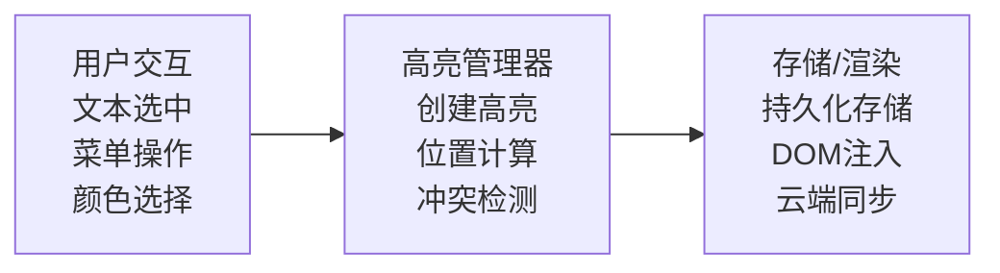
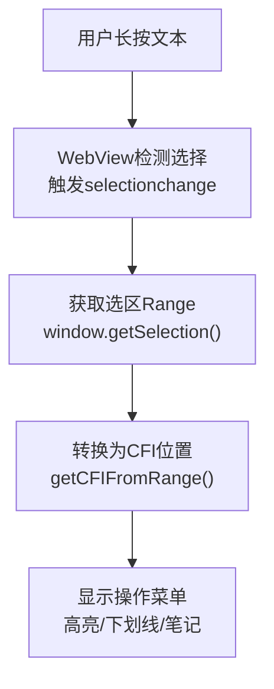
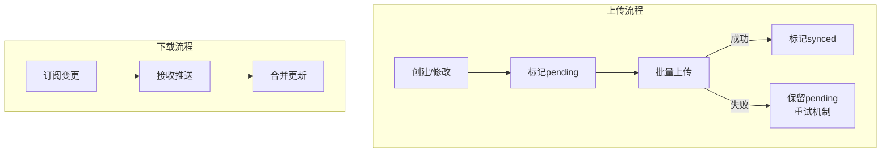
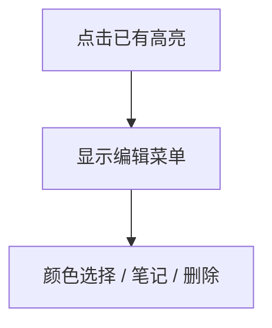
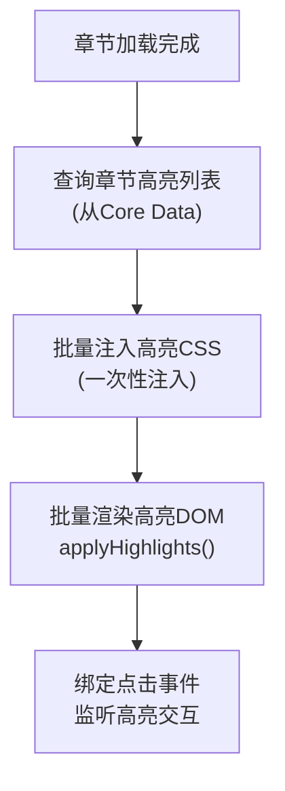

# 高亮标注系统实现文档

## 1. 功能概述

### 1.1 功能边界

| 功能项 | 包含 | 不包含 |
|--------|------|--------|
| 创建方式 | 文本选中后手动创建 | 自动高亮 |
| 颜色选项 | 多种预设颜色 | 自定义颜色 |
| 存储范围 | 本地持久化/云同步 | 临时高亮 |
| 编辑操作 | 创建/修改颜色/删除 | 合并/拆分 |

### 1.2 与朗读高亮的区别

```
┌─────────────────────────────────────────────────────────┐
│                   高亮类型对比                          │
├─────────────────────────┬───────────────────────────────┤
│     朗读同步高亮        │        用户标注高亮           │
├─────────────────────────┼───────────────────────────────┤
│ 临时性,朗读时显示       │ 永久性,持久化存储            │
│ 系统控制位置            │ 用户选择位置                 │
│ 固定样式                │ 可选颜色/样式                │
│ 随朗读进度移动          │ 固定在标记位置               │
│ 不可编辑                │ 可修改/删除                  │
└─────────────────────────┴───────────────────────────────┘
```

## 2. 系统架构

### 2.1 模块架构图

```
┌─────────────────────────────────────────────────────────────────┐
│                    HighlightManager                             │
│                      (单例模式)                                  │
├─────────────────────────────────────────────────────────────────┤
│  ┌─────────────┐  ┌─────────────┐  ┌─────────────────────────┐  │
│  │SelectionMgr │  │RenderEngine │  │StorageManager           │  │
│  │ (选区管理)  │  │ (渲染引擎)  │  │ (存储管理)             │  │
│  └──────┬──────┘  └──────┬──────┘  └────────────┬────────────┘  │
│         │                │                      │                │
│  ┌──────┴──────┐  ┌──────┴──────┐  ┌───────────┴───────────┐   │
│  │TextSelection│  │CSSInjector  │  │CoreDataStore          │   │
│  │RangeHandler │  │DOMManipulate│  │CloudKitSync           │   │
│  │MenuPresenter│  │ColorManager │  │ExportService          │   │
│  └─────────────┘  └─────────────┘  └───────────────────────┘   │
├─────────────────────────────────────────────────────────────────┤
│  ┌─────────────┐  ┌─────────────────────────────────────────┐   │
│  │ConflictRes  │  │EventDispatcher                          │   │
│  │ (冲突处理)  │  │ (事件分发)                              │   │
│  └─────────────┘  └─────────────────────────────────────────┘   │
└─────────────────────────────────────────────────────────────────┘
```

### 2.2 数据流向



## 3. 数据模型

### 3.1 高亮实体

```
Highlight
├── id: UUID                     // 唯一标识
├── bookId: String               // 所属书籍ID
├── chapterId: String            // 所属章节ID
├── startCFI: String             // 起始CFI位置
├── endCFI: String               // 结束CFI位置
├── selectedText: String         // 选中的文本内容
├── color: HighlightColor        // 高亮颜色
├── opacity: CGFloat             // 透明度 (0.3默认)
├── createdAt: Date              // 创建时间
├── updatedAt: Date              // 更新时间
├── syncStatus: SyncStatus       // 同步状态
└── isDeleted: Bool              // 软删除标记

HighlightColor
├── yellow    (#FFEB3B, 默认)
├── green     (#4CAF50)
├── blue      (#2196F3)
├── pink      (#E91E63)
├── purple    (#9C27B0)
└── orange    (#FF9800)

SyncStatus
├── synced                       // 已同步
├── pending                      // 待同步
├── conflict                     // 冲突
└── failed                       // 同步失败
```

### 3.2 颜色配置表

| 颜色名 | HEX值 | RGB | 透明度 |
|--------|-------|-----|--------|
| 黄色 | #FFEB3B | 255,235,59 | 0.35 |
| 绿色 | #4CAF50 | 76,175,80 | 0.35 |
| 蓝色 | #2196F3 | 33,150,243 | 0.35 |
| 粉色 | #E91E63 | 233,30,99 | 0.35 |
| 紫色 | #9C27B0 | 156,39,176 | 0.35 |
| 橙色 | #FF9800 | 255,152,0 | 0.35 |

## 4. 文本选择

### 4.1 选择流程



### 4.2 JavaScript接口

```
WebView JavaScript Bridge
├── getSelectionInfo() -> SelectionInfo
│   ├── text: String           // 选中文本
│   ├── startCFI: String       // 起始CFI
│   ├── endCFI: String         // 结束CFI
│   └── rect: DOMRect          // 选区位置(用于菜单定位)
│
├── clearSelection()
│   └── 清除当前选区
│
├── selectRange(startCFI, endCFI)
│   └── 程序化选择指定范围
│
└── getSelectedRects(startCFI, endCFI) -> [DOMRect]
    └── 获取选区的所有行矩形(用于多行高亮)
```

### 4.3 选区验证

| 验证项 | 检查内容 | 处理方式 |
|--------|----------|----------|
| 最小长度 | 至少2个字符 | 提示选择更多 |
| 跨章节 | 选区跨越章节边界 | 限制到当前章节 |
| 跨标签 | 选区跨越多个DOM元素 | 正常处理,合并范围 |
| 已有高亮 | 与现有高亮重叠 | 触发冲突处理 |

## 5. 高亮渲染

### 5.1 渲染方式

```
┌─────────────────────────────────────────────────────────┐
│                   高亮渲染方案                          │
├─────────────────────────────────────────────────────────┤
│                                                         │
│  方案: CSS + DOM包装                                    │
│                                                         │
│  实现步骤:                                              │
│  1. 获取选区范围的所有文本节点                          │
│  2. 用<span>包装每个文本节点的对应部分                 │
│  3. 应用CSS背景色样式                                   │
│  4. 记录所有span的ID用于后续操作                        │
│                                                         │
│  DOM结构变化:                                           │
│  Before: <p>This is some text</p>                      │
│  After:  <p>This <span class="hl-yellow"               │
│              data-hl-id="xxx">is some</span> text</p>  │
│                                                         │
└─────────────────────────────────────────────────────────┘
```

### 5.2 CSS样式注入

```
注入的CSS类
├── .hl-base
│   ├── display: inline
│   ├── border-radius: 3px
│   ├── padding: 2px 0
│   └── box-decoration-break: clone
│
├── .hl-yellow { background-color: rgba(255,235,59,0.35); }
├── .hl-green  { background-color: rgba(76,175,80,0.35); }
├── .hl-blue   { background-color: rgba(33,150,243,0.35); }
├── .hl-pink   { background-color: rgba(233,30,99,0.35); }
├── .hl-purple { background-color: rgba(156,39,176,0.35); }
└── .hl-orange { background-color: rgba(255,152,0,0.35); }
```

### 5.3 多行高亮处理

```
┌─────────────────────────────────────────────────────────┐
│              多行高亮渲染                               │
├─────────────────────────────────────────────────────────┤
│                                                         │
│  选区跨越多行时:                                        │
│                                                         │
│  ┌──────────────────────────────────────────────────┐  │
│  │ 第一行: ████████████████                         │  │
│  │ 第二行: ████████████████████████████████████████ │  │
│  │ 第三行: ████████████████                         │  │
│  └──────────────────────────────────────────────────┘  │
│                                                         │
│  每行作为独立span处理,共享同一个highlight ID           │
│  使用box-decoration-break: clone保持视觉一致性         │
│                                                         │
└─────────────────────────────────────────────────────────┘
```

## 6. 存储与同步

### 6.1 本地存储 (Core Data)

```
Core Data Entity: HighlightEntity
├── Attributes
│   ├── id: UUID
│   ├── bookId: String
│   ├── chapterId: String
│   ├── startCFI: String
│   ├── endCFI: String
│   ├── selectedText: String
│   ├── colorName: String
│   ├── opacity: Double
│   ├── createdAt: Date
│   ├── updatedAt: Date
│   ├── syncStatus: Int16
│   └── isDeleted: Bool
│
└── Relationships
    └── book: BookEntity (optional)
```

### 6.2 云同步流程



### 6.3 冲突解决

| 冲突类型 | 检测方式 | 解决策略 |
|----------|----------|----------|
| 同一位置修改 | 比较updatedAt | 最新时间戳优先 |
| 删除vs修改 | 本地删除,云端修改 | 用户选择 |
| 范围重叠 | CFI范围交集 | 合并或用户选择 |

## 7. 高亮交互

### 7.1 操作菜单

```
选中文本后显示的菜单
├── 第一行: 颜色选择器
│   └── [🟡] [🟢] [🔵] [🩷] [🟣] [🟠]
│
└── 第二行: 操作按钮
    ├── [高亮]     → 创建高亮
    ├── [下划线]   → 创建下划线
    ├── [笔记]     → 创建带笔记的标注
    └── [复制]     → 复制文本
```

### 7.2 点击已有高亮



### 7.3 手势识别

| 手势 | 触发条件 | 响应操作 |
|------|----------|----------|
| 单击 | 点击高亮区域 | 显示编辑菜单 |
| 长按 | 长按任意文本 | 进入选择模式 |
| 双击 | 双击单词 | 选中该单词 |
| 拖拽 | 选区边界拖动 | 调整选区范围 |

## 8. 页面加载恢复

### 8.1 章节加载流程



### 8.2 批量操作JavaScript接口

```
applyHighlights(highlights: [HighlightData])
├── 参数: 高亮数组
│   ├── id: String
│   ├── startCFI: String
│   ├── endCFI: String
│   └── color: String
│
└── 批量创建高亮,避免多次DOM操作

removeHighlights(ids: [String])
└── 批量移除指定ID的高亮

updateHighlightColor(id: String, color: String)
└── 更新单个高亮颜色
```

## 9. 回调与事件

### 9.1 委托协议

```
HighlightManagerDelegate
├── 创建回调
│   ├── didCreateHighlight(highlight)     // 创建成功
│   └── didFailToCreate(error)            // 创建失败
│
├── 编辑回调
│   ├── didUpdateHighlight(highlight)     // 更新成功
│   └── didDeleteHighlight(id)            // 删除成功
│
├── 交互回调
│   ├── didSelectHighlight(highlight)     // 选中高亮
│   └── didShowMenu(at: CGPoint)          // 显示菜单
│
└── 同步回调
    ├── didStartSync()                    // 开始同步
    ├── didFinishSync(result)             // 同步完成
    └── didEncounterConflict(conflicts)   // 发现冲突
```

## 10. 性能优化

### 10.1 优化策略

| 策略 | 实现方式 |
|------|----------|
| 批量渲染 | 页面加载时一次性注入所有高亮 |
| 懒加载 | 仅加载可视区域+缓冲区的高亮 |
| 虚拟化 | 长章节使用虚拟DOM管理高亮 |
| 缓存 | 缓存已计算的CFI-DOM映射 |

### 10.2 大量高亮处理

```
高亮数量策略
├── < 50: 一次性全部渲染
├── 50-200: 可视区域优先,后台渲染其余
├── > 200: 虚拟化,仅渲染可见+缓冲
└── > 500: 分页加载,按需渲染
```

## 11. API接口

### 11.1 对外提供

| 接口 | 说明 |
|------|------|
| createHighlight(startCFI:endCFI:color:) | 创建高亮 |
| updateHighlightColor(id:color:) | 修改颜色 |
| deleteHighlight(id:) | 删除高亮 |
| getHighlights(bookId:chapterId:) | 获取章节高亮 |
| getAllHighlights(bookId:) | 获取书籍所有高亮 |
| exportHighlights(bookId:format:) | 导出高亮 |
| syncHighlights() | 同步高亮到云端 |

### 11.2 外部依赖

| 依赖项 | 用途 |
|--------|------|
| WebViewBridge | JavaScript通信 |
| CoreDataStack | 本地持久化 |
| CloudKitManager | 云端同步 |
| ReaderViewController | WebView引用 |
