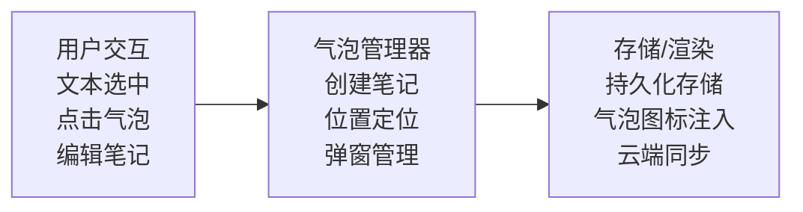

# 想法气泡系统实现文档

## 1. 功能概述

### 1.1 功能边界

| 功能项 | 包含 | 不包含 |
|--------|------|--------|
| 创建方式 | 选中文本后添加笔记 | 独立笔记(无关联文本) |
| 笔记内容 | 纯文本笔记 | 富文本/图片附件 |
| 显示方式 | 气泡图标+弹出面板 | 内嵌显示 |
| 存储范围 | 本地持久化/云同步 | 仅本地 |

### 1.2 交互模式

```
┌─────────────────────────────────────────────────────────┐
│                   想法气泡交互模式                       │
├─────────────────────────────────────────────────────────┤
│                                                         │
│  阅读模式下:                                            │
│  ┌──────────────────────────────────────────────────┐  │
│  │ 这是一段文本，其中有些内容[💭]需要添加想法。      │  │
│  └──────────────────────────────────────────────────┘  │
│                         │                               │
│                         │ 点击气泡图标                  │
│                         ▼                               │
│  ┌──────────────────────────────────────────────────┐  │
│  │ ┌────────────────────────────────────────────┐   │  │
│  │ │ "需要添加想法"                              │   │  │
│  │ ├────────────────────────────────────────────┤   │  │
│  │ │ 这里是我的笔记内容，关于这段文字的思考...  │   │  │
│  │ │                                            │   │  │
│  │ └────────────────────────────────────────────┘   │  │
│  │                              [编辑] [删除]       │  │
│  └──────────────────────────────────────────────────┘  │
│                                                         │
└─────────────────────────────────────────────────────────┘
```

## 2. 系统架构

### 2.1 模块架构图

```
┌─────────────────────────────────────────────────────────────────┐
│                    ThoughtBubbleManager                         │
│                        (单例模式)                                │
├─────────────────────────────────────────────────────────────────┤
│  ┌─────────────┐  ┌─────────────┐  ┌─────────────────────────┐  │
│  │SelectionMgr │  │BubbleRenderer│ │StorageManager           │  │
│  │ (选区管理)  │  │ (气泡渲染)  │  │ (存储管理)             │  │
│  └──────┬──────┘  └──────┬──────┘  └────────────┬────────────┘  │
│         │                │                      │                │
│  ┌──────┴──────┐  ┌──────┴──────┐  ┌───────────┴───────────┐   │
│  │TextSelection│  │IconInjector │  │CoreDataStore          │   │
│  │RangeHandler │  │PopoverMgr   │  │CloudKitSync           │   │
│  │NoteEditor   │  │AnimationMgr │  │ExportService          │   │
│  └─────────────┘  └─────────────┘  └───────────────────────┘   │
├─────────────────────────────────────────────────────────────────┤
│  ┌─────────────────────────────────────────────────────────┐    │
│  │ NoteEditorController (笔记编辑控制器)                   │    │
│  └─────────────────────────────────────────────────────────┘    │
└─────────────────────────────────────────────────────────────────┘
```

### 2.2 数据流向



## 3. 数据模型

### 3.1 想法气泡实体

```
ThoughtBubble
├── id: UUID                     // 唯一标识
├── bookId: String               // 所属书籍ID
├── chapterId: String            // 所属章节ID
├── startCFI: String             // 起始CFI位置
├── endCFI: String               // 结束CFI位置
├── selectedText: String         // 选中的文本内容
├── noteText: String             // 笔记内容
├── highlightColor: HighlightColor? // 可选的高亮颜色
├── bubblePosition: BubblePosition // 气泡图标位置
├── createdAt: Date              // 创建时间
├── updatedAt: Date              // 更新时间
├── syncStatus: SyncStatus       // 同步状态
└── isDeleted: Bool              // 软删除标记

BubblePosition
├── inline                       // 行内(文字末尾)
├── margin                       // 页边距
└── floating                     // 浮动(固定位置)
```

### 3.2 笔记内容规范

| 属性 | 限制 | 说明 |
|------|------|------|
| 最小长度 | 1字符 | 至少1个字符 |
| 最大长度 | 2000字符 | 防止过长 |
| 字符类型 | Unicode | 支持多语言/emoji |
| 换行 | 支持 | 保留换行格式 |

## 4. 气泡图标渲染

### 4.1 图标样式

```
┌─────────────────────────────────────────────────────────┐
│                   气泡图标设计                          │
├─────────────────────────────────────────────────────────┤
│                                                         │
│  默认样式:                                              │
│  ┌─────┐                                               │
│  │ 💭  │  尺寸: 16x16pt                                │
│  └─────┘  颜色: 主题色                                 │
│           动画: 轻微浮动(可选)                         │
│                                                         │
│  位置策略:                                              │
│  ┌──────────────────────────────────────────────────┐  │
│  │ 行内模式:                                        │  │
│  │ 这是被标注的文字[💭]接下来的内容                 │  │
│  └──────────────────────────────────────────────────┘  │
│                                                         │
│  ┌──────────────────────────────────────────────────┐  │
│  │ 边距模式:                            💭          │  │
│  │ 这是被标注的文字接下来的内容                     │  │
│  └──────────────────────────────────────────────────┘  │
│                                                         │
└─────────────────────────────────────────────────────────┘
```

### 4.2 图标注入方式

```
DOM注入结构
├── 行内模式
│   └── <span class="thought-bubble" data-id="xxx">
│         <span class="marked-text">标注文字</span>
│         <span class="bubble-icon">💭</span>
│       </span>
│
└── 边距模式
    └── <span class="thought-bubble margin-mode" data-id="xxx">
          <span class="marked-text">标注文字</span>
        </span>
        // 图标通过CSS ::after或绝对定位实现
```

### 4.3 CSS样式

```
.thought-bubble
├── position: relative
├── cursor: pointer
└── (可选) 背景色高亮

.bubble-icon
├── display: inline-block
├── width: 16px
├── height: 16px
├── vertical-align: super
├── font-size: 12px
└── cursor: pointer

.bubble-icon:hover
├── transform: scale(1.2)
└── transition: transform 0.2s

.margin-mode::after
├── content: "💭"
├── position: absolute
├── right: -24px
└── top: 0
```

## 5. 弹窗面板

### 5.1 弹窗结构

```
┌─────────────────────────────────────────────────────────┐
│                   笔记弹窗设计                          │
├─────────────────────────────────────────────────────────┤
│                                                         │
│  ┌──────────────────────────────────────────────────┐  │
│  │ ▼ 尖角指向气泡图标                               │  │
│  │┌────────────────────────────────────────────────┐│  │
│  ││ "被标注的原文内容..."                          ││  │
│  │├────────────────────────────────────────────────┤│  │
│  ││                                                ││  │
│  ││ 这是用户添加的笔记内容，可以是多行文本...     ││  │
│  ││ 第二行内容                                     ││  │
│  ││                                                ││  │
│  │├────────────────────────────────────────────────┤│  │
│  ││ 2024-01-15 10:30        [编辑] [删除]         ││  │
│  │└────────────────────────────────────────────────┘│  │
│  └──────────────────────────────────────────────────┘  │
│                                                         │
│  弹窗特性:                                              │
│  ├── 最大宽度: 280pt                                   │
│  ├── 最大高度: 屏幕高度40%                             │
│  ├── 超出滚动                                          │
│  ├── 点击外部关闭                                      │
│  └── 自动定位(避免超出屏幕)                            │
│                                                         │
└─────────────────────────────────────────────────────────┘
```

### 5.2 弹窗定位算法

```
获取气泡图标位置
    │
    ▼
┌───────────────────┐
│ 计算弹窗理想位置  │
│ (气泡下方居中)    │
└────────┬──────────┘
         │
         ▼
┌───────────────────┐
│ 检查是否超出屏幕  │
└────────┬──────────┘
         │
    ┌────┴────┬─────────────┐
    ▼         ▼             ▼
  超出底部   超出右侧      超出左侧
    │         │             │
    ▼         ▼             ▼
 显示在上方  左移弹窗     右移弹窗
 箭头朝下    箭头偏右     箭头偏左
```

## 6. 笔记编辑

### 6.1 创建流程

```
选中文本
    │
    ▼
┌───────────────────┐
│ 显示操作菜单      │
│ 点击[添加笔记]    │
└────────┬──────────┘
         │
         ▼
┌───────────────────────────────────────────────────┐
│                笔记编辑面板                        │
├───────────────────────────────────────────────────┤
│                                                   │
│  被标注文本: "选中的原文内容..."                  │
│                                                   │
│  ┌─────────────────────────────────────────────┐ │
│  │ 在此输入你的想法...                         │ │
│  │                                             │ │
│  │                                             │ │
│  └─────────────────────────────────────────────┘ │
│                                                   │
│  □ 同时添加高亮   颜色: [🟡]                      │
│                                                   │
│         [取消]              [保存]                │
│                                                   │
└───────────────────────────────────────────────────┘
```

### 6.2 编辑流程

```
点击气泡图标
    │
    ▼
┌───────────────────┐
│ 显示笔记弹窗      │
│ 点击[编辑]        │
└────────┬──────────┘
         │
         ▼
┌───────────────────────────────────────────────────┐
│                编辑笔记面板                        │
├───────────────────────────────────────────────────┤
│                                                   │
│  被标注文本: "选中的原文内容..."                  │
│                                                   │
│  ┌─────────────────────────────────────────────┐ │
│  │ 原有的笔记内容在这里...                     │ │
│  │ 用户可以修改                                │ │
│  │                                             │ │
│  └─────────────────────────────────────────────┘ │
│                                                   │
│         [取消]              [保存]                │
│                                                   │
└───────────────────────────────────────────────────┘
```

### 6.3 删除确认

```
点击[删除]按钮
    │
    ▼
┌───────────────────────────────────────┐
│          确认删除                     │
├───────────────────────────────────────┤
│                                       │
│  确定要删除这条笔记吗？               │
│  此操作无法撤销。                     │
│                                       │
│       [取消]        [删除]            │
│                                       │
└───────────────────────────────────────┘
```

## 7. 存储与同步

### 7.1 Core Data实体

```
Core Data Entity: ThoughtBubbleEntity
├── Attributes
│   ├── id: UUID
│   ├── bookId: String
│   ├── chapterId: String
│   ├── startCFI: String
│   ├── endCFI: String
│   ├── selectedText: String
│   ├── noteText: String
│   ├── highlightColorName: String (optional)
│   ├── bubblePositionRaw: Int16
│   ├── createdAt: Date
│   ├── updatedAt: Date
│   ├── syncStatus: Int16
│   └── isDeleted: Bool
│
└── Relationships
    └── book: BookEntity (optional)
```

### 7.2 云同步处理

```
┌─────────────────────────────────────────────────────────┐
│              笔记云同步注意事项                          │
├─────────────────────────────────────────────────────────┤
│                                                         │
│  冲突场景:                                              │
│  ├── 同一笔记在多设备编辑                              │
│  ├── 一端删除,另一端编辑                               │
│  └── 关联文本位置变化(书籍版本更新)                    │
│                                                         │
│  解决策略:                                              │
│  ├── 时间戳优先: 最新修改覆盖                          │
│  ├── 删除优先: 删除操作不可恢复                        │
│  └── CFI失效: 标记为"位置丢失",保留笔记内容           │
│                                                         │
└─────────────────────────────────────────────────────────┘
```

## 8. 页面加载恢复

### 8.1 加载流程

```
章节加载完成
    │
    ▼
┌───────────────────┐
│ 查询章节笔记      │
│ (按位置排序)      │
└────────┬──────────┘
         │
         ▼
┌───────────────────┐
│ 注入气泡CSS       │
└────────┬──────────┘
         │
         ▼
┌───────────────────┐
│ 批量注入气泡图标  │
│ applyBubbles()    │
└────────┬──────────┘
         │
         ▼
┌───────────────────┐
│ 绑定点击事件      │
│ (事件委托)        │
└───────────────────┘
```

### 8.2 JavaScript接口

```
applyBubbles(bubbles: [BubbleData])
├── 参数
│   ├── id: String
│   ├── startCFI: String
│   ├── endCFI: String
│   ├── hasHighlight: Bool
│   ├── highlightColor: String?
│   └── position: String
│
└── 批量注入气泡图标

removeBubble(id: String)
└── 移除单个气泡

updateBubbleHighlight(id: String, color: String?)
└── 更新气泡关联的高亮

getBubbleRect(id: String) -> DOMRect
└── 获取气泡图标位置(用于弹窗定位)
```

## 9. 导出功能

### 9.1 导出格式

```
导出选项
├── 按章节导出
│   └── 输出: 章节名 + 笔记列表
│
├── 按时间导出
│   └── 输出: 按创建时间排序的所有笔记
│
└── 全书导出
    └── 输出: 书名 + 所有章节笔记

导出格式
├── 纯文本 (.txt)
├── Markdown (.md)
└── JSON (.json)
```

### 9.2 导出内容结构

```
Markdown导出示例:

# 《书名》读书笔记

## 第一章 章节名

> "被标注的原文内容..."

我的想法: 这里是笔记内容...

---

> "另一段被标注的文字..."

我的想法: 另一条笔记...

---

导出时间: 2024-01-15 10:30
```

## 10. 回调与事件

### 10.1 委托协议

```
ThoughtBubbleManagerDelegate
├── 创建回调
│   ├── didCreateBubble(bubble)           // 创建成功
│   └── didFailToCreate(error)            // 创建失败
│
├── 编辑回调
│   ├── didUpdateBubble(bubble)           // 更新成功
│   └── didDeleteBubble(id)               // 删除成功
│
├── 交互回调
│   ├── didTapBubble(bubble)              // 点击气泡
│   ├── didShowPopover(bubble)            // 显示弹窗
│   └── didDismissPopover()               // 关闭弹窗
│
├── 编辑器回调
│   ├── didShowEditor(for: bubble?)       // 显示编辑器
│   ├── didDismissEditor()                // 关闭编辑器
│   └── didSaveNote(text: String)         // 保存笔记
│
└── 导出回调
    ├── didStartExport()                  // 开始导出
    └── didFinishExport(url: URL?)        // 导出完成
```

## 11. 性能优化

### 11.1 优化策略

| 策略 | 实现方式 |
|------|----------|
| 事件委托 | 在父容器上监听点击,避免每个气泡绑定 |
| 懒加载弹窗 | 点击时才创建弹窗视图 |
| 气泡图标缓存 | 使用CSS sprite或字体图标 |
| 批量DOM操作 | 使用DocumentFragment批量插入 |

### 11.2 大量笔记处理

```
笔记数量策略
├── < 30: 一次性全部渲染气泡
├── 30-100: 可视区域优先
└── > 100: 虚拟列表,按需渲染
```

## 12. API接口

### 12.1 对外提供

| 接口 | 说明 |
|------|------|
| createBubble(startCFI:endCFI:noteText:) | 创建笔记 |
| updateBubble(id:noteText:) | 更新笔记内容 |
| deleteBubble(id:) | 删除笔记 |
| getBubbles(bookId:chapterId:) | 获取章节笔记 |
| getAllBubbles(bookId:) | 获取书籍所有笔记 |
| exportBubbles(bookId:format:) | 导出笔记 |
| showPopover(for: bubbleId) | 显示指定笔记弹窗 |
| dismissPopover() | 关闭弹窗 |

### 12.2 外部依赖

| 依赖项 | 用途 |
|--------|------|
| WebViewBridge | JavaScript通信 |
| CoreDataStack | 本地持久化 |
| CloudKitManager | 云端同步 |
| HighlightManager | 复用高亮渲染 |
| ReaderViewController | WebView引用 |
