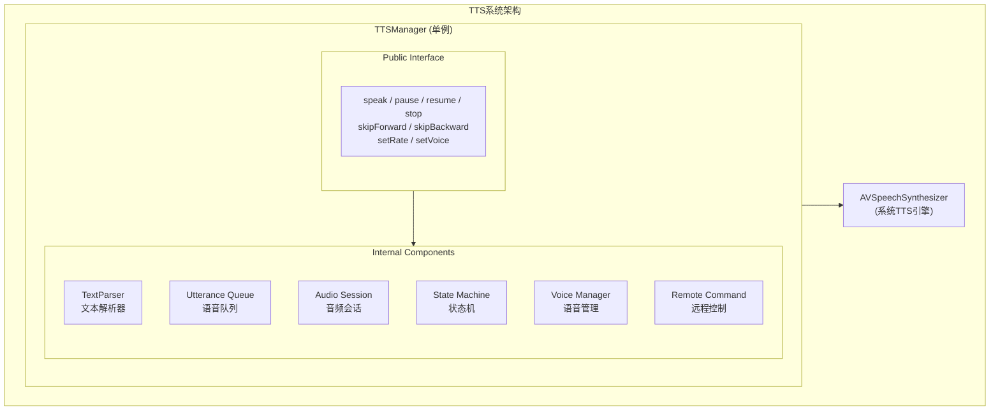
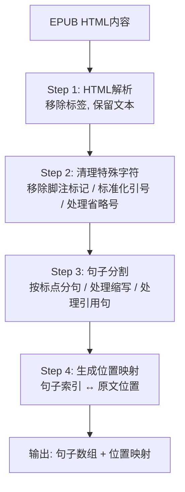
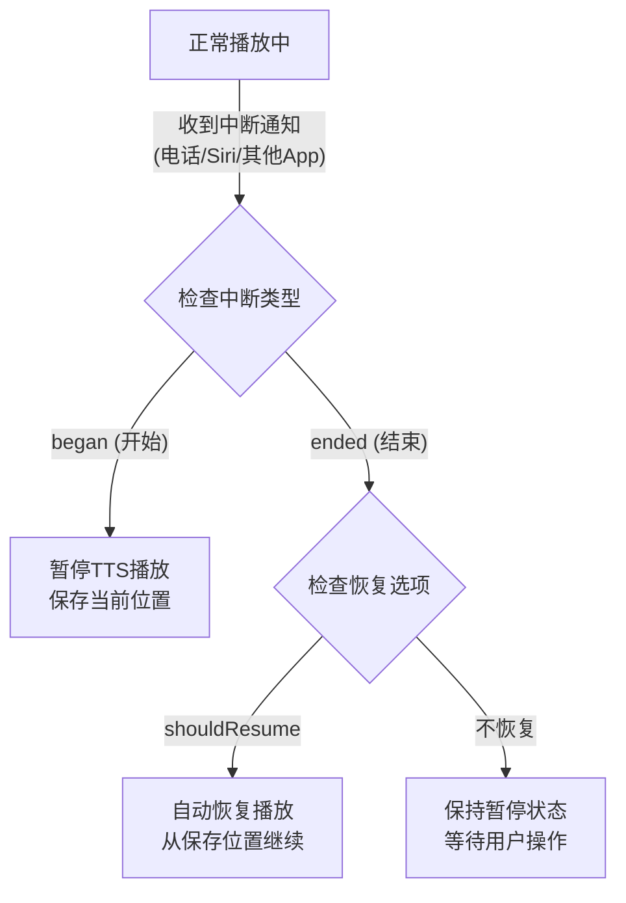

# TTS系统实现文档

## 文档信息

| 项目 | 内容 |
|------|------|
| 功能模块 | TTS文字转语音系统 |
| 文档版本 | 1.0 |
| 最后更新 | 2024年12月 |
| 关联文档 | smart-reading-system.md, human-voice-system.md |

---

## 1. 功能概述

### 1.1 核心功能

将EPUB书籍文本内容转换为语音输出，支持多种语音引擎、语速调节、音色选择，并与阅读界面实时同步。

### 1.2 功能边界

```
┌─────────────────────────────────────────────────────────────────┐
│                      TTS系统功能边界                             │
├─────────────────────────────────────────────────────────────────┤
│                                                                 │
│  ✅ 包含功能:                                                    │
│  ┌─────────────────────────────────────────────────────────┐   │
│  │  • 系统TTS引擎 (AVSpeechSynthesizer)                    │   │
│  │  • 文本预处理与分句                                      │   │
│  │  • 语速/音调/音量控制                                    │   │
│  │  • 多语言语音选择                                        │   │
│  │  • 播放状态管理                                          │   │
│  │  • 后台播放支持                                          │   │
│  │  • 锁屏控制集成                                          │   │
│  │  • 播放进度回调                                          │   │
│  └─────────────────────────────────────────────────────────┘   │
│                                                                 │
│  ❌ 不包含 (其他模块负责):                                       │
│  ┌─────────────────────────────────────────────────────────┐   │
│  │  • 人声音频播放 → human-voice-system                    │   │
│  │  • 高亮同步显示 → highlight-sync-system                 │   │
│  │  • 自动翻页逻辑 → auto-page-turn-system                 │   │
│  │  • AI语音合成 → 单独模块                                 │   │
│  └─────────────────────────────────────────────────────────┘   │
│                                                                 │
└─────────────────────────────────────────────────────────────────┘
```

---

## 2. 系统架构

### 2.1 模块架构图



### 2.2 组件职责表

| 组件 | 职责 | 输入 | 输出 |
|------|------|------|------|
| TTSManager | TTS系统总调度 | 文本、控制指令 | 播放状态、进度回调 |
| TextParser | 文本预处理与分句 | 原始HTML/文本 | 句子数组 |
| UtteranceQueue | 语音片段队列管理 | 句子数组 | AVSpeechUtterance |
| AudioSession | 音频会话配置 | 播放模式 | 音频路由 |
| StateMachine | 播放状态管理 | 控制事件 | 状态变化 |
| VoiceManager | 可用语音管理 | 语言偏好 | 语音列表 |
| RemoteCommand | 锁屏/耳机控制 | 远程事件 | 控制回调 |

---

## 3. 文本预处理

### 3.1 处理流程



### 3.2 句子分割规则

| 规则 | 说明 | 示例 |
|------|------|------|
| 句号分割 | 遇到 .!? 分割 | "Hello." → 分割 |
| 缩写保护 | Dr. Mr. Mrs. 等不分割 | "Dr. Smith" → 不分割 |
| 引号处理 | 引号内的句号不分割 | "He said 'Go.'" → 不分割 |
| 省略号 | ... 不作为句子结束 | "Wait..." → 不分割 |
| 数字小数点 | 3.14 不分割 | "Pi is 3.14." → 分割在句末 |
| 最大长度 | 超过500字符强制分割 | 长句 → 在逗号处分割 |

### 3.3 特殊字符处理

```
┌─────────────────────────────────────────────────────────────────┐
│                    特殊字符处理规则                              │
├─────────────────────────────────────────────────────────────────┤
│                                                                 │
│  移除类:                                                         │
│  ┌─────────────────────────────────────────────────────────┐   │
│  │  • 脚注标记: [1] [2] ¹ ² ³                              │   │
│  │  • 内嵌注释: <!-- comment -->                           │   │
│  │  • 不可见字符: \u200B \uFEFF                            │   │
│  │  • 多余空白: 连续空格/换行 → 单个空格                   │   │
│  └─────────────────────────────────────────────────────────┘   │
│                                                                 │
│  替换类:                                                         │
│  ┌─────────────────────────────────────────────────────────┐   │
│  │  • 智能引号: "" '' → 标准引号                          │   │
│  │  • 破折号: — – → 短暂停顿                              │   │
│  │  • 省略号: … → ...                                      │   │
│  │  • HTML实体: &amp; → & , &nbsp; → 空格                  │   │
│  └─────────────────────────────────────────────────────────┘   │
│                                                                 │
│  扩展类 (可选):                                                  │
│  ┌─────────────────────────────────────────────────────────┐   │
│  │  • 数字: 1984 → nineteen eighty-four                   │   │
│  │  • 缩写: etc. → et cetera                              │   │
│  │  • 符号: $ → dollars, % → percent                       │   │
│  └─────────────────────────────────────────────────────────┘   │
│                                                                 │
└─────────────────────────────────────────────────────────────────┘
```

---

## 4. 状态管理

### 4.1 状态机定义

```mermaid
stateDiagram-v2
    [*] --> idle
    idle --> preparing : speak()
    preparing --> speaking : 准备完成
    speaking --> paused : pause()
    paused --> speaking : resume()
    speaking --> stopping : stop() / 播放完成
    paused --> stopping : stop()
    stopping --> idle : 清理完成

    state error
    note right of error : 任何状态发生错误时进入<br>调用 reset() 返回 idle
```

### 4.2 状态转换表

| 当前状态 | 事件 | 下一状态 | 动作 |
|----------|------|----------|------|
| idle | speak() | preparing | 解析文本，配置音频会话 |
| preparing | 准备完成 | speaking | 开始播放第一句 |
| preparing | 错误 | error | 报告错误 |
| speaking | pause() | paused | 暂停合成器 |
| speaking | stop() | stopping | 停止合成器 |
| speaking | 句子完成 | speaking | 播放下一句 |
| speaking | 全部完成 | stopping | 触发完成回调 |
| paused | resume() | speaking | 继续播放 |
| paused | stop() | stopping | 停止合成器 |
| stopping | 清理完成 | idle | 重置状态 |
| error | reset() | idle | 清理错误 |

### 4.3 状态数据模型

```
┌─────────────────────────────────────────────────────────────────┐
│                      状态数据模型                                │
├─────────────────────────────────────────────────────────────────┤
│                                                                 │
│  TTSState                                                        │
│  ├── status: TTSStatus                // 当前状态枚举           │
│  │   ├── idle                                                   │
│  │   ├── preparing                                              │
│  │   ├── speaking                                               │
│  │   ├── paused                                                 │
│  │   ├── stopping                                               │
│  │   └── error                                                  │
│  │                                                              │
│  ├── currentSentenceIndex: Int        // 当前句子索引           │
│  ├── totalSentences: Int              // 总句子数               │
│  ├── currentWordRange: Range?         // 当前朗读词范围         │
│  ├── progress: Double                 // 进度 (0.0 - 1.0)       │
│  ├── elapsedTime: TimeInterval        // 已播放时长             │
│  ├── estimatedTotalTime: TimeInterval // 预估总时长             │
│  └── error: TTSError?                 // 错误信息               │
│                                                                 │
│  TTSConfiguration                                                │
│  ├── rate: Float                      // 语速 (0.0 - 1.0)       │
│  ├── pitch: Float                     // 音调 (0.5 - 2.0)       │
│  ├── volume: Float                    // 音量 (0.0 - 1.0)       │
│  ├── voiceIdentifier: String?         // 语音标识               │
│  ├── language: String                 // 语言代码 (en-US)       │
│  └── preUtteranceDelay: TimeInterval  // 句间停顿               │
│                                                                 │
└─────────────────────────────────────────────────────────────────┘
```

---

## 5. 语音队列管理

### 5.1 队列结构

```
┌─────────────────────────────────────────────────────────────────┐
│                      语音队列管理                                │
├─────────────────────────────────────────────────────────────────┤
│                                                                 │
│  队列结构:                                                       │
│  ┌─────────────────────────────────────────────────────────┐   │
│  │                                                         │   │
│  │  ┌───────┐ ┌───────┐ ┌───────┐ ┌───────┐ ┌───────┐    │   │
│  │  │ Utt 1 │ │ Utt 2 │ │ Utt 3 │ │ Utt 4 │ │ Utt 5 │    │   │
│  │  │ 已播放 │ │ 当前  │ │ 预加载│ │ 待播放│ │ 待播放│    │   │
│  │  └───────┘ └───────┘ └───────┘ └───────┘ └───────┘    │   │
│  │      ↑         ↑         ↑                             │   │
│  │   已完成     正在播放   预加载区                        │   │
│  │                                                         │   │
│  └─────────────────────────────────────────────────────────┘   │
│                                                                 │
│  队列策略:                                                       │
│  ┌─────────────────────────────────────────────────────────┐   │
│  │                                                         │   │
│  │  • 预加载: 提前准备后续2-3个Utterance                   │   │
│  │  • 懒加载: 后续句子在需要时才创建Utterance              │   │
│  │  • 回收: 已播放的Utterance及时释放                      │   │
│  │  • 跳转: 支持跳到任意句子位置                           │   │
│  │                                                         │   │
│  └─────────────────────────────────────────────────────────┘   │
│                                                                 │
└─────────────────────────────────────────────────────────────────┘
```

### 5.2 Utterance配置

```
┌─────────────────────────────────────────────────────────────────┐
│                    AVSpeechUtterance配置                         │
├─────────────────────────────────────────────────────────────────┤
│                                                                 │
│  参数配置:                                                       │
│  ┌─────────────────────────────────────────────────────────┐   │
│  │                                                         │   │
│  │  参数              范围           默认值    说明        │   │
│  │  ────────────────────────────────────────────────────  │   │
│  │  rate              0.0 - 1.0      0.5      语速        │   │
│  │  pitchMultiplier   0.5 - 2.0      1.0      音调        │   │
│  │  volume            0.0 - 1.0      1.0      音量        │   │
│  │  preUtteranceDelay 0.0 - 5.0      0.0      前置延迟    │   │
│  │  postUtteranceDelay 0.0 - 5.0     0.0      后置延迟    │   │
│  │                                                         │   │
│  └─────────────────────────────────────────────────────────┘   │
│                                                                 │
│  语速映射 (用户界面 → 实际值):                                   │
│  ┌─────────────────────────────────────────────────────────┐   │
│  │                                                         │   │
│  │  用户选项      rate值      说明                         │   │
│  │  ────────────────────────────────────────────────────  │   │
│  │  0.5x          0.25        慢速                        │   │
│  │  0.75x         0.375       较慢                        │   │
│  │  1.0x          0.5         正常 (默认)                 │   │
│  │  1.25x         0.55        较快                        │   │
│  │  1.5x          0.6         快速                        │   │
│  │  2.0x          0.7         倍速                        │   │
│  │                                                         │   │
│  │  注: rate=1.0 是最快速度，通常不使用                   │   │
│  │                                                         │   │
│  └─────────────────────────────────────────────────────────┘   │
│                                                                 │
└─────────────────────────────────────────────────────────────────┘
```

---

## 6. 语音管理

### 6.1 可用语音获取

```
┌─────────────────────────────────────────────────────────────────┐
│                      语音管理流程                                │
├─────────────────────────────────────────────────────────────────┤
│                                                                 │
│  获取可用语音:                                                   │
│                                                                 │
│         启动                      筛选                  排序    │
│           │                        │                      │    │
│           ▼                        ▼                      ▼    │
│  ┌─────────────┐          ┌─────────────┐        ┌───────────┐│
│  │ 获取所有    │          │ 按语言筛选  │        │ 质量排序  ││
│  │ AVSpeech    │ ───────> │             │ ─────> │           ││
│  │ Voice       │          │ 匹配书籍    │        │ 增强优先  ││
│  └─────────────┘          │ 语言设置    │        └───────────┘│
│                           └─────────────┘                      │
│                                                                 │
│  语音分类:                                                       │
│  ┌─────────────────────────────────────────────────────────┐   │
│  │                                                         │   │
│  │  质量等级:                                              │   │
│  │  • Premium (增强版): 需下载，音质最好                   │   │
│  │  • Enhanced (提升版): 需下载，音质较好                  │   │
│  │  • Default (默认版): 内置，音质一般                     │   │
│  │                                                         │   │
│  │  语言归类:                                              │   │
│  │  • en-US: Samantha, Alex, Allison...                   │   │
│  │  • en-GB: Daniel, Kate, Oliver...                      │   │
│  │  • zh-CN: Tingting, Lili...                            │   │
│  │  • zh-TW: Meijia...                                    │   │
│  │                                                         │   │
│  └─────────────────────────────────────────────────────────┘   │
│                                                                 │
└─────────────────────────────────────────────────────────────────┘
```

### 6.2 语音选择界面数据

```
┌─────────────────────────────────────────────────────────────────┐
│                      语音列表数据结构                            │
├─────────────────────────────────────────────────────────────────┤
│                                                                 │
│  VoiceInfo                                                       │
│  ├── identifier: String              // 系统标识符              │
│  ├── name: String                    // 显示名称                │
│  ├── language: String                // 语言代码                │
│  ├── languageDisplay: String         // 语言显示名              │
│  ├── quality: VoiceQuality           // 质量等级                │
│  │   ├── premium                                                │
│  │   ├── enhanced                                               │
│  │   └── default                                                │
│  ├── gender: VoiceGender             // 性别                    │
│  │   ├── male                                                   │
│  │   ├── female                                                 │
│  │   └── unspecified                                            │
│  ├── isDownloaded: Bool              // 是否已下载              │
│  └── downloadSize: Int64?            // 下载大小 (字节)         │
│                                                                 │
│  分组展示:                                                       │
│  ┌─────────────────────────────────────────────────────────┐   │
│  │                                                         │   │
│  │  English (United States)                                │   │
│  │  ├── Samantha (Premium) ★                   [已下载]    │   │
│  │  ├── Alex (Enhanced)                        [下载 45MB] │   │
│  │  └── Allison (Default)                      [内置]      │   │
│  │                                                         │   │
│  │  English (United Kingdom)                               │   │
│  │  ├── Daniel (Premium) ★                     [已下载]    │   │
│  │  └── Kate (Enhanced)                        [下载 38MB] │   │
│  │                                                         │   │
│  └─────────────────────────────────────────────────────────┘   │
│                                                                 │
└─────────────────────────────────────────────────────────────────┘
```

---

## 7. 音频会话配置

### 7.1 AVAudioSession配置

```
┌─────────────────────────────────────────────────────────────────┐
│                    音频会话配置                                  │
├─────────────────────────────────────────────────────────────────┤
│                                                                 │
│  Category配置:                                                   │
│  ┌─────────────────────────────────────────────────────────┐   │
│  │                                                         │   │
│  │  场景              Category              Mode           │   │
│  │  ────────────────────────────────────────────────────  │   │
│  │  前台播放          playback              default        │   │
│  │  后台播放          playback              default        │   │
│  │  混合播放          playback              default        │   │
│  │                    + mixWithOthers                      │   │
│  │  录音播放          playAndRecord         default        │   │
│  │                                                         │   │
│  └─────────────────────────────────────────────────────────┘   │
│                                                                 │
│  Options配置:                                                    │
│  ┌─────────────────────────────────────────────────────────┐   │
│  │                                                         │   │
│  │  选项                    用途                           │   │
│  │  ────────────────────────────────────────────────────  │   │
│  │  duckOthers              降低其他App音量                │   │
│  │  allowBluetooth          支持蓝牙设备                   │   │
│  │  allowAirPlay            支持AirPlay                   │   │
│  │  defaultToSpeaker        默认使用扬声器                 │   │
│  │                                                         │   │
│  └─────────────────────────────────────────────────────────┘   │
│                                                                 │
└─────────────────────────────────────────────────────────────────┘
```

### 7.2 中断处理



---

## 8. 后台播放

### 8.1 后台播放配置

```
┌─────────────────────────────────────────────────────────────────┐
│                      后台播放配置                                │
├─────────────────────────────────────────────────────────────────┤
│                                                                 │
│  Info.plist配置:                                                 │
│  ┌─────────────────────────────────────────────────────────┐   │
│  │                                                         │   │
│  │  UIBackgroundModes:                                     │   │
│  │  └── audio    (必需)                                    │   │
│  │                                                         │   │
│  └─────────────────────────────────────────────────────────┘   │
│                                                                 │
│  激活条件:                                                       │
│  ┌─────────────────────────────────────────────────────────┐   │
│  │                                                         │   │
│  │  1. AVAudioSession category = playback                 │   │
│  │  2. AVAudioSession 已激活                               │   │
│  │  3. 有音频正在播放或即将播放                            │   │
│  │  4. Info.plist 配置正确                                 │   │
│  │                                                         │   │
│  └─────────────────────────────────────────────────────────┘   │
│                                                                 │
│  生命周期处理:                                                   │
│  ┌─────────────────────────────────────────────────────────┐   │
│  │                                                         │   │
│  │  App进入后台:                                           │   │
│  │  • 继续TTS播放                                          │   │
│  │  • 更新Now Playing信息                                  │   │
│  │  • 保持音频会话活跃                                     │   │
│  │                                                         │   │
│  │  App回到前台:                                           │   │
│  │  • 同步UI状态                                           │   │
│  │  • 更新高亮位置                                         │   │
│  │  • 刷新进度显示                                         │   │
│  │                                                         │   │
│  └─────────────────────────────────────────────────────────┘   │
│                                                                 │
└─────────────────────────────────────────────────────────────────┘
```

### 8.2 锁屏控制 (MPRemoteCommandCenter)

```
┌─────────────────────────────────────────────────────────────────┐
│                    锁屏控制中心配置                              │
├─────────────────────────────────────────────────────────────────┤
│                                                                 │
│  支持的控制命令:                                                 │
│  ┌─────────────────────────────────────────────────────────┐   │
│  │                                                         │   │
│  │  命令                    处理                           │   │
│  │  ────────────────────────────────────────────────────  │   │
│  │  playCommand             → TTSManager.resume()         │   │
│  │  pauseCommand            → TTSManager.pause()          │   │
│  │  togglePlayPauseCommand  → 切换播放/暂停               │   │
│  │  nextTrackCommand        → 跳到下一句/段               │   │
│  │  previousTrackCommand    → 跳到上一句/段               │   │
│  │  skipForwardCommand      → 快进15秒                    │   │
│  │  skipBackwardCommand     → 快退15秒                    │   │
│  │  changePlaybackRateCommand → 调整语速                  │   │
│  │                                                         │   │
│  └─────────────────────────────────────────────────────────┘   │
│                                                                 │
│  Now Playing信息 (MPNowPlayingInfoCenter):                      │
│  ┌─────────────────────────────────────────────────────────┐   │
│  │                                                         │   │
│  │  信息项                  内容                           │   │
│  │  ────────────────────────────────────────────────────  │   │
│  │  MPMediaItemPropertyTitle           章节标题           │   │
│  │  MPMediaItemPropertyArtist          作者名             │   │
│  │  MPMediaItemPropertyAlbumTitle      书名               │   │
│  │  MPMediaItemPropertyArtwork         封面图             │   │
│  │  MPMediaItemPropertyPlaybackDuration 预估时长          │   │
│  │  MPNowPlayingInfoPropertyElapsedPlaybackTime 已播放    │   │
│  │  MPNowPlayingInfoPropertyPlaybackRate 当前语速         │   │
│  │                                                         │   │
│  └─────────────────────────────────────────────────────────┘   │
│                                                                 │
└─────────────────────────────────────────────────────────────────┘
```

---

## 9. 回调与事件

### 9.1 委托回调设计

```
┌─────────────────────────────────────────────────────────────────┐
│                      TTS回调协议                                 │
├─────────────────────────────────────────────────────────────────┤
│                                                                 │
│  TTSManagerDelegate                                              │
│  │                                                              │
│  ├── 状态回调                                                   │
│  │   ├── ttsDidChangeState(to:)          状态变化              │
│  │   ├── ttsDidStart()                   开始播放              │
│  │   ├── ttsDidPause()                   暂停播放              │
│  │   ├── ttsDidResume()                  恢复播放              │
│  │   ├── ttsDidStop()                    停止播放              │
│  │   └── ttsDidFinish()                  播放完成              │
│  │                                                              │
│  ├── 进度回调                                                   │
│  │   ├── ttsDidStartSentence(index:, text:, range:)            │
│  │   │   开始朗读某句                                          │
│  │   ├── ttsDidProgressWord(range:)                            │
│  │   │   正在朗读某词 (用于逐词高亮)                           │
│  │   ├── ttsDidFinishSentence(index:)                          │
│  │   │   完成某句朗读                                          │
│  │   └── ttsProgressDidUpdate(progress:, time:)                │
│  │       整体进度更新                                          │
│  │                                                              │
│  └── 错误回调                                                   │
│      └── ttsDidEncounterError(_:)        发生错误              │
│                                                                 │
└─────────────────────────────────────────────────────────────────┘
```

### 9.2 进度回调数据

```
┌─────────────────────────────────────────────────────────────────┐
│                      进度回调数据结构                            │
├─────────────────────────────────────────────────────────────────┤
│                                                                 │
│  SentenceProgress                                                │
│  ├── sentenceIndex: Int              // 句子索引                │
│  ├── totalSentences: Int             // 总句子数                │
│  ├── text: String                    // 句子文本                │
│  ├── textRange: NSRange              // 在原文中的范围          │
│  └── cfi: String                     // EPUB CFI位置            │
│                                                                 │
│  WordProgress                                                    │
│  ├── wordRange: NSRange              // 词在句中的范围          │
│  ├── characterRange: NSRange         // 词在原文中的范围        │
│  └── word: String                    // 当前词                  │
│                                                                 │
│  OverallProgress                                                 │
│  ├── progress: Double                // 0.0 - 1.0              │
│  ├── currentSentence: Int            // 当前句子               │
│  ├── totalSentences: Int             // 总句子数               │
│  ├── elapsedTime: TimeInterval       // 已播放时间             │
│  ├── estimatedRemaining: TimeInterval // 预估剩余时间          │
│  └── currentChapter: String          // 当前章节               │
│                                                                 │
└─────────────────────────────────────────────────────────────────┘
```

---

## 10. 错误处理

### 10.1 错误类型定义

```
┌─────────────────────────────────────────────────────────────────┐
│                      TTS错误类型                                 │
├─────────────────────────────────────────────────────────────────┤
│                                                                 │
│  TTSError                                                        │
│  │                                                              │
│  ├── 初始化错误                                                 │
│  │   ├── audioSessionSetupFailed      音频会话配置失败         │
│  │   └── noAvailableVoice             无可用语音               │
│  │                                                              │
│  ├── 文本处理错误                                               │
│  │   ├── textParsingFailed            文本解析失败             │
│  │   ├── emptyContent                 内容为空                 │
│  │   └── invalidPosition              无效位置                 │
│  │                                                              │
│  ├── 播放错误                                                   │
│  │   ├── synthesisInterrupted         合成被中断               │
│  │   ├── audioRouteChanged            音频路由变化             │
│  │   └── systemInterruption           系统中断                 │
│  │                                                              │
│  └── 语音错误                                                   │
│      ├── voiceNotFound                语音未找到               │
│      ├── voiceNotDownloaded           语音未下载               │
│      └── languageMismatch             语言不匹配               │
│                                                                 │
└─────────────────────────────────────────────────────────────────┘
```

### 10.2 错误恢复策略

| 错误类型 | 恢复策略 | 用户提示 |
|----------|----------|----------|
| audioSessionSetupFailed | 重试配置，降级模式 | "音频初始化失败，请重试" |
| noAvailableVoice | 使用系统默认语音 | "正在使用默认语音" |
| textParsingFailed | 跳过问题句子 | 静默处理 |
| synthesisInterrupted | 自动恢复播放 | 无提示 |
| audioRouteChanged | 适应新路由 | 无提示 |
| systemInterruption | 等待中断结束恢复 | 无提示 |
| voiceNotDownloaded | 提示下载或使用默认 | "请下载增强语音或使用默认" |

---

## 11. 性能优化

### 11.1 内存优化

```
┌─────────────────────────────────────────────────────────────────┐
│                      内存优化策略                                │
├─────────────────────────────────────────────────────────────────┤
│                                                                 │
│  Utterance管理:                                                  │
│  ┌─────────────────────────────────────────────────────────┐   │
│  │                                                         │   │
│  │  • 预创建: 最多保持3个Utterance在内存                   │   │
│  │  • 及时释放: 播放完成后立即释放                         │   │
│  │  • 懒加载: 后续Utterance在需要时才创建                  │   │
│  │                                                         │   │
│  └─────────────────────────────────────────────────────────┘   │
│                                                                 │
│  文本缓存:                                                       │
│  ┌─────────────────────────────────────────────────────────┐   │
│  │                                                         │   │
│  │  • 分章节解析: 只解析当前和下一章节                     │   │
│  │  • 句子数组: 使用索引而非完整拷贝                       │   │
│  │  • 位置映射: 按需计算而非全部预计算                     │   │
│  │                                                         │   │
│  └─────────────────────────────────────────────────────────┘   │
│                                                                 │
│  内存警告处理:                                                   │
│  ┌─────────────────────────────────────────────────────────┐   │
│  │                                                         │   │
│  │  • 释放非必要的预加载Utterance                          │   │
│  │  • 清理已播放章节的句子缓存                             │   │
│  │  • 保留当前播放状态                                     │   │
│  │                                                         │   │
│  └─────────────────────────────────────────────────────────┘   │
│                                                                 │
└─────────────────────────────────────────────────────────────────┘
```

### 11.2 响应性优化

| 优化项 | 策略 | 效果 |
|--------|------|------|
| 快速启动 | 异步解析文本 | 点击后立即响应 |
| 平滑切换 | 预加载下一句 | 句间无延迟 |
| 跳转优化 | 取消当前合成再跳转 | 跳转即时响应 |
| 语速切换 | 实时应用新语速 | 无需重新开始 |

---

## 12. 测试要点

### 12.1 功能测试

| 测试项 | 测试内容 | 验收标准 |
|--------|----------|----------|
| 基本播放 | 开始/暂停/停止/继续 | 状态正确切换 |
| 语速调节 | 各档位语速 | 实际语速符合预期 |
| 语音切换 | 切换不同语音 | 切换后立即生效 |
| 跳转 | 前后跳转 | 跳转到正确位置 |
| 后台播放 | App进入后台 | 继续播放不中断 |
| 锁屏控制 | 锁屏界面控制 | 控制命令正确响应 |
| 中断恢复 | 电话/Siri中断 | 中断后正确恢复 |

### 12.2 边界测试

| 测试项 | 测试场景 | 预期行为 |
|--------|----------|----------|
| 空内容 | 章节无文本 | 跳过该章节 |
| 超长句子 | 单句>1000字符 | 正确分割播放 |
| 特殊字符 | 含emoji/特殊符号 | 正确处理或跳过 |
| 多语言混合 | 中英文混合 | 使用合适语音 |
| 快速操作 | 快速点击控制 | 状态不混乱 |

---

## 13. 依赖接口

### 13.1 对外提供接口

```
┌─────────────────────────────────────────────────────────────────┐
│                    TTS系统对外接口                               │
├─────────────────────────────────────────────────────────────────┤
│                                                                 │
│  主要接口:                                                       │
│  ┌─────────────────────────────────────────────────────────┐   │
│  │                                                         │   │
│  │  // 播放控制                                            │   │
│  │  speak(chapter:, fromPosition:) → 开始朗读              │   │
│  │  pause() → 暂停                                         │   │
│  │  resume() → 继续                                        │   │
│  │  stop() → 停止                                          │   │
│  │  skipToSentence(index:) → 跳转                          │   │
│  │                                                         │   │
│  │  // 配置                                                │   │
│  │  setRate(_:) → 设置语速                                 │   │
│  │  setVoice(_:) → 设置语音                                │   │
│  │  getAvailableVoices() → 获取可用语音列表                │   │
│  │                                                         │   │
│  │  // 状态                                                │   │
│  │  getCurrentState() → 获取当前状态                       │   │
│  │  getProgress() → 获取播放进度                           │   │
│  │                                                         │   │
│  └─────────────────────────────────────────────────────────┘   │
│                                                                 │
└─────────────────────────────────────────────────────────────────┘
```

### 13.2 依赖的外部接口

| 依赖模块 | 接口 | 用途 |
|----------|------|------|
| EPUBParser | getChapterContent(index:) | 获取章节文本 |
| EPUBParser | getTextAtCFI(cfi:) | 根据CFI获取文本 |
| HighlightSync | updateHighlight(range:) | 更新高亮位置 |
| AutoPageTurn | shouldTurnPage() | 判断是否需要翻页 |
| ReaderSettings | getTTSSettings() | 获取用户设置 |

---

## 附录

### A. 系统API版本要求

| API | 最低iOS版本 | 说明 |
|-----|-------------|------|
| AVSpeechSynthesizer | iOS 7.0 | 核心TTS |
| AVSpeechSynthesisVoice | iOS 7.0 | 语音管理 |
| MPRemoteCommandCenter | iOS 7.1 | 远程控制 |
| MPNowPlayingInfoCenter | iOS 5.0 | Now Playing |
| AVAudioSession | iOS 6.0 | 音频会话 |

### B. 语音下载说明

| 语音类型 | 下载方式 | 存储位置 |
|----------|----------|----------|
| Default | 系统内置 | 系统目录 |
| Enhanced | 设置App下载 | 系统目录 |
| Premium | 设置App下载 | 系统目录 |

下载路径: 设置 → 辅助功能 → 朗读内容 → 声音

---

## 变更记录

| 版本 | 日期 | 变更内容 |
|------|------|----------|
| 1.0 | 2024-12 | 初始版本 |
