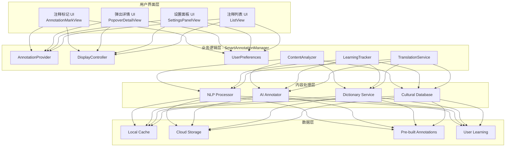

# 智能注释系统设计文档

## 文档信息

| 项目 | 内容 |
|------|------|
| 功能模块 | 智能注释系统 (Smart Annotation System) |
| 文档版本 | 1.0 |
| 最后更新 | 2024年12月 |
| 关联文档 | advanced-reader-design.md, annotation-highlighting-system.md |

---

## 1. 功能概述

### 1.1 核心目标

为非英语母语读者提供智能化的阅读辅助，通过预处理文本自动识别并解释生僻词汇、俚语、双关语、文化典故等难以理解的内容，降低阅读门槛，提升阅读体验。

### 1.2 功能范围

```
┌─────────────────────────────────────────────────────────────────┐
│                      智能注释系统                                │
├─────────────────────────────────────────────────────────────────┤
│                                                                 │
│  ┌──────────────────────────────────────────────────────────┐  │
│  │                      注释内容类型                          │  │
│  │                                                          │  │
│  │  ┌─────────────┐  ┌─────────────┐  ┌─────────────┐      │  │
│  │  │  生僻词汇    │  │  俚语俗语    │  │  双关语      │      │  │
│  │  │             │  │             │  │             │      │  │
│  │  │ • 古英语词  │  │ • 口语表达  │  │ • 文字游戏  │      │  │
│  │  │ • 专业术语  │  │ • 地区俚语  │  │ • 谐音梗   │      │  │
│  │  │ • 外来词汇  │  │ • 网络用语  │  │ • 双重含义  │      │  │
│  │  │ • 历史词汇  │  │ • 习惯用语  │  │ • 反讽表达  │      │  │
│  │  └─────────────┘  └─────────────┘  └─────────────┘      │  │
│  │                                                          │  │
│  │  ┌─────────────┐  ┌─────────────┐  ┌─────────────┐      │  │
│  │  │  文化典故    │  │  历史背景    │  │  专业知识    │      │  │
│  │  │             │  │             │  │             │      │  │
│  │  │ • 神话传说  │  │ • 历史事件  │  │ • 科学术语  │      │  │
│  │  │ • 文学引用  │  │ • 时代背景  │  │ • 法律用语  │      │  │
│  │  │ • 宗教典故  │  │ • 社会习俗  │  │ • 医学术语  │      │  │
│  │  │ • 流行文化  │  │ • 政治背景  │  │ • 技术概念  │      │  │
│  │  └─────────────┘  └─────────────┘  └─────────────┘      │  │
│  │                                                          │  │
│  └──────────────────────────────────────────────────────────┘  │
│                                                                 │
│  ┌──────────────────────────────────────────────────────────┐  │
│  │                      交互与展示                           │  │
│  │                                                          │  │
│  │  ┌─────────────────────┐  ┌─────────────────────┐       │  │
│  │  │     显示方式          │  │     用户设置          │       │  │
│  │  │                     │  │                     │       │  │
│  │  │ • 行内小标记        │  │ • 注释密度控制      │       │  │
│  │  │ • 下划虚线提示      │  │ • 难度等级筛选      │       │  │
│  │  │ • 弹出气泡详情      │  │ • 类型偏好设置      │       │  │
│  │  │ • 侧边栏列表        │  │ • 母语选择          │       │  │
│  │  └─────────────────────┘  └─────────────────────┘       │  │
│  │                                                          │  │
│  └──────────────────────────────────────────────────────────┘  │
│                                                                 │
└─────────────────────────────────────────────────────────────────┘
```

### 1.3 典型场景示例

| 场景类型 | 原文示例 | 注释内容 |
|----------|----------|----------|
| 生僻词汇 | "The egregious error..." | egregious: 极其恶劣的 (源自拉丁语，原意为"出众的") |
| 俚语 | "He kicked the bucket" | 俚语: 去世、死亡 (非字面意思踢桶子) |
| 双关语 | "Time flies like an arrow" | 双关: 时光飞逝/时间蝇喜欢箭 (利用flies多义) |
| 文化典故 | "It was his Achilles' heel" | 希腊神话: 阿喀琉斯之踵，指致命弱点 |
| 历史背景 | "Like the Ides of March" | 古罗马: 三月十五日，凯撒遇刺日，喻危险日子 |

---

## 2. 系统架构

### 2.1 整体架构图



### 2.2 组件职责

| 组件 | 职责 | 依赖 |
|------|------|------|
| AnnotationMarkView | 显示注释标记 | WebView Bridge |
| PopoverDetailView | 弹出详情展示 | SwiftUI |
| SettingsPanelView | 用户偏好设置 | UserDefaults |
| AnnotationProvider | 获取注释内容 | NLP/AI/Dictionary |
| DisplayController | 控制显示逻辑 | User Preferences |
| ContentAnalyzer | 内容难度分析 | NLP Processor |
| LearningTracker | 学习进度追踪 | CoreData |
| NLPProcessor | 自然语言处理 | Apple NaturalLanguage |
| AIAnnotator | AI注释生成 | GPT/Claude API |
| DictionaryService | 词典查询 | Local/Online |
| CulturalDatabase | 文化背景知识库 | Local Database |

---

## 3. 注释内容类型详细设计

### 3.1 生僻词汇注释

```
┌─────────────────────────────────────────────────────────────────┐
│                      生僻词汇注释系统                            │
├─────────────────────────────────────────────────────────────────┤
│                                                                 │
│  识别标准:                                                       │
│  ┌─────────────────────────────────────────────────────────┐   │
│  │                                                         │   │
│  │  词频等级划分 (基于COCA语料库):                         │   │
│  │                                                         │   │
│  │  ┌─────────────────────────────────────────────────┐   │   │
│  │  │  Level 1: 1-2000      高频词 (不注释)           │   │   │
│  │  │  Level 2: 2001-5000   中频词 (可选注释)         │   │   │
│  │  │  Level 3: 5001-10000  低频词 (建议注释)         │   │   │
│  │  │  Level 4: 10001+      罕见词 (必须注释)         │   │   │
│  │  └─────────────────────────────────────────────────┘   │   │
│  │                                                         │   │
│  └─────────────────────────────────────────────────────────┘   │
│                                                                 │
│  注释内容结构:                                                   │
│  ┌─────────────────────────────────────────────────────────┐   │
│  │                                                         │   │
│  │  词汇: egregious                                        │   │
│  │  音标: /ɪˈɡriːdʒəs/  [🔊]                               │   │
│  │  释义: adj. 极其恶劣的，过分的                          │   │
│  │  词源: 拉丁语 egregius "出众的" (e- 出 + grex 群)      │   │
│  │                                                         │   │
│  │  ─────────────────────────────────────────────────────  │   │
│  │  例句: "This is an egregious violation of the rules."  │   │
│  │  翻译: 这是对规则的严重违反。                           │   │
│  │                                                         │   │
│  │  ─────────────────────────────────────────────────────  │   │
│  │  同义词: flagrant, glaring, outrageous                  │   │
│  │  反义词: minor, trivial                                 │   │
│  │                                                         │   │
│  └─────────────────────────────────────────────────────────┘   │
│                                                                 │
└─────────────────────────────────────────────────────────────────┘
```

### 3.2 俚语俗语注释

```
┌─────────────────────────────────────────────────────────────────┐
│                      俚语俗语注释系统                            │
├─────────────────────────────────────────────────────────────────┤
│                                                                 │
│  俚语分类:                                                       │
│  ┌─────────────────────────────────────────────────────────┐   │
│  │                                                         │   │
│  │  ┌─────────────┬──────────────────────────────────┐   │   │
│  │  │ 类型        │ 示例                               │   │   │
│  │  ├─────────────┼──────────────────────────────────┤   │   │
│  │  │ 美式俚语    │ "piece of cake" (小菜一碟)        │   │   │
│  │  │ 英式俚语    │ "Bob's your uncle" (就这么简单)   │   │   │
│  │  │ 澳洲俚语    │ "no worries" (没问题)             │   │   │
│  │  │ 习惯用语    │ "break a leg" (祝好运)            │   │   │
│  │  │ 网络用语    │ "FOMO" (害怕错过)                 │   │   │
│  │  │ 行业黑话    │ "ballpark figure" (大概数字)      │   │   │
│  │  └─────────────┴──────────────────────────────────┘   │   │
│  │                                                         │   │
│  └─────────────────────────────────────────────────────────┘   │
│                                                                 │
│  注释展示示例:                                                   │
│  ┌─────────────────────────────────────────────────────────┐   │
│  │                                                         │   │
│  │  俚语: kick the bucket                                  │   │
│  │  类型: 美式俚语 | 委婉语                                │   │
│  │                                                         │   │
│  │  ─────────────────────────────────────────────────────  │   │
│  │  字面意思: 踢桶子                                       │   │
│  │  实际含义: 去世、死亡                                   │   │
│  │                                                         │   │
│  │  ─────────────────────────────────────────────────────  │   │
│  │  🎭 语气: 非正式，略带幽默                              │   │
│  │  ⚠️ 使用场景: 非正式场合，避免在葬礼等场合使用         │   │
│  │                                                         │   │
│  │  ─────────────────────────────────────────────────────  │   │
│  │  💡 来源: 可能源自绞刑时踢开脚下的桶                   │   │
│  │                                                         │   │
│  │  ─────────────────────────────────────────────────────  │   │
│  │  🔄 同义表达:                                           │   │
│  │  • pass away (较正式)                                   │   │
│  │  • bite the dust (俚语)                                 │   │
│  │  • meet one's maker (委婉)                              │   │
│  │                                                         │   │
│  └─────────────────────────────────────────────────────────┘   │
│                                                                 │
└─────────────────────────────────────────────────────────────────┘
```

### 3.3 双关语注释

```
┌─────────────────────────────────────────────────────────────────┐
│                      双关语注释系统                              │
├─────────────────────────────────────────────────────────────────┤
│                                                                 │
│  双关类型:                                                       │
│  ┌─────────────────────────────────────────────────────────┐   │
│  │                                                         │   │
│  │  1. 谐音双关 (Homophonic Pun)                          │   │
│  │     利用发音相同或相近的词                              │   │
│  │     例: "I'm reading a book about anti-gravity.        │   │
│  │          It's impossible to put down."                 │   │
│  │                                                         │   │
│  │  2. 语义双关 (Semantic Pun)                            │   │
│  │     利用词语的多重含义                                  │   │
│  │     例: "Time flies like an arrow;                     │   │
│  │          fruit flies like a banana."                   │   │
│  │                                                         │   │
│  │  3. 结构双关 (Syntactic Pun)                           │   │
│  │     利用句法结构的歧义                                  │   │
│  │     例: "I saw a man on a hill with a telescope."     │   │
│  │                                                         │   │
│  └─────────────────────────────────────────────────────────┘   │
│                                                                 │
│  注释展示示例:                                                   │
│  ┌─────────────────────────────────────────────────────────┐   │
│  │                                                         │   │
│  │  🎭 双关语                                              │   │
│  │                                                         │   │
│  │  原文: "Time flies like an arrow;                      │   │
│  │         fruit flies like a banana."                    │   │
│  │                                                         │   │
│  │  ─────────────────────────────────────────────────────  │   │
│  │  📖 双关解析:                                           │   │
│  │                                                         │   │
│  │  第一句: "Time flies like an arrow"                    │   │
│  │  → 时光飞逝如箭 (常规理解)                             │   │
│  │  → 时间蝇喜欢箭 (字面理解，flies作名词)                │   │
│  │                                                         │   │
│  │  第二句: "fruit flies like a banana"                   │   │
│  │  → 果蝇喜欢香蕉 (常规理解)                             │   │
│  │  → 水果飞起来像香蕉 (呼应第一句的双关)                 │   │
│  │                                                         │   │
│  │  ─────────────────────────────────────────────────────  │   │
│  │  💡 妙处: 通过对比两句话，揭示英语语法的歧义性，       │   │
│  │          同时制造幽默效果。                             │   │
│  │                                                         │   │
│  └─────────────────────────────────────────────────────────┘   │
│                                                                 │
└─────────────────────────────────────────────────────────────────┘
```

### 3.4 文化典故注释

```
┌─────────────────────────────────────────────────────────────────┐
│                      文化典故注释系统                            │
├─────────────────────────────────────────────────────────────────┤
│                                                                 │
│  典故分类:                                                       │
│  ┌─────────────────────────────────────────────────────────┐   │
│  │                                                         │   │
│  │  ┌───────────────┬────────────────────────────────┐    │   │
│  │  │ 类别          │ 示例                             │    │   │
│  │  ├───────────────┼────────────────────────────────┤    │   │
│  │  │ 希腊罗马神话  │ Achilles' heel, Pandora's box  │    │   │
│  │  │ 圣经典故      │ David and Goliath, Good Samaritan │  │   │
│  │  │ 莎士比亚      │ star-crossed lovers, green-eyed  │    │   │
│  │  │ 历史事件      │ Ides of March, Waterloo         │    │   │
│  │  │ 流行文化      │ Catch-22, Big Brother           │    │   │
│  │  │ 东方文化      │ karma, feng shui                │    │   │
│  │  └───────────────┴────────────────────────────────┘    │   │
│  │                                                         │   │
│  └─────────────────────────────────────────────────────────┘   │
│                                                                 │
│  注释展示示例:                                                   │
│  ┌─────────────────────────────────────────────────────────┐   │
│  │                                                         │   │
│  │  📚 文化典故                                            │   │
│  │                                                         │   │
│  │  原文: "It was his Achilles' heel."                    │   │
│  │                                                         │   │
│  │  ─────────────────────────────────────────────────────  │   │
│  │  🏛️ 来源: 希腊神话                                     │   │
│  │                                                         │   │
│  │  📖 典故背景:                                           │   │
│  │  阿喀琉斯是希腊神话中的英雄，出生时母亲海洋女神         │   │
│  │  忒提斯握住他的脚踝将他浸入冥河，使他刀枪不入。         │   │
│  │  但脚踝因被握住而未沾到冥河水，成为唯一弱点。           │   │
│  │  在特洛伊战争中，他被帕里斯用毒箭射中脚踝而死。         │   │
│  │                                                         │   │
│  │  ─────────────────────────────────────────────────────  │   │
│  │  💡 现代含义:                                           │   │
│  │  指一个人或事物的致命弱点、软肋                         │   │
│  │                                                         │   │
│  │  ─────────────────────────────────────────────────────  │   │
│  │  📝 例句:                                               │   │
│  │  "His temper was his Achilles' heel in negotiations."  │   │
│  │  他的脾气是他在谈判中的致命弱点。                       │   │
│  │                                                         │   │
│  │  ─────────────────────────────────────────────────────  │   │
│  │  🔗 相关典故:                                           │   │
│  │  • Trojan Horse (特洛伊木马)                           │   │
│  │  • Helen of Troy (海伦，倾国倾城)                      │   │
│  │                                                         │   │
│  │  [📖 查看完整神话故事]                                  │   │
│  │                                                         │   │
│  └─────────────────────────────────────────────────────────┘   │
│                                                                 │
└─────────────────────────────────────────────────────────────────┘
```

---

## 4. 注释显示设计

### 4.1 显示模式

```
┌─────────────────────────────────────────────────────────────────┐
│                      注释显示模式                                │
├─────────────────────────────────────────────────────────────────┤
│                                                                 │
│  模式1: 行内标记模式 (默认)                                      │
│  ┌─────────────────────────────────────────────────────────┐   │
│  │                                                         │   │
│  │  "The egregious͘ error led to catastrophic͘ results..."   │   │
│  │            ↑                      ↑                     │   │
│  │         小圆点标记              小圆点标记               │   │
│  │                                                         │   │
│  │  特点: 不打断阅读流程，轻量级提示                        │   │
│  │                                                         │   │
│  └─────────────────────────────────────────────────────────┘   │
│                                                                 │
│  模式2: 下划虚线模式                                             │
│  ┌─────────────────────────────────────────────────────────┐   │
│  │                                                         │   │
│  │  "The e̲g̲r̲e̲g̲i̲o̲u̲s̲ error led to c̲a̲t̲a̲s̲t̲r̲o̲p̲h̲i̲c̲ results..."     │   │
│  │       ─ ─ ─ ─                  ─ ─ ─ ─ ─               │   │
│  │       虚线下划                  虚线下划                 │   │
│  │                                                         │   │
│  │  特点: 更明显的视觉提示，适合学习模式                    │   │
│  │                                                         │   │
│  └─────────────────────────────────────────────────────────┘   │
│                                                                 │
│  模式3: 颜色标记模式                                             │
│  ┌─────────────────────────────────────────────────────────┐   │
│  │                                                         │   │
│  │  "The [egregious] error led to [catastrophic] results.." │   │
│  │        (浅紫色)                  (浅蓝色)               │   │
│  │                                                         │   │
│  │  颜色含义:                                              │   │
│  │  • 紫色: 生僻词汇                                       │   │
│  │  • 蓝色: 专业术语                                       │   │
│  │  • 橙色: 俚语俗语                                       │   │
│  │  • 绿色: 文化典故                                       │   │
│  │  • 粉色: 双关语                                         │   │
│  │                                                         │   │
│  └─────────────────────────────────────────────────────────┘   │
│                                                                 │
│  模式4: 边栏注释模式                                             │
│  ┌─────────────────────────────────────────────────────────┐   │
│  │                                                         │   │
│  │  ┌───────────────────────────┬─────────────────────┐   │   │
│  │  │                           │ 📝 注释            │   │   │
│  │  │  "The egregious error    │                     │   │   │
│  │  │   led to catastrophic    │ ① egregious:       │   │   │
│  │  │   results that nobody    │    极其恶劣的       │   │   │
│  │  │   could have predicted." │                     │   │   │
│  │  │                           │ ② catastrophic:    │   │   │
│  │  │                           │    灾难性的        │   │   │
│  │  └───────────────────────────┴─────────────────────┘   │   │
│  │                                                         │   │
│  │  特点: 传统教科书风格，适合精读学习                      │   │
│  │                                                         │   │
│  └─────────────────────────────────────────────────────────┘   │
│                                                                 │
└─────────────────────────────────────────────────────────────────┘
```

### 4.2 弹出详情设计

```
┌─────────────────────────────────────────────────────────────────┐
│                      弹出详情界面                                │
├─────────────────────────────────────────────────────────────────┤
│                                                                 │
│  点击注释标记后的弹出界面:                                       │
│                                                                 │
│  ┌─────────────────────────────────────────────────────────┐   │
│  │                                                         │   │
│  │  ┌─────────────────────────────────────────────────┐   │   │
│  │  │  egregious                              ✕      │   │   │
│  │  │  /ɪˈɡriːdʒəs/  [🔊]                           │   │   │
│  │  ├─────────────────────────────────────────────────┤   │   │
│  │  │                                                 │   │   │
│  │  │  📖 释义                                        │   │   │
│  │  │  adj. 极其恶劣的，过分的，令人震惊的            │   │   │
│  │  │                                                 │   │   │
│  │  │  🌍 中文翻译                                    │   │   │
│  │  │  极其恶劣的                                     │   │   │
│  │  │                                                 │   │   │
│  │  │  📝 词源                                        │   │   │
│  │  │  源自拉丁语 egregius "出众的，杰出的"          │   │   │
│  │  │  (e- "出" + grex "群")                         │   │   │
│  │  │  原为褒义词，后演变为贬义                       │   │   │
│  │  │                                                 │   │   │
│  │  ├─────────────────────────────────────────────────┤   │   │
│  │  │  💬 例句                                        │   │   │
│  │  │  "This is an egregious misuse of power."       │   │   │
│  │  │  这是对权力的严重滥用。                         │   │   │
│  │  │                                                 │   │   │
│  │  ├─────────────────────────────────────────────────┤   │   │
│  │  │                                                 │   │   │
│  │  │  [➕ 加入生词本]  [🔗 更多释义]  [📤 分享]     │   │   │
│  │  │                                                 │   │   │
│  │  └─────────────────────────────────────────────────┘   │   │
│  │                                                         │   │
│  └─────────────────────────────────────────────────────────┘   │
│                                                                 │
│  弹出动画:                                                       │
│  ┌─────────────────────────────────────────────────────────┐   │
│  │  • 从标记位置弹出                                       │   │
│  │  • 带有微弹效果 (spring animation)                      │   │
│  │  • 背景半透明遮罩                                       │   │
│  │  • 支持手势下滑关闭                                     │   │
│  └─────────────────────────────────────────────────────────┘   │
│                                                                 │
└─────────────────────────────────────────────────────────────────┘
```

### 4.3 交互流程

```
┌──────────────────────────────────────────────────────────────────────┐
│                      注释交互流程                                     │
└──────────────────────────────────────────────────────────────────────┘

                    ┌─────────────────┐
                    │   页面加载       │
                    └────────┬────────┘
                             │
                             ▼
                    ┌─────────────────┐
                    │  渲染注释标记    │
                    │  (根据用户设置)  │
                    └────────┬────────┘
                             │
                             ▼
                    ┌─────────────────┐
                    │   用户阅读       │
                    └────────┬────────┘
                             │
              ┌──────────────┼──────────────┐
              │              │              │
         点击标记       长按标记        忽略继续阅读
              │              │              │
              ▼              ▼              │
     ┌─────────────┐ ┌─────────────┐       │
     │  弹出详情    │ │  快速预览    │       │
     │  (完整信息)  │ │  (简要信息)  │       │
     └──────┬──────┘ └──────┬──────┘       │
            │               │              │
     ┌──────┴───────────────┴──────┐       │
     │                             │       │
     │  可选操作:                  │       │
     │  • 加入生词本               │       │
     │  • 标记已掌握               │       │
     │  • 查看更多                 │       │
     │  • 分享                     │       │
     │                             │       │
     └──────────────┬──────────────┘       │
                    │                      │
                    └──────────┬───────────┘
                               │
                               ▼
                    ┌─────────────────┐
                    │   继续阅读       │
                    └─────────────────┘
```

---

## 5. 内容预处理管道

### 5.1 预处理流程

```
┌──────────────────────────────────────────────────────────────────────┐
│                      内容预处理流程                                   │
└──────────────────────────────────────────────────────────────────────┘

     书籍导入                    内容分析                   注释生成
        │                          │                          │
        │  EPUB文件                │                          │
        ├─────────────────────────>│                          │
        │                          │                          │
        │                          │  1. 文本提取             │
        │                          ├──────────┐               │
        │                          │          │               │
        │                          │<─────────┘               │
        │                          │                          │
        │                          │  2. 分词与词性标注       │
        │                          │  (NLP Processing)        │
        │                          ├──────────┐               │
        │                          │          │               │
        │                          │<─────────┘               │
        │                          │                          │
        │                          │  3. 难度词汇识别         │
        │                          │  (词频库比对)            │
        │                          ├──────────┐               │
        │                          │          │               │
        │                          │<─────────┘               │
        │                          │                          │
        │                          │  4. 俚语/典故识别        │
        │                          │  (知识库匹配)            │
        │                          ├──────────┐               │
        │                          │          │               │
        │                          │<─────────┘               │
        │                          │                          │
        │                          │  5. AI补充分析           │
        │                          │  (GPT/Claude)            │
        │                          ├─────────────────────────>│
        │                          │                          │
        │                          │                          │  6. 生成注释内容
        │                          │                          ├──────────┐
        │                          │                          │          │
        │                          │                          │<─────────┘
        │                          │                          │
        │                          │  返回注释数据            │
        │                          │<─────────────────────────┤
        │                          │                          │
        │  存储注释                 │                          │
        │<─────────────────────────┤                          │
        │                          │                          │
```

### 5.2 NLP处理管道

```
┌─────────────────────────────────────────────────────────────────┐
│                      NLP处理管道                                 │
├─────────────────────────────────────────────────────────────────┤
│                                                                 │
│  输入: 原始文本                                                  │
│  ┌─────────────────────────────────────────────────────────┐   │
│  │  "The egregious politician kicked the bucket after      │   │
│  │   his Achilles' heel was exposed."                      │   │
│  └─────────────────────────────────────────────────────────┘   │
│                             │                                   │
│                             ▼                                   │
│  步骤1: 分词 (Tokenization)                                      │
│  ┌─────────────────────────────────────────────────────────┐   │
│  │  ["The", "egregious", "politician", "kicked", "the",   │   │
│  │   "bucket", "after", "his", "Achilles'", "heel",       │   │
│  │   "was", "exposed", "."]                                │   │
│  └─────────────────────────────────────────────────────────┘   │
│                             │                                   │
│                             ▼                                   │
│  步骤2: 词性标注 (POS Tagging)                                   │
│  ┌─────────────────────────────────────────────────────────┐   │
│  │  The/DET egregious/ADJ politician/NOUN kicked/VERB     │   │
│  │  the/DET bucket/NOUN after/PREP his/PRON Achilles'/NOUN │  │
│  │  heel/NOUN was/VERB exposed/VERB ./PUNCT               │   │
│  └─────────────────────────────────────────────────────────┘   │
│                             │                                   │
│                             ▼                                   │
│  步骤3: 命名实体识别 (NER)                                       │
│  ┌─────────────────────────────────────────────────────────┐   │
│  │  Achilles → MYTHOLOGICAL_FIGURE                        │   │
│  └─────────────────────────────────────────────────────────┘   │
│                             │                                   │
│                             ▼                                   │
│  步骤4: 短语识别 (Phrase Detection)                              │
│  ┌─────────────────────────────────────────────────────────┐   │
│  │  "kicked the bucket" → IDIOM                           │   │
│  │  "Achilles' heel" → CULTURAL_REFERENCE                 │   │
│  └─────────────────────────────────────────────────────────┘   │
│                             │                                   │
│                             ▼                                   │
│  步骤5: 词频分析 (Frequency Analysis)                            │
│  ┌─────────────────────────────────────────────────────────┐   │
│  │  egregious → Rank: 12,450 → RARE_WORD                  │   │
│  └─────────────────────────────────────────────────────────┘   │
│                             │                                   │
│                             ▼                                   │
│  输出: 待注释项列表                                              │
│  ┌─────────────────────────────────────────────────────────┐   │
│  │  [                                                      │   │
│  │    {word: "egregious", type: "rare_word", pos: 4-13},  │   │
│  │    {phrase: "kicked the bucket", type: "idiom",        │   │
│  │     pos: 29-47},                                        │   │
│  │    {phrase: "Achilles' heel", type: "cultural",        │   │
│  │     pos: 58-72}                                         │   │
│  │  ]                                                      │   │
│  └─────────────────────────────────────────────────────────┘   │
│                                                                 │
└─────────────────────────────────────────────────────────────────┘
```

### 5.3 AI注释生成

```
┌─────────────────────────────────────────────────────────────────┐
│                      AI注释生成流程                              │
├─────────────────────────────────────────────────────────────────┤
│                                                                 │
│  输入到AI:                                                       │
│  ┌─────────────────────────────────────────────────────────┐   │
│  │                                                         │   │
│  │  System Prompt:                                         │   │
│  │  你是一个英语学习助手，帮助非英语母语者理解英文原著。     │   │
│  │  请为以下内容生成简洁、有帮助的注释。                    │   │
│  │                                                         │   │
│  │  User Prompt:                                           │   │
│  │  请为以下表达生成注释:                                   │   │
│  │  - 表达: "kicked the bucket"                            │   │
│  │  - 上下文: "The old man kicked the bucket last night."  │   │
│  │  - 检测类型: 俚语                                       │   │
│  │                                                         │   │
│  │  请提供:                                                │   │
│  │  1. 字面意思                                            │   │
│  │  2. 实际含义                                            │   │
│  │  3. 使用语气和场景                                      │   │
│  │  4. 起源 (如有)                                         │   │
│  │  5. 同义表达                                            │   │
│  │                                                         │   │
│  └─────────────────────────────────────────────────────────┘   │
│                             │                                   │
│                             ▼                                   │
│  AI输出:                                                         │
│  ┌─────────────────────────────────────────────────────────┐   │
│  │                                                         │   │
│  │  {                                                      │   │
│  │    "literalMeaning": "踢桶子",                          │   │
│  │    "actualMeaning": "去世、死亡",                       │   │
│  │    "tone": "非正式，略带幽默，口语化表达",              │   │
│  │    "usageContext": "非正式场合，朋友间谈话，避免在      │   │
│  │                     正式场合或葬礼等敏感场合使用",       │   │
│  │    "origin": "可能源自绞刑时，受刑者站在桶上，踢开      │   │
│  │              桶后即死亡",                               │   │
│  │    "synonyms": [                                        │   │
│  │      {"phrase": "pass away", "formality": "正式"},     │   │
│  │      {"phrase": "bite the dust", "formality": "俚语"}, │   │
│  │      {"phrase": "meet one's maker", "formality": "委婉"}│   │
│  │    ]                                                    │   │
│  │  }                                                      │   │
│  │                                                         │   │
│  └─────────────────────────────────────────────────────────┘   │
│                                                                 │
└─────────────────────────────────────────────────────────────────┘
```

---

## 6. 用户偏好设置

### 6.1 设置面板设计

```
┌─────────────────────────────────────────────────────────────────┐
│                      智能注释设置                                │
├─────────────────────────────────────────────────────────────────┤
│                                                                 │
│  ┌─────────────────────────────────────────────────────────┐   │
│  │  📚 智能注释设置                                         │   │
│  ├─────────────────────────────────────────────────────────┤   │
│  │                                                         │   │
│  │  注释开关                                      [ON 🔵]  │   │
│  │                                                         │   │
│  │  ─────────────────────────────────────────────────────  │   │
│  │                                                         │   │
│  │  📖 我的英语水平                                        │   │
│  │  ○ 初级 (显示所有注释)                                 │   │
│  │  ● 中级 (显示中等以上难度)                             │   │
│  │  ○ 高级 (仅显示高难度)                                 │   │
│  │  ○ 母语者 (仅显示文化典故)                             │   │
│  │                                                         │   │
│  │  ─────────────────────────────────────────────────────  │   │
│  │                                                         │   │
│  │  🎯 注释类型                                            │   │
│  │  ☑️ 生僻词汇                                            │   │
│  │  ☑️ 俚语俗语                                            │   │
│  │  ☑️ 双关语                                              │   │
│  │  ☑️ 文化典故                                            │   │
│  │  ☐ 专业术语                                            │   │
│  │  ☑️ 历史背景                                            │   │
│  │                                                         │   │
│  │  ─────────────────────────────────────────────────────  │   │
│  │                                                         │   │
│  │  🎨 显示样式                                            │   │
│  │  ○ 行内小标记 (推荐)                                   │   │
│  │  ○ 下划虚线                                            │   │
│  │  ○ 颜色高亮                                            │   │
│  │  ○ 边栏注释                                            │   │
│  │                                                         │   │
│  │  ─────────────────────────────────────────────────────  │   │
│  │                                                         │   │
│  │  🌍 翻译语言                                            │   │
│  │  [简体中文 ▼]                                          │   │
│  │                                                         │   │
│  │  ─────────────────────────────────────────────────────  │   │
│  │                                                         │   │
│  │  📊 注释密度                                            │   │
│  │  少 ───────●─────────── 多                             │   │
│  │                                                         │   │
│  └─────────────────────────────────────────────────────────┘   │
│                                                                 │
└─────────────────────────────────────────────────────────────────┘
```

### 6.2 用户偏好数据模型

```
┌─────────────────────────────────────────────────────────────────┐
│                      用户偏好数据模型                            │
├─────────────────────────────────────────────────────────────────┤
│                                                                 │
│  SmartAnnotationPreferences                                      │
│  ├── isEnabled: Bool                  // 注释开关               │
│  ├── proficiencyLevel: Level          // 英语水平               │
│  │   ├── beginner                     // 初级                   │
│  │   ├── intermediate                 // 中级                   │
│  │   ├── advanced                     // 高级                   │
│  │   └── native                       // 母语者                 │
│  ├── annotationTypes: [Type]          // 启用的注释类型         │
│  │   ├── rareWords                    // 生僻词汇               │
│  │   ├── slang                        // 俚语俗语               │
│  │   ├── puns                         // 双关语                 │
│  │   ├── culturalReferences           // 文化典故               │
│  │   ├── technicalTerms               // 专业术语               │
│  │   └── historicalContext            // 历史背景               │
│  ├── displayStyle: Style              // 显示样式               │
│  │   ├── inlineDot                    // 行内小标记             │
│  │   ├── underlineDashed              // 下划虚线               │
│  │   ├── colorHighlight               // 颜色高亮               │
│  │   └── sidebar                      // 边栏注释               │
│  ├── translationLanguage: String      // 翻译语言 (zh-CN等)     │
│  ├── annotationDensity: Double        // 注释密度 (0.0-1.0)     │
│  └── hideLearnedItems: Bool           // 隐藏已掌握项目         │
│                                                                 │
└─────────────────────────────────────────────────────────────────┘
```

---

## 7. 学习追踪系统

### 7.1 学习进度追踪

```
┌─────────────────────────────────────────────────────────────────┐
│                      学习追踪系统                                │
├─────────────────────────────────────────────────────────────────┤
│                                                                 │
│  追踪维度:                                                       │
│  ┌─────────────────────────────────────────────────────────┐   │
│  │                                                         │   │
│  │  1. 词汇学习                                            │   │
│  │  ┌─────────────────────────────────────────────────┐   │   │
│  │  │  • 查看次数                                      │   │   │
│  │  │  • 标记"已掌握"时间                              │   │   │
│  │  │  • 加入生词本时间                                │   │   │
│  │  │  • 复习间隔                                      │   │   │
│  │  └─────────────────────────────────────────────────┘   │   │
│  │                                                         │   │
│  │  2. 阅读统计                                            │   │
│  │  ┌─────────────────────────────────────────────────┐   │   │
│  │  │  • 每本书遇到的生僻词数量                        │   │   │
│  │  │  • 注释点击率                                    │   │   │
│  │  │  • 阅读难度评估                                  │   │   │
│  │  │  • 词汇量增长曲线                                │   │   │
│  │  └─────────────────────────────────────────────────┘   │   │
│  │                                                         │   │
│  │  3. 智能推荐                                            │   │
│  │  ┌─────────────────────────────────────────────────┐   │   │
│  │  │  • 基于学习历史调整注释显示                      │   │   │
│  │  │  • 推荐复习已遗忘的词汇                          │   │   │
│  │  │  • 动态调整难度等级                              │   │   │
│  │  └─────────────────────────────────────────────────┘   │   │
│  │                                                         │   │
│  └─────────────────────────────────────────────────────────┘   │
│                                                                 │
└─────────────────────────────────────────────────────────────────┘
```

### 7.2 学习数据模型

```
┌─────────────────────────────────────────────────────────────────┐
│                      学习数据模型                                │
├─────────────────────────────────────────────────────────────────┤
│                                                                 │
│  VocabularyLearning                                              │
│  ├── id: UUID                         // 唯一标识               │
│  ├── term: String                     // 词汇/短语              │
│  ├── type: AnnotationType             // 注释类型               │
│  ├── status: LearningStatus           // 学习状态               │
│  │   ├── new                          // 新词                   │
│  │   ├── learning                     // 学习中                 │
│  │   ├── reviewing                    // 复习中                 │
│  │   └── mastered                     // 已掌握                 │
│  ├── viewCount: Int                   // 查看次数               │
│  ├── firstSeenAt: Date                // 首次遇到时间           │
│  ├── lastViewedAt: Date               // 最后查看时间           │
│  ├── masteredAt: Date?                // 标记掌握时间           │
│  ├── contexts: [Context]              // 遇到的上下文列表       │
│  │   ├── bookId: UUID                 // 书籍ID                 │
│  │   ├── sentence: String             // 原句                   │
│  │   └── position: String             // 位置CFI                │
│  ├── nextReviewDate: Date?            // 下次复习日期           │
│  └── reviewInterval: Int              // 复习间隔 (天)          │
│                                                                 │
│  ReadingStats                                                    │
│  ├── bookId: UUID                     // 书籍ID                 │
│  ├── totalAnnotations: Int            // 注释总数               │
│  ├── viewedAnnotations: Int           // 已查看注释数           │
│  ├── masteredTerms: Int               // 已掌握词汇数           │
│  ├── difficultyScore: Double          // 书籍难度评分           │
│  ├── annotationClickRate: Double      // 注释点击率             │
│  └── lastUpdated: Date                // 最后更新时间           │
│                                                                 │
└─────────────────────────────────────────────────────────────────┘
```

### 7.3 间隔重复算法

```
┌─────────────────────────────────────────────────────────────────┐
│                      间隔重复算法 (SRS)                          │
├─────────────────────────────────────────────────────────────────┤
│                                                                 │
│  复习间隔计算 (简化的SM-2算法):                                  │
│                                                                 │
│  ┌─────────────────────────────────────────────────────────┐   │
│  │                                                         │   │
│  │  初始间隔: 1天                                          │   │
│  │                                                         │   │
│  │  下次间隔 = 当前间隔 × 难度因子                         │   │
│  │                                                         │   │
│  │  难度因子基于用户反馈:                                  │   │
│  │  • "完全忘记" → 因子 = 0.5 (缩短间隔)                  │   │
│  │  • "有点模糊" → 因子 = 1.0 (保持间隔)                  │   │
│  │  • "记得清楚" → 因子 = 2.0 (延长间隔)                  │   │
│  │  • "太简单了" → 因子 = 3.0 (大幅延长)                  │   │
│  │                                                         │   │
│  │  最大间隔: 180天                                        │   │
│  │                                                         │   │
│  └─────────────────────────────────────────────────────────┘   │
│                                                                 │
│  复习提醒界面:                                                   │
│  ┌─────────────────────────────────────────────────────────┐   │
│  │                                                         │   │
│  │  📖 今日复习                                            │   │
│  │                                                         │   │
│  │  ┌─────────────────────────────────────────────────┐   │   │
│  │  │  egregious                                      │   │   │
│  │  │  你还记得这个词的意思吗?                        │   │   │
│  │  │                                                 │   │   │
│  │  │  [😕 忘记了] [🤔 有点模糊] [😊 记得] [😎 太简单] │   │   │
│  │  └─────────────────────────────────────────────────┘   │   │
│  │                                                         │   │
│  │  剩余: 12/15 词                                         │   │
│  │                                                         │   │
│  └─────────────────────────────────────────────────────────┘   │
│                                                                 │
└─────────────────────────────────────────────────────────────────┘
```

---

## 8. 数据模型

### 8.1 注释数据模型

```
┌─────────────────────────────────────────────────────────────────┐
│                      注释数据模型                                │
├─────────────────────────────────────────────────────────────────┤
│                                                                 │
│  SmartAnnotation                                                 │
│  ├── id: UUID                         // 唯一标识               │
│  ├── bookId: UUID                     // 关联书籍               │
│  ├── chapterIndex: Int                // 章节索引               │
│  ├── startPosition: Int               // 起始字符位置           │
│  ├── endPosition: Int                 // 结束字符位置           │
│  ├── cfi: String                      // EPUB CFI定位           │
│  ├── term: String                     // 原文词汇/短语          │
│  ├── type: AnnotationType             // 注释类型               │
│  ├── content: AnnotationContent       // 注释内容               │
│  ├── difficultyLevel: Int             // 难度等级 (1-5)         │
│  ├── source: AnnotationSource         // 数据来源               │
│  │   ├── prebuilt                     // 预处理数据             │
│  │   ├── dictionary                   // 词典查询               │
│  │   ├── aiGenerated                  // AI生成                 │
│  │   └── userContributed              // 用户贡献               │
│  ├── confidence: Double               // 置信度 (0.0-1.0)       │
│  └── createdAt: Date                  // 创建时间               │
│                                                                 │
│  AnnotationContent (根据类型不同结构不同)                        │
│  ├── basicDefinition: String          // 基础释义               │
│  ├── translatedMeaning: String        // 翻译含义               │
│  ├── pronunciation: String?           // 发音音标               │
│  ├── audioURL: URL?                   // 发音音频               │
│  ├── etymology: String?               // 词源                   │
│  ├── examples: [String]?              // 例句                   │
│  ├── synonyms: [String]?              // 同义词                 │
│  ├── antonyms: [String]?              // 反义词                 │
│  ├── culturalContext: String?         // 文化背景               │
│  ├── usageNote: String?               // 使用说明               │
│  ├── relatedTerms: [String]?          // 相关词汇               │
│  └── multimedia: MultimediaContent?   // 多媒体内容             │
│                                                                 │
│  MultimediaContent                                               │
│  ├── imageURL: URL?                   // 图片URL                │
│  ├── videoURL: URL?                   // 视频URL                │
│  └── storyURL: URL?                   // 扩展故事链接           │
│                                                                 │
└─────────────────────────────────────────────────────────────────┘
```

### 8.2 注释类型枚举

| 类型ID | 类型名称 | 显示颜色 | 图标 |
|--------|----------|----------|------|
| rare_word | 生僻词汇 | #9C27B0 (紫) | 📖 |
| slang | 俚语俗语 | #FF9800 (橙) | 💬 |
| pun | 双关语 | #E91E63 (粉) | 🎭 |
| cultural | 文化典故 | #4CAF50 (绿) | 📚 |
| technical | 专业术语 | #2196F3 (蓝) | 🔬 |
| historical | 历史背景 | #795548 (棕) | 🏛️ |

---

## 9. WebView集成

### 9.1 注释渲染方式

```
┌─────────────────────────────────────────────────────────────────┐
│                    WebView注释渲染                               │
├─────────────────────────────────────────────────────────────────┤
│                                                                 │
│  渲染流程:                                                       │
│                                                                 │
│  1. 页面加载完成                                                 │
│     │                                                           │
│     ▼                                                           │
│  2. Native获取当前页面注释数据                                   │
│     │                                                           │
│     ▼                                                           │
│  3. 通过JS Bridge注入注释标记                                    │
│     │                                                           │
│     ▼                                                           │
│  4. CSS样式应用                                                  │
│     │                                                           │
│     ▼                                                           │
│  5. 绑定交互事件                                                 │
│                                                                 │
│  HTML标记示例:                                                   │
│  ┌─────────────────────────────────────────────────────────┐   │
│  │                                                         │   │
│  │  <span class="smart-annotation"                        │   │
│  │        data-annotation-id="uuid-xxx"                   │   │
│  │        data-type="rare_word">                          │   │
│  │    egregious<sup class="annotation-mark">·</sup>       │   │
│  │  </span>                                               │   │
│  │                                                         │   │
│  └─────────────────────────────────────────────────────────┘   │
│                                                                 │
│  CSS样式:                                                        │
│  ┌─────────────────────────────────────────────────────────┐   │
│  │                                                         │   │
│  │  .smart-annotation {                                   │   │
│  │    position: relative;                                 │   │
│  │    cursor: pointer;                                    │   │
│  │  }                                                     │   │
│  │                                                         │   │
│  │  .smart-annotation[data-type="rare_word"] {           │   │
│  │    border-bottom: 1px dotted #9C27B0;                 │   │
│  │  }                                                     │   │
│  │                                                         │   │
│  │  .annotation-mark {                                    │   │
│  │    color: #9C27B0;                                    │   │
│  │    font-size: 0.6em;                                  │   │
│  │    vertical-align: super;                             │   │
│  │  }                                                     │   │
│  │                                                         │   │
│  └─────────────────────────────────────────────────────────┘   │
│                                                                 │
└─────────────────────────────────────────────────────────────────┘
```

### 9.2 JS Bridge通信

```
┌─────────────────────────────────────────────────────────────────┐
│                    JS Bridge 通信协议                            │
├─────────────────────────────────────────────────────────────────┤
│                                                                 │
│  Native → WebView:                                              │
│  ┌─────────────────────────────────────────────────────────┐   │
│  │                                                         │   │
│  │  injectAnnotations(annotations)                        │   │
│  │  // 注入注释标记                                        │   │
│  │                                                         │   │
│  │  updateAnnotationStyle(style)                          │   │
│  │  // 更新显示样式                                        │   │
│  │                                                         │   │
│  │  removeAnnotations(ids)                                │   │
│  │  // 移除指定注释                                        │   │
│  │                                                         │   │
│  │  highlightAnnotation(id)                               │   │
│  │  // 高亮特定注释                                        │   │
│  │                                                         │   │
│  └─────────────────────────────────────────────────────────┘   │
│                                                                 │
│  WebView → Native:                                              │
│  ┌─────────────────────────────────────────────────────────┐   │
│  │                                                         │   │
│  │  annotationTapped(id, rect)                            │   │
│  │  // 注释被点击                                          │   │
│  │                                                         │   │
│  │  annotationLongPressed(id, rect)                       │   │
│  │  // 注释被长按                                          │   │
│  │                                                         │   │
│  │  pageAnnotationsReady(count)                           │   │
│  │  // 页面注释渲染完成                                    │   │
│  │                                                         │   │
│  └─────────────────────────────────────────────────────────┘   │
│                                                                 │
└─────────────────────────────────────────────────────────────────┘
```

---

## 10. 知识库设计

### 10.1 知识库结构

```
┌─────────────────────────────────────────────────────────────────┐
│                      知识库结构                                  │
├─────────────────────────────────────────────────────────────────┤
│                                                                 │
│  📁 annotation_knowledge_base/                                  │
│  │                                                              │
│  ├── 📁 vocabulary/           // 词汇库                        │
│  │   ├── word_frequency.db   // 词频数据                       │
│  │   ├── etymology.db        // 词源数据                       │
│  │   └── definitions.db      // 释义数据                       │
│  │                                                              │
│  ├── 📁 idioms/              // 俚语库                         │
│  │   ├── american_slang.db  // 美式俚语                        │
│  │   ├── british_slang.db   // 英式俚语                        │
│  │   └── internet_slang.db  // 网络用语                        │
│  │                                                              │
│  ├── 📁 cultural/            // 文化典故库                     │
│  │   ├── greek_mythology.db  // 希腊神话                       │
│  │   ├── biblical.db         // 圣经典故                       │
│  │   ├── shakespeare.db      // 莎士比亚                       │
│  │   └── pop_culture.db      // 流行文化                       │
│  │                                                              │
│  ├── 📁 puns/                // 双关语库                       │
│  │   ├── homophonic.db       // 谐音双关                       │
│  │   └── semantic.db         // 语义双关                       │
│  │                                                              │
│  └── 📁 translations/        // 翻译库                         │
│      ├── zh_CN.db            // 简体中文                       │
│      ├── zh_TW.db            // 繁体中文                       │
│      └── ja.db               // 日语                           │
│                                                                 │
└─────────────────────────────────────────────────────────────────┘
```

### 10.2 知识库更新策略

| 更新类型 | 频率 | 方式 | 大小 |
|----------|------|------|------|
| 词频数据 | 每年 | 完整更新 | ~5MB |
| 俚语库 | 每月 | 增量更新 | ~500KB |
| 文化典故 | 每季度 | 增量更新 | ~1MB |
| 流行文化 | 每周 | 增量更新 | ~100KB |
| 翻译数据 | 按需 | 云端查询 | - |

---

## 11. 性能优化

### 11.1 预处理优化

| 优化项 | 策略 | 效果 |
|--------|------|------|
| 批量处理 | 书籍导入时后台批处理 | 不阻塞UI |
| 增量分析 | 只分析新增/修改内容 | 减少计算 |
| 缓存复用 | 相同词汇复用注释 | 减少API调用 |
| 分页加载 | 按章节加载注释 | 减少内存 |

### 11.2 显示优化

```
┌─────────────────────────────────────────────────────────────────┐
│                      显示优化策略                                │
├─────────────────────────────────────────────────────────────────┤
│                                                                 │
│  1. 懒加载注释内容                                               │
│  ┌─────────────────────────────────────────────────────────┐   │
│  │  • 页面加载时只渲染标记                                  │   │
│  │  • 用户点击时才获取详细内容                              │   │
│  │  • 预加载相邻注释内容                                    │   │
│  └─────────────────────────────────────────────────────────┘   │
│                                                                 │
│  2. 视口优化                                                     │
│  ┌─────────────────────────────────────────────────────────┐   │
│  │  • 只渲染可见区域的注释标记                              │   │
│  │  • 滚动时动态添加/移除标记                               │   │
│  │  • 使用Intersection Observer                            │   │
│  └─────────────────────────────────────────────────────────┘   │
│                                                                 │
│  3. 弹窗复用                                                     │
│  ┌─────────────────────────────────────────────────────────┐   │
│  │  • 单例弹窗视图                                          │   │
│  │  • 切换内容而非重建视图                                  │   │
│  │  • 缓存最近查看的注释内容                                │   │
│  └─────────────────────────────────────────────────────────┘   │
│                                                                 │
└─────────────────────────────────────────────────────────────────┘
```

---

## 12. 错误处理

### 12.1 错误类型与处理

| 错误类型 | 触发场景 | 处理策略 | 用户提示 |
|----------|----------|----------|----------|
| AI生成失败 | API错误/超时 | 使用本地词典 | 静默降级 |
| 知识库缺失 | 离线/未下载 | 显示基础释义 | "详细信息需联网" |
| 解析错误 | 数据格式错误 | 跳过该注释 | 不显示该注释 |
| 定位错误 | CFI无效 | 尝试模糊匹配 | 静默处理 |

---

## 13. 辅助功能

### 13.1 VoiceOver支持

| 元素 | 辅助功能标签 | 辅助功能提示 |
|------|-------------|-------------|
| 注释标记 | "[词汇]，有注释" | "双击查看注释" |
| 弹出详情 | "注释详情" | "向下滑动浏览" |
| 发音按钮 | "播放发音" | "双击播放" |
| 加入生词本 | "加入生词本" | "双击添加" |

### 13.2 动态字体支持

```
┌─────────────────────────────────────────────────────────────────┐
│                      动态字体适配                                │
├─────────────────────────────────────────────────────────────────┤
│                                                                 │
│  弹出详情视图:                                                   │
│  ┌─────────────────────────────────────────────────────────┐   │
│  │                                                         │   │
│  │  小字体 (xSmall-Medium):                                │   │
│  │  • 紧凑布局，单列显示                                   │   │
│  │                                                         │   │
│  │  标准字体 (Large):                                      │   │
│  │  • 正常布局                                             │   │
│  │                                                         │   │
│  │  大字体 (xLarge-xxxLarge):                              │   │
│  │  • 全屏模式                                             │   │
│  │  • 滚动查看内容                                         │   │
│  │  • 增大触摸区域                                         │   │
│  │                                                         │   │
│  └─────────────────────────────────────────────────────────┘   │
│                                                                 │
└─────────────────────────────────────────────────────────────────┘
```

---

## 14. 附录

### 14.1 支持的翻译语言

| 语言代码 | 语言名称 | 支持程度 |
|----------|----------|----------|
| zh-CN | 简体中文 | 完整支持 |
| zh-TW | 繁体中文 | 完整支持 |
| ja | 日语 | 完整支持 |
| ko | 韩语 | 完整支持 |
| es | 西班牙语 | 基础支持 |
| fr | 法语 | 基础支持 |
| de | 德语 | 基础支持 |

### 14.2 词频数据来源

| 数据源 | 覆盖范围 | 更新频率 |
|--------|----------|----------|
| COCA (Corpus of Contemporary American English) | 美式英语 | 年度 |
| BNC (British National Corpus) | 英式英语 | 固定 |
| Google Books Ngram | 历史词频 | 按需 |
| Oxford 3000/5000 | 核心词汇 | 固定 |

### 14.3 AI模型配置

| 用途 | 推荐模型 | 备选模型 |
|------|----------|----------|
| 俚语解释 | GPT-4 | Claude 3 |
| 文化典故 | GPT-4 | Claude 3 |
| 双关语分析 | GPT-4 | Claude 3 |
| 批量处理 | GPT-3.5-turbo | Claude Instant |

---

## 变更记录

| 版本 | 日期 | 变更内容 |
|------|------|----------|
| 1.0 | 2024-12 | 初始版本 |
