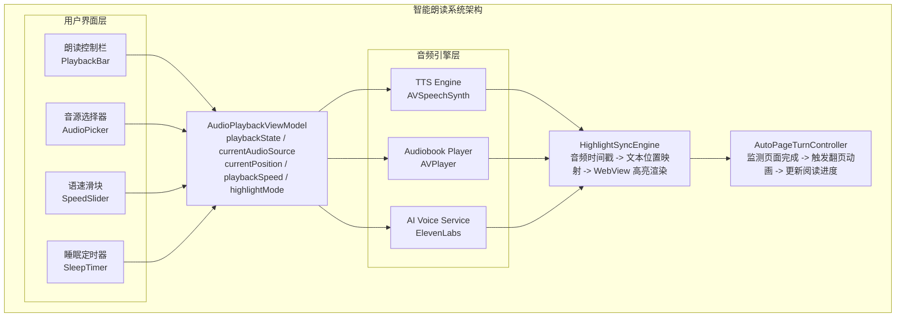

# 智能朗读系统设计文档

> 目标：打造无缝衔接的听读体验，支持TTS、人声有声书、AI语音，实现精准高亮同步与自动翻页

---

## 1. 系统概述

### 1.1 功能定位

智能朗读系统是阅读器的核心增值功能，让用户可以「边听边看」或「解放双眼纯听书」。系统支持多种音源、精准的文本高亮跟随、以及智能的自动翻页机制。

### 1.2 核心能力矩阵

| 能力 | 描述 | 优先级 |
|-----|------|-------|
| **多音源支持** | TTS系统语音 / LibriVox人声 / AI克隆语音 | P0 |
| **高亮同步** | 朗读时实时高亮当前文本 (单词/句子/段落) | P0 |
| **自动翻页** | 当前页朗读完毕自动翻至下一页 | P0 |
| **播放控制** | 播放/暂停/快进/快退/跳句/跳章 | P0 |
| **语速调节** | 0.5x - 3.5x 可调 | P0 |
| **后台播放** | 锁屏/切换App继续播放 | P0 |
| **睡眠定时** | 定时停止播放 | P1 |
| **听读同步** | Whispersync - 阅读与收听进度同步 | P1 |

### 1.3 系统架构总览



---

## 2. 音源管理

### 2.1 音源类型对比

| 特性 | TTS系统语音 | LibriVox人声 | AI克隆语音 |
|-----|------------|-------------|-----------|
| **音质表现** | 机械感明显 | 专业自然 | 高度自然 |
| **情感表达** | 无 | 丰富 | 可定制 |
| **离线支持** | ✅ 完全支持 | ✅ 需预下载 | ❌ 需联网 |
| **资源消耗** | 低 (CPU) | 中 (存储) | 高 (网络) |
| **延迟** | 即时 | 无 (预加载) | 1-3秒 |
| **覆盖率** | 100% 书籍 | ~30% 经典 | 100% 书籍 |
| **成本** | 免费 | 免费 | 付费 |
| **定制性** | 多种语音可选 | 固定朗读者 | 完全可定制 |

### 2.2 音源选择流程

```
┌─────────────────────────────────────────────────────────────────────────────┐
│                          音源选择决策流程                                     │
├─────────────────────────────────────────────────────────────────────────────┤
│                                                                              │
│                         用户打开朗读功能                                      │
│                                │                                             │
│                                ▼                                             │
│                    ┌─────────────────────────┐                              │
│                    │  检查书籍是否有人声版本  │                              │
│                    └───────────┬─────────────┘                              │
│                                │                                             │
│              ┌─────────────────┴─────────────────┐                          │
│              ▼                                   ▼                          │
│       ┌──────────────┐                   ┌──────────────┐                   │
│       │   有人声版本  │                   │  无人声版本  │                   │
│       └──────┬───────┘                   └──────┬───────┘                   │
│              │                                   │                          │
│              ▼                                   ▼                          │
│   ┌────────────────────────┐          ┌────────────────────────┐           │
│   │ 显示推荐选项:           │          │ 显示可用选项:           │           │
│   │ • 人声朗读 (推荐) ⭐    │          │ • TTS系统语音 (推荐)   │           │
│   │ • TTS系统语音          │          │ • AI语音 (Premium)     │           │
│   │ • AI语音 (Premium)     │          │                        │           │
│   └───────────┬────────────┘          └───────────┬────────────┘           │
│               │                                   │                         │
│               └───────────────┬───────────────────┘                         │
│                               ▼                                             │
│                   ┌─────────────────────────┐                              │
│                   │   用户选择或使用默认    │                              │
│                   └───────────┬─────────────┘                              │
│                               │                                             │
│                               ▼                                             │
│                   ┌─────────────────────────┐                              │
│                   │   初始化对应音频引擎    │                              │
│                   └─────────────────────────┘                              │
│                                                                              │
└─────────────────────────────────────────────────────────────────────────────┘
```

### 2.3 音源数据模型

```
┌─────────────────────────────────────────────────────────────────────────────┐
│                          音源相关数据模型                                     │
├─────────────────────────────────────────────────────────────────────────────┤
│                                                                              │
│  AudioSource 音源配置:                                                       │
│  ┌─────────────────────────────────────────────────────────────────────┐   │
│  │  sourceType       : TTS | LIBRIVOX | AI_VOICE                       │   │
│  │  ──────────────────────────────────────────────────────────────────  │   │
│  │  TTS配置:                                                            │   │
│  │  • voiceIdentifier : String (系统语音ID)                             │   │
│  │  • language        : String (语言代码)                               │   │
│  │  • pitch           : Float (音调 0.5-2.0)                           │   │
│  │  ──────────────────────────────────────────────────────────────────  │   │
│  │  LibriVox配置:                                                       │   │
│  │  • audiobookId     : UUID                                            │   │
│  │  • narratorName    : String                                          │   │
│  │  • audioQuality    : LOW | STANDARD | HIGH                          │   │
│  │  ──────────────────────────────────────────────────────────────────  │   │
│  │  AI语音配置:                                                         │   │
│  │  • voiceId         : String (ElevenLabs Voice ID)                   │   │
│  │  • stability       : Float (稳定性)                                  │   │
│  │  • similarityBoost : Float (相似度增强)                              │   │
│  └─────────────────────────────────────────────────────────────────────┘   │
│                                                                              │
│  VoiceOption 可选语音:                                                       │
│  ┌─────────────────────────────────────────────────────────────────────┐   │
│  │  id                : String                                          │   │
│  │  name              : String (显示名称)                               │   │
│  │  language          : String                                          │   │
│  │  gender            : MALE | FEMALE | NEUTRAL                        │   │
│  │  accent            : String? (口音: 美式/英式/澳式)                  │   │
│  │  previewUrl        : String? (试听音频URL)                           │   │
│  │  isPremium         : Boolean                                         │   │
│  └─────────────────────────────────────────────────────────────────────┘   │
│                                                                              │
└─────────────────────────────────────────────────────────────────────────────┘
```

---

## 3. TTS引擎

### 3.1 TTS引擎架构

```
┌─────────────────────────────────────────────────────────────────────────────┐
│                           TTS引擎架构                                         │
├─────────────────────────────────────────────────────────────────────────────┤
│                                                                              │
│  ┌───────────────────────────────────────────────────────────────────────┐ │
│  │                         TTSEngine                                       │ │
│  │                                                                         │ │
│  │  输入层:                                                                │ │
│  │  ┌─────────────────────────────────────────────────────────────────┐  │ │
│  │  │  ChapterContent (HTML) ──► 文本提取 ──► 句子分割 ──► 朗读队列   │  │ │
│  │  └─────────────────────────────────────────────────────────────────┘  │ │
│  │                                   │                                     │ │
│  │                                   ▼                                     │ │
│  │  合成层:                                                                │ │
│  │  ┌─────────────────────────────────────────────────────────────────┐  │ │
│  │  │                    AVSpeechSynthesizer                           │  │ │
│  │  │  ┌─────────────┐  ┌─────────────┐  ┌─────────────┐              │  │ │
│  │  │  │ Utterance 1 │─►│ Utterance 2 │─►│ Utterance 3 │─► ...       │  │ │
│  │  │  │ 句子1       │  │ 句子2       │  │ 句子3       │              │  │ │
│  │  │  └─────────────┘  └─────────────┘  └─────────────┘              │  │ │
│  │  └─────────────────────────────────────────────────────────────────┘  │ │
│  │                                   │                                     │ │
│  │                                   ▼                                     │ │
│  │  回调层:                                                                │ │
│  │  ┌─────────────────────────────────────────────────────────────────┐  │ │
│  │  │  AVSpeechSynthesizerDelegate                                     │  │ │
│  │  │  • didStart(utterance)     ──► 句子开始高亮                      │  │ │
│  │  │  • willSpeakRange(range)   ──► 单词级高亮更新                    │  │ │
│  │  │  • didFinish(utterance)    ──► 句子结束，检查翻页                │  │ │
│  │  │  • didPause/didContinue    ──► 状态更新                          │  │ │
│  │  └─────────────────────────────────────────────────────────────────┘  │ │
│  │                                                                         │ │
│  └───────────────────────────────────────────────────────────────────────┘ │
│                                                                              │
└─────────────────────────────────────────────────────────────────────────────┘
```

### 3.2 文本预处理流程

```
┌─────────────────────────────────────────────────────────────────────────────┐
│                          TTS文本预处理流程                                    │
├─────────────────────────────────────────────────────────────────────────────┤
│                                                                              │
│  Step 1: HTML内容提取                                                        │
│  ┌─────────────────────────────────────────────────────────────────────┐   │
│  │  输入: <p>It is a <em>truth</em> universally acknowledged...</p>    │   │
│  │  输出: It is a truth universally acknowledged...                    │   │
│  │  处理: 移除HTML标签，保留纯文本                                       │   │
│  └─────────────────────────────────────────────────────────────────────┘   │
│                                      │                                       │
│                                      ▼                                       │
│  Step 2: 句子分割                                                            │
│  ┌─────────────────────────────────────────────────────────────────────┐   │
│  │  规则:                                                               │   │
│  │  • 基于句号/问号/叹号分割                                            │   │
│  │  • 处理缩写 (Mr. Mrs. Dr.) 不分割                                   │   │
│  │  • 处理引号内的标点                                                  │   │
│  │  • 处理省略号                                                        │   │
│  │                                                                      │   │
│  │  输出:                                                               │   │
│  │  [                                                                   │   │
│  │    {index: 0, text: "It is a truth universally...", offset: 0},    │   │
│  │    {index: 1, text: "However little known...", offset: 85},        │   │
│  │    ...                                                               │   │
│  │  ]                                                                   │   │
│  └─────────────────────────────────────────────────────────────────────┘   │
│                                      │                                       │
│                                      ▼                                       │
│  Step 3: 特殊内容处理                                                        │
│  ┌─────────────────────────────────────────────────────────────────────┐   │
│  │  • 数字朗读: "1984" → "nineteen eighty-four"                        │   │
│  │  • 缩写展开: "Mr." → "Mister", "Dr." → "Doctor"                     │   │
│  │  • 货币朗读: "$100" → "one hundred dollars"                         │   │
│  │  • 日期朗读: "Jan 1, 2024" → "January first, twenty twenty-four"   │   │
│  │  • 时间朗读: "3:30 PM" → "three thirty PM"                          │   │
│  │  • 跳过注释: [1] [注] 等脚注标记                                     │   │
│  └─────────────────────────────────────────────────────────────────────┘   │
│                                      │                                       │
│                                      ▼                                       │
│  Step 4: 生成朗读队列                                                        │
│  ┌─────────────────────────────────────────────────────────────────────┐   │
│  │  SpeechQueue:                                                        │   │
│  │  ┌────────────────────────────────────────────────────────────────┐ │   │
│  │  │  utterances: [AVSpeechUtterance]                               │ │   │
│  │  │  currentIndex: Int                                             │ │   │
│  │  │  textMappings: [(utteranceIndex, textOffset, textLength)]      │ │   │
│  │  └────────────────────────────────────────────────────────────────┘ │   │
│  └─────────────────────────────────────────────────────────────────────┘   │
│                                                                              │
└─────────────────────────────────────────────────────────────────────────────┘
```

### 3.3 TTS语音选项

```
┌─────────────────────────────────────────────────────────────────────────────┐
│                          iOS TTS可用语音                                      │
├─────────────────────────────────────────────────────────────────────────────┤
│                                                                              │
│  英语语音 (推荐):                                                            │
│  ┌─────────────────────────────────────────────────────────────────────┐   │
│  │  语音名称          │ 性别 │ 口音   │ 质量   │ 说明                   │   │
│  │  ─────────────────────────────────────────────────────────────────  │   │
│  │  Samantha          │ 女   │ 美式   │ 增强   │ 最自然，推荐默认       │   │
│  │  Alex              │ 男   │ 美式   │ 增强   │ 沉稳男声               │   │
│  │  Daniel            │ 男   │ 英式   │ 增强   │ 英国绅士风格           │   │
│  │  Karen             │ 女   │ 澳式   │ 增强   │ 澳洲口音               │   │
│  │  Moira             │ 女   │ 爱尔兰 │ 增强   │ 爱尔兰口音             │   │
│  │  Siri (Female)     │ 女   │ 美式   │ 神经网络│ 最高质量(iOS 15+)     │   │
│  │  Siri (Male)       │ 男   │ 美式   │ 神经网络│ 最高质量(iOS 15+)     │   │
│  └─────────────────────────────────────────────────────────────────────┘   │
│                                                                              │
│  语音选择界面:                                                               │
│  ┌─────────────────────────────────────────────────────────────────────┐   │
│  │  🎙️ 选择语音                                                        │   │
│  │  ──────────────────────────────────────────────────────────────────  │   │
│  │                                                                      │   │
│  │  推荐语音                                                            │   │
│  │  ┌────────────────────────────────────────────────────────────────┐ │   │
│  │  │  ◉ Samantha (美式女声)                           [▶️ 试听]    │ │   │
│  │  │    自然流畅，适合大多数内容                                     │ │   │
│  │  └────────────────────────────────────────────────────────────────┘ │   │
│  │                                                                      │   │
│  │  更多语音                                                            │   │
│  │  ┌────────────────────────────────────────────────────────────────┐ │   │
│  │  │  ○ Alex (美式男声)                               [▶️ 试听]    │ │   │
│  │  │  ○ Daniel (英式男声)                             [▶️ 试听]    │ │   │
│  │  │  ○ Karen (澳式女声)                              [▶️ 试听]    │ │   │
│  │  │  ○ Siri 女声 ⭐ Premium                          [▶️ 试听]    │ │   │
│  │  │  ○ Siri 男声 ⭐ Premium                          [▶️ 试听]    │ │   │
│  │  └────────────────────────────────────────────────────────────────┘ │   │
│  │                                                                      │   │
│  └─────────────────────────────────────────────────────────────────────┘   │
│                                                                              │
└─────────────────────────────────────────────────────────────────────────────┘
```

---

## 4. 人声有声书播放

### 4.1 LibriVox集成架构

```
┌─────────────────────────────────────────────────────────────────────────────┐
│                       LibriVox有声书播放架构                                  │
├─────────────────────────────────────────────────────────────────────────────┤
│                                                                              │
│  ┌───────────────────────────────────────────────────────────────────────┐ │
│  │                      AudiobookPlayer                                    │ │
│  │                                                                         │ │
│  │  ┌─────────────────────────────────────────────────────────────────┐  │ │
│  │  │                        AVPlayer                                  │  │ │
│  │  │  • 流媒体播放 (Internet Archive URL)                            │  │ │
│  │  │  • 本地缓存播放                                                  │  │ │
│  │  │  • 后台播放支持                                                  │  │ │
│  │  └─────────────────────────────────────────────────────────────────┘  │ │
│  │                                   │                                     │ │
│  │  ┌─────────────────────────────────────────────────────────────────┐  │ │
│  │  │                     时间观察器                                    │  │ │
│  │  │  addPeriodicTimeObserver(interval: 0.1s)                        │  │ │
│  │  │  ──► 更新当前时间 ──► 查询时间戳映射 ──► 更新高亮位置            │  │ │
│  │  └─────────────────────────────────────────────────────────────────┘  │ │
│  │                                   │                                     │ │
│  │  ┌─────────────────────────────────────────────────────────────────┐  │ │
│  │  │                     边界观察器                                    │  │ │
│  │  │  addBoundaryTimeObserver(times: [章节结束时间])                  │  │ │
│  │  │  ──► 章节结束通知 ──► 触发翻页或下一章                          │  │ │
│  │  └─────────────────────────────────────────────────────────────────┘  │ │
│  │                                                                         │ │
│  └───────────────────────────────────────────────────────────────────────┘ │
│                                      │                                       │
│                                      ▼                                       │
│  ┌───────────────────────────────────────────────────────────────────────┐ │
│  │                      ChapterAudioCache                                  │ │
│  │  ┌─────────────────────────────────────────────────────────────────┐  │ │
│  │  │  缓存策略:                                                        │  │ │
│  │  │  • 当前章节: 完整缓存                                            │  │ │
│  │  │  • 下一章节: 后台预加载                                          │  │ │
│  │  │  • 前一章节: 保留缓存                                            │  │ │
│  │  │  • 其他章节: 按需加载                                            │  │ │
│  │  │  • 缓存上限: 500MB (可配置)                                      │  │ │
│  │  └─────────────────────────────────────────────────────────────────┘  │ │
│  └───────────────────────────────────────────────────────────────────────┘ │
│                                                                              │
└─────────────────────────────────────────────────────────────────────────────┘
```

### 4.2 章节音频加载流程

```
┌─────────────────────────────────────────────────────────────────────────────┐
│                        章节音频加载流程                                       │
├─────────────────────────────────────────────────────────────────────────────┤
│                                                                              │
│                           用户选择播放章节N                                   │
│                                   │                                          │
│                                   ▼                                          │
│                    ┌─────────────────────────────┐                          │
│                    │   检查本地缓存是否存在      │                          │
│                    └───────────────┬─────────────┘                          │
│                                    │                                         │
│              ┌─────────────────────┴─────────────────────┐                  │
│              ▼                                           ▼                  │
│       ┌──────────────┐                           ┌──────────────┐          │
│       │   缓存命中   │                           │   缓存未命中  │          │
│       └──────┬───────┘                           └──────┬───────┘          │
│              │                                          │                   │
│              ▼                                          ▼                   │
│   ┌────────────────────┐                   ┌────────────────────┐          │
│   │ 从本地加载音频文件  │                   │ 开始流媒体播放      │          │
│   │ file:///cache/...  │                   │ https://archive.org│          │
│   └─────────┬──────────┘                   └─────────┬──────────┘          │
│             │                                        │                      │
│             │                                        ▼                      │
│             │                            ┌────────────────────┐            │
│             │                            │ 后台下载完整音频    │            │
│             │                            │ 写入本地缓存        │            │
│             │                            └────────────────────┘            │
│             │                                        │                      │
│             └────────────────────┬───────────────────┘                      │
│                                  ▼                                          │
│                    ┌─────────────────────────────┐                          │
│                    │      开始播放章节N          │                          │
│                    └───────────────┬─────────────┘                          │
│                                    │                                         │
│                                    ▼                                         │
│                    ┌─────────────────────────────┐                          │
│                    │   后台预加载章节N+1         │                          │
│                    └─────────────────────────────┘                          │
│                                                                              │
└─────────────────────────────────────────────────────────────────────────────┘
```

### 4.3 音频-文本时间戳映射

```
┌─────────────────────────────────────────────────────────────────────────────┐
│                        时间戳映射数据结构                                     │
├─────────────────────────────────────────────────────────────────────────────┤
│                                                                              │
│  AudioTextTimestamp 时间戳条目:                                              │
│  ┌─────────────────────────────────────────────────────────────────────┐   │
│  │  audioTime       : Double (音频时间，秒)                             │   │
│  │  textOffset      : Int (文本字符偏移)                                │   │
│  │  textLength      : Int (文本长度)                                    │   │
│  │  word            : String? (对应单词，用于验证)                       │   │
│  │  confidence      : Float (置信度 0-1)                                │   │
│  └─────────────────────────────────────────────────────────────────────┘   │
│                                                                              │
│  ChapterTimestamps 章节时间戳:                                               │
│  ┌─────────────────────────────────────────────────────────────────────┐   │
│  │  chapterId       : UUID                                              │   │
│  │  duration        : Double (章节总时长)                               │   │
│  │  timestamps      : [AudioTextTimestamp] (按时间排序)                  │   │
│  │  sentenceBreaks  : [Double] (句子边界时间点)                         │   │
│  │  paragraphBreaks : [Double] (段落边界时间点)                         │   │
│  │  pageBreaks      : [(time: Double, pageIndex: Int)] (页面边界)       │   │
│  └─────────────────────────────────────────────────────────────────────┘   │
│                                                                              │
│  时间戳查询示例:                                                             │
│  ┌─────────────────────────────────────────────────────────────────────┐   │
│  │  当前播放时间: 45.3秒                                                 │   │
│  │  ────────────────────────────────────────────────────────────────── │   │
│  │  二分查找: timestamps.binarySearch(45.3)                             │   │
│  │  ────────────────────────────────────────────────────────────────── │   │
│  │  结果:                                                               │   │
│  │  {                                                                   │   │
│  │    audioTime: 45.2,                                                  │   │
│  │    textOffset: 1234,                                                 │   │
│  │    textLength: 12,                                                   │   │
│  │    word: "acknowledged"                                              │   │
│  │  }                                                                   │   │
│  │  ────────────────────────────────────────────────────────────────── │   │
│  │  高亮范围: 字符位置 1234 到 1246                                     │   │
│  └─────────────────────────────────────────────────────────────────────┘   │
│                                                                              │
└─────────────────────────────────────────────────────────────────────────────┘
```

---

## 5. 高亮同步引擎

### 5.1 高亮层级系统

```
┌─────────────────────────────────────────────────────────────────────────────┐
│                          高亮层级系统                                         │
├─────────────────────────────────────────────────────────────────────────────┤
│                                                                              │
│  ┌───────────────────────────────────────────────────────────────────────┐ │
│  │  Level 1: 单词级高亮 (Word-level)                                      │ │
│  │  ─────────────────────────────────────────────────────────────────── │ │
│  │  适用: TTS朗读 (willSpeakRange回调精确到单词)                         │ │
│  │  效果:                                                                 │ │
│  │  ┌─────────────────────────────────────────────────────────────────┐ │ │
│  │  │ It is a truth [universally] acknowledged, that a single man... │ │ │
│  │  │               ▓▓▓▓▓▓▓▓▓▓▓▓                                      │ │ │
│  │  │              当前朗读单词背景高亮                                 │ │ │
│  │  └─────────────────────────────────────────────────────────────────┘ │ │
│  │  CSS: .word-highlight { background: rgba(255, 230, 0, 0.6); }        │ │
│  └───────────────────────────────────────────────────────────────────────┘ │
│                                                                              │
│  ┌───────────────────────────────────────────────────────────────────────┐ │
│  │  Level 2: 句子级高亮 (Sentence-level)                                  │ │
│  │  ─────────────────────────────────────────────────────────────────── │ │
│  │  适用: 人声有声书 (时间戳精度通常到句子)                               │ │
│  │  效果:                                                                 │ │
│  │  ┌─────────────────────────────────────────────────────────────────┐ │ │
│  │  │ ▓▓▓▓▓▓▓▓▓▓▓▓▓▓▓▓▓▓▓▓▓▓▓▓▓▓▓▓▓▓▓▓▓▓▓▓▓▓▓▓▓▓▓▓▓▓▓▓▓▓▓▓▓▓▓▓▓▓▓▓▓▓ │ │ │
│  │  │ It is a truth universally acknowledged, that a single man in  │ │ │
│  │  │ possession of a good fortune, must be in want of a wife.       │ │ │
│  │  │ ▓▓▓▓▓▓▓▓▓▓▓▓▓▓▓▓▓▓▓▓▓▓▓▓▓▓▓▓▓▓▓▓▓▓▓▓▓▓▓▓▓▓▓▓▓▓▓▓▓▓▓▓▓▓▓▓▓▓▓▓▓▓ │ │ │
│  │  └─────────────────────────────────────────────────────────────────┘ │ │
│  │  CSS: .sentence-highlight { background: rgba(255, 230, 0, 0.3); }    │ │
│  └───────────────────────────────────────────────────────────────────────┘ │
│                                                                              │
│  ┌───────────────────────────────────────────────────────────────────────┐ │
│  │  Level 3: 段落级高亮 (Paragraph-level)                                 │ │
│  │  ─────────────────────────────────────────────────────────────────── │ │
│  │  适用: 低精度同步场景 / 用户偏好设置                                   │ │
│  │  效果:                                                                 │ │
│  │  ┌─────────────────────────────────────────────────────────────────┐ │ │
│  │  │ ┌───────────────────────────────────────────────────────────┐  │ │ │
│  │  │ │ It is a truth universally acknowledged, that a single    │  │ │ │
│  │  │ │ man in possession of a good fortune, must be in want of  │  │ │ │
│  │  │ │ a wife.                                                   │  │ │ │
│  │  │ │                                                           │  │ │ │
│  │  │ │ However little known the feelings or views of such a man │  │ │ │
│  │  │ │ may be on his first entering a neighbourhood...          │  │ │ │
│  │  │ └───────────────────────────────────────────────────────────┘  │ │ │
│  │  │   左侧边框 + 淡背景                                             │ │ │
│  │  └─────────────────────────────────────────────────────────────────┘ │ │
│  │  CSS: .paragraph-highlight { border-left: 3px solid #FFE066;         │ │
│  │        background: rgba(255, 230, 0, 0.1); }                          │ │
│  └───────────────────────────────────────────────────────────────────────┘ │
│                                                                              │
└─────────────────────────────────────────────────────────────────────────────┘
```

### 5.2 高亮同步流程

```
┌─────────────────────────────────────────────────────────────────────────────┐
│                          高亮同步流程                                         │
├─────────────────────────────────────────────────────────────────────────────┤
│                                                                              │
│  TTS模式:                                                                    │
│  ┌───────────────────────────────────────────────────────────────────────┐ │
│  │                                                                         │ │
│  │  AVSpeechSynthesizerDelegate                                           │ │
│  │         │                                                               │ │
│  │         ▼                                                               │ │
│  │  willSpeakRangeOfSpeechString(range, utterance)                        │ │
│  │         │                                                               │ │
│  │         ├─► 计算当前单词在原文中的位置                                   │ │
│  │         │   utteranceIndex + range.location → absoluteOffset           │ │
│  │         │                                                               │ │
│  │         ├─► 发送高亮指令到WebView                                       │ │
│  │         │   postMessage("highlight", {offset, length})                 │ │
│  │         │                                                               │ │
│  │         └─► 更新ViewModel状态                                           │ │
│  │             currentHighlight = (offset, length)                        │ │
│  │                                                                         │ │
│  └───────────────────────────────────────────────────────────────────────┘ │
│                                                                              │
│  有声书模式:                                                                  │
│  ┌───────────────────────────────────────────────────────────────────────┐ │
│  │                                                                         │ │
│  │  AVPlayer.addPeriodicTimeObserver(interval: 0.1s)                      │ │
│  │         │                                                               │ │
│  │         ▼                                                               │ │
│  │  timeObserverCallback(currentTime: CMTime)                             │ │
│  │         │                                                               │ │
│  │         ├─► 二分查找时间戳映射表                                         │ │
│  │         │   timestamps.binarySearch(currentTime.seconds)               │ │
│  │         │                                                               │ │
│  │         ├─► 获取当前文本位置                                            │ │
│  │         │   {textOffset, textLength, sentenceIndex}                    │ │
│  │         │                                                               │ │
│  │         ├─► 检查是否需要更新高亮                                         │ │
│  │         │   if newPosition != lastPosition                             │ │
│  │         │                                                               │ │
│  │         ├─► 发送高亮指令到WebView                                       │ │
│  │         │   postMessage("highlight", {offset, length, level})          │ │
│  │         │                                                               │ │
│  │         └─► 检查是否需要翻页                                            │ │
│  │             if currentOffset > pageEndOffset → triggerPageTurn()       │ │
│  │                                                                         │ │
│  └───────────────────────────────────────────────────────────────────────┘ │
│                                                                              │
└─────────────────────────────────────────────────────────────────────────────┘
```

### 5.3 WebView高亮实现

```
┌─────────────────────────────────────────────────────────────────────────────┐
│                       WebView高亮JavaScript实现                               │
├─────────────────────────────────────────────────────────────────────────────┤
│                                                                              │
│  高亮管理器结构:                                                             │
│  ┌───────────────────────────────────────────────────────────────────────┐ │
│  │  HighlightManager:                                                      │ │
│  │  ├── currentHighlightRange: {start: number, end: number}               │ │
│  │  ├── highlightElement: HTMLElement (高亮容器)                           │ │
│  │  ├── mode: 'word' | 'sentence' | 'paragraph'                           │ │
│  │  │                                                                      │ │
│  │  ├── updateHighlight(offset, length, mode)                             │ │
│  │  │   ├── 清除旧高亮                                                    │ │
│  │  │   ├── 根据offset定位DOM节点                                         │ │
│  │  │   ├── 创建Range对象                                                  │ │
│  │  │   ├── 应用高亮样式                                                  │ │
│  │  │   └── 滚动到可见区域                                                │ │
│  │  │                                                                      │ │
│  │  ├── clearHighlight()                                                  │ │
│  │  │   └── 移除所有高亮样式                                              │ │
│  │  │                                                                      │ │
│  │  └── scrollToHighlight(smooth: boolean)                                │ │
│  │       └── 平滑滚动使高亮文本居中显示                                    │ │
│  └───────────────────────────────────────────────────────────────────────┘ │
│                                                                              │
│  字符偏移到DOM位置转换:                                                       │
│  ┌───────────────────────────────────────────────────────────────────────┐ │
│  │  offsetToNodePosition(targetOffset):                                    │ │
│  │  ┌───────────────────────────────────────────────────────────────────┐│ │
│  │  │  遍历 document.body 的所有文本节点                                  ││ │
│  │  │       │                                                             ││ │
│  │  │       ▼                                                             ││ │
│  │  │  累加字符计数                                                       ││ │
│  │  │  currentOffset += textNode.length                                  ││ │
│  │  │       │                                                             ││ │
│  │  │       ▼                                                             ││ │
│  │  │  if currentOffset >= targetOffset                                  ││ │
│  │  │       │                                                             ││ │
│  │  │       ▼                                                             ││ │
│  │  │  返回 {node: textNode, offset: targetOffset - previousOffset}      ││ │
│  │  └───────────────────────────────────────────────────────────────────┘│ │
│  └───────────────────────────────────────────────────────────────────────┘ │
│                                                                              │
└─────────────────────────────────────────────────────────────────────────────┘
```

---

## 6. 自动翻页系统

### 6.1 翻页触发机制

```
┌─────────────────────────────────────────────────────────────────────────────┐
│                          自动翻页触发机制                                     │
├─────────────────────────────────────────────────────────────────────────────┤
│                                                                              │
│  触发条件判断:                                                               │
│  ┌───────────────────────────────────────────────────────────────────────┐ │
│  │                                                                         │ │
│  │  每次高亮位置更新时:                                                    │ │
│  │         │                                                               │ │
│  │         ▼                                                               │ │
│  │  ┌─────────────────────────────────────┐                               │ │
│  │  │  获取当前高亮位置在页面中的位置      │                               │ │
│  │  │  highlightRect = getHighlightRect() │                               │ │
│  │  └───────────────┬─────────────────────┘                               │ │
│  │                  │                                                      │ │
│  │                  ▼                                                      │ │
│  │  ┌─────────────────────────────────────┐                               │ │
│  │  │  判断是否超出当前页面可视区域        │                               │ │
│  │  │  isOutOfView = highlightRect.bottom │                               │ │
│  │  │                > viewportHeight     │                               │ │
│  │  └───────────────┬─────────────────────┘                               │ │
│  │                  │                                                      │ │
│  │         ┌────────┴────────┐                                            │ │
│  │         ▼                 ▼                                            │ │
│  │    ┌─────────┐       ┌─────────┐                                       │ │
│  │    │  在页内  │       │ 超出页面 │                                       │ │
│  │    │ 继续朗读│       │ 触发翻页 │                                       │ │
│  │    └─────────┘       └────┬────┘                                       │ │
│  │                           │                                             │ │
│  │                           ▼                                             │ │
│  │                  ┌────────────────────┐                                │ │
│  │                  │  检查是否章节末尾  │                                │ │
│  │                  └─────────┬──────────┘                                │ │
│  │                            │                                            │ │
│  │              ┌─────────────┴─────────────┐                             │ │
│  │              ▼                           ▼                             │ │
│  │       ┌────────────┐             ┌────────────┐                        │ │
│  │       │  翻下一页   │             │  章节结束   │                        │ │
│  │       │ nextPage() │             │checkNextChap│                        │ │
│  │       └────────────┘             └────────────┘                        │ │
│  │                                                                         │ │
│  └───────────────────────────────────────────────────────────────────────┘ │
│                                                                              │
└─────────────────────────────────────────────────────────────────────────────┘
```

### 6.2 翻页动画类型

```
┌─────────────────────────────────────────────────────────────────────────────┐
│                          翻页动画类型                                         │
├─────────────────────────────────────────────────────────────────────────────┤
│                                                                              │
│  ┌───────────────────────────────────────────────────────────────────────┐ │
│  │  动画类型 1: 无动画 (None)                                              │ │
│  │  ─────────────────────────────────────────────────────────────────── │ │
│  │  描述: 直接切换页面内容，无过渡效果                                     │ │
│  │  适用: 追求最快响应，无视觉干扰                                        │ │
│  │  实现: 直接替换WebView内容                                             │ │
│  └───────────────────────────────────────────────────────────────────────┘ │
│                                                                              │
│  ┌───────────────────────────────────────────────────────────────────────┐ │
│  │  动画类型 2: 滑动 (Slide)                                               │ │
│  │  ─────────────────────────────────────────────────────────────────── │ │
│  │  描述: 当前页左滑出，新页右滑入                                        │ │
│  │  适用: 简洁流畅，现代感                                                │ │
│  │                                                                         │ │
│  │  ┌─────────┐          ┌─────────┐                                      │ │
│  │  │  当前页  │ ◄─────── │  新页面  │                                      │ │
│  │  │   ◄──   │          │   ──►   │                                      │ │
│  │  └─────────┘          └─────────┘                                      │ │
│  │                                                                         │ │
│  │  实现: UIPageViewController.transitionStyle = .scroll                  │ │
│  └───────────────────────────────────────────────────────────────────────┘ │
│                                                                              │
│  ┌───────────────────────────────────────────────────────────────────────┐ │
│  │  动画类型 3: 仿真翻页 (Curl)                                            │ │
│  │  ─────────────────────────────────────────────────────────────────── │ │
│  │  描述: 模拟真实书页翻动效果                                            │ │
│  │  适用: 沉浸式阅读体验，有书籍质感                                       │ │
│  │                                                                         │ │
│  │  ┌─────────┐                                                           │ │
│  │  │  当前页  │╲                                                          │ │
│  │  │        │ ╲ 卷曲效果                                                 │ │
│  │  │        │  ╲                                                         │ │
│  │  │        │   ╲                                                        │ │
│  │  └─────────┘    ╲                                                      │ │
│  │                                                                         │ │
│  │  实现: UIPageViewController.transitionStyle = .pageCurl                │ │
│  └───────────────────────────────────────────────────────────────────────┘ │
│                                                                              │
│  ┌───────────────────────────────────────────────────────────────────────┐ │
│  │  动画类型 4: 淡入淡出 (Fade)                                            │ │
│  │  ─────────────────────────────────────────────────────────────────── │ │
│  │  描述: 当前页淡出，新页淡入                                            │ │
│  │  适用: 柔和过渡，减少视觉跳跃                                          │ │
│  │                                                                         │ │
│  │  ┌─────────┐       ┌─────────┐                                         │ │
│  │  │ opacity │  ──►  │ opacity │                                         │ │
│  │  │  1 → 0  │       │  0 → 1  │                                         │ │
│  │  └─────────┘       └─────────┘                                         │ │
│  │                                                                         │ │
│  │  实现: CATransition.type = .fade                                       │ │
│  └───────────────────────────────────────────────────────────────────────┘ │
│                                                                              │
└─────────────────────────────────────────────────────────────────────────────┘
```

### 6.3 翻页状态机

```
┌─────────────────────────────────────────────────────────────────────────────┐
│                          自动翻页状态机                                       │
├─────────────────────────────────────────────────────────────────────────────┤
│                                                                              │
│                           ┌────────────────┐                                │
│                           │   正常朗读中    │                                │
│                           │  READING       │                                │
│                           └───────┬────────┘                                │
│                                   │                                         │
│                      检测到当前页内容朗读完毕                                  │
│                                   │                                         │
│                                   ▼                                         │
│                    ┌─────────────────────────────┐                          │
│                    │   准备翻页                   │                          │
│                    │   PREPARING_PAGE_TURN       │                          │
│                    └───────────────┬─────────────┘                          │
│                                    │                                        │
│                         暂停朗读 (100ms缓冲)                                  │
│                                    │                                        │
│                                    ▼                                        │
│                    ┌─────────────────────────────┐                          │
│                    │   执行翻页动画               │                          │
│                    │   ANIMATING                 │                          │
│                    └───────────────┬─────────────┘                          │
│                                    │                                        │
│                      动画完成 (200-500ms)                                    │
│                                    │                                        │
│                                    ▼                                        │
│                    ┌─────────────────────────────┐                          │
│                    │   检查下一页状态             │                          │
│                    └───────────────┬─────────────┘                          │
│                                    │                                        │
│              ┌─────────────────────┼─────────────────────┐                  │
│              ▼                     ▼                     ▼                  │
│     ┌─────────────────┐  ┌─────────────────┐  ┌─────────────────┐          │
│     │   有下一页      │  │   章节结束      │  │   全书结束      │          │
│     │   继续朗读      │  │   检查设置      │  │   停止播放      │          │
│     └────────┬────────┘  └────────┬────────┘  └────────┬────────┘          │
│              │                    │                    │                    │
│              ▼                    ▼                    ▼                    │
│     ┌─────────────────┐  ┌─────────────────┐  ┌─────────────────┐          │
│     │   READING       │  │ 自动下一章?     │  │   COMPLETED     │          │
│     │   恢复朗读      │  │ YES → READING   │  │   播放结束      │          │
│     └─────────────────┘  │ NO → PAUSED     │  └─────────────────┘          │
│                          └─────────────────┘                                │
│                                                                              │
└─────────────────────────────────────────────────────────────────────────────┘
```

---

## 7. 播放控制

### 7.1 播放控制界面

```
┌─────────────────────────────────────────────────────────────────────────────┐
│                          播放控制界面设计                                     │
├─────────────────────────────────────────────────────────────────────────────┤
│                                                                              │
│  迷你播放条 (阅读时显示):                                                     │
│  ┌─────────────────────────────────────────────────────────────────────┐   │
│  │ ═══════════════════●══════════════════════════════════════════════  │   │
│  │ 🎧 Chapter 3  │  12:34 / 45:21  │  ⏮️  │  ▶️  │  ⏭️  │  🔼 展开  │   │
│  └─────────────────────────────────────────────────────────────────────┘   │
│                                                                              │
│  完整播放面板 (上滑展开):                                                     │
│  ┌─────────────────────────────────────────────────────────────────────┐   │
│  │  ▼ 收起                                                              │   │
│  │  ──────────────────────────────────────────────────────────────────  │   │
│  │                                                                      │   │
│  │                    ┌──────────────────────┐                         │   │
│  │                    │                      │                         │   │
│  │                    │     📖 封面图        │                         │   │
│  │                    │                      │                         │   │
│  │                    └──────────────────────┘                         │   │
│  │                                                                      │   │
│  │                    Pride and Prejudice                              │   │
│  │                      by Jane Austen                                 │   │
│  │                   🎙️ 朗读: Karen Savage                             │   │
│  │                                                                      │   │
│  │                    Chapter 3: Mr. Bingley                           │   │
│  │                                                                      │   │
│  │  ══════════════════════●════════════════════════════════════════    │   │
│  │  12:34                                                    45:21     │   │
│  │                                                                      │   │
│  │  ┌─────────────────────────────────────────────────────────────┐   │   │
│  │  │                                                             │   │   │
│  │  │      ⏮️          ◀️15s        ▶️        ▶️15s         ⏭️      │   │   │
│  │  │     上一章      快退15秒    播放/暂停   快进15秒     下一章  │   │   │
│  │  │                                                             │   │   │
│  │  └─────────────────────────────────────────────────────────────┘   │   │
│  │                                                                      │   │
│  │  ┌─────────────────────────────────────────────────────────────┐   │   │
│  │  │  🐢 ──────────●───────────────────────────────────────── 🐇  │   │   │
│  │  │           0.5x    1.0x    1.5x    2.0x    2.5x    3.0x      │   │   │
│  │  └─────────────────────────────────────────────────────────────┘   │   │
│  │                                                                      │   │
│  │  ┌──────┐  ┌──────┐  ┌──────┐  ┌──────┐  ┌──────┐  ┌──────┐       │   │
│  │  │ 🎙️   │  │ 😴   │  │ 📑   │  │ 🔤   │  │ ⚙️   │  │ 📖   │       │   │
│  │  │音源  │  │睡眠  │  │章节  │  │高亮  │  │设置  │  │同步  │       │   │
│  │  └──────┘  └──────┘  └──────┘  └──────┘  └──────┘  └──────┘       │   │
│  │                                                                      │   │
│  └─────────────────────────────────────────────────────────────────────┘   │
│                                                                              │
└─────────────────────────────────────────────────────────────────────────────┘
```

### 7.2 播放控制操作表

| 操作 | 触发方式 | 效果 | 快捷手势 |
|-----|---------|-----|---------|
| **播放/暂停** | 点击中央按钮 | 切换播放状态 | 双击屏幕中央 |
| **快退15秒** | 点击按钮 | 回退15秒 | 双击屏幕左侧 |
| **快进15秒** | 点击按钮 | 前进15秒 | 双击屏幕右侧 |
| **上一句** | 点击⏮️ | 跳转到上一句开头 | 左滑迷你条 |
| **下一句** | 点击⏭️ | 跳转到下一句开头 | 右滑迷你条 |
| **上一章** | 长按⏮️ | 跳转到上一章 | - |
| **下一章** | 长按⏭️ | 跳转到下一章 | - |
| **调整语速** | 拖动滑块 | 0.5x-3.5x可调 | - |
| **进度跳转** | 拖动进度条 | 跳转到指定位置 | - |
| **展开面板** | 点击迷你条 | 显示完整控制面板 | 上滑迷你条 |

### 7.3 后台播放

```
┌─────────────────────────────────────────────────────────────────────────────┐
│                          后台播放实现                                         │
├─────────────────────────────────────────────────────────────────────────────┤
│                                                                              │
│  音频会话配置:                                                               │
│  ┌───────────────────────────────────────────────────────────────────────┐ │
│  │  AVAudioSession.sharedInstance()                                        │ │
│  │  ├── category: .playback                                               │ │
│  │  ├── mode: .spokenAudio                                                │ │
│  │  └── options: [.allowBluetooth, .allowAirPlay]                         │ │
│  └───────────────────────────────────────────────────────────────────────┘ │
│                                                                              │
│  远程控制命令:                                                               │
│  ┌───────────────────────────────────────────────────────────────────────┐ │
│  │  MPRemoteCommandCenter.shared()                                         │ │
│  │  ├── playCommand         ──► resume()                                  │ │
│  │  ├── pauseCommand        ──► pause()                                   │ │
│  │  ├── togglePlayPauseCommand ──► toggle()                               │ │
│  │  ├── skipForwardCommand  ──► skip(+15s)                                │ │
│  │  ├── skipBackwardCommand ──► skip(-15s)                                │ │
│  │  ├── nextTrackCommand    ──► nextChapter()                             │ │
│  │  ├── previousTrackCommand ──► previousChapter()                        │ │
│  │  └── changePlaybackPositionCommand ──► seek(to: position)              │ │
│  └───────────────────────────────────────────────────────────────────────┘ │
│                                                                              │
│  锁屏信息显示:                                                               │
│  ┌───────────────────────────────────────────────────────────────────────┐ │
│  │  MPNowPlayingInfoCenter.default()                                       │ │
│  │  ├── MPMediaItemPropertyTitle      : "Chapter 3: Mr. Bingley"         │ │
│  │  ├── MPMediaItemPropertyArtist     : "Jane Austen"                    │ │
│  │  ├── MPMediaItemPropertyAlbumTitle : "Pride and Prejudice"            │ │
│  │  ├── MPMediaItemPropertyArtwork    : 封面图                            │ │
│  │  ├── MPMediaItemPropertyPlaybackDuration : 总时长                      │ │
│  │  ├── MPNowPlayingInfoPropertyElapsedPlaybackTime : 当前位置            │ │
│  │  └── MPNowPlayingInfoPropertyPlaybackRate : 播放速度                   │ │
│  └───────────────────────────────────────────────────────────────────────┘ │
│                                                                              │
│  锁屏界面效果:                                                               │
│  ┌───────────────────────────────────────────────────────────────────────┐ │
│  │  ┌──────────────────────────────────────────────────────────────────┐│ │
│  │  │                                                                   ││ │
│  │  │                    ┌──────────────────┐                          ││ │
│  │  │                    │                  │                          ││ │
│  │  │                    │   📖 封面图      │                          ││ │
│  │  │                    │                  │                          ││ │
│  │  │                    └──────────────────┘                          ││ │
│  │  │                                                                   ││ │
│  │  │                 Pride and Prejudice                              ││ │
│  │  │                   Jane Austen                                    ││ │
│  │  │              Chapter 3: Mr. Bingley                              ││ │
│  │  │                                                                   ││ │
│  │  │    ══════════════●═══════════════════════════════════            ││ │
│  │  │    12:34                                       45:21             ││ │
│  │  │                                                                   ││ │
│  │  │              ⏮️  │  ◀️15s  │  ▶️  │  ▶️15s  │  ⏭️                ││ │
│  │  │                                                                   ││ │
│  │  └──────────────────────────────────────────────────────────────────┘│ │
│  └───────────────────────────────────────────────────────────────────────┘ │
│                                                                              │
└─────────────────────────────────────────────────────────────────────────────┘
```

---

## 8. 睡眠定时

### 8.1 睡眠定时选项

```
┌─────────────────────────────────────────────────────────────────────────────┐
│                          睡眠定时设置                                         │
├─────────────────────────────────────────────────────────────────────────────┤
│                                                                              │
│  ┌─────────────────────────────────────────────────────────────────────┐   │
│  │  😴 睡眠定时                                                         │   │
│  │  ──────────────────────────────────────────────────────────────────  │   │
│  │                                                                      │   │
│  │  快捷选项:                                                           │   │
│  │  ┌────────┐ ┌────────┐ ┌────────┐ ┌────────┐ ┌────────┐            │   │
│  │  │  5分钟 │ │ 15分钟 │ │ 30分钟 │ │ 45分钟 │ │ 60分钟 │            │   │
│  │  │   ○    │ │   ●    │ │   ○    │ │   ○    │ │   ○    │            │   │
│  │  └────────┘ └────────┘ └────────┘ └────────┘ └────────┘            │   │
│  │                                                                      │   │
│  │  智能选项:                                                           │   │
│  │  ┌────────────────────────────────────────────────────────────────┐ │   │
│  │  │  ○ 本章结束后停止                                               │ │   │
│  │  │  ○ 本段落结束后停止                                             │ │   │
│  │  │  ○ 自定义时间...                                                │ │   │
│  │  └────────────────────────────────────────────────────────────────┘ │   │
│  │                                                                      │   │
│  │  结束行为:                                                           │   │
│  │  ├── ● 渐弱停止 (10秒内音量渐小)                                    │   │
│  │  ├── ○ 立即停止                                                     │   │
│  │  └── ○ 暂停并保持位置                                               │   │
│  │                                                                      │   │
│  │  ──────────────────────────────────────────────────────────────────  │   │
│  │                                                                      │   │
│  │  当前状态: 15分钟后停止 (剩余 12:34)                                 │   │
│  │                                                                      │   │
│  │              [取消定时]                    [确定]                    │   │
│  │                                                                      │   │
│  └─────────────────────────────────────────────────────────────────────┘   │
│                                                                              │
└─────────────────────────────────────────────────────────────────────────────┘
```

### 8.2 睡眠定时流程

```
┌─────────────────────────────────────────────────────────────────────────────┐
│                          睡眠定时执行流程                                     │
├─────────────────────────────────────────────────────────────────────────────┤
│                                                                              │
│                           用户设置睡眠定时                                    │
│                                   │                                          │
│                                   ▼                                          │
│                    ┌─────────────────────────────┐                          │
│                    │   启动倒计时Timer           │                          │
│                    │   更新UI显示剩余时间        │                          │
│                    └───────────────┬─────────────┘                          │
│                                    │                                         │
│                          每秒更新倒计时                                       │
│                                    │                                         │
│                                    ▼                                         │
│                    ┌─────────────────────────────┐                          │
│                    │   剩余时间 <= 10秒?         │                          │
│                    └───────────────┬─────────────┘                          │
│                                    │                                         │
│              ┌─────────────────────┴─────────────────────┐                  │
│              ▼                                           ▼                  │
│       ┌──────────────┐                           ┌──────────────┐          │
│       │     否       │                           │      是      │          │
│       │  继续倒计时  │                           │  开始渐弱    │          │
│       └──────────────┘                           └──────┬───────┘          │
│                                                          │                  │
│                                                          ▼                  │
│                                           ┌─────────────────────────┐       │
│                                           │  每秒降低音量 10%       │       │
│                                           │  1.0 → 0.9 → ... → 0.0 │       │
│                                           └───────────────┬─────────┘       │
│                                                           │                 │
│                                                           ▼                 │
│                                           ┌─────────────────────────┐       │
│                                           │  音量降至0             │       │
│                                           └───────────────┬─────────┘       │
│                                                           │                 │
│                                                           ▼                 │
│                                           ┌─────────────────────────┐       │
│                                           │  暂停播放              │       │
│                                           │  保存当前进度          │       │
│                                           │  恢复系统音量          │       │
│                                           │  显示"已停止"通知     │       │
│                                           └─────────────────────────┘       │
│                                                                              │
└─────────────────────────────────────────────────────────────────────────────┘
```

---

## 9. Whispersync听读同步

### 9.1 同步架构

```
┌─────────────────────────────────────────────────────────────────────────────┐
│                       Whispersync 同步架构                                    │
├─────────────────────────────────────────────────────────────────────────────┤
│                                                                              │
│  ┌───────────────────────────────────────────────────────────────────────┐ │
│  │                          本地进度管理                                    │ │
│  │                                                                         │ │
│  │  ┌───────────────────┐          ┌───────────────────┐                 │ │
│  │  │   阅读进度         │          │   收听进度         │                 │ │
│  │  │   ReadingProgress │◄────────►│   ListeningProgress│                 │ │
│  │  │                   │   双向   │                   │                 │ │
│  │  │  • chapterIndex   │   转换   │  • chapterIndex   │                 │ │
│  │  │  • scrollOffset   │          │  • timeSeconds    │                 │ │
│  │  │  • charOffset     │          │  • chapterSeconds │                 │ │
│  │  │  • lastUpdated    │          │  • lastUpdated    │                 │ │
│  │  └─────────┬─────────┘          └─────────┬─────────┘                 │ │
│  │            │                              │                            │ │
│  │            └──────────────┬───────────────┘                            │ │
│  │                           ▼                                            │ │
│  │            ┌─────────────────────────────┐                            │ │
│  │            │    UnifiedProgressManager   │                            │ │
│  │            │    统一进度管理器           │                            │ │
│  │            │                             │                            │ │
│  │            │  • getLatestPosition()     │                            │ │
│  │            │  • convertToReading()      │                            │ │
│  │            │  • convertToListening()    │                            │ │
│  │            │  • sync()                  │                            │ │
│  │            └──────────────┬──────────────┘                            │ │
│  │                           │                                            │ │
│  └───────────────────────────┼────────────────────────────────────────────┘ │
│                              │                                              │
│                              ▼                                              │
│  ┌───────────────────────────────────────────────────────────────────────┐ │
│  │                          云端同步                                        │ │
│  │                                                                         │ │
│  │  ┌─────────────────────────────────────────────────────────────────┐  │ │
│  │  │  POST /api/sync/progress                                         │  │ │
│  │  │  {                                                               │  │ │
│  │  │    "bookId": "uuid",                                             │  │ │
│  │  │    "reading": { chapterIndex, scrollOffset, ... },               │  │ │
│  │  │    "listening": { chapterIndex, timeSeconds, ... },              │  │ │
│  │  │    "lastMode": "listening",                                      │  │ │
│  │  │    "deviceId": "xxx",                                            │  │ │
│  │  │    "timestamp": "2024-12-31T10:30:00Z"                          │  │ │
│  │  │  }                                                               │  │ │
│  │  └─────────────────────────────────────────────────────────────────┘  │ │
│  │                                                                         │ │
│  └───────────────────────────────────────────────────────────────────────┘ │
│                                                                              │
└─────────────────────────────────────────────────────────────────────────────┘
```

### 9.2 位置转换算法

```
┌─────────────────────────────────────────────────────────────────────────────┐
│                       位置转换算法                                            │
├─────────────────────────────────────────────────────────────────────────────┤
│                                                                              │
│  收听位置 → 阅读位置:                                                        │
│  ┌───────────────────────────────────────────────────────────────────────┐ │
│  │  输入: currentTimeSeconds = 45.3s (章节内音频时间)                      │ │
│  │                                                                         │ │
│  │  Step 1: 查找时间戳映射                                                 │ │
│  │  timestamp = timestamps.binarySearch(45.3)                             │ │
│  │  结果: { audioTime: 45.2, textOffset: 1234, word: "acknowledged" }     │ │
│  │                                                                         │ │
│  │  Step 2: 计算页面位置                                                   │ │
│  │  pageIndex = pageBreaks.findIndex(p => p.charOffset > 1234) - 1        │ │
│  │  结果: pageIndex = 5                                                   │ │
│  │                                                                         │ │
│  │  Step 3: 计算页内滚动偏移                                               │ │
│  │  pageStartOffset = pageBreaks[5].charOffset                            │ │
│  │  scrollPercent = (1234 - pageStartOffset) / pageCharCount             │ │
│  │                                                                         │ │
│  │  输出: { chapterIndex, pageIndex: 5, scrollPercent: 0.35 }             │ │
│  └───────────────────────────────────────────────────────────────────────┘ │
│                                                                              │
│  阅读位置 → 收听位置:                                                        │
│  ┌───────────────────────────────────────────────────────────────────────┐ │
│  │  输入: { pageIndex: 5, scrollPercent: 0.35 }                           │ │
│  │                                                                         │ │
│  │  Step 1: 计算字符偏移                                                   │ │
│  │  pageStartOffset = pageBreaks[5].charOffset = 1100                     │ │
│  │  pageCharCount = 400                                                   │ │
│  │  charOffset = 1100 + (400 * 0.35) = 1240                              │ │
│  │                                                                         │ │
│  │  Step 2: 查找对应时间戳                                                 │ │
│  │  timestamp = timestamps.findClosest(charOffset: 1240)                  │ │
│  │  结果: { audioTime: 45.5, textOffset: 1238 }                           │ │
│  │                                                                         │ │
│  │  输出: { chapterIndex, audioTimeSeconds: 45.5 }                        │ │
│  └───────────────────────────────────────────────────────────────────────┘ │
│                                                                              │
└─────────────────────────────────────────────────────────────────────────────┘
```

### 9.3 同步提示交互

```
┌─────────────────────────────────────────────────────────────────────────────┐
│                       同步提示交互设计                                        │
├─────────────────────────────────────────────────────────────────────────────┤
│                                                                              │
│  场景1: 用户从阅读切换到收听                                                  │
│  ┌─────────────────────────────────────────────────────────────────────┐   │
│  │                                                                      │   │
│  │  ┌──────────────────────────────────────────────────────────────┐   │   │
│  │  │  🎧 从当前阅读位置继续收听?                                    │   │   │
│  │  │                                                              │   │   │
│  │  │  您正在阅读: 第3章 第5页                                      │   │   │
│  │  │  "It is a truth universally acknowledged..."                 │   │   │
│  │  │                                                              │   │   │
│  │  │       [从头开始]              [从此处继续]                    │   │   │
│  │  └──────────────────────────────────────────────────────────────┘   │   │
│  │                                                                      │   │
│  └─────────────────────────────────────────────────────────────────────┘   │
│                                                                              │
│  场景2: 用户打开书籍，检测到云端有更新进度                                    │
│  ┌─────────────────────────────────────────────────────────────────────┐   │
│  │                                                                      │   │
│  │  ┌──────────────────────────────────────────────────────────────┐   │   │
│  │  │  📚 发现新进度                                                 │   │   │
│  │  │                                                              │   │   │
│  │  │  您在其他设备上收听到了更远的位置:                            │   │   │
│  │  │  • 当前设备: 第3章 25%                                        │   │   │
│  │  │  • 其他设备: 第5章 60% (iPhone上收听)                         │   │   │
│  │  │                                                              │   │   │
│  │  │       [保持当前位置]          [跳转到最新位置]                │   │   │
│  │  └──────────────────────────────────────────────────────────────┘   │   │
│  │                                                                      │   │
│  └─────────────────────────────────────────────────────────────────────┘   │
│                                                                              │
│  场景3: 迷你播放条同步按钮                                                    │
│  ┌─────────────────────────────────────────────────────────────────────┐   │
│  │                                                                      │   │
│  │  ┌──────────────────────────────────────────────────────────────┐   │   │
│  │  │ 🎧 Chapter 5 · 12:34/45:21  ⏮️  ▶️  ⏭️   [📖 同步到阅读位置] │   │   │
│  │  └──────────────────────────────────────────────────────────────┘   │   │
│  │                                              ▲                       │   │
│  │                                         点击后:                      │   │
│  │                                    阅读界面自动滚动到                 │   │
│  │                                    当前朗读对应的文本位置             │   │
│  │                                                                      │   │
│  └─────────────────────────────────────────────────────────────────────┘   │
│                                                                              │
└─────────────────────────────────────────────────────────────────────────────┘
```

---

## 10. 数据模型汇总

```
┌─────────────────────────────────────────────────────────────────────────────┐
│                       智能朗读系统数据模型                                    │
├─────────────────────────────────────────────────────────────────────────────┤
│                                                                              │
│  PlaybackState 播放状态:                                                     │
│  ┌─────────────────────────────────────────────────────────────────────┐   │
│  │  state              : IDLE | LOADING | PLAYING | PAUSED | ERROR     │   │
│  │  audioSource        : TTS | LIBRIVOX | AI_VOICE                     │   │
│  │  currentChapter     : Int                                            │   │
│  │  currentPosition    : TimeInterval (秒)                              │   │
│  │  duration           : TimeInterval (章节总时长)                       │   │
│  │  playbackSpeed      : Float (0.5 - 3.5)                              │   │
│  │  volume             : Float (0.0 - 1.0)                              │   │
│  │  highlightMode      : WORD | SENTENCE | PARAGRAPH                   │   │
│  │  isAutoPageTurn     : Boolean                                        │   │
│  └─────────────────────────────────────────────────────────────────────┘   │
│                                                                              │
│  SleepTimerConfig 睡眠定时配置:                                              │
│  ┌─────────────────────────────────────────────────────────────────────┐   │
│  │  type               : DURATION | END_OF_CHAPTER | END_OF_PARAGRAPH  │   │
│  │  durationMinutes    : Int? (仅DURATION类型)                          │   │
│  │  endBehavior        : FADE_OUT | STOP_IMMEDIATELY | PAUSE           │   │
│  │  fadeOutDuration    : TimeInterval (默认10秒)                         │   │
│  │  remainingSeconds   : Int (剩余时间)                                  │   │
│  │  isActive           : Boolean                                        │   │
│  └─────────────────────────────────────────────────────────────────────┘   │
│                                                                              │
│  HighlightPosition 高亮位置:                                                 │
│  ┌─────────────────────────────────────────────────────────────────────┐   │
│  │  textOffset         : Int (字符偏移)                                 │   │
│  │  textLength         : Int (文本长度)                                 │   │
│  │  level              : WORD | SENTENCE | PARAGRAPH                   │   │
│  │  sentenceIndex      : Int?                                           │   │
│  │  paragraphIndex     : Int?                                           │   │
│  └─────────────────────────────────────────────────────────────────────┘   │
│                                                                              │
│  WhispersyncPosition 听读同步位置:                                           │
│  ┌─────────────────────────────────────────────────────────────────────┐   │
│  │  bookId             : UUID                                           │   │
│  │  chapterIndex       : Int                                            │   │
│  │  readingPosition    : {                                              │   │
│  │    pageIndex        : Int                                            │   │
│  │    scrollPercent    : Double                                         │   │
│  │    charOffset       : Int                                            │   │
│  │  }                                                                   │   │
│  │  listeningPosition  : {                                              │   │
│  │    audioTimeSeconds : Double                                         │   │
│  │    chapterSeconds   : Double                                         │   │
│  │  }                                                                   │   │
│  │  lastMode           : READING | LISTENING                           │   │
│  │  lastUpdated        : DateTime                                       │   │
│  │  deviceId           : String                                         │   │
│  └─────────────────────────────────────────────────────────────────────┘   │
│                                                                              │
└─────────────────────────────────────────────────────────────────────────────┘
```

---

## 11. 实施计划

### 11.1 Phase 1: 基础TTS (P0)

| 任务 | 依赖 | 验收标准 |
|-----|-----|---------|
| TTS引擎封装 | - | 能正确朗读章节内容 |
| 文本预处理 | TTS引擎 | 正确分句、处理特殊字符 |
| 播放控制UI | - | 播放/暂停/跳句/语速调节正常工作 |
| 单词级高亮 | TTS引擎 | 高亮准确跟随当前朗读单词 |
| 后台播放 | TTS引擎 | 锁屏可继续播放和控制 |

### 11.2 Phase 2: 自动翻页 (P0)

| 任务 | 依赖 | 验收标准 |
|-----|-----|---------|
| 页面边界检测 | 高亮同步 | 准确检测当前页朗读完成 |
| 翻页动画实现 | 页面边界检测 | 3种动画效果可选 |
| 章节过渡处理 | 翻页动画 | 章节结束时正确处理 |

### 11.3 Phase 3: 人声有声书 (P1)

| 任务 | 依赖 | 验收标准 |
|-----|-----|---------|
| 音频播放器封装 | - | AVPlayer流媒体播放正常 |
| 时间戳映射加载 | - | 正确解析时间戳数据 |
| 句子级高亮同步 | 时间戳映射 | 高亮跟随音频位置 |
| 音频缓存管理 | 音频播放器 | 预加载/缓存策略生效 |

### 11.4 Phase 4: Whispersync (P1)

| 任务 | 依赖 | 验收标准 |
|-----|-----|---------|
| 位置转换算法 | 时间戳映射 | 阅读↔收听位置准确转换 |
| 统一进度管理 | 位置转换 | 进度正确合并和同步 |
| 同步提示UI | 统一进度管理 | 用户可选择继续位置 |
| 云端同步API | - | 多设备进度同步 |

### 11.5 Phase 5: 高级功能 (P2)

| 任务 | 依赖 | 验收标准 |
|-----|-----|---------|
| AI语音集成 | - | ElevenLabs API调用正常 |
| 睡眠定时 | 播放控制 | 定时/渐弱停止正常 |
| 跟读评分 | AI语音 | 语音识别+评分功能 |

---

*文档版本: v1.0*
*创建日期: 2024-12-31*
