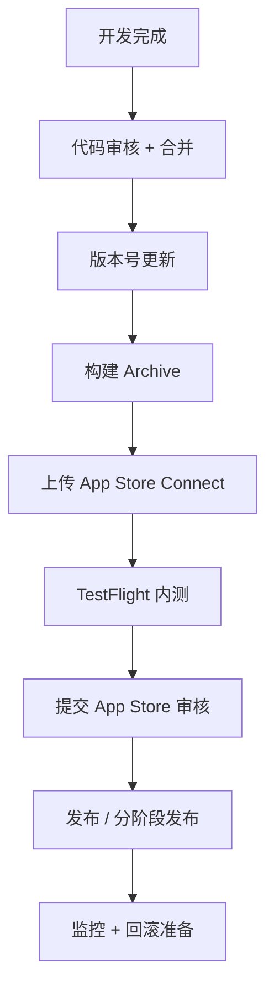
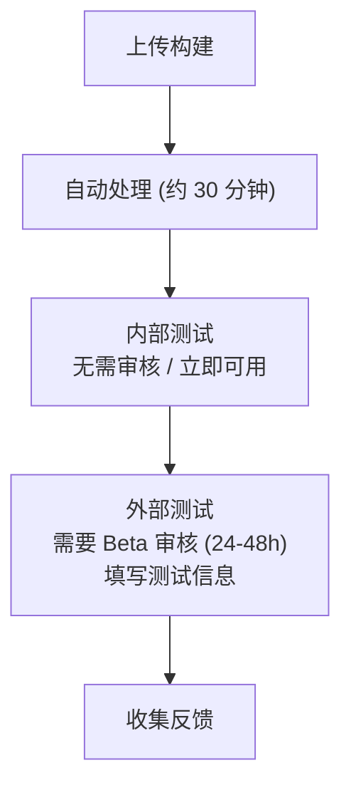
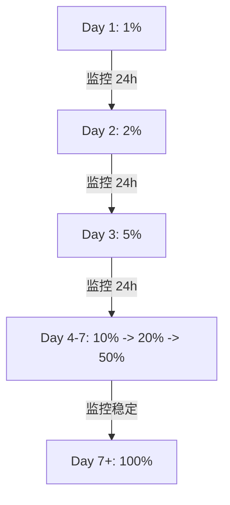
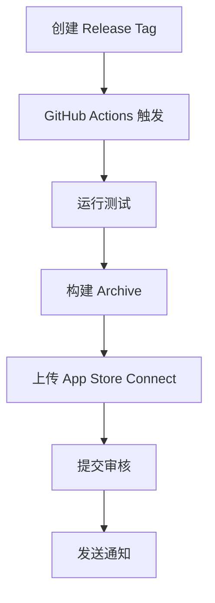

# iOS 发布流程

> Fastlane + App Store Connect + TestFlight

---

## 1. 发布概览



---

## 2. 版本管理

### 2.1 版本号规范

| 字段 | 格式 | 示例 |
|------|------|------|
| Version | MAJOR.MINOR.PATCH | 1.2.3 |
| Build | 递增整数 | 123 |

### 2.2 版本号规则

```
┌─────────────────────────────────────────────────────────────────┐
│                    版本号规则                                    │
├─────────────────────────────────────────────────────────────────┤
│                                                                  │
│  Version (CFBundleShortVersionString)                          │
│  ├── MAJOR: 重大更新/不兼容变更                                  │
│  ├── MINOR: 新功能                                              │
│  └── PATCH: Bug 修复                                            │
│                                                                  │
│  Build Number (CFBundleVersion)                                │
│  ├── 递增整数                                                    │
│  ├── 每次提交递增                                                │
│  └── 用于 TestFlight 区分                                       │
│                                                                  │
│  示例                                                            │
│  ├── 1.0.0 (1)  初始发布                                        │
│  ├── 1.0.1 (2)  Bug 修复                                        │
│  ├── 1.1.0 (3)  新功能                                          │
│  └── 2.0.0 (4)  重大更新                                        │
│                                                                  │
└─────────────────────────────────────────────────────────────────┘
```

---

## 3. 构建配置

### 3.1 Scheme 配置

| Scheme | 用途 |
|--------|------|
| Debug | 开发调试 |
| Staging | 测试环境 |
| Release | 生产环境 |

### 3.2 签名配置

```
┌─────────────────────────────────────────────────────────────────┐
│                    签名配置                                      │
├─────────────────────────────────────────────────────────────────┤
│                                                                  │
│  开发证书                                                        │
│  ├── Apple Development                                          │
│  └── 用于开发调试                                                │
│                                                                  │
│  发布证书                                                        │
│  ├── Apple Distribution                                         │
│  └── 用于 App Store / TestFlight                                │
│                                                                  │
│  Provisioning Profile                                           │
│  ├── Development Profile                                        │
│  ├── Ad Hoc Profile                                             │
│  └── App Store Profile                                          │
│                                                                  │
│  自动管理                                                        │
│  └── Automatically manage signing                              │
│                                                                  │
└─────────────────────────────────────────────────────────────────┘
```

---

## 4. Fastlane 配置

### 4.1 Lane 定义

| Lane | 功能 |
|------|------|
| test | 运行测试 |
| beta | 发布 TestFlight |
| release | 发布 App Store |
| screenshots | 生成截图 |

### 4.2 Fastlane 流程

```
┌─────────────────────────────────────────────────────────────────┐
│                    Fastlane 发布流程                             │
├─────────────────────────────────────────────────────────────────┤
│                                                                  │
│  fastlane beta                                                  │
│  ├── 增加 Build 号                                              │
│  ├── 运行测试                                                    │
│  ├── 构建 Archive                                               │
│  ├── 上传 TestFlight                                            │
│  └── 发送通知                                                    │
│                                                                  │
│  fastlane release                                               │
│  ├── 增加版本号                                                  │
│  ├── 运行测试                                                    │
│  ├── 构建 Archive                                               │
│  ├── 上传 App Store                                             │
│  ├── 提交审核                                                    │
│  └── 发送通知                                                    │
│                                                                  │
└─────────────────────────────────────────────────────────────────┘
```

---

## 5. TestFlight 测试

### 5.1 测试类型

| 类型 | 用途 | 限制 |
|------|------|------|
| 内部测试 | 开发团队 | 100 人 |
| 外部测试 | 公开测试 | 10,000 人 |

### 5.2 TestFlight 流程



---

## 6. App Store 审核

### 6.1 审核准备

| 准备项 | 说明 |
|--------|------|
| App 信息 | 名称、描述、关键词 |
| 截图 | 各尺寸截图 |
| 隐私政策 | 隐私政策 URL |
| 审核备注 | 测试账号等 |

### 6.2 常见拒绝原因

```
┌─────────────────────────────────────────────────────────────────┐
│                    常见拒绝原因                                   │
├─────────────────────────────────────────────────────────────────┤
│                                                                  │
│  功能问题                                                        │
│  ├── 崩溃或严重 Bug                                              │
│  ├── 功能不完整                                                  │
│  └── 性能问题                                                    │
│                                                                  │
│  设计问题                                                        │
│  ├── 不符合 HIG                                                 │
│  ├── UI 质量低                                                  │
│  └── 用户体验差                                                  │
│                                                                  │
│  内容问题                                                        │
│  ├── 元数据不准确                                                │
│  ├── 隐私问题                                                    │
│  └── 版权问题                                                    │
│                                                                  │
│  商业问题                                                        │
│  ├── 内购配置错误                                                │
│  └── 订阅说明不清                                                │
│                                                                  │
└─────────────────────────────────────────────────────────────────┘
```

---

## 7. 分阶段发布

### 7.1 发布策略



### 7.2 暂停/恢复

| 操作 | 说明 |
|------|------|
| 暂停发布 | 发现问题时暂停 |
| 恢复发布 | 问题解决后继续 |
| 紧急发布 | 跳过分阶段直接 100% |

---

## 8. 发布检查清单

### 8.1 发布前检查

| 检查项 | 说明 |
|--------|------|
| 测试通过 | 所有测试通过 |
| 版本号更新 | 版本和 Build 号 |
| 更新日志 | 准备发布说明 |
| 截图更新 | 如有 UI 变化 |
| 隐私声明 | 确认准确性 |

### 8.2 发布后监控

```
┌─────────────────────────────────────────────────────────────────┐
│                    发布后监控                                    │
├─────────────────────────────────────────────────────────────────┤
│                                                                  │
│  监控项目                                                        │
│  ├── 崩溃报告 (Crashlytics)                                     │
│  ├── 用户评价                                                    │
│  ├── 性能指标 (MetricKit)                                       │
│  └── 关键业务指标                                                │
│                                                                  │
│  监控周期                                                        │
│  ├── 发布后 1 小时: 每 15 分钟检查                               │
│  ├── 发布后 24 小时: 每小时检查                                  │
│  └── 发布后 7 天: 每天检查                                       │
│                                                                  │
│  回滚阈值                                                        │
│  ├── 崩溃率 > 1%                                                │
│  └── 严重功能故障                                                │
│                                                                  │
└─────────────────────────────────────────────────────────────────┘
```

---

## 9. CI/CD 集成

### 9.1 GitHub Actions

| 触发器 | 动作 |
|--------|------|
| PR | 运行测试 |
| develop 合并 | 发布 TestFlight |
| Tag 创建 | 发布 App Store |

### 9.2 发布工作流



---

## 10. 相关文档

| 文档 | 说明 |
|------|------|
| [app-store-submission.md](./app-store-submission.md) | App Store 提交详情 |
| [app-store-connect-setup-guide.md](./app-store-connect-setup-guide.md) | App Store Connect 配置 |
| [testing.md](./testing.md) | 测试策略 |

---

*最后更新: 2025-12-31*
