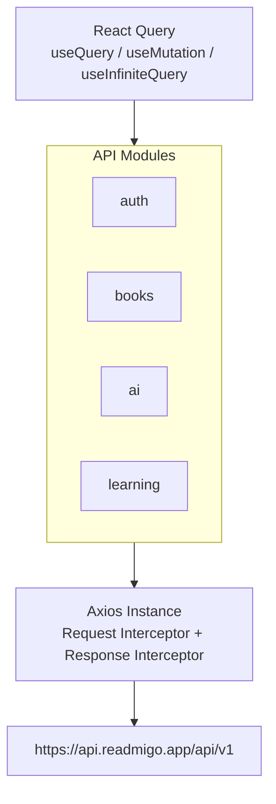

# React Native API 集成

## API 架构



## Axios 配置

### 基础配置

```
┌─────────────────────────────────────────────────────────────────┐
│                    Axios Instance Config                         │
├─────────────────────────────────────────────────────────────────┤
│  baseURL: https://api.readmigo.app/api/v1                       │
│  timeout: 30000 (30秒)                                          │
│  headers:                                                        │
│  ├── Content-Type: application/json                             │
│  └── Accept: application/json                                   │
└─────────────────────────────────────────────────────────────────┘
```

### Request Interceptor

```
┌─────────────────────────────────────────────────────────────────┐
│                   Request Interceptor                            │
├─────────────────────────────────────────────────────────────────┤
│  1. 获取 authStore 中的 accessToken                              │
│  2. 如果存在 token:                                              │
│     headers.Authorization = `Bearer ${accessToken}`             │
│  3. 获取 settingsStore 中的 language                            │
│     headers['Accept-Language'] = language                       │
│  4. 返回修改后的 config                                          │
└─────────────────────────────────────────────────────────────────┘
```

### Response Interceptor

```
┌─────────────────────────────────────────────────────────────────┐
│                  Response Interceptor                            │
├─────────────────────────────────────────────────────────────────┤
│  成功响应 (2xx):                                                 │
│  └── 直接返回 response                                          │
│                                                                  │
│  错误响应:                                                       │
│  ├── 401 Unauthorized:                                          │
│  │   ├── 尝试刷新 token                                         │
│  │   ├── 成功 → 重试原请求                                      │
│  │   └── 失败 → 调用 logout()，重定向登录                        │
│  ├── 403 Forbidden:                                             │
│  │   └── 权限错误处理                                           │
│  ├── 500+ Server Error:                                         │
│  │   └── 服务器错误提示                                         │
│  └── 其他错误:                                                   │
│      └── 通用错误处理                                           │
└─────────────────────────────────────────────────────────────────┘
```

## API 模块

### auth.ts

```
┌─────────────────────────────────────────────────────────────────┐
│                        Auth API                                  │
├─────────────────────────────────────────────────────────────────┤
│  POST /auth/login                                               │
│  ├── Request: { email, password }                               │
│  └── Response: { user, accessToken, refreshToken }              │
├─────────────────────────────────────────────────────────────────┤
│  POST /auth/register                                            │
│  ├── Request: { email, password, name }                         │
│  └── Response: { user, accessToken, refreshToken }              │
├─────────────────────────────────────────────────────────────────┤
│  POST /auth/social-login                                        │
│  ├── Request: { provider, token }                               │
│  └── Response: { user, accessToken, refreshToken }              │
├─────────────────────────────────────────────────────────────────┤
│  POST /auth/refresh                                             │
│  ├── Request: { refreshToken }                                  │
│  └── Response: { accessToken, refreshToken }                    │
├─────────────────────────────────────────────────────────────────┤
│  POST /auth/logout                                              │
│  └── Response: { success: true }                                │
├─────────────────────────────────────────────────────────────────┤
│  GET /auth/profile                                              │
│  └── Response: { user }                                         │
├─────────────────────────────────────────────────────────────────┤
│  PUT /auth/profile                                              │
│  ├── Request: { name?, avatar?, preferences? }                  │
│  └── Response: { user }                                         │
├─────────────────────────────────────────────────────────────────┤
│  DELETE /auth/account                                           │
│  └── Response: { success: true }                                │
└─────────────────────────────────────────────────────────────────┘
```

### books.ts

```
┌─────────────────────────────────────────────────────────────────┐
│                        Books API                                 │
├─────────────────────────────────────────────────────────────────┤
│  GET /books                                                     │
│  ├── Query: { category?, difficulty?, language?, page?, limit? }│
│  └── Response: { books[], pagination }                          │
├─────────────────────────────────────────────────────────────────┤
│  GET /books/:id                                                 │
│  └── Response: { book }                                         │
├─────────────────────────────────────────────────────────────────┤
│  GET /books/search                                              │
│  ├── Query: { q, page?, limit? }                                │
│  └── Response: { books[], pagination }                          │
├─────────────────────────────────────────────────────────────────┤
│  GET /books/categories                                          │
│  └── Response: { categories[] }                                 │
├─────────────────────────────────────────────────────────────────┤
│  GET /library/books                                             │
│  └── Response: { books[] }                                      │
├─────────────────────────────────────────────────────────────────┤
│  POST /library/books                                            │
│  ├── Request: { bookId }                                        │
│  └── Response: { success: true }                                │
├─────────────────────────────────────────────────────────────────┤
│  DELETE /library/books/:id                                      │
│  └── Response: { success: true }                                │
├─────────────────────────────────────────────────────────────────┤
│  PUT /library/books/:id/progress                                │
│  ├── Request: { progress, currentPage?, chapter? }              │
│  └── Response: { success: true }                                │
├─────────────────────────────────────────────────────────────────┤
│  GET /books/:id/content                                         │
│  └── Response: { contentUrl, format }                           │
└─────────────────────────────────────────────────────────────────┘
```

### ai.ts

```
┌─────────────────────────────────────────────────────────────────┐
│                          AI API                                  │
├─────────────────────────────────────────────────────────────────┤
│  POST /ai/explain                                               │
│  ├── Request: { text, context?, bookId? }                       │
│  └── Response: { explanation, examples[]?, pronunciation? }     │
├─────────────────────────────────────────────────────────────────┤
│  POST /ai/simplify                                              │
│  ├── Request: { text, targetLevel? }                            │
│  └── Response: { simplified }                                   │
├─────────────────────────────────────────────────────────────────┤
│  POST /ai/translate                                             │
│  ├── Request: { text, targetLanguage }                          │
│  └── Response: { translation }                                  │
├─────────────────────────────────────────────────────────────────┤
│  POST /vocabulary/words                                         │
│  ├── Request: { word, definition, context?, bookId? }           │
│  └── Response: { word }                                         │
├─────────────────────────────────────────────────────────────────┤
│  GET /vocabulary/words                                          │
│  ├── Query: { page?, limit?, sortBy? }                          │
│  └── Response: { words[], pagination }                          │
├─────────────────────────────────────────────────────────────────┤
│  DELETE /vocabulary/words/:id                                   │
│  └── Response: { success: true }                                │
├─────────────────────────────────────────────────────────────────┤
│  PUT /vocabulary/words/:id/mastery                              │
│  ├── Request: { mastery: 0-5 }                                  │
│  └── Response: { word }                                         │
├─────────────────────────────────────────────────────────────────┤
│  GET /vocabulary/review                                         │
│  ├── Query: { limit? }                                          │
│  └── Response: { words[] }                                      │
└─────────────────────────────────────────────────────────────────┘
```

### learning.ts

```
┌─────────────────────────────────────────────────────────────────┐
│                       Learning API                               │
├─────────────────────────────────────────────────────────────────┤
│  GET /learning/today                                            │
│  └── Response: { minutes, words, pages, goal, progress }        │
├─────────────────────────────────────────────────────────────────┤
│  GET /learning/daily                                            │
│  ├── Query: { startDate, endDate }                              │
│  └── Response: { stats[] }                                      │
├─────────────────────────────────────────────────────────────────┤
│  GET /learning/weekly                                           │
│  └── Response: { stats[], totalMinutes, avgMinutes }            │
├─────────────────────────────────────────────────────────────────┤
│  GET /learning/monthly                                          │
│  └── Response: { stats[], totalMinutes, totalWords }            │
├─────────────────────────────────────────────────────────────────┤
│  GET /learning/streak                                           │
│  └── Response: { currentStreak, longestStreak }                 │
├─────────────────────────────────────────────────────────────────┤
│  PUT /learning/goal                                             │
│  ├── Request: { dailyMinutes }                                  │
│  └── Response: { goal }                                         │
├─────────────────────────────────────────────────────────────────┤
│  POST /learning/session                                         │
│  ├── Request: { bookId, minutes, pages?, words? }               │
│  └── Response: { session }                                      │
└─────────────────────────────────────────────────────────────────┘
```

## React Query 使用

### Query 示例

```
┌─────────────────────────────────────────────────────────────────┐
│                     Query Pattern                                │
├─────────────────────────────────────────────────────────────────┤
│  Hook: useBooks                                                  │
│  ├── queryKey: ['books', 'list', filters]                       │
│  ├── queryFn: () => booksApi.getBooks(filters)                  │
│  ├── staleTime: 5 * 60 * 1000                                   │
│  └── enabled: !!filters                                         │
├─────────────────────────────────────────────────────────────────┤
│  返回值:                                                         │
│  ├── data: Book[]                                               │
│  ├── isLoading: boolean                                         │
│  ├── isError: boolean                                           │
│  ├── error: Error                                               │
│  └── refetch: () => void                                        │
└─────────────────────────────────────────────────────────────────┘
```

### Mutation 示例

```
┌─────────────────────────────────────────────────────────────────┐
│                    Mutation Pattern                              │
├─────────────────────────────────────────────────────────────────┤
│  Hook: useAddToLibrary                                          │
│  ├── mutationFn: (bookId) => libraryApi.addBook(bookId)         │
│  ├── onSuccess: () => {                                         │
│  │   queryClient.invalidateQueries(['library'])                 │
│  │   Toast.show('已添加到书架')                                  │
│  │ }                                                            │
│  └── onError: (error) => {                                      │
│      Toast.show(error.message)                                  │
│    }                                                            │
├─────────────────────────────────────────────────────────────────┤
│  返回值:                                                         │
│  ├── mutate: (bookId) => void                                   │
│  ├── mutateAsync: (bookId) => Promise                           │
│  ├── isLoading: boolean                                         │
│  └── isError: boolean                                           │
└─────────────────────────────────────────────────────────────────┘
```

### Infinite Query 示例

```
┌─────────────────────────────────────────────────────────────────┐
│                  Infinite Query Pattern                          │
├─────────────────────────────────────────────────────────────────┤
│  Hook: useInfiniteBooks                                         │
│  ├── queryKey: ['books', 'infinite', filters]                   │
│  ├── queryFn: ({ pageParam = 1 }) =>                            │
│  │   booksApi.getBooks({ ...filters, page: pageParam })         │
│  ├── getNextPageParam: (lastPage) =>                            │
│  │   lastPage.hasMore ? lastPage.page + 1 : undefined           │
│  └── initialPageParam: 1                                        │
├─────────────────────────────────────────────────────────────────┤
│  返回值:                                                         │
│  ├── data.pages: Page[]                                         │
│  ├── fetchNextPage: () => void                                  │
│  ├── hasNextPage: boolean                                       │
│  └── isFetchingNextPage: boolean                                │
└─────────────────────────────────────────────────────────────────┘
```

## 错误处理

### 错误类型

```
┌─────────────────────────────────────────────────────────────────┐
│                      Error Types                                 │
├─────────────────────────────────────────────────────────────────┤
│  NetworkError                                                    │
│  ├── code: 'NETWORK_ERROR'                                      │
│  └── message: 'Network request failed'                          │
├─────────────────────────────────────────────────────────────────┤
│  AuthError                                                       │
│  ├── code: 'AUTH_ERROR'                                         │
│  └── message: 'Authentication failed'                           │
├─────────────────────────────────────────────────────────────────┤
│  ValidationError                                                 │
│  ├── code: 'VALIDATION_ERROR'                                   │
│  └── fields: { field: string, message: string }[]               │
├─────────────────────────────────────────────────────────────────┤
│  ServerError                                                     │
│  ├── code: 'SERVER_ERROR'                                       │
│  └── message: 'Internal server error'                           │
└─────────────────────────────────────────────────────────────────┘
```

### 全局错误处理

```
┌─────────────────────────────────────────────────────────────────┐
│               Global Error Handler                               │
├─────────────────────────────────────────────────────────────────┤
│  QueryClient defaultOptions:                                     │
│  ├── queries.onError: (error) => handleQueryError(error)        │
│  └── mutations.onError: (error) => handleMutationError(error)   │
├─────────────────────────────────────────────────────────────────┤
│  handleQueryError:                                               │
│  ├── 401 → logout + redirect                                    │
│  ├── 网络错误 → show offline toast                               │
│  └── 其他 → log error                                           │
├─────────────────────────────────────────────────────────────────┤
│  handleMutationError:                                            │
│  ├── 验证错误 → show field errors                                │
│  └── 其他 → show error toast                                    │
└─────────────────────────────────────────────────────────────────┘
```

## 缓存策略

```
┌─────────────────────────────────────────────────────────────────┐
│                    Cache Configuration                           │
├─────────────────────────────────────────────────────────────────┤
│  数据类型              staleTime        cacheTime               │
│  ─────────────────────────────────────────────────────────────  │
│  书籍列表              5 分钟           24 小时                  │
│  书籍详情              10 分钟          24 小时                  │
│  用户书架              1 分钟           1 小时                   │
│  学习统计              1 分钟           30 分钟                  │
│  词汇列表              5 分钟           1 小时                   │
│  AI 解释              30 分钟          24 小时                  │
└─────────────────────────────────────────────────────────────────┘
```
