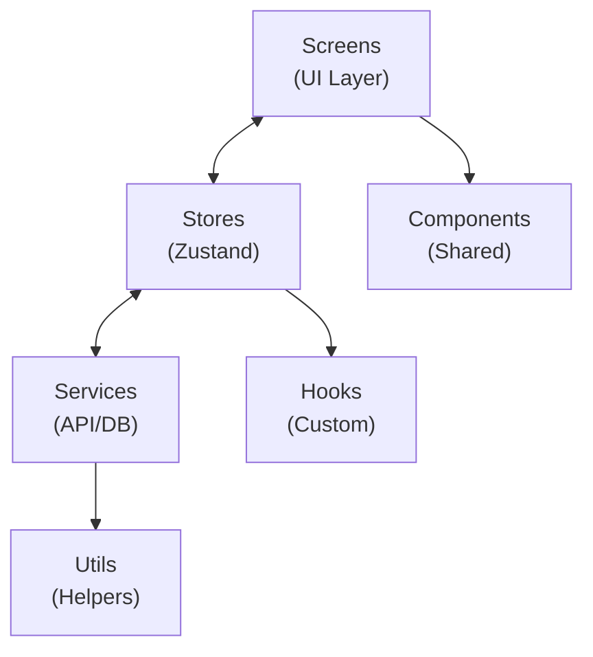

# Readmigo React Native Client 实现方案

## 1. 概述

### 1.1 目标
开发功能与 iOS/Android 原生客户端 **100% 对齐** 的 React Native 跨平台应用，使用单一代码库同时支持 iOS 和 Android 平台。

### 1.2 产品定位
AI 原生英语原版书阅读学习应用，核心理念："Read any book. AI has your back."

### 1.3 技术选型理由

| 方案 | 优势 | 劣势 | 选择 |
|------|------|------|------|
| **Expo (Managed)** | 开发效率高、OTA 更新、丰富生态 | 部分原生功能受限 | ✅ 推荐 |
| Bare React Native | 完全控制原生代码 | 配置复杂、维护成本高 | - |
| Expo (Bare) | 兼顾灵活性和便利性 | 仍需处理原生配置 | 备选 |

---

## 2. 技术选型

### 2.1 开发环境

| 项目 | 配置 |
|------|------|
| **框架** | Expo SDK 52+ |
| **语言** | TypeScript 5.x |
| **运行时** | React Native 0.76+ (New Architecture) |
| **最低 iOS** | iOS 15.0 |
| **最低 Android** | Android 8.0 (API 26) |
| **包管理** | pnpm / yarn |
| **IDE** | VS Code + Expo Tools |

### 2.2 架构模式



### 2.3 项目结构

```
readmigo-rn/
├── app/                          # Expo Router 页面
│   ├── (auth)/                   # 认证相关页面
│   │   ├── login.tsx
│   │   └── onboarding.tsx
│   ├── (tabs)/                   # 主 Tab 导航
│   │   ├── library.tsx
│   │   ├── discover.tsx
│   │   ├── learn.tsx
│   │   └── profile.tsx
│   ├── book/
│   │   ├── [id].tsx              # 书籍详情
│   │   └── reader.tsx            # 阅读器
│   ├── _layout.tsx               # 根布局
│   └── index.tsx                 # 入口
│
├── src/
│   ├── features/                 # 功能模块
│   │   ├── auth/
│   │   │   ├── components/
│   │   │   ├── hooks/
│   │   │   ├── stores/
│   │   │   ├── services/
│   │   │   └── types/
│   │   ├── library/
│   │   ├── reader/
│   │   ├── ai/
│   │   ├── learning/
│   │   ├── audiobook/
│   │   ├── subscriptions/
│   │   ├── social/
│   │   ├── settings/
│   │   ├── search/
│   │   ├── messaging/
│   │   └── about/
│   │
│   ├── components/               # 共享组件
│   │   ├── ui/                   # 基础 UI 组件
│   │   │   ├── Button.tsx
│   │   │   ├── Card.tsx
│   │   │   ├── Input.tsx
│   │   │   └── Modal.tsx
│   │   ├── layout/               # 布局组件
│   │   └── feedback/             # 反馈组件
│   │
│   ├── hooks/                    # 全局 Hooks
│   │   ├── useAuth.ts
│   │   ├── useTheme.ts
│   │   └── useNetwork.ts
│   │
│   ├── stores/                   # 全局状态
│   │   ├── authStore.ts
│   │   ├── settingsStore.ts
│   │   └── index.ts
│   │
│   ├── services/                 # API 服务
│   │   ├── api/
│   │   │   ├── client.ts         # Axios 实例
│   │   │   ├── auth.ts
│   │   │   ├── books.ts
│   │   │   └── ai.ts
│   │   ├── storage/              # 本地存储
│   │   └── notifications/        # 推送通知
│   │
│   ├── utils/                    # 工具函数
│   │   ├── format.ts
│   │   ├── validation.ts
│   │   └── constants.ts
│   │
│   ├── theme/                    # 主题配置
│   │   ├── colors.ts
│   │   ├── typography.ts
│   │   ├── spacing.ts
│   │   └── index.ts
│   │
│   ├── i18n/                     # 国际化
│   │   ├── locales/
│   │   │   ├── en.json
│   │   │   ├── zh-Hans.json
│   │   │   └── zh-Hant.json
│   │   └── index.ts
│   │
│   └── types/                    # 全局类型
│       ├── api.ts
│       ├── navigation.ts
│       └── index.ts
│
├── assets/                       # 静态资源
│   ├── images/
│   ├── fonts/
│   └── animations/
│
├── app.json                      # Expo 配置
├── eas.json                      # EAS Build 配置
├── babel.config.js
├── tsconfig.json
├── package.json
└── README.md
```

---

## 3. 核心依赖库

---

## 4. 状态管理架构

---

## 5. API 服务层

---

## 6. 导航架构

---

## 7. 模块功能对照

### 7.1 模块优先级

| 优先级 | 模块 | 说明 | 状态 |
|--------|------|------|------|
| P0 | Auth | 认证授权 | 待实现 |
| P0 | Onboarding | 新用户引导 | 待实现 |
| P0 | Library | 书架管理 | 待实现 |
| P0 | Reader | 阅读器 | 待实现 |
| P0 | AI | AI 辅助功能 | 待实现 |
| P1 | Learning | 词汇学习 | 待实现 |
| P1 | Audiobook | 有声书 | 待实现 |
| P1 | Subscriptions | 订阅支付 | 待实现 |
| P1 | Settings | 应用设置 | 待实现 |
| P1 | Search | 搜索功能 | 待实现 |
| P2 | Social | 社交功能 | 待实现 |
| P2 | Messaging | 客服消息 | 待实现 |
| P2 | Guest Mode | 访客模式 | 待实现 |
| P2 | i18n | 国际化 | 待实现 |
| P2 | About | 关于页面 | 待实现 |

### 7.2 与原生平台对齐

| 功能 | iOS | Android | React Native |
|------|-----|---------|--------------|
| 登录方式 | Apple/Google | Google/Apple | expo-auth-session |
| 支付 | StoreKit 2 | Play Billing | RevenueCat |
| 推送 | APNs | FCM | expo-notifications |
| 阅读器 | WKWebView | WebView | react-native-webview |
| 数据库 | Core Data | Room | expo-sqlite + Drizzle |
| 键值存储 | Keychain | EncryptedSharedPreferences | expo-secure-store |
| 主题 | SwiftUI | Material 3 | 自定义 Theme |

---

## 8. 阅读器实现

---

## 9. 构建与发布

---

## 10. 测试策略

---

## 11. 性能优化

---

## 12. 实现路线图

### Phase 1: 核心功能 (Week 1-3)
- [ ] 项目初始化和基础架构
- [ ] 认证模块 (Apple/Google Sign-In)
- [ ] 书架和书籍详情
- [ ] 基础阅读器

### Phase 2: AI 功能 (Week 4-5)
- [ ] AI 解释面板
- [ ] 句子简化
- [ ] 翻译功能
- [ ] 词汇保存

### Phase 3: 学习系统 (Week 6-7)
- [ ] 词汇本
- [ ] 闪卡复习
- [ ] 学习统计
- [ ] 每日目标

### Phase 4: 订阅与社交 (Week 8-9)
- [ ] RevenueCat 集成
- [ ] 订阅管理
- [ ] 社交功能
- [ ] 分享功能

### Phase 5: 优化与发布 (Week 10-11)
- [ ] 性能优化
- [ ] 有声书支持
- [ ] 多语言支持
- [ ] 应用商店提交

---

## 相关文档

- [modules/README.md](./modules/) - 模块规范目录
- [design-system-implementation.md](./design-system-implementation.md) - 设计系统实现
- [app-submission-guide.md](./app-submission-guide.md) - 应用商店提交指南

---

**最后更新**: 2024-12-26
**文档版本**: 1.0
