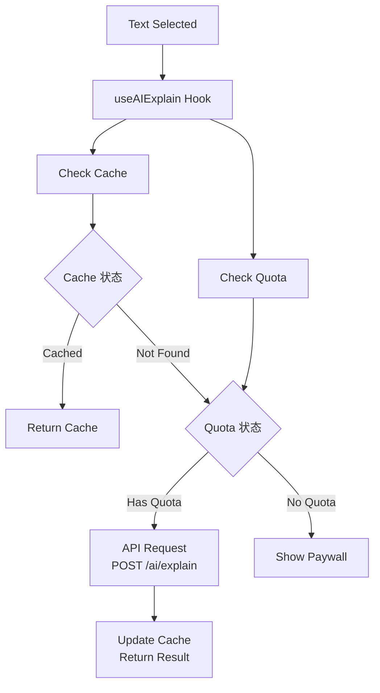
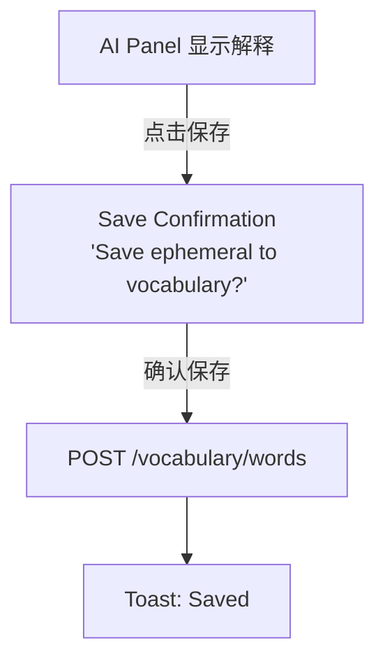

# AI 功能

## 功能概述

```
┌─────────────────────────────────────────────────────────────────┐
│                      AI Feature                                  │
├─────────────────────────────────────────────────────────────────┤
│  核心功能                                                        │
│  ├── 单词/短语解释                                               │
│  ├── 文本翻译                                                    │
│  ├── 文本简化                                                    │
│  ├── 上下文理解                                                  │
│  └── 配额管理                                                    │
└─────────────────────────────────────────────────────────────────┘
```

## AI 解释面板

```
┌─────────────────────────────────────────────────────────────────┐
│               AI Explanation Panel                               │
├─────────────────────────────────────────────────────────────────┤
│  ┌─────────────────────────────────────────────────────────┐    │
│  │                    Bottom Sheet                          │    │
│  │  ───────────────────────────────────────────────────────│    │
│  │                                                          │    │
│  │  "ephemeral"                                🔊           │    │
│  │  /ɪˈfem(ə)rəl/                                           │    │
│  │                                                          │    │
│  │  ─────────────────────────────────────────────────────  │    │
│  │                                                          │    │
│  │  Definition                                              │    │
│  │  Lasting for a very short time; transitory.             │    │
│  │                                                          │    │
│  │  Examples                                                │    │
│  │  • The ephemeral beauty of cherry blossoms              │    │
│  │  • Fame can be ephemeral in the digital age             │    │
│  │                                                          │    │
│  │  Context                                                 │    │
│  │  "...the ephemeral nature of fame meant that..."        │    │
│  │                                                          │    │
│  │  ─────────────────────────────────────────────────────  │    │
│  │                                                          │    │
│  │  [ 💾 Save Word ]  [ 🌐 Translate ]  [ ✨ Simplify ]    │    │
│  │                                                          │    │
│  └─────────────────────────────────────────────────────────┘    │
│                                                                  │
└─────────────────────────────────────────────────────────────────┘
```

## 组件结构

```
┌─────────────────────────────────────────────────────────────────┐
│                   Component Structure                            │
├─────────────────────────────────────────────────────────────────┤
│  features/ai/                                                    │
│  ├── components/                                                │
│  │   ├── AIExplanationPanel.tsx   # AI 解释面板                 │
│  │   ├── ExplanationContent.tsx   # 解释内容                    │
│  │   ├── TranslationView.tsx      # 翻译视图                    │
│  │   ├── SimplifiedView.tsx       # 简化视图                    │
│  │   ├── LoadingState.tsx         # 加载状态                    │
│  │   ├── QuotaIndicator.tsx       # 配额指示                    │
│  │   └── index.ts                                               │
│  ├── hooks/                                                     │
│  │   ├── useAIExplain.ts          # 解释 Hook                   │
│  │   ├── useAITranslate.ts        # 翻译 Hook                   │
│  │   └── useAISimplify.ts         # 简化 Hook                   │
│  ├── services/                                                  │
│  │   └── aiApi.ts                 # AI API 调用                 │
│  └── types/                                                     │
│      └── index.ts                                               │
└─────────────────────────────────────────────────────────────────┘
```

## AI 解释功能

```
┌─────────────────────────────────────────────────────────────────┐
│                    AI Explain                                    │
├─────────────────────────────────────────────────────────────────┤
│  触发方式                                                        │
│  ├── 阅读器文本选择 → 点击"查词"                                │
│  └── 词汇列表 → 点击词汇卡片                                    │
├─────────────────────────────────────────────────────────────────┤
│  请求参数                                                        │
│  {                                                              │
│    text: string,       // 选中文本                              │
│    context: string,    // 上下文                                │
│    bookId: string      // 书籍 ID                               │
│  }                                                              │
├─────────────────────────────────────────────────────────────────┤
│  响应数据                                                        │
│  {                                                              │
│    word: string,                                                │
│    pronunciation: string,                                       │
│    definition: string,                                          │
│    examples: string[],                                          │
│    partOfSpeech: string,                                        │
│    synonyms: string[],                                          │
│    contextualMeaning: string                                    │
│  }                                                              │
├─────────────────────────────────────────────────────────────────┤
│  缓存策略                                                        │
│  ├── queryKey: ['ai', 'explain', text]                          │
│  ├── staleTime: 30 分钟                                         │
│  └── cacheTime: 24 小时                                         │
└─────────────────────────────────────────────────────────────────┘
```

## AI 翻译功能

```
┌─────────────────────────────────────────────────────────────────┐
│                    AI Translate                                  │
├─────────────────────────────────────────────────────────────────┤
│  支持语言                                                        │
│  ├── 源语言: 自动检测                                           │
│  └── 目标语言: 根据用户设置                                     │
│      ├── 简体中文 (zh-Hans)                                     │
│      ├── 繁体中文 (zh-Hant)                                     │
│      └── English (en)                                           │
├─────────────────────────────────────────────────────────────────┤
│  请求参数                                                        │
│  {                                                              │
│    text: string,                                                │
│    targetLanguage: string                                       │
│  }                                                              │
├─────────────────────────────────────────────────────────────────┤
│  响应数据                                                        │
│  {                                                              │
│    translation: string,                                         │
│    sourceLanguage: string                                       │
│  }                                                              │
└─────────────────────────────────────────────────────────────────┘
```

## AI 简化功能

```
┌─────────────────────────────────────────────────────────────────┐
│                    AI Simplify                                   │
├─────────────────────────────────────────────────────────────────┤
│  功能                                                            │
│  ├── 简化复杂句子                                                │
│  ├── 使用更简单词汇                                              │
│  └── 保持原意                                                    │
├─────────────────────────────────────────────────────────────────┤
│  请求参数                                                        │
│  {                                                              │
│    text: string,                                                │
│    targetLevel: 'beginner' | 'intermediate' | 'advanced'        │
│  }                                                              │
├─────────────────────────────────────────────────────────────────┤
│  响应数据                                                        │
│  {                                                              │
│    simplified: string,                                          │
│    changes: { original: string, simplified: string }[]          │
│  }                                                              │
└─────────────────────────────────────────────────────────────────┘
```

## 数据流



## 配额管理

```
┌─────────────────────────────────────────────────────────────────┐
│                   Quota Management                               │
├─────────────────────────────────────────────────────────────────┤
│  免费用户                                                        │
│  ├── 每日查词: 20 次                                            │
│  ├── 每日翻译: 10 次                                            │
│  └── 每日简化: 5 次                                             │
├─────────────────────────────────────────────────────────────────┤
│  订阅用户                                                        │
│  └── 无限制                                                      │
├─────────────────────────────────────────────────────────────────┤
│  配额显示                                                        │
│  ├── AI 面板底部显示剩余次数                                    │
│  └── 次数用尽显示升级提示                                        │
├─────────────────────────────────────────────────────────────────┤
│  重置时间                                                        │
│  └── 每日 UTC 00:00 重置                                        │
└─────────────────────────────────────────────────────────────────┘
```

## 错误处理

```
┌─────────────────────────────────────────────────────────────────┐
│                   Error Handling                                 │
├─────────────────────────────────────────────────────────────────┤
│  网络错误                                                        │
│  ├── 显示重试按钮                                                │
│  └── 提示检查网络连接                                            │
├─────────────────────────────────────────────────────────────────┤
│  配额耗尽                                                        │
│  ├── 显示配额用尽提示                                            │
│  ├── 显示升级选项                                                │
│  └── 显示重置时间                                                │
├─────────────────────────────────────────────────────────────────┤
│  服务不可用                                                      │
│  ├── 显示服务繁忙提示                                            │
│  └── 建议稍后重试                                                │
├─────────────────────────────────────────────────────────────────┤
│  内容过长                                                        │
│  └── 提示选择更短文本                                            │
└─────────────────────────────────────────────────────────────────┘
```

## API 接口

```
┌─────────────────────────────────────────────────────────────────┐
│                       AI API                                     │
├─────────────────────────────────────────────────────────────────┤
│  POST /ai/explain                                               │
│  ├── Request: { text, context?, bookId? }                       │
│  └── Response: {                                                │
│        word, pronunciation, definition,                         │
│        examples[], partOfSpeech, synonyms[]                     │
│      }                                                          │
├─────────────────────────────────────────────────────────────────┤
│  POST /ai/translate                                             │
│  ├── Request: { text, targetLanguage }                          │
│  └── Response: { translation, sourceLanguage }                  │
├─────────────────────────────────────────────────────────────────┤
│  POST /ai/simplify                                              │
│  ├── Request: { text, targetLevel? }                            │
│  └── Response: { simplified, changes[] }                        │
├─────────────────────────────────────────────────────────────────┤
│  GET /ai/quota                                                  │
│  └── Response: {                                                │
│        explain: { used, limit },                                │
│        translate: { used, limit },                              │
│        simplify: { used, limit },                               │
│        resetAt: Date                                            │
│      }                                                          │
└─────────────────────────────────────────────────────────────────┘
```

## 加载状态

```
┌─────────────────────────────────────────────────────────────────┐
│                   Loading States                                 │
├─────────────────────────────────────────────────────────────────┤
│  初始加载                                                        │
│  ├── 骨架屏 (Skeleton)                                          │
│  └── 动画脉冲效果                                                │
├─────────────────────────────────────────────────────────────────┤
│  流式输出 (可选)                                                 │
│  ├── 逐字显示                                                    │
│  └── 打字机效果                                                  │
├─────────────────────────────────────────────────────────────────┤
│  刷新加载                                                        │
│  └── 内容区域加载指示器                                          │
└─────────────────────────────────────────────────────────────────┘
```

## 保存词汇流程


