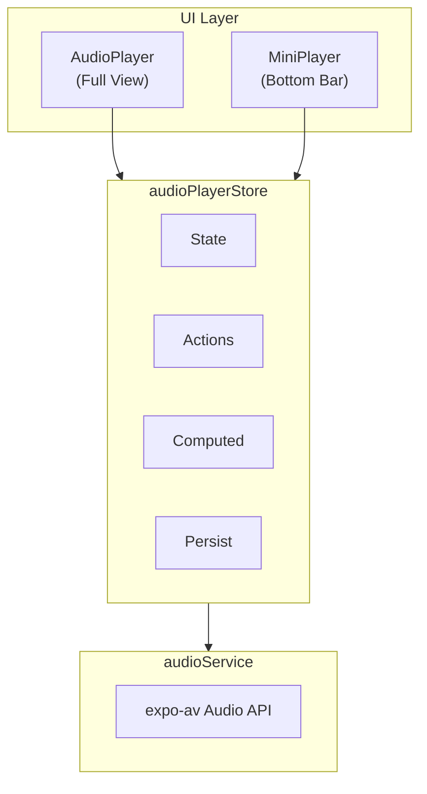
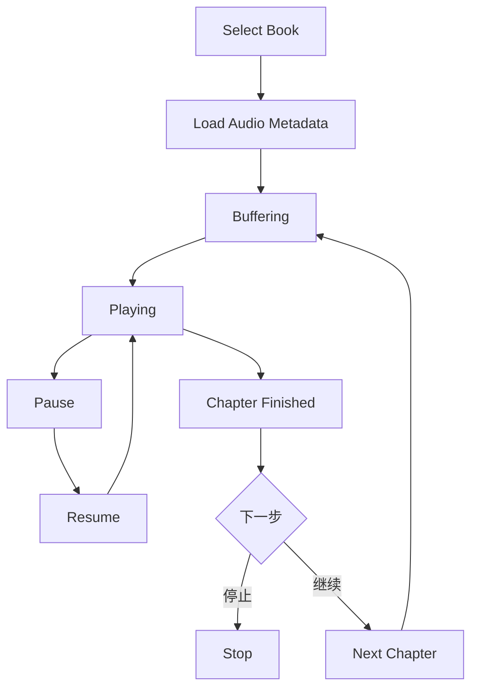

# 有声书功能

## 功能概述

```
┌─────────────────────────────────────────────────────────────────┐
│                   Audiobook Feature                              │
├─────────────────────────────────────────────────────────────────┤
│  核心功能                                                        │
│  ├── 音频播放控制                                                │
│  ├── 播放速度调节                                                │
│  ├── 睡眠定时器                                                  │
│  ├── 章节导航                                                    │
│  ├── 后台播放                                                    │
│  └── 迷你播放器                                                  │
└─────────────────────────────────────────────────────────────────┘
```

## 架构设计



## 组件结构

```
┌─────────────────────────────────────────────────────────────────┐
│                   Component Structure                            │
├─────────────────────────────────────────────────────────────────┤
│  features/audiobook/                                             │
│  ├── components/                                                │
│  │   ├── AudioPlayer.tsx        # 全屏播放器                    │
│  │   ├── MiniPlayer.tsx         # 迷你播放器                    │
│  │   ├── PlaybackControls.tsx   # 播放控制按钮                   │
│  │   ├── ProgressSlider.tsx     # 进度条                        │
│  │   ├── SpeedSelector.tsx      # 速度选择器                     │
│  │   ├── SleepTimer.tsx         # 睡眠定时器                     │
│  │   ├── ChapterList.tsx        # 章节列表                      │
│  │   └── index.ts                                               │
│  ├── services/                                                  │
│  │   ├── audioService.ts        # 音频播放服务                   │
│  │   └── audiobookApi.ts        # API 调用                      │
│  ├── stores/                                                    │
│  │   └── audioPlayerStore.ts    # 播放器状态                     │
│  ├── hooks/                                                     │
│  │   └── useAudiobook.ts        # 播放器 Hook                   │
│  └── types/                                                     │
│      └── index.ts                                               │
└─────────────────────────────────────────────────────────────────┘
```

## 状态管理

```
┌─────────────────────────────────────────────────────────────────┐
│                  audioPlayerStore                                │
├─────────────────────────────────────────────────────────────────┤
│  State                                                           │
│  ├── currentBook: Audiobook | null                              │
│  ├── currentChapter: number                                     │
│  ├── chapters: Chapter[]                                        │
│  ├── isPlaying: boolean                                         │
│  ├── isLoading: boolean                                         │
│  ├── position: number (ms)                                      │
│  ├── duration: number (ms)                                      │
│  ├── buffered: number (ms)                                      │
│  ├── playbackSpeed: number (0.5 - 3.0)                          │
│  ├── volume: number (0 - 1)                                     │
│  └── sleepTimer: number | null (分钟)                           │
├─────────────────────────────────────────────────────────────────┤
│  Actions                                                         │
│  ├── loadAudiobook(bookId)                                      │
│  ├── play()                                                     │
│  ├── pause()                                                    │
│  ├── stop()                                                     │
│  ├── seekTo(position)                                           │
│  ├── skipForward(seconds)                                       │
│  ├── skipBackward(seconds)                                      │
│  ├── nextChapter()                                              │
│  ├── previousChapter()                                          │
│  ├── setPlaybackSpeed(speed)                                    │
│  ├── setVolume(volume)                                          │
│  ├── setSleepTimer(minutes)                                     │
│  └── clearSleepTimer()                                          │
├─────────────────────────────────────────────────────────────────┤
│  Computed                                                        │
│  ├── progressPercent: number                                    │
│  ├── remainingTime: number                                      │
│  └── formattedPosition: string                                  │
├─────────────────────────────────────────────────────────────────┤
│  Persisted                                                       │
│  ├── playbackSpeed                                              │
│  ├── volume                                                     │
│  └── lastPosition (per book)                                    │
└─────────────────────────────────────────────────────────────────┘
```

## audioService

```
┌─────────────────────────────────────────────────────────────────┐
│                     Audio Service                                │
├─────────────────────────────────────────────────────────────────┤
│  初始化                                                          │
│  ├── Audio.setAudioModeAsync({                                  │
│  │   allowsRecordingIOS: false,                                 │
│  │   staysActiveInBackground: true,                             │
│  │   playsInSilentModeIOS: true,                                │
│  │   shouldDuckAndroid: true,                                   │
│  │   playThroughEarpieceAndroid: false                          │
│  │ })                                                           │
│  └── 创建 Audio.Sound 实例                                      │
├─────────────────────────────────────────────────────────────────┤
│  方法                                                            │
│  ├── loadAudio(uri)             # 加载音频                      │
│  ├── play()                     # 播放                          │
│  ├── pause()                    # 暂停                          │
│  ├── stop()                     # 停止                          │
│  ├── seekTo(millis)             # 跳转                          │
│  ├── setRate(rate)              # 设置速度                      │
│  ├── setVolume(volume)          # 设置音量                      │
│  └── unload()                   # 卸载                          │
├─────────────────────────────────────────────────────────────────┤
│  回调                                                            │
│  ├── onPlaybackStatusUpdate     # 状态更新                      │
│  └── onPlaybackFinished         # 播放完成                      │
└─────────────────────────────────────────────────────────────────┘
```

## 播放控制

```
┌─────────────────────────────────────────────────────────────────┐
│                   Playback Controls                              │
├─────────────────────────────────────────────────────────────────┤
│                                                                  │
│           ┌───────────────────────────────────────┐             │
│           │         Progress Slider               │             │
│           │  ────●────────────────────────────── │             │
│           │  02:35              /           45:20 │             │
│           └───────────────────────────────────────┘             │
│                                                                  │
│           ┌───────────────────────────────────────┐             │
│           │                                       │             │
│           │    ⏮️  ⏪15   ▶️/⏸️   15⏩   ⏭️      │             │
│           │   Prev Skip  Play   Skip  Next       │             │
│           │                                       │             │
│           └───────────────────────────────────────┘             │
│                                                                  │
│           ┌───────────────────────────────────────┐             │
│           │   🕐 Sleep    1.0x Speed    📋 List  │             │
│           └───────────────────────────────────────┘             │
│                                                                  │
└─────────────────────────────────────────────────────────────────┘
```

## 播放速度

```
┌─────────────────────────────────────────────────────────────────┐
│                   Playback Speed                                 │
├─────────────────────────────────────────────────────────────────┤
│  预设选项                                                        │
│  ├── 0.5x    (慢速)                                             │
│  ├── 0.75x                                                      │
│  ├── 1.0x    (正常)                                             │
│  ├── 1.25x                                                      │
│  ├── 1.5x                                                       │
│  ├── 1.75x                                                      │
│  ├── 2.0x                                                       │
│  ├── 2.5x                                                       │
│  └── 3.0x    (最快)                                             │
├─────────────────────────────────────────────────────────────────┤
│  保持音调                                                        │
│  └── shouldCorrectPitch: true                                   │
└─────────────────────────────────────────────────────────────────┘
```

## 睡眠定时器

```
┌─────────────────────────────────────────────────────────────────┐
│                    Sleep Timer                                   │
├─────────────────────────────────────────────────────────────────┤
│  预设选项                                                        │
│  ├── 5 分钟                                                     │
│  ├── 10 分钟                                                    │
│  ├── 15 分钟                                                    │
│  ├── 30 分钟                                                    │
│  ├── 45 分钟                                                    │
│  ├── 60 分钟                                                    │
│  └── 章节结束时                                                  │
├─────────────────────────────────────────────────────────────────┤
│  实现                                                            │
│  ├── 使用 setTimeout 计时                                       │
│  ├── 倒计时显示                                                  │
│  ├── 到时自动暂停                                                │
│  └── 可提前取消                                                  │
├─────────────────────────────────────────────────────────────────┤
│  淡出效果                                                        │
│  └── 最后 10 秒渐降音量                                         │
└─────────────────────────────────────────────────────────────────┘
```

## 迷你播放器

```
┌─────────────────────────────────────────────────────────────────┐
│                    Mini Player                                   │
├─────────────────────────────────────────────────────────────────┤
│  显示位置                                                        │
│  └── Tab Bar 上方                                               │
├─────────────────────────────────────────────────────────────────┤
│  布局                                                            │
│  ┌─────────────────────────────────────────────────────────┐    │
│  │  ┌─────┐                                                │    │
│  │  │ 📖  │  Book Title         ▶️/⏸️   ⏭️               │    │
│  │  │Cover│  Chapter Name                                  │    │
│  │  └─────┘                                                │    │
│  │  ─────────────────●───────────────────────              │    │
│  └─────────────────────────────────────────────────────────┘    │
├─────────────────────────────────────────────────────────────────┤
│  交互                                                            │
│  ├── 点击: 展开全屏播放器                                        │
│  ├── 播放/暂停按钮                                               │
│  ├── 下一章按钮                                                  │
│  └── 进度条 (只读)                                              │
└─────────────────────────────────────────────────────────────────┘
```

## 后台播放

```
┌─────────────────────────────────────────────────────────────────┐
│                 Background Playback                              │
├─────────────────────────────────────────────────────────────────┤
│  iOS 配置                                                        │
│  ├── Info.plist: UIBackgroundModes = audio                      │
│  └── staysActiveInBackground: true                              │
├─────────────────────────────────────────────────────────────────┤
│  Android 配置                                                    │
│  └── 前台服务 (Foreground Service)                              │
├─────────────────────────────────────────────────────────────────┤
│  锁屏控制                                                        │
│  ├── 显示播放信息                                                │
│  ├── 播放/暂停                                                   │
│  ├── 上一章/下一章                                               │
│  └── 进度条                                                      │
├─────────────────────────────────────────────────────────────────┤
│  通知栏控制 (Android)                                            │
│  └── 同锁屏控制                                                  │
└─────────────────────────────────────────────────────────────────┘
```

## 章节管理

```
┌─────────────────────────────────────────────────────────────────┐
│                  Chapter Management                              │
├─────────────────────────────────────────────────────────────────┤
│  章节列表                                                        │
│  ├── 标题                                                        │
│  ├── 时长                                                        │
│  ├── 当前播放标记                                                │
│  └── 已播放/未播放状态                                           │
├─────────────────────────────────────────────────────────────────┤
│  章节导航                                                        │
│  ├── 点击跳转到章节                                              │
│  ├── 上一章/下一章按钮                                           │
│  └── 自动连续播放                                                │
├─────────────────────────────────────────────────────────────────┤
│  章节数据                                                        │
│  {                                                              │
│    id: string,                                                  │
│    title: string,                                               │
│    audioUrl: string,                                            │
│    duration: number,                                            │
│    startTime: number                                            │
│  }                                                              │
└─────────────────────────────────────────────────────────────────┘
```

## 进度同步

```
┌─────────────────────────────────────────────────────────────────┐
│                    Progress Sync                                 │
├─────────────────────────────────────────────────────────────────┤
│  本地存储                                                        │
│  ├── 当前章节                                                    │
│  ├── 章节内位置                                                  │
│  └── 最后播放时间                                                │
├─────────────────────────────────────────────────────────────────┤
│  服务器同步                                                      │
│  ├── 防抖 10 秒                                                 │
│  ├── 暂停时立即同步                                              │
│  └── 切换章节时同步                                              │
├─────────────────────────────────────────────────────────────────┤
│  恢复播放                                                        │
│  ├── 启动时检查上次位置                                          │
│  └── 跳转到上次位置                                              │
└─────────────────────────────────────────────────────────────────┘
```

## 播放流程


