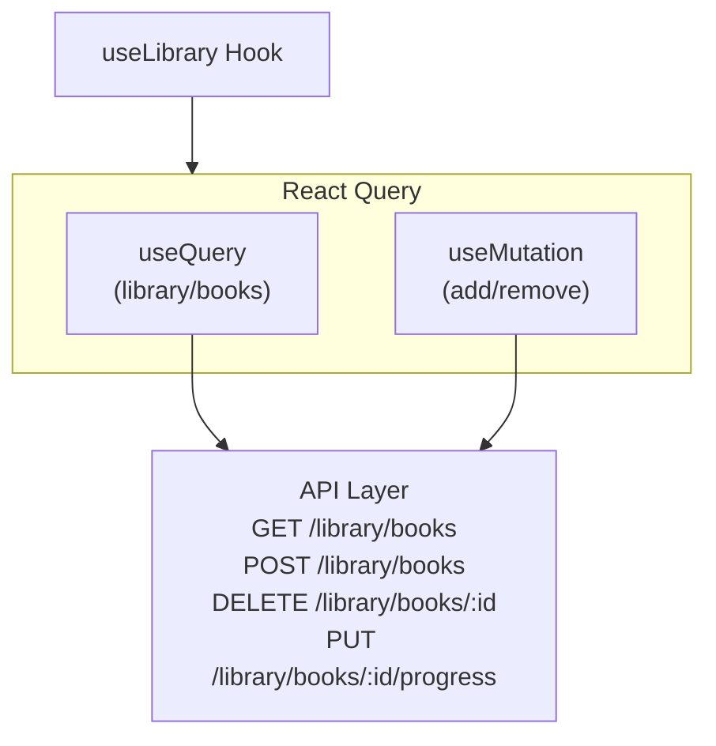

# 书库管理功能

## 功能概述

```
┌─────────────────────────────────────────────────────────────────┐
│                    Library Feature                               │
├─────────────────────────────────────────────────────────────────┤
│  核心功能                                                        │
│  ├── 用户书库展示                                                │
│  ├── 阅读进度追踪                                                │
│  ├── 书籍分类管理                                                │
│  ├── 搜索与筛选                                                  │
│  └── 书籍移除                                                    │
└─────────────────────────────────────────────────────────────────┘
```

## 页面架构

```
┌─────────────────────────────────────────────────────────────────┐
│                   Library Screen                                 │
├─────────────────────────────────────────────────────────────────┤
│  ┌─────────────────────────────────────────────────────────┐    │
│  │                    Header                                │    │
│  │  ┌──────────────────────────────┐  ┌────────┐          │    │
│  │  │  🔍 Search books...          │  │ Filter │          │    │
│  │  └──────────────────────────────┘  └────────┘          │    │
│  └─────────────────────────────────────────────────────────┘    │
│                                                                  │
│  ┌─────────────────────────────────────────────────────────┐    │
│  │                 Category Tabs                            │    │
│  │  [ All ] [ Reading ] [ Finished ] [ Want to Read ]      │    │
│  └─────────────────────────────────────────────────────────┘    │
│                                                                  │
│  ┌─────────────────────────────────────────────────────────┐    │
│  │                   Book Grid                              │    │
│  │  ┌─────────┐  ┌─────────┐  ┌─────────┐                  │    │
│  │  │  Cover  │  │  Cover  │  │  Cover  │                  │    │
│  │  │         │  │         │  │         │                  │    │
│  │  │ ──────  │  │ ──────  │  │ ──────  │   Progress Bar   │    │
│  │  │  Title  │  │  Title  │  │  Title  │                  │    │
│  │  └─────────┘  └─────────┘  └─────────┘                  │    │
│  │                                                          │    │
│  │  ┌─────────┐  ┌─────────┐  ┌─────────┐                  │    │
│  │  │  Cover  │  │  Cover  │  │  Cover  │                  │    │
│  │  │         │  │         │  │         │                  │    │
│  │  └─────────┘  └─────────┘  └─────────┘                  │    │
│  └─────────────────────────────────────────────────────────┘    │
│                                                                  │
└─────────────────────────────────────────────────────────────────┘
```

## 组件结构

```
┌─────────────────────────────────────────────────────────────────┐
│                   Component Structure                            │
├─────────────────────────────────────────────────────────────────┤
│  features/library/                                               │
│  ├── components/                                                │
│  │   ├── LibraryScreen.tsx      # 主页面                        │
│  │   ├── BookGrid.tsx           # 书籍网格                      │
│  │   ├── BookCard.tsx           # 书籍卡片                      │
│  │   ├── CategoryTabs.tsx       # 分类标签                      │
│  │   ├── SearchBar.tsx          # 搜索栏                        │
│  │   ├── FilterSheet.tsx        # 筛选面板                      │
│  │   ├── EmptyState.tsx         # 空状态                        │
│  │   └── index.ts                                               │
│  ├── hooks/                                                     │
│  │   ├── useLibrary.ts          # 书库 Hook                     │
│  │   └── useLibrarySearch.ts    # 搜索 Hook                     │
│  └── types/                                                     │
│      └── index.ts                                               │
└─────────────────────────────────────────────────────────────────┘
```

## 数据流



## 书籍分类

```
┌─────────────────────────────────────────────────────────────────┐
│                   Book Categories                                │
├─────────────────────────────────────────────────────────────────┤
│  All (全部)                                                      │
│  └── 显示所有书籍                                                │
├─────────────────────────────────────────────────────────────────┤
│  Reading (在读)                                                  │
│  └── progress > 0 && progress < 100                             │
├─────────────────────────────────────────────────────────────────┤
│  Finished (已读完)                                               │
│  └── progress === 100                                           │
├─────────────────────────────────────────────────────────────────┤
│  Want to Read (想读)                                             │
│  └── progress === 0 || status === 'want_to_read'                │
└─────────────────────────────────────────────────────────────────┘
```

## 书籍卡片

```
┌─────────────────────────────────────────────────────────────────┐
│                     Book Card                                    │
├─────────────────────────────────────────────────────────────────┤
│  ┌───────────────────────────────┐                              │
│  │  ┌─────────────────────────┐  │                              │
│  │  │                         │  │                              │
│  │  │                         │  │                              │
│  │  │        Cover            │  │  160 x 240                   │
│  │  │        Image            │  │                              │
│  │  │                         │  │                              │
│  │  │                         │  │                              │
│  │  └─────────────────────────┘  │                              │
│  │  ══════════════●══════════    │  Progress Bar                │
│  │  Book Title                   │                              │
│  │  Author Name                  │                              │
│  └───────────────────────────────┘                              │
├─────────────────────────────────────────────────────────────────┤
│  交互                                                            │
│  ├── 点击: 跳转到书籍详情                                        │
│  └── 长按: 显示操作菜单                                          │
├─────────────────────────────────────────────────────────────────┤
│  操作菜单                                                        │
│  ├── 继续阅读                                                    │
│  ├── 标记为已读完                                                │
│  ├── 移出书架                                                    │
│  └── 查看详情                                                    │
└─────────────────────────────────────────────────────────────────┘
```

## 搜索功能

```
┌─────────────────────────────────────────────────────────────────┐
│                    Search Feature                                │
├─────────────────────────────────────────────────────────────────┤
│  搜索范围                                                        │
│  ├── 书名                                                        │
│  ├── 作者                                                        │
│  └── 书籍描述                                                    │
├─────────────────────────────────────────────────────────────────┤
│  实现方式                                                        │
│  ├── 本地搜索 (已加载数据)                                      │
│  ├── 防抖处理 (300ms)                                           │
│  └── 高亮匹配文本                                                │
├─────────────────────────────────────────────────────────────────┤
│  搜索状态                                                        │
│  ├── 空状态: 显示搜索提示                                       │
│  ├── 搜索中: 显示加载                                           │
│  ├── 有结果: 显示匹配书籍                                       │
│  └── 无结果: 显示空状态                                         │
└─────────────────────────────────────────────────────────────────┘
```

## 筛选功能

```
┌─────────────────────────────────────────────────────────────────┐
│                    Filter Feature                                │
├─────────────────────────────────────────────────────────────────┤
│  Filter Sheet (Bottom Sheet)                                     │
│  ┌─────────────────────────────────────────────────────────┐    │
│  │  Sort By                                                 │    │
│  │  ○ Recently Added                                        │    │
│  │  ○ Recently Read                                         │    │
│  │  ○ Title A-Z                                             │    │
│  │  ○ Title Z-A                                             │    │
│  │  ○ Progress                                              │    │
│  ├─────────────────────────────────────────────────────────┤    │
│  │  Difficulty                                              │    │
│  │  □ Beginner                                              │    │
│  │  □ Intermediate                                          │    │
│  │  □ Advanced                                              │    │
│  ├─────────────────────────────────────────────────────────┤    │
│  │  Genre                                                   │    │
│  │  □ Fiction   □ Non-Fiction  □ Science                   │    │
│  │  □ History   □ Biography    □ Self-Help                 │    │
│  ├─────────────────────────────────────────────────────────┤    │
│  │           [ Reset ]      [ Apply ]                       │    │
│  └─────────────────────────────────────────────────────────┘    │
└─────────────────────────────────────────────────────────────────┘
```

## 进度追踪

```
┌─────────────────────────────────────────────────────────────────┐
│                   Progress Tracking                              │
├─────────────────────────────────────────────────────────────────┤
│  进度数据                                                        │
│  {                                                              │
│    bookId: string,                                              │
│    progress: number,      // 0-100                              │
│    currentPage: number,                                         │
│    totalPages: number,                                          │
│    currentChapter: number,                                      │
│    lastReadAt: Date,                                            │
│    location: string       // EPUB CFI                           │
│  }                                                              │
├─────────────────────────────────────────────────────────────────┤
│  进度来源                                                        │
│  ├── 阅读器自动更新                                              │
│  ├── 有声书播放更新                                              │
│  └── 手动标记完成                                                │
├─────────────────────────────────────────────────────────────────┤
│  进度显示                                                        │
│  ├── 进度条 (百分比)                                            │
│  ├── 页数 (current/total)                                       │
│  └── 章节 (current/total)                                       │
└─────────────────────────────────────────────────────────────────┘
```

## 空状态

```
┌─────────────────────────────────────────────────────────────────┐
│                    Empty States                                  │
├─────────────────────────────────────────────────────────────────┤
│  书架为空                                                        │
│  ┌─────────────────────────────────────────────────────────┐    │
│  │                    📚                                    │    │
│  │                                                          │    │
│  │              Your library is empty                       │    │
│  │                                                          │    │
│  │        Start by adding books from Discover               │    │
│  │                                                          │    │
│  │              [ Explore Books ]                           │    │
│  └─────────────────────────────────────────────────────────┘    │
├─────────────────────────────────────────────────────────────────┤
│  搜索无结果                                                      │
│  ┌─────────────────────────────────────────────────────────┐    │
│  │                    🔍                                    │    │
│  │                                                          │    │
│  │              No books found                              │    │
│  │                                                          │    │
│  │        Try a different search term                       │    │
│  └─────────────────────────────────────────────────────────┘    │
├─────────────────────────────────────────────────────────────────┤
│  分类为空                                                        │
│  ┌─────────────────────────────────────────────────────────┐    │
│  │                    📖                                    │    │
│  │                                                          │    │
│  │          No books in this category                       │    │
│  │                                                          │    │
│  │        Start reading to see books here                   │    │
│  └─────────────────────────────────────────────────────────┘    │
└─────────────────────────────────────────────────────────────────┘
```

## API 接口

```
┌─────────────────────────────────────────────────────────────────┐
│                    Library API                                   │
├─────────────────────────────────────────────────────────────────┤
│  GET /library/books                                             │
│  ├── Query: { status?, sortBy?, page?, limit? }                 │
│  └── Response: { books[], pagination }                          │
├─────────────────────────────────────────────────────────────────┤
│  POST /library/books                                            │
│  ├── Request: { bookId }                                        │
│  └── Response: { success: true }                                │
├─────────────────────────────────────────────────────────────────┤
│  DELETE /library/books/:id                                      │
│  └── Response: { success: true }                                │
├─────────────────────────────────────────────────────────────────┤
│  PUT /library/books/:id/status                                  │
│  ├── Request: { status: 'reading' | 'finished' | 'want' }       │
│  └── Response: { success: true }                                │
├─────────────────────────────────────────────────────────────────┤
│  PUT /library/books/:id/progress                                │
│  ├── Request: { progress, page?, chapter?, location? }          │
│  └── Response: { success: true }                                │
└─────────────────────────────────────────────────────────────────┘
```

## 列表性能

```
┌─────────────────────────────────────────────────────────────────┐
│                  List Performance                                │
├─────────────────────────────────────────────────────────────────┤
│  使用 FlashList                                                  │
│  ├── 替代 FlatList                                              │
│  ├── 更好的回收机制                                              │
│  └── numColumns={2} 网格布局                                    │
├─────────────────────────────────────────────────────────────────┤
│  优化措施                                                        │
│  ├── estimatedItemSize: 240                                     │
│  ├── getItemType 区分类型                                       │
│  ├── keyExtractor 稳定 key                                      │
│  └── renderItem 使用 memo                                       │
├─────────────────────────────────────────────────────────────────┤
│  图片优化                                                        │
│  ├── expo-image 替代 Image                                      │
│  ├── 固定尺寸                                                    │
│  ├── 占位图                                                      │
│  └── 缓存策略                                                    │
└─────────────────────────────────────────────────────────────────┘
```
