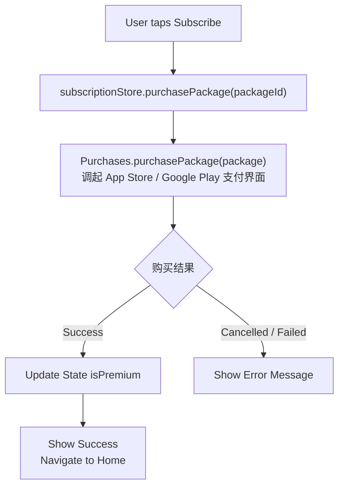

# 订阅系统

## 功能概述

```
┌─────────────────────────────────────────────────────────────────┐
│                 Subscription Feature                             │
├─────────────────────────────────────────────────────────────────┤
│  核心功能                                                        │
│  ├── 订阅计划展示                                                │
│  ├── 订阅购买                                                    │
│  ├── 订阅状态管理                                                │
│  ├── 恢复购买                                                    │
│  └── 付费墙展示                                                  │
└─────────────────────────────────────────────────────────────────┘
```

## 订阅计划

```
┌─────────────────────────────────────────────────────────────────┐
│                  Subscription Plans                              │
├─────────────────────────────────────────────────────────────────┤
│  Free Plan (免费版)                                              │
│  ├── 基础阅读功能                                                │
│  ├── 每日 20 次 AI 查词                                         │
│  ├── 每日 10 次翻译                                             │
│  ├── 免费书籍库访问                                              │
│  └── 基础学习统计                                                │
├─────────────────────────────────────────────────────────────────┤
│  Premium Monthly (月度订阅)                                      │
│  ├── 无限 AI 查词/翻译                                          │
│  ├── 完整书籍库访问                                              │
│  ├── 高级学习统计                                                │
│  ├── 离线下载                                                    │
│  ├── 无广告体验                                                  │
│  └── 优先新功能                                                  │
├─────────────────────────────────────────────────────────────────┤
│  Premium Yearly (年度订阅)                                       │
│  ├── 所有月度功能                                                │
│  └── 相比月度节省 40%                                           │
└─────────────────────────────────────────────────────────────────┘
```

## 付费墙页面

```
┌─────────────────────────────────────────────────────────────────┐
│                    Paywall Screen                                │
├─────────────────────────────────────────────────────────────────┤
│  ┌─────────────────────────────────────────────────────────┐    │
│  │                      [ X Close ]                         │    │
│  └─────────────────────────────────────────────────────────┘    │
│                                                                  │
│  ┌─────────────────────────────────────────────────────────┐    │
│  │                                                          │    │
│  │                    ⭐ Premium                            │    │
│  │                                                          │    │
│  │              Unlock Your Full Potential                  │    │
│  │                                                          │    │
│  └─────────────────────────────────────────────────────────┘    │
│                                                                  │
│  ┌─────────────────────────────────────────────────────────┐    │
│  │  What You Get                                            │    │
│  │                                                          │    │
│  │  ✓ Unlimited AI explanations & translations             │    │
│  │  ✓ Access to entire book library                        │    │
│  │  ✓ Advanced learning analytics                          │    │
│  │  ✓ Download books for offline reading                   │    │
│  │  ✓ Ad-free experience                                   │    │
│  │  ✓ Priority access to new features                      │    │
│  │                                                          │    │
│  └─────────────────────────────────────────────────────────┘    │
│                                                                  │
│  ┌─────────────────────────────────────────────────────────┐    │
│  │  Choose Your Plan                                        │    │
│  │                                                          │    │
│  │  ┌─────────────────────────────────────────────────┐    │    │
│  │  │  Monthly                                         │    │    │
│  │  │  $9.99/month                                     │    │    │
│  │  │  Billed monthly                                  │    │    │
│  │  └─────────────────────────────────────────────────┘    │    │
│  │                                                          │    │
│  │  ┌─────────────────────────────────────────────────┐    │    │
│  │  │  Yearly                           BEST VALUE    │    │    │
│  │  │  $59.99/year ($4.99/month)        Save 40%     │    │    │
│  │  │  Billed annually                    ●           │    │    │
│  │  └─────────────────────────────────────────────────┘    │    │
│  │                                                          │    │
│  └─────────────────────────────────────────────────────────┘    │
│                                                                  │
│  ┌─────────────────────────────────────────────────────────┐    │
│  │              [ ✨ Start Free Trial ]                     │    │
│  │                                                          │    │
│  │  7-day free trial, then $59.99/year                     │    │
│  │  Cancel anytime. Restore Purchases                       │    │
│  └─────────────────────────────────────────────────────────┘    │
│                                                                  │
│  ┌─────────────────────────────────────────────────────────┐    │
│  │         Terms of Service  |  Privacy Policy              │    │
│  └─────────────────────────────────────────────────────────┘    │
│                                                                  │
└─────────────────────────────────────────────────────────────────┘
```

## 组件结构

```
┌─────────────────────────────────────────────────────────────────┐
│                   Component Structure                            │
├─────────────────────────────────────────────────────────────────┤
│  features/subscriptions/                                         │
│  ├── components/                                                │
│  │   ├── PaywallScreen.tsx      # 付费墙页面                    │
│  │   ├── PlanCard.tsx           # 订阅计划卡片                   │
│  │   ├── FeatureList.tsx        # 功能列表                      │
│  │   ├── PriceDisplay.tsx       # 价格显示                      │
│  │   ├── TrialBanner.tsx        # 试用提示                      │
│  │   └── index.ts                                               │
│  ├── services/                                                  │
│  │   └── revenueCat.ts          # RevenueCat 服务               │
│  ├── stores/                                                    │
│  │   └── subscriptionStore.ts   # 订阅状态                      │
│  ├── hooks/                                                     │
│  │   └── useSubscription.ts     # 订阅 Hook                     │
│  └── types/                                                     │
│      └── index.ts                                               │
└─────────────────────────────────────────────────────────────────┘
```

## RevenueCat 集成

```
┌─────────────────────────────────────────────────────────────────┐
│                   RevenueCat Integration                         │
├─────────────────────────────────────────────────────────────────┤
│  初始化                                                          │
│  ├── Purchases.configure({ apiKey })                            │
│  ├── iOS/Android 分别配置 API Key                               │
│  └── 设置 App User ID                                           │
├─────────────────────────────────────────────────────────────────┤
│  产品配置                                                        │
│  ├── Entitlements: 'premium'                                    │
│  ├── Product IDs:                                               │
│  │   ├── iOS: com.readmigo.premium.monthly                      │
│  │   ├── iOS: com.readmigo.premium.yearly                       │
│  │   ├── Android: premium_monthly                               │
│  │   └── Android: premium_yearly                                │
│  └── Offerings: 'default'                                       │
├─────────────────────────────────────────────────────────────────┤
│  SDK 方法                                                        │
│  ├── getOfferings()           # 获取产品信息                    │
│  ├── purchasePackage()        # 购买                            │
│  ├── restorePurchases()       # 恢复购买                        │
│  └── getCustomerInfo()        # 获取订阅状态                    │
└─────────────────────────────────────────────────────────────────┘
```

## 订阅状态管理

```
┌─────────────────────────────────────────────────────────────────┐
│                  subscriptionStore                               │
├─────────────────────────────────────────────────────────────────┤
│  State                                                           │
│  ├── isPremium: boolean                                         │
│  ├── subscriptionType: 'free' | 'monthly' | 'yearly'            │
│  ├── expirationDate: Date | null                                │
│  ├── isTrialing: boolean                                        │
│  ├── trialEndDate: Date | null                                  │
│  ├── offerings: Offering[]                                      │
│  └── isLoading: boolean                                         │
├─────────────────────────────────────────────────────────────────┤
│  Actions                                                         │
│  ├── fetchSubscriptionStatus()                                  │
│  ├── fetchOfferings()                                           │
│  ├── purchasePackage(packageId)                                 │
│  ├── restorePurchases()                                         │
│  └── checkPremiumAccess()                                       │
├─────────────────────────────────────────────────────────────────┤
│  Selectors                                                       │
│  ├── hasUnlimitedAI                                             │
│  ├── hasFullLibrary                                             │
│  ├── hasOfflineDownload                                         │
│  └── hasAdvancedStats                                           │
└─────────────────────────────────────────────────────────────────┘
```

## 购买流程



## 付费墙触发点

```
┌─────────────────────────────────────────────────────────────────┐
│                  Paywall Triggers                                │
├─────────────────────────────────────────────────────────────────┤
│  AI 配额用尽                                                     │
│  ├── 查词次数用完                                                │
│  └── 显示: "Upgrade for unlimited AI"                           │
├─────────────────────────────────────────────────────────────────┤
│  访问 Premium 书籍                                               │
│  ├── 点击仅限订阅的书籍                                         │
│  └── 显示: "This book requires Premium"                         │
├─────────────────────────────────────────────────────────────────┤
│  高级功能                                                        │
│  ├── 离线下载                                                    │
│  ├── 高级统计                                                    │
│  └── 显示: "Upgrade to unlock"                                  │
├─────────────────────────────────────────────────────────────────┤
│  主动触发                                                        │
│  ├── 设置页点击"订阅"                                            │
│  └── 显示完整付费墙                                              │
└─────────────────────────────────────────────────────────────────┘
```

## 恢复购买

```
┌─────────────────────────────────────────────────────────────────┐
│                  Restore Purchases                               │
├─────────────────────────────────────────────────────────────────┤
│  触发场景                                                        │
│  ├── 新设备登录                                                  │
│  ├── 重新安装 App                                               │
│  └── 手动恢复                                                    │
├─────────────────────────────────────────────────────────────────┤
│  流程                                                            │
│  1. 点击 "Restore Purchases"                                    │
│  2. 调用 Purchases.restorePurchases()                           │
│  3. 验证用户购买历史                                             │
│  4. 更新本地订阅状态                                             │
│  5. 显示恢复结果                                                 │
├─────────────────────────────────────────────────────────────────┤
│  结果处理                                                        │
│  ├── 恢复成功: "Your subscription has been restored"            │
│  └── 无购买记录: "No purchases to restore"                      │
└─────────────────────────────────────────────────────────────────┘
```

## 订阅状态同步

```
┌─────────────────────────────────────────────────────────────────┐
│                 Subscription Sync                                │
├─────────────────────────────────────────────────────────────────┤
│  App 启动时                                                      │
│  ├── 获取 RevenueCat customerInfo                               │
│  ├── 更新 subscriptionStore                                     │
│  └── 同步到后端 (可选)                                          │
├─────────────────────────────────────────────────────────────────┤
│  RevenueCat Listener                                             │
│  ├── 监听 customerInfo 变化                                     │
│  ├── 订阅状态实时更新                                            │
│  └── 处理订阅过期                                                │
├─────────────────────────────────────────────────────────────────┤
│  后端同步 (可选)                                                 │
│  ├── Webhook 接收购买通知                                       │
│  └── 验证订阅有效性                                              │
└─────────────────────────────────────────────────────────────────┘
```

## 订阅权益检查

```
┌─────────────────────────────────────────────────────────────────┐
│                 Entitlement Check                                │
├─────────────────────────────────────────────────────────────────┤
│  useSubscription Hook                                            │
│  ├── isPremium: boolean                                         │
│  ├── checkAccess(feature): boolean                              │
│  └── showPaywall(): void                                        │
├─────────────────────────────────────────────────────────────────┤
│  使用示例                                                        │
│  ┌─────────────────────────────────────────────────────────┐    │
│  │  const { isPremium, showPaywall } = useSubscription();   │    │
│  │                                                          │    │
│  │  const handleDownload = () => {                         │    │
│  │    if (!isPremium) {                                    │    │
│  │      showPaywall();                                     │    │
│  │      return;                                            │    │
│  │    }                                                    │    │
│  │    // Download book                                     │    │
│  │  };                                                     │    │
│  └─────────────────────────────────────────────────────────┘    │
├─────────────────────────────────────────────────────────────────┤
│  Premium 功能映射                                                │
│  ├── 无限 AI → isPremium                                       │
│  ├── 完整书库 → isPremium                                      │
│  ├── 离线下载 → isPremium                                      │
│  └── 高级统计 → isPremium                                      │
└─────────────────────────────────────────────────────────────────┘
```

## 管理订阅

```
┌─────────────────────────────────────────────────────────────────┐
│                Manage Subscription                               │
├─────────────────────────────────────────────────────────────────┤
│  查看订阅                                                        │
│  ├── 设置页显示当前订阅状态                                     │
│  ├── 显示到期时间                                                │
│  └── 显示计划类型                                                │
├─────────────────────────────────────────────────────────────────┤
│  管理订阅                                                        │
│  ├── iOS: 跳转到 App Store 订阅管理                             │
│  │   Linking.openURL('https://apps.apple.com/account/subscriptions')│
│  └── Android: 跳转到 Google Play 订阅管理                       │
│      Linking.openURL('https://play.google.com/store/account/subscriptions')│
├─────────────────────────────────────────────────────────────────┤
│  取消订阅                                                        │
│  ├── 引导用户到系统订阅设置                                     │
│  └── 订阅期内仍可使用                                            │
└─────────────────────────────────────────────────────────────────┘
```
