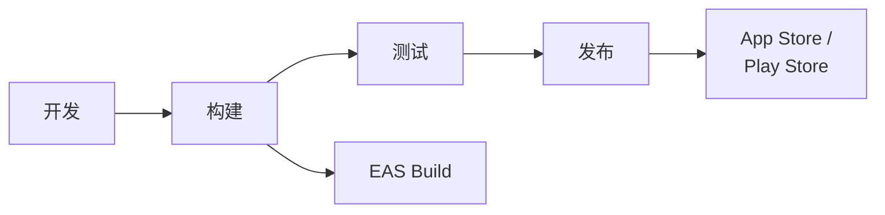

# React Native 发布流程

## 发布架构



## EAS (Expo Application Services)

```
┌─────────────────────────────────────────────────────────────────┐
│                      EAS Overview                                │
├─────────────────────────────────────────────────────────────────┤
│  EAS Build                                                       │
│  ├── 云端构建服务                                                │
│  ├── iOS / Android 同时构建                                     │
│  ├── 无需本地开发环境                                            │
│  └── 自动签名管理                                                │
├─────────────────────────────────────────────────────────────────┤
│  EAS Submit                                                      │
│  ├── 自动提交到商店                                              │
│  ├── App Store Connect                                          │
│  └── Google Play Console                                        │
├─────────────────────────────────────────────────────────────────┤
│  EAS Update                                                      │
│  ├── OTA 热更新                                                 │
│  ├── 无需重新提交商店                                            │
│  └── JS Bundle 更新                                             │
└─────────────────────────────────────────────────────────────────┘
```

## eas.json 配置

```
┌─────────────────────────────────────────────────────────────────┐
│                    EAS Configuration                             │
├─────────────────────────────────────────────────────────────────┤
│  {                                                              │
│    "cli": { "version": ">= 10.0.0" },                           │
│    "build": {                                                   │
│      "development": {                                           │
│        "developmentClient": true,                               │
│        "distribution": "internal",                              │
│        "ios": { "simulator": true },                            │
│        "android": { "buildType": "apk" }                        │
│      },                                                         │
│      "preview": {                                               │
│        "distribution": "internal",                              │
│        "ios": { "simulator": false },                           │
│        "android": { "buildType": "apk" }                        │
│      },                                                         │
│      "production": {                                            │
│        "autoIncrement": true,                                   │
│        "ios": {},                                               │
│        "android": {}                                            │
│      }                                                          │
│    },                                                           │
│    "submit": {                                                  │
│      "production": {                                            │
│        "ios": { "appleId": "...", "ascAppId": "..." },          │
│        "android": { "serviceAccountKeyPath": "..." }            │
│      }                                                          │
│    }                                                            │
│  }                                                              │
└─────────────────────────────────────────────────────────────────┘
```

## 构建流程

### 开发构建

```
┌─────────────────────────────────────────────────────────────────┐
│                   Development Build                              │
├─────────────────────────────────────────────────────────────────┤
│  用途                                                            │
│  ├── 开发调试                                                    │
│  ├── 内部测试                                                    │
│  └── Development Client                                         │
├─────────────────────────────────────────────────────────────────┤
│  命令                                                            │
│  ├── eas build --profile development --platform ios             │
│  ├── eas build --profile development --platform android         │
│  └── eas build --profile development --platform all             │
├─────────────────────────────────────────────────────────────────┤
│  分发                                                            │
│  ├── iOS: Ad Hoc / Internal                                     │
│  └── Android: APK 直接安装                                      │
└─────────────────────────────────────────────────────────────────┘
```

### 预览构建

```
┌─────────────────────────────────────────────────────────────────┐
│                     Preview Build                                │
├─────────────────────────────────────────────────────────────────┤
│  用途                                                            │
│  ├── QA 测试                                                    │
│  ├── 利益相关者预览                                              │
│  └── Beta 测试                                                  │
├─────────────────────────────────────────────────────────────────┤
│  命令                                                            │
│  ├── eas build --profile preview --platform ios                 │
│  └── eas build --profile preview --platform android             │
├─────────────────────────────────────────────────────────────────┤
│  分发                                                            │
│  ├── iOS: TestFlight Internal                                   │
│  └── Android: Internal Testing Track                            │
└─────────────────────────────────────────────────────────────────┘
```

### 生产构建

```
┌─────────────────────────────────────────────────────────────────┐
│                   Production Build                               │
├─────────────────────────────────────────────────────────────────┤
│  用途                                                            │
│  ├── App Store 发布                                             │
│  └── Play Store 发布                                            │
├─────────────────────────────────────────────────────────────────┤
│  命令                                                            │
│  ├── eas build --profile production --platform ios              │
│  └── eas build --profile production --platform android          │
├─────────────────────────────────────────────────────────────────┤
│  产物                                                            │
│  ├── iOS: .ipa 文件                                             │
│  └── Android: .aab 文件                                         │
└─────────────────────────────────────────────────────────────────┘
```

## 版本管理

```
┌─────────────────────────────────────────────────────────────────┐
│                   Version Management                             │
├─────────────────────────────────────────────────────────────────┤
│  app.json                                                        │
│  {                                                              │
│    "expo": {                                                    │
│      "version": "1.2.0",        // 用户可见版本                  │
│      "ios": {                                                   │
│        "buildNumber": "45"      // iOS 构建号                   │
│      },                                                         │
│      "android": {                                               │
│        "versionCode": 45        // Android 版本码               │
│      }                                                          │
│    }                                                            │
│  }                                                              │
├─────────────────────────────────────────────────────────────────┤
│  版本策略                                                        │
│  ├── 主版本: 重大功能更新                                        │
│  ├── 次版本: 新功能                                              │
│  ├── 补丁版本: Bug 修复                                         │
│  └── 构建号: 每次构建递增                                        │
├─────────────────────────────────────────────────────────────────┤
│  自动递增                                                        │
│  └── eas.json: "autoIncrement": true                            │
└─────────────────────────────────────────────────────────────────┘
```

## 提交流程

### iOS App Store

```
┌─────────────────────────────────────────────────────────────────┐
│                   iOS App Store Submit                           │
├─────────────────────────────────────────────────────────────────┤
│  自动提交                                                        │
│  └── eas submit --platform ios                                  │
├─────────────────────────────────────────────────────────────────┤
│  所需配置                                                        │
│  ├── Apple ID                                                   │
│  ├── ASC App ID                                                 │
│  └── App 专用密码                                               │
├─────────────────────────────────────────────────────────────────┤
│  提交后步骤                                                      │
│  ├── 1. App Store Connect 审核                                  │
│  ├── 2. 填写发布信息                                             │
│  ├── 3. 提交审核                                                 │
│  ├── 4. 审核通过后发布                                           │
│  └── 5. 可选分阶段发布                                           │
├─────────────────────────────────────────────────────────────────┤
│  审核周期                                                        │
│  └── 通常 24-48 小时                                            │
└─────────────────────────────────────────────────────────────────┘
```

### Google Play Store

```
┌─────────────────────────────────────────────────────────────────┐
│                 Google Play Store Submit                         │
├─────────────────────────────────────────────────────────────────┤
│  自动提交                                                        │
│  └── eas submit --platform android                              │
├─────────────────────────────────────────────────────────────────┤
│  所需配置                                                        │
│  ├── Service Account Key (JSON)                                 │
│  └── Google Play Console 权限                                   │
├─────────────────────────────────────────────────────────────────┤
│  发布轨道                                                        │
│  ├── Internal Testing (内部测试)                                │
│  ├── Closed Testing (封闭测试)                                  │
│  ├── Open Testing (公开测试)                                    │
│  └── Production (正式发布)                                      │
├─────────────────────────────────────────────────────────────────┤
│  审核周期                                                        │
│  └── 新应用 1-7 天，更新通常更快                                 │
└─────────────────────────────────────────────────────────────────┘
```

## OTA 更新 (EAS Update)

```
┌─────────────────────────────────────────────────────────────────┐
│                      OTA Updates                                 │
├─────────────────────────────────────────────────────────────────┤
│  适用场景                                                        │
│  ├── JS/Assets 变更                                             │
│  ├── Bug 修复                                                   │
│  ├── UI 调整                                                    │
│  └── 小功能更新                                                  │
├─────────────────────────────────────────────────────────────────┤
│  不适用场景                                                      │
│  ├── Native 代码变更                                            │
│  ├── 新 Native 模块                                             │
│  ├── SDK 版本升级                                               │
│  └── app.json 关键配置变更                                      │
├─────────────────────────────────────────────────────────────────┤
│  命令                                                            │
│  ├── eas update --branch production                             │
│  └── eas update --branch preview --message "Fix bug"            │
├─────────────────────────────────────────────────────────────────┤
│  更新策略                                                        │
│  ├── 立即更新                                                    │
│  ├── 下次启动更新                                                │
│  └── 静默下载，下次启动应用                                      │
└─────────────────────────────────────────────────────────────────┘
```

## 发布检查清单

```
┌─────────────────────────────────────────────────────────────────┐
│                  Release Checklist                               │
├─────────────────────────────────────────────────────────────────┤
│  代码准备                                                        │
│  □ 所有功能开发完成                                              │
│  □ 代码审查通过                                                  │
│  □ 单元测试通过                                                  │
│  □ 集成测试通过                                                  │
│  □ 无 lint 错误                                                 │
│  □ TypeScript 编译无错误                                        │
├─────────────────────────────────────────────────────────────────┤
│  版本更新                                                        │
│  □ 更新 app.json version                                        │
│  □ 更新 buildNumber/versionCode                                 │
│  □ 更新 CHANGELOG                                               │
├─────────────────────────────────────────────────────────────────┤
│  测试验证                                                        │
│  □ Preview 构建测试                                              │
│  □ QA 签收                                                       │
│  □ 回归测试完成                                                  │
│  □ 性能测试通过                                                  │
├─────────────────────────────────────────────────────────────────┤
│  商店准备                                                        │
│  □ 更新商店截图                                                  │
│  □ 更新发布说明                                                  │
│  □ 更新隐私政策 (如需)                                          │
│  □ 更新关键词 (如需)                                            │
├─────────────────────────────────────────────────────────────────┤
│  发布后                                                          │
│  □ 监控 Crash 报告                                              │
│  □ 监控用户反馈                                                  │
│  □ 监控关键指标                                                  │
│  □ 准备热修复方案                                                │
└─────────────────────────────────────────────────────────────────┘
```

## 回滚策略

```
┌─────────────────────────────────────────────────────────────────┐
│                   Rollback Strategy                              │
├─────────────────────────────────────────────────────────────────┤
│  OTA 回滚 (JS Bundle)                                           │
│  ├── eas update --branch production --rollback                  │
│  └── 立即生效                                                    │
├─────────────────────────────────────────────────────────────────┤
│  Native 回滚                                                     │
│  ├── iOS: 停止当前版本分发                                      │
│  ├── Android: 分阶段发布暂停                                    │
│  └── 提交之前版本                                                │
├─────────────────────────────────────────────────────────────────┤
│  紧急热修复                                                      │
│  ├── 1. 评估问题严重程度                                        │
│  ├── 2. 准备修复代码                                            │
│  ├── 3. 测试验证                                                │
│  ├── 4. OTA 推送 (如可行)                                       │
│  └── 5. 或快速提交新版本                                        │
└─────────────────────────────────────────────────────────────────┘
```

## 环境管理

```
┌─────────────────────────────────────────────────────────────────┐
│                Environment Management                            │
├─────────────────────────────────────────────────────────────────┤
│  环境              API URL                    构建类型           │
│  ─────────────────────────────────────────────────────────────  │
│  Development      localhost:3000             development        │
│  Staging          staging-api.readmigo.app   preview            │
│  Production       api.readmigo.app           production         │
├─────────────────────────────────────────────────────────────────┤
│  环境变量切换                                                    │
│  ├── .env.development                                           │
│  ├── .env.preview                                               │
│  └── .env.production                                            │
├─────────────────────────────────────────────────────────────────┤
│  EAS 环境配置                                                    │
│  ├── eas.json 中 env 配置                                       │
│  └── EAS Secrets (敏感信息)                                     │
└─────────────────────────────────────────────────────────────────┘
```
